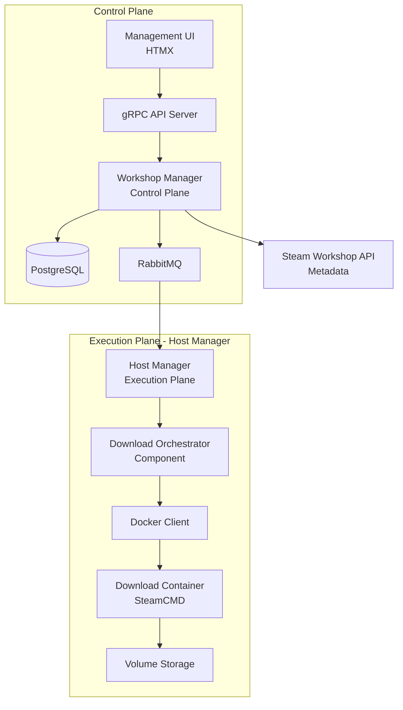

# Design Document: Workshop Addon Management

## Overview

The Workshop Addon Management feature extends ManManV2 to support downloading, installing, tracking, and managing game workshop addons from Steam Workshop. The system provides a library-based approach where administrators can catalog available addons per game, then install them to specific ServerGameConfigs using dedicated download containers.

The design integrates with ManManV2's existing architecture:
- **Database models** for addon libraries and installation tracking
- **Download containers** with SteamCMD for isolated addon downloads
- **Volume strategy integration** for proper path resolution
- **Action system integration** for map selection in games without auto-download support
- **gRPC API** for management operations
- **HTMX UI** for administrative controls

This feature primarily targets older games like Left 4 Dead 2 that require manual workshop downloads, while also providing centralized management for games with native workshop support like CS2.

## Architecture

### System Components



### Component Responsibilities

**Workshop Manager (Control Plane)**
- Manages addon library CRUD operations in database
- Handles Steam Workshop API integration for metadata
- Tracks installation status and history
- Integrates with volume strategies for path resolution
- Handles collection detection and expansion
- Publishes download commands to RabbitMQ for host managers

**Download Orchestrator (Host Manager Component)**
- Lives within the host manager process on execution plane
- Receives download commands via RabbitMQ
- Spawns ephemeral download containers with SteamCMD
- Mounts appropriate volumes from ServerGameConfig
- Monitors download progress and status
- Cleans up containers after completion or failure
- Manages concurrent download limits per server
- Reports progress and status back to control plane via RabbitMQ

**Steam Workshop API Client**
- Fetches addon metadata (name, description, size)
- Detects whether workshop ID is collection or item
- Retrieves collection contents
- Handles API rate limiting and errors

**Database Layer**
- Stores addon library entries per game
- Tracks installations per ServerGameConfig
- Records download history and status
- Manages library-to-library references

## Components and Interfaces

### Database Schema

#### workshop_addons Table

```sql
CREATE TABLE workshop_addons (
    addon_id BIGSERIAL PRIMARY KEY,
    game_id BIGINT NOT NULL REFERENCES games(game_id) ON DELETE CASCADE,
    workshop_id VARCHAR(255) NOT NULL,
    platform_type VARCHAR(50) NOT NULL DEFAULT 'steam_workshop',
    name VARCHAR(500) NOT NULL,
    description TEXT,
    file_size_bytes BIGINT,
    installation_path VARCHAR(1000),
    is_collection BOOLEAN NOT NULL DEFAULT FALSE,
    is_deprecated BOOLEAN NOT NULL DEFAULT FALSE,
    metadata JSONB DEFAULT '{}',
    last_updated TIMESTAMP,
    created_at TIMESTAMP NOT NULL DEFAULT CURRENT_TIMESTAMP,
    updated_at TIMESTAMP NOT NULL DEFAULT CURRENT_TIMESTAMP,
    UNIQUE(game_id, workshop_id, platform_type)
);

CREATE INDEX idx_workshop_addons_game_id ON workshop_addons(game_id);
CREATE INDEX idx_workshop_addons_workshop_id ON workshop_addons(workshop_id);
CREATE INDEX idx_workshop_addons_platform ON workshop_addons(platform_type);
CREATE INDEX idx_workshop_addons_deprecated ON workshop_addons(is_deprecated) WHERE is_deprecated = FALSE;
```

#### workshop_installations Table

```sql
CREATE TABLE workshop_installations (
    installation_id BIGSERIAL PRIMARY KEY,
    sgc_id BIGINT NOT NULL REFERENCES server_game_configs(sgc_id) ON DELETE CASCADE,
    addon_id BIGINT NOT NULL REFERENCES workshop_addons(addon_id) ON DELETE CASCADE,
    status VARCHAR(50) NOT NULL DEFAULT 'pending',
    installation_path VARCHAR(1000) NOT NULL,
    progress_percent INTEGER DEFAULT 0 CHECK (progress_percent >= 0 AND progress_percent <= 100),
    error_message TEXT,
    download_started_at TIMESTAMP,
    download_completed_at TIMESTAMP,
    created_at TIMESTAMP NOT NULL DEFAULT CURRENT_TIMESTAMP,
    updated_at TIMESTAMP NOT NULL DEFAULT CURRENT_TIMESTAMP,
    UNIQUE(sgc_id, addon_id)
);

CREATE INDEX idx_workshop_installations_sgc_id ON workshop_installations(sgc_id);
CREATE INDEX idx_workshop_installations_addon_id ON workshop_installations(addon_id);
CREATE INDEX idx_workshop_installations_status ON workshop_installations(status);

-- Status values: 'pending', 'downloading', 'installed', 'failed', 'removed'
```


#### workshop_libraries Table

```sql
CREATE TABLE workshop_libraries (
    library_id BIGSERIAL PRIMARY KEY,
    game_id BIGINT NOT NULL REFERENCES games(game_id) ON DELETE CASCADE,
    name VARCHAR(255) NOT NULL,
    description TEXT,
    created_at TIMESTAMP NOT NULL DEFAULT CURRENT_TIMESTAMP,
    updated_at TIMESTAMP NOT NULL DEFAULT CURRENT_TIMESTAMP,
    UNIQUE(game_id, name)
);

CREATE INDEX idx_workshop_libraries_game_id ON workshop_libraries(game_id);
```

#### workshop_library_addons Table

```sql
CREATE TABLE workshop_library_addons (
    library_id BIGINT NOT NULL REFERENCES workshop_libraries(library_id) ON DELETE CASCADE,
    addon_id BIGINT NOT NULL REFERENCES workshop_addons(addon_id) ON DELETE CASCADE,
    display_order INTEGER NOT NULL DEFAULT 0,
    created_at TIMESTAMP NOT NULL DEFAULT CURRENT_TIMESTAMP,
    PRIMARY KEY (library_id, addon_id)
);

CREATE INDEX idx_workshop_library_addons_library_id ON workshop_library_addons(library_id);
CREATE INDEX idx_workshop_library_addons_addon_id ON workshop_library_addons(addon_id);
```

#### workshop_library_references Table

```sql
CREATE TABLE workshop_library_references (
    parent_library_id BIGINT NOT NULL REFERENCES workshop_libraries(library_id) ON DELETE CASCADE,
    child_library_id BIGINT NOT NULL REFERENCES workshop_libraries(library_id) ON DELETE CASCADE,
    created_at TIMESTAMP NOT NULL DEFAULT CURRENT_TIMESTAMP,
    PRIMARY KEY (parent_library_id, child_library_id),
    CHECK (parent_library_id != child_library_id)
);

CREATE INDEX idx_workshop_library_refs_parent ON workshop_library_references(parent_library_id);
CREATE INDEX idx_workshop_library_refs_child ON workshop_library_references(child_library_id);
```

### Go Models

```go
// WorkshopAddon represents a workshop addon in the library
type WorkshopAddon struct {
    AddonID          int64     `db:"addon_id"`
    GameID           int64     `db:"game_id"`
    WorkshopID       string    `db:"workshop_id"`
    PlatformType     string    `db:"platform_type"`
    Name             string    `db:"name"`
    Description      *string   `db:"description"`
    FileSizeBytes    *int64    `db:"file_size_bytes"`
    InstallationPath *string   `db:"installation_path"`
    IsCollection     bool      `db:"is_collection"`
    IsDeprecated     bool      `db:"is_deprecated"`
    Metadata         JSONB     `db:"metadata"`
    LastUpdated      *time.Time `db:"last_updated"`
    CreatedAt        time.Time `db:"created_at"`
    UpdatedAt        time.Time `db:"updated_at"`
}


// WorkshopInstallation represents an addon installed on a ServerGameConfig
type WorkshopInstallation struct {
    InstallationID       int64      `db:"installation_id"`
    SGCID                int64      `db:"sgc_id"`
    AddonID              int64      `db:"addon_id"`
    Status               string     `db:"status"`
    InstallationPath     string     `db:"installation_path"`
    ProgressPercent      int        `db:"progress_percent"`
    ErrorMessage         *string    `db:"error_message"`
    DownloadStartedAt    *time.Time `db:"download_started_at"`
    DownloadCompletedAt  *time.Time `db:"download_completed_at"`
    CreatedAt            time.Time  `db:"created_at"`
    UpdatedAt            time.Time  `db:"updated_at"`
}

// WorkshopLibrary represents a collection of workshop addons
type WorkshopLibrary struct {
    LibraryID   int64     `db:"library_id"`
    GameID      int64     `db:"game_id"`
    Name        string    `db:"name"`
    Description *string   `db:"description"`
    CreatedAt   time.Time `db:"created_at"`
    UpdatedAt   time.Time `db:"updated_at"`
}

// Status constants
const (
    InstallationStatusPending     = "pending"
    InstallationStatusDownloading = "downloading"
    InstallationStatusInstalled   = "installed"
    InstallationStatusFailed      = "failed"
    InstallationStatusRemoved     = "removed"
    
    PlatformTypeSteamWorkshop = "steam_workshop"
)
```

### Repository Interfaces

```go
// WorkshopAddonRepository defines operations for workshop addon management
type WorkshopAddonRepository interface {
    Create(ctx context.Context, addon *manman.WorkshopAddon) (*manman.WorkshopAddon, error)
    Get(ctx context.Context, addonID int64) (*manman.WorkshopAddon, error)
    GetByWorkshopID(ctx context.Context, gameID int64, workshopID string, platformType string) (*manman.WorkshopAddon, error)
    List(ctx context.Context, gameID *int64, includeDeprecated bool, limit, offset int) ([]*manman.WorkshopAddon, error)
    Update(ctx context.Context, addon *manman.WorkshopAddon) error
    Delete(ctx context.Context, addonID int64) error
}

// WorkshopInstallationRepository defines operations for installation tracking
type WorkshopInstallationRepository interface {
    Create(ctx context.Context, installation *manman.WorkshopInstallation) (*manman.WorkshopInstallation, error)
    Get(ctx context.Context, installationID int64) (*manman.WorkshopInstallation, error)
    GetBySGCAndAddon(ctx context.Context, sgcID, addonID int64) (*manman.WorkshopInstallation, error)
    ListBySGC(ctx context.Context, sgcID int64, limit, offset int) ([]*manman.WorkshopInstallation, error)
    ListByAddon(ctx context.Context, addonID int64, limit, offset int) ([]*manman.WorkshopInstallation, error)
    UpdateStatus(ctx context.Context, installationID int64, status string, errorMsg *string) error
    UpdateProgress(ctx context.Context, installationID int64, percent int) error
    Delete(ctx context.Context, installationID int64) error
}


// WorkshopLibraryRepository defines operations for library management
type WorkshopLibraryRepository interface {
    Create(ctx context.Context, library *manman.WorkshopLibrary) (*manman.WorkshopLibrary, error)
    Get(ctx context.Context, libraryID int64) (*manman.WorkshopLibrary, error)
    List(ctx context.Context, gameID *int64, limit, offset int) ([]*manman.WorkshopLibrary, error)
    Update(ctx context.Context, library *manman.WorkshopLibrary) error
    Delete(ctx context.Context, libraryID int64) error
    
    AddAddon(ctx context.Context, libraryID, addonID int64, displayOrder int) error
    RemoveAddon(ctx context.Context, libraryID, addonID int64) error
    ListAddons(ctx context.Context, libraryID int64) ([]*manman.WorkshopAddon, error)
    
    AddReference(ctx context.Context, parentLibraryID, childLibraryID int64) error
    RemoveReference(ctx context.Context, parentLibraryID, childLibraryID int64) error
    ListReferences(ctx context.Context, libraryID int64) ([]*manman.WorkshopLibrary, error)
    DetectCircularReference(ctx context.Context, parentLibraryID, childLibraryID int64) (bool, error)
}
```

### gRPC API Service

```protobuf
service WorkshopService {
    // Addon Library Management
    rpc CreateAddon(CreateAddonRequest) returns (CreateAddonResponse);
    rpc GetAddon(GetAddonRequest) returns (GetAddonResponse);
    rpc ListAddons(ListAddonsRequest) returns (ListAddonsResponse);
    rpc UpdateAddon(UpdateAddonRequest) returns (UpdateAddonResponse);
    rpc DeleteAddon(DeleteAddonRequest) returns (DeleteAddonResponse);
    rpc FetchAddonMetadata(FetchAddonMetadataRequest) returns (FetchAddonMetadataResponse);
    
    // Installation Management
    rpc InstallAddon(InstallAddonRequest) returns (InstallAddonResponse);
    rpc GetInstallation(GetInstallationRequest) returns (GetInstallationResponse);
    rpc ListInstallations(ListInstallationsRequest) returns (ListInstallationsResponse);
    rpc RemoveInstallation(RemoveInstallationRequest) returns (RemoveInstallationResponse);
    
    // Library Management
    rpc CreateLibrary(CreateLibraryRequest) returns (CreateLibraryResponse);
    rpc GetLibrary(GetLibraryRequest) returns (GetLibraryResponse);
    rpc ListLibraries(ListLibrariesRequest) returns (ListLibrariesResponse);
    rpc UpdateLibrary(UpdateLibraryRequest) returns (UpdateLibraryResponse);
    rpc DeleteLibrary(DeleteLibraryRequest) returns (DeleteLibraryResponse);
    rpc AddAddonToLibrary(AddAddonToLibraryRequest) returns (AddAddonToLibraryResponse);
    rpc RemoveAddonFromLibrary(RemoveAddonFromLibraryRequest) returns (RemoveAddonFromLibraryResponse);
    rpc AddLibraryReference(AddLibraryReferenceRequest) returns (AddLibraryReferenceResponse);
}

message WorkshopAddon {
    int64 addon_id = 1;
    int64 game_id = 2;
    string workshop_id = 3;
    string platform_type = 4;
    string name = 5;
    string description = 6;
    int64 file_size_bytes = 7;
    string installation_path = 8;
    bool is_collection = 9;
    bool is_deprecated = 10;
    google.protobuf.Struct metadata = 11;
    google.protobuf.Timestamp last_updated = 12;
    google.protobuf.Timestamp created_at = 13;
    google.protobuf.Timestamp updated_at = 14;
}


message WorkshopInstallation {
    int64 installation_id = 1;
    int64 sgc_id = 2;
    int64 addon_id = 3;
    string status = 4;
    string installation_path = 5;
    int32 progress_percent = 6;
    string error_message = 7;
    google.protobuf.Timestamp download_started_at = 8;
    google.protobuf.Timestamp download_completed_at = 9;
    google.protobuf.Timestamp created_at = 10;
    google.protobuf.Timestamp updated_at = 11;
}

message InstallAddonRequest {
    int64 sgc_id = 1;
    int64 addon_id = 2;
    bool force_reinstall = 3;
}
```

### Workshop Manager Service

```go
// WorkshopManager orchestrates workshop addon operations
type WorkshopManager struct {
    addonRepo        WorkshopAddonRepository
    installationRepo WorkshopInstallationRepository
    libraryRepo      WorkshopLibraryRepository
    sgcRepo          ServerGameConfigRepository
    strategyRepo     ConfigurationStrategyRepository
    downloadOrch     *DownloadOrchestrator
    steamClient      *SteamWorkshopClient
}

// InstallAddon downloads and installs an addon to a ServerGameConfig
func (wm *WorkshopManager) InstallAddon(ctx context.Context, sgcID, addonID int64, forceReinstall bool) (*WorkshopInstallation, error) {
    // 1. Check if already installed
    existing, err := wm.installationRepo.GetBySGCAndAddon(ctx, sgcID, addonID)
    if err == nil && existing.Status == InstallationStatusInstalled && !forceReinstall {
        return existing, nil // Already installed
    }
    
    // 2. Get addon details
    addon, err := wm.addonRepo.Get(ctx, addonID)
    if err != nil {
        return nil, err
    }
    
    // 3. Get SGC and resolve volume paths
    sgc, err := wm.sgcRepo.Get(ctx, sgcID)
    if err != nil {
        return nil, err
    }
    
    // 4. Resolve installation path from volume strategies
    installPath, err := wm.resolveInstallationPath(ctx, sgc, addon)
    if err != nil {
        return nil, err
    }
    
    // 5. Create or update installation record
    installation := &WorkshopInstallation{
        SGCID:            sgcID,
        AddonID:          addonID,
        Status:           InstallationStatusPending,
        InstallationPath: installPath,
        ProgressPercent:  0,
    }
    
    if existing != nil {
        installation.InstallationID = existing.InstallationID
        err = wm.installationRepo.UpdateStatus(ctx, installation.InstallationID, InstallationStatusPending, nil)
    } else {
        installation, err = wm.installationRepo.Create(ctx, installation)
    }
    if err != nil {
        return nil, err
    }
    
    // 6. Publish download command to RabbitMQ for host manager
    downloadCmd := &DownloadAddonCommand{
        InstallationID: installation.InstallationID,
        SGCID:          sgcID,
        AddonID:        addonID,
        WorkshopID:     addon.WorkshopID,
        SteamAppID:     addon.Metadata["steam_app_id"].(string),
        InstallPath:    installPath,
    }
    
    err = wm.rmqPublisher.PublishDownloadCommand(ctx, sgc.ServerID, downloadCmd)
    if err != nil {
        return nil, fmt.Errorf("failed to publish download command: %w", err)
    }
    
    return installation, nil
}


// resolveInstallationPath determines the target path for addon installation
func (wm *WorkshopManager) resolveInstallationPath(ctx context.Context, sgc *ServerGameConfig, addon *WorkshopAddon) (string, error) {
    // Get volume strategies for the game
    strategies, err := wm.strategyRepo.ListByGame(ctx, sgc.GameID)
    if err != nil {
        return "", err
    }
    
    // Find volume strategy (should be only one or use apply_order)
    var volumeStrategy *ConfigurationStrategy
    for _, s := range strategies {
        if s.StrategyType == StrategyTypeVolume {
            volumeStrategy = s
            break
        }
    }
    
    if volumeStrategy == nil {
        return "", fmt.Errorf("no volume strategy found for game")
    }
    
    // Combine volume target path with addon installation path
    basePath := volumeStrategy.TargetPath
    if basePath == nil {
        return "", fmt.Errorf("volume strategy missing target_path")
    }
    
    addonPath := addon.InstallationPath
    if addonPath == nil || *addonPath == "" {
        return "", fmt.Errorf("addon missing installation_path")
    }
    
    // Resolve to absolute path
    fullPath := filepath.Join(*basePath, *addonPath)
    return fullPath, nil
}

// FetchAndCreateAddon fetches metadata from Steam Workshop and creates addon
func (wm *WorkshopManager) FetchAndCreateAddon(ctx context.Context, gameID int64, workshopID string) (*WorkshopAddon, error) {
    // Fetch metadata from Steam Workshop API
    metadata, err := wm.steamClient.GetWorkshopItemDetails(ctx, workshopID)
    if err != nil {
        return nil, fmt.Errorf("failed to fetch workshop metadata: %w", err)
    }
    
    addon := &WorkshopAddon{
        GameID:        gameID,
        WorkshopID:    workshopID,
        PlatformType:  PlatformTypeSteamWorkshop,
        Name:          metadata.Title,
        Description:   &metadata.Description,
        FileSizeBytes: &metadata.FileSize,
        IsCollection:  metadata.IsCollection,
        LastUpdated:   &metadata.TimeUpdated,
    }
    
    // If collection, fetch all items
    if metadata.IsCollection {
        items, err := wm.steamClient.GetCollectionDetails(ctx, workshopID)
        if err != nil {
            return nil, fmt.Errorf("failed to fetch collection details: %w", err)
        }
        
        // Store collection items in metadata
        addon.Metadata = JSONB{
            "collection_items": items,
        }
    }
    
    return wm.addonRepo.Create(ctx, addon)
}
```

## Data Models

### WorkshopAddon Metadata Structure

The `metadata` JSONB field stores platform-specific information:

```json
{
  "collection_items": [
    {"workshop_id": "123456", "title": "Map 1"},
    {"workshop_id": "789012", "title": "Map 2"}
  ],
  "steam_app_id": "550",
  "tags": ["map", "campaign"],
  "author": "username",
  "preview_url": "https://..."
}
```


### Download Orchestrator (Host Manager Component)

The Download Orchestrator is a component within the host manager that handles workshop addon downloads on the execution plane.

```go
// DownloadOrchestrator manages download container lifecycle within host manager
type DownloadOrchestrator struct {
    dockerClient     *docker.Client
    grpcClient       pb.ManManAPIClient  // For updating installation status
    serverID         int64
    environment      string
    hostDataDir      string
    maxConcurrent    int
    semaphore        chan struct{}
    rmqPublisher     interface {
        PublishInstallationStatus(ctx context.Context, update *InstallationStatusUpdate) error
    }
}

// DownloadAddonCommand is received via RabbitMQ from control plane
type DownloadAddonCommand struct {
    InstallationID int64  `json:"installation_id"`
    SGCID          int64  `json:"sgc_id"`
    AddonID        int64  `json:"addon_id"`
    WorkshopID     string `json:"workshop_id"`
    SteamAppID     string `json:"steam_app_id"`
    InstallPath    string `json:"install_path"`
}

// InstallationStatusUpdate is published back to control plane
type InstallationStatusUpdate struct {
    InstallationID  int64   `json:"installation_id"`
    Status          string  `json:"status"`
    ProgressPercent int     `json:"progress_percent"`
    ErrorMessage    *string `json:"error_message"`
}

// HandleDownloadCommand processes download commands from RabbitMQ
func (do *DownloadOrchestrator) HandleDownloadCommand(ctx context.Context, cmd *DownloadAddonCommand) {
    // Check for duplicate in-progress downloads for this installation
    if do.isDownloadInProgress(cmd.InstallationID) {
        log.Printf("Download already in progress for installation %d, skipping duplicate", cmd.InstallationID)
        return
    }
    
    // Mark download as in progress
    do.markDownloadInProgress(cmd.InstallationID)
    defer do.markDownloadComplete(cmd.InstallationID)
    
    // Acquire semaphore for concurrency control
    do.semaphore <- struct{}{}
    defer func() { <-do.semaphore }()
    
    // Update status to downloading
    do.publishStatus(ctx, cmd.InstallationID, InstallationStatusDownloading, 0, nil)
    
    // Build download container configuration with environment-aware naming
    containerName := do.getDownloadContainerName(cmd.SGCID, cmd.AddonID)
    
    // Check if container already exists (cleanup from previous failed attempt)
    existing, err := do.dockerClient.GetContainer(ctx, containerName)
    if err == nil && existing != nil {
        log.Printf("Cleaning up existing download container %s", containerName)
        do.dockerClient.RemoveContainer(ctx, existing.ID, true)
    }
    
    // Resolve volume mounts from SGC
    volumeMounts, err := do.resolveVolumeMounts(ctx, cmd.SGCID)
    if err != nil {
        do.handleDownloadError(ctx, cmd.InstallationID, err)
        return
    }
    
    // Build SteamCMD command
    steamCmd := do.buildSteamCMDCommand(cmd.SteamAppID, cmd.WorkshopID)
    
    // Create container
    containerID, err := do.dockerClient.CreateContainer(ctx, &docker.ContainerConfig{
        Name:    containerName,
        Image:   "steamcmd/steamcmd:latest",
        Command: steamCmd,
        Volumes: volumeMounts,
        Env:     []string{},
    })
    if err != nil {
        do.handleDownloadError(ctx, cmd.InstallationID, err)
        return
    }
    
    // Start container
    err = do.dockerClient.StartContainer(ctx, containerID)
    if err != nil {
        do.handleDownloadError(ctx, cmd.InstallationID, err)
        return
    }
    
    // Monitor container logs for progress
    logReader, err := do.dockerClient.GetContainerLogs(ctx, containerID, true, true)
    if err != nil {
        do.handleDownloadError(ctx, cmd.InstallationID, err)
        return
    }
    defer logReader.Close()
    
    // Parse logs and update progress
    scanner := bufio.NewScanner(logReader)
    for scanner.Scan() {
        line := scanner.Text()
        if progress := do.parseProgress(line); progress > 0 {
            do.publishStatus(ctx, cmd.InstallationID, InstallationStatusDownloading, progress, nil)
        }
    }
    
    // Wait for container to complete
    exitCode, err := do.dockerClient.WaitContainer(ctx, containerID)
    
    // Clean up container
    do.dockerClient.RemoveContainer(ctx, containerID, true)
    
    // Update installation status
    if err != nil || exitCode != 0 {
        errMsg := fmt.Sprintf("download failed with exit code %d", exitCode)
        do.publishStatus(ctx, cmd.InstallationID, InstallationStatusFailed, 0, &errMsg)
    } else {
        do.publishStatus(ctx, cmd.InstallationID, InstallationStatusInstalled, 100, nil)
    }
}

// getDownloadContainerName generates environment-aware container name
func (do *DownloadOrchestrator) getDownloadContainerName(sgcID, addonID int64) string {
    if do.environment != "" {
        return fmt.Sprintf("workshop-download-%s-%d-%d", do.environment, sgcID, addonID)
    }
    return fmt.Sprintf("workshop-download-%d-%d", sgcID, addonID)
}

// In-progress download tracking to prevent duplicates
var (
    inProgressMutex sync.RWMutex
    inProgressDownloads = make(map[int64]bool)
)

func (do *DownloadOrchestrator) isDownloadInProgress(installationID int64) bool {
    inProgressMutex.RLock()
    defer inProgressMutex.RUnlock()
    return inProgressDownloads[installationID]
}

func (do *DownloadOrchestrator) markDownloadInProgress(installationID int64) {
    inProgressMutex.Lock()
    defer inProgressMutex.Unlock()
    inProgressDownloads[installationID] = true
}

func (do *DownloadOrchestrator) markDownloadComplete(installationID int64) {
    inProgressMutex.Lock()
    defer inProgressMutex.Unlock()
    delete(inProgressDownloads, installationID)
}

// publishStatus sends status updates back to control plane via RabbitMQ
func (do *DownloadOrchestrator) publishStatus(ctx context.Context, installationID int64, status string, progress int, errorMsg *string) {
    update := &InstallationStatusUpdate{
        InstallationID:  installationID,
        Status:          status,
        ProgressPercent: progress,
        ErrorMessage:    errorMsg,
    }
    do.rmqPublisher.PublishInstallationStatus(ctx, update)
}


// resolveVolumeMounts gets volume mounts from SGC configuration
func (do *DownloadOrchestrator) resolveVolumeMounts(ctx context.Context, sgcID int64) ([]docker.VolumeMount, error) {
    // Get SGC data directory on host
    sgcDataDir := do.getSGCHostDir(sgcID)
    
    // Mount the SGC data directory to the download container
    // This allows the download container to write to the same volumes as the game container
    return []docker.VolumeMount{
        {
            Source:      sgcDataDir,
            Destination: "/data",
            ReadOnly:    false,
        },
    }, nil
}

// buildSteamCMDCommand constructs the SteamCMD command for downloading
func (do *DownloadOrchestrator) buildSteamCMDCommand(steamAppID, workshopID string) []string {
    return []string{
        "/bin/bash",
        "-c",
        fmt.Sprintf(
            "steamcmd +login anonymous +workshop_download_item %s %s +quit",
            steamAppID,
            workshopID,
        ),
    }
}

// parseProgress extracts download progress from SteamCMD output
func (do *DownloadOrchestrator) parseProgress(logLine string) int {
    // SteamCMD outputs progress like: "Downloading item 123456 ... 45%"
    re := regexp.MustCompile(`(\d+)%`)
    matches := re.FindStringSubmatch(logLine)
    if len(matches) > 1 {
        percent, _ := strconv.Atoi(matches[1])
        return percent
    }
    return 0
}

// getSGCHostDir returns the host path for SGC data
func (do *DownloadOrchestrator) getSGCHostDir(sgcID int64) string {
    dirName := fmt.Sprintf("sgc-%d", sgcID)
    if do.environment != "" {
        dirName = fmt.Sprintf("sgc-%s-%d", do.environment, sgcID)
    }
    return filepath.Join(do.hostDataDir, dirName)
}

func (do *DownloadOrchestrator) handleDownloadError(ctx context.Context, installationID int64, err error) {
    errMsg := err.Error()
    do.publishStatus(ctx, installationID, InstallationStatusFailed, 0, &errMsg)
}
```

### RabbitMQ Message Flow

**Download Command Flow**
1. Control plane (Workshop Manager) publishes `DownloadAddonCommand` to server-specific queue
2. Host manager on execution plane consumes command
3. Download Orchestrator component handles the download
4. Progress updates published back to control plane via `InstallationStatusUpdate` messages
5. Control plane updates database with status and progress

**Message Routing**
- Download commands routed to: `manman.server.{server_id}.workshop.download`
- Status updates published to: `manman.workshop.installation.status`
- Control plane consumes status updates and updates database

```go
// RabbitMQ message handlers in host manager
func (hm *HostManager) setupWorkshopHandlers() {
    hm.rmqConsumer.Subscribe("workshop.download", func(msg []byte) error {
        var cmd DownloadAddonCommand
        if err := json.Unmarshal(msg, &cmd); err != nil {
            return err
        }
        go hm.downloadOrch.HandleDownloadCommand(context.Background(), &cmd)
        return nil
    })
}

// RabbitMQ message handlers in control plane
func (api *APIServer) setupWorkshopStatusHandler() {
    api.rmqConsumer.Subscribe("workshop.installation.status", func(msg []byte) error {
        var update InstallationStatusUpdate
        if err := json.Unmarshal(msg, &update); err != nil {
            return err
        }
        
        // Update database with status
        if update.ErrorMessage != nil {
            api.installationRepo.UpdateStatus(context.Background(), update.InstallationID, update.Status, update.ErrorMessage)
        } else {
            api.installationRepo.UpdateStatus(context.Background(), update.InstallationID, update.Status, nil)
            api.installationRepo.UpdateProgress(context.Background(), update.InstallationID, update.ProgressPercent)
        }
        
        return nil
    })
}
```

### Steam Workshop API Client

```go
// SteamWorkshopClient interacts with Steam Workshop API
type SteamWorkshopClient struct {
    apiKey     string
    httpClient *http.Client
}

type WorkshopItemMetadata struct {
    WorkshopID   string
    Title        string
    Description  string
    FileSize     int64
    TimeUpdated  time.Time
    IsCollection bool
}

type CollectionItem struct {
    WorkshopID string `json:"publishedfileid"`
    Title      string `json:"title"`
}

// GetWorkshopItemDetails fetches metadata for a workshop item
func (swc *SteamWorkshopClient) GetWorkshopItemDetails(ctx context.Context, workshopID string) (*WorkshopItemMetadata, error) {
    url := "https://api.steampowered.com/ISteamRemoteStorage/GetPublishedFileDetails/v1/"
    
    data := url.Values{}
    data.Set("itemcount", "1")
    data.Set("publishedfileids[0]", workshopID)
    
    resp, err := swc.httpClient.PostForm(url, data)
    if err != nil {
        return nil, err
    }
    defer resp.Body.Close()
    
    var result struct {
        Response struct {
            PublishedFileDetails []struct {
                PublishedFileID string `json:"publishedfileid"`
                Title           string `json:"title"`
                Description     string `json:"file_description"`
                FileSize        int64  `json:"file_size"`
                TimeUpdated     int64  `json:"time_updated"`
                FileType        int    `json:"file_type"` // 2 = collection
            } `json:"publishedfiledetails"`
        } `json:"response"`
    }
    
    if err := json.NewDecoder(resp.Body).Decode(&result); err != nil {
        return nil, err
    }
    
    if len(result.Response.PublishedFileDetails) == 0 {
        return nil, fmt.Errorf("workshop item not found")
    }
    
    item := result.Response.PublishedFileDetails[0]
    return &WorkshopItemMetadata{
        WorkshopID:   item.PublishedFileID,
        Title:        item.Title,
        Description:  item.Description,
        FileSize:     item.FileSize,
        TimeUpdated:  time.Unix(item.TimeUpdated, 0),
        IsCollection: item.FileType == 2,
    }, nil
}

// GetCollectionDetails fetches all items in a collection
func (swc *SteamWorkshopClient) GetCollectionDetails(ctx context.Context, collectionID string) ([]CollectionItem, error) {
    url := "https://api.steampowered.com/ISteamRemoteStorage/GetCollectionDetails/v1/"
    
    data := url.Values{}
    data.Set("collectioncount", "1")
    data.Set("publishedfileids[0]", collectionID)
    
    resp, err := swc.httpClient.PostForm(url, data)
    if err != nil {
        return nil, err
    }
    defer resp.Body.Close()
    
    var result struct {
        Response struct {
            CollectionDetails []struct {
                Children []CollectionItem `json:"children"`
            } `json:"collectiondetails"`
        } `json:"response"`
    }
    
    if err := json.NewDecoder(resp.Body).Decode(&result); err != nil {
        return nil, err
    }
    
    if len(result.Response.CollectionDetails) == 0 {
        return nil, fmt.Errorf("collection not found")
    }
    
    return result.Response.CollectionDetails[0].Children, nil
}
```


## Correctness Properties

A property is a characteristic or behavior that should hold true across all valid executions of a system—essentially, a formal statement about what the system should do. Properties serve as the bridge between human-readable specifications and machine-verifiable correctness guarantees.

### Property 1: Addon Storage Round Trip
*For any* valid workshop addon with all required fields (game_id, workshop_id, name, platform_type), storing it to the database then retrieving it should produce an equivalent addon with all fields preserved.
**Validates: Requirements 1.1, 1.3, 1.6**

### Property 2: Workshop ID Uniqueness Per Game
*For any* game and workshop ID combination, attempting to create multiple addons with the same game_id and workshop_id should result in only one addon being stored, with subsequent attempts rejected.
**Validates: Requirements 1.2**

### Property 3: Game Filtering Correctness
*For any* set of workshop addons across multiple games, querying by a specific game_id should return only addons associated with that game_id and no others.
**Validates: Requirements 1.4**

### Property 4: Metadata Update Independence
*For any* installed addon, updating its metadata (name, description) should not affect any existing installation records or trigger re-downloads.
**Validates: Requirements 1.5**

### Property 5: Deprecated Addon Exclusion
*For any* addon marked as deprecated, it should be excluded from default listing queries but still retrievable by direct ID lookup.
**Validates: Requirements 1.7**

### Property 6: Installation Idempotency
*For any* ServerGameConfig and addon combination, requesting installation multiple times should result in only one installation record and one download operation (unless force_reinstall is specified).
**Validates: Requirements 2.2**

### Property 7: Installation Record Completeness
*For any* workshop installation, all required metadata fields (sgc_id, addon_id, status, installation_path, timestamps) should be stored and retrievable.
**Validates: Requirements 2.1, 2.3**

### Property 8: SGC Installation Query Completeness
*For any* ServerGameConfig with N installed addons, querying installations for that SGC should return exactly N installation records.
**Validates: Requirements 2.5**

### Property 9: Addon Installation Query Completeness
*For any* addon installed on N ServerGameConfigs, querying installations for that addon should return exactly N installation records.
**Validates: Requirements 2.6**

### Property 10: Cascade Delete Consistency
*For any* ServerGameConfig with installed addons, deleting the SGC should result in all associated installation records being deleted or marked as orphaned.
**Validates: Requirements 2.7**

### Property 11: Path Resolution Consistency
*For any* ServerGameConfig with a volume strategy and addon with installation_path, resolving the full installation path should consistently combine the volume target_path with the addon installation_path.
**Validates: Requirements 3.2, 3.3, 4.2, 4.3**

### Property 12: Download Status Transitions
*For any* installation, the status should transition through valid states only: pending → downloading → installed (success) or pending → downloading → failed (failure), never skipping states or moving backwards.
**Validates: Requirements 3.5, 12.5, 12.6, 12.7**

### Property 13: Concurrent Download Isolation
*For any* set of concurrent download requests for different ServerGameConfigs, each download should complete independently without interfering with others' file paths or status updates.
**Validates: Requirements 3.7**

### Property 14: Volume Strategy Validation
*For any* download request, if no volume strategy of type "volume" exists for the game, the download should be rejected with a validation error.
**Validates: Requirements 4.1, 4.4**

### Property 15: Volume Mount Consistency
*For any* download container spawned for an SGC, the volume mounts should match the SGC's data directory paths.
**Validates: Requirements 5.2, 5.3**

### Property 16: Container Cleanup Guarantee
*For any* download operation (successful or failed), the download container should be removed after completion.
**Validates: Requirements 5.4, 5.6**

### Property 17: API CRUD Completeness
*For any* workshop addon, the API should support creating, reading, updating, and deleting it, with each operation correctly modifying the database state.
**Validates: Requirements 6.1**

### Property 18: Installation List Filtering
*For any* ServerGameConfig, the API endpoint for listing installations should return only installations associated with that SGC.
**Validates: Requirements 6.4**

### Property 19: Action Addon Reference Validity
*For any* action definition referencing an addon, executing the action should verify the addon is installed on the target SGC before execution.
**Validates: Requirements 7.4**

### Property 20: Action Template Rendering
*For any* action command template with addon metadata variables, rendering the template should substitute all variables with the corresponding addon metadata values.
**Validates: Requirements 7.3, 7.6**

### Property 21: Dynamic Action Options Synchronization
*For any* ServerGameConfig, the available action input options for map selection should reflect the currently installed addons (adding/removing addons updates options).
**Validates: Requirements 7.2, 7.5**

### Property 22: SteamCMD Command Format
*For any* Steam Workshop addon, the generated SteamCMD command should follow the format: `steamcmd +login anonymous +workshop_download_item <app_id> <workshop_id> +quit`.
**Validates: Requirements 8.1, 8.2**

### Property 23: SteamCMD Output Parsing
*For any* SteamCMD output containing progress indicators, the parser should correctly extract progress percentages.
**Validates: Requirements 8.4, 12.2**

### Property 24: SteamCMD Error Handling
*For any* SteamCMD error output (network failure, invalid workshop ID, auth failure), the system should detect the error type and update installation status to failed with appropriate error message.
**Validates: Requirements 8.5**

### Property 25: Metadata Fetch Round Trip
*For any* valid workshop ID, fetching metadata from Steam Workshop API should return an addon with name, description, file_size, and last_updated fields populated.
**Validates: Requirements 9.2**

### Property 26: Metadata Caching Efficiency
*For any* workshop ID, fetching metadata multiple times within a cache window should result in only one API call, with subsequent fetches returning cached data.
**Validates: Requirements 9.4**

### Property 27: Addon Removal Completeness
*For any* installed addon, removing it should delete the installation record and the addon files from storage.
**Validates: Requirements 10.2, 10.3**

### Property 28: Active Session Protection
*For any* addon installed on an SGC with an active session, attempting to remove the addon should be rejected with a validation error.
**Validates: Requirements 10.5**

### Property 29: Bulk Removal Atomicity
*For any* set of N addons to remove from an SGC, the bulk removal operation should either remove all N addons or fail completely without partial removal.
**Validates: Requirements 10.6**

### Property 30: Platform Type Storage
*For any* workshop addon, the platform_type field should be stored and retrievable, defaulting to "steam_workshop" if not specified.
**Validates: Requirements 11.1**

### Property 31: Workshop ID Format Validation
*For any* platform type, workshop IDs should be validated according to platform-specific format rules (e.g., Steam Workshop IDs are numeric strings).
**Validates: Requirements 11.3**

### Property 32: Progress Monotonicity
*For any* download in progress, progress percentage updates should be monotonically increasing (never decreasing) from 0 to 100.
**Validates: Requirements 12.1**

### Property 33: Collection Detection
*For any* workshop ID, the system should correctly identify whether it represents a collection or individual item based on Steam Workshop API response.
**Validates: Requirements 14.1**

### Property 34: Collection Expansion
*For any* workshop collection with N items, downloading the collection should result in N addon library entries being created.
**Validates: Requirements 14.2, 14.3**

### Property 35: Library Addon Association
*For any* custom library with N addons added, querying the library should return exactly N addons in the specified display order.
**Validates: Requirements 14.4**

### Property 36: Library Reference Acyclicity
*For any* two libraries A and B, if A references B, then B should not reference A (directly or transitively), preventing circular references.
**Validates: Requirements 14.6**

### Property 37: Library Reference Resolution
*For any* library that references M other libraries containing a total of N addons, resolving all addons should return exactly N unique addons.
**Validates: Requirements 14.7**

### Property 38: Retry Exponential Backoff
*For any* failed download with retryable errors, retry attempts should occur with exponentially increasing delays (e.g., 1s, 2s, 4s).
**Validates: Requirements 15.2**

### Property 39: Retry Limit Enforcement
*For any* download failing with retryable errors, the system should attempt exactly 3 retries before marking as permanently failed.
**Validates: Requirements 15.1**

### Property 40: Error Classification Correctness
*For any* download error, the system should correctly classify it as retryable (network errors) or permanent (invalid workshop ID), with permanent errors not triggering retries.
**Validates: Requirements 15.4, 15.5**

### Property 41: Path Traversal Prevention
*For any* workshop ID containing path traversal sequences (../, ..\, etc.), the system should reject it during validation.
**Validates: Requirements 16.2**

### Property 42: Metadata Sanitization
*For any* addon metadata containing HTML/JavaScript, the system should sanitize it before storage to prevent XSS attacks.
**Validates: Requirements 16.3**

### Property 43: Installation Path Boundary Validation
*For any* resolved installation path, it should remain within the allowed volume boundaries and not escape to parent directories.
**Validates: Requirements 16.5**

### Property 44: Audit Log Completeness
*For any* addon management operation (create, update, delete, install, remove), an audit log entry should be created with timestamp, operation type, and user.
**Validates: Requirements 16.6, 10.7**

### Property 45: Concurrent Download Limit Enforcement
*For any* server with max_concurrent_downloads set to N, attempting to start more than N downloads simultaneously should queue additional downloads until slots are available.
**Validates: Requirements 17.1**

### Property 46: Disk Space Validation
*For any* download request, if available disk space is less than the addon file_size_bytes, the download should be rejected with an insufficient space error.
**Validates: Requirements 17.3**

### Property 47: Temporary File Cleanup
*For any* download operation, all temporary files created during the download should be removed after completion or failure.
**Validates: Requirements 17.4**

### Property 48: Download Priority Ordering
*For any* set of queued downloads with different priority levels, downloads should be executed in priority order (highest priority first).
**Validates: Requirements 17.6**


## Error Handling

### Database Errors

**Constraint Violations**
- Unique constraint violations (duplicate workshop_id per game) return HTTP 409 Conflict
- Foreign key violations (invalid game_id, sgc_id) return HTTP 400 Bad Request
- All database errors are logged with full context for debugging

**Transaction Management**
- Multi-step operations (collection expansion, bulk removal) use database transactions
- Transaction failures trigger rollback to maintain consistency
- Retry logic for transient database connection errors

### Download Errors

**Network Failures**
- Classified as retryable errors
- Automatic retry with exponential backoff (1s, 2s, 4s)
- Maximum 3 retry attempts before marking as failed
- Error message includes network error details

**Invalid Workshop IDs**
- Classified as permanent errors
- No retry attempts
- Installation marked as failed immediately
- Error message indicates invalid workshop ID

**Container Failures**
- Download container creation failures logged and reported
- Container execution failures captured from exit codes
- Container cleanup guaranteed even on failure
- Error messages include container logs for debugging

**Disk Space Exhaustion**
- Pre-download validation checks available disk space
- Downloads rejected if insufficient space
- Error message indicates required vs available space
- Cleanup of partial downloads on space errors

### API Errors

**Authentication Failures**
- HTTP 401 Unauthorized for missing/invalid credentials
- HTTP 403 Forbidden for insufficient permissions
- Clear error messages indicating required permissions

**Validation Errors**
- HTTP 400 Bad Request for invalid input
- Detailed error messages indicating which fields are invalid
- Path traversal attempts logged as security events

**Not Found Errors**
- HTTP 404 Not Found for non-existent resources
- Error messages indicate resource type and ID

**Conflict Errors**
- HTTP 409 Conflict for duplicate resources
- HTTP 409 Conflict for operations on active sessions
- Error messages explain the conflict

### Steam Workshop API Errors

**Rate Limiting**
- Respect Steam API rate limits
- Implement exponential backoff for rate limit errors
- Cache metadata to reduce API calls
- Error messages indicate rate limit status

**API Unavailability**
- Graceful degradation to manual metadata entry
- Error messages indicate API is unavailable
- Retry logic for transient API failures
- Fallback to cached data when available

**Invalid Responses**
- Validate API response structure
- Handle missing fields gracefully
- Log malformed responses for investigation
- Return clear error messages to users

## Testing Strategy

### Unit Testing

**Repository Layer**
- Test CRUD operations for all repositories
- Test query filtering and pagination
- Test constraint enforcement (uniqueness, foreign keys)
- Test transaction rollback on errors
- Use in-memory database or test containers for isolation

**Service Layer**
- Test WorkshopManager business logic
- Test path resolution with various volume configurations
- Test collection expansion logic
- Test library reference resolution
- Mock repository dependencies

**Download Orchestrator**
- Test container configuration building
- Test volume mount resolution
- Test progress parsing from logs
- Test error handling and cleanup
- Mock Docker client

**Steam Workshop Client**
- Test metadata fetching and parsing
- Test collection details retrieval
- Test error handling for API failures
- Use recorded HTTP responses for deterministic tests

**API Handlers**
- Test request validation
- Test response formatting
- Test error handling
- Test authentication and authorization
- Use test gRPC clients

### Property-Based Testing

Property-based tests should run with a minimum of 100 iterations per test to ensure comprehensive coverage through randomization.

**Test Configuration**
- Use `testing/quick` package in Go or `gopter` for property-based testing
- Configure 100+ iterations per property test
- Generate random valid inputs for each test
- Tag each test with feature name and property number

**Test Tagging Format**
```go
// Feature: workshop-addon-management, Property 1: Addon Storage Round Trip
func TestProperty1_AddonStorageRoundTrip(t *testing.T) {
    // Property test implementation
}
```

**Key Properties to Test**
- Round trip properties (storage/retrieval, serialization)
- Idempotency properties (duplicate installs, metadata updates)
- Invariant properties (status transitions, progress monotonicity)
- Collection properties (filtering, querying, bulk operations)
- Security properties (path validation, sanitization)

**Generator Strategies**
- Generate valid workshop addons with random fields
- Generate ServerGameConfigs with various volume configurations
- Generate installation records with different statuses
- Generate library hierarchies without circular references
- Generate edge cases (empty strings, max lengths, special characters)

### Integration Testing

**Database Integration**
- Test with real PostgreSQL database
- Test migrations create correct schema
- Test indexes improve query performance
- Test cascade deletes work correctly
- Use test containers for isolation

**Docker Integration**
- Test download container spawning
- Test volume mounting with real Docker daemon
- Test container cleanup after completion
- Test concurrent download limits
- Use Docker-in-Docker or test Docker daemon

**Steam Workshop API Integration**
- Test against real Steam Workshop API (with rate limiting)
- Test metadata fetching for known workshop IDs
- Test collection expansion for known collections
- Test error handling for invalid workshop IDs
- Use integration test flag to skip in CI if needed

**End-to-End Workflows**
- Test complete addon installation workflow
- Test collection download and expansion
- Test addon removal workflow
- Test library creation and reference resolution
- Test action system integration

### Performance Testing

**Concurrent Downloads**
- Test maximum concurrent downloads per server
- Measure download throughput
- Test queue management under load
- Verify no resource leaks

**Database Performance**
- Test query performance with large datasets (10k+ addons)
- Test pagination performance
- Test index effectiveness
- Identify slow queries for optimization

**API Performance**
- Test API response times under load
- Test concurrent API requests
- Identify bottlenecks
- Set performance SLOs

### Security Testing

**Input Validation**
- Test path traversal prevention
- Test SQL injection prevention (parameterized queries)
- Test XSS prevention (metadata sanitization)
- Test authentication bypass attempts

**Authorization**
- Test RBAC enforcement
- Test unauthorized access attempts
- Test privilege escalation attempts

**Audit Logging**
- Verify all operations are logged
- Test log integrity
- Test log retention policies

### Manual Testing

**UI Testing**
- Test addon library management UI
- Test installation status display
- Test progress indicators
- Test error message display
- Test responsive design

**Operational Testing**
- Test deployment procedures
- Test backup and restore
- Test monitoring and alerting
- Test incident response procedures

### Test Coverage Goals

- Unit test coverage: >80% for business logic
- Integration test coverage: All critical workflows
- Property test coverage: All correctness properties
- Security test coverage: All input validation and authorization paths
- Performance test coverage: All high-traffic endpoints

### Continuous Integration

**Pre-Merge Checks**
- All unit tests must pass
- All property tests must pass
- Linting and formatting checks
- Security scanning (gosec, staticcheck)
- Database migration tests

**Post-Merge Checks**
- Integration tests against test environment
- Performance regression tests
- Security scanning with full test suite
- Documentation generation

**Release Checks**
- Full test suite execution
- Manual QA testing
- Security audit
- Performance benchmarking
- Deployment dry run
