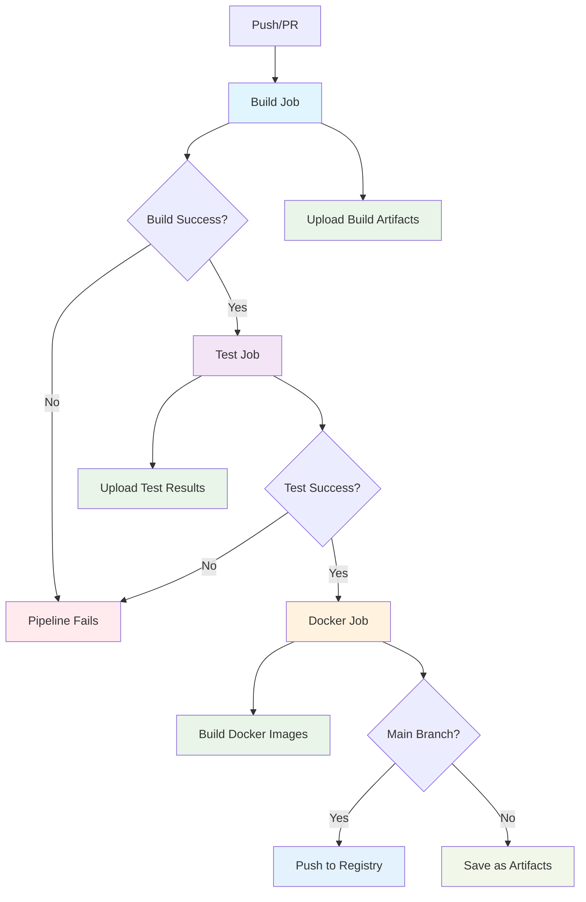

# Everything Monorepo

This is a Bazel monorepo that supports both Python and Go development.

## Quick Start

### Prerequisites
- Bazel 8.3+ with bzlmod support. use bazelisk to install

### Building and Testing 

Need to eventually figure out better testing strategy, but this is it for now.

```bash
# Run applications
bazel run //hello_python:hello_python
bazel run //hello_go:hello_go

# Build all targets
bazel build //...

# Run tests with detailed output
bazel test //... 
# Run specific tests
bazel test //hello_python:test_main 
bazel test //hello_go:main_test
```

### Adding Dependencies

#### Python Dependencies 
TODO - REVIEW
1. Add package to `requirements.in`
2. Run `bazel run //:pip_compile` to update `requirements.lock.txt`
3. Use `requirement("package-name")` in BUILD.bazel files

#### Go Dependencies
TODO - REVIEW
1. Add dependency to `go.mod`
2. Run `bazel run //:gazelle-update-repos` to update Bazel dependencies
3. Import normally in Go code

### Development Workflow

#### Adding a New Python App
TODO - review
1. Create directory at top level
2. Add Python source files
3. Create `BUILD.bazel` with appropriate `py_binary` and `py_test` targets
4. Reference shared libraries from `//libs/python`

#### Adding a New Go App
TODO - review
1. Create directory at top level
2. Add Go source files
3. Create `BUILD.bazel` with appropriate `go_binary` and `go_test` targets
4. Reference shared libraries from `//libs/go`

#### Adding Shared Libraries
- Python: Create under `libs/` with appropriate `py_library` targets
- Go: Create under `libs/` with appropriate `go_library` targets

## 🧪 Test Utilities

There are no test utilities currently.

```bash
bazel test //...
```

## Configuration
TODO - review

- `.bazelrc`: Contains common Bazel configuration
- `MODULE.bazel`: Defines external dependencies
- `go.mod`: Go module configuration (note: no `go.sum` needed for internal-only dependencies)
- `requirements.in`: Python dependencies specification


## CI/CD Pipeline

TODO - REVIEW
TODO - rebuild mermaid chart
TODO - add notes about how bazel caches by default

The repository uses GitHub Actions for continuous integration with a sequential build → test workflow:



### CI Jobs:
- **Build**: Compiles applications and uploads artifacts
- **Test**: Runs all tests (only if build succeeds)
- **Docker**: Builds container images and pushes to registry (only if tests pass)

## Docker Images ✅

Each application is automatically containerized using the consolidated `release_app` macro, which creates both release metadata and OCI images with multiplatform support.

### Consolidated Release System

TODO - release

The `release_app` macro in `//tools:release.bzl` automatically creates both release metadata and multiplatform OCI images:

```starlark
load("//tools:release.bzl", "release_app")

# This single declaration creates:
# - Release metadata (JSON file with app info)
# - OCI images for multiple platforms (amd64, arm64)
# - Proper container registry configuration
release_app(
    name = "hello_python",
    binary_target = ":hello_python",
    language = "python",
    description = "Python hello world application with pytest",
)
```

**Generated Targets:**
- `hello_python_image` - Default multiplatform image
- `hello_python_image_amd64` - AMD64-specific image
- `hello_python_image_arm64` - ARM64-specific image
- `hello_python_image_load` - Efficient oci_load target for Docker loading
- `hello_python_image_amd64_load` - AMD64 oci_load target
- `hello_python_image_arm64_load` - ARM64 oci_load target

### Cache Optimization

The new OCI build system uses `oci_load` targets instead of traditional tarball generation, providing:

- **Better cache hit rates** - No giant single-layer tarballs
- **Faster CI builds** - Only rebuilds changed layers
- **Efficient development workflow** - Direct integration with Docker/Podman
- **No unused artifacts** - Eliminates the never-used tarball targets from CI

### Building Images with Bazel

```bash
# Build individual platform images
bazel build //hello_python:hello_python_image_amd64
bazel build //hello_python:hello_python_image_arm64

# Build all platform variants
bazel build //hello_python:hello_python_image

# Build and load into Docker efficiently using oci_load (optimized for cache)
bazel run //hello_python:hello_python_image_load

# Or use the release tool for production workflows
bazel run //tools:release -- build hello_python

# Run the containers (after loading)
docker run --rm hello_python:latest  # ✅ Works correctly!
docker run --rm hello_go:latest      # ✅ Works correctly!
```

### Base Images & Architecture
- **Python**: Uses `python:3.11-slim` (Python 3.11.13 on Debian 12)
- **Go**: Uses `alpine:3.20` (Alpine 3.20.3 for minimal size)
- **Platforms**: Full support for both `linux/amd64` and `linux/arm64`
- **Cross-compilation**: Automatically handles platform-specific builds

### Advanced: Manual OCI Rules

TODO - review for accuracy

> **Note:** The `release_app` macro handles all standard use cases. Manual OCI rules are only needed for highly specialized scenarios.

For edge cases requiring custom OCI configuration, individual rules are available in `//tools:oci.bzl`:

```starlark
load("//tools:oci.bzl", "python_oci_image", "go_oci_image")

# Single platform image with custom configuration
python_oci_image(
    name = "custom_python_image",
    binary = ":my_binary",
    platform = "linux/amd64",
    # ... custom OCI parameters
)
```

## 🚀 Release Management

This monorepo uses a **shell-script-free**, Starlark and GitHub Actions-based release system that automatically detects and releases only affected applications.

### 🎯 Key Features

### 📦 How It Works

TODO - create mermaid chart
TODO - release only if change
TODO - review documentation to ensure accuracy

#### 1. App Discovery (Bazel Query)
TODO - review
The release system uses Starlark macros and Bazel queries to discover releasable apps:

```bash
# Discovers all apps with release metadata
bazel query "kind('app_metadata', //...)"
```

Each app declares its release metadata using the `release_app` macro:

```starlark
# In hello_python/BUILD.bazel
load("//tools:release.bzl", "release_app")

release_app(
    name = "hello_python",
    binary_target = ":hello_python",
    language = "python",
    description = "Python hello world application with pytest",
)
```

#### 2. Intelligent Change Detection
TODO - review documentation to ensure accuracy
- **Tag-based releases**: Compares changes since the last Git tag
- **Manual releases**: You specify which apps to release
- **Dependency awareness**: If shared libraries change, all dependent apps are released

#### 3. Container Publishing
TODO - review documentation to ensure accuracy
Each released app gets published to GitHub Container Registry with multiple tags:
- `ghcr.io/OWNER/APP:vX.Y.Z` (specific version)
- `ghcr.io/OWNER/APP:latest` (latest release)
- `ghcr.io/OWNER/APP:COMMIT_SHA` (commit-specific)

### � Version Validation & Protection

The release system includes robust version validation and protection:

#### Semantic Versioning Enforcement
Versions must follow the `v{major}.{minor}.{patch}` format, with the special exception of `latest` for main builds:
- ✅ Valid: `v1.0.0`, `v2.1.3`, `v1.0.0-beta1`, `v3.2.1-rc2`, `latest`
- ❌ Invalid: `1.0.0`, `v1.0`, `v1`, `release-1.0.0`

#### Version Overwrite Protection
- **Automatic checks**: Before releasing, the system checks if the version already exists
- **Registry validation**: Uses Docker manifest inspection to verify version availability
- **Safety first**: Releases are blocked if a version already exists in the registry
- **`latest` exception**: The `latest` tag can always be overwritten (main branch workflow)
- **Override option**: Use `--allow-overwrite` flag for emergency situations with versioned releases (not recommended)

#### Version Validation Commands
```bash
# Validate version format and availability
bazel run //tools:release -- validate-version hello_python v1.2.3

# Allow overwriting existing versions (dangerous!)
bazel run //tools:release -- validate-version hello_python v1.2.3 --allow-overwrite

# Validation happens automatically during plan and release
bazel run //tools:release -- plan --event-type workflow_dispatch --apps hello_python --version v1.2.3
```

### �🔧 Release Methods

#### Method 1: GitHub Actions UI (Recommended) ⭐

TODO - review documentation to ensure accuracy

This is the **preferred method** as it provides full control and prevents mistakes:

1. Go to your repository on GitHub
2. Click **Actions** → **Release** workflow
3. Click **Run workflow**
4. Fill in the parameters:
   - **Apps**: Comma-separated list (e.g., `hello_python,hello_go`) or `all`
   - **Version**: Release version (e.g., `v1.2.3`)
   - **Dry run**: Check this to test without publishing

**Example Release:**
```
Apps: hello_python,hello_go
Version: v1.2.3
Dry run: false
```

#### Method 2: GitHub CLI

TODO - review documentation to ensure accuracy

```bash
# Release specific apps
gh workflow run release.yml \
  -f apps=hello_python,hello_go \
  -f version=v1.2.3 \
  -f dry_run=false

# Release all apps
gh workflow run release.yml \
  -f apps=all \
  -f version=v1.2.3

# Dry run (test without publishing)
gh workflow run release.yml \
  -f apps=hello_python \
  -f version=v1.2.3 \
  -f dry_run=true
```

#### Method 3: Git Tags (NOT Recommended) ⚠️

TODO - ensure tags are not supported as a trigger for releases

While supported, **manual tag pushes are discouraged** because:
- Easy to forget to update version numbers
- No validation of which apps should be released
- Can trigger unintended releases
- Harder to rollback if something goes wrong

```bash
# Only use if you're absolutely sure
git tag v1.2.3
git push origin v1.2.3
```

### 📋 Release Process Details

TODO - review documentation to ensure accuracy

#### Automatic Release Matrix
The release workflow automatically creates a build matrix based on changed apps:

```yaml
# Example matrix for hello_python and hello_go
matrix:
  include:
    - app: hello_python
      binary: hello_python
      image: hello_python_image
    - app: hello_go  
      binary: hello_go
      image: hello_go_image
```

#### Container Image Tags
Each released app gets tagged with:
```bash
# Version-specific
ghcr.io/OWNER/hello_python:v1.2.3

# Latest
ghcr.io/OWNER/hello_python:latest

# Commit-specific (for debugging)
ghcr.io/OWNER/hello_python:abc123def
```


### 🛠️ Adding Release Support to New Apps

When creating a new app, just add the consolidated release metadata - it automatically creates both release metadata and OCI images:

```starlark
# In new_app/BUILD.bazel
load("//tools:release.bzl", "release_app")

py_binary(  # or go_binary
    name = "new_app",
    srcs = ["main.py"],  # or ["main.go"]
    visibility = ["//visibility:public"],
)

# This single macro creates both release metadata AND OCI images!
release_app(
    name = "new_app",
    binary_target = ":new_app",
    language = "python",  # or "go"
    description = "Description of what this app does",
)
```

The release system will automatically discover and include your app in future releases!

### 🐛 Troubleshooting Releases

TODO - review documentation to ensure accuracy

#### Check App Discovery
```bash
# See all discoverable apps
bazel query "kind('app_metadata', //...)"

# Verify your app's targets exist
bazel query "//your_app:your_app"
```

#### Test Release Locally
```bash
# Build and test the release targets using the release tool
bazel run //tools:release -- build hello_python

# Verify the image works
docker run --rm hello_python:latest
```

#### Version Issues
TODO - review documentation to ensure accuracy
```bash
# Validate version format before releasing
bazel run //tools:release -- validate-version hello_python v1.2.3

# If you get "version already exists" errors:
# 1. Check what versions exist in the registry
# 2. Use a new version number (recommended)
# 3. Or use --allow-overwrite flag (dangerous!)

# For emergency overwrites only:
bazel run //tools:release -- release hello_python --version v1.2.3 --allow-overwrite --dry-run
```

#### Dry Run Releases
Always use dry run mode when testing:
```bash
gh workflow run release.yml \
  -f apps=your_app \
  -f version=v0.0.1-test \
  -f dry_run=true
```
