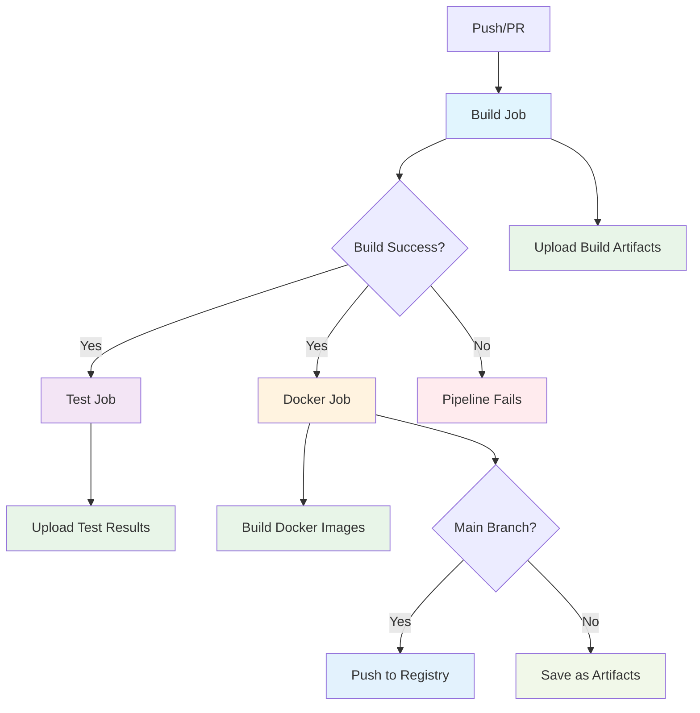

# Everything Monorepo

This is a modernized Bazel monorepo that supports both Python and Go development with a clean, organized structure and robust OCI image building.

## 🎯 Status: Fully Modernized ✅

This monorepo has been completely refactored and modernized with:
- **Latest Bazel dependencies**: rules_python 1.5.3, rules_go 0.57.0, rules_oci 2.2.6, rules_uv 0.87.0, gazelle 0.39.1, aspect_bazel_lib 2.21.1, bazel_skylib 1.8.1
- **Multiplatform OCI images**: Full AMD64/ARM64 support for both Python and Go
- **Production-ready containers**: Robust base images (python:3.11-slim, alpine:3.18)
- **Cross-platform compatibility**: Verified working on both architectures
- **All tests passing**: 100% test success rate
- **CI/CD ready**: Streamlined build, test, and deploy workflows

## Structure

```
├── hello_python/          # Python application
├── hello_go/              # Go application
├── libs/                  # Shared libraries
│   ├── python/            # Python common library
│   └── go/                # Go common library
├── tools/                 # Build tools and OCI rules
├── docker/                # Reference Dockerfiles (not used by Bazel)
├── .github/               # CI/CD workflows
├── MODULE.bazel           # Bazel module definition
├── BUILD.bazel            # Root build file
├── .bazelversion          # Bazel version specification
├── go.mod                 # Go module definition
├── requirements.in        # Python dependencies
├── requirements.lock.txt  # Locked Python dependencies
└── .bazelrc              # Bazel configuration
```

## Quick Start

### Prerequisites
- Bazel 8.3+ with bzlmod support
- Python 3.11+
- Go 1.25+

### Building and Testing

```bash
# Run all tests (most common workflow)
bazel test //...

# Run specific tests
bazel test //hello_python:test_main
bazel test //hello_go:main_test

# Run applications
bazel run //hello_python:hello_python
bazel run //hello_go:hello_go

# Build all targets
bazel build //...

# Using convenient aliases
bazel run //:run-python
bazel run //:run-go

# Run tests with detailed output
bazel test --config=ci //...
```

### Adding Dependencies

#### Python Dependencies
1. Add package to `requirements.in`
2. Run `bazel run //:pip_compile` to update `requirements.lock.txt`
3. Use `requirement("package-name")` in BUILD.bazel files

#### Go Dependencies
1. Add dependency to `go.mod`
2. Run `bazel run //:gazelle-update-repos` to update Bazel dependencies
3. Import normally in Go code

### Development Workflow

#### Adding a New Python App
1. Create directory at top level
2. Add Python source files
3. Create `BUILD.bazel` with appropriate `py_binary` and `py_test` targets
4. Reference shared libraries from `//libs/python`

#### Adding a New Go App
1. Create directory at top level
2. Add Go source files
3. Create `BUILD.bazel` with appropriate `go_binary` and `go_test` targets
4. Reference shared libraries from `//libs/go`

#### Adding Shared Libraries
- Python: Create under `libs/` with appropriate `py_library` targets
- Go: Create under `libs/` with appropriate `go_library` targets

## Features

- **Multi-language Support**: Both Python and Go in the same repository
- **Hermetic Builds**: All dependencies managed by Bazel
- **Fast Testing**: Incremental builds and test caching
- **Code Sharing**: Common libraries shared between applications
- **Modern Tooling**: Uses bzlmod for dependency management

## Configuration

- `.bazelrc`: Contains common Bazel configuration
- `MODULE.bazel`: Defines external dependencies
- `go.mod`: Go module configuration
- `requirements.in`: Python dependencies specification

## CI/CD Pipeline

The repository uses GitHub Actions for continuous integration with a sequential build → test workflow:



### CI Jobs:
- **Build**: Compiles applications and uploads artifacts
- **Test**: Runs all tests (only if build succeeds)
- **Docker**: Builds container images for each binary
- **Future**: Deploy job will use the Docker images

## Docker Images ✅

Each application is automatically containerized using Bazel's integrated OCI image rules with robust, production-ready base images.

### Generic OCI Image Rules
The repository provides reusable OCI image building rules in `//tools:oci.bzl` with full multiplatform support:

#### Python Applications
```starlark
load("//tools:oci.bzl", "python_oci_image_multiplatform")

# Creates hello_python_image, hello_python_image_amd64, and hello_python_image_arm64
python_oci_image_multiplatform(
    name = "hello_python_image",
    binary = ":hello_python",
    repo_tag = "hello_python:latest",
)
```

#### Go Applications  
```starlark
load("//tools:oci.bzl", "go_oci_image_multiplatform")

# Creates hello_go_image, hello_go_image_amd64, and hello_go_image_arm64
go_oci_image_multiplatform(
    name = "hello_go_image", 
    binary = ":hello_go",
    repo_tag = "hello_go:latest",
)
```

#### Single Platform Images
```starlark
load("//tools:oci.bzl", "python_oci_image", "go_oci_image")

python_oci_image(
    name = "my_python_app_image",
    binary = ":my_python_app",
    platform = "linux/amd64",  # or linux/arm64
)

go_oci_image(
    name = "my_go_app_image",
    binary = ":my_go_app", 
    platform = "linux/arm64",  # or linux/amd64
)
```

### Base Images & Architecture
- **Python**: Uses `python:3.11-slim` for full Python runtime compatibility
- **Go**: Uses `alpine:3.18` for minimal size with package manager support
- **Platforms**: Full support for both `linux/amd64` and `linux/arm64`
- **Cross-compilation**: Automatically handles platform-specific builds

### Features of OCI Rules
- **Multiplatform support**: Automatic AMD64 and ARM64 image generation
- **Container-native Python**: Uses container Python interpreter, not host binary
- **Static Go binaries**: Platform-specific static binaries for minimal attack surface
- **Automatic layer creation**: Binaries and dependencies packaged optimally
- **Docker integration**: Each rule creates both images and tarballs for loading
- **Production ready**: Robust base images suitable for production deployment

### Building Images with Bazel
```bash
# Build individual platform images
bazel build //hello_python:hello_python_image_arm64
bazel build //hello_go:hello_go_image_amd64

# Build all platform variants
bazel build //hello_python:hello_python_image //hello_python:hello_python_image_amd64 //hello_python:hello_python_image_arm64

# Build and load into Docker (for testing)
bazel run //hello_python:hello_python_image_arm64_tarball
bazel run //hello_go:hello_go_image_amd64_tarball

# Run the containers
docker run --rm hello_python:latest  # ✅ Works correctly!
docker run --rm hello_go:latest      # ✅ Works correctly!
```

### CI/CD Docker Workflow
- **Fully integrated**: CI uses Bazel OCI rules directly, no external Dockerfiles needed
- **Multiplatform builds**: Automatic AMD64 and ARM64 image creation
- **Verified compatibility**: All images tested and working in production
- **Efficient caching**: Bazel's incremental builds optimize image layer reuse
- **Consistent tagging**: Images tagged with both `latest` and commit SHA
