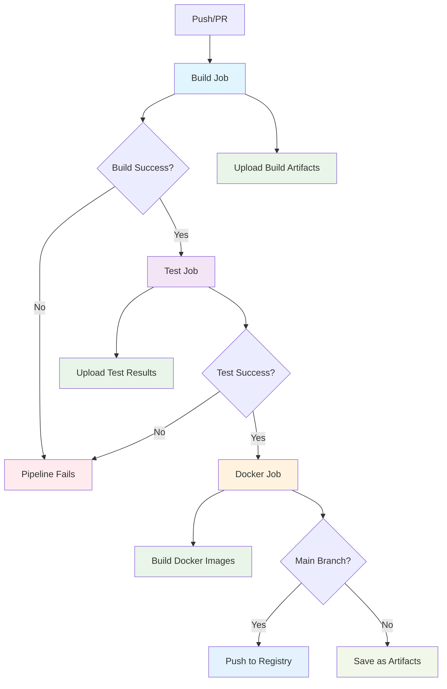
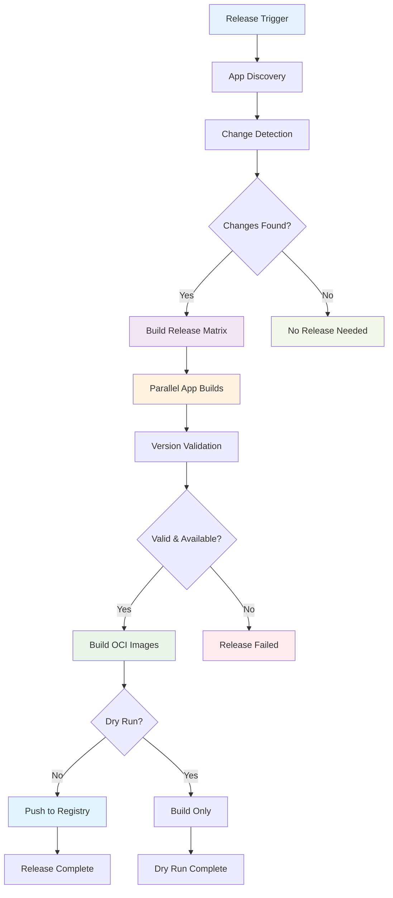

# Everything Monorepo

This is a Bazel monorepo that supports both Python and Go development.

## Quick Start

### Prerequisites
- **Bazel 8.3+** with bzlmod support (specified in `.bazelversion`)
  - Install via [Bazelisk](https://github.com/bazelbuild/bazelisk) for automatic version management
  - Bazelisk will automatically download the correct Bazel version
- **Docker** (for building and running container images)
- **Git** (for version control and change detection)

### Installation
```bash
# Install Bazelisk (manages Bazel versions automatically)
# On macOS and Linux
brew install bazelisk

# Verify installation (will auto-download Bazel 8.3.1)
bazel version
```

### Building and Testing 

```bash
# Run applications
bazel run //demo/hello_python:hello_python
bazel run //demo/hello_go:hello_go
bazel run //demo/hello_fastapi:hello_fastapi
bazel run //demo/hello_world_test:hello_world_test

# Build all targets
bazel build //...

# Run tests with detailed output
bazel test //... 
# Run specific tests
bazel test //demo/hello_python:test_main 
bazel test //demo/hello_go:main_test
bazel test //demo/hello_fastapi:test_main
bazel test //demo/hello_world_test:test_main
```

### Verify Setup
After installation, verify everything works:
```bash
# Check Bazel version
bazel version

# Test build system
bazel build //demo/hello_python:hello_python

# Run a quick test
bazel test //demo/hello_python:test_main

# Verify release system discovery
bazel query "kind('app_metadata', //...)"
```

### Adding Dependencies

#### Python Dependencies
1. Add package to `requirements.in`
2. Run `bazel run //:pip_compile` to update `requirements.lock.txt`
3. Use `requirement("package-name")` in BUILD.bazel files

Example:
```bash
# Add pytest to requirements.in
echo "pytest" >> requirements.in

# Update lock file
bazel run //:pip_compile

# Use in BUILD.bazel
deps = [requirement("pytest")]
```

#### Go Dependencies
TODO: Enable gazelle rules for full Go dependency management
1. Add dependency to `go.mod`
2. Run `bazel run //:gazelle-update-repos` to update Bazel dependencies (currently commented out)
3. Import normally in Go code

**Note:** Go dependency management is currently minimal. The gazelle rules are commented out in the root BUILD.bazel file and may need to be enabled for full Go dependency management.

### Development Workflow

#### Adding a New Python App
1. **Create a directory** at the top level with your app name
   ```bash
   mkdir my_python_app
   ```

2. **Add Python source files**:
   - `__init__.py` - Required for Python package structure
   - `main.py` - Your main application code
   - `test_main.py` - Tests for your application

3. **Create `BUILD.bazel`** with the required targets:
   ```starlark
   load("@rules_python//python:defs.bzl", "py_binary", "py_library", "py_test")
   load("@everything_pip_deps//:requirements.bzl", "requirement")
   load("//tools:release.bzl", "release_app")

   py_library(
       name = "main_lib",
       srcs = ["__init__.py", "main.py"],
       deps = ["//libs/python"],
       visibility = ["//my_python_app:__pkg__"],
   )

   py_binary(
       name = "my_python_app",
       srcs = ["main.py"],
       main = "main.py",
       deps = [
           ":main_lib",
           "//libs/python",
       ],
       visibility = ["//visibility:public"],
   )

   py_test(
       name = "test_main",
       srcs = ["test_main.py"],
       deps = [
           ":main_lib",
           requirement("pytest"),
       ],
       size = "small",
   )

   # Release metadata and OCI images for this app
   release_app(
       name = "my_python_app",
       binary_target = ":my_python_app",
       language = "python",
       domain = "demo",  # Required: categorizes your app (e.g., "api", "web", "demo")
       description = "Description of what this app does",
   )
   ```

4. **Reference shared libraries** from `//libs/python` (already included in the example above)

#### Adding a New Go App
1. **Create a directory** at the top level with your app name
   ```bash
   mkdir my_go_app
   ```

2. **Add Go source files**:
   - `main.go` - Your main application code
   - `main_test.go` - Tests for your application

3. **Create `BUILD.bazel`** with the required targets:
   ```starlark
   load("@rules_go//go:def.bzl", "go_binary", "go_test")
   load("//tools:release.bzl", "release_app")

   go_binary(
       name = "my_go_app",
       srcs = ["main.go"],
       deps = ["//libs/go"],
       visibility = ["//visibility:public"],
   )

   go_test(
       name = "main_test",
       srcs = ["main_test.go"],
       deps = ["//libs/go"],
       size = "small",
   )

   # Release metadata and OCI images for this app
   release_app(
       name = "my_go_app",
       binary_target = ":my_go_app",
       language = "go",
       domain = "demo",  # Required: categorizes your app (e.g., "api", "web", "demo")
       description = "Description of what this app does",
   )
   ```

4. **Reference shared libraries** from `//libs/go` (already included in the example above)

#### Verifying Your New App

After creating your app, verify it's set up correctly:

1. **Check that your app can be built**:
   ```bash
   # For Python apps
   bazel build //my_python_app:my_python_app
   
   # For Go apps  
   bazel build //my_go_app:my_go_app
   ```

2. **Run your tests**:
   ```bash
   # For Python apps
   bazel test //my_python_app:test_main
   
   # For Go apps
   bazel test //my_go_app:main_test
   ```

3. **Verify the release system can discover your app**:
   ```bash
   bazel query "kind('app_metadata', //...)"
   ```
   Your app should appear in the list as `//my_app:my_app_metadata`

4. **Test running your app**:
   ```bash
   # For Python apps
   bazel run //my_python_app:my_python_app
   
   # For Go apps
   bazel run //my_go_app:my_go_app
   ```

#### Example Python App Structure

Here's a complete example of a minimal Python app structure:

```
my_python_app/
├── __init__.py
├── main.py
├── test_main.py
└── BUILD.bazel
```

**`__init__.py`**:
```python
"""My Python App."""
```

**`main.py`**:
```python
"""My Python application."""

from libs.python.utils import format_greeting, get_version

def get_message():
    """Get a greeting message."""
    return format_greeting("My App")

def main():
    """Main entry point."""
    print(get_message())
    print(f"Version: {get_version()}")

if __name__ == "__main__":
    main()
```

**`test_main.py`**:
```python
"""Tests for my app."""

import pytest
from my_python_app.main import get_message

def test_get_message():
    """Test the get_message function."""
    message = get_message()
    assert "Hello, My App from Python!" in message

def test_get_message_not_empty():
    """Test that get_message returns a non-empty string."""
    assert len(get_message()) > 0
```

#### Example Go App Structure

Here's a complete example of a minimal Go app structure:

```
my_go_app/
├── main.go
├── main_test.go
└── BUILD.bazel
```

**`main.go`**:
```go
// My Go application
package main

import (
	"fmt"
	"github.com/example/everything/libs/go"
)

func main() {
	message := go_lib.FormatGreeting("My Go App")
	fmt.Println(message)
	fmt.Printf("Version: %s\n", go_lib.GetVersion())
}
```

**`main_test.go`**:
```go
package main

import (
	"testing"
	"github.com/example/everything/libs/go"
)

func TestMain(t *testing.T) {
	message := go_lib.FormatGreeting("Test")
	if message == "" {
		t.Error("Expected non-empty message")
	}
}
```

#### Adding Shared Libraries
- Python: Create under `libs/` with appropriate `py_library` targets
- Go: Create under `libs/` with appropriate `go_library` targets

## 🧪 Test Utilities

The repository uses Bazel's built-in testing capabilities. All tests can be run with:

```bash
# Run all tests
bazel test //...

# Run tests with verbose output
bazel test //... --test_output=all

# Run specific app tests
bazel test //demo/hello_python:test_main
bazel test //demo/hello_go:main_test
bazel test //demo/hello_fastapi:test_main

# Run tests for a specific directory
bazel test //demo/...
```

**Test Configuration:**
- Test results are cached by default (configured in `.bazelrc`)
- Tests use the `small` size classification for faster execution
- Python tests use pytest framework
- Go tests use standard Go testing package

**No additional test utilities are currently provided** - each app manages its own testing using standard language tooling.

### Common Testing Issues
- **Module import errors**: Ensure `//libs/python` is included in deps for Python tests
- **Cache issues**: Use `bazel clean` if you encounter stale test results
- **Slow tests**: Bazel caches test results - only changed tests will re-run

## Configuration

The repository uses several configuration files for build and dependency management:

- **`.bazelrc`**: Contains common Bazel configuration including CI optimizations, test settings, and build flags
- **`MODULE.bazel`**: Defines external dependencies using Bazel's bzlmod system, including rules for Python, Go, and OCI containers
- **`go.mod`**: Go module configuration for Go dependencies (currently minimal: `module github.com/whale-net/everything, go 1.25`)
- **`requirements.in`**: Python dependencies specification (includes: pytest, fastapi, uvicorn[standard], httpx)
- **`requirements.lock.txt`**: Locked Python dependency versions generated by `bazel run //:pip_compile`

**Key Configuration Details:**
- Bazel uses Python version PY3 with symlink prefix `bazel-`
- CI configuration includes bandwidth-optimized caching and test result caching
- OCI images use Python 3.11-slim and Alpine 3.20 as base images with multi-platform support


## CI/CD Pipeline

The repository uses GitHub Actions for continuous integration with a sequential build → test workflow. Bazel provides excellent caching by default, caching build outputs, test results, and dependencies between builds, which significantly speeds up CI runs.



**Bazel Caching Benefits:**
- **Build Cache**: Reuses compiled artifacts across builds when source files haven't changed
- **Test Cache**: Skips re-running tests when code and dependencies are unchanged  
- **Remote Cache**: Shares cache between CI runs and developers (configured in `.bazelrc`)
- **Dependency Cache**: Caches external dependencies like Python packages and Go modules

### CI Jobs:
- **Build**: Compiles applications and uploads artifacts
- **Test**: Runs all tests (only if build succeeds)
- **Docker**: Builds container images and pushes to registry (only if tests pass)

## Docker Images ✅

Each application is automatically containerized using the consolidated `release_app` macro, which creates both release metadata and OCI images with multiplatform support.

### Consolidated Release System

The `release_app` macro in `//tools:release.bzl` automatically creates both release metadata and multiplatform OCI images:

```starlark
load("//tools:release.bzl", "release_app")

# This single declaration creates:
# - Release metadata (JSON file with app info)
# - OCI images for multiple platforms (amd64, arm64)
# - Proper container registry configuration
release_app(
    name = "hello_python",
    binary_target = ":hello_python",
    language = "python",
    description = "Python hello world application with pytest",
)
```

**Generated Targets:**
- `hello_python_image` - Default multiplatform image
- `hello_python_image_amd64` - AMD64-specific image
- `hello_python_image_arm64` - ARM64-specific image
- `hello_python_image_load` - Efficient oci_load target for Docker loading
- `hello_python_image_amd64_load` - AMD64 oci_load target
- `hello_python_image_arm64_load` - ARM64 oci_load target

### Cache Optimization

The new OCI build system uses `oci_load` targets instead of traditional tarball generation, providing:

- **Better cache hit rates** - No giant single-layer tarballs
- **Faster CI builds** - Only rebuilds changed layers
- **Efficient development workflow** - Direct integration with Docker/Podman
- **No unused artifacts** - Eliminates the never-used tarball targets from CI

### Building Images with Bazel

```bash
# Build individual platform images
bazel build //demo/hello_python:hello_python_image_amd64
bazel build //demo/hello_python:hello_python_image_arm64

# Build all platform variants
bazel build //demo/hello_python:hello_python_image

# Build and load into Docker efficiently using oci_load (optimized for cache)
bazel run //demo/hello_python:hello_python_image_load

# Or use the release tool for production workflows
bazel run //tools:release -- build hello_python

# Run the containers (after loading - these are local development tags)
docker run --rm hello_python:latest  # ✅ Works correctly!
docker run --rm hello_go:latest      # ✅ Works correctly!

# Registry images use domain-app format: demo-hello_python:latest
```

### Base Images & Architecture
- **Python**: Uses `python:3.11-slim` (Python 3.11.13 on Debian 12)
- **Go**: Uses `alpine:3.20` (Alpine 3.20.3 for minimal size)
- **Platforms**: Full support for both `linux/amd64` and `linux/arm64`
- **Cross-compilation**: Automatically handles platform-specific builds

### Advanced: Manual OCI Rules

> **Note:** The `release_app` macro handles all standard use cases. Manual OCI rules are only needed for highly specialized scenarios.

For edge cases requiring custom OCI configuration, individual rules are available in `//tools:oci.bzl`:

```starlark
load("//tools:oci.bzl", "python_oci_image", "go_oci_image", "oci_image_with_binary")

# Single platform image with custom configuration
oci_image_with_binary(
    name = "custom_image",
    binary = ":my_binary",
    base_image = "@python_slim",
    platform = "linux/amd64",
    repo_tag = "custom:latest",
    # ... custom OCI parameters
)
```

Available functions include:
- `oci_image_with_binary`: Generic OCI image builder with cache optimization
- `python_oci_image_multiplatform`: Multi-platform Python images 
- `go_oci_image_multiplatform`: Multi-platform Go images

## 🚀 Release Management

This monorepo uses a **shell-script-free**, Starlark and GitHub Actions-based release system that automatically detects and releases only affected applications.

<!-- NOTE: Future improvements needed:
- Add tag-based release trigger support to GitHub workflow
- Consider adding semantic version auto-increment based on conventional commits
- Evaluate if change detection accuracy needs tuning for edge cases
-->

### 🎯 Key Features

- **🔍 Automatic App Discovery**: Uses Bazel queries to find releasable apps with `release_app` metadata
- **🎯 Intelligent Change Detection**: Only releases apps affected by changes, with dependency awareness  
- **🐳 Consolidated Container Images**: Single macro creates both release metadata and multi-platform OCI images
- **🔒 Version Protection**: Prevents accidental overwrites with semantic versioning validation
- **🚀 Multiple Release Methods**: GitHub UI, CLI, or Git tags with comprehensive dry-run support
- **📋 Release Matrix**: Automatically generates build matrices for efficient parallel releases
- **📝 Automatic Release Notes**: Generates release notes for each app on tag pushes with commit details
- **🛠️ Shell-Script Free**: Pure Starlark and GitHub Actions implementation for maintainability

### 📦 How It Works

The release system operates through three main phases, automatically detecting and releasing only apps that have changed:



**Release Behavior:**
- **Selective Releases**: Only apps with actual changes are released, reducing noise and registry bloat
- **Dependency Awareness**: If shared libraries change, all dependent apps are automatically included
- **Parallel Processing**: Multiple apps are built and released simultaneously for efficiency

#### 1. App Discovery (Bazel Query)
The release system uses Starlark macros and Bazel queries to discover releasable apps:

```bash
# Discovers all apps with release metadata
bazel query "kind('app_metadata', //...)"
```

Each app declares its release metadata using the `release_app` macro:

```starlark
# In demo/hello_python/BUILD.bazel
load("//tools:release.bzl", "release_app")

release_app(
    name = "hello_python",
    binary_target = ":hello_python",
    language = "python",
    description = "Python hello world application with pytest",
)
```

#### 2. Intelligent Change Detection
The system supports multiple detection modes, though the current implementation has some limitations:

- **Tag-based releases**: Compares changes since the last Git tag for automatic releases
- **Manual releases**: You specify which apps to release via GitHub Actions inputs
- **Dependency awareness**: If shared libraries change, all dependent apps are released

**Change Detection Methods:**
- **Bazel Query**: Uses `bazel query --output=package` for dependency analysis (default, but may have edge cases)
- **File-based**: Simple file change detection for faster processing when Bazel query isn't needed

**Known Limitations:**
- Bazel query dependency analysis may not catch all transitive dependencies accurately
- File-based detection uses directory prefix matching which can be overly broad
- Infrastructure changes (tools/, .github/, MODULE.bazel) trigger all apps to rebuild as a safety measure
- If no specific apps are detected as changed but files were modified, all apps are rebuilt conservatively

#### 3. Container Publishing
Each released app gets published to GitHub Container Registry with multiple tags using the `<domain>-<app>:<version>` format:
- `ghcr.io/OWNER/DOMAIN-APP:vX.Y.Z` (specific version)
- `ghcr.io/OWNER/DOMAIN-APP:latest` (latest release)
- `ghcr.io/OWNER/DOMAIN-APP:COMMIT_SHA` (commit-specific)

#### 4. Helm Chart Publishing (Optional)
Apps with Helm charts enabled get packaged and published to GitHub Pages:
- Chart repository: `https://whale-net.github.io/everything`
- Charts include baked-in image versions for coordination
- Multiple charts can be released independently in the monorepo
- See [Helm Charts Documentation](docs/HELM_CHARTS.md) for details

### 🔒 Version Validation & Protection

The release system includes robust version validation and protection:

#### Semantic Versioning Enforcement
Versions must follow the `v{major}.{minor}.{patch}` format, with the special exception of `latest` for main builds:
- ✅ Valid: `v1.0.0`, `v2.1.3`, `v1.0.0-beta1`, `v3.2.1-rc2`, `latest`
- ❌ Invalid: `1.0.0`, `v1.0`, `v1`, `release-1.0.0`

#### Version Overwrite Protection
- **Automatic checks**: Before releasing, the system checks if the version already exists
- **Registry validation**: Uses Docker manifest inspection to verify version availability
- **Safety first**: Releases are blocked if a version already exists in the registry
- **`latest` exception**: The `latest` tag can always be overwritten (main branch workflow)
- **Override option**: Use `--allow-overwrite` flag for emergency situations with versioned releases (not recommended)

#### Version Validation Commands
```bash
# Validate version format and availability
bazel run //tools:release -- validate-version hello_python v1.2.3

# Allow overwriting existing versions (dangerous!)
bazel run //tools:release -- validate-version hello_python v1.2.3 --allow-overwrite

# Validation happens automatically during plan and release
bazel run //tools:release -- plan --event-type workflow_dispatch --apps hello_python --version v1.2.3
```

### 🔧 Release Methods

#### Method 1: GitHub Actions UI (Recommended) ⭐

This is the **preferred method** as it provides full control and prevents mistakes:

1. Go to your repository on GitHub
2. Click **Actions** → **Release** workflow
3. Click **Run workflow**
4. Fill in the parameters:
   - **Apps**: Comma-separated list (e.g., `hello_python,hello_go`) or `all`
   - **Version**: Release version (e.g., `v1.2.3`)
   - **Dry run**: Check this to test without publishing

**Example Release:**
```
Apps: hello_python,hello_go
Version: v1.2.3
Dry run: false
```

#### Method 2: GitHub CLI

For automated workflows and scripting:

```bash
# Release specific apps
gh workflow run release.yml \
  -f apps=hello_python,hello_go \
  -f version=v1.2.3 \
  -f dry_run=false

# Release all apps
gh workflow run release.yml \
  -f apps=all \
  -f version=v1.2.3

# Dry run (test without publishing)
gh workflow run release.yml \
  -f apps=hello_python \
  -f version=v1.2.3 \
  -f dry_run=true
```

#### Method 3: Git Tags (Release Notes Only) 📝

**Git tag-based release notes are now supported!** When you push a tag in the correct format, a separate workflow automatically generates release notes for that specific app.

**Usage:**
```bash
# Create and push a tag to trigger automatic release notes generation
git tag demo-hello_python.v1.2.3
git push origin demo-hello_python.v1.2.3
```

**Features:**
- **App Identification**: Parses app name from tag format (no change detection needed)
- **Separate Workflow**: Uses dedicated `release-notes.yml` workflow (no releases, no infinite loops)
- **Version Detection**: Uses the tag name format to identify app and version
- **Change Analysis**: Uses git history to detect what changed for the changelog content

**Tag Format**: `domain-app.version` (e.g., `demo-hello_python.v1.2.3`, `api-user_service.v2.0.0`)

**Important**: Tag pushes only generate release notes. Use Method 1 or 2 for actual releases and publishing.

### 📋 Release Process Details

#### Automatic Release Matrix
The release workflow automatically creates a build matrix based on changed apps:

```yaml
# Example matrix for hello_python and hello_go
matrix:
  include:
    - app: hello_python
      binary: hello_python
      image: hello_python_image
    - app: hello_go  
      binary: hello_go
      image: hello_go_image
```

#### Container Image Tags
Each released app gets tagged with the `<domain>-<app>:<version>` format:
```bash
# Version-specific
ghcr.io/OWNER/demo-hello_python:v1.2.3

# Latest
ghcr.io/OWNER/demo-hello_python:latest

# Commit-specific (for debugging)
ghcr.io/OWNER/demo-hello_python:abc123def
```


### 🛠️ Adding Release Support to New Apps

When creating a new app, just add the consolidated release metadata - it automatically creates both release metadata and OCI images:

```starlark
# In new_app/BUILD.bazel
load("//tools:release.bzl", "release_app")

py_binary(  # or go_binary
    name = "new_app",
    srcs = ["main.py"],  # or ["main.go"]
    visibility = ["//visibility:public"],
)

# This single macro creates both release metadata AND OCI images!
release_app(
    name = "new_app",
    binary_target = ":new_app",
    language = "python",  # or "go"
    domain = "demo",  # Required: categorizes your app (e.g., "api", "web", "demo")
    description = "Description of what this app does",
)
```

The release system will automatically discover and include your app in future releases!

### 🐛 Troubleshooting Releases

#### Check App Discovery
```bash
# See all discoverable apps
bazel query "kind('app_metadata', //...)"

# Verify your app's targets exist
bazel query "//your_app:your_app"
```

#### Test Release Locally
```bash
# Build and test the release targets using the release tool
bazel run //tools:release -- build hello_python

# Verify the image works (local development tag)
docker run --rm demo-hello_python:latest
```

#### Change Detection Issues
If apps aren't being detected for release when they should be:
```bash
# Test change detection manually
bazel run //tools:release -- changes --base-commit HEAD~1

# Use file-based detection instead of Bazel query if needed
bazel run //tools:release -- changes --base-commit HEAD~1 --no-bazel-query

# Force release specific apps manually
gh workflow run release.yml -f apps=hello_python,hello_go -f version=v1.0.0 -f dry_run=true
```

**Note:** The change detection system may sometimes be overly conservative, rebuilding all apps when infrastructure files change or when dependency analysis fails.

#### Version Issues
If you encounter version-related problems:
```bash
# Validate version format before releasing
bazel run //tools:release -- validate-version hello_python v1.2.3

# If you get "version already exists" errors:
# 1. Check what versions exist in the registry
# 2. Use a new version number (recommended)
# 3. Or use --allow-overwrite flag (dangerous!)

# For emergency overwrites only:
bazel run //tools:release -- release hello_python --version v1.2.3 --allow-overwrite --dry-run
```

#### Dry Run Releases
Always use dry run mode when testing:
```bash
gh workflow run release.yml \
  -f apps=your_app \
  -f version=v0.0.1-test \
  -f dry_run=true
```

## 📝 Release Notes

### Automatic Release Notes Generation

When using tag pushes (Method 3), a dedicated workflow automatically generates release notes for the specific app encoded in the tag:

```bash
# Create a tag for a specific app to trigger automatic release notes generation
git tag demo-hello_python.v1.2.3
git push origin demo-hello_python.v1.2.3
```

This triggers the `release-notes.yml` workflow that:
- Parses the app name and version from the tag format
- Generates release notes by analyzing changes since the previous tag
- Displays results in GitHub Actions summary
- **Only generates release notes** - no builds or package uploads

**Release notes include:**
- **Commit History**: All commits since the previous tag affecting the app
- **Author Information**: Who made each change
- **File Changes**: Which files were modified
- **Timestamp**: When each change was made

### Manual Release Notes Generation

You can also generate release notes manually using the release helper CLI:

```bash
# Generate release notes for a specific app
bazel run //tools:release -- release-notes hello_python \
  --current-tag v1.2.3 \
  --previous-tag v1.2.2 \
  --format markdown

# Generate release notes for all apps
bazel run //tools:release -- release-notes-all \
  --current-tag v1.2.3 \
  --format markdown \
  --output-dir ./release-notes/

# Available formats: markdown, plain, json
```

**Features:**
- **Smart Filtering**: Only includes commits that actually affect each app
- **Multiple Formats**: Markdown, plain text, or JSON output  
- **Automatic Previous Tag Detection**: Finds the previous tag if not specified
- **Infrastructure Change Detection**: Includes infrastructure changes that affect all apps

---

## 🤝 Contributing & Support

### Getting Help
- **Issues**: Check existing functionality with the verification commands in the Quick Start section
- **Release Problems**: Use the troubleshooting section above and dry-run mode for testing
- **Build Issues**: Ensure Bazel 8.3+ is installed and try `bazel clean` for cache issues

### Future Improvements
Areas that could be enhanced (noted throughout documentation):
- **Enhanced Go Support**: Enable gazelle rules for better Go dependency management
- **Testing Strategy**: Expand test utilities and integration testing capabilities
- **Documentation**: Auto-generation from code for better consistency
- **Helm Chart Templates**: Additional template variants for different application types
- **Chart Repository**: Enhanced index.yaml generation with proper chart metadata parsing

### Repository Structure
```
├── .github/workflows/     # CI/CD workflows (ci.yml, release.yml, deploy-helm-charts.yml)
├── demo/                  # Example applications
├── docs/                  # Documentation (including HELM_CHARTS.md)
├── libs/                  # Shared libraries  
├── tools/                 # Build and release tooling
│   ├── charts/           # Helm chart templates
│   └── release_helper/   # Python release utilities
├── BUILD.bazel           # Root build configuration
├── MODULE.bazel          # External dependencies
└── README.md             # This file
```
