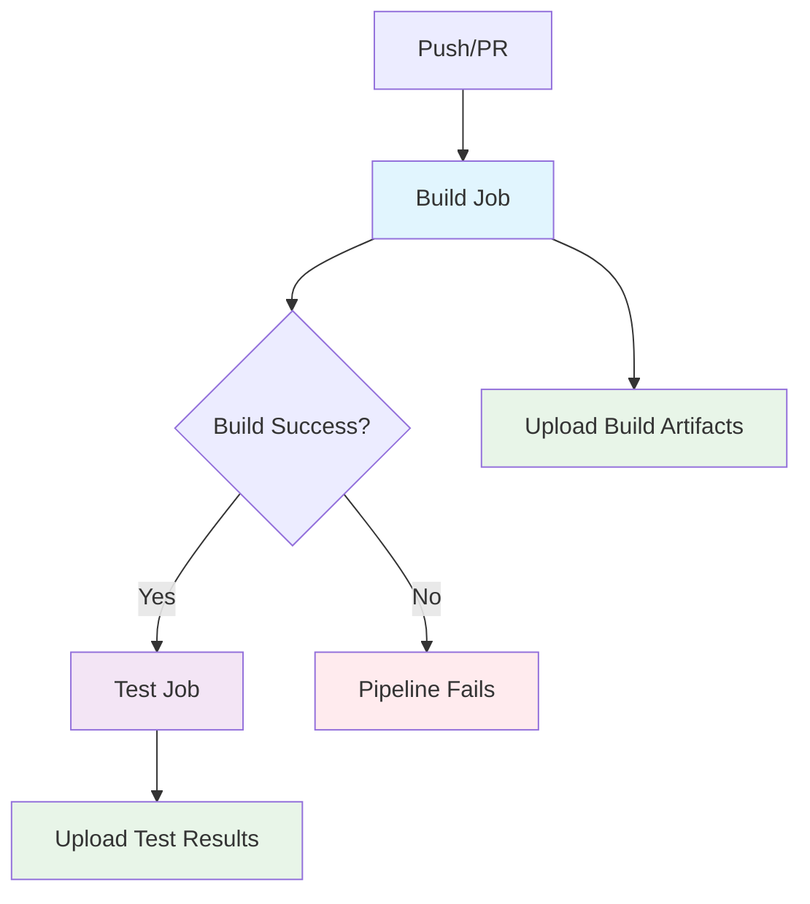

# Everything Monorepo

This is a Bazel monorepo that supports both Python and Go development with a clean, organized structure.

## Structure

```
├── hello_python/          # Python application
├── hello_go/              # Go application
├── libs/                  # Shared libraries
│   ├── python/            # Python common library
│   └── go/                # Go common library
├── MODULE.bazel           # Bazel module definition
├── BUILD.bazel            # Root build file
├── go.mod                 # Go module definition
├── requirements.in        # Python dependencies
├── requirements.lock.txt  # Locked Python dependencies
└── .bazelrc              # Bazel configuration
```

## Quick Start

### Prerequisites
- Bazel 7.0+ with bzlmod support
- Python 3.11+
- Go 1.21+

### Building and Testing

```bash
# Run all tests (most common workflow)
bazel test //...

# Run specific tests
bazel test //hello_python:test_main
bazel test //hello_go:main_test

# Run applications
bazel run //hello_python:hello_python
bazel run //hello_go:hello_go

# Build all targets
bazel build //...

# Using convenient aliases
bazel run //:run-python
bazel run //:run-go

# Run tests with detailed output
bazel test --config=ci //...
```

### Adding Dependencies

#### Python Dependencies
1. Add package to `requirements.in`
2. Run `bazel run //:pip_compile` to update `requirements.lock.txt`
3. Use `requirement("package-name")` in BUILD.bazel files

#### Go Dependencies
1. Add dependency to `go.mod`
2. Run `bazel run //:gazelle-update-repos` to update Bazel dependencies
3. Import normally in Go code

### Development Workflow

#### Adding a New Python App
1. Create directory at top level
2. Add Python source files
3. Create `BUILD.bazel` with appropriate `py_binary` and `py_test` targets
4. Reference shared libraries from `//libs/python`

#### Adding a New Go App
1. Create directory at top level
2. Add Go source files
3. Create `BUILD.bazel` with appropriate `go_binary` and `go_test` targets
4. Reference shared libraries from `//libs/go`

#### Adding Shared Libraries
- Python: Create under `libs/` with appropriate `py_library` targets
- Go: Create under `libs/` with appropriate `go_library` targets

## Features

- **Multi-language Support**: Both Python and Go in the same repository
- **Hermetic Builds**: All dependencies managed by Bazel
- **Fast Testing**: Incremental builds and test caching
- **Code Sharing**: Common libraries shared between applications
- **Modern Tooling**: Uses bzlmod for dependency management

## Configuration

- `.bazelrc`: Contains common Bazel configuration
- `MODULE.bazel`: Defines external dependencies
- `go.mod`: Go module configuration
- `requirements.in`: Python dependencies specification

## CI/CD Pipeline

The repository uses GitHub Actions for continuous integration with a sequential build → test workflow:



### CI Jobs:
- **Build**: Compiles applications and uploads artifacts
- **Test**: Runs all tests (only if build succeeds)
- **Future**: Deploy job will depend on both build and test success
