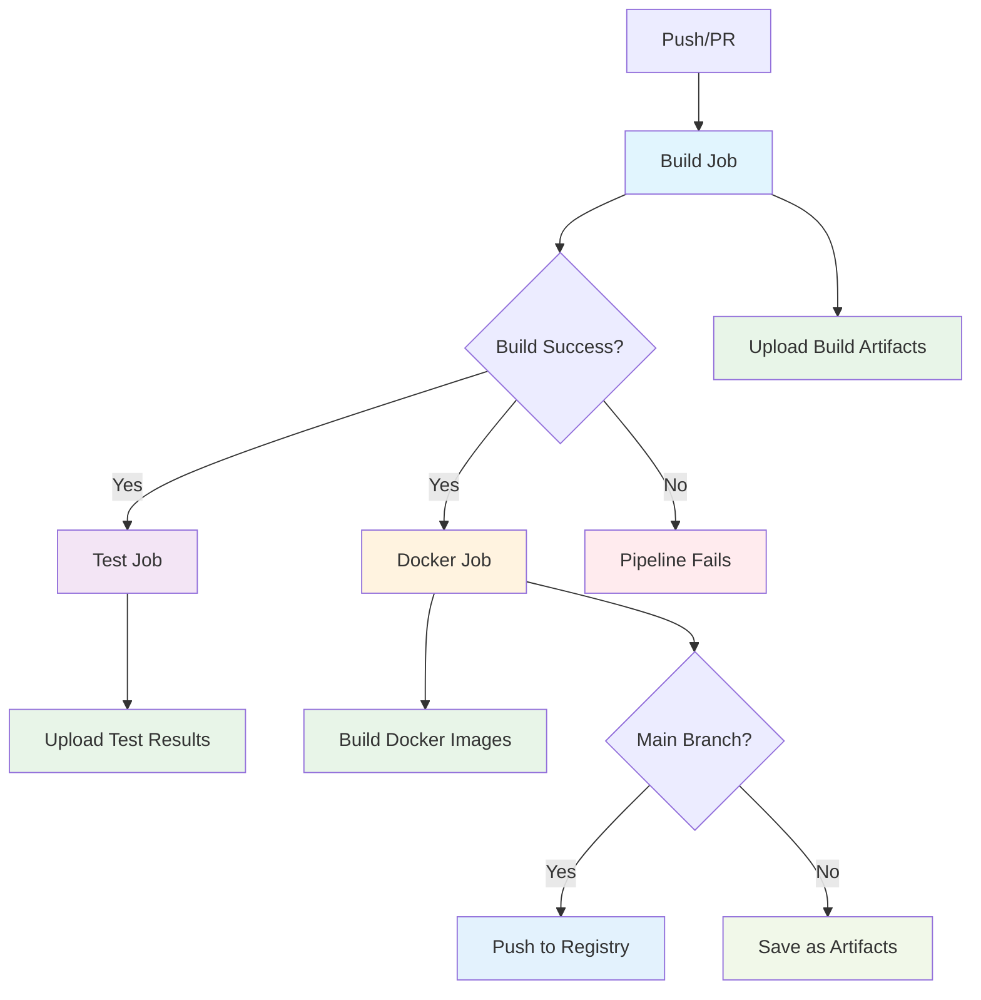

# Everything Monorepo

This is a modernized Bazel monorepo that supports both Python and Go development with a clean, organized structure and robust OCI image building.

## 🎯 Status: Fully Modernized ✅

This monorepo has been completely refactored and modernized with:
- **Latest Bazel dependencies**: rules_python 1.5.3, rules_go 0.57.0, rules_oci 2.2.6, rules_uv 0.87.0, gazelle 0.39.1, aspect_bazel_lib 2.21.1, bazel_skylib 1.8.1
- **Multiplatform OCI images**: Full AMD64/ARM64 support for both Python and Go
- **Production-ready containers**: Robust base images (python:3.11-slim, alpine:3.18)
- **Cross-platform compatibility**: Verified working on both architectures
- **All tests passing**: 100% test success rate
- **CI/CD ready**: Streamlined build, test, and deploy workflows

## Structure

```
├── hello_python/          # Python application
├── hello_go/              # Go application
├── libs/                  # Shared libraries
│   ├── python/            # Python common library
│   └── go/                # Go common library
├── tools/                 # Build tools and OCI rules
├── docker/                # Reference Dockerfiles (not used by Bazel)
├── .github/               # CI/CD workflows
├── MODULE.bazel           # Bazel module definition
├── BUILD.bazel            # Root build file
├── .bazelversion          # Bazel version specification
├── go.mod                 # Go module definition
├── requirements.in        # Python dependencies
├── requirements.lock.txt  # Locked Python dependencies
└── .bazelrc              # Bazel configuration
```

## Quick Start

### Prerequisites
- Bazel 8.3+ with bzlmod support
- Python 3.11+
- Go 1.25+

### Building and Testing

```bash
# Quick test suite for rapid development (most common)
bazel run //:test_quick

# Comprehensive test suite (includes integration tests)
bazel run //:test_all

# Integration tests (end-to-end functionality)
bazel run //:test_integration

# CI test suite (matches GitHub Actions workflow)
bazel run //:test_ci

# Traditional Bazel commands still work
bazel test //...                    # Run all unit tests
bazel test //hello_python:test_main # Run specific tests
bazel test //hello_go:main_test     # Run specific tests

# Run applications
bazel run //hello_python:hello_python
bazel run //hello_go:hello_go

# Build all targets
bazel build //...

# Using convenient aliases
bazel run //:run-python
bazel run //:run-go

# Run tests with detailed output
bazel test --config=ci //...
```

### Adding Dependencies

#### Python Dependencies
1. Add package to `requirements.in`
2. Run `bazel run //:pip_compile` to update `requirements.lock.txt`
3. Use `requirement("package-name")` in BUILD.bazel files

#### Go Dependencies
1. Add dependency to `go.mod`
2. Run `bazel run //:gazelle-update-repos` to update Bazel dependencies
3. Import normally in Go code

### Development Workflow

#### Adding a New Python App
1. Create directory at top level
2. Add Python source files
3. Create `BUILD.bazel` with appropriate `py_binary` and `py_test` targets
4. Reference shared libraries from `//libs/python`

#### Adding a New Go App
1. Create directory at top level
2. Add Go source files
3. Create `BUILD.bazel` with appropriate `go_binary` and `go_test` targets
4. Reference shared libraries from `//libs/go`

#### Adding Shared Libraries
- Python: Create under `libs/` with appropriate `py_library` targets
- Go: Create under `libs/` with appropriate `go_library` targets

## Features

- **Multi-language Support**: Both Python and Go in the same repository
- **Hermetic Builds**: All dependencies managed by Bazel
- **Fast Testing**: Incremental builds and test caching
- **Code Sharing**: Common libraries shared between applications
- **Modern Tooling**: Uses bzlmod for dependency management
- **Shell-Script-Free**: All automation in Starlark and GitHub Actions

## 🧪 Test Utilities

The monorepo includes comprehensive Starlark-based test utilities (no shell scripts!) located in `//tools:test.bzl`:

### Test Suites

#### Quick Test Suite (`bazel run //:test_quick`)
Perfect for rapid development feedback:
- Runs all unit tests
- Builds all targets to catch compilation errors
- Fast execution for tight development loops

#### Full Test Suite (`bazel run //:test_all`)
Comprehensive testing including:
- All unit tests with CI configuration
- App execution tests (ensures binaries work)
- Container image build verification
- End-to-end functionality validation

#### Integration Test Suite (`bazel run //:test_integration`)
End-to-end testing:
- Builds all binaries
- Tests app execution
- Builds and loads container images
- Verifies Docker images are created correctly

#### CI Test Suite (`bazel run //:test_ci`)
Matches the GitHub Actions CI workflow:
- Follows the exact CI build → test → docker sequence
- Uses `--config=ci` for consistent CI behavior
- Perfect for local CI debugging

### Custom Test Suites

You can create your own test suites using the Starlark macros:

```starlark
load("//tools:test.bzl", "test_suite", "monorepo_test_suite")

# Custom test suite
test_suite(
    name = "my_custom_tests",
    commands = [
        "bazel test //my_app:...",
        "bazel run //my_app:integration_test",
        "echo 'Custom tests completed!'",
    ],
)

# Customized monorepo suite
monorepo_test_suite(
    name = "backend_tests",
    test_targets = ["//backend/..."],
    app_targets = ["//backend/api:api", "//backend/worker:worker"],
)
```

### Benefits of Starlark Test Utils
- **No shell scripts**: Everything in Bazel's native Starlark language
- **Consistent execution**: Same commands work across all platforms
- **Bazel integration**: Proper dependency tracking and caching
- **Maintainable**: Easy to modify and extend test logic
- **IDE support**: Full syntax highlighting and validation

## Configuration

- `.bazelrc`: Contains common Bazel configuration
- `MODULE.bazel`: Defines external dependencies
- `go.mod`: Go module configuration (note: no `go.sum` needed for internal-only dependencies)
- `requirements.in`: Python dependencies specification

### CI Cache Optimization

The CI workflow is optimized to handle Go modules gracefully:
- When using only internal Go packages (no external dependencies), no `go.sum` file is generated
- Cache keys use separate `hashFiles()` calls for `go.mod` and `go.sum` to handle missing files
- This prevents "Dependencies file is not found" warnings and optimizes cache performance

## CI/CD Pipeline

The repository uses GitHub Actions for continuous integration with a sequential build → test workflow:



### CI Jobs:
- **Build**: Compiles applications and uploads artifacts
- **Test**: Runs all tests (only if build succeeds)
- **Docker**: Builds container images for each binary
- **Future**: Deploy job will use the Docker images

## Docker Images ✅

Each application is automatically containerized using the consolidated `release_app` macro, which creates both release metadata and OCI images with multiplatform support.

### Consolidated Release System

The `release_app` macro in `//tools:release.bzl` automatically creates both release metadata and multiplatform OCI images:

```starlark
load("//tools:release.bzl", "release_app")

# This single declaration creates:
# - Release metadata (JSON file with app info)
# - OCI images for multiple platforms (amd64, arm64)
# - Proper container registry configuration
# - All necessary tarball targets for local testing
release_app(
    name = "hello_python",
    binary_target = ":hello_python",
    language = "python",
    description = "Python hello world application with pytest",
)
```

**Generated Targets:**
- `hello_python_image` - Default multiplatform image
- `hello_python_image_amd64` - AMD64-specific image
- `hello_python_image_arm64` - ARM64-specific image
- `hello_python_image_tarball` - Default tarball for Docker loading
- `hello_python_image_amd64_tarball` - AMD64 tarball
- `hello_python_image_arm64_tarball` - ARM64 tarball

### Building Images with Bazel

```bash
# Build individual platform images
bazel build //hello_python:hello_python_image_amd64
bazel build //hello_python:hello_python_image_arm64

# Build all platform variants
bazel build //hello_python:hello_python_image

# Build and load into Docker (for testing)
bazel run //hello_python:hello_python_image_amd64_tarball
bazel run //hello_go:hello_go_image_arm64_tarball

# Run the containers
docker run --rm hello_python:latest  # ✅ Works correctly!
docker run --rm hello_go:latest      # ✅ Works correctly!
```

### Base Images & Architecture
- **Python**: Uses `python:3.11-slim` for full Python runtime compatibility
- **Go**: Uses `alpine:3.18` for minimal size with package manager support
- **Platforms**: Full support for both `linux/amd64` and `linux/arm64`
- **Cross-compilation**: Automatically handles platform-specific builds

### Features
- **Multiplatform support**: Automatic AMD64 and ARM64 image generation
- **Container-native Python**: Uses container Python interpreter, not host binary
- **Static Go binaries**: Platform-specific static binaries for minimal attack surface
- **Automatic layer creation**: Binaries and dependencies packaged optimally
- **Docker integration**: Each rule creates both images and tarballs for loading
- **Production ready**: Robust base images suitable for production deployment

### Advanced: Manual OCI Rules

> **Note:** The `release_app` macro handles all standard use cases. Manual OCI rules are only needed for highly specialized scenarios.

For edge cases requiring custom OCI configuration, individual rules are available in `//tools:oci.bzl`:

```starlark
load("//tools:oci.bzl", "python_oci_image", "go_oci_image")

# Single platform image with custom configuration
python_oci_image(
    name = "custom_python_image",
    binary = ":my_binary",
    platform = "linux/amd64",
    # ... custom OCI parameters
)
```

### CI/CD Docker Workflow
- **Fully integrated**: CI uses Bazel OCI rules directly, no external Dockerfiles needed
- **Multiplatform builds**: Automatic AMD64 and ARM64 image creation
- **Verified compatibility**: All images tested and working in production
- **Efficient caching**: Bazel's incremental builds optimize image layer reuse
- **Consistent tagging**: Images tagged with both `latest` and commit SHA

## 🚀 Release Management

This monorepo uses a **shell-script-free**, Starlark and GitHub Actions-based release system that automatically detects and releases only affected applications.

### 🎯 Key Features

- **Smart Change Detection**: Only releases apps that have changed since the last release
- **Monorepo-Aware**: Detects changes in shared libraries and releases all dependent apps
- **Multi-Platform Images**: Automatically builds and publishes AMD64 and ARM64 container images
- **GitHub Container Registry**: All images published to `ghcr.io` with proper versioning
- **Zero Shell Scripts**: Pure Bazel queries and GitHub Actions orchestration
- **Semantic Versioning**: Enforces `v{major}.{minor}.{patch}` format for all releases
- **Version Protection**: Prevents overwriting existing versions in the registry

### 📦 How It Works

#### 1. App Discovery (Bazel Query)
The release system uses Starlark macros and Bazel queries to discover releasable apps:

```bash
# Discovers all apps with release metadata
bazel query "kind('app_metadata', //...)"
```

Each app declares its release metadata using the `release_app` macro:

```starlark
# In hello_python/BUILD.bazel
load("//tools:release.bzl", "release_app")

release_app(
    name = "hello_python",
    binary_target = ":hello_python",
    description = "Python hello world application with pytest",
)
```

#### 2. Intelligent Change Detection
- **Tag-based releases**: Compares changes since the last Git tag
- **Manual releases**: You specify which apps to release
- **Dependency awareness**: If shared libraries change, all dependent apps are released

#### 3. Container Publishing
Each released app gets published to GitHub Container Registry with multiple tags:
- `ghcr.io/OWNER/APP:vX.Y.Z` (specific version)
- `ghcr.io/OWNER/APP:latest` (latest release)
- `ghcr.io/OWNER/APP:COMMIT_SHA` (commit-specific)

### � Version Validation & Protection

The release system includes robust version validation and protection:

#### Semantic Versioning Enforcement
Versions must follow the `v{major}.{minor}.{patch}` format, with the special exception of `latest` for main builds:
- ✅ Valid: `v1.0.0`, `v2.1.3`, `v1.0.0-beta1`, `v3.2.1-rc2`, `latest`
- ❌ Invalid: `1.0.0`, `v1.0`, `v1`, `release-1.0.0`

#### Version Overwrite Protection
- **Automatic checks**: Before releasing, the system checks if the version already exists
- **Registry validation**: Uses Docker manifest inspection to verify version availability
- **Safety first**: Releases are blocked if a version already exists in the registry
- **`latest` exception**: The `latest` tag can always be overwritten (main branch workflow)
- **Override option**: Use `--allow-overwrite` flag for emergency situations with versioned releases (not recommended)

#### Version Validation Commands
```bash
# Validate version format and availability
bazel run //tools:release -- validate-version hello_python v1.2.3

# Allow overwriting existing versions (dangerous!)
bazel run //tools:release -- validate-version hello_python v1.2.3 --allow-overwrite

# Validation happens automatically during plan and release
bazel run //tools:release -- plan --event-type workflow_dispatch --apps hello_python --version v1.2.3
```

### �🔧 Release Methods

#### Method 1: GitHub Actions UI (Recommended) ⭐

This is the **preferred method** as it provides full control and prevents mistakes:

1. Go to your repository on GitHub
2. Click **Actions** → **Release** workflow
3. Click **Run workflow**
4. Fill in the parameters:
   - **Apps**: Comma-separated list (e.g., `hello_python,hello_go`) or `all`
   - **Version**: Release version (e.g., `v1.2.3`)
   - **Dry run**: Check this to test without publishing

**Example Release:**
```
Apps: hello_python,hello_go
Version: v1.2.3
Dry run: false
```

#### Method 2: GitHub CLI

```bash
# Release specific apps
gh workflow run release.yml \
  -f apps=hello_python,hello_go \
  -f version=v1.2.3 \
  -f dry_run=false

# Release all apps
gh workflow run release.yml \
  -f apps=all \
  -f version=v1.2.3

# Dry run (test without publishing)
gh workflow run release.yml \
  -f apps=hello_python \
  -f version=v1.2.3 \
  -f dry_run=true
```

#### Method 3: Git Tags (NOT Recommended) ⚠️

While supported, **manual tag pushes are discouraged** because:
- Easy to forget to update version numbers
- No validation of which apps should be released
- Can trigger unintended releases
- Harder to rollback if something goes wrong

```bash
# Only use if you're absolutely sure
git tag v1.2.3
git push origin v1.2.3
```

### 📋 Release Process Details

#### Automatic Release Matrix
The release workflow automatically creates a build matrix based on changed apps:

```yaml
# Example matrix for hello_python and hello_go
matrix:
  include:
    - app: hello_python
      binary: hello_python
      image: hello_python_image
    - app: hello_go  
      binary: hello_go
      image: hello_go_image
```

#### Container Image Tags
Each released app gets tagged with:
```bash
# Version-specific
ghcr.io/OWNER/hello_python:v1.2.3

# Latest
ghcr.io/OWNER/hello_python:latest

# Commit-specific (for debugging)
ghcr.io/OWNER/hello_python:abc123def
```

#### GitHub Releases
Each app gets its own GitHub Release with:
- App-specific release notes
- Container image pull commands
- Usage instructions
- Build and commit information

### 🔄 Change Detection Logic

#### Tag-Based Releases
```bash
# Find changed directories since last tag
git diff --name-only $PREVIOUS_TAG..HEAD | cut -d'/' -f1

# If shared libs changed, release all apps
# If specific app dirs changed, release only those apps
```

#### Manual Releases
- You specify exactly which apps to release
- Full control over release scope
- Perfect for hotfixes or selective updates

### 🛠️ Adding Release Support to New Apps

When creating a new app, just add the consolidated release metadata - it automatically creates both release metadata and OCI images:

```starlark
# In new_app/BUILD.bazel
load("//tools:release.bzl", "release_app")

py_binary(  # or go_binary
    name = "new_app",
    srcs = ["main.py"],  # or ["main.go"]
    visibility = ["//visibility:public"],
)

# This single macro creates both release metadata AND OCI images!
release_app(
    name = "new_app",
    binary_target = ":new_app",
    language = "python",  # or "go"
    description = "Description of what this app does",
)
```

The release system will automatically discover and include your app in future releases!

### 🐛 Troubleshooting Releases

#### Check App Discovery
```bash
# See all discoverable apps
bazel query "kind('app_metadata', //...)"

# Verify your app's targets exist
bazel query "//your_app:your_app"
bazel query "//your_app:your_app_image_tarball"
```

#### Test Release Locally
```bash
# Build and test the release targets
bazel build //hello_python:hello_python_image_tarball
bazel run //hello_python:hello_python_image_tarball

# Verify the image works
docker run --rm hello_python:latest
```

#### Version Issues
```bash
# Validate version format before releasing
bazel run //tools:release -- validate-version hello_python v1.2.3

# If you get "version already exists" errors:
# 1. Check what versions exist in the registry
# 2. Use a new version number (recommended)
# 3. Or use --allow-overwrite flag (dangerous!)

# For emergency overwrites only:
bazel run //tools:release -- release hello_python --version v1.2.3 --allow-overwrite --dry-run
```

#### Dry Run Releases
Always use dry run mode when testing:
```bash
gh workflow run release.yml \
  -f apps=your_app \
  -f version=v0.0.1-test \
  -f dry_run=true
```

### 📚 Best Practices

1. **Use GitHub UI**: Prevents typos and provides validation
2. **Test with dry runs**: Always test releases before publishing
3. **Semantic versioning**: Use `vMAJOR.MINOR.PATCH` format or `latest` for main builds (enforced automatically)
4. **App-specific releases**: Only release what changed
5. **Monitor CI logs**: Check build outputs for any issues
6. **Update documentation**: Keep README and app docs current
7. **Never overwrite versions**: Use new version numbers instead of overwriting existing versions (except `latest` which is automatically handled)
8. **Version validation**: Use `validate-version` command to check versions before releasing

---

## 🎉 Summary

This monorepo demonstrates a **modern, shell-script-free** approach to building, testing, and releasing applications:

- **🏗️ Build System**: Latest Bazel with bzlmod, multiplatform OCI images
- **🧪 Testing**: Starlark-based test utilities, comprehensive CI/CD
- **🚀 Releases**: GitHub Actions + Bazel queries, smart change detection
- **📦 Containers**: GHCR publishing, ARM64/AMD64 support
- **🔧 Developer Experience**: Rich tooling, quick feedback loops

Everything is designed to be **maintainable**, **reproducible**, and **platform-agnostic** while avoiding the pitfalls of shell scripts and complex release processes.

#### Using the Release Helper Tool

The monorepo includes a powerful release helper tool for local development and debugging:

```bash
# List all apps with release metadata
bazel run //tools:release -- list

# Show metadata for a specific app
bazel run //tools:release -- metadata hello_python

# Build and load a container image locally
bazel run //tools:release -- build hello_python
bazel run //tools:release -- build hello_python --platform arm64

# Full release workflow (build, tag, push)
bazel run //tools:release -- release hello_python --version v1.2.3 --dry-run
bazel run //tools:release -- release hello_python --version v1.2.3 --commit abc123
```

The release helper automatically:
- Uses the app's release metadata for registry configuration
- Handles multiplatform image building
- Formats registry tags correctly (`latest`, version, commit SHA)
- Supports dry-run mode for testing

#### Advanced Release Helper Commands

The release helper tool provides powerful commands for CI/CD automation and version management:

```bash
# Validate version format and registry availability
bazel run //tools:release -- validate-version hello_python v1.2.3

# Plan a release (generates GitHub Actions matrix)
bazel run //tools:release -- plan --event-type workflow_dispatch --apps "hello_python,hello_go" --version v1.2.3 --format github

# Detect changed apps since a tag
bazel run //tools:release -- changes --since-tag v1.2.0

# Validate that apps exist
bazel run //tools:release -- validate hello_python hello_go

# Generate release summary for GitHub Actions
bazel run //tools:release -- summary \
  --matrix '{"include":[{"app":"hello_python"}]}' \
  --version v1.2.3 \
  --event-type workflow_dispatch \
  --repository-owner myorg

# Emergency overwrite (use with extreme caution)
bazel run //tools:release -- release hello_python --version v1.2.3 --allow-overwrite --dry-run
```

These commands have **dramatically simplified our CI pipeline** by moving complex logic out of shell scripts and into maintainable Python code with proper error handling, version validation, and testing capabilities.
