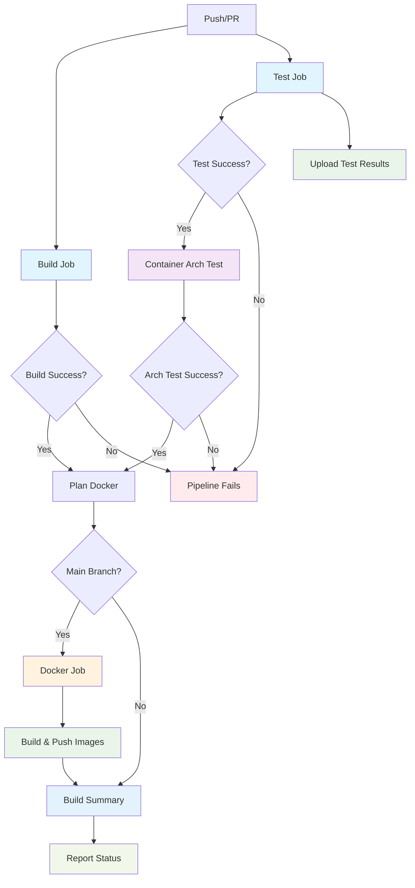

# CI/CD Pipeline

This guide describes the continuous integration and deployment pipeline.

## Overview

The repository uses GitHub Actions for continuous integration with parallel build and test jobs. Bazel provides excellent caching by default, caching build outputs, test results, and dependencies between builds, which significantly speeds up CI runs.

## Pipeline Flow

## Bazel Caching Benefits

- **Build Cache**: Reuses compiled artifacts across builds when source files haven't changed
- **Test Cache**: Skips re-running tests when code and dependencies are unchanged  
- **Remote Cache**: Shares cache between CI runs and developers (configured in `.bazelrc`)
- **Dependency Cache**: Caches external dependencies like Python packages and Go modules

## CI Jobs

### Build
Builds all targets to verify compilation (runs in parallel with Test)

### Test
Runs all unit and integration tests

### Container Arch Test
Verifies cross-compilation for multi-architecture containers (critical for ARM64 support)

### Plan Docker
Determines which apps need Docker images built based on changes

### Docker
Builds container images and pushes to registry (only runs on main branch commits)

### Build Summary
Collects and reports the status of all CI jobs
