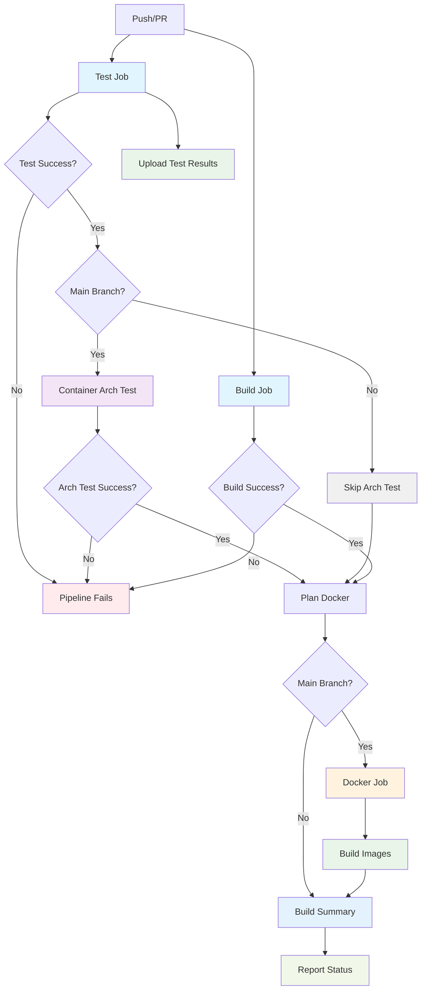

# CI/CD Pipeline

This guide describes the continuous integration and deployment pipeline.

## Overview

The repository uses GitHub Actions for continuous integration with parallel build and test jobs. Bazel provides excellent caching by default, caching build outputs, test results, and dependencies between builds, which significantly speeds up CI runs.

## Pipeline Flow

```mermaid
graph TD
    A[Push/PR] --> B[Build Job]
    A --> C[Test Job]
    C --> D{Test Success?}
    D -->|No| F[Pipeline Fails]
    D -->|Yes| E{Main Branch?}
    E -->|Yes| E1[Container Arch Test]
    E -->|No| E2[Skip Arch Test]
    E1 --> I{Arch Test Success?}
    I -->|No| F
    I -->|Yes| H[Plan Docker]
    E2 --> H
    B --> G{Build Success?}
    G -->|Yes| H
    G -->|No| F
    H --> J{Main Branch?}
    J -->|Yes| K[Docker Job]
    J -->|No| L[Build Summary]
    K --> M[Build Images]
    M --> L
    L --> N[Report Status]
    C --> O[Upload Test Results]
    
    style B fill:#e1f5fe
    style C fill:#e1f5fe
    style E1 fill:#f3e5f5
    style E2 fill:#f0f0f0
    style K fill:#fff3e0
    style F fill:#ffebee
    style O fill:#e8f5e8
    style M fill:#e8f5e8
    style L fill:#e3f2fd
    style N fill:#f1f8e9
```

## Bazel Caching Benefits

- **Build Cache**: Reuses compiled artifacts across builds when source files haven't changed
- **Test Cache**: Skips re-running tests when code and dependencies are unchanged  
- **Remote Cache**: Shares cache between CI runs and developers (configured in `.bazelrc`)
- **Dependency Cache**: Caches external dependencies like Python packages and Go modules

## CI Jobs

### Build
Builds all targets to verify compilation (runs in parallel with Test)

### Test
Runs all unit and integration tests

### Container Arch Test
Verifies cross-compilation for multi-architecture containers (critical for ARM64 support). Runs on main branch builds only to reduce CI overhead on feature branches.

### Plan Docker
Determines which apps need Docker images built based on changes (runs as a lightweight planning job without Bazel cache or Docker Buildx overhead).

### Docker
Builds container images for all changed applications sequentially in a single runner to verify compilation (only runs on main branch commits). Images are not pushed to the registry; use the Release workflow for publishing images.

### Build Summary
Collects and reports the status of all CI jobs.

## Runner Architecture & Bazel Server Warming

CI image verification ([`ci.yml`](../.github/workflows/ci.yml)) and release publishing ([`release.yml`](../.github/workflows/release.yml)) prioritize **single-runner sequential execution with a warm Bazel daemon** over GitHub Actions matrix fanout.

### Empirical Rationale

Production telemetry and workflow benchmarks showed that matrix fanout across individual applications incurred substantial overhead:

- **Fixed Setup Overhead (~60–90s per runner)**: GitHub Actions runner provisioning, repository checkout (`fetch-depth: 0`), [`setup-build-env`](../.github/actions/setup-build-env/action.yml) (Bazel installation, external repository cache restore, remote cache auth), and Docker Buildx initialization.
- **Actual Build / Check Time (~10–30s)**: With Bazel remote caching and layer reuse, building or checking image digests is fast. In typical release runs where digests are unchanged, no-op checks complete in under 20 seconds.
- **Overhead Multiplier**: Fanning out across $N$ apps spent 80–90% of total runner minutes repeating identical environment initialization and downloading toolchains on separate cold runners.

### Benefits of Single-Runner Execution

1. **Bazel Server Warming**: Executing sequential app builds on one runner keeps the local Bazel daemon alive in memory. Subsequent target evaluations reuse loaded repository rules, external dependency graphs, Python/Go toolchains, and common library compilations without re-analysis.
2. **Internal Parallelism**: Bazel natively parallelizes action execution across all CPU cores on the runner (`--jobs`).
3. **Decoupled Planning**: Planning jobs (`plan-docker`, `plan-release`) remain separate lightweight steps that execute in seconds using prebuilt release tools, outputting the change plan before build runners start.
4. **Reduced Churn**: Eliminates inter-job artifact coordination and race conditions across fanned-out matrix legs.

## CI Test Job Parallelism vs. Consolidation (`ci.yml`)

`ci.yml`'s `test` and `test-database` jobs run in parallel on every PR, each
paying its own `Setup Build Environment` (checkout + Bazel/cache setup) even
though they share the same remote Bazel cache. This looks like the same
per-runner setup overhead that motivated single-runner sequential execution
for `release.yml` (above) — so it's worth asking whether `ci.yml`'s test jobs
should be consolidated the same way. They should not; the two workflows
optimize for different things.

### The experiment

Two back-to-back runs on the same PR ([#1107](https://github.com/whale-net/everything/pull/1107),
closed without merging): a baseline with `test` and `test-database` as
separate parallel jobs
([run 32685276005](https://github.com/whale-net/everything/actions/runs/32685276005)),
then the `test-database` steps merged into `test`
([run 32685567628](https://github.com/whale-net/everything/actions/runs/32685567628)).

| | Baseline (separate jobs) | Consolidated (one job) |
|---|---|---|
| `test` setup | 28s | 41s (now includes Docker setup) |
| build + coverage | 139s | 138s |
| manifest contract check | 63s | 59s |
| db-test step | 167s (own job, own setup) | 101s (same job, warm Bazel server) |
| **Total compute (sum of job-seconds)** | 460s | 354s (**-23%**) |
| **Wall clock (PR feedback)** | 243s — jobs ran in parallel | 354s (**+45%**) — now serial |

The db-test step really did get 40% faster (167s → 101s) riding the warm
local Bazel daemon and disk cache left behind by the preceding build step in
the same job — confirming there is real duplicated analysis/fetch work
across the two jobs, on top of what the shared remote cache already
dedupes.

### Why the split stays

`whale-net/everything` is a **public** repository, so GitHub-hosted runner
minutes are free and effectively unlimited — the 106s of compute saved by
consolidating has no billing value. What it does cost is PR feedback
latency: two jobs that used to finish in parallel (243s wall clock) become
one job that takes 354s, a 45% slower critical path on every PR. `release.yml`
makes the opposite tradeoff deliberately because it fans out over many
per-app legs where fixed setup overhead (~60-90s per runner) dominates total
runner-minutes; `ci.yml`'s test jobs are few, already cheap to set up (~30s),
and running them in parallel is the actual point.

**Conclusion: keep `test`, `test-database`, and `test-container-arch` as
separate parallel jobs.** Re-run this experiment if either changes:
the repo goes private (compute now has a cost), or a `setup-build-env` change
meaningfully raises per-job setup cost relative to the work each job does.

## App Registry

`.github/workflows/release.yml` and a separate `.github/workflows/promote.yml`
talk to the [App Registry](../tools/app_registry/TOC.md), a gRPC service that
indexes published artifacts and (once actually used) tracks
per-environment promotion state. Both are gated and, as of today, dormant —
see [`tools/app_registry/OPERATIONS.md`](../tools/app_registry/OPERATIONS.md)
for the operator runbook.

### Recording (`release.yml`)

Two `continue-on-error` steps, both gated on `vars.APP_REGISTRY_CICD_OPT_IN
== 'true'`:

- **`Record build and artifact in App Registry`** (in the `release` job) —
  after an image is pushed, resolves its digest and calls `app-registry
  builds record` + `artifacts record --kind image`.
- **`Record chart artifacts in App Registry`** (in `release-helm-charts`) —
  after a chart is published, resolves its pinned images (from the
  compose-time lockfile) to digests and calls `artifacts record --kind
  chart --contains ...`.

`APP_REGISTRY_CICD_OPT_IN` is unset by default. With it unset, CI makes no
registry calls at all — the recording steps do not run. The recording steps
themselves are still `continue-on-error` (a registry outage must never fail
a real release), but each job that has any also ends with an **App Registry
recording health** step that is not: it fails the job if any recording step
in it failed, after the real push/tag/upload has already happened — so a
failed recording now shows a RED job, not a green one. Check the step's own
log to know which recording step failed and why; see
[`tools/app_registry/OPERATIONS.md` "Recording (automatic,
best-effort)"](../tools/app_registry/OPERATIONS.md#2-recording-automatic-best-effort)
for the full triage. As of issue #547, a failed recording also carries a
`::warning::` annotation and a `$GITHUB_STEP_SUMMARY` entry naming which of
two cases it is — "app not registered yet" (the release ran ahead of
`ReconcileApps`) vs. a genuine registry error — so this no longer requires
opening the log; see
[`tools/app_registry/OPERATIONS.md` "Release ran ahead of
reconcile"](../tools/app_registry/OPERATIONS.md#release-ran-ahead-of-reconcile-issue-547).

### `promote.yml`

A separate, human-triggered `workflow_dispatch` workflow that promotes or
rolls back a recorded artifact to an environment (`dev`/`stage`/`prod`). Its
job declares `environment: ${{ inputs.environment }}`, which scopes it to
that GitHub Environment's `app-registry-promoter-<environment>` secret and
triggers that environment's required reviewers — this declaration is the
entire security model, not a formality. Unlike the recording steps above, it
is **not** `continue-on-error`: a failed promotion fails the run.

**Status: deprecated / disabled for now.** No Keycloak clients and no GitHub Environments
(`dev`/`stage`/`prod`) exist yet, and the workflow job is disabled with `if: false`.
See [`tools/app_registry/DEPLOY.md`](../tools/app_registry/DEPLOY.md) for
what has to exist first.

## Release Tools Acquisition (`release-v2.yml`)

`release-v2.yml` needs `release_helper_go` and `app-registry` (the CLI, not
the server) to run its own `plan`/`build-app`/`package-assets` steps. It
never builds these from source by default — it downloads prebuilt,
checksum-verified binaries via `./.github/actions/download-release-tools`,
resolving the version to fetch from whatever's currently promoted in the
App Registry for `vars.APP_REGISTRY_BUILDER_ENV` (default `dev`). The
`build-release-tools` job probes once per run whether that resolves to a
real, fetchable S3 object (not just a promoted DB record — see #1036) and,
if not, builds both tools via Bazel and uploads them as a `release-tools`
workflow artifact every other job's `download-release-tools` call
downloads instead of hitting S3 directly.

**Safety valve: `RELEASE_TOOLS_FALLBACK_TO_SOURCE`.** A repository variable,
unset/`false` by default, wired into every `download-release-tools` call's
`fallback_to_source` input. With it unset, a failed prebuilt/artifact
acquisition fails the job outright with a clear error — today's behavior,
unchanged. Set it to `'true'` (`gh variable set RELEASE_TOOLS_FALLBACK_TO_SOURCE
--repo whale-net/everything --body true`) to make that same failure instead
build the tools from source via Bazel inline, in whichever job hit the
failure. This is meant as a temporary operator escape hatch for exactly the
kind of chicken-and-egg bootstrap gap that motivated it (App Registry/S3
acquisition broken, but release-v2.yml itself is what would normally
publish the fix) — flip it back to `false`/unset once the underlying
acquisition path is healthy again, since source builds are slower and skip
the checksum-verified prebuilt-binary supply chain. Two call sites
(`plan-release`'s resolved-plan path and `release-summary`) normally skip
Bazel setup entirely for speed; each gets its own `Setup Build Environment
(fallback safety valve)` step, gated on the same variable, so the valve
actually works there too instead of failing on a missing `bazel` binary.
