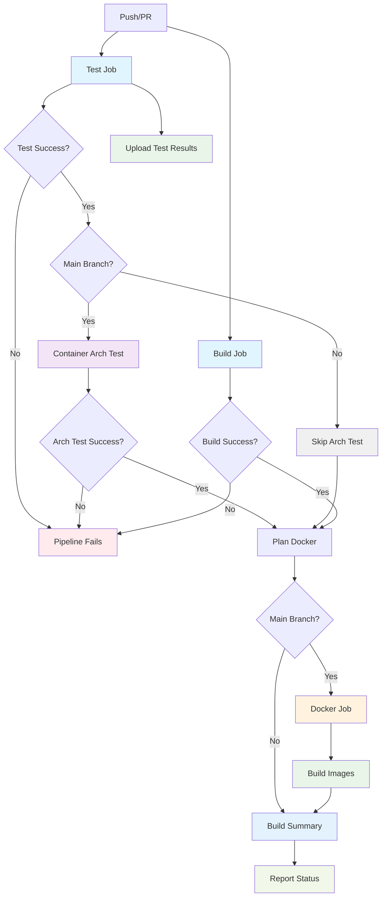

# CI/CD Pipeline

This guide describes the continuous integration and deployment pipeline.

## Overview

The repository uses GitHub Actions for continuous integration with parallel build and test jobs. Bazel provides excellent caching by default, caching build outputs, test results, and dependencies between builds, which significantly speeds up CI runs.

## Pipeline Flow

```mermaid
graph TD
    A[Push/PR] --> B[Build Job]
    A --> C[Test Job]
    C --> D{Test Success?}
    D -->|No| F[Pipeline Fails]
    D -->|Yes| E{Main Branch?}
    E -->|Yes| E1[Container Arch Test]
    E -->|No| E2[Skip Arch Test]
    E1 --> I{Arch Test Success?}
    I -->|No| F
    I -->|Yes| H[Plan Docker]
    E2 --> H
    B --> G{Build Success?}
    G -->|Yes| H
    G -->|No| F
    H --> J{Main Branch?}
    J -->|Yes| K[Docker Job]
    J -->|No| L[Build Summary]
    K --> M[Build Images]
    M --> L
    L --> N[Report Status]
    C --> O[Upload Test Results]
    
    style B fill:#e1f5fe
    style C fill:#e1f5fe
    style E1 fill:#f3e5f5
    style E2 fill:#f0f0f0
    style K fill:#fff3e0
    style F fill:#ffebee
    style O fill:#e8f5e8
    style M fill:#e8f5e8
    style L fill:#e3f2fd
    style N fill:#f1f8e9
```

## Bazel Caching Benefits

- **Build Cache**: Reuses compiled artifacts across builds when source files haven't changed
- **Test Cache**: Skips re-running tests when code and dependencies are unchanged  
- **Remote Cache**: Shares cache between CI runs and developers (configured in `.bazelrc`)
- **Dependency Cache**: Caches external dependencies like Python packages and Go modules

## CI Jobs

### Build
Builds all targets to verify compilation (runs in parallel with Test)

### Test
Runs all unit and integration tests

### Container Arch Test
Verifies cross-compilation for multi-architecture containers (critical for ARM64 support). Runs on main branch builds only to reduce CI overhead on feature branches.

### Plan Docker
Determines which apps need Docker images built based on changes

### Docker
Builds container images to verify they compile correctly (only runs on main branch commits). Images are not pushed to the registry; use the Release workflow for publishing images.

### Build Summary
Collects and reports the status of all CI jobs

## App Registry

`.github/workflows/release.yml` and a separate `.github/workflows/promote.yml`
talk to the [App Registry](../tools/app_registry/TOC.md), a gRPC service that
indexes published artifacts and (once actually used) tracks
per-environment promotion state. Both are gated and, as of today, dormant —
see [`tools/app_registry/OPERATIONS.md`](../tools/app_registry/OPERATIONS.md)
for the operator runbook.

### Recording (`release.yml`)

Two `continue-on-error` steps, both gated on `vars.APP_REGISTRY_CICD_OPT_IN
== 'true'`:

- **`Record build and artifact in App Registry`** (in the `release` job) —
  after an image is pushed, resolves its digest and calls `app-registry
  builds record` + `artifacts record --kind image`.
- **`Record chart artifacts in App Registry`** (in `release-helm-charts`) —
  after a chart is published, resolves its pinned images (from the
  compose-time lockfile) to digests and calls `artifacts record --kind
  chart --contains ...`.

`APP_REGISTRY_CICD_OPT_IN` is unset by default. With it unset, CI makes no
registry calls at all — the recording steps do not run. The recording steps
themselves are still `continue-on-error` (a registry outage must never fail
a real release), but each job that has any also ends with an **App Registry
recording health** step that is not: it fails the job if any recording step
in it failed, after the real push/tag/upload has already happened — so a
failed recording now shows a RED job, not a green one. Check the step's own
log to know which recording step failed and why; see
[`tools/app_registry/OPERATIONS.md` "Recording (automatic,
best-effort)"](../tools/app_registry/OPERATIONS.md#2-recording-automatic-best-effort)
for the full triage. As of issue #547, a failed recording also carries a
`::warning::` annotation and a `$GITHUB_STEP_SUMMARY` entry naming which of
two cases it is — "app not registered yet" (the release ran ahead of
`ReconcileApps`) vs. a genuine registry error — so this no longer requires
opening the log; see
[`tools/app_registry/OPERATIONS.md` "Release ran ahead of
reconcile"](../tools/app_registry/OPERATIONS.md#release-ran-ahead-of-reconcile-issue-547).

### `promote.yml`

A separate, human-triggered `workflow_dispatch` workflow that promotes or
rolls back a recorded artifact to an environment (`dev`/`stage`/`prod`). Its
job declares `environment: ${{ inputs.environment }}`, which scopes it to
that GitHub Environment's `app-registry-promoter-<environment>` secret and
triggers that environment's required reviewers — this declaration is the
entire security model, not a formality. Unlike the recording steps above, it
is **not** `continue-on-error`: a failed promotion fails the run.

**Status: built, never run.** No Keycloak clients and no GitHub Environments
(`dev`/`stage`/`prod`) exist yet, so `promote.yml` cannot currently succeed.
See [`tools/app_registry/DEPLOY.md`](../tools/app_registry/DEPLOY.md) for
what has to exist first.
