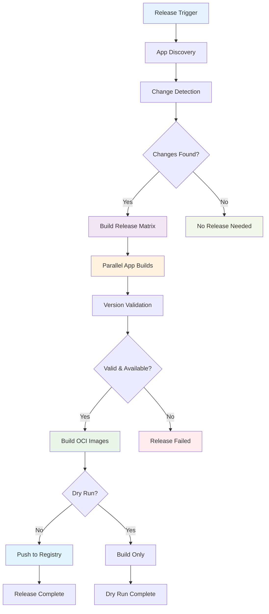

# Release Management

This guide covers the comprehensive release management system for the monorepo.

## Overview

This monorepo uses a **shell-script-free**, Starlark and GitHub Actions-based release system that automatically detects and releases only affected applications.

<!-- NOTE: Future improvements needed:
- Add tag-based release trigger support to GitHub workflow
- Consider adding semantic version auto-increment based on conventional commits
- Evaluate if change detection accuracy needs tuning for edge cases
-->

## Key Features

- **🔍 Automatic App Discovery**: Uses Bazel queries to find releasable apps with `release_app` metadata
- **🎯 Intelligent Change Detection**: Only releases apps affected by changes, with dependency awareness  
- **🐳 Consolidated Container Images**: Single macro creates both release metadata and multi-platform OCI images
- **🔒 Version Protection**: Prevents accidental overwrites with semantic versioning validation
- **🚀 Multiple Release Methods**: GitHub UI, CLI, or Git tags with comprehensive dry-run support
- **📋 Release Matrix**: Automatically generates build matrices for efficient parallel releases
- **📝 Automatic Release Notes**: Generates release notes for each app during releases with commit details
- **🛠️ Shell-Script Free**: Pure Starlark and GitHub Actions implementation for maintainability

## How It Works

The release system operates through three main phases, automatically detecting and releasing only apps that have changed:



**Release Behavior:**
- **Selective Releases**: Only apps with actual changes are released, reducing noise and registry bloat
- **Dependency Awareness**: If shared libraries change, all dependent apps are automatically included
- **Parallel Processing**: Multiple apps are built and released simultaneously for efficiency

## App Discovery (Bazel Query)

The release system uses Starlark macros and Bazel queries to discover releasable apps:

```bash
# Discovers all apps with release metadata
bazel query "kind('app_metadata', //...)"
```

Each app declares its release metadata using the `release_app` macro:

```starlark
# In demo/hello_python/BUILD.bazel
load("//tools:release.bzl", "release_app")

release_app(
    name = "hello-python",
    language = "python",
    domain = "demo",
    description = "Python hello world application with pytest",
    app_type = "external-api",  # One of: external-api, internal-api, worker, job
    port = 8000,  # Port for server apps (0 for non-server apps)
    args = ["run-server"],  # Optional command-line arguments
)
```

The `release_app` macro accepts metadata directly:
- **`app_type`**: Application type (external-api, internal-api, worker, or job)
- **`port`**: Port number for server applications (default: 0)
- **`args`**: Optional command-line arguments (default: [])
- **`domain`**: Domain/category for the app (e.g., "demo", "api")

Metadata is specified once in `release_app` and used for both container images and Helm chart generation.

## Intelligent Change Detection

The system supports multiple detection modes, though the current implementation has some limitations:

- **Tag-based releases**: Compares changes since the last Git tag for automatic releases
- **Manual releases**: You specify which apps to release via GitHub Actions inputs
- **Dependency awareness**: If shared libraries change, all dependent apps are released

**Change Detection Methods:**
- **Bazel Query**: Uses `bazel query --output=package` for dependency analysis (default, but may have edge cases)
- **File-based**: Simple file change detection for faster processing when Bazel query isn't needed

**Known Limitations:**
- Bazel query dependency analysis may not catch all transitive dependencies accurately
- File-based detection uses directory prefix matching which can be overly broad
- Infrastructure changes (tools/, .github/, MODULE.bazel) trigger all apps to rebuild as a safety measure
- If no specific apps are detected as changed but files were modified, all apps are rebuilt conservatively

## Container Publishing

Each released app gets published to GitHub Container Registry with multiple tags using the `<domain>-<app>:<version>` format:
- `ghcr.io/OWNER/DOMAIN-APP:vX.Y.Z` (specific version)
- `ghcr.io/OWNER/DOMAIN-APP:latest` (latest release)
- `ghcr.io/OWNER/DOMAIN-APP:COMMIT_SHA` (commit-specific)

## Version Validation & Protection

The release system includes robust version validation and protection:

### Semantic Versioning Enforcement

Versions must follow the `v{major}.{minor}.{patch}` format, with the special exception of `latest` for main builds:
- ✅ Valid: `v1.0.0`, `v2.1.3`, `v1.0.0-beta1`, `v3.2.1-rc2`, `latest`
- ❌ Invalid: `1.0.0`, `v1.0`, `v1`, `release-1.0.0`

### Version Overwrite Protection

- **Automatic checks**: Before releasing, the system checks if the version already exists
- **Registry validation**: Uses Docker manifest inspection to verify version availability
- **Safety first**: Releases are blocked if a version already exists in the registry
- **`latest` exception**: The `latest` tag can always be overwritten (main branch workflow)
- **Override option**: Use `--allow-overwrite` flag for emergency situations with versioned releases (not recommended)

### Version Validation Commands

```bash
# Validate version format and availability
bazel run //tools:release -- validate-version hello-python v1.2.3

# Allow overwriting existing versions (dangerous!)
bazel run //tools:release -- validate-version hello-python v1.2.3 --allow-overwrite

# Validation happens automatically during plan and release
bazel run //tools:release -- plan --event-type workflow_dispatch --apps hello-python --version v1.2.3
```

## Release Methods

### Method 1: GitHub Actions UI (Recommended) ⭐

This is the **preferred method** as it provides full control and prevents mistakes:

1. Go to your repository on GitHub
2. Click **Actions** → **Release** workflow
3. Click **Run workflow**
4. Fill in the parameters:
   - **Apps**: Comma-separated list (e.g., `hello-python,hello-go`) or `all`
   - **Version**: Release version (e.g., `v1.2.3`)
   - **Dry run**: Check this to test without publishing

**Example Release:**
```
Apps: hello-python,hello-go
Version: v1.2.3
Dry run: false
```

> **Note: Demo Domain Exclusion**  
> When using `all` for apps or helm charts, the `demo` domain is **excluded by default** to prevent accidental publishing of demo/example applications in production releases. To include demo domain, check the "Include demo domain" checkbox in the UI or use the `--include-demo` flag in CLI commands. Specific app names and domain selections (e.g., `demo`, `manman`) are not affected by this behavior.

### Method 2: GitHub CLI

For automated workflows and scripting:

```bash
# Release specific apps
gh workflow run release.yml \
  -f apps=hello-python,hello-go \
  -f version=v1.2.3 \
  -f dry_run=false

# Release all apps
gh workflow run release.yml \
  -f apps=all \
  -f version=v1.2.3

# Dry run (test without publishing)
gh workflow run release.yml \
  -f apps=hello-python \
  -f version=v1.2.3 \
  -f dry_run=true
```

## Release Process Details

### Automatic Release Matrix

The release workflow automatically creates a build matrix based on changed apps:

```yaml
# Example matrix for hello-python and hello-go
matrix:
  include:
    - app: hello-python
      binary: hello-python
      image: hello-python_image
    - app: hello-go  
      binary: hello-go
      image: hello-go_image
```

### Container Image Tags

Each released app gets tagged with the `<domain>-<app>:<version>` format:
```bash
# Version-specific
ghcr.io/OWNER/demo-hello-python:v1.2.3

# Latest
ghcr.io/OWNER/demo-hello-python:latest

# Commit-specific (for debugging)
ghcr.io/OWNER/demo-hello-python:abc123def
```

## Adding Release Support to New Apps

When creating a new app, just add the consolidated release metadata - it automatically creates both release metadata and OCI images:

```starlark
# In new_app/BUILD.bazel
load("//tools:release.bzl", "release_app")

py_binary(  # or go_binary
    name = "new_app",
    srcs = ["main.py"],  # or ["main.go"]
    visibility = ["//visibility:public"],
)

# This single macro creates both release metadata AND OCI images!
release_app(
    name = "new_app",
    binary_target = ":new_app",
    language = "python",  # or "go"
    domain = "demo",  # Required: categorizes your app (e.g., "api", "web", "demo")
    description = "Description of what this app does",
)
```

The release system will automatically discover and include your app in future releases!

## Troubleshooting Releases

### Check App Discovery

```bash
# See all discoverable apps
bazel query "kind('app_metadata', //...)"

# Verify your app's targets exist
bazel query "//your_app:your_app"
```

### Test Release Locally

```bash
# Build and test the release targets using the release tool
bazel run //tools:release -- build hello-python

# Verify the image works (local development tag)
docker run --rm demo-hello-python:latest
```

### Change Detection Issues

If apps aren't being detected for release when they should be:
```bash
# Test change detection manually
bazel run //tools:release -- changes --base-commit HEAD~1

# Use file-based detection instead of Bazel query if needed
bazel run //tools:release -- changes --base-commit HEAD~1 --no-bazel-query

# Force release specific apps manually
gh workflow run release.yml -f apps=hello-python,hello-go -f version=v1.0.0 -f dry_run=true
```

**Note:** The change detection system may sometimes be overly conservative, rebuilding all apps when infrastructure files change or when dependency analysis fails.

### Version Issues

If you encounter version-related problems:
```bash
# Validate version format before releasing
bazel run //tools:release -- validate-version hello-python v1.2.3

# If you get "version already exists" errors:
# 1. Check what versions exist in the registry
# 2. Use a new version number (recommended)
# 3. Or use --allow-overwrite flag (dangerous!)

# For emergency overwrites only:
bazel run //tools:release -- release hello-python --version v1.2.3 --allow-overwrite --dry-run
```

### Dry Run Releases

Always use dry run mode when testing:
```bash
gh workflow run release.yml \
  -f apps=your_app \
  -f version=v0.0.1-test \
  -f dry_run=true
```

## Release Notes

### Automatic Release Notes Generation

Release notes are automatically generated as part of the release process when using Method 1 or 2. The notes are included in the GitHub Actions summary and show:

- **Commit History**: All commits since the previous tag affecting the app
- **Author Information**: Who made each change
- **File Changes**: Which files were modified
- **Timestamp**: When each change was made

### Manual Release Notes Generation

You can also generate release notes manually using the release helper CLI:

```bash
# Generate release notes for a specific app
bazel run //tools:release -- release-notes hello-python \
  --current-tag v1.2.3 \
  --previous-tag v1.2.2 \
  --format markdown

# Generate release notes for all apps
bazel run //tools:release -- release-notes-all \
  --current-tag v1.2.3 \
  --format markdown \
  --output-dir ./release-notes/

# Available formats: markdown, plain, json
```

**Features:**
- **Smart Filtering**: Only includes commits that actually affect each app
- **Multiple Formats**: Markdown, plain text, or JSON output  
- **Automatic Previous Tag Detection**: Finds the previous tag if not specified
- **Infrastructure Change Detection**: Includes infrastructure changes that affect all apps

### GitHub Release Creation

The release system automatically creates GitHub releases when using the main release workflow (Method 1 or 2). You can also create releases manually:

```bash
# Create GitHub release for a specific app
bazel run //tools:release -- create-github-release hello-python \
  --tag demo-hello-python.v1.2.3 \
  --owner whale-net \
  --repo everything \
  --commit abc1234

# Create GitHub releases for multiple apps
bazel run //tools:release -- create-combined-github-release v1.2.3 \
  --owner whale-net \
  --repo everything \
  --commit abc1234 \
  --apps hello-python,hello-go,hello-fastapi
```

**GitHub Release Features:**
- **Automatic Release Creation**: Creates releases during the release workflow
- **Individual App Releases**: Each app gets its own tagged release with specific release notes
- **Multi-App Release Creation**: Create releases for multiple apps with a single command
- **Rich Release Notes**: Generated from commit history and file changes for each app
- **Existing Release Detection**: Skips creation if release already exists
- **Permission Validation**: Checks GitHub token permissions before attempting creation

**Requirements:**
- `GITHUB_TOKEN` environment variable with `repo` scope
- Write permissions to the target repository
- Git tags must exist before creating releases
