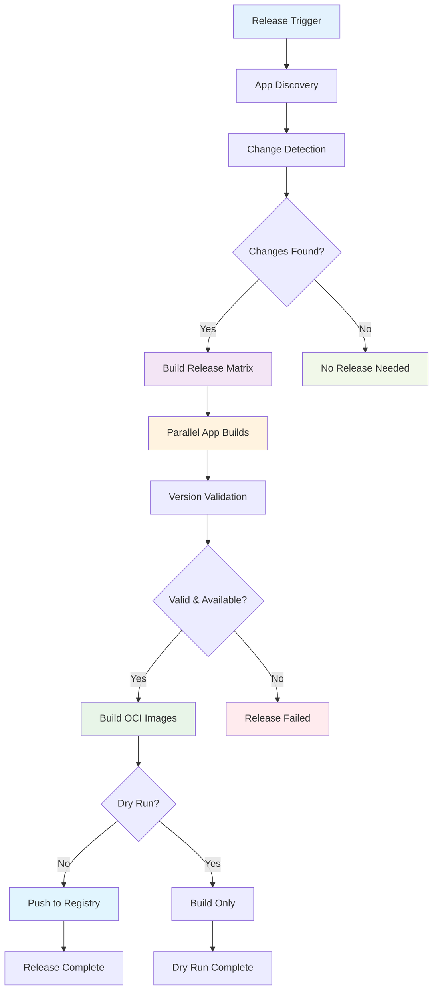

# Release Management

This guide covers the comprehensive release management system for the monorepo.

## Overview

This monorepo uses a **shell-script-free**, Starlark and GitHub Actions-based release system that automatically detects and releases only affected applications.

<!-- NOTE: Future improvements needed:
- Add tag-based release trigger support to GitHub workflow
- Consider adding semantic version auto-increment based on conventional commits
- Evaluate if change detection accuracy needs tuning for edge cases
-->

## Key Features

- **🔍 Automatic App Discovery**: Uses Bazel queries to find releasable apps with `release_app` metadata
- **🎯 Intelligent Change Detection**: Only releases apps affected by changes, with dependency awareness  
- **🐳 Consolidated Container Images**: Single macro creates both release metadata and multi-platform OCI images
- **🔒 Version Protection**: Prevents accidental overwrites with semantic versioning validation
- **🚀 Multiple Release Methods**: GitHub UI, CLI, or Git tags with comprehensive dry-run support
- **📋 Release Matrix**: Automatically generates build matrices for efficient parallel releases
- **📝 Automatic Release Notes**: Generates release notes for each app during releases with commit details
- **🛠️ Shell-Script Free**: Pure Starlark and GitHub Actions implementation for maintainability

## How It Works

The release system operates through three main phases, automatically detecting and releasing only apps that have changed:


```mermaid
graph TD
    A[Release Trigger] --> B[App Discovery]
    B --> C[Change Detection]
    C --> D{Changes Found?}
    D -->|Yes| E[Build Release Matrix]
    D -->|No| F[No Release Needed]
    E --> G[Parallel App Builds]
    G --> H[Version Validation]
    H --> I{Valid & Available?}
    I -->|Yes| J[Build OCI Images]
    I -->|No| K[Release Failed]
    J --> L{Dry Run?}
    L -->|No| M[Push to Registry]
    L -->|Yes| N[Build Only]
    M --> O[Release Complete]
    N --> P[Dry Run Complete]
    
    style A fill:#e3f2fd
    style E fill:#f3e5f5
    style G fill:#fff3e0
    style J fill:#e8f5e8
    style M fill:#e1f5fe
    style K fill:#ffebee
    style F fill:#f1f8e9
```

**Release Behavior:**
- **Selective Releases**: Only apps with actual changes are released, reducing noise and registry bloat
- **Dependency Awareness**: If shared libraries change, all dependent apps are automatically included
- **Parallel Processing**: Multiple apps are built and released simultaneously for efficiency

## App Discovery (Bazel Query)

The release system uses Starlark macros and Bazel queries to discover releasable apps:

```bash
# Discovers all apps with release metadata
bazel query "kind('app_metadata', //...)"
```

Each app declares its release metadata using the `release_app` macro:

```starlark
# In demo/hello_python/BUILD.bazel
load("//tools:release.bzl", "release_app")

release_app(
    name = "hello-python",
    language = "python",
    domain = "demo",
    description = "Python hello world application with pytest",
    app_type = "external-api",  # One of: external-api, internal-api, worker, job
    port = 8000,  # Port for server apps (0 for non-server apps)
    args = ["run-server"],  # Optional command-line arguments
)
```

The `release_app` macro accepts metadata directly:
- **`app_type`**: Application type (external-api, internal-api, worker, or job)
- **`port`**: Port number for server applications (default: 0)
- **`args`**: Optional command-line arguments (default: [])
- **`domain`**: Domain/category for the app (e.g., "demo", "api")

Metadata is specified once in `release_app` and used for both container images and Helm chart generation.

### `--fast`: static discovery without invoking Bazel

`release_helper` discovery commands (`manifest-set`, `plan-helm-release`, `plan`, `list`,
`changes`, `build-app`, `build-chart`, ...) accept a global `--fast` flag that skips the
`bazel query`/`bazel cquery` round trip entirely and instead statically parses every
`BUILD.bazel` file's `release_app(...)`/`release_helm_chart(...)` calls with a Starlark AST
parser, replicating the macros' own derivation logic in Go:

```bash
# Same output as the default path, without starting a Bazel analysis.
bazel run //tools/release_helper_go -- --fast manifest-set
```

This is dramatically faster (milliseconds vs. seconds of Bazel loading/analysis) because it
never touches the Bazel server. It depends on every `release_app`/`release_helm_chart` call
site passing literal arguments — see
[`RELEASE_HELPER_FAST_MODE.md`](RELEASE_HELPER_FAST_MODE.md) for the assumption, what's out of
scope (`changes`' `rdeps` change-detection query still requires real Bazel), and how the fast
path is kept honest against the real one. `--fast` is opt-in; every command's default behavior
is unchanged.

## Intelligent Change Detection

The system supports multiple detection modes, though the current implementation has some limitations:

- **Tag-based releases**: Compares changes since the last Git tag for automatic releases
- **Manual releases**: You specify which apps to release via GitHub Actions inputs
- **Dependency awareness**: If shared libraries change, all dependent apps are released

**Change Detection Methods:**
- **Bazel Query**: Uses `bazel query --output=package` for dependency analysis (default, but may have edge cases)
- **File-based**: Simple file change detection for faster processing when Bazel query isn't needed

**Known Limitations:**
- Bazel query dependency analysis may not catch all transitive dependencies accurately
- File-based detection uses directory prefix matching which can be overly broad
- Infrastructure changes (tools/, .github/, MODULE.bazel) trigger all apps to rebuild as a safety measure
- If no specific apps are detected as changed but files were modified, all apps are rebuilt conservatively

### Reusing Change Detection for Non-Release Target Pools

`changes`/`DetectChangedApps` is specific to `release_app` metadata targets. For gating some
other pool of Bazel targets on the same "only run what changed since a commit" logic — e.g. a
slow test suite in CI — use the more general `changed-targets` command instead:

```bash
bazel run //tools:release -- changed-targets \
  --base-commit origin/main \
  --candidates 'tests(//libs/...) intersect rdeps(//libs/..., //libs/go/dbtest:dbtest)'
```

`--candidates` is any Bazel query expression describing the pool of targets to filter (it does
not have to mention `app_metadata`/`release_app` at all). Given `--base-commit`, it prints the
subset of `--candidates` targets that transitively depend on the files changed since that
commit; with `--base-commit` omitted, or when the diff touches global build configuration
(`MODULE.bazel`, `.bzl` files, etc.), it prints every candidate — callers should treat that as
"run everything," not "nothing changed." See `.github/workflows/ci.yml`'s `test-database` job
for a worked example gating a database-integration test suite this way on pull requests while
still running the full suite on `main`.

## Container Publishing

Each released app gets published to GitHub Container Registry with multiple tags using the `<domain>-<app>:<version>` format:
- `ghcr.io/OWNER/DOMAIN-APP:vX.Y.Z` (specific version)
- `ghcr.io/OWNER/DOMAIN-APP:latest` (latest release)
- `ghcr.io/OWNER/DOMAIN-APP:COMMIT_SHA` (commit-specific)

## Version Validation & Protection

The release system includes robust version validation and protection:

### Semantic Versioning Enforcement

Versions must follow the `v{major}.{minor}.{patch}` format, with the special exception of `latest` for main builds:
- ✅ Valid: `v1.0.0`, `v2.1.3`, `v1.0.0-beta1`, `v3.2.1-rc2`, `latest`
- ❌ Invalid: `1.0.0`, `v1.0`, `v1`, `release-1.0.0`

### Version Overwrite Protection

- **Automatic checks**: Before releasing, the system checks if the version already exists
- **Registry validation**: Uses Docker manifest inspection to verify version availability
- **Safety first**: Releases are blocked if a version already exists in the registry
- **`latest` exception**: The `latest` tag can always be overwritten (main branch workflow)
- **Override option**: Use `--allow-overwrite` flag for emergency situations with versioned releases (not recommended)

### No-op Rebuild Detection (Digest-Idempotent Tagging)

Before `release.yml` mints a new version tag for an app image or a helm
chart, it compares the digest of what was just built against the digest
the app/chart's most recent existing tag already points at (`docker buildx
imagetools inspect` for images; the packaged `.tgz` for charts). Bazel's
image builds are content-addressed, so a no-op rebuild — no source change
since the app's last release, routine when a release batch rebuilds every
app in a domain even though only one changed — produces a byte-identical
digest. When that happens:

- No new git tag is created; the existing tag is reused instead.
- No App Registry recording happens for the "new" version (there is
  nothing new to record).
- This is reported via a `::notice::` in the job output, not silently.

This exists because App Registry can never mark a duplicate-digest
artifact `published` — see
[`tools/app_registry/architecture/08-release-lifecycle/01-artifact-lifecycle.md`](../tools/app_registry/architecture/08-release-lifecycle/01-artifact-lifecycle.md)
and issue
[#617](https://github.com/whale-net/everything/issues/617) — so without
this check, a no-op rebuild used to mint a real git tag and push a real
image that App Registry could never resolve as promotable.

### Version Validation Commands

```bash
# Validate version format and availability
bazel run //tools:release -- validate-version hello-python v1.2.3

# Allow overwriting existing versions (dangerous!)
bazel run //tools:release -- validate-version hello-python v1.2.3 --allow-overwrite

# Validation happens automatically during plan and release
bazel run //tools:release -- plan --event-type workflow_dispatch --apps hello-python --version v1.2.3
```

## Release Methods

> **Interim note (App Registry v2 migration, plan #912):** `release.yml`'s
> human-trigger gate (added by #886 FR15) has been reverted so it can be
> dispatched directly again while `release-v2.yml` is still stabilizing.
> The App Registry UI's **Trigger Release** page (`/releases/trigger`)
> still works too — it dispatches `release.yml` via the same Temporal
> `ReleaseWorkflow` (issue #889) App Registry has always used — so either
> method below or the UI can be used until the eventual cutover to
> `release-v2.yml` is complete.

### Method 1: GitHub Actions UI (Recommended) ⭐

This is the **preferred method** as it provides full control and prevents mistakes:

1. Go to your repository on GitHub
2. Click **Actions** → **Release** workflow
3. Click **Run workflow**
4. Fill in the parameters:
   - **Apps**: Comma-separated list (e.g., `hello-python,hello-go`) or `all`
   - **Version**: Release version (e.g., `v1.2.3`)
   - **Dry run**: Check this to test without publishing

**Example Release:**
```
Apps: hello-python,hello-go
Version: v1.2.3
Dry run: false
```

> **Note: Demo Domain Exclusion**  
> When using `all` for apps or helm charts, the `demo` domain is **excluded by default** to prevent accidental publishing of demo/example applications in production releases. To include demo domain, check the "Include demo domain" checkbox in the UI or use the `--include-demo` flag in CLI commands. Specific app names and domain selections (e.g., `demo`, `manman`) are not affected by this behavior.

### Method 2: GitHub CLI

For automated workflows and scripting:

```bash
# Release specific apps
gh workflow run release.yml \
  -f apps=hello-python,hello-go \
  -f version=v1.2.3 \
  -f dry_run=false

# Release all apps
gh workflow run release.yml \
  -f apps=all \
  -f version=v1.2.3

# Dry run (test without publishing)
gh workflow run release.yml \
  -f apps=hello-python \
  -f version=v1.2.3 \
  -f dry_run=true
```

## Release Process Details

### Automatic Release Matrix

The release workflow automatically creates a build matrix based on changed apps:

```yaml
# Example matrix for hello-python and hello-go
matrix:
  include:
    - app: hello-python
      binary: hello-python
      image: hello-python_image
    - app: hello-go  
      binary: hello-go
      image: hello-go_image
```

### Container Image Tags

Each released app gets tagged with the `<domain>-<app>:<version>` format:
```bash
# Version-specific
ghcr.io/OWNER/demo-hello-python:v1.2.3

# Latest
ghcr.io/OWNER/demo-hello-python:latest

# Commit-specific (for debugging)
ghcr.io/OWNER/demo-hello-python:abc123def
```

## Adding Release Support to New Apps

When creating a new app, just add the consolidated release metadata - it automatically creates both release metadata and OCI images:

```starlark
# In new_app/BUILD.bazel
load("//tools:release.bzl", "release_app")

py_binary(  # or go_binary
    name = "new_app",
    srcs = ["main.py"],  # or ["main.go"]
    visibility = ["//visibility:public"],
)

# This single macro creates both release metadata AND OCI images!
release_app(
    name = "new_app",
    binary_target = ":new_app",
    language = "python",  # or "go"
    domain = "demo",  # Required: categorizes your app (e.g., "api", "web", "demo")
    description = "Description of what this app does",
)
```

The release system will automatically discover and include your app in future releases!

## App Registry Integration

`release.yml` also **records** every released image and chart into the
[App Registry](../tools/app_registry/TOC.md) — a separate gRPC service that
indexes published artifacts and, once actually used, tracks per-environment
promotion state. This is additive on top of everything above, not a
replacement for it — keep two things straight:

- **Recording is best-effort and opt-in.** Every registry call in
  `release.yml` is gated behind the repository variable
  `APP_REGISTRY_CICD_OPT_IN`. Unset — the default, and how this repo ships
  today — means CI makes **zero** calls to the registry; the pipeline
  behaves exactly as described everywhere else in this document. Even when
  the opt-in is `true`, the recording steps are `continue-on-error`: a
  registry outage warns but never fails a release.
- **Version allocation is still git-tag based.** Everything under "Version
  Validation & Protection" above — `autoIncrementVersion`, tag existence
  checks, `--increment-minor`/`--increment-patch` — is unchanged and remains
  the sole source of truth for version numbers. The registry has a fully
  implemented `AllocateVersion` RPC, but nothing calls it yet: no domain has
  been moved to the adoption stage that permits it, and
  `tools/release_helper_go/cmd/plan.go` still computes every version from
  git tags exclusively. See
  [`tools/app_registry/ARCHITECTURE.md`](../tools/app_registry/ARCHITECTURE.md#version-model-ar-5a)
  for the as-built detail.

What recording does, when the opt-in is on: after `release`'s image push, a
step resolves the pushed image's digest and calls `app-registry builds
record` + `artifacts record --kind image`. After `release-helm-charts`
publishes a chart, a similar step resolves each of the chart's pinned image
references to digests and calls `artifacts record --kind chart --contains
...`. See [`docs/CI_CD.md`](CI_CD.md#app-registry) for exactly where these
steps sit in the workflow.

Promoting a recorded artifact to an environment (`dev`/`stage`/`prod`) is a
separate, human-triggered workflow, `promote.yml` — see
[`docs/CI_CD.md`](CI_CD.md#app-registry) and
[`tools/app_registry/OPERATIONS.md`](../tools/app_registry/OPERATIONS.md).
**No promotion has ever run for real**: the workflow and its auth wiring
exist, but no Keycloak clients or GitHub Environments have been created, so
it cannot currently succeed.

## Troubleshooting Releases

### Check App Discovery

```bash
# See all discoverable apps
bazel query "kind('app_metadata', //...)"

# Verify your app's targets exist
bazel query "//your_app:your_app"
```

### Test Release Locally

```bash
# Build and test the release targets using the release tool
bazel run //tools:release -- build hello-python

# Verify the image works (local development tag)
docker run --rm demo-hello-python:latest
```

### Change Detection Issues

If apps aren't being detected for release when they should be:
```bash
# Test change detection manually
bazel run //tools:release -- changes --base-commit HEAD~1

# Use file-based detection instead of Bazel query if needed
bazel run //tools:release -- changes --base-commit HEAD~1 --no-bazel-query

# Force release specific apps manually
gh workflow run release.yml -f apps=hello-python,hello-go -f version=v1.0.0 -f dry_run=true
```

**Note:** The change detection system may sometimes be overly conservative, rebuilding all apps when infrastructure files change or when dependency analysis fails.

### Version Issues

If you encounter version-related problems:
```bash
# Validate version format before releasing
bazel run //tools:release -- validate-version hello-python v1.2.3

# If you get "version already exists" errors:
# 1. Check what versions exist in the registry
# 2. Use a new version number (recommended)
# 3. Or use --allow-overwrite flag (dangerous!)

# For emergency overwrites only:
bazel run //tools:release -- release hello-python --version v1.2.3 --allow-overwrite --dry-run
```

### Dry Run Releases

Always use dry run mode when testing:
```bash
gh workflow run release.yml \
  -f apps=your_app \
  -f version=v0.0.1-test \
  -f dry_run=true
```

## Release Notes

### Automatic Release Notes Generation

Release notes are automatically generated as part of the release process. Release notes focus on top-level entities and provide direct GitHub comparison links:

- **Top-Level Releases**: For apps deployed via Helm charts, release notes are published on the Helm chart's GitHub Release. The chart release notes include a table of contained container image versions, digests, and commit comparison links.
- **Standalone Releases**: Binaries, CLI tools, firmware, and standalone container images receive individual GitHub Releases with version comparison links.
- **Compare Diff Links**: Each release includes a direct GitHub comparison URL (`https://github.com/<owner>/<repo>/compare/<prev>...<curr>`).
- **Scoped Base Resolution**: The previous baseline commit/version is determined authoritatively from App Registry (for domains at `allocate` adoption stage) or via scoped git tags.

### Manual Release Notes Generation

You can generate release notes manually using the release helper CLI:

```bash
# Generate release notes for a specific app
bazel run //tools:release -- release-notes hello-python \
  --current-tag demo-hello-python.v1.2.3 \
  --format markdown

# Generate release notes for a Helm chart
bazel run //tools:release -- release-notes helm-demo-hello-fastapi \
  --current-tag helm-demo-hello-fastapi.v0.2.0 \
  --format markdown

# Generate release notes for all apps and charts
bazel run //tools:release -- release-notes-all \
  --format markdown \
  --output-dir ./release-notes/

# Available formats: markdown, plain, json
```

### GitHub Release Creation

The release system automatically creates GitHub releases for top-level entities (Helm charts and standalone apps) during the release workflow:

```bash
# Create GitHub releases using pre-generated release notes
bazel run //tools:release -- create-combined-github-release-with-notes v1.2.3 \
  --owner whale-net \
  --repo everything \
  --commit abc1234 \
  --apps tools-release_helper_go \
  --charts helm-demo-hello-fastapi \
  --release-notes-dir /tmp/release-notes \
  --helm-charts-dir /tmp/helm-charts \
  --openapi-specs-dir /tmp/openapi-specs \
  --assets-dir /tmp/assets
```

**GitHub Release Features:**
- **Top-Level Entity Scoping**: Publishes Helm chart releases with nested member images, skipping duplicate individual releases for chart members.
- **Asset Attachments**: Packages and attaches Helm chart `.tgz` archives, OpenAPI specifications, and binary assets.
- **App Registry Recording**: Automatically records released artifacts in App Registry when opted in (`APP_REGISTRY_CICD_OPT_IN=true`).
- **Existing Release Detection**: Idempotently skips creation if release already exists.

**Requirements:**
- `GITHUB_TOKEN` environment variable with `repo` scope
- Write permissions to the target repository
