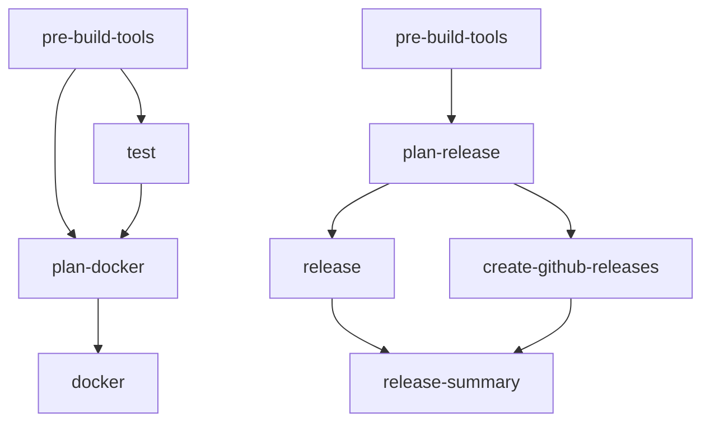

# Release Tool Caching Optimization

## Problem

The `//tools:release` tool was being built multiple times across CI jobs, causing significant time overhead:

- Used in CI workflow: 3+ times (plan, build, release commands)  
- Used in Release workflow: 6+ times across multiple jobs
- Each job had separate cache suffixes, causing cache misses
- Large Python dependency tree (1221 lines in requirements.lock.txt, 17 Python files)

## Solution

Implemented a comprehensive caching strategy to ensure the release tool is always pre-built and cached:

### 1. Pre-build Jobs

Added dedicated pre-build jobs that run early in workflows:

```yaml
pre-build-tools:
  name: Pre-build Tools
  runs-on: ubuntu-latest
  steps:
    - name: Pre-build release tool for caching
      run: |
        bazel build --config=tools //tools:release
        bazel run //tools:release -- --help  # Verify it works
```

### 2. Unified Cache Strategy

- **Before**: Each job used different cache suffixes (`test`, `plan`, `docker`, `summary`)
- **After**: All jobs use consistent cache suffix (`tools` for CI, `release-tools` for releases)
- This ensures the pre-built tool is available to all subsequent jobs

### 3. Bazel Tool Optimization

Added dedicated Bazel configuration in `.bazelrc`:

```bash
# Tool optimization configurations
build:tools --jobs=auto
build:tools --compilation_mode=opt
build:tools --experimental_reuse_sandbox_directories
build:tools --experimental_inmemory_jdeps_files
build:tools --experimental_inmemory_dotd_files
```

### 4. Enhanced Setup Action

Enhanced `setup-build-env` action to automatically detect tool builds:

```yaml
- name: Configure Bazel for tool optimization
  if: ${{ contains(inputs.cache-suffix, 'tools') }}
  run: echo "build --config=tools" >> ~/.bazelrc.user
```

## Benefits

### Time Savings
- **Pre-build once**: Tool is built once at the start, not in every job
- **Cache reuse**: All subsequent jobs reuse the cached build
- **Optimized builds**: Tool-specific Bazel flags for faster compilation

### Predictable Performance
- **Consistent timing**: Tool build time is predictable and frontloaded
- **Parallel execution**: Jobs can run in parallel after pre-build completes
- **Cache reliability**: Unified cache keys prevent cache misses

### Workflow Dependencies



## Validation

Use the test script to validate optimizations:

```bash
# Run in environment with network access to BCR
./tools/cache-optimization-test.sh
```

Expected results:
- Optimized build time < Standard build time
- Cached rebuild time < 5 seconds
- Consistent cache behavior across runs

## Maintenance

### Updating Tool Dependencies

When updating Python dependencies in `requirements.in`:

1. Run `bazel run //:pip_compile` to update `requirements.lock.txt`
2. The tool configuration will automatically pick up changes
3. First build after dependency changes will be slower (expected)
4. Subsequent builds will be fast due to caching

### Monitoring Performance

Track CI build times to ensure optimizations remain effective:

- Pre-build job time should be consistent
- Subsequent tool usage should be minimal overhead
- Total CI time should be reduced compared to pre-optimization baseline

### Troubleshooting

If caching issues occur:

1. **Check cache consistency**: Ensure all jobs use same cache suffix
2. **Verify pre-build**: Confirm pre-build job completes successfully  
3. **Clean caches**: Use `bazel clean` if persistent issues
4. **Review dependencies**: Check if tool dependencies changed unexpectedly

## Implementation Notes

- Compatible with existing `bazel-contrib/setup-bazel` action
- Works with both CI and Release workflows
- Maintains backward compatibility with existing commands
- No changes required to tool source code
- Transparent to tool users