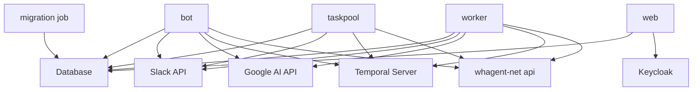

# FCM Microservices Architecture

This document describes the split of the Friendly Computing Machine (FCM) application into
separately-deployed services.

`fcm` is one multi-command Python binary. Each service below is the same binary invoked with a
different sub-command, built as its own image, and deployed as its own release app — see
`friendly_computing_machine/BUILD.bazel` for the authoritative app list and each app's `args`.

## Services Overview

### 1. FCM Slack Bot Service
- **Purpose**: Handles Slack WebSocket (Socket Mode) connections and real-time message processing
- **Release app**: `bot`
- **CLI Command**: `fcm bot --log-otlp run-slack-socket-app --skip-migration-check`
- **Dependencies**:
  - Slack Bot Token
  - Slack App Token
  - Database (for message storage)
  - Temporal, Google AI, whagent-net

### 2. FCM Task Pool Service
- **Purpose**: Runs scheduled background tasks (music polls, Slack message archiving, etc.)
- **Release app**: `taskpool`
- **CLI Command**: `fcm bot --log-otlp run-taskpool --skip-migration-check`
- **Dependencies**:
  - Database (for task execution tracking)
  - Slack tokens (for some tasks)
  - Temporal, Google AI, whagent-net

### 3. FCM Temporal Worker Service
- **Purpose**: Executes Temporal workflows and activities
- **Release app**: `worker`
- **CLI Command**: `fcm workflow --log-otlp run --skip-migration-check`
- **Dependencies**:
  - Temporal Server
  - Database
  - Slack Bot Token, Google AI, whagent-net

### 4. FCM Identity-Link Web Service
- **Purpose**: Serves the browser OIDC login that binds a Slack user to their Keycloak identity
- **Release app**: `web`
- **CLI Command**: `fcm web --log-otlp run --skip-migration-check`
- **Dependencies**:
  - Database (for `slacklinktoken` / `slackkeycloakidentity`)
  - Keycloak realm (issuer, confidential browser-login client)
- **Health Check**: `GET /health` on port 8000

### 5. FCM Migration Job
- **Purpose**: Applies Alembic migrations before the app pods start
- **Release app**: `migration`
- **CLI Command**: `fcm migration --log-otlp run`
- **Helm hook**: `pre-install,pre-upgrade` at weight `-5` (the ServiceAccount it references is a hook
  at weight `-10`)
- **Dependencies**:
  - Database

Every app container passes `--skip-migration-check` because the migration Job, not the app, owns
schema changes. See [deploy_recovery.md](deploy_recovery.md) for what that means on rollback.

## Migration from Monolith

The original `fcm bot run` command ran both the Slack bot and the task pool in a single process using
a thread pool executor. That combined command no longer exists. Run the two sub-commands instead, in
two processes:

```bash
uv run fcm bot run-slack-socket-app   # Slack events
uv run fcm bot run-taskpool           # scheduled background tasks
```

## Deployment Configuration

Each service has its own:
- Resource limits and requests
- Environment variables
- Service labels and selectors
- Health checks — only `web` currently has one enabled

## Benefits of Split Architecture

1. **Independent Scaling**: Each service can be scaled independently based on load
2. **Isolation**: Failures in one service don't affect others
3. **Resource Optimization**: Different resource allocations per service type
4. **Deployment Flexibility**: Services can be deployed and updated independently
5. **Debugging**: Easier to isolate issues to specific services

## Service Dependencies



## CLI Commands Reference

| Service | Command | Description |
|---------|---------|-------------|
| Slack Bot | `fcm bot run-slack-socket-app` | Run the Slack WebSocket handler |
| Task Pool | `fcm bot run-taskpool` | Run only the background task processor |
| Temporal Worker | `fcm workflow run` | Run Temporal workflow worker |
| Identity-Link Web | `fcm web run` | Run the OIDC Slack↔Keycloak link app |
| Migration Job | `fcm migration run` | Apply Alembic migrations |

Run any of them with `--help` for the full option list; the environment variables behind those
options are listed in [../ENV.md](../ENV.md).
