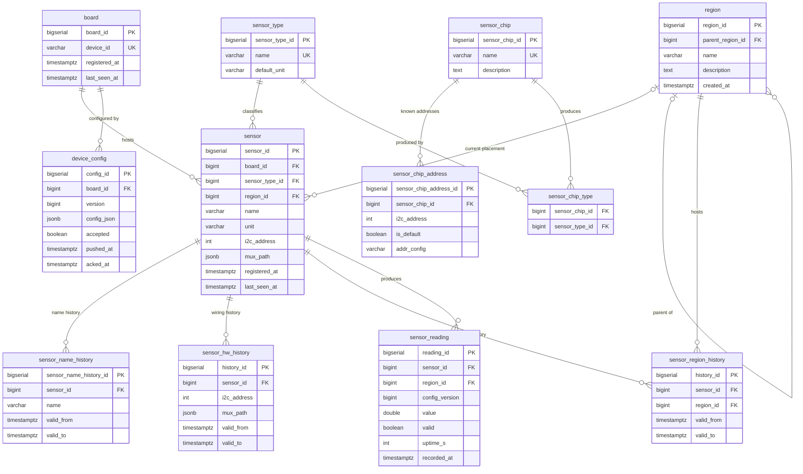
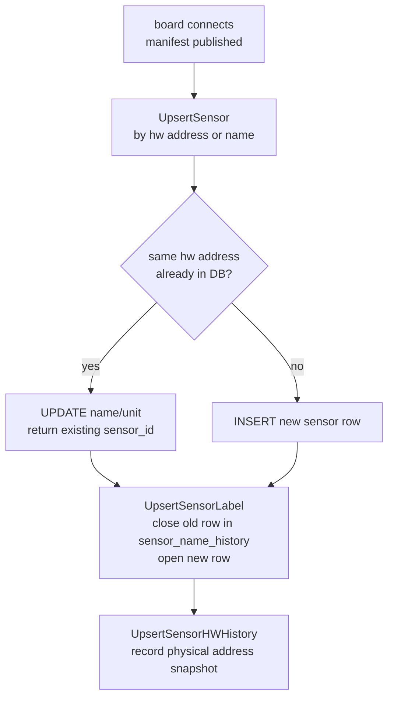
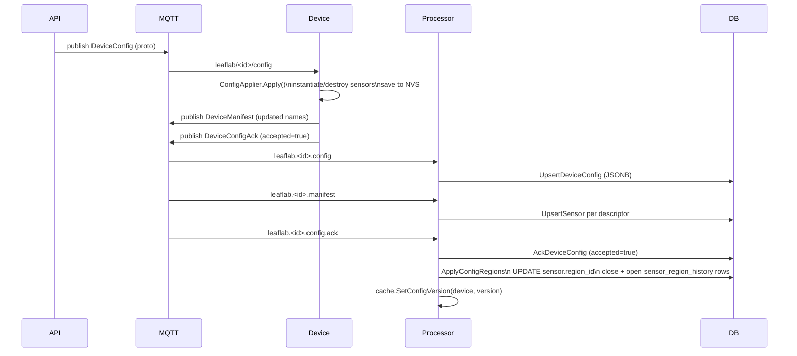
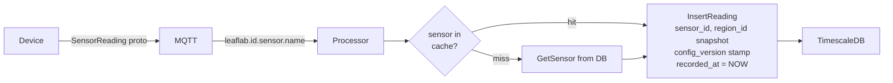

# LeafLab — Data Model & Flows

## Entity Relationships



---

## Sensor Identity Through Time

`sensor` is a stable anchor — its `sensor_id` never changes even when the
sensor is renamed, moved, or temporarily removed from a config.



---

## Config Push & Region Assignment



---

## Reading Write Path



---

## mux_path JSONB Format

`sensor.mux_path` and `sensor_hw_history.mux_path` store the full I2C mux
chain ordered outer → inner.  Empty array means the sensor is directly on
the root I2C bus.

```jsonc
// direct on root bus
[]

// single TCA9548A at 0x70, channel 5
[{"muxAddress": 112, "muxChannel": 5}]

// cascaded muxes: outer 0x70 ch3 → inner 0x71 ch1
[{"muxAddress": 112, "muxChannel": 3},
 {"muxAddress": 113, "muxChannel": 1}]
```

Unique constraint on `sensor`: `(board_id, i2c_address, sensor_type_id, mux_path::text)`.

---

## Config Version Stamping

Every `sensor_reading` row carries `config_version` (nullable).  This is the
`device_config.version` that was active when the reading was written, taken
from an in-memory cache pre-warmed at processor startup and updated on each
accepted `DeviceConfigAck`.

This enables queries like:

```sql
-- readings taken under a specific config
SELECT * FROM sensor_reading
WHERE sensor_id = $1 AND config_version = $2
ORDER BY recorded_at DESC;

-- latest reading per config version
SELECT config_version, MAX(recorded_at)
FROM sensor_reading WHERE sensor_id = $1
GROUP BY config_version ORDER BY 2 DESC;
```

---

## SCD2 Convention

All SCD2 (Slowly Changing Dimension Type 2) history tables follow a uniform column convention:

| Column | Type | Meaning |
|---|---|---|
| `valid_from` | `TIMESTAMPTZ NOT NULL` | When this row became the current value |
| `valid_to` | `TIMESTAMPTZ` | When it was superseded; `NULL` = still current |

A partial index on `(sensor_id) WHERE valid_to IS NULL` makes "what is the current value?" queries O(1) on each history table.

SCD2 tables in this schema:

| Table | What changes |
|---|---|
| `sensor_name_history` | Sensor logical name |
| `sensor_region_history` | Sensor region assignment |
| `sensor_hw_history` | Sensor I2C address + mux path |

`device_config` is NOT SCD2 — it is an append-only event log keyed by `(board_id, version)`. The view `v_board_state_history` derives a SCD2-shaped representation from it using a window function.

---

## Analytical Views

Seven plain views (prefixed `v_`) expose the schema to downstream consumers (Grafana panels, ad-hoc SQL). All join logic is in the views — consumers should not replicate it.

| View | Cardinality | Purpose |
|---|---|---|
| `v_region_path` | 1 row / region | Recursive region hierarchy with `path_ids[]`, `path_names[]`, `path_name` |
| `v_sensor_current` | 1 row / sensor | Current state: name, type, chip, board, region path |
| `v_board_state_history` | 1 row / accepted config | SCD2-shaped board config history (valid_from / valid_to) |
| `v_board_state_current` | 1 row / board | Current accepted device config per board |
| `v_sensor_reading_enriched` | 1 row / reading | **Workhorse**: reading + sensor + region path + config metadata |
| `v_sensor_reading_with_plant` | 1 row / (reading × active plant) | Plant and plant_type slices; readings without plants appear with NULL plant fields |
| `v_sensor_reading_with_config_debug` | 1 row / reading | `v_sensor_reading_enriched` + full `device_config.config_json` (debug) |

### Temporal accuracy

- **Region** is historically accurate: `sensor_reading.region_id` is snapshotted at insert, so the views join the snapshot — not the sensor's current region.
- **Config version** is historically accurate: `sensor_reading.config_version` is stamped at insert from the in-memory cache.
- **Sensor name** is the *current* name from `sensor_name_history WHERE valid_to IS NULL`. For dashboards showing live or recent data this is almost always correct; for strict point-in-time name lookups query `sensor_name_history` directly.
- **Plant** is resolved at query time: plants active in the reading's snapshot region at `recorded_at`.

### Example queries

```sql
-- Lux readings in "Room A" (or any child region) over the last 24 hours
SELECT recorded_at, value, region_path_name, sensor_name
FROM v_sensor_reading_enriched
WHERE 'Room A' = ANY(region_path_names)
  AND sensor_type_name = 'illuminance'
  AND recorded_at > NOW() - INTERVAL '24 hours'
ORDER BY recorded_at DESC;

-- Average temperature per plant type this week
SELECT plant_common_name, AVG(value) AS avg_temp_c
FROM v_sensor_reading_with_plant
WHERE sensor_type_name = 'temperature'
  AND recorded_at > NOW() - INTERVAL '7 days'
GROUP BY plant_common_name;

-- What config was board X running when a reading spiked?
SELECT recorded_at, value, config_version, device_config_json
FROM v_sensor_reading_with_config_debug
WHERE device_id = 'leaflab-ccdba79f5fac'
  AND value > 90000
ORDER BY recorded_at DESC;

-- Is any board behind on its latest config push?
SELECT b.device_id, b.last_seen_at, bsc.version AS active_version
FROM board b
LEFT JOIN v_board_state_current bsc ON bsc.board_id = b.board_id
WHERE bsc.version IS DISTINCT FROM (
    SELECT MAX(version) FROM device_config
    WHERE board_id = b.board_id AND accepted = TRUE
);
```
