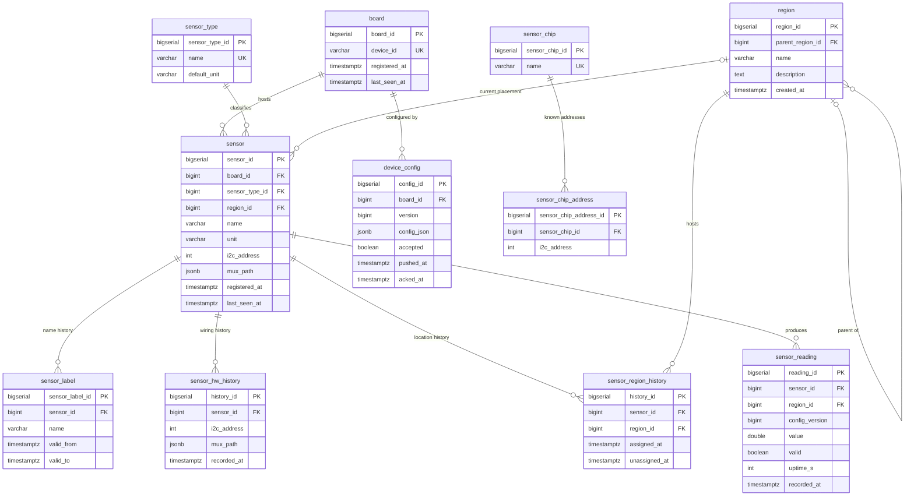
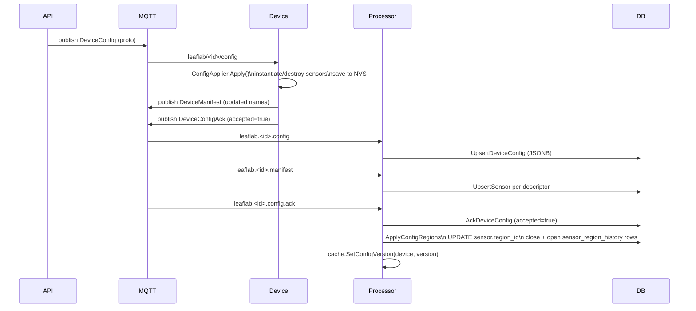
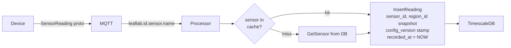

# LeafLab — Data Model & Flows

## Entity Relationships



---

## Sensor Identity Through Time

`sensor` is a stable anchor — its `sensor_id` never changes even when the
sensor is renamed, moved, or temporarily removed from a config.


---

## Config Push & Region Assignment



---

## Reading Write Path



---

## mux_path JSONB Format

`sensor.mux_path` and `sensor_hw_history.mux_path` store the full I2C mux
chain ordered outer → inner.  Empty array means the sensor is directly on
the root I2C bus.

```jsonc
// direct on root bus
[]

// single TCA9548A at 0x70, channel 5
[{"muxAddress": 112, "muxChannel": 5}]

// cascaded muxes: outer 0x70 ch3 → inner 0x71 ch1
[{"muxAddress": 112, "muxChannel": 3},
 {"muxAddress": 113, "muxChannel": 1}]
```

Unique constraint on `sensor`: `(board_id, i2c_address, sensor_type_id, mux_path::text)`.

---

## Config Version Stamping

Every `sensor_reading` row carries `config_version` (nullable).  This is the
`device_config.version` that was active when the reading was written, taken
from an in-memory cache pre-warmed at processor startup and updated on each
accepted `DeviceConfigAck`.

This enables queries like:

```sql
-- readings taken under a specific config
SELECT * FROM sensor_reading
WHERE sensor_id = $1 AND config_version = $2
ORDER BY recorded_at DESC;

-- latest reading per config version
SELECT config_version, MAX(recorded_at)
FROM sensor_reading WHERE sensor_id = $1
GROUP BY config_version ORDER BY 2 DESC;
```
