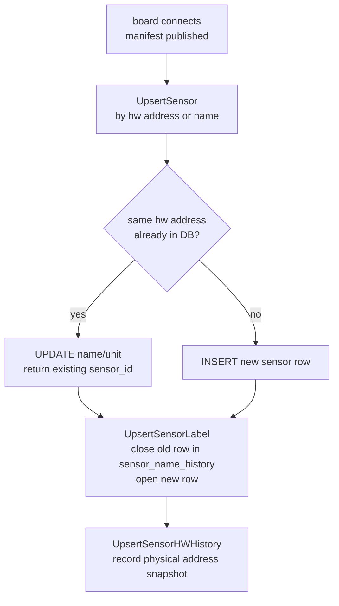
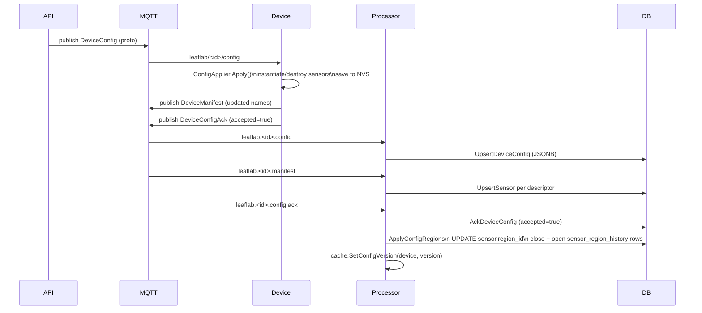
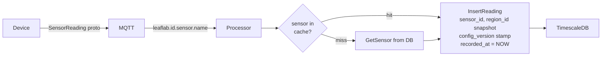

# LeafLab — Data Model & Flows

## Entity Relationships


```mermaid
erDiagram
    board {
        bigserial board_id PK
        varchar   device_id UK
        timestamptz registered_at
        timestamptz last_seen_at
    }

    sensor_type {
        bigserial sensor_type_id PK
        varchar   name UK
        varchar   default_unit
    }

    sensor {
        bigserial   sensor_id PK
        bigint      board_id FK
        bigint      sensor_type_id FK
        bigint      region_id FK
        varchar     name
        varchar     unit
        int         i2c_address
        jsonb       mux_path
        timestamptz registered_at
        timestamptz last_seen_at
    }

    sensor_name_history {
        bigserial   sensor_name_history_id PK
        bigint      sensor_id FK
        varchar     name
        timestamptz valid_from
        timestamptz valid_to
    }

    sensor_hw_history {
        bigserial   history_id PK
        bigint      sensor_id FK
        int         i2c_address "nullable -- NULL on rows closed before FR16.1; a real address on every open row, never fabricated to 0 (FR16.2)"
        jsonb       mux_path
        timestamptz valid_from
        timestamptz valid_to
    }

    region {
        bigserial   region_id PK
        bigint      parent_region_id FK
        varchar     name
        text        description
        timestamptz created_at
    }

    sensor_region_history {
        bigserial   history_id PK
        bigint      sensor_id FK
        bigint      region_id FK
        timestamptz valid_from
        timestamptz valid_to
    }

    plant_type {
        bigserial plant_type_id PK
        varchar   common_name
        varchar   species
    }

    plant {
        bigserial   plant_id PK
        bigint      region_id FK "current-placement cache; kept in sync by placement.Writer.Move"
        bigint      plant_type_id FK
        varchar     name
        timestamptz created_at
        timestamptz removed_at "NULL = still present"
    }

    plant_region_history {
        bigserial   plant_region_history_id PK
        bigint      plant_id FK
        bigint      region_id FK
        timestamptz valid_from
        timestamptz valid_to
        boolean     relocation_induced "FR24 -- TRUE only when Phase 5's FR74 relocation wrote this row"
    }

    boundary_capture {
        bigserial   capture_id PK
        bigint      sensor_id FK
        timestamptz boundary_at
        text        tier "five_minute | hourly"
        timestamptz bucket_start
        text        state "pending | completed"
        timestamptz completed_at
    }

    boundary_partial {
        bigserial   partial_id PK
        bigint      capture_id FK
        text        tier
        timestamptz bucket_start
        timestamptz partial_from
        timestamptz partial_to
        bigint      reading_count
        double      value_sum
        double      value_min
        double      value_max
    }

    sensor_reading_5m {
        timestamptz bucket "continuous aggregate, NOT a base table -- no FK enforcement"
        bigint      sensor_id
        bigint      region_id
        bigint      reading_count
        double      value_sum
        double      value_avg
        double      value_min
        double      value_max
    }

    sensor_reading_1h {
        timestamptz bucket "continuous aggregate, composed hierarchically FROM sensor_reading_5m"
        bigint      sensor_id
        bigint      region_id
        bigint      reading_count
        double      value_sum
        double      value_avg
        double      value_min
        double      value_max
    }

    device_config {
        bigserial   config_id PK
        bigint      board_id FK
        bigint      version
        jsonb       config_json
        boolean     accepted
        timestamptz pushed_at
        timestamptz acked_at
    }

    sensor_reading {
        bigserial   reading_id PK
        bigint      sensor_id FK
        bigint      region_id FK
        bigint      config_version
        double      value
        boolean     valid
        int         uptime_s
        timestamptz recorded_at
    }

    sensor_chip {
        bigserial sensor_chip_id PK
        varchar   name UK
        text      description
    }

    sensor_chip_address {
        bigserial sensor_chip_address_id PK
        bigint    sensor_chip_id FK
        int       i2c_address
        boolean   is_default
        varchar   addr_config
    }

    sensor_chip_type {
        bigint sensor_chip_id FK
        bigint sensor_type_id FK
    }

    board            ||--o{ sensor               : "hosts"
    sensor_type      ||--o{ sensor               : "classifies"
    region           |o--o{ sensor               : "current placement"
    region           |o--o{ region               : "parent of"
    sensor           ||--o{ sensor_name_history   : "name history"
    sensor           ||--o{ sensor_hw_history    : "wiring history"
    sensor           ||--o{ sensor_region_history: "location history"
    region           ||--o{ sensor_region_history: "hosts"
    sensor           ||--o{ sensor_reading       : "produces"
    board            ||--o{ device_config        : "configured by"
    sensor_chip      ||--o{ sensor_chip_address  : "known addresses"
    sensor_chip      ||--o{ sensor_chip_type     : "produces"
    sensor_type      ||--o{ sensor_chip_type     : "produced by"
    plant_type       ||--o{ plant                : "classifies"
    region           |o--o{ plant                : "current placement (cache)"
    plant            ||--o{ plant_region_history : "location history"
    region           ||--o{ plant_region_history : "hosts"
    sensor           ||--o{ boundary_capture      : "affected by a placement boundary"
    boundary_capture ||--o{ boundary_partial      : "splits into (N boundaries -> N+1 partials, FR20.3)"
    sensor_reading   ||--o{ sensor_reading_5m     : "aggregates into (continuous aggregate)"
    sensor_reading_5m||--o{ sensor_reading_1h     : "composes into (continuous aggregate, hierarchical)"
```

> `sensor_reading_5m` and `sensor_reading_1h` are TimescaleDB continuous aggregates (migration
> 022), not base tables — the diagram shows their derivation, not an enforced foreign key.
> `boundary_capture` / `boundary_partial` (migration 033) are plain append-mostly tables, not
> SCD2 — see "SCD2 Convention" below for why. `plant`, `plant_type` and `plant_region_history`
> have existed since migrations 001/017; they are included here for the first time because this
> section previously omitted the plant side of the schema entirely.

---

## Sensor Identity Through Time

`sensor` is a stable anchor — its `sensor_id` never changes even when the
sensor is renamed, moved, or temporarily removed from a config.


```mermaid
flowchart TD
    A[board connects\nmanifest published] --> B[UpsertSensor\nby hw address or name]
    B --> C{same hw address\nalready in DB?}
    C -- yes --> D[UPDATE name/unit\nreturn existing sensor_id]
    C -- no  --> E[INSERT new sensor row]
    D --> F[UpsertSensorLabel\nclose old row in sensor_name_history\nopen new row]
    E --> F
    F --> G[UpsertSensorHWHistory\nrecord physical address snapshot]
```

---

## Config Push & Region Assignment


```mermaid
sequenceDiagram
    participant API
    participant MQTT
    participant Device
    participant Processor
    participant DB

    API->>MQTT: publish DeviceConfig (proto)
    MQTT->>Device: leaflab/<id>/config
    Device->>Device: ConfigApplier.Apply()\ninstantiate/destroy sensors\nsave to NVS
    Device->>MQTT: publish DeviceManifest (updated names)
    Device->>MQTT: publish DeviceConfigAck (accepted=true)
    MQTT->>Processor: leaflab.<id>.config
    Processor->>DB: UpsertDeviceConfig (JSONB)
    MQTT->>Processor: leaflab.<id>.manifest
    Processor->>DB: UpsertSensor per descriptor
    MQTT->>Processor: leaflab.<id>.config.ack
    Processor->>DB: AckDeviceConfig (accepted=true)
    Processor->>DB: ApplyConfigRegions\n  UPDATE sensor.region_id\n  close + open sensor_region_history rows
    Processor->>Processor: cache.SetConfigVersion(device, version)
```

---

## Reading Write Path


```mermaid
flowchart LR
    Device -->|SensorReading proto| MQTT
    MQTT -->|leaflab.id.sensor.name| Processor
    Processor --> Cache{sensor in\ncache?}
    Cache -- hit --> Insert
    Cache -- miss --> DB_lookup[GetSensor from DB]
    DB_lookup --> Insert
    Insert[InsertReading\nsensor_id, region_id snapshot\nconfig_version stamp\nrecorded_at = NOW] --> TimescaleDB
```

---

## mux_path JSONB Format

`sensor.mux_path` and `sensor_hw_history.mux_path` store the full I2C mux
chain ordered outer → inner.  Empty array means the sensor is directly on
the root I2C bus.

```jsonc
// direct on root bus
[]

// single TCA9548A at 0x70, channel 5
[{"muxAddress": 112, "muxChannel": 5}]

// cascaded muxes: outer 0x70 ch3 → inner 0x71 ch1
[{"muxAddress": 112, "muxChannel": 3},
 {"muxAddress": 113, "muxChannel": 1}]
```

Unique constraint on `sensor`: `(board_id, i2c_address, sensor_type_id, mux_path::text)`.

---

## Config Version Stamping

Every `sensor_reading` row carries `config_version` (nullable).  This is the
`device_config.version` that was active when the reading was written, taken
from an in-memory cache pre-warmed at processor startup and updated on each
accepted `DeviceConfigAck`.

This enables queries like:

```sql
-- readings taken under a specific config
SELECT * FROM sensor_reading
WHERE sensor_id = $1 AND config_version = $2
ORDER BY recorded_at DESC;

-- latest reading per config version
SELECT config_version, MAX(recorded_at)
FROM sensor_reading WHERE sensor_id = $1
GROUP BY config_version ORDER BY 2 DESC;
```

---

## SCD2 Convention

All SCD2 (Slowly Changing Dimension Type 2) history tables follow a uniform column convention:

| Column | Type | Meaning |
|---|---|---|
| `valid_from` | `TIMESTAMPTZ NOT NULL` | When this row became the current value |
| `valid_to` | `TIMESTAMPTZ` | When it was superseded; `NULL` = still current |

A partial index on `(sensor_id) WHERE valid_to IS NULL` makes "what is the current value?" queries O(1) on each history table.

SCD2 tables in this schema:

| Table | What changes |
|---|---|
| `sensor_name_history` | Sensor logical name |
| `sensor_region_history` | Sensor region assignment |
| `sensor_hw_history` | Sensor I2C address + mux path |
| `plant_region_history` | Plant region placement (FR19) — indexed both directions (plant→region at T and region→plant at T, NFR6.1); a move closes and opens, never back-dated (FR19) |

`device_config` is NOT SCD2 — it is an append-only event log keyed by `(board_id, version)`. The view `v_board_state_history` derives a SCD2-shaped representation from it using a window function.

**`boundary_capture` and `boundary_partial` (migration 033) are NOT SCD2.** They do not carry
`valid_from`/`valid_to` and are not a history of one entity's changing current value — they are
FR20's two-phase capture record: `boundary_capture` is a one-row-per-(sensor, tier, straddled
bucket) work item (`state`: `pending` → `completed`), and `boundary_partial` is the exact,
independently-computed sub-bucket aggregate each capture resolves to once its bucket closes.
Neither table is ever updated in place to represent "the current value as of now" the way an SCD2
table is — a capture's `state` transition is a one-way completion, not a superseded-by-a-newer-row
pattern, and a partial row is never revised once written.

**FR21's accepted cost, restated plainly:** a removed plant and its successor share an hour. The
migration 017 backfill (and `CheckMigrationSnapWindow`, below) both snap to the containing hour
bucket rather than the exact instant, so a plant removed at (for example) 14:20 and whatever plant
next occupies that region from 14:00 both attribute to the same 14:00–15:00 bucket — a disclosed,
permanent property of the snapped-to-hour backfill, not a defect to fix later.

---

## Analytical Views

Seven plain views (prefixed `v_`) expose the schema to downstream consumers (Grafana panels, ad-hoc SQL). All join logic is in the views — consumers should not replicate it.

**NFR16, views half.** These seven views are in-contract for their **names and columns** — a
consumer's query against them does not break across this phase. They are **not** in-contract for
`v_sensor_reading_with_plant`'s pre-migration-021 **attribution behaviour** — that behaviour was a
defect (below), corrected in place rather than preserved and versioned alongside a fix.

| View | Cardinality | Purpose |
|---|---|---|
| `v_region_path` | 1 row / region | Recursive region hierarchy with `path_ids[]`, `path_names[]`, `path_name` |
| `v_sensor_current` | 1 row / sensor | Current state: name, type, chip, board, region path |
| `v_board_state_history` | 1 row / accepted config | SCD2-shaped board config history (valid_from / valid_to) |
| `v_board_state_current` | 1 row / board | Current accepted device config per board |
| `v_sensor_reading_enriched` | 1 row / reading | **Workhorse**: reading + sensor + region path + config metadata |
| `v_sensor_reading_with_plant` | 1 row / (reading × active plant) | Plant and plant_type slices, plus `household_id`; readings without plants appear with NULL plant fields |
| `v_sensor_reading_with_config_debug` | 1 row / reading | `v_sensor_reading_enriched` + full `device_config.config_json` (debug) |

> **Attribution correction (migration 021, FR72) — Grafana-affecting.** Before migration 021,
> `v_sensor_reading_with_plant` attributed a reading to whichever plant currently held
> `plant.region_id = <reading's region>` — a live, mutable pointer — so moving a plant
> retroactively rewrote every historical reading it had ever produced. Migration 021 repoints the
> join to nearest-ancestor resolution against `plant_region_history` at `recorded_at` (the same
> rule as `leaflab/api/attribution`, NFR1.c), so readings recorded before a plant's move now stay
> attributed to the plant/region that was actually there at the time. **The view's name and every
> existing column are unchanged** (only `household_id` was added); only the numbers a panel
> computes from `plant_name` / `plant_type_id` / `plant_common_name` / `plant_species` can change
> for historical rows — from wrong to right. No parallel `_v2` view was created; there is nothing
> to repoint a dashboard *to*, only numbers to expect to change under an unchanged query. Audited
> every other migration-012 view for the same defect (current-value join instead of an
> interval/SCD2 lookup) and found none affected: `v_sensor_reading_enriched` already keys off
> `sensor_reading.region_id`, a snapshot stamped at insert; `v_sensor_current` /
> `v_board_state_history` / `v_board_state_current` are explicitly current-state views by
> contract; `v_sensor_reading_with_config_debug` keys off `sensor_reading.config_version`, also
> stamped at insert.
>
> **Panels using `v_sensor_reading_with_plant` should expect their historical numbers to change**
> the first time they run after this migration, for any plant that has ever been moved between
> regions. This repo does not check in Grafana dashboard JSON — Grafana queries the database
> directly (`ARCHITECTURE.md` "Query Layer — Analytical Views") — so the affected panel named here is
> the one whose reference query this file documents: the **"Avg Temperature by Plant Type"** panel
> (the `plant_common_name` aggregate below). Any other panel built against this view's `plant_id`,
> `plant_name`, `plant_type_id`, `plant_common_name` or `plant_species` columns is affected the
> same way and should be checked by its operator.
>
> **Cost profile changed materially.** The join is now a per-row `LATERAL` call that walks
> `v_region_path` and queries `plant_region_history` per reading, not a single flat equality join
> — on a view already one row per reading with four joins. The API read path deliberately does
> **not** query this view (series and summaries are served from the granularity tiers instead), so
> `NFR3.3`/`NFR5`'s performance gates do not cover it and it should not be assumed to still be the
> cheap path for a new Grafana panel.

### Temporal accuracy

- **Region** is historically accurate: `sensor_reading.region_id` is snapshotted at insert, so the views join the snapshot — not the sensor's current region.
- **Config version** is historically accurate: `sensor_reading.config_version` is stamped at insert from the in-memory cache.
- **Sensor name** is the *current* name from `sensor_name_history WHERE valid_to IS NULL`. For dashboards showing live or recent data this is almost always correct; for strict point-in-time name lookups query `sensor_name_history` directly.
- **Plant** is historically accurate as of migration 021 (FR72): attribution resolves nearest-ancestor against `plant_region_history` at `recorded_at` — the region (including the reading's own) closest to it on the path with an active plant at that instant, mirroring `leaflab/api/attribution`'s Go resolver exactly (NFR1.c). A plant moved after a reading was recorded does not change that reading's attribution.
- **`household_id`** resolves through the region tree root (`region_path_ids[1]`), since `region.household_id` is populated on tree roots only and descendants inherit it.

### Example queries

```sql
-- Lux readings in "Room A" (or any child region) over the last 24 hours
SELECT recorded_at, value, region_path_name, sensor_name
FROM v_sensor_reading_enriched
WHERE 'Room A' = ANY(region_path_names)
  AND sensor_type_name = 'illuminance'
  AND recorded_at > NOW() - INTERVAL '24 hours'
ORDER BY recorded_at DESC;

-- Average temperature per plant type this week
SELECT plant_common_name, AVG(value) AS avg_temp_c
FROM v_sensor_reading_with_plant
WHERE sensor_type_name = 'temperature'
  AND recorded_at > NOW() - INTERVAL '7 days'
GROUP BY plant_common_name;

-- What config was board X running when a reading spiked?
SELECT recorded_at, value, config_version, device_config_json
FROM v_sensor_reading_with_config_debug
WHERE device_id = 'leaflab-ccdba79f5fac'
  AND value > 90000
ORDER BY recorded_at DESC;

-- Is any board behind on its latest config push?
SELECT b.device_id, b.last_seen_at, bsc.version AS active_version
FROM board b
LEFT JOIN v_board_state_current bsc ON bsc.board_id = b.board_id
WHERE bsc.version IS DISTINCT FROM (
    SELECT MAX(version) FROM device_config
    WHERE board_id = b.board_id AND accepted = TRUE
);
```

---

## Granularity Tiers and Retention (FR71, NFR5)

Three tiers answer a bounded read-path query — raw `sensor_reading`, and the two continuous
aggregates from migration 022, `sensor_reading_5m` and `sensor_reading_1h` (hierarchical: the
hourly tier is composed FROM the 5-minute tier, not from raw). `leaflab/api/tiers.Select`
(FR71) picks the finest tier that can actually serve a requested window and always reports which
tier answered — coarsening is disclosed, never silent. **No tier coarser than hourly exists in
V1.** See `leaflab/ARCHITECTURE.md`'s "Read Path" section for how the read path composes tier
selection, FR23 attribution, and FR20's boundary-partial substitution — this section covers only
the tiers' own storage shape and retention.

### Three-tier retention table

| Tier | Relation | Retention | Notes |
|---|---|---|---|
| Raw | `sensor_reading` | ≥ 13 months (A12) | Also bounded to the most recent 48 hours for any *served* query by NFR3.2's raw cap — retention and the serving cap are two different limits that happen to both bind on raw. |
| 5-minute | `sensor_reading_5m` | 90 days | Continuous aggregate; `WITH NO DATA` + `materialized_only = true` (migration 022) — no implicit real-time union with raw. |
| Hourly | `sensor_reading_1h` | Indefinite | No `add_retention_policy` exists for this tier (migration 022) — this *is* the indefinite retention, not an oversight. The tier a `boundary_partial` row inherits retention from regardless of which tier it originally split (FR20.2). |

### Refresh/retention ordering constraint, derived from one constant (NFR5)

Every window in migration 022's refresh and retention policies is a literal multiple of one base
interval, `capture_completion_window = 1 hour` (FR20's boundary capture is "a deferred second
write at bucket close," and this is the outside bound on how late that write may land), so the
ordering cannot be broken by editing one policy in isolation:

| Quantity | Value | Derivation |
|---|---|---|
| `capture_completion_window` | 1 hour | The base constant — the ceiling on how late a deferred boundary-capture write may land after the bucket it captures closes. |
| `five_minute_refresh_lag` | 1 hour | `= capture_completion_window` — the 5-minute aggregate must not refresh a bucket until any deferred capture write landing in it is durable. |
| `hourly_refresh_lag` | 2 hours | `= 2 × capture_completion_window` — the hourly tier is composed FROM the 5-minute tier, so it waits for both the 5-minute tier's own refresh lag *and* its own capture-durability window. |
| `raw_retention_min` (floor) | 4 hours | `= five_minute_refresh_lag + hourly_refresh_lag + capture_completion_window = 4 × capture_completion_window` — the floor raw retention must clear so no refresh window ever reaches into dropped raw data. |

Raw retention is actually 13 months (A12's business requirement) — vastly larger than the 4-hour
floor, so the ordering holds by construction today. It still needs a live assertion, not just this
table, because the floor tracks `capture_completion_window`: widening that constant enough, or
narrowing raw retention enough, to close the gap would break the ordering silently otherwise (the
Testing phase's ordering test reads the live policy configuration from
`timescaledb_information.jobs` / `.continuous_aggregates` and asserts the relationship
programmatically).

### Pre-aggregated is not de-identified

A tier row is keyed by `sensor_id` and `region_id` — the same identifiers as the raw reading it
was built from. **A min/max over one sensor's 5-minute bucket is two raw readings wearing a hat:**
it names the same sensor, the same region, and (via `sensor_id`) the same household as the raw
rows it summarizes, just fewer of them. Pre-aggregation is a granularity optimization (NFR5), not
a privacy control — nothing about querying `sensor_reading_5m` or `sensor_reading_1h` instead of
`sensor_reading` reduces what a query can attribute a value to. If a future requirement needs
k-anonymity or any other suppression over *contributors* (e.g. "do not reveal a value observed by
fewer than K sensors/households"), that suppression must be implemented **above** the tier, over
the set of contributing sensors/households at query time — it can never be inherited from the
tier's own storage, because the tier carries no such guarantee to inherit.

---

## Suspect Checks (FR26.3)

Every readings response (`ReadingPoint`, `CurrentValue`, `PeriodSummary` in
`leaflab/api/proto/api.proto`) carries `suspect_checks`: zero or more identifiers from
`leaflab/api/suspect`'s fixed, enumerable `Check` registry, plus a top-level
`marked_count`/`returned_count` pair so a marker that covers everything is visible as such rather
than silently universal (FR26.3). A response with no checks marks nothing — an absent check list
is a real, present, non-suspect value, distinct on the wire from a gap in the data (FR26.1: "invalid,
missing and zero" must be three distinguishable outcomes). The full enumerable set, so a consumer
can look one up without a database:

| Check identifier | Meaning | Computed from |
|---|---|---|
| `out_of_range` | The reading's (or bucket's min/max) value falls outside the valid range for its measurement type. | `sensor_type`'s configured range, compared against the point's own value or (for a bucket) its exact composed min/max. |
| `persisted_invalid_flag` | `sensor_reading.valid = FALSE` was already recorded at write time. | `idx_sensor_reading_invalid` (migration 001) — a partial index, cheap because invalid readings are rare. |
| `stale_attribution` | The reading's stamped `region_id` disagrees with `sensor_region_history` at the reading's own `recorded_at` — the pre-FR73 stale-attribution window (see below). | `sensor_region_history`, compared against the stamped `region_id` at that instant. |
| `migration_snap_window` | The bucket falls inside the hour a removed plant shares with its successor (FR21's disclosed cost, above). | `plant_region_history`'s own (few) intervals per region — never a `sensor_reading` scan. |

No function outside `leaflab/api/suspect` may write back to `sensor_reading` to "fix" a marked
row (FR26.2) — a `Check` only ever annotates a response; retroactive re-stamping is permanently
out of scope, not deferred.

## Stale-Attribution Window (the pre-FR73 defect)

Before FR73's cross-process cache invalidation landed (`leaflab/ARCHITECTURE.md`'s "Cross-Process
Cache Invalidation" section), a region assignment committed by one process could continue to be
stamped onto new readings by another process's stale `SensorCache` entry until that process's
board rebooted and republished its manifest. Every reading written during that window carries a
`region_id` that disagrees with `sensor_region_history` as of its own `recorded_at` — a real,
per-reading identifiable defect, not a probabilistic or bucket-level approximation.

- **Identifiable per reading**, not just per bucket: `CheckStaleAttribution` (`leaflab/api/suspect`)
  compares the stamped `region_id` against `sensor_region_history` at the reading's own
  `recorded_at`, so any reading affected by the pre-FR73 cache-staleness window is marked, however
  few or many there are.
- **Marked, never re-stamped.** `sensor_reading.region_id` is never rewritten by this check or by
  anything downstream of it — FR26.2's compensating control (a suspect marker) is the only
  remediation. A stale-attributed reading remains stale-attributed at rest, forever; only the
  response annotation changes.
- **Permanently out of scope**, not a TODO: retroactively correcting historical `region_id` values
  written during the pre-FR73 window would require reconstructing which process's cache was
  stale when, for every affected reading — information that was never captured and cannot be
  recovered after the fact. The stale-attribution window is closed going forward by FR73 (no new
  reading can enter it once the signalling path is live); the finitely many readings already
  written during it stay marked, not corrected.

---

## Canonical Hardware Key (FR18)

The canonical hardware key is **`(i2c_address, mux_path, sensor_type)`** — the same triple
`idx_sensor_hw_address ON sensor(board_id, i2c_address, sensor_type_id, (mux_path::text))`
enforces uniqueness on, and the key `sensor_hw_history` intervals (i2c_address + mux_path; sensor
type is carried by the `sensor` row the interval belongs to) and FR82's config-removal path
(Phase 4) both key by. `leaflab/hwkey` is the **one** place all three components are canonicalized,
so two semantically equal keys never compare unequal at any layer, in any surface, at rest or in
flight:

1. **`mux_path`** — see "mux_path JSONB Format" above. An absent key and an explicit `0` resolve
   to one canonical form; integer-valued fields are never emitted with a fractional part (`112`,
   never `112.0`). Postgres `jsonb` already normalizes key order and numeric formatting at the
   database layer — the ambiguity `leaflab/hwkey` closes is at the API/proto/JSON boundary, before
   a value ever reaches the database.
2. **`i2c_address`** (`leaflab/hwkey.AddressOpt`) — one canonical representation and comparison
   rule, so `0x1A`, `0x1a` and `26` are the same key. **Absent and `0` are not interchangeable**:
   `0` is a real I2C address in some contexts and the legacy manifests' "unknown address" sentinel
   in others — `0` is also what makes a config entry unaddressable under FR82.4. `AddressOpt` is a
   three-state type (absent / `0` / a real address) specifically because that ambiguity has to be
   resolved once, in one place, rather than re-derived at every call site.
3. **`sensor_type`** — the catalog's stable type identifier (`sensor_type.sensor_type_id`), never
   a display string or a locale-dependent label. No function in `leaflab/hwkey` accepts a
   sensor-type display string as an input.

`leaflab/hwkey.Key.SQLPredicate()` matches `idx_sensor_hw_address` exactly, so a caller building a
query against that index never hand-rolls the equivalent predicate. `leaflab/api` and
`leaflab/processor` depend on `leaflab/hwkey` rather than reimplementing address or mux
comparison locally.

