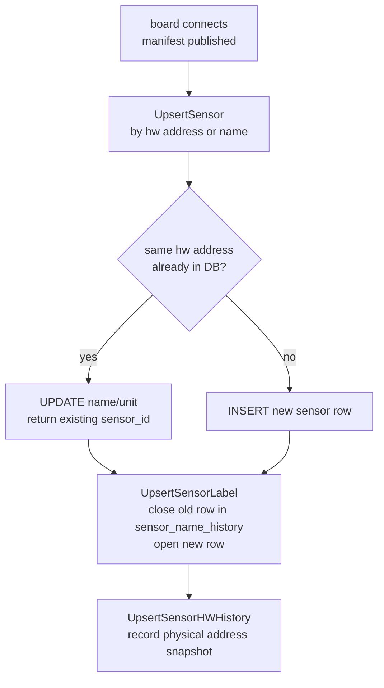
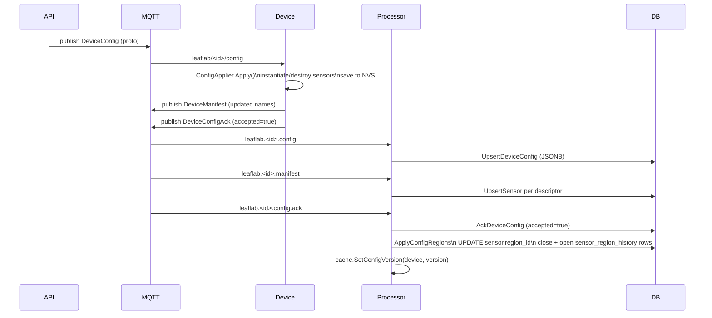
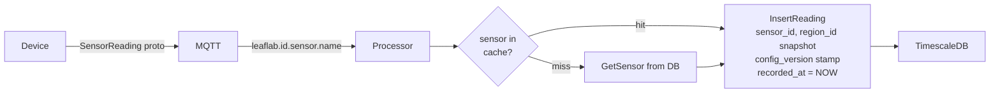

# LeafLab — Data Model & Flows

## Entity Relationships


```mermaid
erDiagram
    board {
        bigserial board_id PK
        varchar   device_id UK
        bigint    household_id FK "nullable -- FR1.1's one exception (unclaimed board)"
        timestamptz registered_at
        timestamptz last_seen_at
        timestamptz retired_at "NULL = in reporting population"
    }

    sensor_type {
        bigserial sensor_type_id PK
        varchar   name UK
        varchar   default_unit
    }

    sensor {
        bigserial   sensor_id PK
        bigint      board_id FK
        bigint      sensor_type_id FK
        bigint      region_id FK
        varchar     name
        varchar     unit
        int         i2c_address
        jsonb       mux_path
        timestamptz registered_at
        timestamptz last_seen_at
    }

    sensor_name_history {
        bigserial   sensor_name_history_id PK
        bigint      sensor_id FK
        varchar     name
        timestamptz valid_from
        timestamptz valid_to
    }

    sensor_hw_history {
        bigserial   history_id PK
        bigint      sensor_id FK
        jsonb       mux_path
        timestamptz valid_from
        timestamptz valid_to
    }

    region {
        bigserial   region_id PK
        bigint      parent_region_id FK
        bigint      household_id FK "tree root only -- descendants inherit, must be NULL"
        varchar     name
        text        description
        timestamptz created_at
    }

    sensor_region_history {
        bigserial   history_id PK
        bigint      sensor_id FK
        bigint      region_id FK
        timestamptz valid_from
        timestamptz valid_to
    }

    device_config {
        bigserial   config_id PK
        bigint      board_id FK
        bigint      version
        jsonb       config_json
        boolean     accepted
        timestamptz pushed_at
        timestamptz acked_at
    }

    sensor_reading {
        bigserial   reading_id PK
        bigint      sensor_id FK
        bigint      region_id FK
        bigint      config_version
        double      value
        boolean     valid
        int         uptime_s
        timestamptz recorded_at
    }

    sensor_chip {
        bigserial sensor_chip_id PK
        varchar   name UK
        text      description
    }

    sensor_chip_address {
        bigserial sensor_chip_address_id PK
        bigint    sensor_chip_id FK
        int       i2c_address
        boolean   is_default
        varchar   addr_config
    }

    sensor_chip_type {
        bigint sensor_chip_id FK
        bigint sensor_type_id FK
    }

    plant_type {
        bigserial plant_type_id PK
        varchar   common_name
        varchar   species
    }

    plant {
        bigserial   plant_id PK
        bigint      region_id FK
        bigint      plant_type_id FK
        bigint      household_id FK "NOT NULL -- carried directly, not inherited through region"
        varchar     name
        timestamptz created_at
        timestamptz removed_at
    }

    household {
        bigserial household_id PK
        text      name
        boolean   is_unadopted "at most one such row (A9)"
        timestamptz created_at
    }

    household_membership {
        bigserial household_membership_id PK
        bigint    household_id FK
        text      principal_subject
        timestamptz valid_from
        timestamptz valid_to
    }

    board_ownership {
        bigserial board_ownership_id PK
        bigint    board_id FK
        bigint    household_id FK
        timestamptz valid_from
        timestamptz valid_to
    }

    household_grant {
        bigserial grant_id PK
        bigint    household_id FK
        text      grantee_subject
        text      granted_by_subject
        timestamptz granted_at
        timestamptz expires_at
        timestamptz revoked_at
        text      reason
    }

    admin_elevation {
        bigserial elevation_id PK
        text      admin_subject
        bigint    target_household_id FK
        text      reason
        timestamptz started_at
        timestamptz expires_at
        timestamptz ended_at
    }

    claim_challenge {
        bigserial challenge_id PK
        text      handle UK
        text      principal_subject
        text      device_id "not a board FK -- must name a device_id that doesn't exist yet"
        int       rounds_required
        int       rounds_satisfied
        int       attempts_used
        timestamptz opened_at
        timestamptz expires_at
        text      state
        timestamptz discharged_at
    }

    claim_challenge_round {
        bigserial round_id PK
        bigint    challenge_id FK
        text      device_id "denormalized from claim_challenge"
        int       round_index
        timestamptz t0
        timestamptz bound_expires_at
        bigint    satisfied_by_reading_id "composite FK -- sensor_reading is a hypertable"
        timestamptz satisfied_by_reading_recorded_at
        timestamptz satisfied_by_manifest_at
        text      evidence_class
        timestamptz closed_at
    }

    claim_cooldown {
        text principal_subject PK
        text device_id PK
        timestamptz until
    }

    board_uptime_watermark {
        bigint board_id PK
        int    last_uptime_s
        timestamptz observed_at
    }

    support_reference {
        bigserial support_reference_id PK
        bigint    household_id FK
        text      code_hash UK "hash only -- plaintext code is never stored"
        text      created_by_subject
        timestamptz created_at
        timestamptz expires_at
        timestamptz revoked_at
        timestamptz last_resolved_at
        int       resolve_count
    }

    departure_record {
        bigserial departure_id PK
        bigint    losing_household_id FK
        timestamptz occurred_at
        jsonb     summary
        int       board_count
        int       region_count
        int       plant_count
        text      actor_subject
        text      reason
    }

    board_release_token {
        bigserial release_token_id PK
        text      token UK
        bigint    board_id FK
        bigint    household_id FK "owning household at the moment of release"
        text      released_by
        text      reason
        timestamptz issued_at
        timestamptz expires_at
        timestamptz used_at
    }

    audit_log {
        bigserial audit_id PK
        text      actor_subject
        text      actor_kind
        bigint    target_household_id FK "nullable"
        text      action
        text      entity_kind
        text      entity_id
        text      reason
        timestamptz occurred_at
        text      correlation_id
    }

    board            ||--o{ sensor               : "hosts"
    sensor_type      ||--o{ sensor               : "classifies"
    region           |o--o{ sensor               : "current placement"
    region           |o--o{ region               : "parent of"
    sensor           ||--o{ sensor_name_history   : "name history"
    sensor           ||--o{ sensor_hw_history    : "wiring history"
    sensor           ||--o{ sensor_region_history: "location history"
    region           ||--o{ sensor_region_history: "hosts"
    sensor           ||--o{ sensor_reading       : "produces"
    board            ||--o{ device_config        : "configured by"
    sensor_chip      ||--o{ sensor_chip_address  : "known addresses"
    sensor_chip      ||--o{ sensor_chip_type     : "produces"
    sensor_type      ||--o{ sensor_chip_type     : "produced by"
    region           ||--o{ plant                : "hosts"
    plant_type       ||--o{ plant                : "classifies"
    household        ||--o{ plant                : "owns"
    household        |o--o{ region               : "owns tree root (household_id, root only)"
    household        |o--o{ board                : "current owner (household_id cache)"
    household        ||--o{ board_ownership      : "ownership history"
    board            ||--o{ board_ownership      : "ownership history"
    household        ||--o{ household_membership : "members"
    household        ||--o{ household_grant      : "grants issued"
    household        ||--o{ admin_elevation      : "target of elevation"
    household        ||--o{ support_reference    : "support codes"
    household         ||--o{ departure_record     : "departures (losing side)"
    household         |o--o{ audit_log            : "audit trail (target, nullable)"
    board            ||--o{ board_release_token  : "release tokens"
    household        ||--o{ board_release_token  : "issuing household at release"
    claim_challenge  ||--o{ claim_challenge_round : "rounds"
    sensor_reading   |o--o{ claim_challenge_round : "restart evidence (composite FK)"
```

`claim_challenge`, `claim_challenge_round` and `claim_cooldown` key on `device_id` as a
plain string, deliberately **not** a foreign key to `board.device_id` — a possession
challenge must open identically for a `device_id` that does not exist at all (uniform
initiation, NFR2's no-existence-oracle), so the column has to be able to name a board row
that never exists. `board_uptime_watermark.board_id` **is** a real FK (`ON DELETE CASCADE`)
— once a reading has been attributed to a board row, the watermark is scoped to that row.

---

## Ownership Model

Every board, region tree, and plant belongs to exactly one **household** — not to a board,
and not to an individual sensor or plant record standing alone. `household` is the single
root of the ownership tree (migration `015_ownership.up.sql`).

### Why the household, not the board (A1)

A region subtree can hold sensors from *several* boards (e.g. one "Greenhouse" region tree
fed by three separate ESP32 boards). A per-board ACL cannot express "my regions" or "my
plants" in that shape — asking "which regions belong to me" would require walking every
sensor's current board and de-duplicating owners, and would still be wrong the moment a
second board's sensor is added to the same region tree by a different owner. `region` **has
no `board_id` FK** — ownership has to be rooted somewhere that isn't the board, and the
household is that root.

### How `household_id` inherits

`household_id` is carried directly on three tables, with different inheritance shapes:

| Table | Column | Shape |
|---|---|---|
| `board` | `household_id` | Nullable — FR1.1's one exception. An unclaimed, self-registered board resolves to no household until claimed (FR76) or reached through the admin's elevated lane. |
| `region` | `household_id` | **Tree root only.** A non-root region's `household_id` must be `NULL` or equal to its tree root's `household_id` — enforced by a trigger (`enforce_region_household_root`) that walks the parent chain, since a `CHECK` constraint cannot do that. Descendants inherit through the tree structure itself, not through a copied column. |
| `plant` | `household_id` | `NOT NULL`, carried directly on every plant row — **not** inherited through `region`, because a region subtree's `household_id` inheritance is a *tree-root* concept and a plant is a leaf that this schema chooses to make self-describing instead of requiring a walk to the root on every read. |

Sensors and readings carry no `household_id` column of their own — they inherit through
their board: `sensor.board_id → board.household_id`, and a reading's owning household is
its sensor's board's household. There is no `sensor.household_id` or
`sensor_reading.household_id` column; resolving one requires the join, by design (a second,
independently-writable copy of the same fact is exactly what NFR6.1's SCD2-history
discipline exists to avoid elsewhere in this schema).

### The Unadopted household (FR70.1, A9)

A single seeded, member-less household (`household.is_unadopted = TRUE`, enforced unique by
`idx_household_unadopted_singleton`) is the backfill target for every board, region root and
plant that existed before migration 015. It receives **no new arrivals** after that
backfill — `enforce_no_unadopted_arrivals()` refuses any `INSERT` into `board_ownership` or
`household_membership` naming it, so a board or person can never be assigned into Unadopted
going forward; a board only ever *leaves* Unadopted (via FR76 claim/adoption), never enters.

### The ownership closure — a fixed six-step enumeration, not a transitive closure

FR70's ownership closure of a board `B` (used by `ReleaseBoard`/`TransferClosure`,
`leaflab/api/closure.go`, FR70.2–.4/FR77) is a **fixed six-step enumeration** over current
placement:

1. B itself.
2. B's sensors.
3. The regions those sensors currently occupy.
4. The root subtree(s) containing those regions.
5. Every OTHER board with a sensor currently in that subtree (entangled boards).
6. Every plant currently placed in that subtree.

It deliberately does **not** recurse into step 5's entangled boards' OTHER sensors (which
may sit in a different subtree entirely) — doing so would make the closure a transitive
closure, which the requirement text calls out as a defect, not an optimisation: "does not
follow entangled boards' sensors into other subtrees, so adoption may leave an owned board
with a sensor in an unowned region. That is not a live cross-household reference and is
dischargeable." `ComputeClosure` is written as six sequential queries, in this exact order,
specifically so that shape stays visible in the code — it is not a recursive walk over
"boards reachable from B", and must not be refactored into one.

`TransferClosure` (FR77) moves the *whole* closure — B, every entangled board currently
owned by the same losing household, every subtree root region, and every plant in the
subtree — to the destination household in one transaction, gated on evidence (a release
token from `ReleaseBoard`, FR77(a), or an elevated admin action carrying a discharged FR76
possession-challenge handle, FR77(b)). If the closure contains a board **not** currently
owned by the losing household (a third household, Unadopted, or unclaimed), the whole
operation refuses, naming the offending board(s) and the shared subtree, rather than
partially transferring.

Transfer leaves a `departure_record` behind on the **losing** household — the record stays
with the household that lost the closure and does not travel with it (unlike
`board_ownership`/`plant.household_id`, which move to the gaining household), so "what left
and when" is a durable, readable fact for the household that no longer has it.

---

## Sensor Identity Through Time

`sensor` is a stable anchor — its `sensor_id` never changes even when the
sensor is renamed, moved, or temporarily removed from a config.


```mermaid
flowchart TD
    A[board connects\nmanifest published] --> B[UpsertSensor\nby hw address or name]
    B --> C{same hw address\nalready in DB?}
    C -- yes --> D[UPDATE name/unit\nreturn existing sensor_id]
    C -- no  --> E[INSERT new sensor row]
    D --> F[UpsertSensorLabel\nclose old row in sensor_name_history\nopen new row]
    E --> F
    F --> G[UpsertSensorHWHistory\nrecord physical address snapshot]
```

---

## Config Push & Region Assignment


```mermaid
sequenceDiagram
    participant API
    participant MQTT
    participant Device
    participant Processor
    participant DB

    API->>MQTT: publish DeviceConfig (proto)
    MQTT->>Device: leaflab/<id>/config
    Device->>Device: ConfigApplier.Apply()\ninstantiate/destroy sensors\nsave to NVS
    Device->>MQTT: publish DeviceManifest (updated names)
    Device->>MQTT: publish DeviceConfigAck (accepted=true)
    MQTT->>Processor: leaflab.<id>.config
    Processor->>DB: UpsertDeviceConfig (JSONB)
    MQTT->>Processor: leaflab.<id>.manifest
    Processor->>DB: UpsertSensor per descriptor
    MQTT->>Processor: leaflab.<id>.config.ack
    Processor->>DB: AckDeviceConfig (accepted=true)
    Processor->>DB: ApplyConfigRegions\n  UPDATE sensor.region_id\n  close + open sensor_region_history rows
    Processor->>Processor: cache.SetConfigVersion(device, version)
```

---

## Reading Write Path


```mermaid
flowchart LR
    Device -->|SensorReading proto| MQTT
    MQTT -->|leaflab.id.sensor.name| Processor
    Processor --> Cache{sensor in\ncache?}
    Cache -- hit --> Insert
    Cache -- miss --> DB_lookup[GetSensor from DB]
    DB_lookup --> Insert
    Insert[InsertReading\nsensor_id, region_id snapshot\nconfig_version stamp\nrecorded_at = NOW] --> TimescaleDB
```

---

## mux_path JSONB Format

`sensor.mux_path` and `sensor_hw_history.mux_path` store the full I2C mux
chain ordered outer → inner.  Empty array means the sensor is directly on
the root I2C bus.

```jsonc
// direct on root bus
[]

// single TCA9548A at 0x70, channel 5
[{"muxAddress": 112, "muxChannel": 5}]

// cascaded muxes: outer 0x70 ch3 → inner 0x71 ch1
[{"muxAddress": 112, "muxChannel": 3},
 {"muxAddress": 113, "muxChannel": 1}]
```

Unique constraint on `sensor`: `(board_id, i2c_address, sensor_type_id, mux_path::text)`.

---

## Config Version Stamping

Every `sensor_reading` row carries `config_version` (nullable).  This is the
`device_config.version` that was active when the reading was written, taken
from an in-memory cache pre-warmed at processor startup and updated on each
accepted `DeviceConfigAck`.

This enables queries like:

```sql
-- readings taken under a specific config
SELECT * FROM sensor_reading
WHERE sensor_id = $1 AND config_version = $2
ORDER BY recorded_at DESC;

-- latest reading per config version
SELECT config_version, MAX(recorded_at)
FROM sensor_reading WHERE sensor_id = $1
GROUP BY config_version ORDER BY 2 DESC;
```

---

## A23 Staleness Threshold ("reporting" vs "not reporting")

A23 defines when a board counts as "not reporting" for FR79's fleet health listing
(`ListFleetHealth`, `ResolveToHousehold`'s standing-lane projection) and, later, FR62's
household-landing classification and FR42's re-send availability: **3× the board's longest
configured poll interval, floored at 15 minutes** (`leaflab/api/health.Threshold`,
`StalenessMultiplier = 3`, `StalenessFloor = 15 * time.Minute`). This is computed **globally,
not per-household** — no caller scopes the arithmetic to a household. A retired board
(`board.retired_at IS NOT NULL`) is never classified `REPORTING_STATE_NOT_REPORTING`
regardless of staleness (FR22.4) — it is simply excluded from the "not reporting" tally, not
counted as healthy.

A sensor whose configured `poll_interval_ms` is `0` ("use device default") is treated as
`DefaultPollInterval` (60s, matching `sensorboard_dynamic_main.cc`'s compile-time
`SENSOR_POLL_INTERVAL_MS`) before the 3×/floor arithmetic is applied. A board with no
accepted config, or an accepted config with no sensors, is treated as a longest-configured-
interval of `0`, which floors to `StalenessFloor` — the same outcome a freshly-registered,
never-configured board should have.

**Recorded decision (FR79 task, effective cadence vs. configured interval):** A23's text
asks for a threshold that "should derive from the effective publish cadence", but the
firmware does not yet honor per-sensor poll intervals — `sensorboard_dynamic_main.cc` still
publishes every sensor together on one compile-time `SENSOR_POLL_INTERVAL_MS`, ignoring
`SensorConfig.poll_interval_ms` entirely. `health.Threshold` derives the threshold from the
**configured** poll interval — the value an operator pushed via `PushDeviceConfig`, read
from the board's active accepted config — not from observed publish timestamps, for two
reasons: (1) A23's text reads "longest configured poll interval", which names the config
value, not an inferred one; (2) an observed-cadence derivation would, today, collapse to the
same fixed value for every board regardless of what was configured, since the firmware
ignores the configured value and publishes on one global compile-time constant — that would
defeat the per-board behavior A23 requires. When the firmware gap closes (per-sensor
intervals actually honored), this function's output becomes accurate to the real publish
cadence with no change to `health.Threshold` — it already computes from the value that will
then be true.

---

## SCD2 Convention

All SCD2 (Slowly Changing Dimension Type 2) history tables follow a uniform column convention:

| Column | Type | Meaning |
|---|---|---|
| `valid_from` | `TIMESTAMPTZ NOT NULL` | When this row became the current value |
| `valid_to` | `TIMESTAMPTZ` | When it was superseded; `NULL` = still current |

A partial index on `(sensor_id) WHERE valid_to IS NULL` makes "what is the current value?" queries O(1) on each history table.

SCD2 tables in this schema:

| Table | What changes |
|---|---|
| `sensor_name_history` | Sensor logical name |
| `sensor_region_history` | Sensor region assignment |
| `sensor_hw_history` | Sensor I2C address + mux path |
| `household_membership` | Which principals belong to a household |
| `board_ownership` | Which household currently owns a board (re-ownership history, e.g. reclaim) |

`device_config` is NOT SCD2 — it is an append-only event log keyed by `(board_id, version)`. The view `v_board_state_history` derives a SCD2-shaped representation from it using a window function.

### What is NOT SCD2, and why (NFR6.3)

Every Phase 2 table below is explicitly **not** given `valid_from`/`valid_to` shape, on
purpose — each has a different reason a current/history versioning model would be the wrong
fit:

| Table | Why it is not SCD2 |
|---|---|
| `departure_record` | Append-only fact log, not a current-value dimension — a departure is an event that happened once, never superseded or re-versioned. Enforced at the database layer: a `BEFORE UPDATE OR DELETE` trigger raises unconditionally (fires for every role, including the table owner), plus an explicit `REVOKE UPDATE, DELETE` — the same two-layer pattern as `audit_log`. |
| `audit_log` | Same append-only shape and same two-layer enforcement as `departure_record` — FR8's audit trail must never be edited or backdated, by anyone, including ad-hoc DML from the table's own owning role. |
| `claim_challenge`, `claim_challenge_round`, `claim_cooldown` | Short-lived, expiring records, not history-bearing current values. Lifecycle is tracked by `state`/`expires_at`/`closed_at`/`until` columns instead — there is nothing to reconstruct "value at time T" for; once a challenge or cooldown ends, it stays ended. |
| `support_reference` | Same shape as the claim tables: a short-lived token with a hard expiry (`expires_at`) or explicit `revoked_at`, not a current-value history. Compare `admin_elevation`, directly below, for the identical reasoning. |
| `household_grant` | A time-boxed, revocable grant of access — revocation sets `revoked_at`, it does not close a `valid_from`/`valid_to` interval, and there is no `valid_to` column at all. Expiry is evaluated at request time against `NOW()`, not by a background job marking the row expired. |
| `admin_elevation` | A single bounded episode with a hard end (`expires_at` or explicit `EndElevation` setting `ended_at`), not a current-value history to version. Contrast with `household_membership`, which genuinely is SCD2 because membership has no built-in expiry and must support "value at time T". |
| `board_release_token`, `board_uptime_watermark` | Single-use or single-current-row bookkeeping, not history. A release token is consumed once (`used_at`) and never re-issued in place; a watermark holds only the *latest* observed `uptime_s` per board — the prior value is needed only to compare against the newest one, never to reconstruct a timeline. |

---

## Analytical Views

Seven plain views (prefixed `v_`) expose the schema to downstream consumers (Grafana panels, ad-hoc SQL). All join logic is in the views — consumers should not replicate it.

| View | Cardinality | Purpose |
|---|---|---|
| `v_region_path` | 1 row / region | Recursive region hierarchy with `path_ids[]`, `path_names[]`, `path_name` |
| `v_sensor_current` | 1 row / sensor | Current state: name, type, chip, board, region path |
| `v_board_state_history` | 1 row / accepted config | SCD2-shaped board config history (valid_from / valid_to) |
| `v_board_state_current` | 1 row / board | Current accepted device config per board |
| `v_sensor_reading_enriched` | 1 row / reading | **Workhorse**: reading + sensor + region path + config metadata |
| `v_sensor_reading_with_plant` | 1 row / (reading × active plant) | Plant and plant_type slices; readings without plants appear with NULL plant fields |
| `v_sensor_reading_with_config_debug` | 1 row / reading | `v_sensor_reading_enriched` + full `device_config.config_json` (debug) |

### Temporal accuracy

- **Region** is historically accurate: `sensor_reading.region_id` is snapshotted at insert, so the views join the snapshot — not the sensor's current region.
- **Config version** is historically accurate: `sensor_reading.config_version` is stamped at insert from the in-memory cache.
- **Sensor name** is the *current* name from `sensor_name_history WHERE valid_to IS NULL`. For dashboards showing live or recent data this is almost always correct; for strict point-in-time name lookups query `sensor_name_history` directly.
- **Plant** is resolved at query time: plants active in the reading's snapshot region at `recorded_at`.

### Example queries

```sql
-- Lux readings in "Room A" (or any child region) over the last 24 hours
SELECT recorded_at, value, region_path_name, sensor_name
FROM v_sensor_reading_enriched
WHERE 'Room A' = ANY(region_path_names)
  AND sensor_type_name = 'illuminance'
  AND recorded_at > NOW() - INTERVAL '24 hours'
ORDER BY recorded_at DESC;

-- Average temperature per plant type this week
SELECT plant_common_name, AVG(value) AS avg_temp_c
FROM v_sensor_reading_with_plant
WHERE sensor_type_name = 'temperature'
  AND recorded_at > NOW() - INTERVAL '7 days'
GROUP BY plant_common_name;

-- What config was board X running when a reading spiked?
SELECT recorded_at, value, config_version, device_config_json
FROM v_sensor_reading_with_config_debug
WHERE device_id = 'leaflab-ccdba79f5fac'
  AND value > 90000
ORDER BY recorded_at DESC;

-- Is any board behind on its latest config push?
SELECT b.device_id, b.last_seen_at, bsc.version AS active_version
FROM board b
LEFT JOIN v_board_state_current bsc ON bsc.board_id = b.board_id
WHERE bsc.version IS DISTINCT FROM (
    SELECT MAX(version) FROM device_config
    WHERE board_id = b.board_id AND accepted = TRUE
);
```
