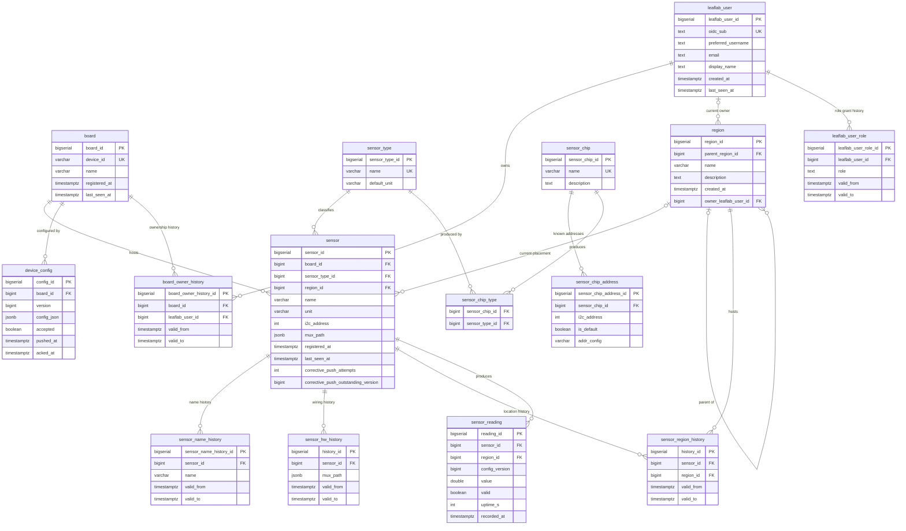
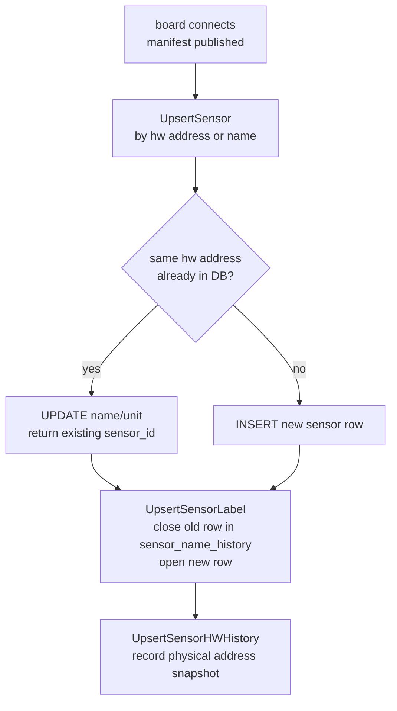
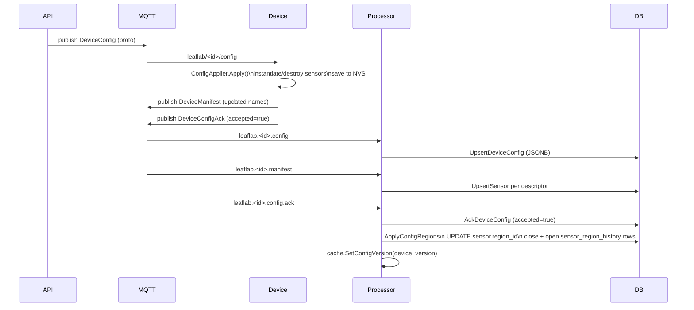
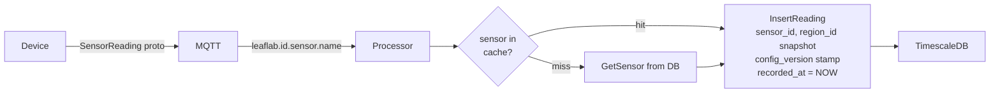

# LeafLab — Data Model & Flows

## Entity Relationships


```mermaid
erDiagram
    board {
        bigserial board_id PK
        varchar   device_id UK
        varchar   name
        timestamptz registered_at
        timestamptz last_seen_at
    }

    sensor_type {
        bigserial sensor_type_id PK
        varchar   name UK
        varchar   default_unit
    }

    sensor {
        bigserial   sensor_id PK
        bigint      board_id FK
        bigint      sensor_type_id FK
        bigint      region_id FK
        varchar     name
        varchar     unit
        int         i2c_address
        jsonb       mux_path
        timestamptz registered_at
        timestamptz last_seen_at
        int         corrective_push_attempts
        bigint      corrective_push_outstanding_version
    }

    sensor_name_history {
        bigserial   sensor_name_history_id PK
        bigint      sensor_id FK
        varchar     name
        timestamptz valid_from
        timestamptz valid_to
    }

    sensor_hw_history {
        bigserial   history_id PK
        bigint      sensor_id FK
        jsonb       mux_path
        timestamptz valid_from
        timestamptz valid_to
    }

    region {
        bigserial   region_id PK
        bigint      parent_region_id FK
        varchar     name
        text        description
        timestamptz created_at
        bigint      owner_leaflab_user_id FK
    }

    sensor_region_history {
        bigserial   history_id PK
        bigint      sensor_id FK
        bigint      region_id FK
        timestamptz valid_from
        timestamptz valid_to
    }

    device_config {
        bigserial   config_id PK
        bigint      board_id FK
        bigint      version
        jsonb       config_json
        boolean     accepted
        timestamptz pushed_at
        timestamptz acked_at
    }

    sensor_reading {
        bigserial   reading_id PK
        bigint      sensor_id FK
        bigint      region_id FK
        bigint      config_version
        double      value
        boolean     valid
        int         uptime_s
        timestamptz recorded_at
    }

    sensor_chip {
        bigserial sensor_chip_id PK
        varchar   name UK
        text      description
    }

    sensor_chip_address {
        bigserial sensor_chip_address_id PK
        bigint    sensor_chip_id FK
        int       i2c_address
        boolean   is_default
        varchar   addr_config
    }

    sensor_chip_type {
        bigint sensor_chip_id FK
        bigint sensor_type_id FK
    }

    leaflab_user {
        bigserial   leaflab_user_id PK
        text        oidc_sub UK
        text        preferred_username
        text        email
        text        display_name
        timestamptz created_at
        timestamptz last_seen_at
    }

    board_owner_history {
        bigserial   board_owner_history_id PK
        bigint      board_id FK
        bigint      leaflab_user_id FK
        timestamptz valid_from
        timestamptz valid_to
    }

    leaflab_user_role {
        bigserial   leaflab_user_role_id PK
        bigint      leaflab_user_id FK
        text        role
        timestamptz valid_from
        timestamptz valid_to
    }

    board            ||--o{ sensor               : "hosts"
    sensor_type      ||--o{ sensor               : "classifies"
    region           |o--o{ sensor               : "current placement"
    region           |o--o{ region               : "parent of"
    sensor           ||--o{ sensor_name_history   : "name history"
    sensor           ||--o{ sensor_hw_history    : "wiring history"
    sensor           ||--o{ sensor_region_history: "location history"
    region           ||--o{ sensor_region_history: "hosts"
    sensor           ||--o{ sensor_reading       : "produces"
    board            ||--o{ device_config        : "configured by"
    sensor_chip      ||--o{ sensor_chip_address  : "known addresses"
    sensor_chip      ||--o{ sensor_chip_type     : "produces"
    sensor_type      ||--o{ sensor_chip_type     : "produced by"
    board            ||--o{ board_owner_history  : "ownership history"
    leaflab_user     ||--o{ board_owner_history  : "owns"
    leaflab_user     |o--o{ region               : "current owner"
    leaflab_user     ||--o{ leaflab_user_role    : "role grant history"
```

Ownership (`leaflab_user`, `board_owner_history`, and the `owner_leaflab_user_id`
references on `region` and `plant`) is created in M1 but written by nothing
but interactive sign-in — no row exists in any of these until FR2/C25 land.
`plant` is omitted from the diagram above along with `plant_type` (existing
gap, reconciled in M4 per `leaflab/product/03-roadmap.md`), but it gains the
same nullable `owner_leaflab_user_id FK` as `region`.

`board.name` is a plain current-value column, not a history table, by
design (FR3, migration 016) -- board name is not an attribution dimension
for any reading, matching `region.name`'s precedent under LB6. `NULL` means
"no name set, display `device_id`"; non-empty is enforced in the API layer,
not by a check constraint.

`leaflab_user_role` (FR10, migration 016) is leaflab-local role storage --
it is never read from OIDC `realm_access.roles`. It is SCD2-shaped like
`board_owner_history`: granting, revoking, and re-granting a role preserves
the closed row rather than erasing the fact that it was once granted. After
migration 016 runs, exactly one `leaflab_user` row (the one with the
lowest `leaflab_user_id`, if any exist at migration time) holds an open
`'admin'` grant, so FR10's "at least one admin, no UI action needed"
invariant holds without further setup; the zero-users case is bootstrapped
separately on first sign-in.

The zero-users bootstrap lives in `leaflab-ui`'s `upsertLeafLabUser`
(`handlers_auth.go`), the sign-in handler and sole writer of `leaflab_user`
(LB1) -- `leaflab-api` never creates this grant. When the upsert *creates* a
`leaflab_user` row (detected via Postgres's `xmax = 0` idiom on the `INSERT
... ON CONFLICT` `RETURNING` clause, not a separate lookup) and no open
`'admin'` grant exists for any user, the new user is granted `'admin'`.
Both checks and the grant run inside the same transaction as the
`leaflab_user` insert, serialized by a `pg_advisory_xact_lock` -- the
per-user uniqueness of `idx_leaflab_user_role_current` does nothing to stop
two *different* users racing to be first, which is what the lock is for.
The grant is one-shot: once any admin grant has ever existed (from
migration 016 or from this path), every later first-time sign-in creates an
ordinary user. See `leaflab/README.md#the-admin-role-m2` for the
by-hand `psql` snippet that moves the role to a different user.

`sensor.corrective_push_attempts` and
`sensor.corrective_push_outstanding_version` (NFR4, migration 016) back the
corrective-push retry budget. This state lives on the `sensor` row in
Postgres rather than in `leaflab-processor`'s in-memory `SensorCache`,
because the processor is `release_app(..., replicas = 1)` and routine
redeploys restart it -- an in-memory counter would hand a device that never
persists to NVS a fresh attempt budget on every deploy.
`corrective_push_outstanding_version` is `NULL` when no corrective push is
outstanding, and otherwise holds the `device_config.version` of a push
issued but not yet acked.

---

## Sensor Identity Through Time

`sensor` is a stable anchor — its `sensor_id` never changes even when the
sensor is renamed, moved, or temporarily removed from a config.


```mermaid
flowchart TD
    A[board connects\nmanifest published] --> B[UpsertSensor\nby hw address or name]
    B --> C{same hw address\nalready in DB?}
    C -- yes --> D[UPDATE name/unit\nreturn existing sensor_id]
    C -- no  --> E[INSERT new sensor row]
    D --> F[UpsertSensorLabel\nclose old row in sensor_name_history\nopen new row]
    E --> F
    F --> G[UpsertSensorHWHistory\nrecord physical address snapshot]
```

---

## Config Push & Region Assignment


```mermaid
sequenceDiagram
    participant API
    participant MQTT
    participant Device
    participant Processor
    participant DB

    API->>MQTT: publish DeviceConfig (proto)
    MQTT->>Device: leaflab/<id>/config
    Device->>Device: ConfigApplier.Apply()\ninstantiate/destroy sensors\nsave to NVS
    Device->>MQTT: publish DeviceManifest (updated names)
    Device->>MQTT: publish DeviceConfigAck (accepted=true)
    MQTT->>Processor: leaflab.<id>.config
    Processor->>DB: UpsertDeviceConfig (JSONB)
    MQTT->>Processor: leaflab.<id>.manifest
    Processor->>DB: UpsertSensor per descriptor
    MQTT->>Processor: leaflab.<id>.config.ack
    Processor->>DB: AckDeviceConfig (accepted=true)
    Processor->>DB: ApplyConfigRegions\n  UPDATE sensor.region_id\n  close + open sensor_region_history rows
    Processor->>Processor: cache.SetConfigVersion(device, version)
```

**API composes the full desired sensor list (FR8).** Before the `publish`
step above, `leaflab-api`'s `PushDeviceConfig` (`leaflab/api/server.go`) is
not a pass-through of the caller's request. It reads the board's current
`sensor` inventory (`ListSensorInventoryForBoard`) and its last accepted
config (`GetLatestAcceptedConfig`), then merges them with the caller's
requested overrides via `ComposeDesiredSensors`
(`leaflab/api/configcompose.go`) — inventory lowest precedence, last
accepted config next, caller overrides highest, matched by hardware
identity `(mux_path, i2c_address)` rather than name. The published
`DeviceConfig` always carries every sensor the board is known to have,
whether or not the caller named it, so a push that renames or reconfigures
one sensor never removes or resets the board's other sensors (LB3).
`ComposeDesiredSensors` is a pure function with no DB/transport
dependencies precisely so `leaflab-processor`'s FR9 corrective push (a
later milestone item) can reuse it and produce an identical desired list
for the same DB state.

---

## Reading Write Path


```mermaid
flowchart LR
    Device -->|SensorReading proto| MQTT
    MQTT -->|leaflab.id.sensor.name| Processor
    Processor --> Cache{sensor in\ncache?}
    Cache -- hit --> Insert
    Cache -- miss --> DB_lookup[GetSensor from DB]
    DB_lookup --> Insert
    Insert[InsertReading\nsensor_id, region_id snapshot\nconfig_version stamp\nrecorded_at = NOW] --> TimescaleDB
```

---

## mux_path JSONB Format

`sensor.mux_path` and `sensor_hw_history.mux_path` store the full I2C mux
chain ordered outer → inner.  Empty array means the sensor is directly on
the root I2C bus.

```jsonc
// direct on root bus
[]

// single TCA9548A at 0x70, channel 5
[{"muxAddress": 112, "muxChannel": 5}]

// cascaded muxes: outer 0x70 ch3 → inner 0x71 ch1
[{"muxAddress": 112, "muxChannel": 3},
 {"muxAddress": 113, "muxChannel": 1}]
```

Unique constraint on `sensor`: `(board_id, i2c_address, sensor_type_id, mux_path::text)`.

---

## Config Version Stamping

Every `sensor_reading` row carries `config_version` (nullable).  This is the
`device_config.version` that was active when the reading was written, taken
from an in-memory cache pre-warmed at processor startup and updated on each
accepted `DeviceConfigAck`.

This enables queries like:

```sql
-- readings taken under a specific config
SELECT * FROM sensor_reading
WHERE sensor_id = $1 AND config_version = $2
ORDER BY recorded_at DESC;

-- latest reading per config version
SELECT config_version, MAX(recorded_at)
FROM sensor_reading WHERE sensor_id = $1
GROUP BY config_version ORDER BY 2 DESC;
```

---

## SCD2 Convention

All SCD2 (Slowly Changing Dimension Type 2) history tables follow a uniform column convention:

| Column | Type | Meaning |
|---|---|---|
| `valid_from` | `TIMESTAMPTZ NOT NULL` | When this row became the current value |
| `valid_to` | `TIMESTAMPTZ` | When it was superseded; `NULL` = still current |

A partial index on `(sensor_id) WHERE valid_to IS NULL` makes "what is the current value?" queries O(1) on each history table.

SCD2 tables in this schema:

| Table | What changes |
|---|---|
| `sensor_name_history` | Sensor logical name |
| `sensor_region_history` | Sensor region assignment |
| `sensor_hw_history` | Sensor I2C address + mux path |
| `board_owner_history` | Board ownership (`leaflab_user_id`) |
| `leaflab_user_role` | leaflab-local role grants (e.g. `'admin'`) -- not OIDC-derived |

`device_config` is NOT SCD2 — it is an append-only event log keyed by `(board_id, version)`. The view `v_board_state_history` derives a SCD2-shaped representation from it using a window function.

---

## Analytical Views

Nine plain views (prefixed `v_`) expose the schema to downstream consumers (Grafana panels, ad-hoc SQL). All join logic is in the views — consumers should not replicate it.

| View | Cardinality | Purpose |
|---|---|---|
| `v_region_path` | 1 row / region | Recursive region hierarchy with `path_ids[]`, `path_names[]`, `path_name` |
| `v_sensor_current` | 1 row / sensor | Current state: name, type, chip, board, region path |
| `v_board_state_history` | 1 row / accepted config | SCD2-shaped board config history (valid_from / valid_to) |
| `v_board_state_current` | 1 row / board | Current accepted device config per board |
| `v_sensor_reading_enriched` | 1 row / reading | **Workhorse**: reading + sensor + region path + config metadata |
| `v_sensor_reading_with_plant` | 1 row / (reading × active plant) | Plant and plant_type slices; readings without plants appear with NULL plant fields |
| `v_sensor_reading_with_config_debug` | 1 row / reading | `v_sensor_reading_enriched` + full `device_config.config_json` (debug) |
| `v_sensor_last_reading` | 1 row / sensor | Each sensor's latest `recorded_at`, via a `LATERAL ... ORDER BY recorded_at DESC LIMIT 1` that uses `idx_sensor_reading_sensor_id` — O(1) per sensor instead of scanning the hypertable |
| `v_board_last_reading` | 1 row / board | `v_sensor_last_reading` rolled up to `MAX(last_reading_at)` per board. Backs `GET /boards`' `ListBoardsWithState` — do not replace with a raw `board`/`sensor`/`sensor_reading` join, which scans every reading ever recorded |

### Temporal accuracy

- **Region** is historically accurate: `sensor_reading.region_id` is snapshotted at insert, so the views join the snapshot — not the sensor's current region.
- **Config version** is historically accurate: `sensor_reading.config_version` is stamped at insert from the in-memory cache.
- **Sensor name** is the *current* name from `sensor_name_history WHERE valid_to IS NULL`. For dashboards showing live or recent data this is almost always correct; for strict point-in-time name lookups query `sensor_name_history` directly.
- **Plant** is resolved at query time: plants active in the reading's snapshot region at `recorded_at`.

### Example queries

```sql
-- Lux readings in "Room A" (or any child region) over the last 24 hours
SELECT recorded_at, value, region_path_name, sensor_name
FROM v_sensor_reading_enriched
WHERE 'Room A' = ANY(region_path_names)
  AND sensor_type_name = 'illuminance'
  AND recorded_at > NOW() - INTERVAL '24 hours'
ORDER BY recorded_at DESC;

-- Average temperature per plant type this week
SELECT plant_common_name, AVG(value) AS avg_temp_c
FROM v_sensor_reading_with_plant
WHERE sensor_type_name = 'temperature'
  AND recorded_at > NOW() - INTERVAL '7 days'
GROUP BY plant_common_name;

-- What config was board X running when a reading spiked?
SELECT recorded_at, value, config_version, device_config_json
FROM v_sensor_reading_with_config_debug
WHERE device_id = 'leaflab-ccdba79f5fac'
  AND value > 90000
ORDER BY recorded_at DESC;

-- Is any board behind on its latest config push?
SELECT b.device_id, b.last_seen_at, bsc.version AS active_version
FROM board b
LEFT JOIN v_board_state_current bsc ON bsc.board_id = b.board_id
WHERE bsc.version IS DISTINCT FROM (
    SELECT MAX(version) FROM device_config
    WHERE board_id = b.board_id AND accepted = TRUE
);
```
