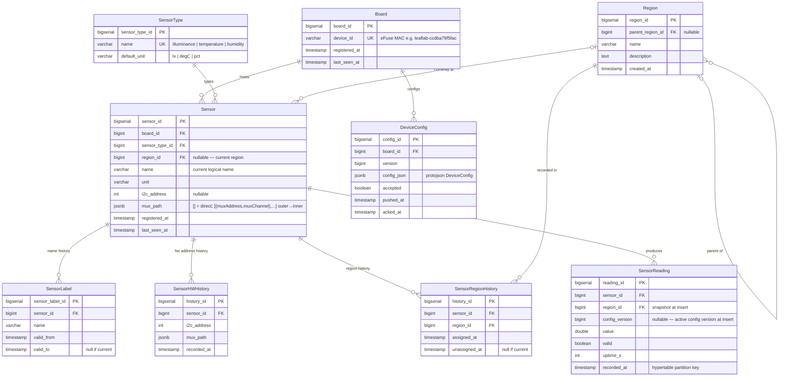

# LeafLab

Plant and environment monitoring firmware and data pipeline.

LeafLab devices read sensors (light, temperature, soil moisture, etc.), publish readings to MQTT, and feed a cloud processing pipeline. Each device is a small ESP32 board running firmware built in this monorepo.

---

## Projects

| Directory | Description |
|-----------|-------------|
| `sensorboard/` | ESP32 firmware that reads sensors via I2C and publishes via MQTT |
| `processor/` | Go service that consumes MQTT messages from RabbitMQ and writes to the database |
| `migrate/` | Database migration runner (TimescaleDB) |

---

## Quick Start

```bash
# Build sensorboard firmware (simple dynamic — single BH1750)
bazel build //leaflab/sensorboard:sensorboard_simple_dynamic --config=esp32

# Flash to a connected ESP32 over USB
bazel run //leaflab/sensorboard:flash_simple_dynamic -- /dev/ttyUSB0

# Monitor serial output
bazel run //leaflab/sensorboard:serial

# Provision Wi-Fi + MQTT credentials (first time)
bazel run //leaflab/sensorboard:provision -- /dev/ttyUSB0 \
  wifi_ssid=MySSID wifi_pass=MyPass \
  mqtt_host=192.168.1.42 mqtt_port=1883
```

See [`sensorboard/README.md`](sensorboard/README.md) for full build, flash, and extension instructions.

---

## Architecture Overview

```
Physical sensor (BH1750, etc.)
    ↓ I2C
ESP32 (leaflab/sensorboard firmware)
    ↓ MQTT over Wi-Fi
RabbitMQ (MQTT plugin, amq.topic exchange)
    ↓ AMQP
leaflab/processor (Go)
    ↓
TimescaleDB (PostgreSQL + timescaledb extension)
    ↓
Dashboards / analytics
```

The sensor firmware layer is fully unit-tested on the host — no hardware required for most development work. See [`ARCHITECTURE.md`](ARCHITECTURE.md) for the full design.

---

## Database Schema



Key design decisions:
- `sensor` is a stable dimension anchor — rename via config closes old `sensor_label` row, opens new; `sensor_id` and reading history are unchanged
- `sensor.region_id` is a current-value cache; `sensor_region_history` records every assignment (SCD-2)
- `sensor_reading.region_id` is snapshotted at insert so historical location is preserved when sensors move
- `sensor_reading.config_version` records which `DeviceConfig` was active at write time
- `sensor.mux_path` is JSONB supporting arbitrary mux cascade depth
- `device_config.config_json` stores protojson for human-readable SQL queries; device NVS uses binary nanopb

---

## Relationship to `//firmware`

LeafLab firmware is built on top of the board-agnostic libraries in [`firmware/`](../firmware/README.md):

- `firmware/sensor` — `ISensor` interface, `SensorReading`, `BH1750Sensor`, thermistor
- `firmware/i2c` — `II2CBus`, `ArduinoI2CBus`, `FakeI2CBus`
- `firmware/mqtt` — `MQTTWriter` sensor aggregator
- `firmware/network` — Wi-Fi + MQTT state machine

LeafLab board configs (`elegoo_config.cc`) wire together these libraries with concrete hardware addresses and pin assignments. The libraries themselves have no LeafLab-specific knowledge.
