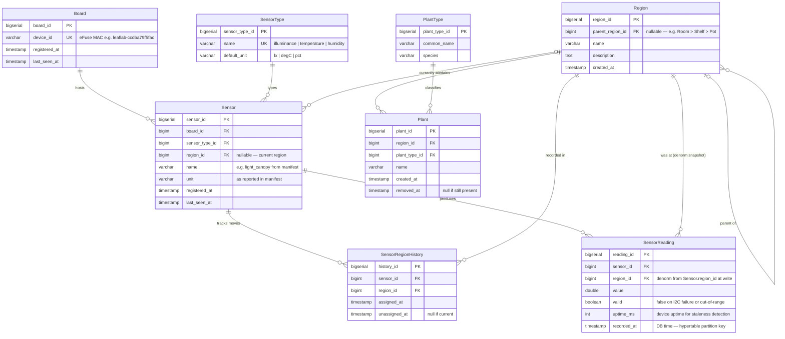

# LeafLab

Plant and environment monitoring firmware and data pipeline.

LeafLab devices read sensors (light, temperature, soil moisture, etc.), publish readings to MQTT, and feed a cloud processing pipeline. Each device is a small ESP32 board running firmware built in this monorepo.

---

## Projects

| Directory | Description |
|-----------|-------------|
| `sensorboard/` | ESP32 firmware that reads sensors via I2C and publishes via MQTT |
| `processor/` | Go service that consumes MQTT messages from RabbitMQ and writes to the database |
| `migrate/` | Database migration runner (TimescaleDB) |

---

## Quick Start

```bash
# Build sensorboard firmware
bazel build //leaflab/sensorboard:sensorboard_bin --config=esp32

# Flash to a connected ESP32 over USB
bazel run //leaflab/sensorboard:flash -- /dev/ttyUSB0

# Monitor serial output
screen /dev/ttyUSB0 115200
```

Expected output:
```
INF  Sensor ready: light @ 0x23
INF  light: 142.5
INF  light: 141.8
```

See [`sensorboard/README.md`](sensorboard/README.md) for full build, flash, and extension instructions.

---

## Architecture Overview

```
Physical sensor (BH1750, etc.)
    ↓ I2C
ESP32 (leaflab/sensorboard firmware)
    ↓ MQTT over Wi-Fi
RabbitMQ (MQTT plugin, amq.topic exchange)
    ↓ AMQP
leaflab/processor (Go)
    ↓
TimescaleDB (PostgreSQL + timescaledb extension)
    ↓
Dashboards / analytics
```

The sensor firmware layer is fully unit-tested on the host — no hardware required for most development work. See [`ARCHITECTURE.md`](ARCHITECTURE.md) for the full design.

---

## Database Schema



Key design decisions:
- `Sensor.region_id` is nullable — a board can register before being placed anywhere
- `SensorRegionHistory` records every region assignment with open/closed intervals; `unassigned_at = NULL` means current
- `SensorReading.region_id` is snapshotted at insert so historical location is preserved when sensors move
- `SensorReading.valid` — `false` on I2C failure or out-of-range value; rows are always written so gaps in the time series are explicit rather than invisible
- `SensorReading.recorded_at` is DB-side `NOW()`, not device clock; `uptime_ms` carries the device timestamp
- `Region.parent_region_id` is self-referential and nullable — supports flat or hierarchical layouts (Room → Shelf → Pot)
- `Plant.removed_at = NULL` means still present; set on removal rather than hard-deleting
- `Board` and `Sensor` self-register via device manifests published on connect

---

## Relationship to `//firmware`

LeafLab firmware is built on top of the board-agnostic libraries in [`firmware/`](../firmware/README.md):

- `firmware/sensor` — `ISensor` interface, `SensorReading`, `BH1750Sensor`, thermistor
- `firmware/i2c` — `II2CBus`, `ArduinoI2CBus`, `FakeI2CBus`
- `firmware/mqtt` — `MQTTWriter` sensor aggregator
- `firmware/network` — Wi-Fi + MQTT state machine

LeafLab board configs (`elegoo_config.cc`) wire together these libraries with concrete hardware addresses and pin assignments. The libraries themselves have no LeafLab-specific knowledge.
