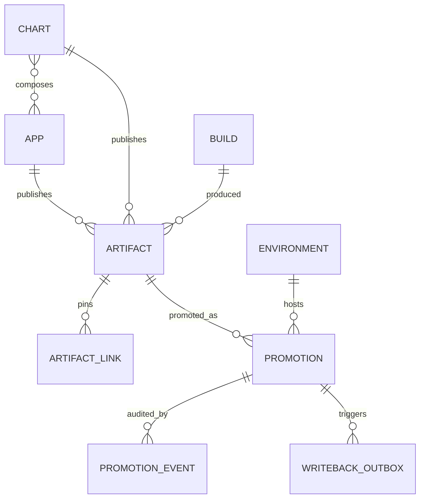
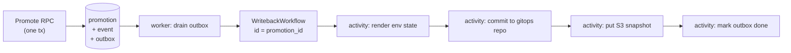

# App Registry — Architecture

Design record for `//tools/app_registry`. Read [README.md](README.md) first for
what the system is and the end-to-end flows.

## Design principles

1. **Manifests stay authoritative.** The registry never invents app metadata.
   It ingests `release_app` manifests via `bazel query` and reconciles. If the
   registry and the manifests disagree, the manifests win.
2. **Digests are identity; tags are labels.** Every artifact is stored by
   `sha256:` digest. Semver tags are recorded for humans and can move.
3. **The API is the write path; git is the delivery path.** Deployment tooling
   reads state from the gitops repo (or an S3 snapshot), never synchronously
   from the API. The registry being down must not block a deploy.
4. **Additive before authoritative.** The registry observes releases for a full
   phase before it is allowed to allocate versions. Git tags remain a redundant
   record permanently — they cost nothing and are the disaster-recovery path.
5. **Record, don't act.** The registry mutates rows and emits writeback intents.
   It never touches a cluster.

## Shared manifest schema

The registry does **not** define its own app-manifest shape. `AppManifest`,
`ChartManifest`, `AppManifestSet` and `DeployUnit` live in
[`//tools/appmeta/proto`](../appmeta/README.md), the schema of record for the
JSON that `app_metadata` and `helm_chart_metadata` emit.

This matters because two Go structs already decode that JSON — one in
`release_helper_go`, one in `tools/helm/composer.go` — and they had drifted from
each other and from the Starlark rule. The registry would have been a third.
Instead it consumes the shared contract, so `ReconcileApps` takes an
`AppManifestSet` verbatim and adding a field to `release_app` propagates
everywhere with no per-consumer edit.

Dependency direction is load-bearing: `appmeta` depends on nothing, and the
schema must not live under `app_registry`, or `tools/helm` would depend on the
registry in order to build a chart.

Drift is prevented by the contract test described in the appmeta README, not by
the shared type alone — `protojson` decoding with `DiscardUnknown: false` turns
any unmodelled Starlark output key into a test failure.

## Data model



### Tables

| Table | Shape | Notes |
|---|---|---|
| `app` | mutable, reconciled | `(domain, name)` unique. `status` ∈ active/missing/archived. Never hard-deleted. |
| `chart` | mutable, reconciled | `(domain, name)` unique. |
| `chart_app` | join | Which apps a chart composes, per its manifest. |
| `build` | append-only | `(workflow_run_id, workflow_attempt)` unique. |
| `artifact` | append-only | `digest` globally unique. `(owner, kind, version)` unique. |
| `artifact_link` | append-only | Chart artifact → pinned image artifact. |
| `environment` | mutable | `key` unique. `rank` orders promotion legality. |
| `promotion` | **SCD2** | `valid_from` / `valid_to`. Partial unique index on current rows. |
| `promotion_event` | append-only | Who, why, when, and the Temporal workflow id. |
| `writeback_outbox` | append-only + claimed | Transactional outbox, drained by the worker. |
| `idempotency_key` | append-only | Key → prior response, for safe CI retries. |

### SCD2 on `promotion`

Follows the repo-wide convention in `AGENTS.md` exactly:

```sql
-- write path: close and open, in one transaction
UPDATE promotion SET valid_to = NOW()
 WHERE environment_id = $1 AND target_key = $2 AND valid_to IS NULL;
INSERT INTO promotion (environment_id, target_key, artifact_id, ...)
VALUES ($1, $2, $3, ...);
```

```sql
-- current state
SELECT * FROM promotion
 WHERE environment_id = $1 AND valid_to IS NULL;

-- state at time T (the incident query)
SELECT * FROM promotion
 WHERE environment_id = $1
   AND valid_from <= $t
   AND (valid_to IS NULL OR valid_to > $t);
```

Backed by `CREATE UNIQUE INDEX ON promotion(environment_id, target_key) WHERE
valid_to IS NULL` — this both accelerates the hot query and makes
double-promotion structurally impossible.

`target_key` is the promoted thing's identity (`<kind>:<owner_full_name>`),
denormalized so the partial unique index is expressible without a nullable
two-column target.

A `v_current_promotion` view pre-joins promotion → artifact → app/chart → build
so the CLI, the writeback worker, and any future UI never re-derive the join.

## Promotability

The rule the whole system hangs on. Each app declares its `deploy_unit` in its
`release_app` manifest; the registry derives artifact promotability from it.

| App `deploy_unit` | Image artifacts | Chart artifacts |
|---|---|---|
| `chart` | `VIA_CHART` | `PROMOTABLE` |
| `image` | `PROMOTABLE` | n/a |
| `none` | `NOT_PROMOTABLE` | n/a |

**Override.** Promoting a `VIA_CHART` image directly is rejected unless the
caller passes `allow_override`. When allowed, the promotion is stored with
`is_override = true` and `GetEnvironmentState` reports it as a `DriftEntry`
against the chart's pinned digest. This makes the manmanv2-host-manager style
of hotfix possible without making it invisible.

**Why this is on the app, not the artifact:** it is a property of how the app is
deployed, which is declarative and belongs next to the code — the same place
`app_type` and `port` already live. The registry reads it; it does not own it.

### Required change to `release_app`

`tools/bazel/release.bzl` gains a `deploy_unit` attribute (default `"chart"`),
mirrored by `DeployUnit` in `//tools/appmeta/proto`. This is one of three
changes that touch existing code paths rather than being purely additive —
the others being the chart lockfile below and the manifest-schema
consolidation.

## Chart → image lockfile

`tools/helm/composer.go` already resolves the exact image tags it bakes into a
chart. It must additionally resolve them to **digests** and emit a lockfile that
CI forwards to `RecordArtifact(kind = CHART, contains = [...])`.

Without this, chart promotion cannot answer "which image digest is running",
and the incident query degrades to rendering charts by hand. This is the
highest-value part of the recording phase and should not be deferred.

The server rejects a chart artifact that references an image digest it has never
recorded — a chart may not pin an unknown artifact.

## Writeback: outbox → Temporal

Promotion and the intent to write it back **must** commit atomically. If they
don't, the registry can believe prod is on v1.4.0 while the gitops repo still
says v1.3.0, which is the exact failure mode this system exists to prevent.

Since Temporal cannot enlist in a Postgres transaction, the server writes a
`writeback_outbox` row inside the promotion transaction. The worker drains the
outbox and starts a `WritebackWorkflow` with the promotion id as its workflow
id, so Temporal's own dedup makes redelivery harmless.



Activities are individually retryable and idempotent. The gitops commit uses
`state_hash` from `GetEnvironmentState` to skip no-op commits, and retries on
push conflict by re-reading state — last writer wins on a per-environment file,
which is correct because the registry is the source of truth for that file.

**Temporal is not yet a Go dependency in this repo.** `friendly_computing_machine`
uses the Python SDK only. `go.temporal.io/sdk` needs adding to `go.mod` and
`MODULE.bazel`, and a `libs/go/temporal` helper package (client construction,
env config, worker bootstrap, logging bridge to `libs/go/logging`) needs to
exist. This is real scope — see AR-1 in [PLAN.md](PLAN.md).

## Authorization

Enforced with `libs/go/grpcauth` (OIDC), split along the service boundary:

| Role | Services | Credential |
|---|---|---|
| `builder` | `AppRegistry` (writes), `ArtifactRegistry` (writes) | GitHub Actions OIDC, unrestricted workflows |
| `promoter` | `PromotionRegistry` (writes) | **Environment-scoped** GitHub OIDC subject, or a human's token |
| `admin` | `EnvironmentRegistry`, `SetAppStatus` | Human only |
| reader | all reads | Any authenticated principal |

**The critical constraint:** the credential every build job already holds must
not be able to promote. Promotion workflows use a GitHub Environment-scoped OIDC
subject so the `builder` token cannot self-promote. Per-environment
`allowed_principals` narrows this further for prod.

`reason` is required on promotions to any environment above rank 0.

## Idempotency

Every write RPC takes a required `idempotency_key`. The server stores key →
serialized response; a repeat returns the original response with an
`already_*` flag rather than re-executing. CI reruns and Temporal activity
retries are therefore safe by construction.

Convention: `<workflow_run_id>-<attempt>[-<owner>-<kind>]` for CI; a
client-generated UUID for human promotions.

## Availability and bootstrap

The registry is itself a `release_app` in this monorepo, so it deploys itself.
That circularity is only safe because **nothing in the deploy path calls the
API synchronously**:

- ArgoCD reads the gitops repo, which the worker writes.
- The S3 snapshot is an auth-free read path for tooling that has no gRPC client.
- CI recording is best-effort: a registry outage warns, it does not fail a
  release.

The registry can be down for hours without blocking a release or a deploy. The
only thing lost is the ability to *make new promotions* during the outage.

## Rejected alternatives

| Decision | Chosen | Rejected | Why |
|---|---|---|---|
| Async durability | Temporal + outbox | River | River was a trial and is being retired repo-wide. |
| Async durability | Temporal + outbox | RabbitMQ | Cannot enlist in the promotion transaction; would need an outbox anyway, so the outbox is the real mechanism and Temporal is the better executor for a multi-step, retryable git push. |
| Transport | gRPC + thin Go CLI | grpc-gateway / connect-go | Every CI caller in this repo is already `bazel run` on a Go CLI. A gateway is pure complexity until a browser UI exists. |
| Environments | table rows | proto enum | Ephemeral and regional environments become an insert, not a release. |
| Bundling | chart pins image digests | registry-side "release bundle" | Charts already are the bundle. Inventing a parallel grouping would duplicate what `tools/helm` composes. |
| Missing apps | flag `MISSING` for triage | auto-archive | A rename would silently orphan promotion history. |
| Version source of truth | registry (AR-5), tags retained | tags only | A unique constraint beats `git tag --sort` plus a CI concurrency group for concurrent allocation. |
| Manifest schema | shared `//tools/appmeta/proto` | registry-local manifest messages | Two hand-written Go structs already decode the manifest JSON and had drifted; a third would compound it. |
| Manifest schema | proto + `protojson` | shared hand-written Go struct | `protojson` reads the existing snake_case JSON unchanged, and `DiscardUnknown: false` turns drift into a test failure. |

## Future: approval gate

Deliberately unimplemented, but the schema accommodates it without migration:

- `environment.requires_approval` already exists.
- `PromotionState.PENDING_APPROVAL` already exists.
- `PromotionAction.APPROVE` / `REJECT` already exist.

When built, `Promote` against a gated environment writes a promotion in
`PENDING_APPROVAL` with no outbox row; a later `Approve` transitions it to
`ACTIVE` and enqueues the writeback. Rollback needs nothing new — it is a
`Promote` to the artifact that SCD2 history already identifies as previous.

## Open questions

1. **Chart identity source.** `tools/helm` composes charts from Bazel targets;
   the exact query for enumerating charts and their member apps needs pinning
   down before AR-1.
2. **Gitops repo target.** Which repo/branch the worker commits to, and whether
   per-environment files or one file per app. Blocks AR-3.
3. **Migration of existing state.** Backfilling historical artifacts from git
   tags and GHCR is optional. Recommendation: don't. Start recording from AR-2
   forward and let history accumulate.
