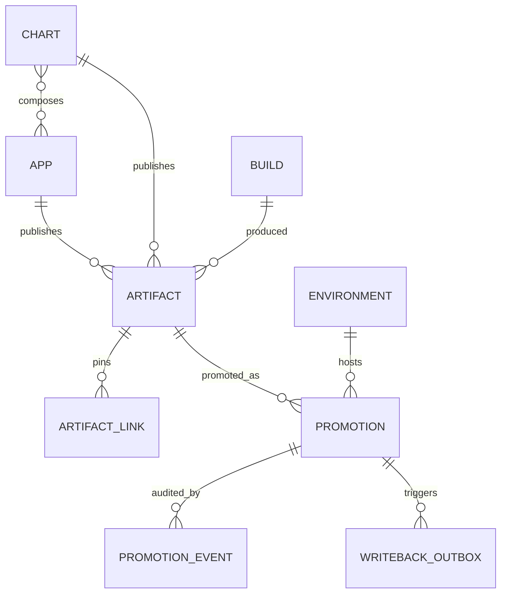
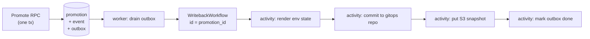

# App Registry — Architecture

Design record for `//tools/app_registry`. Read [README.md](README.md) first for
what the system is and the end-to-end flows.

## Design principles

1. **Manifests stay authoritative.** The registry never invents app metadata.
   It ingests `release_app` manifests via `bazel query` and reconciles. If the
   registry and the manifests disagree, the manifests win.
2. **Digests are identity; tags are labels.** Every artifact is stored by
   `sha256:` digest. Semver tags are recorded for humans and can move.
3. **The API is the write path; git is the delivery path.** Deployment tooling
   reads state from the gitops repo (or an S3 snapshot), never synchronously
   from the API. The registry being down must not block a deploy.
4. **Additive before authoritative.** The registry observes releases for a full
   phase before it is allowed to allocate versions. Git tags remain a redundant
   record permanently — they cost nothing and are the disaster-recovery path.
5. **Record, don't act.** The registry mutates rows and emits writeback intents.
   It never touches a cluster.

## Shared manifest schema

The registry does **not** define its own app-manifest shape. `AppManifest`,
`ChartManifest`, `AppManifestSet` and `DeployUnit` live in
[`//tools/appmeta/proto`](../appmeta/README.md), the schema of record for the
JSON that `app_metadata` and `helm_chart_metadata` emit.

This matters because two Go structs already decode that JSON — one in
`release_helper_go`, one in `tools/helm/composer.go` — and they had drifted from
each other and from the Starlark rule. The registry would have been a third.
Instead it consumes the shared contract, so `ReconcileApps` takes an
`AppManifestSet` verbatim and adding a field to `release_app` propagates
everywhere with no per-consumer edit.

Dependency direction is load-bearing: `appmeta` depends on nothing, and the
schema must not live under `app_registry`, or `tools/helm` would depend on the
registry in order to build a chart.

Drift is prevented by the contract test described in the appmeta README, not by
the shared type alone — `protojson` decoding with `DiscardUnknown: false` turns
any unmodelled Starlark output key into a test failure.

## Data model



### Tables

| Table | Shape | Notes |
|---|---|---|
| `app` | mutable, reconciled | `(domain, name)` unique. `status` ∈ active/missing/archived. Never hard-deleted. |
| `chart` | mutable, reconciled | `(domain, name)` unique. |
| `chart_app` | join | Which apps a chart composes, per its manifest. |
| `build` | append-only | `(workflow_run_id, workflow_attempt)` unique. |
| `artifact` | append-only | `digest` globally unique. `(owner, kind, version)` unique. `version_major/minor/patch` (AR-5a) back numeric ordering — see "Version model" below. |
| `artifact_link` | append-only | Chart artifact → pinned image artifact. |
| `environment` | mutable | `key` unique. `rank` orders promotion legality. |
| `promotion` | **SCD2** | `valid_from` / `valid_to`. Partial unique index on current rows. |
| `promotion_event` | append-only | Who, why, when, and the Temporal workflow id. |
| `writeback_outbox` | append-only + claimed | Transactional outbox, drained by the worker. |
| `idempotency_key` | append-only | Key → prior response, for safe CI retries. |
| `version_allocation` | append-only | AR-5a. `AllocateVersion`'s reservation ledger — see "Version model" below. |
| `domain_adoption` | mutable | One row per domain; `stage` ∈ observe/promote/allocate. See "Resolved questions" #3. |
| `reconcile_watermark` | singleton, mutable | Migration 006 (issue #545). Exactly one row (`id = 1`), seeded as a sentinel. Guards `Reconcile` against a stale (older-commit) call — see "Reconcile watermark" below. |

### SCD2 on `promotion`

Follows the repo-wide convention in `AGENTS.md` exactly:

```sql
-- write path: close and open, in one transaction
UPDATE promotion SET valid_to = NOW()
 WHERE environment_id = $1 AND target_key = $2 AND valid_to IS NULL;
INSERT INTO promotion (environment_id, target_key, artifact_id, ...)
VALUES ($1, $2, $3, ...);
```

```sql
-- current state
SELECT * FROM promotion
 WHERE environment_id = $1 AND valid_to IS NULL;

-- state at time T (the incident query)
SELECT * FROM promotion
 WHERE environment_id = $1
   AND valid_from <= $t
   AND (valid_to IS NULL OR valid_to > $t);
```

Backed by `CREATE UNIQUE INDEX ON promotion(environment_id, target_key) WHERE
valid_to IS NULL` — this both accelerates the hot query and makes
double-promotion structurally impossible.

`target_key` is the promoted thing's identity (`<kind>:<owner_full_name>`),
denormalized so the partial unique index is expressible without a nullable
two-column target.

A `v_current_promotion` view pre-joins promotion → artifact → app/chart → build
so the CLI, the writeback worker, and any future UI never re-derive the join.

## Version model (AR-5a)

Full rationale lives in PLAN.md's AR-5 "Addendum — semver semantics
(decided)" — this section is the as-built summary. **AR-5a ships this
schema and RPC fully working but wired to nothing**: no domain is at
adoption stage `allocate`, and `tools/release_helper_go/cmd/plan.go`'s
git-tag path (`autoIncrementVersion`) is untouched. See "AR-5" in PLAN.md
for what remains before any domain can be cut over for real.

**Parsing is shared, not duplicated.** `libs/go/semver` is the one semver
parser/incrementer/comparator this repo's release tooling uses —
`release_helper_go`'s `incrementVersion` and this package's `AllocateVersion`
both call it, rather than each keeping its own regex. It lives in `libs/go`
(not under either caller) for the same reason `//tools/appmeta/proto` lives
outside the registry: neither side should depend on the other to get parsing
right.

**Numeric ordering, not lexical.** `artifact.version` is `TEXT`; lexical
`ORDER BY` on it is wrong — `"v1.9.0" > "v1.10.0"` as strings. Migration 004
adds `version_major`/`version_minor`/`version_patch` (`INT NOT NULL`,
populated from the same parse at record/allocate time) plus an index
ordering by that triple. `UNIQUE (owner_id, kind, version)` stays on the TEXT
column as the collision guard; the integer columns are for ordering only. A
version that fails to parse (a real, if rare, historical condition — see
migration 004's comments) backfills to the `0/0/0` sentinel, which sorts
before every real release rather than blocking the migration or winning a
"latest" query it shouldn't.

**`AllocateVersion` writes to `version_allocation`, not `artifact`.**
`AllocateVersionRequest` carries no digest or build id (allocation happens
*before* a build exists — see `protos/api_messages_artifact.proto`), and
`artifact` requires both `NOT NULL`. `version_allocation` is a lightweight
table with the same `(owner_id, kind, version)` unique-index shape, so a
transactional `INSERT` against it is what makes concurrent `AllocateVersion`
calls for the same owner structurally unable to collide — the unique
constraint does the work, not application-level locking. "Next version" is
computed as the max across **both** `artifact` (already-published) and
`version_allocation` (reserved but not yet recorded), so a version reserved
a moment ago by a concurrent caller is never handed out twice even though
`RecordArtifact` hasn't run for it yet. A unique-violation aborts the whole
transaction (see "Idempotency" and the transaction-abort hazard noted
throughout this doc); the caller (`handlers.ArtifactServer.AllocateVersion`)
retries in a **fresh** transaction, recomputing "next" against the
now-committed state.

**Prereleases and build metadata are rejected, not mis-sorted.**
`AllocateVersion` calls `semver.ParseRelease`, which rejects a
`-prerelease`/`+build` suffix outright — real semver orders a prerelease
*before* its release, which nothing here implements, so half-accepting one
would sort it wrongly. **Extension point:** a later `version_prerelease TEXT`
column can be added to `artifact` without changing the `(owner_id, kind,
version)` constraint or the integer triple; the ordering index would gain a
trailing term. Do not add it speculatively — it lands with the change that
actually needs prerelease ordering.

**Per-domain cutover gate.** `AllocateVersion` rejects any domain not at
`domain_adoption.stage = 'allocate'` (see "Resolved questions" #3) with
`FailedPrecondition`. `domain_adoption` ships from AR-1's migration with a
row-per-domain-on-cutover shape (no row = implicit `observe`); AR-5a adds no
mechanism to move a domain to `allocate` — that is deliberately still a
direct `UPDATE domain_adoption` (or a future admin RPC/CLI command, not yet
built), so the first real cutover is a reviewable, explicit action.

## Reconcile watermark (issue #545)

`Reconcile` performs a FULL replace on every call (see "Design principles"
#1 and `ReconcileAppsRequest`'s own doc comment): every app/chart is
upserted `ACTIVE`, anything absent is flagged `MISSING`, unconditionally. As
of #543 it runs from `ci.yml` on every push to `main`, with only a same-group
CI concurrency cancel (#546) as a mitigation — which does not cover a
manually re-run older workflow (fresh queue timing, not the original push's
chronological position) or an in-flight RPC that outran a cancellation. An
older call landing after a newer one would silently revert registry state
(e.g. re-marking `ACTIVE` an app a newer commit correctly flagged `MISSING`)
with no error and no way to detect it after the fact.

**The guard: a singleton watermark, checked and advanced inside the same
transaction as the write.** Migration 006 adds `reconcile_watermark`, one
row recording the most recently *applied* call's ordering metadata.
`Reconcile` reads it with `SELECT ... FOR UPDATE` (so two concurrent calls
serialize instead of both reading the same stale watermark), decides
apply-or-skip, and — only on apply — writes the app/chart diff and advances
the watermark, all in one transaction (the non-dry-run path already runs
inside `runIdempotent`'s `WithTx`). The comparison/tie-break logic itself
lives once, in Go (`repository.ShouldApplyReconcile`), shared by the
postgres and fake implementations exactly like `DerivePromotability` is —
not duplicated as SQL in one place and Go in the other.

**Ordering key: `source_committed_at`, not `discovered_at`.**
`AppManifestSet.discovered_at` (`appmeta.proto`) is the Unix time
`release_helper_go` ran its `bazel query` sweep — sweep time, not the swept
commit's position in history. A manually re-run older workflow sweeps at
re-run time, so `discovered_at` is **not monotonic in commit order** and is
unsafe to use alone: it is exactly the "re-run an old workflow" case this
watermark exists to guard against, and a naive `discovered_at`-only
watermark would sail straight past it. `source_committed_at` (added
alongside this migration) is the git committer timestamp of `git_sha`
instead — `release_helper_go`'s `manifest-set` command resolves it via `git
log -1 --format=%ct <git_sha>` — which *is* monotonic with history for any
commit reachable from `main`. `discovered_at` is kept as a comparison
fallback for exactly one reason: backward compatibility with an
`AppManifestSet` produced by a `release_helper_go` binary that predates this
field (e.g. still cached on a CI runner mid-rollout of this change), which
carries `source_committed_at = 0`. `git log` resolution failing (git
unavailable, sha unresolvable in a shallow clone) also leaves it `0` rather
than failing the `manifest-set` command — losing the stronger ordering
guarantee for one call beats breaking manifest discovery entirely.

**Tie-breaking rules** (`ShouldApplyReconcile`, evaluated in this order):

1. No watermark yet (table's sentinel row, `git_sha = ''`): apply. The very
   first reconcile is always accepted.
2. `incoming.git_sha == current.git_sha`: apply, unconditionally, regardless
   of how the timestamps compare. The identical commit reconciled twice
   (a manual re-run of the same workflow run, or the CLI pointed at the
   same manifest set again with a fresh idempotency key) is harmless to
   re-apply — idempotency already covers true RPC-level replays; this
   covers the same commit arriving via two *different* calls — and clock
   skew between two sweeps of the same commit must never produce a
   false-stale rejection.
3. Incoming's ordering key (`source_committed_at`, falling back to
   `discovered_at`) strictly older than current's: **skip** (stale).
4. Otherwise (incoming's key is ≥ current's, and `git_sha` differs):
   **apply**. The equal-timestamp case is deliberate: two different commits
   landing in the same wall-clock second (or two manifest sets both falling
   back to `discovered_at`) must not block a legitimate merge just because
   they tied.

**A skipped-stale call is a no-op SUCCESS, not an error.** A CI re-run of an
older commit is doing the *right* thing by declining to revert newer state;
turning that workflow red would be exactly backwards. But a silent no-op is
the failure mode this feature exists to eliminate, so
`ReconcileAppsResponse` carries `skipped_stale` and
`current_watermark_git_sha`, the handler logs at `Warn` when it happens (see
`server/handlers/app.go`'s `ReconcileApps`), and the CLI prints a stderr
banner (mirroring `promote.go`'s already-promoted/dry-run banners) so it is
visible in a CI log even if nobody inspects the JSON response.

**Idempotency-key interaction.** A skipped-stale response IS stored under
the request's `idempotency_key`, same as any other successful response —
deliberately, not an oversight: a retry with the *same* key must replay the
*same* answer. If the skip weren't stored and the watermark happened to
change before a retry (e.g. a legitimately newer commit's reconcile lands
between the two calls), a replay could flip from "skipped" to "applied" for
what the caller believes is the same request — silently reordering writes
relative to what actually happened on the wire. Storing it keeps
`runIdempotent`'s guarantee ("repeated calls with the same key are a no-op
returning the original result") true here too.

**Dry run never touches the watermark**, in either direction: it neither
reads it to decide skip-or-apply, nor advances it on completion. Dry run
already writes nothing (see `ReconcileAppsRequest.dry_run`'s doc comment);
consulting a mutation guard for a call that cannot mutate would just be
extra Postgres round trips answering a question nobody asked.

**Why a singleton table, not a per-app/per-row watermark.** `Reconcile` is
always a full-replace of the complete manifest set, so there is exactly one
meaningful "most recent complete sweep" to compare against — one global
watermark suffices. A per-row watermark would have to answer an unasked
question ("was THIS app's row from a newer sweep than THAT app's row"),
which cannot happen under a full-replace write model.

**Why the watermark table is seeded with a sentinel row, not left empty.**
Postgres's `SELECT ... FOR UPDATE` locks only rows it *matches* — against a
genuinely empty table it locks nothing, so two concurrent "first ever
reconcile" transactions would both read "no watermark," both proceed to
apply, and only accidentally serialize at the final write. Migration 006
seeds exactly one row (`git_sha = ''`, timestamps `0`) so the locking read
always has something to hold from the very first call onward. This sentinel
is what "no watermark yet" means operationally — see migration 006's
comments and `ShouldApplyReconcile`'s doc comment; it is invisible above the
repository interface, which only ever exposes "is there a watermark or
not."

## Promotability

The rule the whole system hangs on. Each app declares its `deploy_unit` in its
`release_app` manifest; the registry derives artifact promotability from it.

| App `deploy_unit` | Image artifacts | Chart artifacts |
|---|---|---|
| `chart` | `VIA_CHART` | `PROMOTABLE` |
| `image` | `PROMOTABLE` | n/a |
| `none` | `NOT_PROMOTABLE` | n/a |

**Override.** Promoting a `VIA_CHART` image directly is rejected unless the
caller passes `allow_override`. When allowed, the promotion is stored with
`is_override = true` and `GetEnvironmentState` reports it as a `DriftEntry`
against the chart's pinned digest. This makes the manmanv2-host-manager style
of hotfix possible without making it invisible.

**Why this is on the app, not the artifact:** it is a property of how the app is
deployed, which is declarative and belongs next to the code — the same place
`app_type` and `port` already live. The registry reads it; it does not own it.

### Required change to `release_app`

`tools/bazel/release.bzl` gains a `deploy_unit` attribute (default `"chart"`),
mirrored by `DeployUnit` in `//tools/appmeta/proto`. This is one of three
changes that touch existing code paths rather than being purely additive —
the others being the chart lockfile below and the manifest-schema
consolidation.

## Chart → image lockfile

Resolving a chart's pinned images to **digests** requires a container registry
call. A Bazel action must never make that call — it would break hermeticity
and make chart output non-reproducible, undoing #dd23e807 (which specifically
made chart builds deterministic). So this is two steps, split across two
different environments, not one:

1. **Compose time (hermetic, no network).** `tools/helm/composer.go` already
   resolves the exact image repository and tag it bakes into a chart's
   `values.yaml`. As of AR-2b it additionally writes those same references —
   full app name, repository, and tag — to `image-lockfile.json` alongside
   `Chart.yaml` inside the generated chart. This is a pure function of the
   `AppManifest`s the composer already reads: no digests, no registry access,
   sorted for deterministic output. `tools/release_helper_go`'s
   `read-chart-lockfile <chart-name>` command builds a chart and reads this
   file back out, giving the release path a stable way to get at it without
   re-deriving anything from the manifests.
2. **Publish time (has registry access; implemented in AR-2c).** After
   `release-helm-charts`'s `needs: [plan-release, release, ...]` has pushed
   every image, a CI step resolves each lockfile entry's repository+tag to a
   digest and forwards the result to `RecordArtifact(kind = CHART, contains =
   [...])`.

Without step 2, chart promotion cannot answer "which image digest is
running," and the incident query degrades to rendering charts by hand. This is
the highest-value part of the recording phase and should not be deferred.

The server rejects a chart artifact that references an image digest it has never
recorded — a chart may not pin an unknown artifact.

## Writeback: outbox → Temporal

Promotion and the intent to write it back **must** commit atomically. If they
don't, the registry can believe prod is on v1.4.0 while the gitops repo still
says v1.3.0, which is the exact failure mode this system exists to prevent.

Since Temporal cannot enlist in a Postgres transaction, the server writes a
`writeback_outbox` row inside the promotion transaction. The worker drains the
outbox and starts a `WritebackWorkflow` with the promotion id as its workflow
id, so Temporal's own dedup makes redelivery harmless.



Activities are individually retryable and idempotent. The (future) gitops
commit activity is expected to use `state_hash` from `GetEnvironmentState`
to skip no-op commits, and retry on push conflict by re-reading state — last
writer wins on a per-environment file, which is correct because the
registry is the source of truth for that file.

**As of AR-4b, the diagram above is built through "activity: render env
state" only** — the render and publish steps exist, the gitops commit and S3
put do not (see PLAN.md's AR-4b "Explicitly not in scope"). Concretely:

- `server/handlers/promotion.go`'s `enqueueWriteback` writes the
  `writeback_outbox` row inside the exact same transaction as the SCD2
  close-and-open write and the `promotion_event` insert (extending AR-3c's
  transaction, not opening a second one), with `state_hash` computed via the
  same `stateHash` function `GetEnvironmentState` uses, over a fresh
  `StateAt` read taken inside that transaction — so the value on the outbox
  row is guaranteed consistent with what a `GetEnvironmentState` call
  returns immediately after commit.
- `tools/app_registry/worker` (`app-registry-worker`) is a long-running
  process (not a job) that both polls `writeback_outbox` directly against
  Postgres (`outbox.Drainer`, using an atomic
  `UPDATE ... WHERE outbox_id IN (SELECT ... FOR UPDATE SKIP LOCKED)` claim
  query) and runs a `go.temporal.io/sdk/worker.Worker` listening on task
  queue `app-registry-writeback`.
- `WritebackWorkflow` (`worker/writeback/workflow.go`), workflow id =
  promotion id, calls exactly two activities behind the `Writeback`
  interface: `RenderEnvironmentState` (reads `GetEnvironmentState` via the
  gRPC API — never Postgres directly, keeping with "the API is the write
  path" above) then `Publish`. AR-4b ships `StubActivities`
  (`worker/writeback/stub.go`): `Publish` writes the rendered JSON to a
  local path (`WRITEBACK_OUTPUT_DIR`) and skips the write when a sidecar
  file shows the state_hash already matches — the no-op detection a real
  gitops-committer `Publish` implementation inherits by satisfying the same
  `Writeback` interface. See `worker/README.md` for the full mechanism and
  how "killed mid-run" was verified.
- A row claimed by a worker that then dies is recovered by the *next*
  worker's `ClaimBatch` once the claim exceeds `WRITEBACK_CLAIM_STALE_AFTER`
  — Temporal's own workflow-id collision handling (an in-flight execution
  with that id either rejects a second `ExecuteWorkflow` call with
  `WorkflowExecutionAlreadyStarted`, or transparently attaches to it) is
  what makes retrying the claim safe rather than merely eventually
  consistent.

`go.temporal.io/sdk` (and, as of AR-4b, `go.temporal.io/api` directly, for
`serviceerror.WorkflowExecutionAlreadyStarted`) are Go dependencies added in
`go.mod`/`MODULE.bazel`; `libs/go/temporal` (client construction, env
config, worker bootstrap, logging bridge to `libs/go/logging`) shipped in
AR-4a — see [PLAN.md](PLAN.md).

## Authorization

Enforced with `libs/go/grpcauth` (Keycloak-issued OIDC service accounts, per
[`KEYCLOAK.md`](../../libs/go/grpcauth/KEYCLOAK.md)), split along the service
boundary. Role names are realm roles in Keycloak, service-prefixed, enforced
in `server/auth`:

| Role | Services | Credential |
|---|---|---|
| `app-registry-builder` | `AppRegistry` (writes), `ArtifactRegistry` (writes) | Keycloak service account, CI/all workflows |
| `app-registry-promoter-dev` | `PromotionRegistry` (writes), `dev` only | Keycloak service account scoped to the `dev` GitHub Environment; humans |
| `app-registry-promoter-stage` | `PromotionRegistry` (writes), `stage` only | Keycloak service account scoped to the `stage` GitHub Environment; humans |
| `app-registry-promoter-prod` | `PromotionRegistry` (writes), `prod` only | Keycloak service account scoped to the `prod` GitHub Environment; a small human group |
| `app-registry-admin` | `EnvironmentRegistry`, `SetAppStatus` | Human only |
| reader | all reads | Any authenticated principal |

Roles are flat and explicit — `app-registry-admin` does not imply
`app-registry-builder` or any promoter role, and a promoter role for one
environment does not imply another. A principal must hold literally every
role a call requires; see `server/auth.Require`'s doc comment.

**The critical constraint:** the credential every build job already holds must
not be able to promote. Each identity is a *different Keycloak client*, so the
builder token simply does not carry a promoter role — no matter what a
compromised build job does with the secret it holds. **Environment scoping
comes from GitHub, not Keycloak:** the `app-registry-promoter-prod` client
secret lives on the GitHub Environment named `prod`, so only a workflow job
declaring `environment: prod` can read it, and that declaration is what
triggers required reviewers. Per-environment `allowed_principals` narrows this
further.

`reason` is required on promotions to any environment above rank 0.

## Idempotency

Every write RPC takes a required `idempotency_key`. The server stores key →
serialized response; a repeat returns the original response with an
`already_*` flag rather than re-executing. CI reruns and Temporal activity
retries are therefore safe by construction.

Convention: `<workflow_run_id>-<attempt>[-<owner>-<kind>]` for CI; a
client-generated UUID for human promotions.

## Triage: the MISSING/ARCHIVED lifecycle

An app's `status` moves between three states, but only one edge is a human
decision:

- **active → missing**: automatic. `Reconcile` marks an app/chart `MISSING`
  whenever a full manifest set no longer contains it — see "Design
  principles" #1, manifests are authoritative.
- **missing → active** ("recovered"): automatic. If a manifest reappears in a
  later `Reconcile` call, the row goes straight back to `ACTIVE` with no human
  step. This is why `SetAppStatus` does not support `ACTIVE` as a target —
  there would be nothing for a human to do that `Reconcile` doesn't already
  do on the next run.
- **missing → archived**: the one human-triggered transition, via
  `SetAppStatus`. It means "this app is gone for good, stop flagging it as
  MISSING." `reason` is required.

`SetAppStatus` rejects every other transition with `FailedPrecondition` —
most notably `active → archived` (an app must go through `MISSING` first) and
any attempt to set `ACTIVE` directly. `archived → archived` is an idempotent
no-op success rather than an error, so a retried archive call is safe.

An earlier version of this RPC also allowed `SetAppStatus(ACTIVE)`, gated by
comparing an app's `last_seen_at` against the table-wide max to approximate
"was this app in the latest reconcile." That heuristic existed only to guard
a case Reconcile's recovered path already handles automatically, and was
fragile (a concurrent reconcile of an unrelated domain could shift the
table-wide max mid-check). It has been removed along with the ACTIVE target.

## Availability and bootstrap

The registry is itself a `release_app` in this monorepo, so it deploys itself.
That circularity is only safe because **nothing in the deploy path calls the
API synchronously**:

- ArgoCD reads the gitops repo, which the worker writes.
- The S3 snapshot is an auth-free read path for tooling that has no gRPC client.
- CI recording is best-effort: a registry outage warns, it does not fail a
  release.

The registry can be down for hours without blocking a release or a deploy. The
only thing lost is the ability to *make new promotions* during the outage.

### `APP_REGISTRY_CICD_OPT_IN` — the bootstrap kill switch

"Best-effort" is not enough on its own. The registry is built and released by
the very pipeline that would call it, so before it is deployed and its secrets
exist there is a genuine chicken-and-egg risk: **you must never be unable to
build the app because the app is not yet deployed.**

Every CI step that talks to the registry is therefore gated on a GitHub repo
variable:

```yaml
if: vars.APP_REGISTRY_CICD_OPT_IN == 'true'
```

- **Unset or anything other than `true` (the default): CI makes no registry
  calls at all.** The pipeline behaves exactly as it does today. This is the
  state the repo ships in and stays in until the registry is deployed and its
  credentials are configured.
- **`true`:** recording steps run, still `continue-on-error` so a registry
  outage warns rather than failing a release.

Two independent gates, easily confused — keep them distinct:

| Gate | Layer | Question it answers |
|---|---|---|
| `APP_REGISTRY_CICD_OPT_IN` | GitHub Actions | Does CI talk to the registry **at all**? |
| `domain_adoption.stage` | Registry server | For a given domain, what is the registry **authoritative for**? |

The first is a global bootstrap/kill switch owned by whoever administers the
repo; the second is the per-domain rollout described under
[Resolved questions](#resolved-questions). The opt-in must be `true` before any
domain's stage matters, and turning it off is the single-lever rollback for the
entire CI integration.

Applies from AR-2c (the first phase to add CI steps) onward, including AR-5's
`AllocateVersion` — version allocation must fall back to the tag-based path
when the opt-in is off, or a registry outage becomes a release outage.

## Rejected alternatives

| Decision | Chosen | Rejected | Why |
|---|---|---|---|
| Async durability | Temporal + outbox | River | River was a trial and is being retired repo-wide. |
| Async durability | Temporal + outbox | RabbitMQ | Cannot enlist in the promotion transaction; would need an outbox anyway, so the outbox is the real mechanism and Temporal is the better executor for a multi-step, retryable git push. |
| Transport | gRPC + thin Go CLI | grpc-gateway / connect-go | Every CI caller in this repo is already `bazel run` on a Go CLI. A gateway is pure complexity until a browser UI exists. |
| Environments | table rows | proto enum | Ephemeral and regional environments become an insert, not a release. |
| Bundling | chart pins image digests | registry-side "release bundle" | Charts already are the bundle. Inventing a parallel grouping would duplicate what `tools/helm` composes. |
| Missing apps | flag `MISSING` for triage | auto-archive | A rename would silently orphan promotion history. |
| Version source of truth | registry (AR-5), tags retained | tags only | A unique constraint beats `git tag --sort` plus a CI concurrency group for concurrent allocation. |
| Manifest schema | shared `//tools/appmeta/proto` | registry-local manifest messages | Two hand-written Go structs already decode the manifest JSON and had drifted; a third would compound it. |
| Manifest schema | proto + `protojson` | shared hand-written Go struct | `protojson` reads the existing snake_case JSON unchanged, and `DiscardUnknown: false` turns drift into a test failure. |
| App/chart registration | `ReconcileApps`, full manifest set, run on push to `main` | a scoped `RegisterApp`/upsert RPC tied to `release.yml`, sending only the apps in that run | Two write paths to the same rows with different invariants. `ReconcileApps` treats its input as the complete truth and flags anything absent as `MISSING` (`api.proto`'s own comment) — a scoped call would either need to skip that check (weakening triage) or would falsely flag every app not in the current release as `MISSING`. It's also unsafe to run at release time at all: `release.yml` can be dispatched against an arbitrary (possibly old) ref, and reconciling an old commit's manifest set would flag every app added since as `MISSING`. Running it on every push to `main` instead means it only ever sees the current, complete tree. See issue #539's follow-up (#542) and DEPLOY.md "CI wiring (AR-3d)". |
| Reconcile watermark ordering key | `source_committed_at` (git committer timestamp of `git_sha`), fallback to `discovered_at` | `discovered_at` alone | `discovered_at` is sweep time, not commit-history position — a manually re-run older workflow sweeps at re-run time, producing a *newer* `discovered_at` than the newer commit it's racing. That is precisely the headline case issue #545 exists to guard against, so a `discovered_at`-only watermark would not catch it. See "Reconcile watermark" above. |
| Stale reconcile call | no-op success (`skipped_stale = true`) | `FailedPrecondition` error | A CI re-run of an older commit is doing the *correct* thing by declining to overwrite newer state; failing that workflow run would punish correct behavior and train people to retry (or worse, force-apply) their way past a safety check. A visible response field plus a server-side `Warn` log gives the same "you should know this happened" property as an error without making the workflow red. |
| Reconcile watermark granularity | one singleton row for the whole registry | a watermark per app/chart row | `Reconcile` is always a full-replace of the complete manifest set (see "Design principles" #1) — there is exactly one meaningful "most recent complete sweep," so a per-row watermark would have to answer a question that cannot arise under this write model ("was this one row from a newer sweep than that one"). |

## Future: approval gate

Deliberately unimplemented, but the schema accommodates it without migration:

- `environment.requires_approval` already exists.
- `PromotionState.PENDING_APPROVAL` already exists.
- `PromotionAction.APPROVE` / `REJECT` already exist.

When built, `Promote` against a gated environment writes a promotion in
`PENDING_APPROVAL` with no outbox row; a later `Approve` transitions it to
`ACTIVE` and enqueues the writeback. Rollback needs nothing new — it is a
`Promote` to the artifact that SCD2 history already identifies as previous.

## Resolved questions

**1. Chart identity source — already solved, reuse it.**
`ListAllHelmCharts` in `tools/release_helper_go/cmd/plan_helm.go` mirrors
`ListAllApps` exactly: a loading-phase `bazel query` lists the metadata target
labels, then a `bazel cquery --output=starlark` scoped to those labels reads
the `HelmChartMetadataInfo` provider. Chart identity comes from that existing
path. No new discovery mechanism.

Note this changed in #444: discovery reads Starlark **providers**
(`AppMetadataInfo` / `HelmChartMetadataInfo`) rather than building each
target's `*_metadata.json`, so no actions run. The provider carries the same
dict the JSON file does — the cquery expression is literally
`json.encode(...metadata)` — so `//tools/appmeta/proto` remains the correct
schema for both delivery mechanisms, and the contract test gets cheaper
(analysis-only).

**2. Writeback is interface-only for now.**
Wiring the gitops repo requires changes in another repository that are out of
scope. AR-4 therefore delivers the *contract* — outbox, workflow, and a
`Writeback` activity interface — with a stub implementation that renders state
and writes it locally without publishing anywhere. The real gitops and S3
activities plug in behind that interface later with no schema or API change.

Consequence: nothing before AR-4 needs Temporal, so the `libs/go/temporal`
work moves out of AR-1 and into AR-4. That removes the largest unknown from
the foundations phase.

Consequence: until the real writeback lands, `GetEnvironmentState` is the only
way to consume promotion state. That is acceptable because no deploy tooling
depends on it yet — but it means the "registry can be down without blocking a
deploy" property is untested until AR-4 completes for real.

**3. No backfill; adopt by per-domain cutover.**
Historical artifacts are not backfilled from git tags or GHCR — history
accumulates from AR-2 forward.

Adoption is **per domain**, not global. A domain can publish through the
registry while every other domain stays on the existing tag-based path, which
allows a fast, low-blast-radius rollout instead of one repo-wide switch.

This needs a `domain_adoption` table keyed by domain, recording which
capabilities the registry is authoritative for:

| Stage | Meaning |
|---|---|
| `observe` | Registry records builds and artifacts. Git tags remain authoritative. Default for every domain from AR-2. |
| `promote` | Promotion state for this domain is tracked and consumed. |
| `allocate` | Registry allocates versions for this domain; tag scanning is bypassed. |

Recording (AR-2) is deliberately **not** gated — recording every domain is
harmless and builds the parity evidence AR-5 depends on. The gate matters from
AR-3 onward, and most of all at AR-5, where the source of truth actually
changes hands.

`AllocateVersion` must reject a domain not yet at `allocate`, so a
misconfigured CI job fails loudly rather than silently allocating from the
wrong source of truth.

## Open questions

None blocking. The gitops repo layout is deferred rather than unresolved — it
is answered when the writeback stub is replaced with the real implementation.
