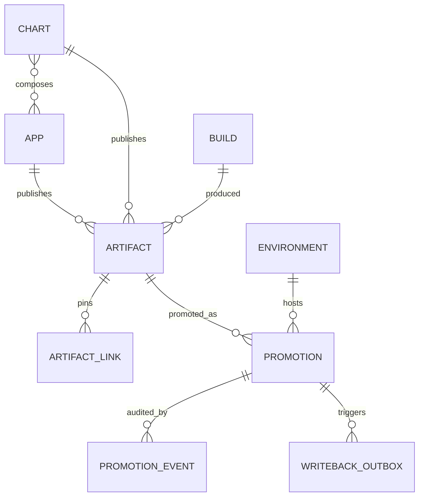
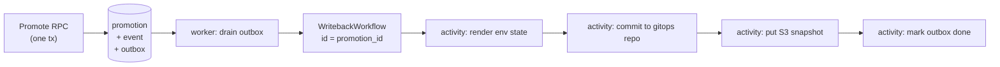

# App Registry — Architecture

Design record for `//tools/app_registry`. Read [README.md](README.md) first for
what the system is and the end-to-end flows.

## Design principles

1. **Manifests stay authoritative.** The registry never invents app metadata.
   It ingests `release_app` manifests via `bazel query` and reconciles. If the
   registry and the manifests disagree, the manifests win.
2. **Digests are identity; tags are labels.** Every artifact is stored by
   `sha256:` digest. Semver tags are recorded for humans and can move.
3. **The API is the write path; git is the delivery path.** Deployment tooling
   reads state from the gitops repo (or an S3 snapshot), never synchronously
   from the API. The registry being down must not block a deploy.
4. **Additive before authoritative.** The registry observes releases for a full
   phase before it is allowed to allocate versions. Git tags remain a redundant
   record permanently — they cost nothing and are the disaster-recovery path.
5. **Record, don't act.** The registry mutates rows and emits writeback intents.
   It never touches a cluster.

## Shared manifest schema

The registry does **not** define its own app-manifest shape. `AppManifest`,
`ChartManifest`, `AppManifestSet` and `DeployUnit` live in
[`//tools/appmeta/proto`](../appmeta/README.md), the schema of record for the
JSON that `app_metadata` and `helm_chart_metadata` emit.

This matters because two Go structs already decode that JSON — one in
`release_helper_go`, one in `tools/helm/composer.go` — and they had drifted from
each other and from the Starlark rule. The registry would have been a third.
Instead it consumes the shared contract, so `ReconcileApps` takes an
`AppManifestSet` verbatim and adding a field to `release_app` propagates
everywhere with no per-consumer edit.

Dependency direction is load-bearing: `appmeta` depends on nothing, and the
schema must not live under `app_registry`, or `tools/helm` would depend on the
registry in order to build a chart.

Drift is prevented by the contract test described in the appmeta README, not by
the shared type alone — `protojson` decoding with `DiscardUnknown: false` turns
any unmodelled Starlark output key into a test failure.

## Data model



### Tables

| Table | Shape | Notes |
|---|---|---|
| `app` | mutable, reconciled | `(domain, name)` unique. `status` ∈ active/missing/archived. Never hard-deleted. |
| `chart` | mutable, reconciled | `(domain, name)` unique. **Not SCD2** — see "Resolved questions" #4. |
| `chart_app` | join, current-state only | Which apps a chart *currently* declares, per its latest manifest. Destructively rewritten (`DELETE` + re-`INSERT`) by every `Reconcile`. Informational only — never read on the promotion/writeback render path. **Not SCD2** — see "Resolved questions" #4. |
| `build` | append-only | `(workflow_run_id, workflow_attempt)` unique. |
| `artifact` | append-only | `digest` globally unique. `(owner, kind, version)` unique. `version_major/minor/patch` (AR-5a) back numeric ordering — see "Version model" below. |
| `artifact_link` | append-only | Chart artifact → pinned image artifact, written once at `RecordArtifact` time and never mutated. This is what makes a promoted chart artifact's rendered app list deterministic — see "Resolved questions" #4. |
| `environment` | mutable | `key` unique. `rank` orders promotion legality. |
| `promotion` | **SCD2** | `valid_from` / `valid_to`. Partial unique index on current rows. |
| `promotion_event` | append-only | Who, why, when, and the Temporal workflow id. |
| `writeback_outbox` | append-only + claimed | Transactional outbox, drained by the worker. |
| `idempotency_key` | append-only | Key → prior response, for safe CI retries. |
| `version_allocation` | append-only | AR-5a. `AllocateVersion`'s reservation ledger — see "Version model" below. |
| `domain_adoption` | mutable | One row per domain; `stage` ∈ observe/promote/allocate. See "Resolved questions" #3. |
| `reconcile_watermark` | singleton, mutable | Migration 006 (issue #545). Exactly one row (`id = 1`), seeded as a sentinel. Guards `Reconcile` against a stale (older-commit) call — see "Reconcile watermark" below. |

**Planned (AR-7, issue #558; none of this is built):** `artifact` gains
`state`/`provenance`/`version_source` with nullable `digest`/`build_id`, absorbing
`version_allocation`, which is dropped; `app`/`chart` shed their mutable
metadata to new append-only `app_manifest`/`chart_manifest` snapshot tables and
a `v_current_app` view. See "Release lifecycle (issue #558)" below.

### SCD2 on `promotion`

Follows the repo-wide convention in `AGENTS.md` exactly:

```sql
-- write path: close and open, in one transaction
UPDATE promotion SET valid_to = NOW()
 WHERE environment_id = $1 AND target_key = $2 AND valid_to IS NULL;
INSERT INTO promotion (environment_id, target_key, artifact_id, ...)
VALUES ($1, $2, $3, ...);
```

```sql
-- current state
SELECT * FROM promotion
 WHERE environment_id = $1 AND valid_to IS NULL;

-- state at time T (the incident query)
SELECT * FROM promotion
 WHERE environment_id = $1
   AND valid_from <= $t
   AND (valid_to IS NULL OR valid_to > $t);
```

Backed by `CREATE UNIQUE INDEX ON promotion(environment_id, target_key) WHERE
valid_to IS NULL` — this both accelerates the hot query and makes
double-promotion structurally impossible.

`target_key` is the promoted thing's identity (`<kind>:<owner_full_name>`),
denormalized so the partial unique index is expressible without a nullable
two-column target.

A `v_current_promotion` view pre-joins promotion → artifact → app/chart → build
so the CLI, the writeback worker, and any future UI never re-derive the join.

## Version model (AR-5a)

Full rationale lives in PLAN.md's AR-5 "Addendum — semver semantics
(decided)" — this section is the as-built summary. **AR-5a ships this
schema and RPC fully working but wired to nothing**: no domain is at
adoption stage `allocate`, and `tools/release_helper_go/cmd/plan.go`'s
git-tag path (`autoIncrementVersion`) is untouched. See "AR-5" in PLAN.md
for what remains before any domain can be cut over for real.

**Parsing is shared, not duplicated.** `libs/go/semver` is the one semver
parser/incrementer/comparator this repo's release tooling uses —
`release_helper_go`'s `incrementVersion` and this package's `AllocateVersion`
both call it, rather than each keeping its own regex. It lives in `libs/go`
(not under either caller) for the same reason `//tools/appmeta/proto` lives
outside the registry: neither side should depend on the other to get parsing
right.

**Numeric ordering, not lexical.** `artifact.version` is `TEXT`; lexical
`ORDER BY` on it is wrong — `"v1.9.0" > "v1.10.0"` as strings. Migration 004
adds `version_major`/`version_minor`/`version_patch` (`INT NOT NULL`,
populated from the same parse at record/allocate time) plus an index
ordering by that triple. `UNIQUE (owner_id, kind, version)` stays on the TEXT
column as the collision guard; the integer columns are for ordering only. A
version that fails to parse (a real, if rare, historical condition — see
migration 004's comments) backfills to the `0/0/0` sentinel, which sorts
before every real release rather than blocking the migration or winning a
"latest" query it shouldn't.

**`AllocateVersion` writes to `version_allocation`, not `artifact`.**
`AllocateVersionRequest` carries no digest or build id (allocation happens
*before* a build exists — see `protos/api_messages_artifact.proto`), and
`artifact` requires both `NOT NULL`. `version_allocation` is a lightweight
table with the same `(owner_id, kind, version)` unique-index shape, so a
transactional `INSERT` against it is what makes concurrent `AllocateVersion`
calls for the same owner structurally unable to collide — the unique
constraint does the work, not application-level locking. "Next version" is
computed as the max across **both** `artifact` (already-published) and
`version_allocation` (reserved but not yet recorded), so a version reserved
a moment ago by a concurrent caller is never handed out twice even though
`RecordArtifact` hasn't run for it yet. A unique-violation aborts the whole
transaction (see "Idempotency" and the transaction-abort hazard noted
throughout this doc); the caller (`handlers.ArtifactServer.AllocateVersion`)
retries in a **fresh** transaction, recomputing "next" against the
now-committed state.

**Prereleases and build metadata are rejected, not mis-sorted.**
`AllocateVersion` calls `semver.ParseRelease`, which rejects a
`-prerelease`/`+build` suffix outright — real semver orders a prerelease
*before* its release, which nothing here implements, so half-accepting one
would sort it wrongly. **Extension point:** a later `version_prerelease TEXT`
column can be added to `artifact` without changing the `(owner_id, kind,
version)` constraint or the integer triple; the ordering index would gain a
trailing term. Do not add it speculatively — it lands with the change that
actually needs prerelease ordering.

**Per-domain cutover gate.** `AllocateVersion` rejects any domain not at
`domain_adoption.stage = 'allocate'` (see "Resolved questions" #3) with
`FailedPrecondition`. `domain_adoption` ships from AR-1's migration with a
row-per-domain-on-cutover shape (no row = implicit `observe`); AR-5a adds no
mechanism to move a domain to `allocate` — that is deliberately still a
direct `UPDATE domain_adoption` (or a future admin RPC/CLI command, not yet
built), so the first real cutover is a reviewable, explicit action.

## Reconcile watermark (issue #545)

`Reconcile` performs a FULL replace on every call (see "Design principles"
#1 and `ReconcileAppsRequest`'s own doc comment): every app/chart is
upserted `ACTIVE`, anything absent is flagged `MISSING`, unconditionally. As
of #543 it runs from `ci.yml` on every push to `main`, with only a same-group
CI concurrency cancel (#546) as a mitigation — which does not cover a
manually re-run older workflow (fresh queue timing, not the original push's
chronological position) or an in-flight RPC that outran a cancellation. An
older call landing after a newer one would silently revert registry state
(e.g. re-marking `ACTIVE` an app a newer commit correctly flagged `MISSING`)
with no error and no way to detect it after the fact.

**The guard: a singleton watermark, checked and advanced inside the same
transaction as the write.** Migration 006 adds `reconcile_watermark`, one
row recording the most recently *applied* call's ordering metadata.
`Reconcile` reads it with `SELECT ... FOR UPDATE` (so two concurrent calls
serialize instead of both reading the same stale watermark), decides
apply-or-skip, and — only on apply — writes the app/chart diff and advances
the watermark, all in one transaction (the non-dry-run path already runs
inside `runIdempotent`'s `WithTx`). The comparison/tie-break logic itself
lives once, in Go (`repository.ShouldApplyReconcile`), shared by the
postgres and fake implementations exactly like `DerivePromotability` is —
not duplicated as SQL in one place and Go in the other.

**Ordering key: `source_committed_at`, not `discovered_at`.**
`AppManifestSet.discovered_at` (`appmeta.proto`) is the Unix time
`release_helper_go` ran its `bazel query` sweep — sweep time, not the swept
commit's position in history. A manually re-run older workflow sweeps at
re-run time, so `discovered_at` is **not monotonic in commit order** and is
unsafe to use alone: it is exactly the "re-run an old workflow" case this
watermark exists to guard against, and a naive `discovered_at`-only
watermark would sail straight past it. `source_committed_at` (added
alongside this migration) is the git committer timestamp of `git_sha`
instead — `release_helper_go`'s `manifest-set` command resolves it via `git
log -1 --format=%ct <git_sha>` — which *is* monotonic with history for any
commit reachable from `main`. `discovered_at` is kept as a comparison
fallback for exactly one reason: backward compatibility with an
`AppManifestSet` produced by a `release_helper_go` binary that predates this
field (e.g. still cached on a CI runner mid-rollout of this change), which
carries `source_committed_at = 0`. `git log` resolution failing (git
unavailable, sha unresolvable in a shallow clone) also leaves it `0` rather
than failing the `manifest-set` command — losing the stronger ordering
guarantee for one call beats breaking manifest discovery entirely.

**Tie-breaking rules** (`ShouldApplyReconcile`, evaluated in this order):

1. No watermark yet (table's sentinel row, `git_sha = ''`): apply. The very
   first reconcile is always accepted.
2. `incoming.git_sha == current.git_sha`: apply, unconditionally, regardless
   of how the timestamps compare. The identical commit reconciled twice
   (a manual re-run of the same workflow run, or the CLI pointed at the
   same manifest set again with a fresh idempotency key) is harmless to
   re-apply — idempotency already covers true RPC-level replays; this
   covers the same commit arriving via two *different* calls — and clock
   skew between two sweeps of the same commit must never produce a
   false-stale rejection.
3. Incoming's ordering key (`source_committed_at`, falling back to
   `discovered_at`) strictly older than current's: **skip** (stale).
4. Otherwise (incoming's key is ≥ current's, and `git_sha` differs):
   **apply**. The equal-timestamp case is deliberate: two different commits
   landing in the same wall-clock second (or two manifest sets both falling
   back to `discovered_at`) must not block a legitimate merge just because
   they tied.

**A skipped-stale call is a no-op SUCCESS, not an error.** A CI re-run of an
older commit is doing the *right* thing by declining to revert newer state;
turning that workflow red would be exactly backwards. But a silent no-op is
the failure mode this feature exists to eliminate, so
`ReconcileAppsResponse` carries `skipped_stale` and
`current_watermark_git_sha`, the handler logs at `Warn` when it happens (see
`server/handlers/app.go`'s `ReconcileApps`), and the CLI prints a stderr
banner (mirroring `promote.go`'s already-promoted/dry-run banners) so it is
visible in a CI log even if nobody inspects the JSON response.

**Idempotency-key interaction.** A skipped-stale response IS stored under
the request's `idempotency_key`, same as any other successful response —
deliberately, not an oversight: a retry with the *same* key must replay the
*same* answer. If the skip weren't stored and the watermark happened to
change before a retry (e.g. a legitimately newer commit's reconcile lands
between the two calls), a replay could flip from "skipped" to "applied" for
what the caller believes is the same request — silently reordering writes
relative to what actually happened on the wire. Storing it keeps
`runIdempotent`'s guarantee ("repeated calls with the same key are a no-op
returning the original result") true here too.

**Dry run never touches the watermark**, in either direction: it neither
reads it to decide skip-or-apply, nor advances it on completion. Dry run
already writes nothing (see `ReconcileAppsRequest.dry_run`'s doc comment);
consulting a mutation guard for a call that cannot mutate would just be
extra Postgres round trips answering a question nobody asked.

**Why a singleton table, not a per-app/per-row watermark.** `Reconcile` is
always a full-replace of the complete manifest set, so there is exactly one
meaningful "most recent complete sweep" to compare against — one global
watermark suffices. A per-row watermark would have to answer an unasked
question ("was THIS app's row from a newer sweep than THAT app's row"),
which cannot happen under a full-replace write model.

**Why the watermark table is seeded with a sentinel row, not left empty.**
Postgres's `SELECT ... FOR UPDATE` locks only rows it *matches* — against a
genuinely empty table it locks nothing, so two concurrent "first ever
reconcile" transactions would both read "no watermark," both proceed to
apply, and only accidentally serialize at the final write. Migration 006
seeds exactly one row (`git_sha = ''`, timestamps `0`) so the locking read
always has something to hold from the very first call onward. This sentinel
is what "no watermark yet" means operationally — see migration 006's
comments and `ShouldApplyReconcile`'s doc comment; it is invisible above the
repository interface, which only ever exposes "is there a watermark or
not."

## Release-vs-reconcile gap (issue #547)

> **Superseded in design, still true as-built.** Issue #558 rejects "accept
> the gap" as the end state — see "Release lifecycle (issue #558)" below,
> which closes it by splitting identity assertion from the absence sweep.
> Everything in this section describes what is deployed today and stays
> accurate until AR-7c ships.

`ReconcileApps` runs only from `ci.yml` on push to `main` (#543); `release.yml`
is a `workflow_dispatch` a human triggers, often immediately after merging —
this is normal usage, not an edge case. That decoupling opens a window: a
release can run, and reach `RecordArtifact`'s owner lookup
(`resolveOwner`), *before* the corresponding `main`-push reconcile for that
commit has finished, or even started. If the commit introduces a genuinely
new app/chart, `resolveOwner` fails exactly the way it does when reconcile
never ran at all (#539/#542/#548) — now reproducible per-release, not just
per-outage.

**Decision: accept the gap, make it loud instead of silent (issue #547's
options 3 + 4). Two other options were considered and rejected:**

- **Not chosen: a release-time provisional upsert (option 1).** Reintroduces
  a second write path to `app`/`chart` — exactly what the "App/chart
  registration" row below already rejected for the same reason. It also
  cannot be made safe against a `release.yml` ref that diverges from `main`
  (see the second-order case below): a provisional upsert from such a ref
  would write metadata (`deploy_unit`, `image_repository`, `bazel_label`,
  description, …) that's only "corrected" whenever the next `main`-push
  reconcile happens to run, with nothing surfacing the interim drift. Even
  scoped as "always superseded by the next real reconcile" (which the
  watermark from issue #545 would make *orderable*, not safe by itself), it
  is a second mechanism to reason about for a case that resolves itself
  within one `main`-push cycle anyway.
- **Not chosen: gate `release.yml` on `main`'s reconcile (option 2).** Avoids
  a second write path entirely, at the cost of every release blocking on
  `main` CI. The repo owner releases immediately after merging as normal
  practice and does not want releases blocking on `main` CI — this would
  turn a one-off recording miss into a mandatory wait on every release.

**What "accept the gap" means concretely:**

- Releases are never gated on `main`'s reconcile, in either direction —
  `release.yml` does not wait for it, and does not skip publishing anything
  because of it.
- Recording stays best-effort by design (see "Availability and bootstrap"
  above): a release that runs ahead of reconcile simply does not get that
  one artifact/build recorded. The image/chart still publishes normally;
  only the App Registry's record of it is missing.
- **Identity self-heals; the artifact record does not.** The next
  `main`-push reconcile registers the app/chart (an app going `MISSING` →
  reappearing → `ACTIVE` is automatic, see "Triage" below), so a *later*
  release for the same app records fine. But nothing re-records the specific
  build/artifact that failed to record the first time — `ReconcileApps`
  (`server/handlers/app.go`) only ever calls `repository.Registry.Apps().Reconcile`;
  it has no path to `RecordBuild`/`RecordArtifact`, so there is no mechanism
  by which a missed release-time record gets filled in after the fact. If
  that artifact matters (e.g. it needs to be promotable later), the fix is
  to re-run the release job once `main`'s reconcile has caught up, not to
  wait for anything automatic.
- CI makes this failure loud rather than silent: `RecordArtifact` returning
  the owner-not-reconciled case is classified as its own actionable
  `::warning::` (naming the app/chart, pointing at `ci.yml`'s
  `reconcile-app-registry` job, and saying "re-run this release after main's
  CI completes") distinct from a generic registry-error warning — see
  `.github/actions/app-registry-record-image/action.yml`,
  `.github/actions/app-registry-record-build/action.yml`, and `release.yml`'s
  inline chart-recording loop. The distinguishing signal is a structured
  gRPC status detail (`apierrors.ReasonOwnerNotReconciled`, set by
  `mapRepoErr` in `server/handlers/errors.go`) that the CLI (`cli/cmd/root.go`)
  turns into a distinct process exit code (3) — not a parse of the error
  message — so CI's classification is robust to message wording changing
  later. `tools/app_registry/OPERATIONS.md` documents what an operator does
  when they see it.

**Second-order case: a ref that never becomes part of `main`.**
`release.yml` can be dispatched against an arbitrary ref — a branch that
later gets rebased or squashed differently before merging, or an old tag for
a hotfix. If that ref's manifests differ from what's currently on `main`
(e.g. a `deploy_unit` or `bazel_label` change that gets reverted before
merge), there is today no mechanism by which anything from that release
would ever land in the registry, because `release.yml` never writes app
identity itself (see "App/chart registration" below) — only `main`-push
reconcile does, and it reconciles `main`'s current tree, never that ref's.
Concretely: the artifact/build for that specific run either recorded
successfully against whatever app/chart state existed on `main` at the time
(if the owner already existed and its identity metadata happened to still
match), or it didn't record at all (owner never existed) and, since it never
merges to `main` in that form, never becomes recordable later either. This
is arguably correct — nothing *should* write app identity from a
non-canonical ref — but it does mean "release from an unmerged/divergent
ref" cannot self-heal the way "release right after merging to `main`" can.
No machinery is planned for this; it is accepted as part of the same
tradeoff above, not a separate gap to close.

## Release lifecycle (issue #558)

**Status: AR-7a and AR-7b built (not yet merged); AR-7c … AR-7f designed,
not built.** Delivery is PLAN.md's AR-7. Two slices of this section describe
real code: AR-7a's — ordering 4, partial-apply reconcile, domain-qualified
chart app references, and the `continue-on-error` drop on `ci.yml`'s sweep
job — and AR-7b's — the artifact lifecycle
(`allocated → publishing → published → failed`), migration `007`,
`BeginPublish`/`FailPublish`, `RecordArtifact`'s `publishing → published`
transition, and the stale-row reaper. Everything else here (the app identity
/ manifest-snapshot split, `AssertApps`, the run log, `AdoptArtifact`,
compose-time chart hermeticity) is still proposed: every table, column and
RPC named in those subsections is unbuilt. This section supersedes
"Release-vs-reconcile gap (issue #547)" above for the artifact lifecycle
specifically, and changes what "Availability and bootstrap" below promises —
both are cross-referenced where that happens.

### The problem: four cross-run orderings, three of them unenforced

A release run and a `main`-push reconcile are separate CI runs with no
ordering between them. Four orderings must hold for the registry to be
correct; only one is actually enforced.

| # | Required ordering | Enforced by | Failure |
|---|---|---|---|
| 1 | reconcile of commit `C` **before** `RecordArtifact` for an app introduced in `C` | nothing — accepted gap (#547) | exit 3, artifact never recorded and **never backfilled**; that build can never be promoted |
| 2 | newer reconcile **after** older reconcile | `reconcile_watermark` (#545) + CI concurrency (#546) | solved |
| 3 | `RecordArtifact(IMAGE, digest D)` **before** any chart pinning `D` | hard server-side reject (`postgres/artifact.go`, "chart pins unrecorded image digest") | chart artifact not recorded |
| 4 | app rows exist **before** a chart manifest referencing them resolves | `resolveChartApps` skips and reports the one bad chart (AR-7a, built) | solved — see below |

Ordering 3 is the expensive one, because charts pin digests resolved from
**GHCR by tag** (`docker buildx imagetools inspect ${IMG_REPO}:${IMG_VERSION}`
in `release.yml`), not from the current run's outputs — so any chart-only
release pins images published by earlier runs. One image that never got
recorded (it hit ordering 1, or recording was `continue-on-error` during a
registry blip) therefore breaks **every future chart release containing that
app**, permanently: re-running the chart release doesn't fix it (the digest is
still unrecorded), and reconcile doesn't fix it (reconcile writes identity,
never artifacts). It only clears when that app is rebuilt and recorded again.

Ordering 4 was the quiet one: one chart manifest naming a removed app, or an
ambiguous bare app name across two domains, used to roll back the whole
transaction, so the watermark never advanced and no app registered at all —
while the job stayed green because the step was `continue-on-error`. **Fixed
by AR-7a** (built): `resolveChartApps` now reports the bad chart in
`ReconcileAppsResponse.unresolved_charts` and skips only it; every other
app/chart in the same call still applies and the watermark still advances.
Chart manifests also carry a domain-qualified `app_refs` field now (see
"AssertApps (additive) vs. ReconcileApps (absence sweep)" below), so the
cross-domain-ambiguity half of this failure mode can no longer be produced by
`tools/helm` at all — only the deprecated bare-name compatibility path can
still hit it. And `ci.yml`'s `reconcile-app-registry` job no longer has
`continue-on-error`, so a genuine registry outage during the sweep is
visible immediately instead of hiding inside a green step.

### The principle that resolves it

**The registry is the source of truth for the pipeline. GHCR and the chart
repository remain the source of truth for artifacts.** Those are different
claims and keeping them apart is what makes the rest coherent:

- Nothing reads the registry to find out whether an image *exists* — the push
  is what makes it exist, and the digest the push returned is what gets
  recorded. A `published` row is proof-of-existence *at the instant it was
  written*, and deliberately not a live existence check (an image deleted from
  GHCR afterwards leaves a row that lies; a periodic verifier is a possible
  later addition, not a guarantee offered now).
- Because the artifacts themselves survive independently, a registry that is
  lost, restored from backup, or wrong can be repaired out of band. That path
  is disaster recovery ("shit is fucked"), not routine maintenance — see
  "Adoption and disaster recovery" below.

### Artifact lifecycle: `allocated → publishing → published`

The registry stops learning about an artifact *after* the fact. It records the
intent to publish **before** the push, and completes the record after.

| State | Written by | version | build_id | digest |
|---|---|---|---|---|
| `allocated` | `AllocateVersion` (AR-5) | ✓ | — | — |
| `publishing` | release run, immediately **before** the GHCR/chart push | ✓ | ✓ | — |
| `published` | release run, after the push, carrying the digest the push returned | ✓ | ✓ | ✓ |
| `failed` | release run on error, or the reaper on timeout | ✓ | ✓ | — |

**This removes a table rather than adding one.** `version_allocation` exists
only because `artifact.digest`/`build_id` are `NOT NULL` and allocation
happens before a build — i.e. it already *is* the `allocated` state, stored
elsewhere. Migration 007 makes those two columns nullable, adds `state`, folds
`version_allocation` rows into `artifact`, and drops it. `UNIQUE (owner_id,
kind, version)` then spans every state, which is strictly stronger than
today's two-table arrangement: it is the allocation collision guard, and
"next version" collapses from a max across two tables into one query.
`artifact_digest_idx` becomes `UNIQUE ... WHERE digest IS NOT NULL`.

Legal transitions, enforced server-side; anything else is `FailedPrecondition`:

- `∅ → allocated` (`AllocateVersion`), `∅ → publishing` (`BeginPublish`
  without a prior allocation — the pre-cutover path, see below),
  `allocated → publishing` (`BeginPublish`), `publishing → published`
  (`RecordArtifact`), `publishing → failed` (`FailPublish`, or the reaper),
  `failed → publishing` (a later run retrying the same version).
- `published` is terminal. Re-recording the same digest is an idempotent
  success; recording a *different* digest for an already-`published` version
  is rejected — that is a real conflict, not a retry.

**What this buys.** Ordering 3's hard reject stops being a trap: the image row
exists from `publishing` onward, so a chart failing on "pins an image the
registry doesn't have" now means the image genuinely was never published,
which is worth failing on. The registry never reconstructs or infers a record
it didn't observe (an explicitly rejected alternative — see below).

**The reaper is not optional.** A cancelled workflow leaves a `publishing` row
forever, and "what is incomplete?" is only a usable recovery query if it does
not accumulate ghosts. `app-registry-worker` sweeps `publishing` rows older
than `WRITEBACK`-style configured staleness to `failed` with reason `stale`.
Ships with AR-7b, not after it.

**Backward compatibility during rollout.** `RecordArtifact` against no
existing row keeps working, creating the row directly in `published` —
allowed while a domain is at adoption stage `observe`, rejected at
`allocate` (where allocation must have happened first). That is what lets CI
adopt `BeginPublish` per domain instead of in one cutover.

**As built (AR-7b).** Everything above is real: migration `007` ships
exactly this shape, plus an `artifact.fail_reason TEXT` column (not
originally named in this design) so `FailPublish`'s caller-supplied reason
and the reaper's hardcoded `"stale"` are both recorded, not just implied by
the state transition. One decision this section left implicit and the
implementation had to make explicit: the direct-create fallback is legal
**only** at `observe`, not at `promote` too — `promote`'s own row in
"Availability, restated per adoption stage" below already makes recording
mandatory there, so a domain at `promote` with no prior `publishing` row
means `BeginPublish` itself failed (or was skipped), and that must surface
as a rejection, not a silent fallback to the old behavior. The reaper
(`worker/reaper`) is a third loop in `app-registry-worker`, alongside the
outbox drainer, configured via `ENV.md`'s `ARTIFACT_REAPER_TIMEOUT` /
`ARTIFACT_REAPER_POLL_INTERVAL` — see `worker/README.md`.

### App identity vs. per-build manifest snapshot

Today `app` carries *mutable metadata* — `deploy_unit`, `image_repository`,
`bazel_label`, `app_type`, description — and some ref has to author it. Every
answer to "which ref?" is bad: let any ref write it and it drifts; let only
`main` write it and releases depend on `main`'s CI (ordering 1). The question
is removed rather than answered:

- `app` / `chart` become **pure identity**: `(domain, name)`, `status`,
  first/last-seen provenance. Nothing mutable.
- The `AppManifest`/`ChartManifest` a run was built from is stored **verbatim**
  (protojson, `JSONB`) in an append-only `app_manifest` / `chart_manifest`
  snapshot table, keyed `(owner_id, source_git_sha)` — same commit, same
  manifest, so writes are naturally idempotent — with `source_committed_at`
  and whether it came from the `main` sweep or a release run.
- `artifact.manifest_id` records which snapshot an artifact was built from,
  and **`artifact.promotability` becomes a stored column** derived from that
  snapshot at publish time.

Consequences, in order of importance:

1. **A release from any ref writes only facts.** Divergent branch, old tag,
   unmerged PR — none of them can write mutable state, so there is no drift to
   bound, observe, or correct, and identity assertion becomes safe from
   anywhere. This is what closes ordering 1 without the provisional-upsert
   trade #547 rejected.
2. **Promotability stops being retroactive.** `RecordArtifact` currently
   re-reads the owner's *current* `deploy_unit` (`postgres/artifact.go`'s
   "re-derive promotability against the freshly-read owner deploy_unit"), so
   editing a `release_app` rule today silently changes the promotability of
   artifacts published years ago. Deriving from the build's own snapshot is a
   correctness fix, not a refactor.
3. **The `main` sweep shrinks to what only it can do**: existence and absence.
4. **"Value at time T" without SCD2 on `app`.** The per-build snapshot *is*
   the history, append-only, matching how the rest of this schema works. (This
   is also why #553's answer — `chart`/`chart_app` are not SCD2 and don't need
   to be — still holds.)

Cost: reads that want "what does this app look like today" need the newest
`main` snapshot, via a `v_current_app` view (identity ⋈ latest `main`-sweep
snapshot), the same pre-joined-view pattern `v_current_promotion` uses.
`ListApps`/`GetApp` responses are unchanged on the wire.

**Storage: verbatim protojson `JSONB`, plus stored generated columns for the
fields the hot paths read** (`deploy_unit`, `image_repository`) — decided in
review of PR #559. The JSONB stays the single source of truth, so a new
appmeta field needs no migration and cannot drift from the manifest; the
generated columns keep `v_current_app` and promotability derivation ordinarily
indexable instead of resting on `->>` expression indexes. Fully typed columns
were rejected: they would reintroduce the hand-maintained duplicate of the
manifest schema that AR-M spent a phase deleting.

### `AssertApps` (additive) vs. `ReconcileApps` (absence sweep)

**`AssertApps` itself is still proposed, not built** — it is AR-7c. The
partial-apply and domain-qualified-reference paragraphs below are AR-7a and
are built (see "Status" above); the split this heading names is not: today
there is still only `ReconcileApps`, and it still runs exclusively from
`main` push.

`ReconcileApps` conflates two jobs: assert identity, and assert *absence*.
Only absence needs a canonical complete tree, and it is identity that releases
depend on. Split them:

| RPC | Runs from | Writes | Never does |
|---|---|---|---|
| `AssertApps` | any ref — `release.yml`, first step of a release | identity rows (`∅→ACTIVE`, `MISSING→ACTIVE` recovered) + manifest snapshots | mark anything `MISSING` |
| `ReconcileApps` | `main` push only, unchanged watermark | `MISSING` transitions, `chart_app` membership, `main` snapshots | assert identity from a non-canonical ref |

`AssertApps` against an `ARCHIVED` app is **rejected** per item — a human said
that app is gone for good, and a release resurrecting it silently is worse
than a red step. `RecordArtifact` against an `ARCHIVED` owner is likewise
rejected (today it succeeds, which is not intended).

**The sweep is partially-applying** (ordering 4, AR-7a, built): a chart whose
apps don't resolve is reported as unresolved in
`ReconcileAppsResponse.unresolved_charts` and skipped; every other app and
chart still applies and the watermark still advances. A skipped chart is
deliberately NOT marked `MISSING` as a side effect — it is present in the
manifest set, just unresolvable, and `ReconcileApps`'s absence sweep only
means to flag what is genuinely absent. Separately, chart manifests carry
**domain-qualified app references** (`ChartManifest.app_refs`, `"<domain>/
<name>"`, emitted by `helm_chart_metadata` in `tools/bazel/release.bzl`), so
`resolveChartApps`'s cross-domain ambiguity (`SELECT app_id FROM app WHERE
name = $1` with more than one match) cannot arise from anything `tools/helm`
produces — only the deprecated `ChartManifest.apps` (bare names) fallback,
kept for one release cycle's backward compatibility, can still hit it,
and it is now a per-chart skip there too, not a whole-sweep failure. Both were
small, independent of everything else here, and fixed a failure mode that was
silent — they landed first, as AR-7a.

### The run log: CI orchestrates, the registry records

A release run spans real GHCR pushes, so it cannot be one database
transaction, and it must not become one: re-pushing eight images because the
ninth failed is exactly wrong. The saga shape is right, with one boundary held
firmly — **the registry keeps the saga *log*; it does not *orchestrate* the
saga.** CI stays the actor that pushes and reports transitions. The moment the
registry drives steps, design principle 5 ("Record, don't act") breaks and it
becomes a deployment system. Concretely: no Temporal workflow on the inbound
path. `writeback_outbox` + Temporal stays what it is — the *outbound* path
(registry → gitops). Inbound is a state log CI writes to.

**This needs no new tables either.** `build` is already the run aggregate
(`(workflow_run_id, workflow_attempt)` unique); the artifact rows in
`allocated`/`publishing`/`published`/`failed` are its children. So:

- "What is incomplete?" = artifacts for this build not in `published`.
- **Re-running a release job becomes a resume**, not a blind retry: the run log
  names exactly which children are short of `published`, so the job re-attempts
  those and then the chart, instead of redoing everything or failing the same
  way.
- Exposed as `GetReleaseRun(workflow_run_id[, attempt])` and
  `app-registry builds status --incomplete` (AR-7d).

**The intent set is written up front, at every adoption stage** (decided in
review of PR #559). The release plan step writes one `allocated` artifact row
per target *before* anything is pushed — at stage `allocate` that row is the
`AllocateVersion` result; at `observe`/`promote` the version still comes from
the tag path and the registry is merely recording the intent. So "is this run
complete?" is exact from the first phase rather than only after the AR-5
cutover, and the cutover itself becomes a change of *who authors the version*,
not a new write.

Two consequences that are part of the design, not caveats:

- `allocated` means "this run intends to publish this version" — who *chose*
  the version is a separate axis, `artifact.version_source ∈ ('registry',
  'tag')`. That column is not bookkeeping for its own sake: AR-5's parity exit
  criterion ("allocated versions match what tag-scanning would have produced")
  becomes a query over rows that carry both, instead of a manual comparison
  against soak data.
- **The reaper must expire stale `allocated` rows too**, not just
  `publishing`. A cancelled run would otherwise hold a version number in
  `UNIQUE (owner_id, kind, version)` forever. Same sweep, same timeout
  configuration, `failed` with reason `stale`.

Declaring the set in a separate `build_target` table was considered and
rejected: the `allocated` state already is the declaration, and a second table
would restate it in a shape that can disagree with what the run actually did.

**As built (AR-7b), the intent-set write is narrower than "before anything
is pushed" describes.** No third RPC exists to declare intent independently
of `BeginPublish` (the phase's scope named exactly two new RPCs,
`BeginPublish`/`FailPublish`), and `AllocateVersion`'s per-domain gate
(this document's "Version model" section) structurally cannot serve `observe`/
`promote` domains — it would misattribute `version_source` to `registry` for
a version the tag path actually chose. So AR-7b implements the intent write
as `BeginPublish` called as the **first step of each matrix leg**, strictly
before that leg's own push, rather than from the plan job before the whole
matrix fans out. This is `allocated|∅ → publishing` directly, not a separate
`∅ → allocated` row for `observe`/`promote` domains — the `allocated` state
in that case is authored by `AllocateVersion` only at `allocate` stage, per
the table above. The gap this leaves: a matrix leg that never starts at all
(the job itself failed to schedule) has no row of any kind, so "is this run
complete?" cannot distinguish that from "not part of this run" for such a
leg. Closing that gap needs either a new RPC or loosening
`AllocateVersion`'s stage gate, and is deliberately left to AR-7d, which
owns `GetReleaseRun`/resume semantics — see PLAN.md's AR-7b "Deliberately
NOT done".

### Availability, restated per adoption stage

"The registry can be down for hours without blocking a release" and "the
registry is the source of truth for the pipeline" cannot both hold once
`publishing` must be written before a push. Rather than add a lever, the
existing one carries it: `domain_adoption.stage` already means "what is the
registry authoritative for," so it also means "how critical is it."

| Stage | Recording | Registry outage during a release |
|---|---|---|
| `observe` | best-effort, `continue-on-error` | release proceeds; a record may be missing (today's behavior) |
| `promote` | required — the recording step fails the job | release fails rather than silently skipping a record that later chart releases depend on |
| `allocate` | release-critical | release cannot proceed; the registry hands out the version number |

Recording becomes mandatory at `promote`, not only at `allocate` (decided in
review of PR #559): under the artifact lifecycle an unrecorded image is no
longer merely a missing row — it makes every later chart release pinning it
reject, so "skip it and carry on" is the expensive option, not the safe one.

At `allocate` the registry is already release-critical whether or not this is
written down — `AllocateVersion` is in the version path. Per-domain rollback is
moving the stage back; the global rollback is still
`APP_REGISTRY_CICD_OPT_IN=false`. This restates, and partially retracts, the
promise in "Availability and bootstrap" below; that section stays accurate for
`observe`, which is where every domain is today.

**The `main`-push sweep is not on this scale — it fails red on any error**
(decided in review of PR #559, **built in AR-7a**). `ci.yml`'s
`reconcile-app-registry` job drops `continue-on-error` entirely: a rejected
sweep is our manifests being wrong,
an unreachable registry is worth knowing about immediately, and the job gates
nothing downstream, so a red costs attention and nothing else. The consequence
is deliberate and worth stating plainly: **once the opt-in is on, a registry
outage turns `main` CI red**, and `APP_REGISTRY_CICD_OPT_IN=false` is the only
lever that stops it. That is the same kill switch the rest of the integration
already hangs on, not a new one.

### Adoption and disaster recovery

Charts pin digests resolved from GHCR by tag, so a chart can pin an image
published before the registry existed, or while the opt-in was off. There is no
run to resume for those, they will never be in the registry, and under
"registry is source of truth" the chart correctly — and permanently — fails.

**The way out is an explicit, bounded adoption path** (`AdoptArtifact`, admin
role only, not the builder credential): record a pre-existing GHCR image or
chart as `published` with `provenance = 'adopted'` and a required reason.
`artifact.provenance ∈ ('observed', 'adopted')` makes "which rows did we take
on faith?" a query rather than an archaeology exercise. It is used lazily —
when a chart release fails on an unknown pin — not as a bulk backfill, which
"Resolved questions" #3 still rejects.

The same path is the disaster-recovery path if the registry is lost or
restored behind: GHCR and the chart repository still hold the artifacts, so
state is re-adoptable. OPERATIONS.md carries the runbook (AR-7e). The design
goal is that this is *rare and deliberate*, not a recurring chore — every
other part of AR-7 exists to keep it that way.

### Relationship to AR-5 (allocation cutover)

**AR-7 does not conflict with what remains of AR-5, and belongs strictly
before it.** AR-5a shipped `AllocateVersion` fully implemented and *inert* —
no domain is at stage `allocate`, `plan.go`'s `autoIncrementVersion` is
untouched, and `version_allocation` is empty in every environment. That is the
cheapest possible moment to re-home its storage into `artifact` (AR-7b):
after a cutover, migration 007 would be folding rows a live release path is
writing.

What AR-7 does to each of AR-5's remaining items:

| AR-5 leftover | Effect of AR-7 |
|---|---|
| Replace `autoIncrementVersion` in `plan.go` | Unchanged in shape — but the plan step is already writing an intent row per target by then (`version_source = 'tag'`), so the cutover flips *who authors the version*, not who writes the row. |
| Seed each domain's starting version from its tags at cutover | Largely obviated: by cutover the registry already holds tag-derived versions as real `artifact` rows, so "latest" is answerable from the table that `AllocateVersion` reads. |
| Parity check ("allocated versions match tag-scanning") | Becomes a query rather than a manual comparison against soak logs — `version_source` records which path authored each version, and a shadow allocation can be compared against the recorded tag version while a domain is still at `observe`. |
| Per-domain cutover gate, rollback by moving the stage back | Unchanged, and now carries two more meanings (recording mandatory at `promote`, compose-time chart enforcement at `allocate`). |
| Remove the release workflow's version-allocation concurrency group | Unchanged AR-5 concern. AR-7's `UNIQUE (owner_id, kind, version)` across all states is the constraint that makes dropping it safe. |

The one ordering rule: **do not move any domain to `allocate` before AR-7b
lands.** Everything else in AR-7 can be built, merged, and run while every
domain sits at `observe`. **AR-7b has landed** (migration `007`,
`AllocateVersion` writing `artifact` rows directly, `BeginPublish`/
`FailPublish`, the reaper) — this rule is satisfied, and a domain may now be
moved to `allocate` as far as AR-7 is concerned. No domain has been, as of
this writing; that cutover is a separate, explicit operational action (see
"Per-domain cutover gate" in the Version model section above), not part of
this change.

### Rejected alternatives (issue #558)

| Approach | Why rejected |
|---|---|
| `AssertApps` upsert alone, keeping `app`'s mutable metadata | Fixes ordering 1 only, and forces the divergent-ref trade (#547) instead of removing it: some ref must author mutable metadata, and every choice of ref is wrong. Moving metadata to per-build snapshots deletes the question. |
| Infer the missing image artifact from the chart lockfile at chart-record time | Makes the registry *reconstruct* a record it never observed, so "was this published or inferred?" becomes a permanent question on every row. `publishing → published` means the record was always there — less machinery, stronger claim. |
| One atomic `RecordRelease` RPC (build + assertions + images + charts + links in one transaction) | A release spans real GHCR pushes; it cannot be one database transaction. All-or-nothing would also discard expensive partial progress. The run log gives the same "a re-run is a complete repair" property, as *resume*. |
| Registry orchestrates the release saga (inbound Temporal workflow) | Breaks "Record, don't act" — the registry would become a deployment system. CI orchestrates; the registry logs. Temporal stays on the outbound writeback path only. |
| SCD2 on `app` for "what did this app look like at time T" | The append-only per-build manifest snapshot already *is* the history and matches the rest of the schema; SCD2 on identity would add a second history mechanism. Consistent with #553. |
| A `build_target` table declaring the run's intended children up front | Rejected: the plan step writes `allocated` rows at every adoption stage (see "The run log"), so that state already *is* the declaration. A second table would restate it in a shape that can disagree with the run. |
| Enforce "charts may only pin registry-known images" at chart **compose** time, repo-wide | Rejected as a repo-wide switch, kept as a per-domain one (AR-7f): gated on `domain_adoption.stage = 'allocate'`, exactly like every other tightening here. Repo-wide, no chart could build until every member app had released through the registry once; per-domain, a domain only meets the strict rule after it has been releasing through the registry anyway, and chart builds fail before anything is pushed instead of after. |

## Promotability

The rule the whole system hangs on. Each app declares its `deploy_unit` in its
`release_app` manifest; the registry derives artifact promotability from it.

| App `deploy_unit` | Image artifacts | Chart artifacts |
|---|---|---|
| `chart` | `VIA_CHART` | `PROMOTABLE` |
| `image` | `PROMOTABLE` | n/a |
| `none` | `NOT_PROMOTABLE` | n/a |

**Override.** Promoting a `VIA_CHART` image directly is rejected unless the
caller passes `allow_override`. When allowed, the promotion is stored with
`is_override = true` and `GetEnvironmentState` reports it as a `DriftEntry`
against the chart's pinned digest. This makes the manmanv2-host-manager style
of hotfix possible without making it invisible.

**Why this is on the app, not the artifact:** it is a property of how the app is
deployed, which is declarative and belongs next to the code — the same place
`app_type` and `port` already live. The registry reads it; it does not own it.

### Required change to `release_app`

`tools/bazel/release.bzl` gains a `deploy_unit` attribute (default `"chart"`),
mirrored by `DeployUnit` in `//tools/appmeta/proto`. This is one of three
changes that touch existing code paths rather than being purely additive —
the others being the chart lockfile below and the manifest-schema
consolidation.

## Chart → image lockfile

Resolving a chart's pinned images to **digests** requires a container registry
call. A Bazel action must never make that call — it would break hermeticity
and make chart output non-reproducible, undoing #dd23e807 (which specifically
made chart builds deterministic). So this is two steps, split across two
different environments, not one:

1. **Compose time (hermetic, no network).** `tools/helm/composer.go` already
   resolves the exact image repository and tag it bakes into a chart's
   `values.yaml`. As of AR-2b it additionally writes those same references —
   full app name, repository, and tag — to `image-lockfile.json` alongside
   `Chart.yaml` inside the generated chart. This is a pure function of the
   `AppManifest`s the composer already reads: no digests, no registry access,
   sorted for deterministic output. `tools/release_helper_go`'s
   `read-chart-lockfile <chart-name>` command builds a chart and reads this
   file back out, giving the release path a stable way to get at it without
   re-deriving anything from the manifests.
2. **Publish time (has registry access; implemented in AR-2c).** After
   `release-helm-charts`'s `needs: [plan-release, release, ...]` has pushed
   every image, a CI step resolves each lockfile entry's repository+tag to a
   digest and forwards the result to `RecordArtifact(kind = CHART, contains =
   [...])`.

Without step 2, chart promotion cannot answer "which image digest is
running," and the incident query degrades to rendering charts by hand. This is
the highest-value part of the recording phase and should not be deferred.

The server rejects a chart artifact that references an image digest it has never
recorded — a chart may not pin an unknown artifact.

That reject is correct but is a trap today, because charts pin digests
published by *earlier* runs: one image that never got recorded breaks every
future chart release containing it, permanently. The artifact lifecycle in
"Release lifecycle (issue #558)" is what makes the reject safe to keep — the
image's row exists from `publishing` onward, so failing here means the image
genuinely was never published.

**This is also the deploy-time idempotency guarantee for a promoted chart's
app list — see "Resolved questions" #4.** `contains` is a pure function of
the manifest set at the moment the chart was *built*, computed hermetically
by `tools/helm/composer.go` with no registry access; `RecordArtifact` writes
it into `artifact_link` once, keyed to that specific chart artifact, and
nothing ever updates or rewrites an `artifact_link` row afterward. A later
`Reconcile` changing the chart's live `chart_app` composition therefore
cannot change what an already-recorded (and possibly already-promoted) chart
artifact renders.

## Writeback: outbox → Temporal

Promotion and the intent to write it back **must** commit atomically. If they
don't, the registry can believe prod is on v1.4.0 while the gitops repo still
says v1.3.0, which is the exact failure mode this system exists to prevent.

Since Temporal cannot enlist in a Postgres transaction, the server writes a
`writeback_outbox` row inside the promotion transaction. The worker drains the
outbox and starts a `WritebackWorkflow` with the promotion id as its workflow
id, so Temporal's own dedup makes redelivery harmless.



Activities are individually retryable and idempotent. The (future) gitops
commit activity is expected to use `state_hash` from `GetEnvironmentState`
to skip no-op commits, and retry on push conflict by re-reading state — last
writer wins on a per-environment file, which is correct because the
registry is the source of truth for that file.

**As of AR-4b, the diagram above is built through "activity: render env
state" only** — the render and publish steps exist, the gitops commit and S3
put do not (see PLAN.md's AR-4b "Explicitly not in scope"). Concretely:

- `server/handlers/promotion.go`'s `enqueueWriteback` writes the
  `writeback_outbox` row inside the exact same transaction as the SCD2
  close-and-open write and the `promotion_event` insert (extending AR-3c's
  transaction, not opening a second one), with `state_hash` computed via the
  same `stateHash` function `GetEnvironmentState` uses, over a fresh
  `StateAt` read taken inside that transaction — so the value on the outbox
  row is guaranteed consistent with what a `GetEnvironmentState` call
  returns immediately after commit.
- `tools/app_registry/worker` (`app-registry-worker`) is a long-running
  process (not a job) that both polls `writeback_outbox` directly against
  Postgres (`outbox.Drainer`, using an atomic
  `UPDATE ... WHERE outbox_id IN (SELECT ... FOR UPDATE SKIP LOCKED)` claim
  query) and runs a `go.temporal.io/sdk/worker.Worker` listening on task
  queue `app-registry-writeback`.
- `WritebackWorkflow` (`worker/writeback/workflow.go`), workflow id =
  promotion id, calls exactly two activities behind the `Writeback`
  interface: `RenderEnvironmentState` (reads `GetEnvironmentState` via the
  gRPC API — never Postgres directly, keeping with "the API is the write
  path" above) then `Publish`. AR-4b ships `StubActivities`
  (`worker/writeback/stub.go`): `Publish` writes the rendered JSON to a
  local path (`WRITEBACK_OUTPUT_DIR`) and skips the write when a sidecar
  file shows the state_hash already matches — the no-op detection a real
  gitops-committer `Publish` implementation inherits by satisfying the same
  `Writeback` interface. See `worker/README.md` for the full mechanism and
  how "killed mid-run" was verified.
- A row claimed by a worker that then dies is recovered by the *next*
  worker's `ClaimBatch` once the claim exceeds `WRITEBACK_CLAIM_STALE_AFTER`
  — Temporal's own workflow-id collision handling (an in-flight execution
  with that id either rejects a second `ExecuteWorkflow` call with
  `WorkflowExecutionAlreadyStarted`, or transparently attaches to it) is
  what makes retrying the claim safe rather than merely eventually
  consistent.

`go.temporal.io/sdk` (and, as of AR-4b, `go.temporal.io/api` directly, for
`serviceerror.WorkflowExecutionAlreadyStarted`) are Go dependencies added in
`go.mod`/`MODULE.bazel`; `libs/go/temporal` (client construction, env
config, worker bootstrap, logging bridge to `libs/go/logging`) shipped in
AR-4a — see [PLAN.md](PLAN.md).

## Authorization

Enforced with `libs/go/grpcauth` (Keycloak-issued OIDC service accounts, per
[`KEYCLOAK.md`](../../libs/go/grpcauth/KEYCLOAK.md)), split along the service
boundary. Role names are realm roles in Keycloak, service-prefixed, enforced
in `server/auth`:

| Role | Services | Credential |
|---|---|---|
| `app-registry-builder` | `AppRegistry` (writes), `ArtifactRegistry` (writes) | Keycloak service account, CI/all workflows |
| `app-registry-promoter-dev` | `PromotionRegistry` (writes), `dev` only | Keycloak service account scoped to the `dev` GitHub Environment; humans |
| `app-registry-promoter-stage` | `PromotionRegistry` (writes), `stage` only | Keycloak service account scoped to the `stage` GitHub Environment; humans |
| `app-registry-promoter-prod` | `PromotionRegistry` (writes), `prod` only | Keycloak service account scoped to the `prod` GitHub Environment; a small human group |
| `app-registry-admin` | `EnvironmentRegistry`, `SetAppStatus` | Human only |
| reader | all reads | Any authenticated principal |

Roles are flat and explicit — `app-registry-admin` does not imply
`app-registry-builder` or any promoter role, and a promoter role for one
environment does not imply another. A principal must hold literally every
role a call requires; see `server/auth.Require`'s doc comment.

**The critical constraint:** the credential every build job already holds must
not be able to promote. Each identity is a *different Keycloak client*, so the
builder token simply does not carry a promoter role — no matter what a
compromised build job does with the secret it holds. **Environment scoping
comes from GitHub, not Keycloak:** the `app-registry-promoter-prod` client
secret lives on the GitHub Environment named `prod`, so only a workflow job
declaring `environment: prod` can read it, and that declaration is what
triggers required reviewers. Per-environment `allowed_principals` narrows this
further.

`reason` is required on promotions to any environment above rank 0.

## Idempotency

Every write RPC takes a required `idempotency_key`. The server stores key →
serialized response; a repeat returns the original response with an
`already_*` flag rather than re-executing. CI reruns and Temporal activity
retries are therefore safe by construction.

Convention: `<workflow_run_id>-<attempt>[-<owner>-<kind>]` for CI; a
client-generated UUID for human promotions.

## Triage: the MISSING/ARCHIVED lifecycle

An app's `status` moves between three states, but only one edge is a human
decision:

- **active → missing**: automatic. `Reconcile` marks an app/chart `MISSING`
  whenever a full manifest set no longer contains it — see "Design
  principles" #1, manifests are authoritative.
- **missing → active** ("recovered"): automatic. If a manifest reappears in a
  later `Reconcile` call, the row goes straight back to `ACTIVE` with no human
  step. This is why `SetAppStatus` does not support `ACTIVE` as a target —
  there would be nothing for a human to do that `Reconcile` doesn't already
  do on the next run.
- **missing → archived**: the one human-triggered transition, via
  `SetAppStatus`. It means "this app is gone for good, stop flagging it as
  MISSING." `reason` is required.

`SetAppStatus` rejects every other transition with `FailedPrecondition` —
most notably `active → archived` (an app must go through `MISSING` first) and
any attempt to set `ACTIVE` directly. `archived → archived` is an idempotent
no-op success rather than an error, so a retried archive call is safe.

An earlier version of this RPC also allowed `SetAppStatus(ACTIVE)`, gated by
comparing an app's `last_seen_at` against the table-wide max to approximate
"was this app in the latest reconcile." That heuristic existed only to guard
a case Reconcile's recovered path already handles automatically, and was
fragile (a concurrent reconcile of an unrelated domain could shift the
table-wide max mid-check). It has been removed along with the ACTIVE target.

## Availability and bootstrap

The registry is itself a `release_app` in this monorepo, so it deploys itself.
That circularity is only safe because **nothing in the deploy path calls the
API synchronously**:

- ArgoCD reads the gitops repo, which the worker writes.
- The S3 snapshot is an auth-free read path for tooling that has no gRPC client.
- CI recording is best-effort: a registry outage warns, it does not fail a
  release.

The registry can be down for hours without blocking a release or a deploy. The
only thing lost is the ability to *make new promotions* during the outage.

> **Scoped to adoption stage `observe` by issue #558.** The claim above holds
> exactly while a domain's recording is best-effort. At `promote` recording
> becomes required, and at `allocate` the registry is in the version path and
> an outage does block that domain's releases — see "Release lifecycle (issue
> #558)" → "Availability, restated per adoption stage". Every domain is at
> `observe` today, so nothing here is wrong yet.

### `APP_REGISTRY_CICD_OPT_IN` — the bootstrap kill switch

"Best-effort" is not enough on its own. The registry is built and released by
the very pipeline that would call it, so before it is deployed and its secrets
exist there is a genuine chicken-and-egg risk: **you must never be unable to
build the app because the app is not yet deployed.**

Every CI step that talks to the registry is therefore gated on a GitHub repo
variable:

```yaml
if: vars.APP_REGISTRY_CICD_OPT_IN == 'true'
```

- **Unset or anything other than `true` (the default): CI makes no registry
  calls at all.** The pipeline behaves exactly as it does today. This is the
  state the repo ships in and stays in until the registry is deployed and its
  credentials are configured.
- **`true`:** recording steps run, still `continue-on-error` so a registry
  outage warns rather than failing a release.

Two independent gates, easily confused — keep them distinct:

| Gate | Layer | Question it answers |
|---|---|---|
| `APP_REGISTRY_CICD_OPT_IN` | GitHub Actions | Does CI talk to the registry **at all**? |
| `domain_adoption.stage` | Registry server | For a given domain, what is the registry **authoritative for**? |

The first is a global bootstrap/kill switch owned by whoever administers the
repo; the second is the per-domain rollout described under
[Resolved questions](#resolved-questions). The opt-in must be `true` before any
domain's stage matters, and turning it off is the single-lever rollback for the
entire CI integration.

Applies from AR-2c (the first phase to add CI steps) onward, including AR-5's
`AllocateVersion` — version allocation must fall back to the tag-based path
when the opt-in is off, or a registry outage becomes a release outage.

## Rejected alternatives

| Decision | Chosen | Rejected | Why |
|---|---|---|---|
| Async durability | Temporal + outbox | River | River was a trial and is being retired repo-wide. |
| Async durability | Temporal + outbox | RabbitMQ | Cannot enlist in the promotion transaction; would need an outbox anyway, so the outbox is the real mechanism and Temporal is the better executor for a multi-step, retryable git push. |
| Transport | gRPC + thin Go CLI | grpc-gateway / connect-go | Every CI caller in this repo is already `bazel run` on a Go CLI. A gateway is pure complexity until a browser UI exists. |
| Environments | table rows | proto enum | Ephemeral and regional environments become an insert, not a release. |
| Bundling | chart pins image digests | registry-side "release bundle" | Charts already are the bundle. Inventing a parallel grouping would duplicate what `tools/helm` composes. |
| Missing apps | flag `MISSING` for triage | auto-archive | A rename would silently orphan promotion history. |
| Version source of truth | registry (AR-5), tags retained | tags only | A unique constraint beats `git tag --sort` plus a CI concurrency group for concurrent allocation. |
| Manifest schema | shared `//tools/appmeta/proto` | registry-local manifest messages | Two hand-written Go structs already decode the manifest JSON and had drifted; a third would compound it. |
| Manifest schema | proto + `protojson` | shared hand-written Go struct | `protojson` reads the existing snake_case JSON unchanged, and `DiscardUnknown: false` turns drift into a test failure. |
| App/chart registration | `ReconcileApps`, full manifest set, run on push to `main` | a scoped `RegisterApp`/upsert RPC tied to `release.yml`, sending only the apps in that run | Two write paths to the same rows with different invariants. `ReconcileApps` treats its input as the complete truth and flags anything absent as `MISSING` (`api.proto`'s own comment) — a scoped call would either need to skip that check (weakening triage) or would falsely flag every app not in the current release as `MISSING`. It's also unsafe to run at release time at all: `release.yml` can be dispatched against an arbitrary (possibly old) ref, and reconciling an old commit's manifest set would flag every app added since as `MISSING`. Running it on every push to `main` instead means it only ever sees the current, complete tree. See issue #539's follow-up (#542) and DEPLOY.md "CI wiring (AR-3d)". |
| Reconcile watermark ordering key | `source_committed_at` (git committer timestamp of `git_sha`), fallback to `discovered_at` | `discovered_at` alone | `discovered_at` is sweep time, not commit-history position — a manually re-run older workflow sweeps at re-run time, producing a *newer* `discovered_at` than the newer commit it's racing. That is precisely the headline case issue #545 exists to guard against, so a `discovered_at`-only watermark would not catch it. See "Reconcile watermark" above. |
| Stale reconcile call | no-op success (`skipped_stale = true`) | `FailedPrecondition` error | A CI re-run of an older commit is doing the *correct* thing by declining to overwrite newer state; failing that workflow run would punish correct behavior and train people to retry (or worse, force-apply) their way past a safety check. A visible response field plus a server-side `Warn` log gives the same "you should know this happened" property as an error without making the workflow red. |
| Reconcile watermark granularity | one singleton row for the whole registry | a watermark per app/chart row | `Reconcile` is always a full-replace of the complete manifest set (see "Design principles" #1) — there is exactly one meaningful "most recent complete sweep," so a per-row watermark would have to answer a question that cannot arise under this write model ("was this one row from a newer sweep than that one"). |
| Release-vs-reconcile gap (#547) | accept the gap; make the failure a distinct, actionable annotation instead of silent | a release-time provisional upsert, always superseded by the next real reconcile | Reintroduces a second write path to `app`/`chart`, the exact thing the "App/chart registration" row above already rejected. Unsafe against a `release.yml` ref that diverges from `main` (see "Release-vs-reconcile gap" above): it could write stale metadata that nothing corrects until the next `main` reconcile happens to run. |
| Release-vs-reconcile gap (#547) | accept the gap; make the failure a distinct, actionable annotation instead of silent | gate `release.yml` on `main`'s reconcile completing first | Avoids a second write path, but every release would block on `main` CI. The repo owner releases immediately after merging as normal practice; this would turn an occasional recording miss into a mandatory wait on every release. |

**Revised by AR-7 (issue #558).** The three rows above about registration and
the #547 gap rejected a release-time write path *because `app` carries mutable
metadata that a divergent ref could clobber*. AR-7 removes that premise by
moving the metadata to per-build manifest snapshots, at which point
`AssertApps` writes identity and facts only — the objection is answered, not
overruled. The full-replace/`MISSING` reasoning is untouched: absence still
belongs to the `main` sweep alone. Issue #558's own rejected alternatives are
tabled in "Release lifecycle (issue #558)" above.

## Future: approval gate

Deliberately unimplemented, but the schema accommodates it without migration:

- `environment.requires_approval` already exists.
- `PromotionState.PENDING_APPROVAL` already exists.
- `PromotionAction.APPROVE` / `REJECT` already exist.

When built, `Promote` against a gated environment writes a promotion in
`PENDING_APPROVAL` with no outbox row; a later `Approve` transitions it to
`ACTIVE` and enqueues the writeback. Rollback needs nothing new — it is a
`Promote` to the artifact that SCD2 history already identifies as previous.

## Resolved questions

**1. Chart identity source — already solved, reuse it.**
`ListAllHelmCharts` in `tools/release_helper_go/cmd/plan_helm.go` mirrors
`ListAllApps` exactly: a loading-phase `bazel query` lists the metadata target
labels, then a `bazel cquery --output=starlark` scoped to those labels reads
the `HelmChartMetadataInfo` provider. Chart identity comes from that existing
path. No new discovery mechanism.

Note this changed in #444: discovery reads Starlark **providers**
(`AppMetadataInfo` / `HelmChartMetadataInfo`) rather than building each
target's `*_metadata.json`, so no actions run. The provider carries the same
dict the JSON file does — the cquery expression is literally
`json.encode(...metadata)` — so `//tools/appmeta/proto` remains the correct
schema for both delivery mechanisms, and the contract test gets cheaper
(analysis-only).

**2. Writeback is interface-only for now.**
Wiring the gitops repo requires changes in another repository that are out of
scope. AR-4 therefore delivers the *contract* — outbox, workflow, and a
`Writeback` activity interface — with a stub implementation that renders state
and writes it locally without publishing anywhere. The real gitops and S3
activities plug in behind that interface later with no schema or API change.

Consequence: nothing before AR-4 needs Temporal, so the `libs/go/temporal`
work moves out of AR-1 and into AR-4. That removes the largest unknown from
the foundations phase.

Consequence: until the real writeback lands, `GetEnvironmentState` is the only
way to consume promotion state. That is acceptable because no deploy tooling
depends on it yet — but it means the "registry can be down without blocking a
deploy" property is untested until AR-4 completes for real.

**3. No backfill; adopt by per-domain cutover.**
Historical artifacts are not backfilled from git tags or GHCR — history
accumulates from AR-2 forward.

Adoption is **per domain**, not global. A domain can publish through the
registry while every other domain stays on the existing tag-based path, which
allows a fast, low-blast-radius rollout instead of one repo-wide switch.

This needs a `domain_adoption` table keyed by domain, recording which
capabilities the registry is authoritative for:

| Stage | Meaning |
|---|---|
| `observe` | Registry records builds and artifacts. Git tags remain authoritative. Default for every domain from AR-2. |
| `promote` | Promotion state for this domain is tracked and consumed. |
| `allocate` | Registry allocates versions for this domain; tag scanning is bypassed. |

Recording (AR-2) is deliberately **not** gated — recording every domain is
harmless and builds the parity evidence AR-5 depends on. The gate matters from
AR-3 onward, and most of all at AR-5, where the source of truth actually
changes hands.

`AllocateVersion` must reject a domain not yet at `allocate`, so a
misconfigured CI job fails loudly rather than silently allocating from the
wrong source of truth.

**4. `chart`/`chart_app` are not SCD2, and don't need to be — issue #544.**

*Is `chart` SCD2?* No, and it shouldn't be. `chart` is a **mutable,
reconciled dimension row** — the same shape as `app`: identity
(`domain`/`name`) is stable, and `Reconcile` overwrites descriptive fields
and `status` in place (`appRepo.Reconcile`, the `UPDATE chart SET
status='active', last_seen_at=$2 ...` path). Per AGENTS.md's SCD2 section,
SCD2 exists to answer "what was the value at time T," backed by a
`valid_from`/`valid_to` pair and a partial-unique "current" index. Nothing in
this system ever asks "what did `chart.description` say on Tuesday" — the
one question anyone actually asks about a chart's history ("what was
*running* at time T") is already answered by `promotion` (genuinely SCD2) and
`build`/`artifact` (append-only, timestamped), not by historizing the chart
row itself. Applying SCD2 here would just be tracking the history of a
reconciled cache with no reader.

*Is `chart_app` SCD2, or should it be?* This is the one that "kind of seems
like it could be" — it changes over time and, naively, "what apps did this
chart compose when it was promoted" sounds like a temporal question. It
isn't SCD2 today: `appRepo.setChartApps` (`server/repository/postgres/app.go`)
does a full `DELETE FROM chart_app WHERE chart_id = $1` then re-`INSERT` on
every `Reconcile` — a current-state-only join, not append-only and not
soft-deleted, which AGENTS.md's SCD2 section would normally flag as a
candidate. But it should **not** become SCD2 either, because nothing on the
deploy-time render path reads `chart_app` at all (traced in full below) — the
thing that actually needs to be temporally stable already is, via a
different, simpler mechanism than SCD2.

*Is the deploy-time idempotency worry real?* **No — traced and verified with
a real-Postgres regression test
(`TestChartArtifact_CompositionPinnedAtRecordTime_SurvivesLaterReconcile`,
`server/repository/postgres/postgres_integration_test.go`).** The chart
→ image lockfile mechanism built for AR-2c (see "Chart → image lockfile"
above) already solves this, incidentally, for the exact case the issue
raises:

- A chart artifact's app list is `Artifact.Contains` (`[]ArtifactLink`),
  populated by `artifactRepo.loadContains`
  (`server/repository/postgres/artifact.go:233`), which reads **only**
  `artifact_link WHERE chart_artifact_id = $1` — keyed to one specific,
  already-published chart artifact, never to the live `chart` row.
- `artifact_link` rows are written exactly once, inside `RecordArtifact`
  (`artifact.go:169-201`), from the CI-supplied `contains` list — itself a
  hermetic function of the manifest set at chart-build time
  (`tools/helm/composer.go`, no registry or DB access). No code path ever
  updates or deletes an `artifact_link` row after that insert.
- `PromotionServer.GetEnvironmentState` (`server/handlers/promotion.go:350-359`)
  — the exact RPC the writeback worker calls to render what a promoted chart
  deploys — builds its `Images`/drift computation from
  `artifact.Contains`, i.e. `artifact_link`. It never joins `chart_app`.
  `chart_app` only surfaces through `AppIds` on `GetChart`/`ListCharts`
  responses (`server/handlers/convert.go:118`), a purely informational
  "what does this chart declare today" read, never consulted by
  `Promote`/`Rollback`/`GetEnvironmentState`/the writeback workflow.

So: promote chart `v1.2.3` (digest D, pinning images {A, B}), then run a
`Reconcile` that changes the chart's *declared* composition to {A, C} — the
already-promoted artifact D still renders {A, B}, because rendering never
looks at the row `Reconcile` just rewrote. Confirmed against real Postgres,
not just the fakes: see "Verification" in the PR that introduced this
section.

**Where this leaves `chart_app`:** it stays as-is, current-state-only, for
the informational "what does chart X compose right now" question
(`app-registry chart show`-style reads). It is not wired into anything
render-critical, so there is nothing to harden. Nothing precludes adding it
later if a *human-facing* "what did chart X compose at time T" question ever
needs answering (an SCD2 history table would be the right tool then, per
AGENTS.md) — but that is a different, lower-stakes question than deploy-time
correctness, and is not needed today.

## Open questions

The gitops repo layout is deferred rather than unresolved — it is answered when
the writeback stub is replaced with the real implementation.

All five AR-7 (issue #558) refinements that were parked here have been decided
in review of PR #559 and folded into the sections that own them:

| Question | Decision | Where |
|---|---|---|
| Declared intent set for a release run | The plan step writes an `allocated` row per target at **every** adoption stage; no `build_target` table | "The run log" |
| `reconcile-app-registry` and `continue-on-error` | Dropped — the job fails red on any error, with `APP_REGISTRY_CICD_OPT_IN` as the only lever | "Availability, restated per adoption stage" |
| Where recording becomes mandatory | At `promote`, not only at `allocate` | same |
| Manifest snapshot storage | Verbatim `JSONB` + stored generated columns for `deploy_unit` / `image_repository` | "App identity vs. per-build manifest snapshot" |
| AR-7f compose-time chart enforcement | Steady state, gated per domain on `stage = 'allocate'` | "Rejected alternatives (issue #558)" |
