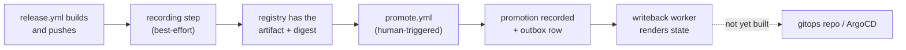

# App Registry — Operations Runbook

Day-2 operations: shipping something through the registry, verifying it
landed, promoting it, and recovering when a step silently didn't happen.

This is **not** setup — see [DEPLOY.md](DEPLOY.md) for creating the Keycloak
clients, GitHub Environments, and secrets a real promotion needs. This
document assumes those exist and covers what to do once they do. Where they
don't exist yet, each section says so plainly rather than describing
aspirational behavior.

> **As of this writing: recording is opt-in and off by default
> (`APP_REGISTRY_CICD_OPT_IN` is unset), no domain is at adoption stage
> `allocate`, and no promotion has ever run for real.** No Keycloak clients
> and no GitHub Environments (`dev`/`stage`/`prod`) exist outside a local
> Tilt session. Read ["Is the registry actually in use right now?"](#is-the-registry-actually-in-use-right-now)
> before assuming anything below is live.

## Is the registry actually in use right now?

Three independent questions, three independent checks — being "deployed"
answers none of them:

| Question | How to check | 
|---|---|
| Is CI recording builds/artifacts at all? | Repository variable `APP_REGISTRY_CICD_OPT_IN` in GitHub → Settings → Secrets and variables → Actions → Variables. `true` = recording steps run (best-effort); unset/anything else = CI makes zero registry calls. |
| Is a given domain's promotion state tracked? | `app-registry status <env> --domain <domain>` returns real data only if that domain has been recording long enough to have artifacts; there is no per-domain "promotion tracked" flag distinct from having promotable artifacts. |
| Does the registry allocate versions for a domain? | Query `domain_adoption.stage` for that domain (no admin RPC/CLI exists yet — this is a direct `SELECT` against Postgres, see [ARCHITECTURE.md](ARCHITECTURE.md#resolved-questions) → "3. No backfill; adopt by per-domain cutover"). No row = `observe` (implicit). Only `allocate` lets `AllocateVersion` succeed; `release_helper_go` doesn't call it regardless, so today this is always moot. |

If `APP_REGISTRY_CICD_OPT_IN` is unset, the honest answer to "is the registry
in use" is **no** — the service may be deployed and healthy, but nothing is
calling it.

## The lifecycle



The last hop (worker output → gitops repo → ArgoCD) is a stub today — see
["What actually deploys anything?"](#what-actually-deploys-anything-today) below.
Everything up to and including "promotion recorded" is real, implemented,
and tested against Postgres; it has just never been exercised outside Tilt
and integration tests.

### 1. Build and release

Nothing changes here. Run the release as always — `docs/RELEASE.md` and the
`Release` GitHub Actions workflow, unaffected either way by whether the
registry is on.

### 2. Recording (automatic, best-effort)

If `APP_REGISTRY_CICD_OPT_IN=true`, `release.yml` records the pushed
image/chart after publishing it — see
[`docs/CI_CD.md`](../../docs/CI_CD.md#app-registry) for exactly which steps.
**Do not assume a green release means recording succeeded** — the steps are
`continue-on-error` by design (a registry outage must never fail a release).

To check whether a specific release actually got recorded:

1. Open the release run in GitHub Actions → the `release` (or
   `release-helm-charts`) job → the `Record build and artifact in App
   Registry` (or `Record chart artifacts in App Registry`) step.
2. A skipped step (greyed out, "This step was skipped") means the opt-in
   was off — expected, not a failure.
3. A step that ran and shows `✅ Recorded ... in App Registry` at the end
   succeeded.
4. A step that ran, shows a red `X` inline but the **job** is still green —
   this is the silent-failure case. Look for `::warning::` lines (digest
   resolution failed) or a gRPC error (`Unauthenticated`, `Unavailable`,
   etc.) in the log. The job outcome tells you nothing; only the step log
   does.

To confirm from the registry side rather than the log:

```bash
app-registry artifacts get <domain>-<name> --version vX.Y.Z
# NotFound means it was never recorded (opt-in off, or the step failed)
```

**What a failed silent recording looks like in practice:** a release ships,
the workflow run is all green, but `app-registry artifacts get` for that
version returns `NotFound`. The most common cause is the builder credential
being wrong or expired (`Unauthenticated`, masked by `continue-on-error`) —
see [DEPLOY.md §4](DEPLOY.md#4-ci-credentials).

### 3. Promote to an environment

**Requires `promote.yml`'s GitHub Environments and Keycloak promoter clients
to exist — as of this writing they do not, so this step cannot succeed
outside Tilt.** Once they do:

- GitHub → Actions → `Promote` → **Run workflow**, filling in `environment`,
  `action` (`promote`/`rollback`), `owner_full_name`
  (`<domain>-<name>`), `version` (for `promote`), and `reason` (required
  above `dev`).
- The job runs under `environment: <the one you chose>`, which is what
  gates it on that environment's required reviewers and lets it read that
  environment's `app-registry-promoter-<env>` secret — approve the run when
  prompted.
- Prefer `dry_run: true` first against anything above `dev`: it computes the
  resulting state without writing, using the same authorization and
  promotability checks a real promotion would hit.
- Equivalent CLI form, for anyone with a local promoter credential
  configured (see [ENV.md](ENV.md)):

  ```bash
  app-registry promote <domain>-<name> vX.Y.Z --env prod --reason "..."
  app-registry rollback <domain>-<name> --env prod --reason "..."
  ```

A promotion that is `VIA_CHART` (an image that only reaches an environment
inside a chart) is rejected unless you pass `--allow-override` — passing it
records the promotion as a drift-tracked override, not an invisible
workaround. See [ARCHITECTURE.md](ARCHITECTURE.md#promotability).

### 4. Verify

```bash
# What is running in an environment right now, plus any drift
app-registry status prod

# What was running at a past instant (SCD2 window read)
app-registry status prod --at 2026-08-01T00:00:00Z

# Full promotion + event history for one target
app-registry history <domain>-<name> --env prod

# Difference between two environments (e.g. "is stage ahead of prod?")
app-registry diff stage prod
```

`status`'s stderr prints a banner for any `DriftEntry` — a `VIA_CHART` image
promoted directly with `--allow-override` that has since diverged from its
chart's pin. The JSON on stdout carries the same data under each entry's
`drift` field, so scripts parsing `--format json` don't need to watch
stderr, but a human running this interactively should read the banner
first.

### 5. Roll back

`app-registry rollback` (CLI) or `promote.yml` with `action: rollback` reverts
to whatever the SCD2 history shows as the immediately preceding promotion for
that target — there is no version argument, and no history means rollback is
rejected outright (nothing to roll back to).

## Checking for drift

Drift, here, specifically means: an image was promoted directly
(`--allow-override`) and its digest no longer matches what the chart that
owns it has pinned. It is **not** a general "does the cluster match the
registry" check — the registry has no visibility into the cluster at all
(see [ARCHITECTURE.md](ARCHITECTURE.md#availability-and-bootstrap)).

```bash
app-registry status <env>          # DriftEntry banner + JSON `drift` field
app-registry diff <env-a> <env-b>  # cross-environment comparison
```

If you need "does what's deployed match what the registry says was
promoted," that question cannot be answered yet — it depends on the real
gitops/ArgoCD writeback path, which is a stub today (see below).

## What actually deploys anything, today?

**Nothing, via the registry.** `PromotionRegistry.Promote` writes rows to
Postgres and enqueues a `writeback_outbox` entry in the same transaction.
`app-registry-worker` drains that outbox and runs a `WritebackWorkflow` that
renders the environment's state — but the `Publish` activity is a stub that
writes JSON to a local path (`WRITEBACK_OUTPUT_DIR`) inside the worker's own
container. It does not commit to the gitops repo, does not write to S3, and
ArgoCD does not read anything the registry produces. See
[ARCHITECTURE.md "Writeback: outbox → Temporal"](ARCHITECTURE.md#writeback-outbox--temporal)
for the full picture and exactly which activities exist versus which are
still missing.

Practically: promoting something via `promote.yml` today records that a
promotion happened and is queryable, but **changes nothing about what is
actually running**. Deployment remains whatever it is today — ArgoCD reading
values files by hand, outside this system entirely — until the real gitops
writeback ships.

## Related

- [DEPLOY.md](DEPLOY.md) — first-time setup: Keycloak clients, GitHub
  Environments, server config, in the order they need to happen
- [ARCHITECTURE.md](ARCHITECTURE.md) — data model, promotability rule,
  writeback mechanism, and the `APP_REGISTRY_CICD_OPT_IN` bootstrap gate
- [ENV.md](ENV.md) — every environment variable the CLI/server/worker read
- [TESTING.md](TESTING.md) — running the full stack locally in Tilt, including
  a working end-to-end promote → writeback smoke test
- [`docs/CI_CD.md`](../../docs/CI_CD.md#app-registry) — where the recording
  steps and `promote.yml` sit in the wider CI/CD pipeline
- [`docs/RELEASE.md`](../../docs/RELEASE.md#app-registry-integration) — how
  recording relates to the existing (still authoritative) tag-based release
  system
