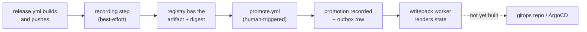

# App Registry — Operations Runbook

Day-2 operations: shipping something through the registry, verifying it
landed, promoting it, and recovering when a step silently didn't happen.

This is **not** setup — see [DEPLOY.md](DEPLOY.md) for creating the Keycloak
clients, GitHub Environments, and secrets a real promotion needs. This
document assumes those exist and covers what to do once they do. Where they
don't exist yet, each section says so plainly rather than describing
aspirational behavior.

> **As of this writing: recording is opt-in and off by default
> (`APP_REGISTRY_CICD_OPT_IN` is unset), no domain is at adoption stage
> `allocate`, and no promotion has ever run for real.** No Keycloak clients
> and no GitHub Environments (`dev`/`stage`/`prod`) exist outside a local
> Tilt session. Read ["Is the registry actually in use right now?"](#is-the-registry-actually-in-use-right-now)
> before assuming anything below is live.

## Is the registry actually in use right now?

Three independent questions, three independent checks — being "deployed"
answers none of them:

| Question | How to check | 
|---|---|
| Is CI recording builds/artifacts at all? | Repository variable `APP_REGISTRY_CICD_OPT_IN` in GitHub → Settings → Secrets and variables → Actions → Variables. `true` = recording steps run (best-effort); unset/anything else = CI makes zero registry calls. |
| Is a given domain's promotion state tracked? | `app-registry status <env> --domain <domain>` returns real data only if that domain has been recording long enough to have artifacts; there is no per-domain "promotion tracked" flag distinct from having promotable artifacts. |
| Does the registry allocate versions for a domain? | Query `domain_adoption.stage` for that domain (no admin RPC/CLI exists yet — this is a direct `SELECT` against Postgres, see [ARCHITECTURE.md "Resolved questions"](architecture/19-resolved-questions.md) → "3. No backfill; adopt by per-domain cutover"). No row = `observe` (implicit). Only `allocate` lets `AllocateVersion` succeed; `release_helper_go` doesn't call it regardless, so today this is always moot. |

If `APP_REGISTRY_CICD_OPT_IN` is unset, the honest answer to "is the registry
in use" is **no** — the service may be deployed and healthy, but nothing is
calling it.

## The lifecycle



The last hop (worker output → gitops repo → ArgoCD) is a stub today — see
["What actually deploys anything?"](#what-actually-deploys-anything-today) below.
Everything up to and including "promotion recorded" is real, implemented,
and tested against Postgres; it has just never been exercised outside Tilt
and integration tests.

### 1. Build and release

Nothing changes here. Run the release as always — `docs/RELEASE.md` and the
`Release` GitHub Actions workflow, unaffected either way by whether the
registry is on.

### 2. Recording (automatic, best-effort)

If `APP_REGISTRY_CICD_OPT_IN=true`, `release.yml` records the pushed
image/chart after publishing it — see
[`docs/CI_CD.md`](../../docs/CI_CD.md#app-registry) for exactly which steps.
Every individual recording step is still `continue-on-error` by design (a
registry outage must never fail a release) — but the `plan-release`,
`release`, and `release-helm-charts` jobs each end with one **App Registry
recording health** step that is deliberately NOT `continue-on-error`. It runs
last, after every real push/tag/upload in that job has already happened, and
checks every App Registry step's own outcome; if any of them failed, this
step fails too. **A release job going red because of this step never means
the release itself failed** — check whether "App Registry recording health"
is specifically the red step before assuming otherwise.

Before this existed, a recording failure was invisible at the job level —
every individual step's red `X` was masked by its own `continue-on-error`,
so the job (and the whole run) stayed green regardless. That silent-failure
window is why issue #547, #570, and the `BeginPublish` chart-repository bug
all shipped and ran for a while before anyone noticed. The health-check step
does not change what best-effort recording means; it only makes a real
recording failure show up as a red run instead of an annotation nobody read.

To check whether a specific release actually got recorded:

1. Open the release run in GitHub Actions. A red **App Registry recording
   health** step (last step of `release`/`release-helm-charts`/
   `plan-release`) means at least one recording step failed this run — go to
   step 4. A green run with that step present and green means every
   recording step that ran succeeded.
2. Find the specific failed step: the `Record build and artifact in App
   Registry` (or `Record chart artifacts in App Registry`) step, or one of
   `Assert apps/charts` / `Begin publish` / `Fail publish`.
3. A skipped step (greyed out, "This step was skipped") means the opt-in
   was off — expected, not a failure, and does not trip the health check.
4. A step that ran and shows `✅ Recorded ... in App Registry` at the end
   succeeded.
5. A step that ran and shows a red `X` failed. The run's summary page (the
   `::warning::`/`::error::` annotations GitHub surfaces at the top of the
   run, and the `$GITHUB_STEP_SUMMARY` section below the job list) tells you
   which kind:
   - **`::error:: App Registry: version skew (... not implemented)`** (issue
     #570) — the deployed `app-registry-api` doesn't have an RPC this CLI
     build calls. **This will not clear on retry or re-run** — CI's CLI is
     built from the commit being released, the server is whatever was last
     deployed, and re-running the same release just calls the same missing
     method again. Roll `app-registry-api` forward to a build that has the
     RPC, or set `APP_REGISTRY_CICD_OPT_IN=false` until it is deployed. This
     is an `::error::`, not a `::warning::`, specifically so it doesn't read
     as "try again later" — see
     [ARCHITECTURE.md "Version skew vs. outage"](architecture/16-availability-and-bootstrap.md#version-skew-vs-outage-issue-570).
   - **`::warning:: App Registry: <owner> not registered yet`** — as of AR-7c
     (issue #558), this should no longer happen in normal operation:
     `release.yml` now calls `AssertApps` from a dedicated `app-registry-assert`
     job that runs once, before every job that later resolves an owner by
     full name (see "AR-7c: AssertApps closed issue #547" below). If you see
     it anyway, check that job's `Assert apps/charts in App Registry` step
     log first — a registry outage there means every downstream App
     Registry step this run depends on it will likely fail the same way.
   - **`::warning:: App Registry: recording skipped (registry error)`** — a
     genuine, transient outage: connectivity, auth, or a timeout. Check the
     step log for the underlying gRPC error (`Unauthenticated`,
     `Unavailable`, `DeadlineExceeded`, etc.). Re-running later is a
     reasonable next step here, unlike the version-skew case above.
   The job outcome now tells you THAT something failed; the step log (or the
   run summary) still tells you WHICH failure it was and what to do about it.

**"Why didn't my reconcile apply?" (issue #545).** The `reconcile-app-registry`
job in `ci.yml` runs green but `app-registry apps list`/`get` still shows
old state. Check the step's log for `reconcile skipped: this manifest set
(git_sha=...) is stale relative to the current watermark (git_sha=...)` — the
CLI prints this to stderr, and the server logs the same event at `Warn`. This
means the reconcile watermark rejected the call as older (in commit history,
via `source_committed_at`) than one already applied — almost always a
manually re-run workflow for an older commit, or a workflow run whose reconcile
step got queued behind a later push's. **This is expected, correct behavior,
not a bug**: applying it would have reverted registry state to match the
older commit. See [ARCHITECTURE.md "Reconcile watermark"](architecture/05-reconcile-watermark-issue-545.md)
for the full mechanism, and re-run `ci.yml` for the commit you actually want
reflected if that's not what already ran.

**Browsing reconcile history (issue #607).** To confirm a given commit was
actually reconciled (or just see recent sweep activity), page through the
`reconcile_run` table with the CLI rather than re-deriving it from CI logs:

```sh
app-registry reconcile-runs list [--since <unix-ts>] [--page-size N] [--page-token <token>]
```

Rows are most-recent-`applied_at`-first. Pass the previous response's
`next_page_token` back in via `--page-token` to page further back; `--since`
narrows to runs at or after a given time. See
[ARCHITECTURE.md "ListReconcileRuns"](architecture/06-list-reconcile-runs-issue-607.md)
for the pagination contract.

**Browsing build history (issue #608).** To scan recent CI builds rather than
look up one known run, page through the `build` table with the CLI:

```sh
app-registry builds list [--since <unix-ts>] [--page-size N] [--page-token <token>]
```

Rows are most-recent-`recorded_at`-first. This is a browse, distinct from
`app-registry builds status <workflow-run-id>` (a point lookup for one run's
build plus its child artifacts, unchanged by this command) — reach for
`builds list` when you don't already know which run you're looking for. See
[ARCHITECTURE.md "ListBuilds"](architecture/08-release-lifecycle/05-list-builds-issue-608.md) for the
pagination contract.

**"What pins this image?" before removing or deprecating it (issue #609).**
Before deleting an image, retiring a repository, or otherwise treating an
image artifact as unused, confirm nothing still pins it:

```sh
app-registry artifacts pinned-by <digest-or-artifact-id>
```

Returns the chart artifacts whose `artifact_link` row points at that image
— empty means the image exists but nothing currently pins it, safe to
consider for removal; an unknown digest/artifact-id is a `NotFound` error,
not an empty result, so don't read "not found" as "safe to delete." This is
`artifacts resolve`'s reverse: `resolve` walks a chart down to its pinned
images, `pinned-by` walks an image up to the charts pinning it. See
[ARCHITECTURE.md "ListArtifactPins"](architecture/11-list-artifact-pins-issue-609.md)
for the not-found-vs-empty contract.

### AR-7c: AssertApps closed issue #547

**Retired runbook.** Before AR-7c (issue #558), `release.yml` had no path to
write app/chart identity itself — `ReconcileApps` only ran from `ci.yml` on
push to `main`, so a release for a genuinely new app/chart could reach
`RecordArtifact`'s owner lookup before that commit's reconcile had finished,
or even started, and fail with a distinct `App Registry: <owner> not
registered yet` warning (CLI exit code 3, `ReasonOwnerNotReconciled`). This
runbook entry described what to do about it (wait for `main` CI and re-run,
or accept the identity self-healing while the specific artifact stayed
unrecorded).

As of AR-7c, `release.yml` calls the new `AppRegistry.AssertApps` RPC (via
`.github/actions/app-registry-assert`) as the **first** App Registry call of
a release run — before any `Record build`/`Begin publish`/`Record artifact`
call that resolves an owner by full name. `AssertApps` is additive and safe
from any ref (see ARCHITECTURE.md "AssertApps (additive) vs. ReconcileApps
(absence sweep)"), so by the time those calls run, the owner's identity
already exists. `ReasonOwnerNotReconciled` / exit code 3 should no longer be
reachable from a normal `release.yml` run.

Originally this ran as a step inside each of the `release` matrix job and
`release-helm-charts` — repeating the exact same repo-wide manifest
discovery + RPC once per app plus once more for charts. Issue #622 hoisted
it into its own `app-registry-assert` job that runs once, upfront; `release`
and `release-helm-charts` `needs:` it, which preserves the same
before-any-owner-lookup ordering guarantee at a fraction of the cost.

**If you still see it:** the `app-registry-assert` job itself likely failed
— a registry outage fails every App Registry step it touches, this one
included. It is still `continue-on-error` (an outage there must not block
the release), but its own **App Registry recording health**-equivalent (the
job's `Assert apps/charts in App Registry` step going red, which every
downstream job's own health-check step also surfaces via
`needs.app-registry-assert.outputs.outcome`) makes this visible rather than
silent. Check that job's log before assuming this is the old #547 gap
reopening. The underlying mechanism (exit code 3,
`apierrors.ReasonOwnerNotReconciled`) is unchanged and still fires if
`resolveOwner` (`server/handlers/artifact.go`) genuinely can't find the
owner — it is just no longer reachable through the intended path.

To confirm a specific artifact recorded, from the registry side rather than
the log:

```bash
app-registry artifacts get <domain>-<name> --kind image|chart --version vX.Y.Z
# NotFound means it was never recorded (opt-in off, or a step failed)
```

**What a failed recording looks like in practice:** a release ships, the
`release`/`release-helm-charts` job goes red on its **App Registry recording
health** step (the release itself still succeeded — real images/charts were
still pushed), and `app-registry artifacts get` for that version returns
`NotFound`. The most common cause is the builder credential being wrong or
expired (`Unauthenticated`) — see [DEPLOY.md §4](DEPLOY.md#4-ci-credentials).

### 3. Promote to an environment

**Requires `promote.yml`'s GitHub Environments and Keycloak promoter clients
to exist.** Once they do:

- GitHub → Actions → `Promote` → **Run workflow**, filling in `environment`
  (the GitHub Environment, e.g. `promotion-dev`), `registry_environment`
  (the App Registry key it maps to — `dev`/`stage`/`prod`), `action`
  (`promote`/`rollback`), `owner_full_name` (`<domain>-<name>`), `version`
  (for `promote`), and `reason` (required above `dev`). These two
  environment inputs are separate because the GitHub Environment's name
  need not match the registry key — see [DEPLOY.md
  §6](DEPLOY.md#6-promote-via-promoteyml).
- The job runs under `environment: <the GitHub Environment you chose>`,
  which is what gates it on that environment's required reviewers and lets
  it read that environment's `app-registry-promoter-<registry_environment>`
  secret — approve the run when prompted.
- Prefer `dry_run: true` first against anything above `dev`: it computes the
  resulting state without writing, using the same authorization and
  promotability checks a real promotion would hit.
- Equivalent CLI form, for anyone with a local promoter credential
  configured (see [ENV.md](ENV.md)):

  ```bash
  app-registry promote <domain>-<name> vX.Y.Z --env prod --reason "..."
  app-registry rollback <domain>-<name> --env prod --reason "..."
  ```

A promotion that is `VIA_CHART` (an image that only reaches an environment
inside a chart) is rejected unless you pass `--allow-override` — passing it
records the promotion as a drift-tracked override, not an invisible
workaround. See [ARCHITECTURE.md "Promotability"](architecture/09-promotability.md).

**`PermissionDenied desc = requires role "app-registry-promoter-<env>"`
(issue #602):** the promoter client authenticated fine but its service
account isn't holding the expected realm role — either it was never
assigned, or it was assigned as a *client* role instead of a *realm* role.
This is a Keycloak configuration gap, not something retrying or redeploying
fixes. Decode a token for the client to confirm which (and check the other
two promoter clients while you're there — each environment is provisioned
independently): [DEPLOY.md §2](DEPLOY.md#2-verify-a-token-by-hand). Fix by
assigning the realm role in the Keycloak admin console: [DEPLOY.md §1,
"Realm roles"](DEPLOY.md#realm-roles).

### 4. Verify

```bash
# What is running in an environment right now, plus any drift
app-registry status prod

# What was running at a past instant (SCD2 window read)
app-registry status prod --at 2026-08-01T00:00:00Z

# Full promotion + event history for one target
app-registry history <domain>-<name> --env prod

# Difference between two environments (e.g. "is stage ahead of prod?")
app-registry diff stage prod
```

`status`'s stderr prints a banner for any `DriftEntry` — a `VIA_CHART` image
promoted directly with `--allow-override` that has since diverged from its
chart's pin. The JSON on stdout carries the same data under each entry's
`drift` field, so scripts parsing `--format json` don't need to watch
stderr, but a human running this interactively should read the banner
first.

### 5. Roll back

`app-registry rollback` (CLI) or `promote.yml` with `action: rollback` reverts
to whatever the SCD2 history shows as the immediately preceding promotion for
that target — there is no version argument, and no history means rollback is
rejected outright (nothing to roll back to).

## Understanding live updates on the Promotion Details page

The Promotion Details page (`/promotions/{id}`) updates itself in real-time via Server-Sent Events (SSE). This means **manual reload is no longer the way to get current state while it is live** — the page automatically reflects status changes from the registry and ArgoCD without requiring user intervention.

### What "live" and "not-live" mean

**The page is live** when:
- The SSE connection is open and heartbeats are arriving at regular intervals.
- The page is actively streaming updates from the registry.
- You will see changes reflected automatically: promotions completing, ArgoCD sync results, retry status, etc.

**The page is not-live** when:
- The SSE connection is closed (you closed the tab, network failed, server restarted, or your session expired).
- **Important:** "not-live" refers to the feed, not the promotion itself. A promotion that is not-live in the UI may still be progressing in the registry and ArgoCD; you simply won't see it until you reload.

### The key inference rule: live and not moving = system stuck

**This is the single most valuable thing the live indicator gives you.** If the page says it is **live and has not moved (no updates) for more than a few heartbeats**, **the system is stuck** — check ArgoCD or use "Retry refresh/sync" to investigate. This is the opposite of the browser-stale case:

- **Live and not moving** (stale despite active connection) → System is stuck. Check ArgoCD for sync failures or other issues.
- **Not-live** (no connection) → Either your session is gone, or the server is down. Use the reload affordance (see below).
- **Live and moving** (updates arriving) → Everything is working. Wait for completion or manual action.

Without the live indicator, you had no way to tell whether the page was stale because your browser cache was old or because the system was actually stuck. With it, the distinction is clear.

### What to do when the page is not-live

Use the reload affordance (a reload button on the page) to try reconnecting. This is **correct for both cases**:
1. If your session expired (terminal error), reload will show you the login page.
2. If the server restarted or a network hiccup occurred (transient error), reload will reconnect and resume streaming.

There is no manual retry on transient errors — the browser's built-in SSE reconnect logic handles that with backoff.

### Error banners: when a retry fails

If you click "Retry refresh/sync" (the button to manually trigger an ArgoCD retry) and it fails, an error banner appears on the page. **This banner stays until you navigate away** — its presence (or absence) tells you whether the most recent retry succeeded or failed:

- **Error banner visible** → The most recent retry failed; the error message tells you why.
- **Error banner absent** → Either no retry has been attempted, or the most recent one succeeded.

The page does not auto-dismiss the error banner, so you won't miss it by looking away.

### Exception: red load-failure alert

There is one exception to the inference rule above. **If the page shows the red load-failure alert** (the page itself never loaded), **the page has no live region to update, so live-and-static means the page itself never loaded, not that the system is stuck.** Reload is the answer in that state — a page that failed to load is always worth retrying.


## A release run didn't complete

**AR-7d (issue #558).** A release run spans real GHCR pushes across a GitHub
Actions matrix — it can be killed, time out, or fail partway through, leaving
some images pushed and recorded and others not. This is the recovery path:
find out exactly what's missing, then re-run the workflow to finish only
that.

**Requires `APP_REGISTRY_CICD_OPT_IN=true`.** With the opt-in off, CI makes
no registry calls at all (see ["Is the registry actually in use right
now?"](#is-the-registry-actually-in-use-right-now)), so there is no run log
to query — fall back to reading the workflow run's job list by hand.

### 1. Ask the registry what's incomplete

```bash
app-registry builds status <workflow-run-id>              # everything: build + every child artifact's state
app-registry builds status <workflow-run-id> --incomplete  # only artifacts NOT yet 'published'
app-registry builds status <workflow-run-id> --attempt 2   # a specific re-run attempt (default: the latest recorded)
```

`<workflow-run-id>` is the numeric id in the GitHub Actions run URL
(`.../actions/runs/<workflow-run-id>`), the same value `release.yml` passes
as `github.run_id`. Each artifact in the output carries a `state`:

| State | Meaning |
|---|---|
| `ARTIFACT_STATE_PUBLISHING` | Intent recorded (or the push started), but no digest yet. **Incomplete** — either still running, or was killed before pushing/recording. |
| `ARTIFACT_STATE_PUBLISHED` | Done. Nothing to do. |
| `ARTIFACT_STATE_FAILED` | `FailPublish` ran on the error path (or the stale-row reaper timed it out — check `fail_reason`, `"stale"` means the latter). **Incomplete** — needs a re-attempt. |
| `ARTIFACT_STATE_ALLOCATED` | Reserved a version but never started publishing — only possible for a domain at adoption stage `allocate` (none are, as of this writing; see `domain_adoption`). **Incomplete.** |

An empty response with no `NotFound` error and zero artifacts, for a run
that definitely built something, most likely means `APP_REGISTRY_CICD_OPT_IN`
was off for that run — check the run's own logs for skipped App Registry
steps, same as the "Is the registry actually in use" checks above.

**Why every target shows up, even one whose matrix leg never started at
all.** `plan-release`'s "Begin publish batch in App Registry" step calls
`BeginPublishBatch` (`app-registry artifacts begin-publish-batch`) once,
before the release matrix fans out, transitioning every planned app to
`publishing` up front. This is what makes a leg that GitHub Actions never
even got around to scheduling still show up as an incomplete child here —
without it (AR-7b's original, narrower behavior), that leg would have no row
at all, indistinguishable from "not part of this run." See
[ARCHITECTURE.md "The run log"](architecture/08-release-lifecycle/04-run-log.md)
for the full mechanism.

### 2. Re-run the workflow

Re-run the failed jobs (GitHub Actions → the run → "Re-run failed jobs", or
"Re-run all jobs" if the plan step itself needs to redo work). This is a
**resume, not a blind retry**:

- An app already `published` needs no action — `release-multiarch` still
  runs for it (there is no per-app skip in the build step itself), but the
  recording calls for it are idempotent replays, not new writes: `Begin
  publish` and `Record artifact` each carry their own
  `<workflow_run_id>-<attempt>-<owner>-<kind>-<begin|record>` key (issue
  #575 — the two used to share one key, and a re-run's `Record artifact`
  call would silently replay `Begin publish`'s stored response instead of
  actually recording anything), so a re-run replays each RPC's own prior
  response rather than either one replaying the other's.
- An app still `publishing` or `failed` re-attempts its push and recording
  normally — `BeginPublish`'s `failed -> publishing` transition (or a
  same-target idempotent replay of an already-`publishing` row) picks up
  right where it left off.
- The chart release (`release-helm-charts`) runs after every app leg, so it
  naturally waits for a re-run's app legs to finish before resolving image
  digests — no separate chart-side action needed.

**Do not manually re-push an already-published image "to be safe."**
Re-pushing eight images because the ninth failed is exactly the failure mode
this design avoids — `RecordArtifact`'s different-digest-on-an-already-
published-version check would reject it anyway if the rebuild produced a
different digest (a non-reproducible build, its own problem to chase down).

### 3. Confirm it finished

```bash
app-registry builds status <workflow-run-id> --incomplete
```

Empty output (after the re-run's own new `--attempt`, or against the
original if GitHub Actions reused the same run) means every child reached
`published`. If something is still incomplete after a re-run, re-check step
1's table — a `FAILED` row with a non-`"stale"` `fail_reason` usually points
at a real, recurring problem (a bad Dockerfile, a registry permissions
issue) rather than something a second re-run will fix on its own.

## Adoption and disaster recovery

**AR-7e (issue #558).** This is a rare, deliberate operation, not routine
maintenance — every other part of AR-7 (the artifact lifecycle, the run log,
`AssertApps`) exists precisely to keep the registry a complete, trustworthy
record so you never need this section. If you're here often, something
upstream is wrong and worth fixing (opt-in disabled for a domain that
actually releases, a registry outage nobody noticed, `AssertApps` not wired
into a release path) — file it, don't keep reaching for `adopt`.

`ArtifactRegistry.AdoptArtifact` records a pre-existing GHCR image or chart
as `published` with `provenance = 'adopted'` and a required `reason`, for
when there is genuinely no CI run to resume — see
[ARCHITECTURE.md "Adoption and disaster recovery"](architecture/08-release-lifecycle/08-adoption-disaster-recovery.md)
for the design and the exact state-collision rules. **Admin role only** —
the builder credential every CI job holds cannot call this RPC; see
["Where each secret goes"](DEPLOY.md#4-ci-credentials) in DEPLOY.md for why
the admin client secret is human-operated and kept out of CI entirely.

**It is lazy and per-artifact.** There is no bulk/sweep mode — adopt exactly
the one image or chart that is actually blocking you, with a reason that
will make sense to someone reading it in six months. It is also not a
liveness check: `AdoptArtifact` does not go and verify the digest actually
exists in GHCR or the chart repository. You are asserting it does; get that
right before you run the command.

### Case 1: a chart release fails on a pre-registry pin

A chart pins images by resolving `${IMG_REPO}:${IMG_VERSION}` to a digest at
compose time (`tools/helm`), then `RecordArtifact` rejects the chart if any
pinned digest was never itself recorded — "chart pins unrecorded image
digest". This happens permanently for an image published before the registry
existed, or while `APP_REGISTRY_CICD_OPT_IN` was off for that domain: there
is no run to re-run, and reconcile never writes artifact rows (only
identity), so the reject never clears on its own.

1. Identify the unrecorded digest from the chart release's failure message,
   and the app/version it belongs to (`tools/helm`'s lockfile output, or the
   chart manifest's `contains` entries).
2. Confirm the image genuinely exists — pull it, or check GHCR directly.
   `AdoptArtifact` will not do this for you.
3. Adopt it:
   ```bash
   app-registry artifacts adopt \
     --kind image --owner <domain>-<app> \
     --repository ghcr.io/whale-net/<domain>-<app> \
     --version <version> --digest sha256:<digest> \
     --reason "published <date/context> before the registry existed; confirmed present in GHCR"
   ```
   `--idempotency-key` is optional here — a UUID is generated if omitted,
   the same as `promote`/`rollback` (this is a human action, not CI).
4. Re-run the chart release. The pin now resolves against a `published` row
   (`provenance = ADOPTED`) exactly as if it had been observed at publish
   time.

Adopting a chart directly (kind `chart`) works the same way, with
`--contains` pointing at a JSON file of its resolved image references — see
`app-registry artifacts record`'s `--contains` for the file shape; every
referenced image must already be a `published` artifact (adopted or
observed), or the call fails the same way `RecordArtifact` would.

### Case 2: the registry is restored behind, or lost entirely

If the registry database is restored from a backup taken before some
publishes happened, or lost outright and rebuilt from migrations, its
`artifact` rows no longer match reality — but **GHCR and the chart
repository are unaffected**: they are the source of truth for artifacts, the
registry only for the pipeline (see ARCHITECTURE.md "The principle that
resolves it"). Nothing needs bulk-repairing immediately; the registry is
simply missing history until something needs it:

- **App/chart identity** (`app`, `chart`, and their manifest snapshots)
  self-heals on the next `ReconcileApps` (main push) or `AssertApps`
  (release run) — no adoption needed for identity, only for artifacts.
- **Artifact rows** only need adopting lazily, the moment something actually
  needs one that's missing — almost always surfacing as Case 1 above. Do
  not attempt to walk GHCR and re-adopt everything "to be safe" — that is
  exactly the bulk backfill this design rejects (see ARCHITECTURE.md
  "Resolved questions" #3): it manufactures adopted rows for artifacts
  nothing will ever ask about, with no way to know later which ones were
  real gaps versus precautionary noise.
- **Promotion history** (`promotion`, `promotion_event`) has no adoption
  path at all — it is this registry's own record of what it did, not a
  mirror of an external source of truth. A restore-behind here is a real
  gap; there is nothing to reconstruct it from.

### Case 3: a row stuck `publishing` from a release that reported green (issue #575)

Before the fix in issue #575, `release.yml` gave `Begin publish` and `Record
artifact` (or the chart equivalents) the SAME idempotency key for a leg, so
`Record artifact`'s call silently replayed `Begin publish`'s already-stored
response instead of actually recording anything — no error, the RPC returned
`OK`, and the release job showed green. The artifact row was left in
`publishing` (no digest, no `published_at`) and eventually reaped to
`failed` with `fail_reason = "stale"`, typically well after the run
finished. See ARCHITECTURE.md's "Idempotency" → "Fixed: cross-method replay
via a reused key (issue #575)" for the mechanism.

Symptoms of a row stuck this way, for a release run from before this fix
shipped:

- `app-registry builds status <workflow-run-id> --incomplete` still lists
  the artifact (state `ARTIFACT_STATE_PUBLISHING` or `ARTIFACT_STATE_FAILED`
  with `fail_reason = "stale"`), even though the run's own GitHub Actions
  logs show the image/chart push and the "Record ... artifact in App
  Registry" step both succeeded.
- The image or chart genuinely exists in GHCR / the chart repository — the
  push itself was never the problem, only recording it was.

**Do not re-run the workflow to fix an already-fixed-forward run** — a re-run
would push a new (probably identical, if the build is reproducible) image
under the same version, which `RecordArtifact` may reject as a
redo (see ["A release run didn't complete"](#a-release-run-didnt-complete)
above); for one that finished, failed recording, or reported green a while ago,
treat it like Case 1: confirm the digest actually exists in GHCR/the chart
repository, then `app-registry artifacts adopt` it with a `reason` citing the
issue or run. `AdoptArtifact` directly adopts over both `publishing` and `failed`
states, immediately completing disaster recovery without waiting for reaper
timeouts.
**This is a human decision against the live registry, not something to run
speculatively or automate** — see this repo's `AGENTS.md` ("do not patch
production environments") and "It is lazy and per-artifact" above.

### Case 4: rows stuck `publishing`/`failed` with no digest from a no-op rebuild (issue #817, fixed forward by ca55c682)

Before the fix in commit `ca55c682` (issue #817's root cause), the
binary/CLI/firmware release path in `release-app` did not call `FailPublish`
when `RecordArtifact` itself returned an error — it only logged a
`::warning` and moved on. The trigger was a **no-op rebuild**: when a
binary/CLI/firmware artifact is byte-identical to the previous release in
the same `major.minor` series, its digest collides with
`artifact_digest_major_minor_idx (owner_id, kind, version_major,
version_minor, digest)` and `RecordArtifact` returns `ErrAlreadyExists`. The
row `BeginPublish` had already created for the new version was left behind
in `publishing` with no digest — exactly like Case 3, except the underlying
cause is a digest collision, not a replayed idempotency key. The reaper
(`worker/reaper`, `ARTIFACT_REAPER_TIMEOUT`) eventually flips these to
`failed` with `fail_reason = "stale"`, same as Case 3; they do not stay
`publishing` forever, but they never gain a digest and can never be
promoted.

`ca55c682` stops this from recurring — it detects a same-`major.minor` no-op
rebuild up front and resolves it with `FailPublish` instead of ever calling
`RecordArtifact`, and makes both release paths call `FailPublish` whenever
`RecordArtifact` fails for any reason. It does **not** repair rows left
behind before it shipped. Known example: `tools-app-registry v0.2.3`,
build `32065667768`.

**Finding stuck rows (read-only).** There is no CLI filter for artifact
state across every owner (`artifacts list` only filters by owner/kind/
provenance/promotability — see `cli/cmd/artifacts.go`), so — same as the
`domain_adoption.stage` lookup earlier in this doc — this is a direct
`SELECT` against Postgres, safe to run at any time:

```sql
SELECT artifact_id, kind, app_id, chart_id, version, state, digest,
       build_id, fail_reason, state_changed_at, created_at
FROM artifact
WHERE state IN ('publishing', 'failed')
  AND digest IS NULL
ORDER BY state_changed_at ASC;
```

Every row this returns is a dead end by construction: `publishing`/`failed`
with no digest means it was never (and, in `failed`'s case, can never
again under the same version) recorded as published. `published` rows
always carry a digest (`artifact_state_shape` CHECK), so this query cannot
false-positive on a healthy row.

**Remediation is the same `adopt` path as Case 1/3 — per row, by a human,
against the live registry. There is deliberately no bulk/sweep command for
this** (see "It is lazy and per-artifact" above, and
`cli/cmd/artifacts.go`'s `newArtifactsAdoptCmd` doc comment) — a bulk delete
or bulk fabricate-and-adopt script would either destroy the audit trail of
what actually happened, or manufacture digests the registry never observed,
exactly what this design rejects (ARCHITECTURE.md "Resolved questions" #3).
For each row the query above returns:

1. Confirm what actually happened for that version. For the no-op-rebuild
   case specifically, the fix's own diagnosis tells you the answer: the
   build was byte-identical to the previous version in the same
   `major.minor` series, so the digest that collided is that previous
   version's already-`published` digest. Look it up:
   ```sql
   SELECT version, digest FROM artifact
   WHERE app_id = (SELECT app_id FROM artifact WHERE artifact_id = '<stuck-artifact_id>')
     AND kind = 'binary' AND state = 'published'
   ORDER BY version_major DESC, version_minor DESC, version_patch DESC
   LIMIT 1;
   ```
   If the CI run's own logs are still available, cross-check against the
   "Record ... artifact in App Registry" step's reported digest instead of
   trusting the DB alone.
2. If the digest cannot be confirmed by either path (build logs expired,
   genuinely unclear whether anything was ever pushed) — **do nothing**.
   Leave the row as the reaper left it. A `failed`/no-digest row is inert:
   it cannot be promoted, is not returned by `--promotable`, and does not
   block the next release (version uniqueness only blocks a *repeat* of the
   exact same version string). Deleting it would erase the only record that
   this happened; re-running the release for a new version is the correct
   forward fix, not clawing back the old one.
3. Otherwise, adopt it with the recovered digest, citing the issue:
   ```bash
   app-registry artifacts adopt \
     --kind binary --owner tools-app-registry \
     --repository <the binary's storage location, e.g. GHCR release asset URL> \
     --version v0.2.3 --digest sha256:<digest recovered in step 1> \
     --reason "no-op rebuild digest collision left this row stuck publishing before ca55c682 (issue #817); digest confirmed identical to v0.2.2"
   ```

### Auditing what was adopted

```bash
app-registry artifacts list --provenance adopted            # every adopted row, any owner
app-registry artifacts list <domain-app> --provenance adopted  # scoped to one owner
```

The `reason` given at adopt time is not stored on the row itself (no schema
change was needed for this phase — see ARCHITECTURE.md's "As built (AR-7e)"
note) but is logged structurally by `app-registry-api` at call time, keyed
by the same digest/owner/version this query returns — cross-reference
against server logs for the full "why" behind any adopted row.

## Checking for drift

Drift, here, specifically means: an image was promoted directly
(`--allow-override`) and its digest no longer matches what the chart that
owns it has pinned. It is **not** a general "does the cluster match the
registry" check — the registry has no visibility into the cluster at all
(see [ARCHITECTURE.md "Availability and bootstrap"](architecture/16-availability-and-bootstrap.md)).

```bash
app-registry status <env>          # DriftEntry banner + JSON `drift` field
app-registry diff <env-a> <env-b>  # cross-environment comparison
```

If you need "does what's deployed match what the registry says was
promoted," that question cannot be answered yet — it depends on the real
gitops/ArgoCD writeback path, which is a stub today (see below).

## What actually deploys anything, today?

**Nothing, via the registry.** `PromotionRegistry.Promote` writes rows to
Postgres and enqueues a `writeback_outbox` entry in the same transaction.
`app-registry-worker` drains that outbox and runs a `WritebackWorkflow` that
renders the environment's state — but the `Publish` activity is a stub that
writes JSON to a local path (`WRITEBACK_OUTPUT_DIR`) inside the worker's own
container. It does not commit to the gitops repo, does not write to S3, and
ArgoCD does not read anything the registry produces. See
[ARCHITECTURE.md "Writeback: outbox → Temporal"](architecture/12-writeback-outbox-temporal.md)
for the full picture and exactly which activities exist versus which are
still missing.

Practically: promoting something via `promote.yml` today records that a
promotion happened and is queryable, but **changes nothing about what is
actually running**. Deployment remains whatever it is today — ArgoCD reading
values files by hand, outside this system entirely — until the real gitops
writeback ships.

## Related

- [DEPLOY.md](DEPLOY.md) — first-time setup: Keycloak clients, GitHub
  Environments, server config, in the order they need to happen
- [ARCHITECTURE.md](ARCHITECTURE.md) — data model, promotability rule,
  writeback mechanism, and the `APP_REGISTRY_CICD_OPT_IN` bootstrap gate
- [ENV.md](ENV.md) — every environment variable the CLI/server/worker read
- [TESTING.md](TESTING.md) — running the full stack locally in Tilt, including
  a working end-to-end promote → writeback smoke test
- [`docs/CI_CD.md`](../../docs/CI_CD.md#app-registry) — where the recording
  steps and `promote.yml` sit in the wider CI/CD pipeline
- [`docs/RELEASE.md`](../../docs/RELEASE.md#app-registry-integration) — how
  recording relates to the existing (still authoritative) tag-based release
  system
