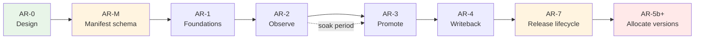

# App Registry — Delivery Plan

Phased build-out of `//tools/app_registry`. Each phase has a **plan ID** (AR-M,
AR-1, AR-2a…). As-built detail for a completed phase is recorded in that
phase's section below — this file is the single record, so a reader never has
to reconcile it against a separate tracking document.

(Earlier phases kept a per-phase `TODO-<PLAN_ID>.md` alongside this file. The
convention was applied to only half the phases before being dropped; those
files were retired in AR-6b and anything still load-bearing was folded into
the phase sections here.)

Read [ARCHITECTURE.md](ARCHITECTURE.md) before executing any phase.

---

## Current status

*Last updated finishing AR-7f (issue #558). **AR-M through AR-7b are all
merged to `main`** — see the table below.*

| Phase | PR | State |
|---|---|---|
| AR-M | [#495](https://github.com/whale-net/everything/pull/495) | merged |
| AR-1 | [#496](https://github.com/whale-net/everything/pull/496) | merged |
| AR-2a | [#499](https://github.com/whale-net/everything/pull/499) | merged — verified against real Postgres |
| AR-2b | [#500](https://github.com/whale-net/everything/pull/500) | merged — charts byte-identical |
| AR-2c | [#502](https://github.com/whale-net/everything/pull/502) | merged — CI path unexercised until the registry is deployed |
| dbtest | [#498](https://github.com/whale-net/everything/pull/498) | merged — `libs/go/dbtest` available |
| AR-2d | [#503](https://github.com/whale-net/everything/pull/503) | merged |
| AR-3a…AR-3d | [#504](https://github.com/whale-net/everything/pull/504), [#508](https://github.com/whale-net/everything/pull/508), [#509](https://github.com/whale-net/everything/pull/509), [#511](https://github.com/whale-net/everything/pull/511) | merged |
| AR-4a / AR-4b | [#512](https://github.com/whale-net/everything/pull/512), [#514](https://github.com/whale-net/everything/pull/514) | merged — writeback `Publish` is still the stub |
| AR-5a | [#513](https://github.com/whale-net/everything/pull/513) | merged — **inert**: no domain at stage `allocate`, `plan.go`'s tag path untouched |
| AR-6a / AR-6b | [#516](https://github.com/whale-net/everything/pull/516), [#515](https://github.com/whale-net/everything/pull/515) | merged |
| AR-7 (design) | [#559](https://github.com/whale-net/everything/pull/559) | merged — design + delivery plan only, no implementation |
| AR-7a | [#561](https://github.com/whale-net/everything/pull/561) | merged — sweep robustness, no schema change |
| AR-7b | [#562](https://github.com/whale-net/everything/pull/562) | merged — artifact lifecycle, migration `007`, `BeginPublish`/`FailPublish`, stale-row reaper |
| AR-7c | branch `ar-7c-manifest-snapshot`, not yet merged | **implemented** — app identity/manifest-snapshot split, migration `008`, `AssertApps` |
| AR-7d | branch `ar-7d-run-log`, stacked on `ar-7c-manifest-snapshot`, not yet merged | **implemented** — `GetReleaseRun`, `BeginPublishBatch`, `app-registry builds status`, `release.yml` resume, no schema change |
| AR-7e | branch `ar-7e-adopt-artifact`, not yet merged | **implemented** — `AdoptArtifact` (admin-only), `app-registry artifacts adopt`/`list --provenance`, OPERATIONS.md disaster-recovery runbook, no schema change |
| AR-7f | branch `ar-7f-chart-hermeticity`, stacked on `ar-7e-adopt-artifact`, not yet merged | **implemented** — `CheckChartHermeticity` RPC, `build-helm-chart` call site, no schema change, **ships inert** (no domain at stage `allocate`) |

The registry is being deployed to `dev` by the repo owner. `app-registry-api`
and `app-registry-migration` images publish from `apps=all`.
`APP_REGISTRY_CICD_OPT_IN` is still unset, so CI makes no registry calls.

**AR-3 (promotion) and AR-4 (writeback) are implemented and merged.** The
writeback *contract* — outbox, worker, workflow, stub activity — is done; the
real gitops/S3 publish is deliberately still out of scope (see AR-4b below).
The per-phase sections below were written while these were still in flight and
say "not merged" in places; the table above is authoritative.

**AR-5a (inert foundations) is merged** — `AllocateVersion` is fully
implemented and tested, wired to nothing. See "AR-5" below for what remains
before any domain can be cut over.

**AR-7 (issue #558): AR-7a and AR-7b are merged to `main`; AR-7c, AR-7d, and
AR-7e and AR-7f are implemented, not yet merged.** The full phase makes a release run
hermetic — no dependency on `main`'s reconcile having gone first — via an
artifact
`allocated → publishing → published` lifecycle, an identity/manifest-snapshot
split of `app`, and a run log CI writes to. AR-7a fixes ordering 4 (see
ARCHITECTURE.md "The problem: four cross-run orderings"): `ReconcileApps` is
now partially applying (one bad chart is skipped and reported, not a
whole-sweep rollback), chart manifests carry domain-qualified app references
so a bare-name collision across domains can't break the sweep, and `ci.yml`'s
`reconcile-app-registry` job is no longer `continue-on-error`. AR-7b adds the
artifact lifecycle states, migration `007`, `BeginPublish`/`FailPublish` and
the stale-row reaper, and its exit criteria are met (see its subsection).
AR-7c adds `AssertApps`, migration `008`'s identity/manifest-snapshot split,
and the promotability-retroactivity fix (see its subsection). AR-7d adds
`GetReleaseRun`, the bulk `BeginPublishBatch` RPC that closes the gap AR-7b's
own "Deliberately NOT done" left open (see AR-7b's section below),
`app-registry builds status`/`--incomplete`, and `release.yml`'s resume
behavior. AR-7e adds `AdoptArtifact` — an admin-only, per-artifact path for
recording an artifact the registry never observed being published, used when
a chart release fails on a pre-registry pin, plus OPERATIONS.md's
disaster-recovery runbook. AR-7f adds
`ArtifactRegistry.CheckChartHermeticity` and its call site in
`build-helm-chart`, moving the "chart may only pin published images" rule
from record time to compose time for domains at adoption stage `allocate` —
see its subsection for the full contract and why it ships inert. **Every
sub-phase of AR-7 is now implemented**; AR-7c…AR-7f have not merged yet.
Design is in ARCHITECTURE.md's "Release lifecycle (issue #558)"; delivery is
"AR-7" below.

**Where deferred work is tracked.** Three places, deliberately:
[Carry-over items](#carry-over-items) for small cross-cutting gaps that
belong to no single phase; each phase's own **"Deliberately NOT done"**
subsection for scope that phase consciously left (AR-5's is the
cutover itself); and "Explicitly out of scope" at the end of this document
for things no phase will do. If you are picking this up cold, read those
three before starting anything.

### AR-3d — CLI + `promote.yml` — done

- `app-registry promote`/`rollback`/`status`/`history`/`diff` filled in
  (`tools/app_registry/cli/cmd/promote.go`) — these commands already existed
  as an AR-1 skeleton wired to the RPCs AR-3c just implemented; AR-3d is the
  pass that made them real. `--idempotency-key` on `promote`/`rollback` is
  now optional: a UUID is generated when omitted
  (`promoteIdempotencyKey`), matching ARCHITECTURE.md "Idempotency"'s
  human-promotion convention. `promote`'s `already_promoted` and both
  commands' `dry_run` are surfaced as explicit stderr notes so neither looks
  like a write happened. `status` prints every `DriftEntry` as a stderr
  banner ahead of the JSON body — the failure mode of a drifted environment
  that looks clean was the whole reason this command exists. `diff` computes
  its result client-side from two `GetEnvironmentState` calls (per this
  document's AR-3d scope note below — no server-side diff RPC), matching
  targets by `image:<app_id>` / `chart:<chart_id>` and omitting entries whose
  digest agrees on both sides. `history` combines `ListPromotions` and
  `ListPromotionEvents`, formatted together via a new `printCombinedResponse`
  helper since no single RPC returns both.
- Unit tests for `diffEnvironmentStates` (both-empty, only-in-A, only-in-B,
  digest-differs, identical-digest-omitted) and `promoteIdempotencyKey`
  (generates when empty, preserves when given) —
  `tools/app_registry/cli/cmd/promote_test.go`. The identical-digest-omitted
  guard was verified to actually matter: temporarily forcing the "different"
  branch unconditionally turned that test red, then reverted.
- `.github/workflows/promote.yml`: human-triggered `workflow_dispatch`,
  inputs `environment`/`action` (promote or rollback)/`owner_full_name`/
  `version`/`reason`/`allow_override`/`dry_run`. Its job declares
  `environment: ${{ inputs.environment }}` — the security-critical line that
  scopes the job to that GitHub Environment's `app-registry-promoter-<env>`
  secret and triggers its required reviewers, per the credential model below.
  Not `continue-on-error`, unlike the AR-2c recording steps: a failed
  promotion must fail the run.
- `.github/workflows/release.yml`: wired the builder credential (repository
  secret `APP_REGISTRY_BUILDER_CLIENT_SECRET` + repository variable
  `APP_REGISTRY_AUTH_TOKEN_URL`) into the two existing AR-2c recording steps
  so they authenticate once the server runs `oidc` — this closes the gap
  DEPLOY.md §4 flagged (recording silently going stale because
  `continue-on-error` masked `Unauthenticated`). `continue-on-error` and the
  `APP_REGISTRY_CICD_OPT_IN` gate are unchanged.
- Docs: `cli/README.md` (all commands documented, no longer "not yet
  implemented"), `ENV.md` (new CI-side variable/secret names and their
  mapping), `DEPLOY.md` (§4 warning resolved, new §6 for `promote.yml`,
  promoter clients moved from "⏳ later" to "now").
- **Static-only, not executed:** `promote.yml` and the `release.yml` auth
  wiring cannot run without a deployed, `oidc`-mode registry and real
  Keycloak clients/secrets — neither exists yet outside this session. Both
  were checked for YAML validity only (`python3 -c "import yaml..."`), not
  run. `bazel test //tools/app_registry/...` and `bazel build
  //tools/app_registry/...` are green.

### AR-2c — merged

- `.github/workflows/release.yml` calls the CLI after image and chart pushes:
  the `release` job resolves each pushed image's digest
  (`docker buildx imagetools inspect`) and calls `builds record` +
  `artifacts record --kind image`; `release-helm-charts` reads the AR-2b
  compose-time lockfile via `read-chart-lockfile --skip-build`, resolves each
  pinned image's digest, and calls `artifacts record --kind chart --contains
  ...`. Every step gated on `if: vars.APP_REGISTRY_CICD_OPT_IN == 'true'` and
  `continue-on-error: true`.
- CLI write commands: `app-registry builds record`, `app-registry artifacts
  record` (the read commands — `apps list/get`, `artifacts
  list/get/resolve` — already existed from AR-2a).
- `app-registry-api`'s `app_type` changed from `internal-api` to
  `external-api`: GitHub Actions runs outside the cluster and needs an
  ingress path to reach it. No `ingress_host` is set in `release_app` — an
  explicit host is used as-is in every environment (see
  `tools/helm/templates/ingress.yaml.tmpl`), so the real hostname belongs in
  a per-environment values override at deploy time, not baked into the
  manifest.
- `tools/app_registry/BUILD.bazel` (new): `release_helm_chart` target
  `app_registry_chart` bundling the `api` and `migration` app_metadata
  targets (`deploy_unit = "none"` apps, like the CLI, are excluded).
- `tools/app_registry/cli/BUILD.bazel`: added a `release_app` for the CLI
  (`deploy_unit = "none"`) so `app-registry-cli` publishes as an image and
  can be run via `docker run`/`bazel run` instead of a local build.

Safe with the registry undeployed: with the variable unset, CI makes no registry
calls at all.

### AR-2d — Postgres repository test coverage — done, not merged

**Goal:** close the top carry-over gap below. `server/repository/postgres/*.go`
is compile-checked only; two real bugs shipped past green tests in AR-2a
because the in-memory fake has no transactions.

**Scope**
- `server/repository/postgres/postgres_integration_test.go` behind
  `//go:build integration`, using `libs/go/dbtest`, applying the real
  migrations (not hand-written DDL) so schema drift is caught too. The real
  migrations were not reusable as-is: `migrate/main.go`'s `//go:embed` lived
  in `package main`, which a test package cannot import. Smallest fix: moved
  `migrate/migrations/` to `migrate/schema/migrations/` behind a new
  `migrate/schema` package exporting `schema.Migrations embed.FS` /
  `schema.Dir`; `migrate/main.go` now calls `migrate.RunCLI(schema.Migrations,
  schema.Dir)`. No SQL duplicated.
- `go_test` target `postgres_integration_test` copying
  `//libs/go/dbtest:postgres_constraints_test`'s tag set exactly (`external`,
  `integration`, `manual`, `no-cache`, `no-sandbox`, `requires-network`),
  hand-written with a `# keep` marker (gazelle skips `//go:build integration`
  files, and won't regenerate or remove this rule — verified against a real
  `bazel run //:gazelle`).
- Covers the paths the fake cannot: transaction rollback on a failed
  statement mid-`RecordArtifact` (a duplicate `artifact_link` insert aborts
  the whole write, no partial artifact row survives), idempotency-key replay
  returning the stored response without double-writing (proven with a
  *different* payload on the replay call, so it can't be confused with the
  natural-key dedup every write already has), the real `artifact_version_idx`
  unique index rejecting a same-owner/kind/version collision the app-level
  digest pre-check would miss, and `ResolveArtifact`'s chart→image join.
- **Deferred, not in this pass:** the SCD2 `promotion_current_idx` partial
  unique index — the `promotion` table doesn't exist yet (ships in migration
  `002`, AR-3). Add its test alongside that migration.
- **CI now runs this target** — the `Test Database Integration` job in
  `.github/workflows/ci.yml`, added after AR-3a. It discovers targets by
  querying for tests that depend on `//libs/go/dbtest`, so new dbtest-backed
  tests need no CI change. This closed a real gap: because the target is
  `manual`, nothing ran it, and AR-3a's auth enforcement broke it in a way only
  caught by running the stacked branches together by hand.

**Exit criteria** — met. Each new test was verified to fail when the
behaviour it guards was deliberately broken, then reverted. `bazel test
//tools/...` and `bazel build //tools/...` stay green on a Docker-less path —
the `manual` tag excludes the new target from wildcard expansion.

### Carry-over items

- **`server/repository/postgres/*.go` has no automated test coverage.** ~~Handler
  logic is tested against the in-memory fake; the SQL is compile-checked only.~~
  **Resolved by AR-2d** — see `postgres_integration_test.go`. The SCD2
  `promotion` table's partial unique index is still untested; it doesn't
  exist until AR-3's migration `002` lands (see AR-2d's scope note above).
- **Auth is unimplemented.** ~~Handlers check no claims; the Tiltfile runs
  `GRPC_AUTH_MODE=none`.~~ **Resolved by AR-3a** — role model in
  `server/auth`, enforced on every RPC. Note `GRPC_AUTH_MODE` still
  *defaults* to `none`, in which the server grants every caller every role;
  that is intentional (Tilt and local dev depend on it) and is the
  deployer's responsibility to override. See DEPLOY.md §3.
- **Transaction-abort hazard for AR-3.** A failed statement aborts the
  surrounding Postgres transaction, so any error-message or logging code that
  queries afterwards silently degrades. This bit `RecordArtifact` once already;
  AR-3's SCD2 close-and-open writes are transactional and will hit the same trap.
- **Tilt is validated and documented** — see [TESTING.md](TESTING.md). It is the
  only thing currently exercising the pgx layer.
- `list-apps --format json` prints `deploy_unit` as an integer. Cosmetic; no CI
  path reads it.
- **`promotion_event.temporal_workflow_id` / `temporal_run_id` are never
  stamped back** (AR-4b). `003_promotion.up.sql`'s schema comment anticipates
  them, and `WritebackOutbox.EventID` exists precisely so the worker can do
  it, but nothing writes them — so an operator cannot jump from an audit row
  to its Temporal workflow history. Needs an `event_id`-keyed update path
  from the worker.
- **Temporal `WorkflowIDReusePolicy` is left at the SDK default** (AR-4b),
  reasoned about in `worker/outbox/drain.go`'s comments but never
  independently stress-tested. Relevant because workflow id = promotion id,
  so reuse semantics decide what happens when a promotion is retried.
- **`--format table` is unimplemented across the whole CLI** — every command
  falls back to JSON with a `# table format not implemented yet` notice
  (`cli/cmd/client.go`, `cli/cmd/util.go`). Pre-existing, cosmetic, but the
  flag is advertised.
- **No admin/web UI.** Deferred as non-critical for launch. PLAN.md's
  out-of-scope list notes the CLI is kept thin specifically so a UI can be
  added without reimplementing rules server-side.

## Sequencing rationale

Promotion tracking is additive and low-risk; replacing git-tag version
allocation moves an existing working source of truth into a stateful service.
Do the first, prove it, then do the second. Shipping AR-5 before AR-3 would put
a registry outage in the path of every release before the registry has delivered
anything.

**AR-7 (issue #558) sits between AR-4 and the AR-5 cutover**, despite its
number. AR-5a's inert foundations already landed; the cutover to `allocate`
must not happen before AR-7, because version allocation happens *before* a
build exists, so a release will need identity resolved even earlier than it
does today — the release-vs-reconcile gap gets strictly worse under AR-5, not
better. AR-7a and AR-7b are independently valuable and can land at any time.

AR-M stands alone and delivers value with or without the registry — it fixes
drift that exists today. It is sequenced first because AR-2 otherwise adds a
third manifest representation to the two that already disagree.

---

## AR-0 — Design and contracts

**Status:** complete (this document, `ARCHITECTURE.md`, `README.md`, `protos/`).

**Delivered**
- Proto contracts for all four services, compiling under
  `//tools/app_registry/protos:appregistrypb`.
- Data model, promotability rule, authorization split, writeback mechanism.

**Exit criteria** — met when the promotability model and the chart→image
lockfile approach are agreed, since both touch existing code.

---

## AR-M — Manifest schema consolidation

**Goal:** one definition of what a `release_app` manifest contains. Independent
of the registry — this repays itself immediately by removing existing drift.

**Why first:** `release_helper_go` and `tools/helm/composer.go` both decode the
manifest JSON into their own structs, and they disagree with each other and with
the Starlark rule (see the table in [`../appmeta/README.md`](../appmeta/README.md)).
Adding the registry as a third consumer before fixing this compounds the
problem.

**Scope**
- `//tools/appmeta/proto` — `AppManifest`, `ChartManifest`, `AppManifestSet`,
  `DeployUnit`. *(done in AR-0; consumers not yet migrated)*
- Contract test `//tools/appmeta:manifest_contract_test`, both directions:
  every `app_metadata` target decodes with `DiscardUnknown: false`, and a
  full-coverage fixture app leaves no proto field unset.
- Migrate `tools/helm/composer.go` to `appmetapb.AppManifest`. The dead
  `labels` / `annotations` / `dependencies` fields and the map-iteration
  nondeterminism that would have made the golden-output test below impossible
  are handled separately, in the `helm-deterministic-output` change. That must
  land before this step.
- Migrate `tools/release_helper_go` to `appmetapb.AppManifest`.
- **Remove the `Language`-as-version hack** in `cmd/plan.go` (`apps[i].Language
  = version`, read back via `strings.HasPrefix(app.Language, "v")`), now that
  `version` is a real field. Separate reviewable commit — this changes
  behaviour, not just types.
- Add `deploy_unit` to `release_app` and set it on standalone-image apps
  (e.g. `manmanv2-host-manager`).

**Exit criteria**
- No hand-written manifest struct remains in `tools/`.
- Contract test fails when a rule attr is added without a proto field, verified
  by deliberately breaking it once.
- `bazel test //tools/...` green; a release dry-run produces byte-identical
  charts and plans to before the migration.

**Risk:** the helm composer is on the critical path for every chart build.
Migrate it behind a golden-output test comparing rendered charts pre/post.

---

## AR-1 — Foundations

**Goal:** everything the service needs to exist, with no business logic.

**Scope**
- `tools/app_registry/migrate` — `golang-migrate` runner over embedded SQL,
  following `manmanv2/migrate`. Schema per ARCHITECTURE.md, including the SCD2
  partial unique index and `v_current_promotion`.
- `tools/app_registry/server` — gRPC server skeleton: `libs/go/db` pool,
  `libs/go/grpcauth` interceptors, otelgrpc, reflection, health check. All RPCs
  return `UNIMPLEMENTED`.
- `tools/app_registry/cli` — Cobra skeleton with a thin gRPC client.
- `release_app` manifests for `app-registry-api` and `app-registry-migration`.
- Tilt wiring for local development.

**Exit criteria**
- `bazel test //tools/app_registry/...` green.
- Migrations apply and roll back cleanly.
- Server starts in Tilt and answers reflection + health.

**Risks** — Read `docs/DOCKER.md` before touching image builds; ARM64 breakage
is silent at build time.

**Note:** Temporal moved out of this phase into AR-4. Nothing before the
writeback needs it, and it was the largest unknown here.

---

## AR-2 — Observe (additive recording)

**Goal:** the registry knows everything CI published. Git tags stay
authoritative. Nothing depends on the registry yet.

**Scope**
- Implement `AppRegistry.ReconcileApps`, `ListApps`, `GetApp`, `ListCharts`,
  `SetAppStatus`.
- Implement `ArtifactRegistry.RecordBuild`, `RecordArtifact`, `ListArtifacts`,
  `GetArtifact`, `ResolveArtifact`.
- Idempotency-key storage and replay.
- **`tools/helm/composer.go`: emit a chart lockfile** resolving pinned images to
  digests.
- `release_helper_go`: emit an `AppManifestSet` from `plan` output. No
  conversion code — AR-M made this the same type the registry accepts.
- `.github/workflows/release.yml`: call `app-registry` CLI after image and chart
  pushes. **Best-effort — `continue-on-error`, must never fail a release.**
- **Every registry step gated on `if: vars.APP_REGISTRY_CICD_OPT_IN == 'true'`.**
  Default (unset) means CI makes no registry calls whatever, so the pipeline that
  builds and releases the registry never depends on the registry already being
  deployed. See ARCHITECTURE.md → "`APP_REGISTRY_CICD_OPT_IN` — the bootstrap
  kill switch". This is a hard requirement, not a nicety: the repo ships with it
  off and stays that way until the registry is deployed and its secrets exist.
- CLI: `apps list`, `apps get`, `artifacts list`, `artifacts resolve`.

**Exit criteria**
- Every release for a soak period appears in the registry.
- A parity check confirms registry artifacts match git tags with zero drift.
- `artifacts resolve` on a chart returns correct image digests.

**Soak:** run for several weeks of real releases before starting AR-3. Do not
compress this — it is the phase that earns the trust AR-5 spends.

---

## AR-3 — Promotion

**Goal:** promotion state is recorded and queryable. Still nothing consumes it.

**Split into a 4-PR stack**, auth first so the "a builder cannot promote" exit
criterion is testable from the moment promotion exists:

| PR | Scope |
|---|---|
| **AR-3a** | Auth only — role model, interceptor plumbing, enforcement on the RPCs that exist today, CLI service-account credentials. No promotion logic. |
| **AR-3b** | `EnvironmentRegistry` (all RPCs), `dev`/`stage`/`prod` seeding, environment-scoped `allowed_principals`. |
| **AR-3c** | `PromotionRegistry` — SCD2 close-and-open, event log, promotability enforcement, `allow_override` + drift reporting. |
| **AR-3d** | CLI (`promote`, `rollback`, `status`, `history`, `diff`) and the human-triggered `promote.yml` workflow. |

### AR-3a — Auth — done

- `server/auth` package: role constants (`app-registry-builder`,
  `app-registry-promoter-{dev,stage,prod}`, `app-registry-admin`, matching
  KEYCLOAK.md exactly) + `Require`/`RequirePromoter`/`RequireAuthenticated`
  helpers over `grpcauth.ClaimsFromContext` — `codes.Unauthenticated` with no
  claims, `codes.PermissionDenied` with the wrong role. Roles are flat, no
  role implies another.
- Enforced on every RPC that existed at this point: `AppRegistry.ReconcileApps`
  / `ArtifactRegistry.RecordBuild`/`RecordArtifact` require `RoleBuilder`;
  `AppRegistry.SetAppStatus` requires `RoleAdmin`; every read RPC requires only
  `RequireAuthenticated`. `EnvironmentRegistry`/`PromotionRegistry` did not
  exist yet — AR-3b/AR-3c wire their own RPCs against `RequirePromoter`/
  `RoleAdmin` directly, unmodified from what this phase built.
- `libs/go/grpcauth`: added `ServerConfig.DevRoles` (in `none` auth mode, dev
  claims default to `Roles: ["admin"]`, which satisfies none of
  `app-registry-*`'s checks; `server/main.go` overrides this with
  `server/auth.AllRoles()` so local dev and CI running with `GRPC_AUTH_MODE`
  unset keep working) and exported `ContextWithClaims` for handler tests.
  Both additive, `manmanv2` unaffected.
- CLI (`cli/cmd/client.go`) wired to `grpcauth.NewServiceAccountDialOption`
  from the four `GRPC_AUTH_*` env vars, the same shape `manmanv2/host` and
  `manmanv2/log-processor` use. `GRPC_AUTH_MODE=none` (the default) is
  unchanged.
- Tests: `server/auth/auth_test.go` (the role-check logic itself) and
  `server/handlers/authz_test.go` (per protected RPC — correct role allowed,
  wrong role → `PermissionDenied`, no claims → `Unauthenticated`).
- **Explicitly not done here:** `EnvironmentRegistry`/`PromotionRegistry`
  business logic (still `Unimplemented` at this point) — AR-3b/AR-3c/AR-3d.
  No changes to `.github/workflows/release.yml`; wiring real Keycloak
  secrets into CI came later, in AR-3d.
- Verification: `bazel test //tools/app_registry/... //libs/go/grpcauth/...`
  and `bazel build //tools/...` green.

### AR-3b — `EnvironmentRegistry` — done

- Migration `002_environment_registry` (up/down): `environment` table —
  `key` unique, `rank`, `requires_approval`, `gitops_path`,
  `allowed_principals TEXT[]`, `archived`, `created_at`. Seeds
  `dev`(rank 0)/`stage`(rank 10)/`prod`(rank 20) via
  `INSERT ... ON CONFLICT (key) DO NOTHING`, safe against a database the
  registry is already deployed to. **No `promotion` table** — that stays in
  AR-3c's own migration `003`, which needs `environment.environment_id` to
  exist first as an FK target. `migrate/README.md`'s "Planned migrations"
  table corrected accordingly.
- `repository.EnvironmentRepository` (`Upsert`/`Get`/`List`/`Archive`) +
  postgres and fake implementations. All four `EnvironmentRegistry` RPCs
  implemented in `server/handlers/environment.go`: writes require
  `auth.RoleAdmin`, reads require `auth.RequireAuthenticated`. Neither
  `UpsertEnvironment` nor `ArchiveEnvironment` carries an `idempotency_key`
  in the proto, so neither goes through `runIdempotent` — same shape as
  `AppRegistry.SetAppStatus`.
- Postgres integration coverage added: migration 002 applying/seeding
  verified against real Postgres (plus a manual up/down/up round-trip
  outside `bazel test`), the real `UNIQUE (key)` constraint firing, and a
  full `Upsert` round-trip including the `TEXT[]` `allowed_principals`
  column. Caught one real bug in the process: pgx encodes a nil Go
  `[]string` as SQL `NULL`, which the `NOT NULL allowed_principals` column
  rejected — fixed by normalizing to `[]string{}` before insert.
- **Seeding decision: migration, not server startup.** The
  `dev`/`stage`/`prod` seed rows are inserted by migration `002` itself
  (`INSERT ... ON CONFLICT (key) DO NOTHING`), not by application code at
  boot. Reasons: it is the same one-shot-DDL-plus-bootstrap-data pattern
  every other migration in this package uses; `ON CONFLICT DO NOTHING` makes
  it idempotent and non-destructive even if an operator already
  hand-edited `dev`'s `allowed_principals` via `UpsertEnvironment` before
  this migration ran; and `golang-migrate`'s advisory lock already solves
  the "two replicas starting concurrently" problem that server-startup
  seeding would have to solve again from scratch. This mirrors the same
  trade already made for `domain_adoption` in migration `001`.

### AR-3c — `PromotionRegistry` — done

- Migration `003_promotion` (up/down): `promotion` (SCD2 — `valid_from`/
  `valid_to`, partial unique index `promotion_current_idx ON promotion
  (environment_id, target_key) WHERE valid_to IS NULL`, plus
  `promotion_window_idx` for historical/`--at` reads), `promotion_event`
  (append-only, NOT SCD2 per AGENTS.md), and `v_current_promotion` (pre-joins
  promotion → artifact → environment for the current-state read path).
  `target_key` is `"<kind>:<owner_full_name>"`, denormalized so the partial
  unique index doesn't need a nullable two-column target; everything else
  about the promoted artifact is read via a join to `artifact` rather than
  copied onto `promotion`, so there is exactly one place it can drift from.
- `repository.PromotionRepository` (`Promote`/`GetCurrent`/`GetPrevious`/
  `StateAt`/`ListPromotions`/`RecordEvent`/`ListEvents`) + postgres and fake
  implementations. `Promote` performs the SCD2 close-and-open write
  described in AGENTS.md as three statements (read current, close it, open
  the new row) that the caller MUST run inside `Registry.WithTx` — none of
  the repository methods open their own transaction, matching every other
  repository in this package.
- All five `PromotionRegistry` RPCs implemented in
  `server/handlers/promotion.go`. `Promote`/`Rollback` require
  `auth.RequirePromoter(ctx, environment_key)` (environment-scoped, not a
  flat role); the read RPCs require `auth.RequireAuthenticated`.
- Business rules, all enforced in the handler (repository stays free of
  gRPC/proto concerns, matching the rest of this package):
  - **Promotability.** `NOT_PROMOTABLE` is rejected outright. `VIA_CHART`
    requires `allow_override`; when set, the promotion is stored with
    `is_override = true`.
  - **Drift reporting.** `GetEnvironmentState` cross-references every
    `is_override` image promotion against the pinned digest of any chart
    promotion covering the same app in the same state snapshot, and reports
    a mismatch as a `DriftEntry` on the chart's `EnvironmentStateEntry`.
  - **`reason` required above rank 0**, checked against the resolved
    `Environment.Rank` (dev is rank 0 by convention) — applies to both
    `Promote` and `Rollback`.
  - **`already_promoted` short-circuit.** Re-promoting the artifact that is
    already current is detected before the SCD2 write and returns the
    existing row instead of creating a redundant history entry — not a
    correctness requirement from ARCHITECTURE.md, but avoids inflating audit
    history with no-op repeats. A deliberate design call; the CLI can be
    made to skip this check if it should be a hard error instead.
- `Rollback` is `GetPrevious` + `Promote`: it re-promotes whatever
  `GetPrevious` reports as the most recently superseded row for the target,
  recording `PROMOTION_ACTION_ROLLBACK`.
- Postgres integration coverage added, all verified against real Postgres
  (see `postgres_integration_test.go`): the partial unique index
  `promotion_current_idx` rejecting two concurrent current rows for the same
  target (the test AR-2d's carry-over note flagged as deferred until this
  table existed), promote→promote leaving exactly one current row with the
  prior row's `valid_to` set, `StateAt` returning the correct historical row
  for a timestamp strictly between two promotions, `GetPrevious` + `Promote`
  round-tripping a rollback, and a transaction-abort test proving the
  close-half of close-and-open does not survive when the open-half's INSERT
  fails (verified to actually catch the bug by temporarily bypassing
  `WithTx` in the test and observing the row count drop to zero).

### Credential model (decided)

**Keycloak service accounts**, not GitHub Actions OIDC. `libs/go/grpcauth`
validates a single Keycloak-style issuer and reads roles from
`realm_access.roles`; teaching it GitHub's issuer and `sub`-claim scoping is real
scope in a library `manmanv2` also depends on, and is not worth it here.

- One Keycloak client per caller identity: `app-registry-builder`,
  `app-registry-promoter-{dev,stage,prod}`, `app-registry-admin`.
- One realm role per identity, service-name-prefixed.
- **Environment scoping comes from GitHub Environments**, not the token: the
  `promoter-prod` client secret lives on the `prod` GitHub Environment, so only a
  job declaring `environment: prod` can read it — and that declaration is what
  triggers required reviewers. The builder credential is a different client whose
  token carries no promoter role, so it cannot promote regardless.
- **Setup guide: [`libs/go/grpcauth/KEYCLOAK.md`](../../libs/go/grpcauth/KEYCLOAK.md)**
  — realm/client/role configuration step by step, and the reference pattern for
  service-to-service auth in this repo.
- Reconsider GitHub OIDC natively (secretless CI) only after this is proven.

**Remaining scope**
- SCD2 close-and-open in one transaction; promotion event log.
- Promotability enforcement, including `allow_override` and drift reporting.
- `reason` required above rank 0.

**Exit criteria**
- Promote/rollback round-trips correctly; `GetEnvironmentState --at <T>` returns
  correct historical state.
- Attempting to promote a `VIA_CHART` image without `allow_override` is
  rejected; with it, drift is reported.
- The builder credential is verifiably unable to promote.

---

## AR-4 — Writeback interface (stub implementation)

**Goal:** establish the contract that carries promotion state out of the
registry, without wiring it to anything. Publishing targets live in another
repo and are out of scope.

**Split into two PRs** once it became clear the Temporal SDK's Bazel
integration and the outbox/workflow logic were separable risks worth landing
independently:

| PR | Scope |
|---|---|
| **AR-4a** | Temporal Go SDK foundations — get `go.temporal.io/sdk` building under Bazel, `libs/go/temporal` (client/worker bootstrap, env config, logging bridge), and a Temporal dev server in Tilt. No outbox, no workflow, no worker binary. |
| **AR-4b** | `writeback_outbox`, `tools/app_registry/worker`, `WritebackWorkflow`/`Writeback` activity (stub implementation), `state_hash`, `release_app` for `app-registry-worker`. |

### AR-4a — Temporal Go SDK foundations — done

- Added `go.temporal.io/sdk` (v1.44.0) to `go.mod`; resolved transitively by
  Bazel's `go_deps.from_file` with **no `gazelle_override` needed** — the
  dependency tree (`go.temporal.io/api`, grpc-middleware, nexus-rpc,
  robfig/cron, etc.) built cleanly. Only change to `MODULE.bazel` was adding
  `io_temporal_go_sdk` to the `go_deps` `use_repo()` list, via `bazel mod
  tidy`. This was expected to be "the largest unknown in the project" — it
  turned out not to need any patching.
- `libs/go/temporal`: `ConfigFromEnv()` (`TEMPORAL_HOST`/`TEMPORAL_NAMESPACE`/
  `TEMPORAL_TASK_QUEUE`), `NewClient()`, `NewWorker()`, and `NewLogger()` — a
  thin wrapper around the SDK's own `log.NewStructuredLogger(*slog.Logger)`
  bridging to `libs/go/logging`. See `libs/go/temporal/README.md`.
- `tools/tilt/common.tilt`: `setup_temporal()` deploys `temporal server
  start-dev` (image `temporalio/temporal`) via an inline manifest — the
  shared dev-util Helm repo has no Temporal chart. Wired into
  `tools/app_registry/Tiltfile` as `temporal-dev`, matching the resource name
  `friendly_computing_machine/Tiltfile` already expects at
  `temporal-dev.<namespace>.svc.cluster.local:7233`.

### AR-4b — Outbox and writeback workflow — done, not merged

- Migration `004_writeback_outbox` (up/down): `writeback_outbox` table --
  `pending`/`claimed`/`done`/`failed` status, `state_hash`, `event_id` FK
  back to `promotion_event`, partial indexes backing the pending-drain and
  stale-reclaim queries. Not SCD2 (a work queue, not a dimension) -- see
  AGENTS.md.
- `server/handlers/promotion.go`'s `enqueueWriteback`, called from both
  `Promote`'s and `Rollback`'s write path (never on the `dry_run` or
  `AlreadyPromoted` short-circuit branches -- no new promotion, nothing to
  write back), extends AR-3c's existing SCD2 close-and-open transaction
  rather than opening a second one -- see `repository.Registry.WithTx` and
  `AGENTS.md` "SCD2". `state_hash` is computed inside that same transaction
  by the same `stateHash` function `GetEnvironmentState` uses (refactored to
  take `repository.Promotion` directly, so no proto conversion is needed
  just to hash), guaranteeing the value on the outbox row agrees with what
  `GetEnvironmentState` returns immediately after commit.
- `repository.WritebackRepository` (`Enqueue`/`ClaimBatch`/`MarkDone`/
  `MarkFailed`/`Get`) + postgres and fake implementations.
  `ClaimBatch` is one atomic `UPDATE ... WHERE outbox_id IN (SELECT ... FOR
  UPDATE SKIP LOCKED)` statement claiming every `pending` row plus every
  `claimed` row whose claim has gone stale.
- `tools/app_registry/worker` (`app-registry-worker`, `app_type: worker`):
  `outbox.Drainer` polls `writeback_outbox` directly against Postgres (not
  through the gRPC API) and calls `client.ExecuteWorkflow` with workflow id
  = promotion id; `writeback.WritebackWorkflow` over a `Writeback` activity
  interface (`RenderEnvironmentState`, `Publish`) dispatched by string name,
  not Go function value, so the workflow depends on the interface, not on
  which implementation is registered. `writeback.StubActivities` is AR-4b's
  stub: `RenderEnvironmentState` reads `GetEnvironmentState` over gRPC (never
  Postgres directly); `Publish` writes to a local path
  (`WRITEBACK_OUTPUT_DIR`) and is a no-op when a sidecar file shows the
  `state_hash` already matches. See `worker/README.md` for the full
  mechanism.
- Unit tests: `writeback/workflow_test.go` (Temporal SDK `testsuite`,
  render-then-publish sequencing and render-failure short-circuit),
  `writeback/stub_test.go` (no-op detection, per-environment isolation),
  `outbox/drain_test.go` (`Drainer.startWorkflow`'s success /
  already-started / other-error branches against a mocked
  `go.temporal.io/sdk/mocks.Client`). Real-Postgres coverage in
  `postgres_integration_test.go`:
  `TestWriteback_EnqueueCommitsAtomicallyWithPromotion`,
  `TestWriteback_EnqueueFailureRollsBackWholeTransaction` (forces the
  outbox insert to fail an FK check and proves the promotion + event rows
  written earlier in the same transaction roll back too), and
  `TestWritebackOutbox_ClaimBatch_SkipsLockedAndReclaimsStale`.
- `release_app` for `app-registry-worker` added to
  `//tools/app_registry:app_registry_chart`; cross-compiles to `arm64`
  cleanly (verified: `bazel build //tools/app_registry/worker:worker_image
  --platforms=//tools:linux_arm64`). Wired into the Tiltfile
  (`ENABLE_APP_REGISTRY_WORKER`, depends on migration/API/`temporal-dev`).
- `go.temporal.io/api` moved from an indirect to a direct `go.mod`
  dependency (the outbox drain loop imports
  `go.temporal.io/api/serviceerror` directly), and
  `io_temporal_go_api` added to `MODULE.bazel`'s `go_deps` `use_repo()` via
  `bazel mod tidy` -- the same one-line pattern AR-4a used for
  `io_temporal_go_sdk`.

**Exit criteria**
- A promotion enqueues an outbox row in the same transaction and the workflow
  drains it exactly once, verified by killing the worker mid-run. **Met** --
  verified manually (real Postgres + real `temporal server start-dev` in
  Docker + the real `app-registry-api`/`app-registry-worker` binaries via
  `bazel run`, not Tilt/k8s): a worker process was made to exit immediately
  after logging that it had started `WritebackWorkflow` but before calling
  `MarkDone`, leaving the outbox row `claimed`; a second worker process
  reclaimed it once `WRITEBACK_CLAIM_STALE_AFTER` elapsed, attached to the
  *same* still-open workflow run (Temporal's own id-collision handling, not
  a second execution), and drove it to completion with no duplicate
  publish. See `TESTING.md`'s "Writeback worker (AR-4b)" section for the
  full transcript. Not independently verified: a true two-workers-racing
  claim (the `FOR UPDATE SKIP LOCKED` query's correctness is asserted
  against real Postgres, not exercised by two concurrent live processes).
- Rendered state matches `GetEnvironmentState` output. **Met** -- confirmed
  byte-for-byte in the same manual run (the `state_hash` in the published
  document and in a live `GetEnvironmentState` call agreed).
- The activity interface is documented well enough that swapping the stub for a
  gitops committer needs no schema, proto, or workflow change. **Met** --
  see `worker/README.md`'s "The `Writeback` activity interface" section.

**Explicitly not in scope:** committing to the gitops repo, S3 publication,
pointing ArgoCD at registry-written state. Those land when the other repo's
changes are ready.

**Consequence to track:** the "registry can be down without blocking a deploy"
property is not actually exercised until the real writeback ships. Do not claim
it as verified before then.

---

## AR-5 — Version allocation

**Goal:** the registry becomes the version source of truth. Highest risk —
CI now depends on the registry being up.

### AR-5a — Inert foundations — done, not merged

**Goal:** everything `AllocateVersion` needs, fully implemented and tested,
with no release able to reach it. See ARCHITECTURE.md's "Version model
(AR-5a)" for the as-built design.

**Delivered**
- Migration `005_version_allocation`: `artifact.version_major/minor/patch`
  (`INT NOT NULL`, backfilled — an unparseable legacy version becomes the
  documented `0/0/0` sentinel, not a failed deploy) plus
  `artifact_version_order_idx` for numeric "latest" ordering, and the new
  `version_allocation` reservation table (own unique index on `(owner_id,
  kind, version)`, since `AllocateVersionRequest` carries no digest/build_id
  and `artifact` requires both). `writeback_outbox`'s planned migration
  number moves from `004` to `005` — see `migrate/README.md`.
- `libs/go/semver`: the one shared parser/incrementer/comparator. Both
  `release_helper_go`'s `incrementVersion` (now delegating instead of
  hand-rolling regex/`strings.Split`) and the registry server consume it —
  no third copy. `incrementVersion` gained `major`; `plan.go` gained
  `--increment-major`, purely additive alongside the existing
  `--increment-minor`/`--increment-patch`.
- `ArtifactServer.AllocateVersion` fully implemented: validates the request,
  resolves the owner's domain, checks `domain_adoption.stage == 'allocate'`
  (`FailedPrecondition` otherwise), then runs a transactional insert into
  `version_allocation` inside `runIdempotent`'s `WithTx`, retrying in a
  **fresh** transaction (bounded, 5 attempts) on an auto-increment
  `ErrAlreadyExists` collision — an `explicit_version` collision is not
  retried, per the RPC's "fails if taken" contract. Idempotency-key replay
  sets `already_allocated = true` on the replayed response.
- `repository.DomainAdoptionRepository.GetStage` (postgres + fake), reading
  the `domain_adoption` table AR-1's migration already shipped. No write
  path/RPC exists yet in this change — cutting a domain to `allocate` is a
  direct `UPDATE domain_adoption` (or a raw INSERT, as the postgres
  integration tests do) until a real admin path is built.
- Unit tests (`libs/go/semver`): parse/increment including `major`,
  rejection of prerelease/build metadata, and the numeric-vs-lexical
  `Compare` guard directly.
- Handler tests against the fake (`server/handlers/artifact_test.go`):
  validation errors, the adoption-stage gate, major/minor/patch increments
  against a previously recorded artifact, idempotency-key replay, and
  explicit-version collision.
- **Real-Postgres integration tests** (mandatory — the fake cannot catch
  transactional/constraint bugs): `v1.9.0` vs `v1.10.0` ordering (seeded in
  reverse insertion order — proves the numeric columns, not insertion
  order, drive "latest"), 8 real concurrent goroutines each opening their
  own transaction racing to allocate the same owner's next patch (zero
  collisions, exactly 8 `version_allocation` rows), idempotency-key replay
  against the real handler, the adoption-stage gate rejecting a domain with
  no `domain_adoption` row, and migration 004's backfill (a clean version
  parses correctly, a garbage one backfills to `0/0/0`).
- **Every guard was deliberately broken and its test confirmed red before
  reverting**: the ordering index (`ORDER BY version` instead of the
  integer columns) → `TestAllocateVersion_OrderingIsNumericNotLexical` fails
  with `previous_version="v1.9.0"` instead of `"v1.10.0"`; the
  `version_allocation` unique index (made non-unique) →
  `TestAllocateVersion_ConcurrentCallsNeverCollide` fails with one version
  allocated 5 times out of 8; the adoption-stage gate (short-circuited with
  `if false &&`) → both the fake-backed and postgres-backed gate tests fail
  with `<nil>` instead of `FailedPrecondition`.
- Docs: this section, ARCHITECTURE.md's "Version model (AR-5a)",
  `migrate/README.md`'s planned-migrations table.

**Deliberately NOT done — the actual cutover remains AR-5b+**
- `plan.go`'s `autoIncrementVersion` call site is untouched: the git-tag
  path is the only one any release can reach, byte-for-byte identical to
  before this change, for every domain.
- No domain's `domain_adoption.stage` is set to `allocate` — the table has
  no rows written by this change at all.
- No CLI/admin path exists yet to move a domain to `allocate`; that is
  real, separate scope (probably its own small RPC/CLI surface) before a
  real cutover can happen without hand-editing the database.
- Seeding a domain's starting version from its existing tags at cutover
  time (this section's original scope item) is not implemented — nothing
  calls it yet, so building it now would be untested and unused.
- The "allocated versions match tag-scanning" parity check against AR-2 soak
  data has not been run (the soak itself, gating AR-5's start per this
  section's own note below, has not happened).
- The release workflow's version-allocation concurrency group is untouched.

**Scope**
- Implement `ArtifactRegistry.AllocateVersion` against a unique
  `(owner, kind, version)` constraint.
- Replace `autoIncrementVersion` in `tools/release_helper_go/cmd/plan.go`,
  gated on the calling domain's adoption stage.
- **Per-domain cutover.** `AllocateVersion` serves only domains at stage
  `allocate` and rejects the rest, so a misconfigured CI job fails loudly
  rather than silently allocating against the wrong source of truth. Cut over
  one low-traffic domain first, then widen.
- **Keep writing git tags** as a redundant record and disaster-recovery path.
- Seed each domain's starting version from its existing tags at the moment it
  is promoted to `allocate`, so numbering stays continuous.
- Remove the release workflow's version-allocation concurrency group once every
  domain has cut over — not before.

**Exit criteria**
- Concurrent releases of the same app cannot receive the same version.
- Allocated versions match what tag-scanning would have produced, verified
  against the AR-2 soak data.
- A domain not at `allocate` still releases through the tag path, unchanged.
- A documented, rehearsed fallback to tag-based allocation exists — per domain,
  by moving its stage back.

**Do not start** until AR-2's parity check has been clean across a meaningful
number of real releases.

### Addendum — semver semantics (decided)

Added after an audit of the existing version path found three gaps between
what `tools/release_helper_go` does today and what the registry needs in order
to *replace* git tags. These are decided; implement them as specified.

Today `plan.go` parses semver with a regex and bumps by splitting on dots, but
the "which version is latest" question is answered entirely by
`git tag --sort=-version:refname` — **git supplies the semver ordering, and it
disappears along with the tags.**

**1. Major bumps become first-class.** `incrementVersion`'s switch handles only
`minor` and `patch`; `major` returns `unknown increment type`, and `plan.go`
exposes only `--increment-minor` / `--increment-patch`. Chart bumping
(`build_helm.go`) already accepts all three, so the two halves of the release
system disagree. `AllocateVersionRequest.increment` is already documented as
`"major" | "minor" | "patch"`.

Add `major` to `incrementVersion` and an `--increment-major` flag to `plan.go`,
so the tag path and the registry path agree. Note the consequence for AR-5's
parity exit criterion: allocation is now a **superset** of what tag-scanning
produced, since the tag path could not express a major bump at all. That is
intentional — parity is asserted for minor/patch, not for a capability that
did not previously exist.

**2. Versions get a sortable representation. This is the load-bearing change.**
`artifact.version` is `TEXT` and the only index is
`UNIQUE (owner_id, kind, version)` — there is no ordering at all. Once tags are
gone, "what is the next patch?" is a SQL query, and `ORDER BY version DESC` on
`TEXT` is **wrong**: lexically `v1.9.0` sorts above `v1.10.0`, so the release
after `v1.10.0` would be computed as `v1.10.0` again — colliding with the
unique constraint, or silently renumbering.

Store the parsed version alongside the text:

- `version_major`, `version_minor`, `version_patch` — `INT NOT NULL`,
  populated at record/allocate time from the same parse.
- Index `(owner_id, kind, version_major DESC, version_minor DESC,
  version_patch DESC)` so "latest" and "next major/minor/patch" are one
  indexed lookup with correct ordering.
- The `UNIQUE (owner_id, kind, version)` constraint stays on the **text** form
  — it is the collision guard and must keep matching what is published.

A zero-padded sort key was rejected: it caps each component and reads badly in
`psql`. The integer triple also makes range queries ("every 1.x of this app")
expressible, which tags cannot answer without a client-side scan.

Existing rows must be backfilled by the migration. A row whose version does not
parse is a real condition, not a theoretical one (`plan.go` already tolerates
unparseable tags by falling back to `v0.0.1`) — the migration must decide
explicitly and say so in a comment rather than failing the deploy.

**3. Prereleases are not supported, but the door is left open.** The regex
accepts `v1.2.3-alpha.1` and `incrementVersion` strips the prerelease before
bumping; build metadata (`+build`) is not accepted at all. Real semver also
sorts a prerelease *before* its release, which nothing here implements.

Patch releases cover the actual need. Therefore: **`AllocateVersion` rejects a
prerelease or build-metadata version explicitly**, with an error saying it is
unsupported — rather than half-accepting one and sorting it wrongly. Leave room
for it: a later `version_prerelease TEXT` column can be added without changing
the constraint or the integer triple, and the ordering index would gain a
trailing term. Do not add the column now; do note the extension point in
`ARCHITECTURE.md`.

---

## AR-7 — Release lifecycle (issue #558)

**Goal:** make a release run hermetic — it depends on no other CI run having
gone first — and make an incomplete run recoverable by *resuming* it rather
than by hand. Read ARCHITECTURE.md's "Release lifecycle (issue #558)" first;
it carries the design, the four orderings this fixes, and the rejected
alternatives. This section is delivery only.

**AR-7a and AR-7b are merged to `main`** ([#561](https://github.com/whale-net/everything/pull/561),
[#562](https://github.com/whale-net/everything/pull/562)). **AR-7c, AR-7d,
and AR-7f are implemented, not yet merged** (branches `ar-7c-manifest-snapshot`,
`ar-7d-run-log`, and `ar-7f-chart-hermeticity`, stacked in that order — AR-7f
was built directly on top of AR-7d rather than after AR-7e, since it does not
depend on `AdoptArtifact`). Only AR-7e remains design only.

### AR-7a — Sweep robustness — done, merged (#561)

Independent of everything else in AR-7. Landed first, as planned.

**What shipped**
- `Reconcile` is now **partially applying**. A chart whose apps references
  don't all resolve is SKIPPED and reported, instead of rolling back the
  whole transaction: `ReconcileAppsResponse.unresolved_charts` (new,
  `protos/api_messages_app.proto`) carries one `UnresolvedChart` per bad
  chart (`domain`, `name`, `app_refs` — the offending references verbatim —
  and a human-readable `reason`). Every other app/chart in the same call
  still applies and the watermark still advances. Implemented in both
  `postgres/app.go`'s `Reconcile` (a new unexported `*chartResolutionError`
  distinguishes a resolution failure, downgraded to a per-chart skip, from a
  genuine infrastructure error, which still aborts the whole transaction
  unchanged) and `fake/reconcile.go`'s mirror (returns
  `(ids, offending, reason)` directly — the fake has no transaction to
  distinguish an abort from).
  - **Deliberate semantics for the interaction with the absence sweep**: a
    skipped chart is never marked `MISSING` as a side effect of not being
    re-applied this call. If the chart already existed, its id is folded into
    the same "present" set the absence sweep checks, so it is left ACTIVE —
    a chart present in the manifest set but unresolvable is *present*, not
    absent (see ARCHITECTURE.md "AssertApps (additive) vs. ReconcileApps").
    Covered by `TestReconcileApps_UnresolvedChartNotMarkedMissing`
    (fake-backed) and `TestReconcile_UnresolvedChartNotMarkedMissing_Postgres`
    (real Postgres).
- **Domain-qualified app references.** `ChartManifest.app_refs` (new,
  `//tools/appmeta/proto/appmeta.proto`, field 8) carries `"<domain>/<name>"`
  strings. `helm_chart_metadata` in `tools/bazel/release.bzl` emits it by
  reading each composed app's real `domain` attribute off its
  `AppMetadataInfo` provider (the rule's `apps` attr changed from
  `attr.string_list` of pre-parsed names to `attr.label_list` of the
  `app_metadata` targets themselves) — not by inferring the domain from a
  target's package path, so it cannot be wrong regardless of directory
  layout. `resolveChartApps` (postgres and fake) prefers `app_refs`, resolving
  each reference by exact `(domain, name)` lookup — this can never be
  ambiguous, because the domain is carried on the reference itself.
  `ChartManifest.apps` (bare names) is kept as an explicitly **DEPRECATED**
  compatibility path for one release cycle (its own doc comment in
  appmeta.proto points back here), used only when `app_refs` is empty;
  ambiguous bare names there are still an error, but now a per-chart skip via
  the same `unresolved_charts` mechanism, not a whole-sweep failure.
  `//tools/appmeta:manifest_contract_test` gained a chart-side fixture
  (`testdata:fixture-helm_chart_metadata`, composing the existing app
  fixture) and `TestChartFixtureLeavesNoFieldUnset`, the `ChartManifest`
  counterpart of the existing `AppManifest` full-coverage check — both
  directions of the contract test (hermetic fixture, and the real
  `bazel run` sweep over every `helm_chart_metadata` target in the repo)
  pass with `app_refs` populated.
- **`ci.yml`'s `reconcile-app-registry` job dropped `continue-on-error`**,
  with a comment pointing at ARCHITECTURE.md "Availability, restated per
  adoption stage" and stating the accepted consequence plainly: once
  `APP_REGISTRY_CICD_OPT_IN` is `true`, a registry outage reds this job (and
  therefore `main` CI) until it recovers, and `APP_REGISTRY_CICD_OPT_IN=false`
  is the only lever that stops it. The `if:` opt-in gate and
  `timeout-minutes: 5` are unchanged.
- CLI: `apps reconcile`'s output gained `printUnresolvedChartsWarning`
  (`cli/cmd/apps.go`), a stderr banner in `promote.go`'s
  `printDriftWarning` style — unresolved charts can't hide inside a green
  step or an unread JSON body. The server handler also logs each skipped
  chart at `Warn`, matching the existing `skipped_stale` convention.

**Deliberately NOT done** (scoped out, tracked for later phases or
explicitly out of scope — see the ground rules that constrained this phase):
- `AssertApps`, the artifact `allocated → publishing → published` lifecycle,
  the app identity/manifest-snapshot split, and the run log are all AR-7b/c/d
  and untouched here — this phase touches only `ReconcileApps` and chart
  manifest resolution.
- The bare-name `ChartManifest.apps` field itself was NOT removed — it is
  marked deprecated and kept for one release cycle per the exit criterion,
  with a doc-comment pointer to this section for whoever does the deletion.
- `tools/release_helper_go`'s own chart-app resolution
  (`build_helm.go`/`plan_helm.go`'s `findChartApp`, used for chart packaging
  and image-tag substitution, not the registry) was left untouched — it
  already existed, it is a separate resolution path from the registry's
  `resolveChartApps`, and touching it was not in AR-7a's scope. It still
  reads `ChartManifest.apps` (now also has `app_refs` available, unused by
  it).
- No schema change, as the phase name promises — no migration was added.

**Exit criteria — all met**
- A chart manifest naming a nonexistent app leaves every other app/chart
  registered, advances the watermark, and reports the offending chart. See
  `TestReconcileApps_UnknownChartAppSkipsChartOnly` (fake) and
  `TestReconcile_UnresolvedChartDoesNotRollBackWholeTransaction` (real
  Postgres).
- A bare app name that is ambiguous across domains cannot be produced by
  `tools/helm` at all: `helm_chart_metadata` only ever emits `app_refs`
  entries paired with their app's real domain; verified against every real
  `helm_chart_metadata` target in the repo via
  `bazel run //tools/appmeta:manifest_contract_test`.
- Postgres integration test: sweep with one bad chart, assert partial apply —
  `TestReconcile_UnresolvedChartDoesNotRollBackWholeTransaction`,
  `TestReconcile_UnresolvedChartNotMarkedMissing_Postgres`, and
  `TestReconcile_DomainQualifiedAppRefsResolveUnambiguously_Postgres` in
  `postgres_integration_test.go`. Each was verified to fail when the
  behavior it guards was deliberately broken (whole-transaction-rollback
  reintroduced, the not-marked-missing guard removed, and qualified
  resolution disabled), then the break was reverted.

### AR-7b — Artifact lifecycle states — migration `007_artifact_lifecycle` — done, merged (#562)

**As built.** Implemented on branch `ar-7b-artifact-lifecycle`, not yet
merged. Migration numbering matched the plan exactly — `007`, not `006`:
`006` was already `006_reconcile_watermark` (issue #545, landed between the
AR-7 design session and this implementation), so there was no free slot to
reuse. See `migrate/README.md`'s numbering note.

- Migration `007_artifact_lifecycle`: everything in the original scope
  below, plus `artifact.fail_reason TEXT` (not originally named) so
  `FailPublish`'s reason and the reaper's `"stale"` are both actually
  stored, and a table-level `artifact_state_shape` CHECK tying `state` to
  which of `digest`/`build_id` may be non-NULL. `version_allocation`'s fold-
  in derives each folded row's `repository` (NOT NULL, but
  `version_allocation` never carried one) from the owning app's/chart's
  stored `image_repository`/`chart_repository` via a `LEFT JOIN` — safe to
  write as a real derivation rather than a placeholder because the table is
  empty in every deployed environment (AR-5a is inert), so the fold-in
  INSERT…SELECT affects zero rows today; see the migration's own comments
  for the full justification. Existing rows backfill to `state =
  'published'`, `provenance = 'observed'`, `version_source = 'tag'` (every
  pre-AR-7b row was written by the git-tag path — AR-5a never authored one).
  A real `.down.sql` recreates `version_allocation` and reverses every
  column/index/constraint change, matching `005`'s style; it does not
  attempt to preserve `allocated`/`publishing`/`failed` rows across the
  schema change (same tradeoff `003`'s down already makes for `promotion`).
- `AllocateVersion` writes an `allocated` artifact row directly via a new
  shared `insertArtifact` helper (postgres and fake both), and now also
  takes the owner's stored `repository` as a parameter (resolved at the
  handler layer via `resolveOwnerAndDomain`, extended to return it) since
  `artifact.repository` is `NOT NULL` even for a digest-less row. "Next
  version" collapsed from a `UNION ALL` across two tables to one query
  against `artifact` alone. **Its concurrency test
  (`TestAllocateVersion_ConcurrentCallsNeverCollide`, 8 goroutines, zero
  collisions) stays green with its core assertions completely unchanged —
  the one edit is the final row-count assertion, which now counts
  `artifact WHERE state = 'allocated'` instead of the dropped
  `version_allocation` table, because the storage moved, not because the
  guarantee weakened.**
- New RPCs `BeginPublish`/`FailPublish`, implemented in the repository
  interface, postgres, the fake, handlers, and the CLI
  (`app-registry artifacts begin-publish` / `fail-publish`), wired into
  `server/auth` exactly like `RecordArtifact` (`RoleBuilder`), with
  `authz_test.go` coverage. `RecordArtifact` became the
  `publishing → published` transition (via a new `completePublish` path
  shared by postgres/fake), keeping its create-directly-as-`published`
  fallback — but **only at adoption stage `observe`**, rejected at both
  `promote` and `allocate` (the scope note said "rejected at allocate";
  `promote` is included too, since recording is already mandatory there —
  see ARCHITECTURE.md's "As built (AR-7b)" note under "Artifact lifecycle").
  Every legal/illegal transition and the same-digest-idempotent /
  different-digest-`AlreadyExists` rule is enforced identically in postgres
  and the fake, and covered by both a handler-level (fake-backed) test
  suite and a real-Postgres integration test suite.
- Stale-row reaper: new `worker/reaper` package, a third loop in
  `app-registry-worker` alongside the outbox drainer, calling
  `ArtifactRepository.ExpireStale` on `ARTIFACT_REAPER_TIMEOUT` /
  `ARTIFACT_REAPER_POLL_INTERVAL` (ENV.md, `worker/README.md`).
- **The release plan step writes the intent set — narrower than "before
  anything is pushed" originally described.** No third RPC exists to
  declare intent independently of `BeginPublish` (the scope named exactly
  two new RPCs), and `AllocateVersion`'s per-domain gate cannot serve
  `observe`/`promote` domains without misattributing `version_source`. As
  built: `BeginPublish` is called as the first step of each matrix leg in
  `release.yml`, strictly before that leg's own image/chart push, rather
  than from the plan job before the whole matrix fans out. This satisfies
  "before that target's own push" but not "before the whole run's fan-out
  begins" — a matrix leg that never starts at all still has no row of any
  kind. See ARCHITECTURE.md's as-built note under "The run log" for the
  full reasoning and why closing that gap is left to AR-7d. **This is the
  one piece of AR-7b's original scope delivered narrower than described —
  called out explicitly as "Deliberately NOT done" below, not silently
  dropped.**
- `.github/actions/app-registry-begin-publish` / `app-registry-fail-publish`
  (new composite actions, following `app-registry-record-build`/
  `app-registry-record-image`'s pattern) and `release.yml` changes: see
  that file's diff and this phase's report for the exact step reordering
  (build recording moved ahead of the push so `BeginPublish` has a
  `build_id` to stamp). `APP_REGISTRY_CICD_OPT_IN` and
  `dry_run == 'false'` gating and `continue-on-error: true` semantics are
  unchanged from the existing recording steps — AR-7b does not flip
  recording from best-effort to mandatory at the workflow-YAML layer for
  any stage; that tightening is entirely server-side (RecordArtifact's
  stage-gated fallback above), matching ARCHITECTURE.md's "Availability,
  restated per adoption stage" table.
- Docs: this section, ARCHITECTURE.md ("Release lifecycle" status line,
  "Artifact lifecycle" as-built note, "The run log" as-built note,
  "Relationship to AR-5" ordering-rule confirmation), ENV.md (reaper
  variables), `worker/README.md` (reaper section), `migrate/README.md`
  (migration table + numbering note).

**Verified, not merely built:**
- `bazel build //tools/app_registry/...` and `bazel test
  //tools/app_registry/...` (non-`manual` targets) are green.
- `postgres_integration_test` (`manual`-tagged, requires Docker) was run for
  real against `postgres:16-alpine` via `libs/go/dbtest` — every legal
  transition, every illegal one rejected (`TestArtifactLifecycle_
  LegalTransitions`, `TestArtifactLifecycle_IllegalTransitionsRejected`),
  the reaper timeout including a fresh row NOT being reaped
  (`TestExpireStale_ReaperTimeout`), and the `version_allocation` fold-in
  (`TestMigration007FoldsVersionAllocationIntoArtifact`) all pass, alongside
  every pre-existing test in that file (a raw-SQL test fixture,
  `seedArtifact`, needed updating for the new NOT NULL columns — a real,
  expected fallout of the schema change, not a design change).
- Several of the new tests (the different-digest-rejected check, BeginPublish
  rejecting a published row, RecordArtifact's stage gate, and the reaper's
  cutoff filter) were each verified to fail when the behavior they guard was
  deliberately broken in the fake or postgres implementation, then reverted.
- The two touched workflow YAMLs were validated for syntax only
  (`python3 -c "import yaml,sys; yaml.safe_load(open(...))"`) — they cannot
  be executed in this environment (no deployed registry, no real Keycloak
  clients), same as AR-3d's `promote.yml` before it.

**Deliberately NOT done (see "As built" above for the one item with a
design consequence; the rest are unchanged scope boundaries from other
phases):**
- The plan-stage, before-fan-out intent write for `observe`/`promote`
  domains — narrowed to "first step of each matrix leg" instead. **Closed
  by AR-7d** (see its own section below): `plan-release` now calls a new
  bulk RPC, `BeginPublishBatch`, once before the matrix fans out, writing a
  `publishing` row (not `allocated` — migration 007's own
  `artifact_state_shape` CHECK requires `build_id IS NULL` for `allocated`,
  and an up-front intent row needs to carry one to be queryable by
  `GetReleaseRun`; see ARCHITECTURE.md's "As built (AR-7d)" note under "The
  run log" for the full reasoning) for every planned app target.
- `AssertApps`, manifest snapshot tables, `AdoptArtifact`, compose-time
  chart enforcement — AR-7c/e/f, unchanged. `GetReleaseRun` itself shipped
  in AR-7d (see below).
- Moving any domain to `domain_adoption.stage = 'allocate'` for real — that
  remains a separate, explicit operational action; AR-7b only removes the
  blocker ARCHITECTURE.md's "Relationship to AR-5" named.

**Original scope (as designed, for reference)**
- Migration: `artifact.state` (`allocated`/`publishing`/`published`/`failed`),
  `artifact.provenance` (`observed`/`adopted`), `artifact.version_source`
  (`registry`/`tag` — which path authored the version), `state_changed_at`;
  `digest`/`build_id`/`published_at` become nullable;
  `artifact_digest_idx` becomes `UNIQUE ... WHERE digest IS NOT NULL`;
  `version_allocation` rows fold into `artifact` as `allocated` and the table
  is **dropped**. Existing rows backfill to `state = 'published'`,
  `provenance = 'observed'`. `UNIQUE (owner_id, kind, version)` is unchanged
  and now spans every state — it keeps doing the allocation-collision job
  `version_allocation`'s index did.
- `AllocateVersion` writes an `allocated` artifact row instead of a
  `version_allocation` row; "next version" becomes one query instead of a max
  across two tables. Its concurrency test (8 goroutines, zero collisions) must
  stay green unchanged — that is the regression that matters here.
- New RPCs: `BeginPublish` (`∅|allocated|failed → publishing`, takes
  `build_id`) and `FailPublish` (`publishing → failed`, takes a reason).
  `RecordArtifact` becomes `publishing → published`, and keeps its
  create-directly-as-`published` path for domains at stage `observe`.
- Transition enforcement server-side; `published` terminal; re-recording the
  same digest idempotent, a different digest for a published version rejected.
- **Stale-`publishing` *and* stale-`allocated` reaper** in
  `app-registry-worker` (new periodic loop alongside the outbox drainer),
  timeout configurable, documented in ENV.md. Ships in this phase, not after
  it — `allocated` rows are written up front now, so a cancelled run would
  otherwise hold a version number in `UNIQUE (owner_id, kind, version)`
  forever.
- **The release plan step writes the intent set** — one `allocated` row per
  target, before anything is pushed, at *every* adoption stage (decided in
  review). Pre-cutover the version still comes from the tag path and the row
  records `version_source = 'tag'`; at `allocate` it is `AllocateVersion`'s
  own result. This is what makes "is this run complete?" exact in AR-7d
  rather than only after the AR-5 cutover.
- `release.yml`: call `BeginPublish` immediately before each image/chart push
  and `FailPublish` on the error path.
- Docs: ARCHITECTURE.md's availability-per-stage table becomes reality for
  `observe`; ENV.md for the reaper; migrate/README.md's migration table.

**Exit criteria**
- An image row exists in `publishing` before its GHCR push, and a killed
  release leaves rows that the reaper moves to `failed` within the timeout.
- A chart pinning an image that was never published still fails — and the
  failure now names a genuinely unpublished image, not a bookkeeping miss.
- Postgres integration tests: every legal transition, every illegal one
  rejected, reaper timeout, and the folded `version_allocation` data.

### AR-7c — App identity / manifest snapshot split — migration `008` — done (not yet merged)

The design change. Depends on AR-7b (it touches the same write path).
Implemented on branch `ar-7c-manifest-snapshot`, stacked on
`ar-7b-artifact-lifecycle` (itself stacked on `ar-7a-sweep-robustness`).

**As built**
- Migration `008_app_identity_split`: append-only `app_manifest` /
  `chart_manifest` (`(owner_id, source_git_sha)` unique, verbatim protojson
  `JSONB` — `UseProtoNames: true, EmitUnpopulated: true`, matching the
  Starlark-emitted snake_case JSON and writing every field including
  zero-valued ones), `source_committed_at`, `provenance` ∈
  `sweep`/`release`. **`app_manifest` gets the two generated columns
  (`deploy_unit`, `image_repository`); `chart_manifest` gets NEITHER** —
  `ChartManifest` (appmeta.proto) carries no `deploy_unit` field at all (a
  chart's own deploy_unit was always the hardcoded `DEPLOY_UNIT_CHART`
  constant, never sourced from a manifest) and no image-repository triple
  either, so there is no hot path that needs a generated column on that
  table — narrower than the scope note's "for `deploy_unit` and
  `image_repository`" phrasing, which describes the pair as a whole rather
  than promising both on both tables. `artifact.manifest_id` (nullable
  `UUID`, deliberately no FK — polymorphic, same reasoning as `owner_id`
  not being one) and `artifact.promotability` (nullable `TEXT`, a new
  `artifact_promotability_shape` CHECK ties it to `state = 'published'`,
  mirroring migration 007's `artifact_state_shape`). `app`/`chart` drop
  description/language/app_type/deploy_unit/bazel_label/image_repository
  (app) and description/chart_repository/deploy_unit (chart) — pure
  identity. `v_current_app`/`v_current_chart` views, following
  `v_current_promotion`'s pattern exactly, with `appColumns`/`chartColumns`
  UNCHANGED in name/order so `scanApp`/`scanChart` (postgres/app.go) needed
  no edits — only their `FROM` clause moved. Write-path lookups
  (`getAppByDomainName`, `resolveChartApps`) query the bare identity table
  directly via new `identityColumns`, not the view, since they only ever
  need `app_id`/`status`. Backfill: one snapshot per existing app/chart row,
  attributed to `reconcile_watermark`'s current `git_sha` (falling back to
  the migration-006 sentinel if never reconciled); `image_repository` is
  reconstructed via `split_part` on the existing concatenated string (safe
  — none of registry/organization/repo_name legitimately contains `/`);
  `artifact.promotability` is backfilled for every existing `published` row
  from the CURRENT (about-to-be-dropped) `app`/`chart.deploy_unit` — the
  last time this repo ever computes promotability from a live join;
  `manifest_id` is deliberately left `NULL` for these rows (no snapshot
  honestly corresponds to what was live when they actually published — see
  the migration's comments). A real `.down.sql` restores the flat columns,
  backfilled from the newest snapshot per owner (any provenance), matching
  `007`'s no-full-history-preservation convention.
- New `AppRegistry.AssertApps` (`protos/api.proto`,
  `api_messages_app.proto`): takes the same `AppManifestSet` shape
  `ReconcileApps` does. Additive only — creates (`∅ → ACTIVE`) or recovers
  (`MISSING → ACTIVE`) identity and writes/refreshes a manifest snapshot
  (`provenance = 'release'`); an already-`ACTIVE` app/chart just gets a
  fresh snapshot. Never consults or advances the reconcile watermark (there
  is nothing for a stale call to wrongly revert, since nothing is ever
  marked `MISSING`) and never touches `chart_app` membership — composition
  resolution stays `ReconcileApps`-only, because it needs the canonical
  complete tree to be safe. An `ARCHIVED` target is rejected **per item**
  (`AssertResult.RejectedApps`/`RejectedCharts`, modeled exactly on
  `UnresolvedChart`'s skip-and-report shape) — every other app/chart in the
  same call still applies. Implemented identically in `postgres/app.go`
  (`appRepo.AssertApps`) and `fake/reconcile.go` (`assertApps`).
  `RecordArtifact`/`BeginPublish`/`AllocateVersion` against an `ARCHIVED`
  owner are now rejected too (`handlers/artifact.go`'s
  `resolveOwner`/`resolveOwnerAndDomain`, via a new
  `repository.ErrOwnerArchived` sentinel → `FailedPrecondition`) — before
  AR-7c this succeeded silently.
- `ReconcileApps` unchanged in shape (absence sweep, `chart_app`
  membership, the watermark) but now ALSO writes a `provenance = 'sweep'`
  manifest snapshot for every app/chart it creates or updates
  (`upsertAppManifestSnapshot`/`upsertChartManifestSnapshot`, `ON CONFLICT
  (owner_id, source_git_sha) DO NOTHING` — naturally idempotent). This is
  the ONLY provenance `v_current_app`/`v_current_chart` ever read — an
  `AssertApps` snapshot from a divergent ref must never leak into "what
  does this app look like today."
- `artifact.promotability` is now resolved and STORED exactly once, at the
  instant a row reaches `published` (`postgres/artifact.go`'s
  `resolveManifestForPublish`, called from `insertArtifact`/
  `completePublish`) — never recomputed on read. Prefers the manifest
  snapshot at the artifact's OWN build's exact `git_sha` (typically the one
  `AssertApps` just wrote for this release); falls back to the newest
  snapshot for the owner, any commit, when no exact match exists (a domain
  that hasn't wired `AssertApps` in yet, or a build predating AR-7c) — a
  deliberate simplification named in ARCHITECTURE.md: "derived at publish
  time" means "from the best snapshot known at publish time," not
  "guaranteed to be the exact build commit." A chart artifact's
  promotability never depends on a snapshot at all (`DerivePromotability(CHART,
  CHART)` is always `PROMOTABLE` — see the generated-columns note above),
  so its resolution is a plain lookup for `manifest_id` bookkeeping, no
  branch. `scanArtifact` reads `artifact.manifest_id`/`promotability`
  directly; the old `LEFT JOIN app/chart` in `artifactSelectBase` and the
  live `DerivePromotability` call on every read are gone.
- `fake/fake.go` mirrors the same "store once at publish time" invariant
  (it never modeled manifest snapshots at the storage level — `App`/`Chart`
  stay flat, representing the current-view shape both before and after this
  phase) — `insertArtifact`/`completePublish` set `Artifact.Promotability`
  once, `ListArtifacts`/`GetArtifact`/`ResolveArtifact` read it back
  verbatim instead of calling `derivePromotability` again.
- CLI: `app-registry apps assert` (`cli/cmd/apps.go`), mirroring `apps
  reconcile`'s `--from-plan`/`--idempotency-key` shape (no `--dry-run` — no
  absence sweep to preview), with `printRejectedOwnersWarning` (stderr
  banner ahead of the JSON body, mirroring `printUnresolvedChartsWarning`).
- `.github/actions/app-registry-assert` (new composite action, mirroring
  `app-registry-reconcile`'s `manifest-set` + CLI-call pattern) is called as
  the FIRST App Registry step of both `release.yml`'s `release` (per-app
  matrix, one step per leg) and `release-helm-charts` jobs — ahead of
  `Record build`/`Begin publish`, so every subsequent owner-resolving call
  in the same job succeeds. `APP_REGISTRY_CICD_OPT_IN` gate and
  `continue-on-error: true` preserved, matching every other recording step's
  posture at adoption stage `observe` (every domain, today) — see
  ARCHITECTURE.md "Availability, restated per adoption stage": a registry
  outage here would fail every OTHER recording step in the same job anyway,
  so this isn't a new single point of failure. The stale
  "ReconcileApps deliberately does NOT run here" comment in `plan-release`
  is updated to point at `AssertApps` as the ref-safe counterpart, without
  contradicting the (still-true) reasoning for why the absence sweep can't
  run there.
- Reads (`ListApps`/`GetApp`/`ListCharts`) move to `v_current_app`/
  `v_current_chart`; wire responses are UNCHANGED — `appToPB`/`chartToPB`
  (`handlers/convert.go`) and the `repository.App`/`Chart` Go structs were
  not touched, only what SQL populates them.
- Docs: this section; ARCHITECTURE.md's "Release lifecycle" status line and
  "App identity vs. per-build manifest snapshot"/"AssertApps" subsections
  moved from proposed to built; the #547 section's callout box changed from
  "still true as-built" to "closed by AR-7c"; OPERATIONS.md's "Release ran
  ahead of reconcile (issue #547)" runbook section retired (replaced with a
  pointer to AssertApps closing the gap); `migrate/README.md`'s migration
  table and numbering.

**Deliberately NOT done / narrowed**
- `chart_manifest` ships with NO generated columns at all — see the
  migration note above. If a future phase needs an indexable chart-side
  field, it gets its own generated column added when that phase actually
  needs it, not speculatively here.
- `artifact.manifest_id` is left `NULL` for every artifact published BEFORE
  migration 008 — there is no historical snapshot that honestly represents
  what was live when those actually published, and attributing them to the
  migration-time backfill snapshot would be dishonest metadata. Their
  `promotability` IS backfilled (from the live join, one last time).
- `resolveManifestForPublish`'s exact-git_sha-with-fallback behavior means
  "derived at publish time" is not a hard guarantee of exact-commit
  attribution for domains that haven't adopted `AssertApps` yet — see the
  postgres/artifact.go doc comment. This is intentional: requiring an exact
  match would make every domain's first post-AR-7c publish fail until
  `AssertApps` runs for it once, which contradicts "additive, safe from any
  ref."
- `GetReleaseRun`, `AdoptArtifact`, and compose-time chart hermeticity
  remain AR-7d/e/f, untouched here.

**Verified, not merely built**
- `bazel build //tools/...` and `bazel test //tools/...` green.
- `postgres_integration_test` (`manual`-tagged, Docker) run for real:
  `AssertApps` create/recover/no-op-empty-set/reject-ARCHIVED-per-item
  (`TestAssertApps_CreatesIdentityAndSnapshot_Postgres`,
  `TestAssertApps_RejectsArchivedApp_Postgres`), `RecordArtifact` rejecting
  an `ARCHIVED` owner (`TestRecordArtifact_RejectsArchivedOwner_Postgres`),
  the retroactivity fix
  (`TestRecordArtifact_PromotabilityIsNotRetroactive_Postgres`), `AssertApps`
  then `RecordArtifact` with NO `ReconcileApps` ever having run
  (`TestAssertApps_ThenRecordArtifact_NoReconcileNeeded_Postgres`), snapshot
  idempotency on `(owner_id, source_git_sha)`
  (`TestAppManifestSnapshot_IdempotentOnOwnerGitSha`), the generated
  columns, and the migration 008 backfill against a database seeded in the
  pre-008 shape (`TestMigration008BackfillsSnapshotsFromExistingRows`, using
  `runner.Steps(7)` then `runner.Up()` — the only way to exercise a backfill
  against real pre-existing data under this test harness).
- Mirrored at the handler/fake level
  (`server/handlers/app_test.go`/`artifact_test.go`):
  `TestAssertApps_CreatesIdentity`, `TestAssertApps_NeverMarksMissing`,
  `TestAssertApps_RecoversMissingApp`,
  `TestAssertApps_RejectsArchivedAppPerItem`,
  `TestAssertApps_ThenRecordArtifact_NoReconcileNeeded`,
  `TestRecordArtifact_RejectsArchivedOwner`, and the retroactivity fix
  (`TestRecordArtifact_PromotabilityIsNotRetroactive`).
- The retroactivity-fix test was verified to fail when the behavior it
  guards was deliberately broken: reintroducing a live
  `derivePromotability` call in the fake's `GetArtifact` (undoing the
  "store once at publish time" fix) turned
  `TestRecordArtifact_PromotabilityIsNotRetroactive` red with the exact
  before/after values the bug would produce, then the break was reverted.
- The two touched workflow YAMLs (`release.yml`, the new
  `app-registry-assert/action.yml`) were validated for syntax only
  (`python3 -c "import yaml,sys; yaml.safe_load(...)"`), same as AR-7b's
  before it — they cannot be executed in this environment.

**Exit criteria — all met**
- A release from a branch that never merges records its build, artifacts and
  a manifest snapshot, and writes no mutable state anything else can observe
  — `TestAssertApps_ThenRecordArtifact_NoReconcileNeeded_Postgres`.
- Editing an app's `deploy_unit` does not change the promotability of an
  artifact published before the edit (the retroactivity bug, proven by test)
  — `TestRecordArtifact_PromotabilityIsNotRetroactive[_Postgres]`.
- `exit 3` / `ReasonOwnerNotReconciled` becomes unreachable from
  `release.yml` — `AssertApps` runs as the first App Registry step of both
  jobs that later resolve an owner by full name, before any such call.

### AR-7d — Run log and resume — no schema change — done (not yet merged)

**As built.** Implemented on branch `ar-7d-run-log`, originally stacked on
`ar-7b-artifact-lifecycle` (now merged to `main` as AR-7b — this branch has
been rebased onto it). No migration — as the phase name promises, no schema
change was needed or made anywhere in this phase, including in its
reaper-hazard follow-up fix below.

**What shipped**
- `GetReleaseRun(workflow_run_id[, attempt])` (new RPC,
  `protos/api_messages_artifact.proto`): returns the `build` row plus every
  `artifact` row sharing its `build_id`, any state. `workflow_attempt == 0`
  resolves to the highest attempt recorded for that run id (a new
  `BuildRepository.GetBuildByWorkflowRun`, implemented in postgres and the
  fake); the artifact side reuses `ListArtifacts` with a new `BuildID`
  field on `ArtifactListFilter` rather than a second query path. Ordered by
  `state_changed_at` (not `published_at`, which is NULL for anything short
  of `published`). CLI: `app-registry builds status <run-id>` (`--attempt`,
  `--incomplete` — the latter is a client-side filter over the response's
  `artifacts`, not a second server-side field, since it's exactly a filter
  and nothing more).
- `BeginPublishBatch(build_id, targets[], idempotency_key_prefix)` (new
  RPC): the bulk, up-front form of `BeginPublish` that closes the gap
  AR-7b's own scope note left open. Called once from `release.yml`'s
  `plan-release` job, before the release matrix fans out, for every planned
  app target. Each target goes through the identical `∅|allocated|failed →
  publishing` transition an individual `BeginPublish` call would apply
  (refactored into a shared `beginPublishOne` in
  `server/handlers/artifact.go` so both RPCs are provably the same code
  path), processed independently and partially — one bad target (unresolved
  owner, malformed version) is reported in its own result and does not
  block the rest, mirroring AR-7a's `ReconcileApps` partial-apply
  precedent. Each target's idempotency key carries an `-intent` suffix
  (`<prefix>-<owner_full_name>-<kind>-intent`) — deliberately DIFFERENT
  from the key `release.yml`'s per-leg `BeginPublish` call uses for the
  same target, so the per-leg call re-executes instead of replaying this
  call's cached response. See the reaper-hazard fix below for why that
  matters. CLI: `app-registry artifacts begin-publish-batch --targets
  <json-file>`.
- **Writes straight to `publishing`, not `allocated`, adapting the original
  design to migration 007's real constraint.** `artifact_state_shape`
  (shipped by AR-7b, before this phase) requires `build_id IS NULL` for
  `state = 'allocated'`; an up-front intent row needs to carry a `build_id`
  to be findable by `GetReleaseRun`'s `WHERE build_id = $1` query, and "no
  schema change" (this phase's own boundary) rules out relaxing the CHECK.
  Going straight to `publishing` satisfies both constraints and is simpler
  than the originally-designed two-step `∅ → allocated → publishing`. See
  ARCHITECTURE.md's "As built (AR-7d)" note under "The run log" for the
  full reasoning. `AllocateVersion`'s own `∅ → allocated` write (the
  `allocate`-stage path) is untouched.
- `release.yml`: `plan-release` gained three steps — `Record build in App
  Registry` (idempotent replay of the same build the matrix legs already
  record), `Build begin-publish-batch targets file` (a `jq` transform of
  the plan step's own matrix JSON into `BeginPublishBatch`'s target shape),
  and `Begin publish batch in App Registry` (new composite action
  `.github/actions/app-registry-begin-publish-batch`, following the
  existing `app-registry-*` pattern). `APP_REGISTRY_CICD_OPT_IN` and
  `dry_run == 'false'` gating and `continue-on-error: true` semantics are
  unchanged. Helm charts are deliberately out of scope for the batch call
  — see "Deliberately NOT done" below.
- **The reaper hazard the up-front write introduces, and its fix** (a
  follow-up commit within this same phase, not a separate one — see
  ARCHITECTURE.md's "As built (AR-7d)" note under "The run log" for the
  full reasoning). Stamping `state_changed_at` once, at plan time, for
  every target means `ARTIFACT_REAPER_TIMEOUT` now measures the whole run
  for a target whose leg hasn't started yet, not one leg. An initial
  version of this phase removed the `release` job's per-leg "Begin publish
  (image) in App Registry" step as redundant, which left no way to revive
  a row the reaper reaped while its leg was still queued — the leg would
  push to GHCR anyway and then have `RecordArtifact` reject the
  completion (`failed → published` illegal), an unrecorded published
  image. Fixed by:
  - `BeginPublish` gains `publishing → publishing` as a legal, idempotent
    heartbeat (refreshes `state_changed_at`/`build_id`, doesn't change
    state) instead of `FailedPrecondition` — implemented identically in
    postgres and the fake.
  - The `release` job's per-leg "Begin publish (image) in App Registry"
    step is **restored**, immediately before that leg's own push: it
    re-arms the staleness clock for the leg about to run, and revives
    (`failed → publishing`, already a legal transition) a row the reaper
    expired while queued. "Fail publish (image)"'s `if:` gate is restored
    to `steps.app-registry-begin-publish.outcome == 'success'` to match.
  - `BeginPublishBatch`'s derived idempotency key gained the `-intent`
    suffix described above specifically so it does not collide with the
    per-leg call's key — a collision would make the per-leg call replay
    the batch's cached response instead of re-executing, silently
    defeating the heartbeat.
- OPERATIONS.md: "A release run didn't complete" runbook — query
  `app-registry builds status <run-id> --incomplete`, interpret each
  artifact's state, then re-run the workflow as a resume (already-published
  children replay idempotently rather than re-executing).

**Deliberately NOT done:**
- Extending `BeginPublishBatch` to helm chart targets. The exit criterion
  this phase closes is stated in terms of an app; `release-helm-charts` is
  a single job with an internal loop, not a GitHub Actions matrix, so "a
  leg that never gets scheduled" isn't a failure mode it has the same way.
  A natural follow-on if that gap is ever observed for charts in practice.
- `AssertApps`, manifest snapshot tables, `AdoptArtifact`, compose-time
  chart enforcement — AR-7c/e/f, unchanged.
- Any change to `AllocateVersion` or the `allocate`-stage cutover path —
  unaffected by this phase.

**Verified, not merely built:**
- `bazel build //tools/...` and `bazel test //tools/...` are green.
- `postgres_integration_test` (`manual`-tagged, requires Docker) was run
  for real against `postgres:16-alpine` via `libs/go/dbtest`:
  `GetBuildByWorkflowRun`'s latest-attempt default and exact-attempt
  lookup, `ListArtifacts`'s `BuildID` filter across
  publishing/published/failed (with an unrelated `allocated` row proven
  excluded), the full `GetReleaseRun`-shaped query proving a never-reached
  app still reports incomplete, the `publishing → publishing` heartbeat
  advancing `state_changed_at`/`build_id` without changing state
  (`TestBeginPublish_Heartbeat_Postgres`), and the reap-then-revive path
  end to end — plan-time write, backdate past the timeout, `ExpireStale`
  reaps it to `failed`, the per-leg call revives it
  (`failed → publishing`), `RecordArtifact` completes it to `published`
  (`TestBeginPublish_ReapThenRevive_Postgres`) — all against the real
  schema and CHECK constraints, not just the fake.
- Handler-level tests (fake-backed) cover `BeginPublishBatch`'s
  write-every-target behavior, its partial-apply guarantee, and
  `GetReleaseRun`'s completeness across states, the never-reached-app
  case, an unknown run id (`NotFound`), and the latest-attempt default.
  Two more cover the reaper-hazard fix: `TestBeginPublish_
  HeartbeatOnPublishingRow` (a repeat `BeginPublish` against an
  already-`publishing` row succeeds and advances `state_changed_at`) and
  `TestBeginPublishBatch_ThenPerLegBeginPublish_HeartbeatsRatherThanReplays`
  (the batch call's `-intent`-suffixed key and the per-leg call's own key
  do not collide, so the per-leg call genuinely re-executes rather than
  replaying — asserted by `state_changed_at` strictly advancing). CLI unit
  tests cover the `--incomplete` filter and the `builds status` command's
  flag surface.
- Several of the new tests (partial-apply, the never-reached-app case, the
  latest-attempt selection, the `--incomplete` filter, the postgres
  `BuildID` filter, the `publishing → publishing` heartbeat, and the
  reap-then-revive path) were each verified to fail when the behavior they
  guard was deliberately broken in the handler, the fake, or the postgres
  implementation, then reverted.
- The touched/added workflow YAML (`release.yml`,
  `.github/actions/app-registry-begin-publish-batch/action.yml`,
  `.github/actions/app-registry-begin-publish/action.yml`) was validated
  for syntax only (`python3 -c "import yaml,sys;
  yaml.safe_load(open(...))"`) — it cannot be executed in this environment
  (no deployed registry, no real Keycloak clients), same as every other
  App Registry CI phase before it.

**Exit criteria — all met**
- A run killed between two image pushes, re-run, publishes only what was
  missing and ends with every child `published`. `BeginPublishBatch`'s
  up-front write plus `RecordArtifact`'s idempotent digest-match replay
  mean a re-run's already-`published` legs are no-ops and only the
  short-of-`published` legs do real work.
- A run killed *before* reaching an app still reports that app as
  incomplete — proven directly by
  `TestGetReleaseRun_AppNeverReachedStillReportsIncomplete` (fake) and
  `TestGetReleaseRun_Postgres_AppNeverReachedStillReportsIncomplete`
  (real Postgres): `BeginPublishBatch`'s up-front `publishing` rows are
  what make this answerable now, closing the gap AR-7b's own scope note
  left open.
- A target reaped to `failed` before its matrix leg starts (the hazard the
  up-front write itself introduces) does not turn into an unrecorded
  published image — proven by `TestBeginPublish_ReapThenRevive_Postgres`:
  the leg's own `BeginPublish` call revives the row and `RecordArtifact`
  completes it normally.

### AR-7e — Adoption and disaster recovery

**As built.** Implemented on branch `ar-7e-adopt-artifact`, stacked on
`ar-7d-run-log` (which sits on `ar-7c-manifest-snapshot`, on `main`). No
migration — `artifact.provenance ∈ ('observed', 'adopted')` already exists
(migration `007`, AR-7b); this phase is the first to ever write `'adopted'`.

**What shipped**
- `ArtifactRegistry.AdoptArtifact` (new RPC, `protos/api_messages_artifact.
  proto`): records a pre-existing GHCR image or chart as `published` with
  `provenance = ADOPTED` and a required `reason`. **Role: admin ONLY** —
  `server/handlers/artifact.go`'s `AdoptArtifact` calls
  `auth.Require(ctx, auth.RoleAdmin)`, deliberately not `auth.RoleBuilder`
  like every other write RPC in `ArtifactRegistry`. This is the
  security-critical line of the phase: the builder credential is what every
  CI job holds, and CI must never be able to assert an artifact into
  existence that it did not observe being published. Proven by
  `TestAdoptArtifact_Authorization` (`authz_test.go`): a builder credential
  is `PermissionDenied`, an admin credential passes through to business
  logic.
- **State-collision semantics**, implemented identically in
  `postgres/artifact.go` and `fake/fake.go`, documented on
  `repository.ArtifactRepository.AdoptArtifact`'s doc comment:
  - **Idempotent replay by digest**: an existing `published` row (observed
    OR previously adopted) with the exact same digest is returned
    unchanged, `already_recorded = true`. Provenance/state are NEVER
    rewritten here — adopting a digest that turns out to already be
    `observed` must not downgrade it to `adopted`; that would corrupt the
    exact audit trail this RPC exists to provide
    (`TestAdoptArtifact_NeverDowngradesObservedProvenance`).
  - **`∅ → published` (adopted)** — the primary case: no row exists for
    (owner, kind, version) yet.
  - **`failed → published` (adopted)** — the disaster-recovery case: a run
    already tried (`BeginPublish` ran, then `FailPublish` or the reaper
    marked it `failed`), but the artifact demonstrably exists. If the
    failed row already carries a `build_id` (true when the reaper reaped a
    `publishing` row; false when it reaped an `allocated` row, which never
    had one), that REAL `build_id` is reused rather than minting a
    synthetic one.
  - **`published` with a different digest → `ErrAlreadyExists`** — a real
    conflict; adoption never silently overwrites a different recorded
    digest.
  - **`allocated` or `publishing` → `ErrFailedPrecondition`** — a live
    reservation or in-flight publish is not what adoption is for; let it
    complete, fail, or be reaped first.
- **A synthetic `build` row**, not a schema change, closes the gap between
  "no schema change" and `artifact.build_id`'s real foreign key /
  migration `007`'s `artifact_state_shape` CHECK (`build_id NOT NULL` once
  `published`) — there is by definition no real CI run behind a
  pre-registry artifact. `workflow_run_id` is stamped `"adopted:<uuid>"`
  (non-numeric, can never collide with a real GitHub Actions run id) and
  `git_ref` carries `"adopted"` as the same at-a-glance marker in `builds
  status`/`GetReleaseRun` output. `actor` is the calling admin's own
  identity (`grpcauth.Claims.Subject`), not a service account. Only created
  when needed — the `failed → published` branch reuses a real `build_id`
  when the failed row already has one.
- `ListArtifactsRequest.provenance` (new field) / `ArtifactListFilter.
  Provenance`: "which rows did we take on faith?" as a query, implemented in
  both the postgres query and the fake. CLI: `artifacts list --provenance
  adopted`.
- CLI (`cli/cmd/artifacts.go`): `app-registry artifacts adopt` (`--kind`,
  `--owner`, `--repository`, `--version`, `--digest`, `--reason` required,
  `--contains` for chart adoption, `--idempotency-key` — a UUID is
  generated if omitted, same as `promote`/`rollback`, since this is a human
  action, not CI). `artifacts list`'s owner positional argument is now
  OPTIONAL (`[domain-name]`, was required) so `--provenance adopted` can
  answer "every adopted row, across every owner" in one call.
- The audit trail is a required `reason` plus a structured log line
  (`artifactLog.Info("artifact adopted", ...)` — kind, owner, version,
  digest, reason, actor, already_recorded), not a new column — mirroring
  `SetAppStatus`'s identically-shaped `reason` parameter (required,
  validated, not persisted; see `AppRepository.SetAppStatus`'s doc
  comment). No schema change stays true.
- OPERATIONS.md: "Adoption and disaster recovery" runbook — registry
  restored behind or lost, a chart release failing on a pre-registry pin,
  and the explicit statement that this is a rare, deliberate operation, not
  routine maintenance.

**Deliberately NOT done** (per this phase's own scope and the rejected
alternatives it does not revisit):
- **No bulk backfill.** `AdoptArtifact` is lazy and per-artifact — one call,
  one artifact. There is no `--all`/`--sweep` flag, no batch RPC. "Resolved
  questions" #3 still rejects a bulk backfill of historical GHCR artifacts.
- **No live GHCR existence verifier.** `AdoptArtifact` records what an
  operator asserts, with a required reason and an audit trail — it never
  calls out to GHCR or the chart repository to check that the digest
  actually exists. `published` stays proof-of-existence at write time, not
  a liveness check.
- **No domain-adoption-stage gate.** Unlike `AllocateVersion` (gated to
  domains at stage `allocate`), `AdoptArtifact` works at any adoption stage
  — it is an operator recovery mechanism, not part of the per-domain
  rollout.
- Compose-time chart hermeticity — AR-7f, unchanged.

**Verified, not merely built:**
- `bazel build //tools/...` and `bazel test //tools/...` are green.
- `postgres_integration_test` (`manual`-tagged, requires Docker) was run for
  real against `postgres:16-alpine`: the synthetic `build` row's shape
  (`git_ref = "adopted"`, `workflow_run_id` prefixed `"adopted:"`, `actor`
  stamped), the full unblock-a-chart-pin exit criterion end to end through
  the handler layer (`TestAdoptArtifact_UnblocksChartPin_Postgres`), the
  never-downgrade-observed invariant, the different-digest conflict, both
  live-state rejections (`allocated`, `publishing`), and both `failed`-row
  sub-cases (reuses an existing `build_id`; mints a synthetic one when the
  failed row has none) — all against the real schema and CHECK constraints,
  not just the fake.
- Handler-level tests (fake-backed) cover the same state-collision matrix,
  the authorization boundary, chart adoption with `contains`, and the
  `ListArtifacts` provenance filter.
- CLI unit tests lock in `artifacts adopt`'s required-flag surface and
  `artifacts list`'s optional owner argument plus `--provenance` flag.
- Every new test was verified to fail when the behavior it guards was
  deliberately broken (the admin-only role check, the never-downgrade
  invariant, both live-state rejections, the `build_id`-reuse branch, and a
  CLI flag rename), then reverted.

**Exit criteria — both met**
- A chart pinning an image published before the registry existed can be
  unblocked by one documented, audited command
  (`TestAdoptArtifact_UnblocksChartPin_Postgres`,
  `TestAdoptArtifact_UnblocksChartPinningPreRegistryImage`): the chart
  record fails first on the unrecorded pin, `AdoptArtifact` records the
  image, and the identical chart record then succeeds.
- The adopted row is distinguishable from an observed one in one query —
  `ListArtifacts(provenance=ADOPTED)` / `artifacts list --provenance
  adopted`.

### AR-7f — Compose-time chart hermeticity — gated per domain — done (not yet merged)

Enforce "a chart may only pin images the registry has published" at chart
**compose** time, so the failure lands before anything is pushed rather than
after every push. This is the steady state the issue title asks for. It was
built directly after AR-7d rather than after AR-7e (which it does not depend
on) — see ARCHITECTURE.md's "Compose-time chart hermeticity (AR-7f, issue
#558)" for the full design.

**As built.** Implemented on branch `ar-7f-chart-hermeticity`, stacked on
`ar-7d-run-log`. No migration — no schema change, in either direction.

**What shipped**
- `ArtifactRegistry.CheckChartHermeticity(chart_domain, pins[])` (new RPC,
  `protos/api_messages_artifact.proto`; handler in a new file,
  `server/handlers/chart_hermeticity.go`, kept separate from `artifact.go`
  to avoid colliding with AR-7e's parallel work on that file). Reads
  `chart_domain`'s adoption stage; returns `enforced = false` at anything
  other than `allocate` (nil violations, mandatory no-op for the caller).
  At `allocate`, looks up each `(app_full_name, version)` pin via
  `Artifacts().GetArtifact` and reports a violation for anything not found
  or not yet `ArtifactStatePublished` — `publishing`, `allocated`, and
  `failed` are all violations, not just "row absent."
- `tools/release_helper_go`'s `build-helm-chart` (new file
  `cmd/chart_hermeticity.go`) calls it right after `resolveChartAppVersions`
  resolves each member app's release version and before the chart is
  packaged. No-op (checker never even constructed) unless
  `APP_REGISTRY_CICD_OPT_IN == "true"`; a transport/auth error talking to
  the registry is logged as a warning and does not fail the build — only an
  `enforced = true` response naming violations does, naming every offending
  `app@version` pair in the error.
- `release.yml`'s "Build helm charts with versioning" step gained the same
  `APP_REGISTRY_ADDRESS` / `GRPC_AUTH_*` env vars the job's later App
  Registry steps already use, so `build-helm-chart` can dial the same
  server when opt-in is on.
- **Hermeticity constraint satisfied exactly as scoped**: the check runs
  inside `build-helm-chart`, a release-path CLI command CI invokes as its
  own workflow step — never inside the `bazel build` two lines above it,
  which still runs `tools/helm/composer.go` unmodified, with no registry
  access added. See ARCHITECTURE.md "Chart → image lockfile" and
  "Compose-time chart hermeticity" for why that split is load-bearing.

**Ships inert.** No domain is at adoption stage `allocate` in any
environment today (see "AR-5a" above and ARCHITECTURE.md's "Relationship to
AR-5") — `CheckChartHermeticity` always returns `enforced = false` right
now, so this phase changes no chart build's output or outcome anywhere it
runs today. It starts to matter the first time an operator moves a domain's
`domain_adoption.stage` row to `allocate`, a separate explicit operational
action (see ARCHITECTURE.md "Per-domain cutover gate" in the Version model
section) — from that point on, a chart in that domain fails to build if any
member app's pinned version has not been recorded as `published`.

**Exit criteria**
- A chart in an `allocate`-stage domain whose member app was never published
  fails at compose time, naming the app, with nothing pushed. Proven by
  `TestCheckChartHermeticity_AllocateRejectsUnpublishedPin` (server) and
  `TestCheckChartHermeticity_ViolationNamesTheApp` (release_helper_go).
- A chart in an `observe`/`promote`-stage domain builds exactly as it does
  today. Proven by `TestCheckChartHermeticity_NotEnforcedAtObserve` /
  `_NotEnforcedAtPromote` (server) and `TestCheckChartHermeticity_
  NotEnforced` / `_OptInOff` / `_OptInFalse` (release_helper_go) — the last
  two additionally prove no registry call is even attempted with the opt-in
  off, which is every environment without `APP_REGISTRY_CICD_OPT_IN=true`
  today.

### Deliberately NOT in AR-7

- **A `build_target` table** declaring a run's intended children up front —
  the plan step's `allocated` rows already are the declaration, at every
  adoption stage. See ARCHITECTURE.md "The run log".
- **Bulk backfill of historical GHCR artifacts.** "Resolved questions" #3
  still stands; AR-7e is lazy and per-artifact, not a sweep.
- **A live GHCR existence verifier.** `published` is proof-of-existence at
  write time and deliberately not a liveness check.
- **Any inbound Temporal workflow.** CI orchestrates; the registry logs.

## Explicitly out of scope

Not in any phase above; the schema accommodates them without migration.

- Approval gates (`PENDING_APPROVAL` state exists but is never written).
- Ephemeral / per-PR environments (an environment row insert, when wanted).
- Automatic rollback on failed deploy — needs deploy-health signal the registry
  does not have.
- Web UI. The CLI stays thin specifically so this can be added without
  reimplementing rules.
- Backfilling historical artifacts from GHCR. Recommendation in
  ARCHITECTURE.md: don't.
