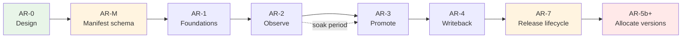

# App Registry — Delivery Plan

Phased build-out of `//tools/app_registry`. Each phase has a **plan ID** (AR-M,
AR-1, AR-2a…). As-built detail for a completed phase is recorded in that
phase's section below — this file is the single record, so a reader never has
to reconcile it against a separate tracking document.

(Earlier phases kept a per-phase `TODO-<PLAN_ID>.md` alongside this file. The
convention was applied to only half the phases before being dropped; those
files were retired in AR-6b and anything still load-bearing was folded into
the phase sections here.)

Read [ARCHITECTURE.md](ARCHITECTURE.md) before executing any phase.

---

## Current status

*Last updated at the start of the AR-2d/AR-3 session. **AR-M through AR-2c are
all merged to `main`.***

| Phase | PR | State |
|---|---|---|
| AR-M | [#495](https://github.com/whale-net/everything/pull/495) | merged |
| AR-1 | [#496](https://github.com/whale-net/everything/pull/496) | merged |
| AR-2a | [#499](https://github.com/whale-net/everything/pull/499) | merged — verified against real Postgres |
| AR-2b | [#500](https://github.com/whale-net/everything/pull/500) | merged — charts byte-identical |
| AR-2c | [#502](https://github.com/whale-net/everything/pull/502) | merged — CI path unexercised until the registry is deployed |
| dbtest | [#498](https://github.com/whale-net/everything/pull/498) | merged — `libs/go/dbtest` available |

The registry is being deployed to `dev` by the repo owner. `app-registry-api`
and `app-registry-migration` images publish from `apps=all`.
`APP_REGISTRY_CICD_OPT_IN` is still unset, so CI makes no registry calls.

**AR-3 is now fully implemented** (AR-3a through AR-3d), stacked on top of
`main` and not yet merged. AR-2d is also done, not merged. **AR-4 (AR-4a +
AR-4b) is now also fully implemented**, stacked on `ar-4a-temporal` /
`main` and not yet merged -- the writeback *contract* (outbox, worker,
workflow, stub activity) is done; the real gitops/S3 publish is deliberately
still out of scope (see AR-4b below).

**AR-5a (inert foundations) is also done, not merged** — see "AR-5" below
for what it delivered and what is deliberately still missing before any
domain can be cut over.

**AR-7 (issue #558) is designed, nothing implemented.** It makes a release run
hermetic — no dependency on `main`'s reconcile having gone first — via an
artifact `allocated → publishing → published` lifecycle, an identity/manifest-
snapshot split of `app`, and a run log CI writes to. It is a prerequisite for
the AR-5 cutover, and AR-7a/AR-7b fix two failure modes that are silent on
`main` today. Design is in ARCHITECTURE.md's "Release lifecycle (issue #558)";
delivery is "AR-7" below.

**Where deferred work is tracked.** Three places, deliberately:
[Carry-over items](#carry-over-items) for small cross-cutting gaps that
belong to no single phase; each phase's own **"Deliberately NOT done"**
subsection for scope that phase consciously left (AR-5's is the
cutover itself); and "Explicitly out of scope" at the end of this document
for things no phase will do. If you are picking this up cold, read those
three before starting anything.

### AR-3d — CLI + `promote.yml` — done

- `app-registry promote`/`rollback`/`status`/`history`/`diff` filled in
  (`tools/app_registry/cli/cmd/promote.go`) — these commands already existed
  as an AR-1 skeleton wired to the RPCs AR-3c just implemented; AR-3d is the
  pass that made them real. `--idempotency-key` on `promote`/`rollback` is
  now optional: a UUID is generated when omitted
  (`promoteIdempotencyKey`), matching ARCHITECTURE.md "Idempotency"'s
  human-promotion convention. `promote`'s `already_promoted` and both
  commands' `dry_run` are surfaced as explicit stderr notes so neither looks
  like a write happened. `status` prints every `DriftEntry` as a stderr
  banner ahead of the JSON body — the failure mode of a drifted environment
  that looks clean was the whole reason this command exists. `diff` computes
  its result client-side from two `GetEnvironmentState` calls (per this
  document's AR-3d scope note below — no server-side diff RPC), matching
  targets by `image:<app_id>` / `chart:<chart_id>` and omitting entries whose
  digest agrees on both sides. `history` combines `ListPromotions` and
  `ListPromotionEvents`, formatted together via a new `printCombinedResponse`
  helper since no single RPC returns both.
- Unit tests for `diffEnvironmentStates` (both-empty, only-in-A, only-in-B,
  digest-differs, identical-digest-omitted) and `promoteIdempotencyKey`
  (generates when empty, preserves when given) —
  `tools/app_registry/cli/cmd/promote_test.go`. The identical-digest-omitted
  guard was verified to actually matter: temporarily forcing the "different"
  branch unconditionally turned that test red, then reverted.
- `.github/workflows/promote.yml`: human-triggered `workflow_dispatch`,
  inputs `environment`/`action` (promote or rollback)/`owner_full_name`/
  `version`/`reason`/`allow_override`/`dry_run`. Its job declares
  `environment: ${{ inputs.environment }}` — the security-critical line that
  scopes the job to that GitHub Environment's `app-registry-promoter-<env>`
  secret and triggers its required reviewers, per the credential model below.
  Not `continue-on-error`, unlike the AR-2c recording steps: a failed
  promotion must fail the run.
- `.github/workflows/release.yml`: wired the builder credential (repository
  secret `APP_REGISTRY_BUILDER_CLIENT_SECRET` + repository variable
  `APP_REGISTRY_AUTH_TOKEN_URL`) into the two existing AR-2c recording steps
  so they authenticate once the server runs `oidc` — this closes the gap
  DEPLOY.md §4 flagged (recording silently going stale because
  `continue-on-error` masked `Unauthenticated`). `continue-on-error` and the
  `APP_REGISTRY_CICD_OPT_IN` gate are unchanged.
- Docs: `cli/README.md` (all commands documented, no longer "not yet
  implemented"), `ENV.md` (new CI-side variable/secret names and their
  mapping), `DEPLOY.md` (§4 warning resolved, new §6 for `promote.yml`,
  promoter clients moved from "⏳ later" to "now").
- **Static-only, not executed:** `promote.yml` and the `release.yml` auth
  wiring cannot run without a deployed, `oidc`-mode registry and real
  Keycloak clients/secrets — neither exists yet outside this session. Both
  were checked for YAML validity only (`python3 -c "import yaml..."`), not
  run. `bazel test //tools/app_registry/...` and `bazel build
  //tools/app_registry/...` are green.

### AR-2c — merged

- `.github/workflows/release.yml` calls the CLI after image and chart pushes:
  the `release` job resolves each pushed image's digest
  (`docker buildx imagetools inspect`) and calls `builds record` +
  `artifacts record --kind image`; `release-helm-charts` reads the AR-2b
  compose-time lockfile via `read-chart-lockfile --skip-build`, resolves each
  pinned image's digest, and calls `artifacts record --kind chart --contains
  ...`. Every step gated on `if: vars.APP_REGISTRY_CICD_OPT_IN == 'true'` and
  `continue-on-error: true`.
- CLI write commands: `app-registry builds record`, `app-registry artifacts
  record` (the read commands — `apps list/get`, `artifacts
  list/get/resolve` — already existed from AR-2a).
- `app-registry-api`'s `app_type` changed from `internal-api` to
  `external-api`: GitHub Actions runs outside the cluster and needs an
  ingress path to reach it. No `ingress_host` is set in `release_app` — an
  explicit host is used as-is in every environment (see
  `tools/helm/templates/ingress.yaml.tmpl`), so the real hostname belongs in
  a per-environment values override at deploy time, not baked into the
  manifest.
- `tools/app_registry/BUILD.bazel` (new): `release_helm_chart` target
  `app_registry_chart` bundling the `api` and `migration` app_metadata
  targets (`deploy_unit = "none"` apps, like the CLI, are excluded).
- `tools/app_registry/cli/BUILD.bazel`: added a `release_app` for the CLI
  (`deploy_unit = "none"`) so `app-registry-cli` publishes as an image and
  can be run via `docker run`/`bazel run` instead of a local build.

Safe with the registry undeployed: with the variable unset, CI makes no registry
calls at all.

### AR-2d — Postgres repository test coverage — done, not merged

**Goal:** close the top carry-over gap below. `server/repository/postgres/*.go`
is compile-checked only; two real bugs shipped past green tests in AR-2a
because the in-memory fake has no transactions.

**Scope**
- `server/repository/postgres/postgres_integration_test.go` behind
  `//go:build integration`, using `libs/go/dbtest`, applying the real
  migrations (not hand-written DDL) so schema drift is caught too. The real
  migrations were not reusable as-is: `migrate/main.go`'s `//go:embed` lived
  in `package main`, which a test package cannot import. Smallest fix: moved
  `migrate/migrations/` to `migrate/schema/migrations/` behind a new
  `migrate/schema` package exporting `schema.Migrations embed.FS` /
  `schema.Dir`; `migrate/main.go` now calls `migrate.RunCLI(schema.Migrations,
  schema.Dir)`. No SQL duplicated.
- `go_test` target `postgres_integration_test` copying
  `//libs/go/dbtest:postgres_constraints_test`'s tag set exactly (`external`,
  `integration`, `manual`, `no-cache`, `no-sandbox`, `requires-network`),
  hand-written with a `# keep` marker (gazelle skips `//go:build integration`
  files, and won't regenerate or remove this rule — verified against a real
  `bazel run //:gazelle`).
- Covers the paths the fake cannot: transaction rollback on a failed
  statement mid-`RecordArtifact` (a duplicate `artifact_link` insert aborts
  the whole write, no partial artifact row survives), idempotency-key replay
  returning the stored response without double-writing (proven with a
  *different* payload on the replay call, so it can't be confused with the
  natural-key dedup every write already has), the real `artifact_version_idx`
  unique index rejecting a same-owner/kind/version collision the app-level
  digest pre-check would miss, and `ResolveArtifact`'s chart→image join.
- **Deferred, not in this pass:** the SCD2 `promotion_current_idx` partial
  unique index — the `promotion` table doesn't exist yet (ships in migration
  `002`, AR-3). Add its test alongside that migration.
- **CI now runs this target** — the `Test Database Integration` job in
  `.github/workflows/ci.yml`, added after AR-3a. It discovers targets by
  querying for tests that depend on `//libs/go/dbtest`, so new dbtest-backed
  tests need no CI change. This closed a real gap: because the target is
  `manual`, nothing ran it, and AR-3a's auth enforcement broke it in a way only
  caught by running the stacked branches together by hand.

**Exit criteria** — met. Each new test was verified to fail when the
behaviour it guards was deliberately broken, then reverted. `bazel test
//tools/...` and `bazel build //tools/...` stay green on a Docker-less path —
the `manual` tag excludes the new target from wildcard expansion.

### Carry-over items

- **`server/repository/postgres/*.go` has no automated test coverage.** ~~Handler
  logic is tested against the in-memory fake; the SQL is compile-checked only.~~
  **Resolved by AR-2d** — see `postgres_integration_test.go`. The SCD2
  `promotion` table's partial unique index is still untested; it doesn't
  exist until AR-3's migration `002` lands (see AR-2d's scope note above).
- **Auth is unimplemented.** ~~Handlers check no claims; the Tiltfile runs
  `GRPC_AUTH_MODE=none`.~~ **Resolved by AR-3a** — role model in
  `server/auth`, enforced on every RPC. Note `GRPC_AUTH_MODE` still
  *defaults* to `none`, in which the server grants every caller every role;
  that is intentional (Tilt and local dev depend on it) and is the
  deployer's responsibility to override. See DEPLOY.md §3.
- **Transaction-abort hazard for AR-3.** A failed statement aborts the
  surrounding Postgres transaction, so any error-message or logging code that
  queries afterwards silently degrades. This bit `RecordArtifact` once already;
  AR-3's SCD2 close-and-open writes are transactional and will hit the same trap.
- **Tilt is validated and documented** — see [TESTING.md](TESTING.md). It is the
  only thing currently exercising the pgx layer.
- `list-apps --format json` prints `deploy_unit` as an integer. Cosmetic; no CI
  path reads it.
- **`promotion_event.temporal_workflow_id` / `temporal_run_id` are never
  stamped back** (AR-4b). `003_promotion.up.sql`'s schema comment anticipates
  them, and `WritebackOutbox.EventID` exists precisely so the worker can do
  it, but nothing writes them — so an operator cannot jump from an audit row
  to its Temporal workflow history. Needs an `event_id`-keyed update path
  from the worker.
- **Temporal `WorkflowIDReusePolicy` is left at the SDK default** (AR-4b),
  reasoned about in `worker/outbox/drain.go`'s comments but never
  independently stress-tested. Relevant because workflow id = promotion id,
  so reuse semantics decide what happens when a promotion is retried.
- **`--format table` is unimplemented across the whole CLI** — every command
  falls back to JSON with a `# table format not implemented yet` notice
  (`cli/cmd/client.go`, `cli/cmd/util.go`). Pre-existing, cosmetic, but the
  flag is advertised.
- **No admin/web UI.** Deferred as non-critical for launch. PLAN.md's
  out-of-scope list notes the CLI is kept thin specifically so a UI can be
  added without reimplementing rules server-side.

## Sequencing rationale

Promotion tracking is additive and low-risk; replacing git-tag version
allocation moves an existing working source of truth into a stateful service.
Do the first, prove it, then do the second. Shipping AR-5 before AR-3 would put
a registry outage in the path of every release before the registry has delivered
anything.

**AR-7 (issue #558) sits between AR-4 and the AR-5 cutover**, despite its
number. AR-5a's inert foundations already landed; the cutover to `allocate`
must not happen before AR-7, because version allocation happens *before* a
build exists, so a release will need identity resolved even earlier than it
does today — the release-vs-reconcile gap gets strictly worse under AR-5, not
better. AR-7a and AR-7b are independently valuable and can land at any time.

AR-M stands alone and delivers value with or without the registry — it fixes
drift that exists today. It is sequenced first because AR-2 otherwise adds a
third manifest representation to the two that already disagree.

---

## AR-0 — Design and contracts

**Status:** complete (this document, `ARCHITECTURE.md`, `README.md`, `protos/`).

**Delivered**
- Proto contracts for all four services, compiling under
  `//tools/app_registry/protos:appregistrypb`.
- Data model, promotability rule, authorization split, writeback mechanism.

**Exit criteria** — met when the promotability model and the chart→image
lockfile approach are agreed, since both touch existing code.

---

## AR-M — Manifest schema consolidation

**Goal:** one definition of what a `release_app` manifest contains. Independent
of the registry — this repays itself immediately by removing existing drift.

**Why first:** `release_helper_go` and `tools/helm/composer.go` both decode the
manifest JSON into their own structs, and they disagree with each other and with
the Starlark rule (see the table in [`../appmeta/README.md`](../appmeta/README.md)).
Adding the registry as a third consumer before fixing this compounds the
problem.

**Scope**
- `//tools/appmeta/proto` — `AppManifest`, `ChartManifest`, `AppManifestSet`,
  `DeployUnit`. *(done in AR-0; consumers not yet migrated)*
- Contract test `//tools/appmeta:manifest_contract_test`, both directions:
  every `app_metadata` target decodes with `DiscardUnknown: false`, and a
  full-coverage fixture app leaves no proto field unset.
- Migrate `tools/helm/composer.go` to `appmetapb.AppManifest`. The dead
  `labels` / `annotations` / `dependencies` fields and the map-iteration
  nondeterminism that would have made the golden-output test below impossible
  are handled separately, in the `helm-deterministic-output` change. That must
  land before this step.
- Migrate `tools/release_helper_go` to `appmetapb.AppManifest`.
- **Remove the `Language`-as-version hack** in `cmd/plan.go` (`apps[i].Language
  = version`, read back via `strings.HasPrefix(app.Language, "v")`), now that
  `version` is a real field. Separate reviewable commit — this changes
  behaviour, not just types.
- Add `deploy_unit` to `release_app` and set it on standalone-image apps
  (e.g. `manmanv2-host-manager`).

**Exit criteria**
- No hand-written manifest struct remains in `tools/`.
- Contract test fails when a rule attr is added without a proto field, verified
  by deliberately breaking it once.
- `bazel test //tools/...` green; a release dry-run produces byte-identical
  charts and plans to before the migration.

**Risk:** the helm composer is on the critical path for every chart build.
Migrate it behind a golden-output test comparing rendered charts pre/post.

---

## AR-1 — Foundations

**Goal:** everything the service needs to exist, with no business logic.

**Scope**
- `tools/app_registry/migrate` — `golang-migrate` runner over embedded SQL,
  following `manmanv2/migrate`. Schema per ARCHITECTURE.md, including the SCD2
  partial unique index and `v_current_promotion`.
- `tools/app_registry/server` — gRPC server skeleton: `libs/go/db` pool,
  `libs/go/grpcauth` interceptors, otelgrpc, reflection, health check. All RPCs
  return `UNIMPLEMENTED`.
- `tools/app_registry/cli` — Cobra skeleton with a thin gRPC client.
- `release_app` manifests for `app-registry-api` and `app-registry-migration`.
- Tilt wiring for local development.

**Exit criteria**
- `bazel test //tools/app_registry/...` green.
- Migrations apply and roll back cleanly.
- Server starts in Tilt and answers reflection + health.

**Risks** — Read `docs/DOCKER.md` before touching image builds; ARM64 breakage
is silent at build time.

**Note:** Temporal moved out of this phase into AR-4. Nothing before the
writeback needs it, and it was the largest unknown here.

---

## AR-2 — Observe (additive recording)

**Goal:** the registry knows everything CI published. Git tags stay
authoritative. Nothing depends on the registry yet.

**Scope**
- Implement `AppRegistry.ReconcileApps`, `ListApps`, `GetApp`, `ListCharts`,
  `SetAppStatus`.
- Implement `ArtifactRegistry.RecordBuild`, `RecordArtifact`, `ListArtifacts`,
  `GetArtifact`, `ResolveArtifact`.
- Idempotency-key storage and replay.
- **`tools/helm/composer.go`: emit a chart lockfile** resolving pinned images to
  digests.
- `release_helper_go`: emit an `AppManifestSet` from `plan` output. No
  conversion code — AR-M made this the same type the registry accepts.
- `.github/workflows/release.yml`: call `app-registry` CLI after image and chart
  pushes. **Best-effort — `continue-on-error`, must never fail a release.**
- **Every registry step gated on `if: vars.APP_REGISTRY_CICD_OPT_IN == 'true'`.**
  Default (unset) means CI makes no registry calls whatever, so the pipeline that
  builds and releases the registry never depends on the registry already being
  deployed. See ARCHITECTURE.md → "`APP_REGISTRY_CICD_OPT_IN` — the bootstrap
  kill switch". This is a hard requirement, not a nicety: the repo ships with it
  off and stays that way until the registry is deployed and its secrets exist.
- CLI: `apps list`, `apps get`, `artifacts list`, `artifacts resolve`.

**Exit criteria**
- Every release for a soak period appears in the registry.
- A parity check confirms registry artifacts match git tags with zero drift.
- `artifacts resolve` on a chart returns correct image digests.

**Soak:** run for several weeks of real releases before starting AR-3. Do not
compress this — it is the phase that earns the trust AR-5 spends.

---

## AR-3 — Promotion

**Goal:** promotion state is recorded and queryable. Still nothing consumes it.

**Split into a 4-PR stack**, auth first so the "a builder cannot promote" exit
criterion is testable from the moment promotion exists:

| PR | Scope |
|---|---|
| **AR-3a** | Auth only — role model, interceptor plumbing, enforcement on the RPCs that exist today, CLI service-account credentials. No promotion logic. |
| **AR-3b** | `EnvironmentRegistry` (all RPCs), `dev`/`stage`/`prod` seeding, environment-scoped `allowed_principals`. |
| **AR-3c** | `PromotionRegistry` — SCD2 close-and-open, event log, promotability enforcement, `allow_override` + drift reporting. |
| **AR-3d** | CLI (`promote`, `rollback`, `status`, `history`, `diff`) and the human-triggered `promote.yml` workflow. |

### AR-3a — Auth — done

- `server/auth` package: role constants (`app-registry-builder`,
  `app-registry-promoter-{dev,stage,prod}`, `app-registry-admin`, matching
  KEYCLOAK.md exactly) + `Require`/`RequirePromoter`/`RequireAuthenticated`
  helpers over `grpcauth.ClaimsFromContext` — `codes.Unauthenticated` with no
  claims, `codes.PermissionDenied` with the wrong role. Roles are flat, no
  role implies another.
- Enforced on every RPC that existed at this point: `AppRegistry.ReconcileApps`
  / `ArtifactRegistry.RecordBuild`/`RecordArtifact` require `RoleBuilder`;
  `AppRegistry.SetAppStatus` requires `RoleAdmin`; every read RPC requires only
  `RequireAuthenticated`. `EnvironmentRegistry`/`PromotionRegistry` did not
  exist yet — AR-3b/AR-3c wire their own RPCs against `RequirePromoter`/
  `RoleAdmin` directly, unmodified from what this phase built.
- `libs/go/grpcauth`: added `ServerConfig.DevRoles` (in `none` auth mode, dev
  claims default to `Roles: ["admin"]`, which satisfies none of
  `app-registry-*`'s checks; `server/main.go` overrides this with
  `server/auth.AllRoles()` so local dev and CI running with `GRPC_AUTH_MODE`
  unset keep working) and exported `ContextWithClaims` for handler tests.
  Both additive, `manmanv2` unaffected.
- CLI (`cli/cmd/client.go`) wired to `grpcauth.NewServiceAccountDialOption`
  from the four `GRPC_AUTH_*` env vars, the same shape `manmanv2/host` and
  `manmanv2/log-processor` use. `GRPC_AUTH_MODE=none` (the default) is
  unchanged.
- Tests: `server/auth/auth_test.go` (the role-check logic itself) and
  `server/handlers/authz_test.go` (per protected RPC — correct role allowed,
  wrong role → `PermissionDenied`, no claims → `Unauthenticated`).
- **Explicitly not done here:** `EnvironmentRegistry`/`PromotionRegistry`
  business logic (still `Unimplemented` at this point) — AR-3b/AR-3c/AR-3d.
  No changes to `.github/workflows/release.yml`; wiring real Keycloak
  secrets into CI came later, in AR-3d.
- Verification: `bazel test //tools/app_registry/... //libs/go/grpcauth/...`
  and `bazel build //tools/...` green.

### AR-3b — `EnvironmentRegistry` — done

- Migration `002_environment_registry` (up/down): `environment` table —
  `key` unique, `rank`, `requires_approval`, `gitops_path`,
  `allowed_principals TEXT[]`, `archived`, `created_at`. Seeds
  `dev`(rank 0)/`stage`(rank 10)/`prod`(rank 20) via
  `INSERT ... ON CONFLICT (key) DO NOTHING`, safe against a database the
  registry is already deployed to. **No `promotion` table** — that stays in
  AR-3c's own migration `003`, which needs `environment.environment_id` to
  exist first as an FK target. `migrate/README.md`'s "Planned migrations"
  table corrected accordingly.
- `repository.EnvironmentRepository` (`Upsert`/`Get`/`List`/`Archive`) +
  postgres and fake implementations. All four `EnvironmentRegistry` RPCs
  implemented in `server/handlers/environment.go`: writes require
  `auth.RoleAdmin`, reads require `auth.RequireAuthenticated`. Neither
  `UpsertEnvironment` nor `ArchiveEnvironment` carries an `idempotency_key`
  in the proto, so neither goes through `runIdempotent` — same shape as
  `AppRegistry.SetAppStatus`.
- Postgres integration coverage added: migration 002 applying/seeding
  verified against real Postgres (plus a manual up/down/up round-trip
  outside `bazel test`), the real `UNIQUE (key)` constraint firing, and a
  full `Upsert` round-trip including the `TEXT[]` `allowed_principals`
  column. Caught one real bug in the process: pgx encodes a nil Go
  `[]string` as SQL `NULL`, which the `NOT NULL allowed_principals` column
  rejected — fixed by normalizing to `[]string{}` before insert.
- **Seeding decision: migration, not server startup.** The
  `dev`/`stage`/`prod` seed rows are inserted by migration `002` itself
  (`INSERT ... ON CONFLICT (key) DO NOTHING`), not by application code at
  boot. Reasons: it is the same one-shot-DDL-plus-bootstrap-data pattern
  every other migration in this package uses; `ON CONFLICT DO NOTHING` makes
  it idempotent and non-destructive even if an operator already
  hand-edited `dev`'s `allowed_principals` via `UpsertEnvironment` before
  this migration ran; and `golang-migrate`'s advisory lock already solves
  the "two replicas starting concurrently" problem that server-startup
  seeding would have to solve again from scratch. This mirrors the same
  trade already made for `domain_adoption` in migration `001`.

### AR-3c — `PromotionRegistry` — done

- Migration `003_promotion` (up/down): `promotion` (SCD2 — `valid_from`/
  `valid_to`, partial unique index `promotion_current_idx ON promotion
  (environment_id, target_key) WHERE valid_to IS NULL`, plus
  `promotion_window_idx` for historical/`--at` reads), `promotion_event`
  (append-only, NOT SCD2 per AGENTS.md), and `v_current_promotion` (pre-joins
  promotion → artifact → environment for the current-state read path).
  `target_key` is `"<kind>:<owner_full_name>"`, denormalized so the partial
  unique index doesn't need a nullable two-column target; everything else
  about the promoted artifact is read via a join to `artifact` rather than
  copied onto `promotion`, so there is exactly one place it can drift from.
- `repository.PromotionRepository` (`Promote`/`GetCurrent`/`GetPrevious`/
  `StateAt`/`ListPromotions`/`RecordEvent`/`ListEvents`) + postgres and fake
  implementations. `Promote` performs the SCD2 close-and-open write
  described in AGENTS.md as three statements (read current, close it, open
  the new row) that the caller MUST run inside `Registry.WithTx` — none of
  the repository methods open their own transaction, matching every other
  repository in this package.
- All five `PromotionRegistry` RPCs implemented in
  `server/handlers/promotion.go`. `Promote`/`Rollback` require
  `auth.RequirePromoter(ctx, environment_key)` (environment-scoped, not a
  flat role); the read RPCs require `auth.RequireAuthenticated`.
- Business rules, all enforced in the handler (repository stays free of
  gRPC/proto concerns, matching the rest of this package):
  - **Promotability.** `NOT_PROMOTABLE` is rejected outright. `VIA_CHART`
    requires `allow_override`; when set, the promotion is stored with
    `is_override = true`.
  - **Drift reporting.** `GetEnvironmentState` cross-references every
    `is_override` image promotion against the pinned digest of any chart
    promotion covering the same app in the same state snapshot, and reports
    a mismatch as a `DriftEntry` on the chart's `EnvironmentStateEntry`.
  - **`reason` required above rank 0**, checked against the resolved
    `Environment.Rank` (dev is rank 0 by convention) — applies to both
    `Promote` and `Rollback`.
  - **`already_promoted` short-circuit.** Re-promoting the artifact that is
    already current is detected before the SCD2 write and returns the
    existing row instead of creating a redundant history entry — not a
    correctness requirement from ARCHITECTURE.md, but avoids inflating audit
    history with no-op repeats. A deliberate design call; the CLI can be
    made to skip this check if it should be a hard error instead.
- `Rollback` is `GetPrevious` + `Promote`: it re-promotes whatever
  `GetPrevious` reports as the most recently superseded row for the target,
  recording `PROMOTION_ACTION_ROLLBACK`.
- Postgres integration coverage added, all verified against real Postgres
  (see `postgres_integration_test.go`): the partial unique index
  `promotion_current_idx` rejecting two concurrent current rows for the same
  target (the test AR-2d's carry-over note flagged as deferred until this
  table existed), promote→promote leaving exactly one current row with the
  prior row's `valid_to` set, `StateAt` returning the correct historical row
  for a timestamp strictly between two promotions, `GetPrevious` + `Promote`
  round-tripping a rollback, and a transaction-abort test proving the
  close-half of close-and-open does not survive when the open-half's INSERT
  fails (verified to actually catch the bug by temporarily bypassing
  `WithTx` in the test and observing the row count drop to zero).

### Credential model (decided)

**Keycloak service accounts**, not GitHub Actions OIDC. `libs/go/grpcauth`
validates a single Keycloak-style issuer and reads roles from
`realm_access.roles`; teaching it GitHub's issuer and `sub`-claim scoping is real
scope in a library `manmanv2` also depends on, and is not worth it here.

- One Keycloak client per caller identity: `app-registry-builder`,
  `app-registry-promoter-{dev,stage,prod}`, `app-registry-admin`.
- One realm role per identity, service-name-prefixed.
- **Environment scoping comes from GitHub Environments**, not the token: the
  `promoter-prod` client secret lives on the `prod` GitHub Environment, so only a
  job declaring `environment: prod` can read it — and that declaration is what
  triggers required reviewers. The builder credential is a different client whose
  token carries no promoter role, so it cannot promote regardless.
- **Setup guide: [`libs/go/grpcauth/KEYCLOAK.md`](../../libs/go/grpcauth/KEYCLOAK.md)**
  — realm/client/role configuration step by step, and the reference pattern for
  service-to-service auth in this repo.
- Reconsider GitHub OIDC natively (secretless CI) only after this is proven.

**Remaining scope**
- SCD2 close-and-open in one transaction; promotion event log.
- Promotability enforcement, including `allow_override` and drift reporting.
- `reason` required above rank 0.

**Exit criteria**
- Promote/rollback round-trips correctly; `GetEnvironmentState --at <T>` returns
  correct historical state.
- Attempting to promote a `VIA_CHART` image without `allow_override` is
  rejected; with it, drift is reported.
- The builder credential is verifiably unable to promote.

---

## AR-4 — Writeback interface (stub implementation)

**Goal:** establish the contract that carries promotion state out of the
registry, without wiring it to anything. Publishing targets live in another
repo and are out of scope.

**Split into two PRs** once it became clear the Temporal SDK's Bazel
integration and the outbox/workflow logic were separable risks worth landing
independently:

| PR | Scope |
|---|---|
| **AR-4a** | Temporal Go SDK foundations — get `go.temporal.io/sdk` building under Bazel, `libs/go/temporal` (client/worker bootstrap, env config, logging bridge), and a Temporal dev server in Tilt. No outbox, no workflow, no worker binary. |
| **AR-4b** | `writeback_outbox`, `tools/app_registry/worker`, `WritebackWorkflow`/`Writeback` activity (stub implementation), `state_hash`, `release_app` for `app-registry-worker`. |

### AR-4a — Temporal Go SDK foundations — done

- Added `go.temporal.io/sdk` (v1.44.0) to `go.mod`; resolved transitively by
  Bazel's `go_deps.from_file` with **no `gazelle_override` needed** — the
  dependency tree (`go.temporal.io/api`, grpc-middleware, nexus-rpc,
  robfig/cron, etc.) built cleanly. Only change to `MODULE.bazel` was adding
  `io_temporal_go_sdk` to the `go_deps` `use_repo()` list, via `bazel mod
  tidy`. This was expected to be "the largest unknown in the project" — it
  turned out not to need any patching.
- `libs/go/temporal`: `ConfigFromEnv()` (`TEMPORAL_HOST`/`TEMPORAL_NAMESPACE`/
  `TEMPORAL_TASK_QUEUE`), `NewClient()`, `NewWorker()`, and `NewLogger()` — a
  thin wrapper around the SDK's own `log.NewStructuredLogger(*slog.Logger)`
  bridging to `libs/go/logging`. See `libs/go/temporal/README.md`.
- `tools/tilt/common.tilt`: `setup_temporal()` deploys `temporal server
  start-dev` (image `temporalio/temporal`) via an inline manifest — the
  shared dev-util Helm repo has no Temporal chart. Wired into
  `tools/app_registry/Tiltfile` as `temporal-dev`, matching the resource name
  `friendly_computing_machine/Tiltfile` already expects at
  `temporal-dev.<namespace>.svc.cluster.local:7233`.

### AR-4b — Outbox and writeback workflow — done, not merged

- Migration `004_writeback_outbox` (up/down): `writeback_outbox` table --
  `pending`/`claimed`/`done`/`failed` status, `state_hash`, `event_id` FK
  back to `promotion_event`, partial indexes backing the pending-drain and
  stale-reclaim queries. Not SCD2 (a work queue, not a dimension) -- see
  AGENTS.md.
- `server/handlers/promotion.go`'s `enqueueWriteback`, called from both
  `Promote`'s and `Rollback`'s write path (never on the `dry_run` or
  `AlreadyPromoted` short-circuit branches -- no new promotion, nothing to
  write back), extends AR-3c's existing SCD2 close-and-open transaction
  rather than opening a second one -- see `repository.Registry.WithTx` and
  `AGENTS.md` "SCD2". `state_hash` is computed inside that same transaction
  by the same `stateHash` function `GetEnvironmentState` uses (refactored to
  take `repository.Promotion` directly, so no proto conversion is needed
  just to hash), guaranteeing the value on the outbox row agrees with what
  `GetEnvironmentState` returns immediately after commit.
- `repository.WritebackRepository` (`Enqueue`/`ClaimBatch`/`MarkDone`/
  `MarkFailed`/`Get`) + postgres and fake implementations.
  `ClaimBatch` is one atomic `UPDATE ... WHERE outbox_id IN (SELECT ... FOR
  UPDATE SKIP LOCKED)` statement claiming every `pending` row plus every
  `claimed` row whose claim has gone stale.
- `tools/app_registry/worker` (`app-registry-worker`, `app_type: worker`):
  `outbox.Drainer` polls `writeback_outbox` directly against Postgres (not
  through the gRPC API) and calls `client.ExecuteWorkflow` with workflow id
  = promotion id; `writeback.WritebackWorkflow` over a `Writeback` activity
  interface (`RenderEnvironmentState`, `Publish`) dispatched by string name,
  not Go function value, so the workflow depends on the interface, not on
  which implementation is registered. `writeback.StubActivities` is AR-4b's
  stub: `RenderEnvironmentState` reads `GetEnvironmentState` over gRPC (never
  Postgres directly); `Publish` writes to a local path
  (`WRITEBACK_OUTPUT_DIR`) and is a no-op when a sidecar file shows the
  `state_hash` already matches. See `worker/README.md` for the full
  mechanism.
- Unit tests: `writeback/workflow_test.go` (Temporal SDK `testsuite`,
  render-then-publish sequencing and render-failure short-circuit),
  `writeback/stub_test.go` (no-op detection, per-environment isolation),
  `outbox/drain_test.go` (`Drainer.startWorkflow`'s success /
  already-started / other-error branches against a mocked
  `go.temporal.io/sdk/mocks.Client`). Real-Postgres coverage in
  `postgres_integration_test.go`:
  `TestWriteback_EnqueueCommitsAtomicallyWithPromotion`,
  `TestWriteback_EnqueueFailureRollsBackWholeTransaction` (forces the
  outbox insert to fail an FK check and proves the promotion + event rows
  written earlier in the same transaction roll back too), and
  `TestWritebackOutbox_ClaimBatch_SkipsLockedAndReclaimsStale`.
- `release_app` for `app-registry-worker` added to
  `//tools/app_registry:app_registry_chart`; cross-compiles to `arm64`
  cleanly (verified: `bazel build //tools/app_registry/worker:worker_image
  --platforms=//tools:linux_arm64`). Wired into the Tiltfile
  (`ENABLE_APP_REGISTRY_WORKER`, depends on migration/API/`temporal-dev`).
- `go.temporal.io/api` moved from an indirect to a direct `go.mod`
  dependency (the outbox drain loop imports
  `go.temporal.io/api/serviceerror` directly), and
  `io_temporal_go_api` added to `MODULE.bazel`'s `go_deps` `use_repo()` via
  `bazel mod tidy` -- the same one-line pattern AR-4a used for
  `io_temporal_go_sdk`.

**Exit criteria**
- A promotion enqueues an outbox row in the same transaction and the workflow
  drains it exactly once, verified by killing the worker mid-run. **Met** --
  verified manually (real Postgres + real `temporal server start-dev` in
  Docker + the real `app-registry-api`/`app-registry-worker` binaries via
  `bazel run`, not Tilt/k8s): a worker process was made to exit immediately
  after logging that it had started `WritebackWorkflow` but before calling
  `MarkDone`, leaving the outbox row `claimed`; a second worker process
  reclaimed it once `WRITEBACK_CLAIM_STALE_AFTER` elapsed, attached to the
  *same* still-open workflow run (Temporal's own id-collision handling, not
  a second execution), and drove it to completion with no duplicate
  publish. See `TESTING.md`'s "Writeback worker (AR-4b)" section for the
  full transcript. Not independently verified: a true two-workers-racing
  claim (the `FOR UPDATE SKIP LOCKED` query's correctness is asserted
  against real Postgres, not exercised by two concurrent live processes).
- Rendered state matches `GetEnvironmentState` output. **Met** -- confirmed
  byte-for-byte in the same manual run (the `state_hash` in the published
  document and in a live `GetEnvironmentState` call agreed).
- The activity interface is documented well enough that swapping the stub for a
  gitops committer needs no schema, proto, or workflow change. **Met** --
  see `worker/README.md`'s "The `Writeback` activity interface" section.

**Explicitly not in scope:** committing to the gitops repo, S3 publication,
pointing ArgoCD at registry-written state. Those land when the other repo's
changes are ready.

**Consequence to track:** the "registry can be down without blocking a deploy"
property is not actually exercised until the real writeback ships. Do not claim
it as verified before then.

---

## AR-5 — Version allocation

**Goal:** the registry becomes the version source of truth. Highest risk —
CI now depends on the registry being up.

### AR-5a — Inert foundations — done, not merged

**Goal:** everything `AllocateVersion` needs, fully implemented and tested,
with no release able to reach it. See ARCHITECTURE.md's "Version model
(AR-5a)" for the as-built design.

**Delivered**
- Migration `005_version_allocation`: `artifact.version_major/minor/patch`
  (`INT NOT NULL`, backfilled — an unparseable legacy version becomes the
  documented `0/0/0` sentinel, not a failed deploy) plus
  `artifact_version_order_idx` for numeric "latest" ordering, and the new
  `version_allocation` reservation table (own unique index on `(owner_id,
  kind, version)`, since `AllocateVersionRequest` carries no digest/build_id
  and `artifact` requires both). `writeback_outbox`'s planned migration
  number moves from `004` to `005` — see `migrate/README.md`.
- `libs/go/semver`: the one shared parser/incrementer/comparator. Both
  `release_helper_go`'s `incrementVersion` (now delegating instead of
  hand-rolling regex/`strings.Split`) and the registry server consume it —
  no third copy. `incrementVersion` gained `major`; `plan.go` gained
  `--increment-major`, purely additive alongside the existing
  `--increment-minor`/`--increment-patch`.
- `ArtifactServer.AllocateVersion` fully implemented: validates the request,
  resolves the owner's domain, checks `domain_adoption.stage == 'allocate'`
  (`FailedPrecondition` otherwise), then runs a transactional insert into
  `version_allocation` inside `runIdempotent`'s `WithTx`, retrying in a
  **fresh** transaction (bounded, 5 attempts) on an auto-increment
  `ErrAlreadyExists` collision — an `explicit_version` collision is not
  retried, per the RPC's "fails if taken" contract. Idempotency-key replay
  sets `already_allocated = true` on the replayed response.
- `repository.DomainAdoptionRepository.GetStage` (postgres + fake), reading
  the `domain_adoption` table AR-1's migration already shipped. No write
  path/RPC exists yet in this change — cutting a domain to `allocate` is a
  direct `UPDATE domain_adoption` (or a raw INSERT, as the postgres
  integration tests do) until a real admin path is built.
- Unit tests (`libs/go/semver`): parse/increment including `major`,
  rejection of prerelease/build metadata, and the numeric-vs-lexical
  `Compare` guard directly.
- Handler tests against the fake (`server/handlers/artifact_test.go`):
  validation errors, the adoption-stage gate, major/minor/patch increments
  against a previously recorded artifact, idempotency-key replay, and
  explicit-version collision.
- **Real-Postgres integration tests** (mandatory — the fake cannot catch
  transactional/constraint bugs): `v1.9.0` vs `v1.10.0` ordering (seeded in
  reverse insertion order — proves the numeric columns, not insertion
  order, drive "latest"), 8 real concurrent goroutines each opening their
  own transaction racing to allocate the same owner's next patch (zero
  collisions, exactly 8 `version_allocation` rows), idempotency-key replay
  against the real handler, the adoption-stage gate rejecting a domain with
  no `domain_adoption` row, and migration 004's backfill (a clean version
  parses correctly, a garbage one backfills to `0/0/0`).
- **Every guard was deliberately broken and its test confirmed red before
  reverting**: the ordering index (`ORDER BY version` instead of the
  integer columns) → `TestAllocateVersion_OrderingIsNumericNotLexical` fails
  with `previous_version="v1.9.0"` instead of `"v1.10.0"`; the
  `version_allocation` unique index (made non-unique) →
  `TestAllocateVersion_ConcurrentCallsNeverCollide` fails with one version
  allocated 5 times out of 8; the adoption-stage gate (short-circuited with
  `if false &&`) → both the fake-backed and postgres-backed gate tests fail
  with `<nil>` instead of `FailedPrecondition`.
- Docs: this section, ARCHITECTURE.md's "Version model (AR-5a)",
  `migrate/README.md`'s planned-migrations table.

**Deliberately NOT done — the actual cutover remains AR-5b+**
- `plan.go`'s `autoIncrementVersion` call site is untouched: the git-tag
  path is the only one any release can reach, byte-for-byte identical to
  before this change, for every domain.
- No domain's `domain_adoption.stage` is set to `allocate` — the table has
  no rows written by this change at all.
- No CLI/admin path exists yet to move a domain to `allocate`; that is
  real, separate scope (probably its own small RPC/CLI surface) before a
  real cutover can happen without hand-editing the database.
- Seeding a domain's starting version from its existing tags at cutover
  time (this section's original scope item) is not implemented — nothing
  calls it yet, so building it now would be untested and unused.
- The "allocated versions match tag-scanning" parity check against AR-2 soak
  data has not been run (the soak itself, gating AR-5's start per this
  section's own note below, has not happened).
- The release workflow's version-allocation concurrency group is untouched.

**Scope**
- Implement `ArtifactRegistry.AllocateVersion` against a unique
  `(owner, kind, version)` constraint.
- Replace `autoIncrementVersion` in `tools/release_helper_go/cmd/plan.go`,
  gated on the calling domain's adoption stage.
- **Per-domain cutover.** `AllocateVersion` serves only domains at stage
  `allocate` and rejects the rest, so a misconfigured CI job fails loudly
  rather than silently allocating against the wrong source of truth. Cut over
  one low-traffic domain first, then widen.
- **Keep writing git tags** as a redundant record and disaster-recovery path.
- Seed each domain's starting version from its existing tags at the moment it
  is promoted to `allocate`, so numbering stays continuous.
- Remove the release workflow's version-allocation concurrency group once every
  domain has cut over — not before.

**Exit criteria**
- Concurrent releases of the same app cannot receive the same version.
- Allocated versions match what tag-scanning would have produced, verified
  against the AR-2 soak data.
- A domain not at `allocate` still releases through the tag path, unchanged.
- A documented, rehearsed fallback to tag-based allocation exists — per domain,
  by moving its stage back.

**Do not start** until AR-2's parity check has been clean across a meaningful
number of real releases.

### Addendum — semver semantics (decided)

Added after an audit of the existing version path found three gaps between
what `tools/release_helper_go` does today and what the registry needs in order
to *replace* git tags. These are decided; implement them as specified.

Today `plan.go` parses semver with a regex and bumps by splitting on dots, but
the "which version is latest" question is answered entirely by
`git tag --sort=-version:refname` — **git supplies the semver ordering, and it
disappears along with the tags.**

**1. Major bumps become first-class.** `incrementVersion`'s switch handles only
`minor` and `patch`; `major` returns `unknown increment type`, and `plan.go`
exposes only `--increment-minor` / `--increment-patch`. Chart bumping
(`build_helm.go`) already accepts all three, so the two halves of the release
system disagree. `AllocateVersionRequest.increment` is already documented as
`"major" | "minor" | "patch"`.

Add `major` to `incrementVersion` and an `--increment-major` flag to `plan.go`,
so the tag path and the registry path agree. Note the consequence for AR-5's
parity exit criterion: allocation is now a **superset** of what tag-scanning
produced, since the tag path could not express a major bump at all. That is
intentional — parity is asserted for minor/patch, not for a capability that
did not previously exist.

**2. Versions get a sortable representation. This is the load-bearing change.**
`artifact.version` is `TEXT` and the only index is
`UNIQUE (owner_id, kind, version)` — there is no ordering at all. Once tags are
gone, "what is the next patch?" is a SQL query, and `ORDER BY version DESC` on
`TEXT` is **wrong**: lexically `v1.9.0` sorts above `v1.10.0`, so the release
after `v1.10.0` would be computed as `v1.10.0` again — colliding with the
unique constraint, or silently renumbering.

Store the parsed version alongside the text:

- `version_major`, `version_minor`, `version_patch` — `INT NOT NULL`,
  populated at record/allocate time from the same parse.
- Index `(owner_id, kind, version_major DESC, version_minor DESC,
  version_patch DESC)` so "latest" and "next major/minor/patch" are one
  indexed lookup with correct ordering.
- The `UNIQUE (owner_id, kind, version)` constraint stays on the **text** form
  — it is the collision guard and must keep matching what is published.

A zero-padded sort key was rejected: it caps each component and reads badly in
`psql`. The integer triple also makes range queries ("every 1.x of this app")
expressible, which tags cannot answer without a client-side scan.

Existing rows must be backfilled by the migration. A row whose version does not
parse is a real condition, not a theoretical one (`plan.go` already tolerates
unparseable tags by falling back to `v0.0.1`) — the migration must decide
explicitly and say so in a comment rather than failing the deploy.

**3. Prereleases are not supported, but the door is left open.** The regex
accepts `v1.2.3-alpha.1` and `incrementVersion` strips the prerelease before
bumping; build metadata (`+build`) is not accepted at all. Real semver also
sorts a prerelease *before* its release, which nothing here implements.

Patch releases cover the actual need. Therefore: **`AllocateVersion` rejects a
prerelease or build-metadata version explicitly**, with an error saying it is
unsupported — rather than half-accepting one and sorting it wrongly. Leave room
for it: a later `version_prerelease TEXT` column can be added without changing
the constraint or the integer triple, and the ordering index would gain a
trailing term. Do not add the column now; do note the extension point in
`ARCHITECTURE.md`.

---

## AR-7 — Release lifecycle (issue #558)

**Goal:** make a release run hermetic — it depends on no other CI run having
gone first — and make an incomplete run recoverable by *resuming* it rather
than by hand. Read ARCHITECTURE.md's "Release lifecycle (issue #558)" first;
it carries the design, the four orderings this fixes, and the rejected
alternatives. This section is delivery only.

**Nothing here is implemented.** The sub-phases are ordered by dependency;
AR-7a and AR-7b each stand alone and fix a failure mode that is silent today.

### AR-7a — Sweep robustness — no schema change

Independent of everything else in AR-7. Land first.

**Scope**
- `Reconcile` becomes **partially applying**: a chart whose apps fail to
  resolve is skipped and reported (new `unresolved_charts` field on
  `ReconcileAppsResponse`, each entry naming the chart and the offending app
  reference); every other app and chart applies and the watermark advances.
  Today one bad manifest rolls the whole transaction back, wedging identity
  registration repo-wide until someone notices.
- **Domain-qualified app references in chart manifests.** `resolveChartApps`
  currently falls back to `SELECT app_id FROM app WHERE name = $1` and fails
  on more than one match, so adding an app in domain B whose bare name
  collides with one in domain A that any chart references breaks the sweep.
  Qualify the reference at the manifest level (`tools/helm` +
  `//tools/appmeta/proto`), keep bare-name resolution as a deprecated
  compatibility path for one release cycle, then delete it.
- Surface a skipped/failed sweep in CI rather than only in the step log —
  see ARCHITECTURE.md "Open questions" #2 for the `continue-on-error`
  decision this needs.

**Exit criteria**
- A chart manifest naming a nonexistent app leaves every other app/chart
  registered, advances the watermark, and reports the offending chart.
- A bare app name that is ambiguous across domains cannot be produced by
  `tools/helm` at all.
- Postgres integration test: sweep with one bad chart, assert partial apply
  (the fake cannot catch the transaction-rollback behavior this changes).

### AR-7b — Artifact lifecycle states — migration `007_artifact_lifecycle`

**Scope**
- Migration: `artifact.state` (`allocated`/`publishing`/`published`/`failed`),
  `artifact.provenance` (`observed`/`adopted`), `state_changed_at`;
  `digest`/`build_id`/`published_at` become nullable;
  `artifact_digest_idx` becomes `UNIQUE ... WHERE digest IS NOT NULL`;
  `version_allocation` rows fold into `artifact` as `allocated` and the table
  is **dropped**. Existing rows backfill to `state = 'published'`,
  `provenance = 'observed'`. `UNIQUE (owner_id, kind, version)` is unchanged
  and now spans every state — it keeps doing the allocation-collision job
  `version_allocation`'s index did.
- `AllocateVersion` writes an `allocated` artifact row instead of a
  `version_allocation` row; "next version" becomes one query instead of a max
  across two tables. Its concurrency test (8 goroutines, zero collisions) must
  stay green unchanged — that is the regression that matters here.
- New RPCs: `BeginPublish` (`∅|allocated|failed → publishing`, takes
  `build_id`) and `FailPublish` (`publishing → failed`, takes a reason).
  `RecordArtifact` becomes `publishing → published`, and keeps its
  create-directly-as-`published` path for domains at stage `observe`.
- Transition enforcement server-side; `published` terminal; re-recording the
  same digest idempotent, a different digest for a published version rejected.
- **Stale-`publishing` reaper** in `app-registry-worker` (new periodic loop
  alongside the outbox drainer), timeout configurable, documented in ENV.md.
  Ships in this phase, not after it.
- `release.yml`: call `BeginPublish` immediately before each image/chart push
  and `FailPublish` on the error path.
- Docs: ARCHITECTURE.md's availability-per-stage table becomes reality for
  `observe`; ENV.md for the reaper; migrate/README.md's migration table.

**Exit criteria**
- An image row exists in `publishing` before its GHCR push, and a killed
  release leaves rows that the reaper moves to `failed` within the timeout.
- A chart pinning an image that was never published still fails — and the
  failure now names a genuinely unpublished image, not a bookkeeping miss.
- Postgres integration tests: every legal transition, every illegal one
  rejected, reaper timeout, and the folded `version_allocation` data.

### AR-7c — App identity / manifest snapshot split — migration `008`

The design change. Depends on AR-7b (it touches the same write path).

**Scope**
- Migration: append-only `app_manifest` / `chart_manifest`
  (`(owner_id, source_git_sha)` unique, verbatim protojson `JSONB`,
  `source_committed_at`, sweep-vs-release provenance); `artifact.manifest_id`
  and `artifact.promotability` (stored, derived at publish time);
  `app`/`chart` drop their mutable metadata columns; `v_current_app` /
  `v_current_chart` views. Backfill snapshots from the current `app`/`chart`
  rows against the latest reconciled `git_sha` so nothing loses metadata.
- New `AppRegistry.AssertApps`: additive identity + snapshot write, safe from
  any ref, never marks `MISSING`, rejects assertion against an `ARCHIVED` app
  per item. `RecordArtifact` against an `ARCHIVED` owner is rejected too.
- `ReconcileApps` keeps the absence sweep, `chart_app` membership, the
  watermark, and now writes `main`-sweep snapshots.
- `release.yml` calls `AssertApps` as the first step of the release job, from
  the released ref — this is what closes #547's gap.
- Reads (`ListApps`/`GetApp`/promotability) move to the views; wire responses
  are unchanged.
- Docs: ARCHITECTURE.md's #547 section moves from "accept the gap" to
  "closed"; OPERATIONS.md's owner-not-reconciled runbook entry retires.

**Exit criteria**
- A release from a branch that never merges records its build, artifacts and
  a manifest snapshot, and writes no mutable state anything else can observe.
- Editing an app's `deploy_unit` does not change the promotability of an
  artifact published before the edit (the retroactivity bug, proven by test).
- `exit 3` / `ReasonOwnerNotReconciled` becomes unreachable from `release.yml`.

### AR-7d — Run log and resume — no schema change

**Scope**
- `GetReleaseRun(workflow_run_id[, attempt])` returning the build and every
  child artifact with its state; CLI `app-registry builds status <run-id>`
  and `--incomplete`.
- `release.yml` re-run behaves as a **resume**: skip children already
  `published`, re-attempt the rest, then the chart.
- OPERATIONS.md: "a release run didn't complete" runbook built on the above.

**Exit criteria**
- A run killed between two image pushes, re-run, publishes only what was
  missing and ends with every child `published`.

### AR-7e — Adoption and disaster recovery

**Scope**
- `ArtifactRegistry.AdoptArtifact` — admin role only, never the builder
  credential — recording a pre-existing GHCR image or chart as `published`
  with `provenance = 'adopted'` and a required reason. CLI
  `app-registry artifacts adopt`; `artifacts list --provenance adopted`.
- OPERATIONS.md disaster-recovery runbook: registry restored behind / lost,
  chart release failing on a pre-registry pin, and the explicit statement that
  this is a rare deliberate operation, not routine maintenance.

**Exit criteria**
- A chart pinning an image published before the registry existed can be
  unblocked by one documented, audited command, and the adopted row is
  distinguishable from an observed one in one query.

### AR-7f — Compose-time chart hermeticity — deferred

Enforce "a chart may only pin images the registry has published" at chart
**compose** time, so the failure lands before anything is pushed rather than
after. This is the steady state the issue title actually asks for, and the
reason it is deferred is cutover cost: no chart could build until every member
app had released through the registry once. Decide after AR-7e — see
ARCHITECTURE.md "Open questions" #5.

### Deliberately NOT in AR-7

- **A `build_target` table** declaring a run's intended children up front. See
  ARCHITECTURE.md "Open questions" #1 — `allocated` rows already carry intent
  once a domain is at `allocate`.
- **Bulk backfill of historical GHCR artifacts.** "Resolved questions" #3
  still stands; AR-7e is lazy and per-artifact, not a sweep.
- **A live GHCR existence verifier.** `published` is proof-of-existence at
  write time and deliberately not a liveness check.
- **Any inbound Temporal workflow.** CI orchestrates; the registry logs.

## Explicitly out of scope

Not in any phase above; the schema accommodates them without migration.

- Approval gates (`PENDING_APPROVAL` state exists but is never written).
- Ephemeral / per-PR environments (an environment row insert, when wanted).
- Automatic rollback on failed deploy — needs deploy-health signal the registry
  does not have.
- Web UI. The CLI stays thin specifically so this can be added without
  reimplementing rules.
- Backfilling historical artifacts from GHCR. Recommendation in
  ARCHITECTURE.md: don't.
