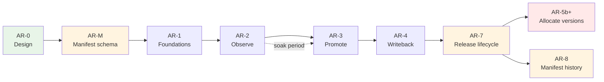

# App Registry — Delivery Plan

Phased build-out of `//tools/app_registry`. Each phase has a **plan ID** (AR-M,
AR-1, AR-2a…). This file holds what's true *right now* — deployment state,
open bugs, deferred work, what's next. Full as-built detail for every
completed phase lives in [PLAN-HISTORY.md](PLAN-HISTORY.md), split out so
this file stays something an agent can read in one pass; see "Phase history"
below for when to open it.

(Earlier phases kept a per-phase `TODO-<PLAN_ID>.md` alongside this file. The
convention was applied to only half the phases before being dropped; those
files were retired in AR-6b and anything still load-bearing was folded into
PLAN-HISTORY.md.)

Read [ARCHITECTURE.md](ARCHITECTURE.md) before executing any phase.

---

## Current status

*Last updated for AR-5b ([issue #829](https://github.com/whale-net/everything/issues/829), [PR #831](https://github.com/whale-net/everything/pull/831), pending merge). PR
[#630](https://github.com/whale-net/everything/pull/630) merged (2026-08-15).
**AR-M through AR-7f are all merged to `main`** — see the table below.*

| Phase | PR | State |
|---|---|---|
| AR-M | [#495](https://github.com/whale-net/everything/pull/495) | merged |
| AR-1 | [#496](https://github.com/whale-net/everything/pull/496) | merged |
| AR-2a | [#499](https://github.com/whale-net/everything/pull/499) | merged — verified against real Postgres |
| AR-2b | [#500](https://github.com/whale-net/everything/pull/500) | merged — charts byte-identical |
| AR-2c | [#502](https://github.com/whale-net/everything/pull/502) | merged — CI path unexercised until the registry is deployed |
| dbtest | [#498](https://github.com/whale-net/everything/pull/498) | merged — `libs/go/dbtest` available |
| AR-2d | [#503](https://github.com/whale-net/everything/pull/503) | merged |
| AR-3a…AR-3d | [#504](https://github.com/whale-net/everything/pull/504), [#508](https://github.com/whale-net/everything/pull/508), [#509](https://github.com/whale-net/everything/pull/509), [#511](https://github.com/whale-net/everything/pull/511) | merged |
| AR-4a / AR-4b | [#512](https://github.com/whale-net/everything/pull/512), [#514](https://github.com/whale-net/everything/pull/514) | merged — writeback `Publish` is still the stub |
| AR-5a | [#513](https://github.com/whale-net/everything/pull/513) | merged — **inert**: no domain at stage `allocate`, `plan.go`'s tag path untouched |
| AR-5b (issue #829) | [#831](https://github.com/whale-net/everything/pull/831) | pending — `AllocateVersion` wired into every real version-resolution call site (`plan.go`'s `assignVersions`/`assignChartVersions`, `release_charts.go`'s `releaseCharts`, `build_helm.go`'s `build-helm-chart`) via `resolveVersion` — see "AR-5" below |
| AR-6a / AR-6b | [#516](https://github.com/whale-net/everything/pull/516), [#515](https://github.com/whale-net/everything/pull/515) | merged |
| AR-7 (design) | [#559](https://github.com/whale-net/everything/pull/559) | merged — design + delivery plan only, no implementation |
| AR-7a | [#561](https://github.com/whale-net/everything/pull/561) | merged — sweep robustness, no schema change |
| AR-7b | [#562](https://github.com/whale-net/everything/pull/562) | merged — artifact lifecycle, migration `007`, `BeginPublish`/`FailPublish`, stale-row reaper |
| AR-7c | [#566](https://github.com/whale-net/everything/pull/566) | merged — app identity/manifest-snapshot split, migration `008`, `AssertApps` |
| AR-7d | [#567](https://github.com/whale-net/everything/pull/567) | merged — `GetReleaseRun`, `BeginPublishBatch`, `app-registry builds status`, `release.yml` resume, no schema change |
| AR-7e | [#571](https://github.com/whale-net/everything/pull/571) | merged — `AdoptArtifact` (admin-only), `app-registry artifacts adopt`/`list --provenance`, OPERATIONS.md disaster-recovery runbook, no schema change |
| AR-7f | [#572](https://github.com/whale-net/everything/pull/572) | merged — `CheckChartHermeticity` RPC, `build-helm-chart` call site, no schema change, **ships inert** (no domain at stage `allocate`) |

**Post-AR-7 fixes, all merged, found by running the deployed `dev` registry
for real:** [#574](https://github.com/whale-net/everything/pull/574) (issue
#570 — distinguish CI/server version skew from a transient outage),
[#576](https://github.com/whale-net/everything/pull/576) (issue #575 —
idempotency lookups were keyed by string alone, so `RecordArtifact` could
silently replay `BeginPublish`'s stored response), `#579`/`#580` (chart
naming/repository bugs blocking `BeginPublish` for charts), `#583`
(`tools/app_registry/citest`, a contract test over every real `app-registry`
CLI invocation embedded in `.github/workflows/*.yml` — every bug in this list
lived at that CI-shell-to-CLI seam, invisible to unit tests and to a green
run because recording is `continue-on-error`), and issue
[#585](https://github.com/whale-net/everything/issues/585) —
`RecordArtifact`'s idempotent-replay lookup matched an existing row by
`digest` alone, with no `(owner, kind, version)` scoping. A reproducible,
no-op rebuild (routine in this monorepo — a release batch commonly rebuilds
every app in a domain even when only one changed) can produce a digest
identical to an older published version of the *same* app; the lookup
matched the old row and reported success without ever touching the new
version's `publishing` row, stranding it until the reaper reaped it.
Confirmed against run 31660476677: all four `app-registry` images it
released (cli, api, migration, worker) hit this. Fixed by scoping the
lookup to the request's own `(owner, kind, version)` identity — a
same-digest/different-version request now falls through to the real
`artifact_digest_idx` unique-constraint check instead, which fails the
request loudly rather than silently stranding it. That constraint is still
a real gate the moment a domain reaches `promote` or `allocate` (recording
becomes mandatory there) — a reproducible no-op rebuild that collides with
an older version's digest will hard-fail the release job outright. Whether
that needs its own accommodation is AR-5 cutover design work, not part of
this fix — see "AR-5" below.

The registry is deployed to `dev` and is being actively exercised by real
release runs (see run 31660476677 above) — `app-registry-api`
and `app-registry-migration` images publish from `apps=all`.
`domain_adoption` has zero rows (verified directly against `dev` via the
Postgres MCP plugin): every domain, including `app-registry`'s own, is still
at the implicit `observe` stage — no cutover has started for anything.
`APP_REGISTRY_CICD_OPT_IN` is now `true` (recording steps ran against `dev`
and wrote real rows in the run above) — this section previously described it
as unset.

**AR-3 (promotion) and AR-4 (writeback) are implemented and merged.** The
writeback *contract* — outbox, worker, workflow, stub activity — is done; the
real gitops/S3 publish is deliberately still out of scope (see AR-4b below).
The per-phase sections in PLAN-HISTORY.md were written while these were
still in flight and say "not merged" in places; the table above is
authoritative.

**AR-5a (inert foundations) is merged** — `AllocateVersion` is fully
implemented and tested. **AR-5b (issue #829) wires it into every real
version-resolution call site** — see "AR-5" below for the as-implemented
detail and what is still deliberately deferred.

**AR-7 (issue #558): every sub-phase, AR-7a through AR-7f, is merged to
`main`.** The full phase makes a release run
hermetic — no dependency on `main`'s reconcile having gone first — via an
artifact
`allocated → publishing → published` lifecycle, an identity/manifest-snapshot
split of `app`, and a run log CI writes to. AR-7a fixes ordering 4 (see
ARCHITECTURE.md "The problem: four cross-run orderings"): `ReconcileApps` is
now partially applying (one bad chart is skipped and reported, not a
whole-sweep rollback), chart manifests carry domain-qualified app references
so a bare-name collision across domains can't break the sweep, and `ci.yml`'s
`reconcile-app-registry` job is no longer `continue-on-error`. AR-7b adds the
artifact lifecycle states, migration `007`, `BeginPublish`/`FailPublish` and
the stale-row reaper, and its exit criteria are met (see its subsection in
PLAN-HISTORY.md). AR-7c adds `AssertApps`, migration `008`'s
identity/manifest-snapshot split, and the promotability-retroactivity fix
(see its subsection). AR-7d adds `GetReleaseRun`, the bulk
`BeginPublishBatch` RPC that closes the gap AR-7b's own "Deliberately NOT
done" left open (see AR-7b's section in PLAN-HISTORY.md), `app-registry
builds status`/`--incomplete`, and `release.yml`'s resume behavior. AR-7e
adds `AdoptArtifact` — an admin-only, per-artifact path for recording an
artifact the registry never observed being published, used when a chart
release fails on a pre-registry pin, plus OPERATIONS.md's disaster-recovery
runbook. AR-7f adds `ArtifactRegistry.CheckChartHermeticity` and its call
site in `build-helm-chart`, moving the "chart may only pin published images"
rule from record time to compose time for domains at adoption stage
`allocate` — see its subsection for the full contract and why it ships
inert. **Every sub-phase of AR-7 is implemented and merged.** Design is in
ARCHITECTURE.md's "Release lifecycle (issue #558)"; delivery is "AR-7" in
[PLAN-HISTORY.md](PLAN-HISTORY.md).

**Where deferred work is tracked.** Three places, deliberately:
[Carry-over items](#carry-over-items) below for small cross-cutting gaps that
belong to no single phase; each completed phase's own **"Deliberately NOT
done"** subsection in [PLAN-HISTORY.md](PLAN-HISTORY.md) for scope that phase
consciously left (AR-5's is the cutover itself); and "Explicitly out of
scope" at the end of this document for things no phase will do. If you are
picking this up cold, read those three before starting anything.

### Carry-over items

- **`server/repository/postgres/*.go` has no automated test coverage.** ~~Handler
  logic is tested against the in-memory fake; the SQL is compile-checked only.~~
  **Resolved by AR-2d** — see `server/repository/postgres/postgres_integration_*_test.go`. The SCD2
  `promotion` table's partial unique index is still untested; it doesn't
  exist until AR-3's migration `002` lands (see AR-2d's scope note above).
- **Auth is unimplemented.** ~~Handlers check no claims; the Tiltfile runs
  `GRPC_AUTH_MODE=none`.~~ **Resolved by AR-3a** — role model in
  `server/auth`, enforced on every RPC. Note `GRPC_AUTH_MODE` still
  *defaults* to `none`, in which the server grants every caller every role;
  that is intentional (Tilt and local dev depend on it) and is the
  deployer's responsibility to override. See DEPLOY.md §3.
- **Transaction-abort hazard for AR-3.** A failed statement aborts the
  surrounding Postgres transaction, so any error-message or logging code that
  queries afterwards silently degrades. This bit `RecordArtifact` once already;
  AR-3's SCD2 close-and-open writes are transactional and will hit the same trap.
- **Tilt is validated and documented** — see [TESTING.md](TESTING.md). It is the
  only thing currently exercising the pgx layer.
- `list-apps --format json` prints `deploy_unit` as an integer. Cosmetic; no CI
  path reads it.
- **`promotion_event.temporal_workflow_id` / `temporal_run_id` are never
  stamped back** (AR-4b). `003_promotion.up.sql`'s schema comment anticipates
  them, and `WritebackOutbox.EventID` exists precisely so the worker can do
  it, but nothing writes them — so an operator cannot jump from an audit row
  to its Temporal workflow history. Needs an `event_id`-keyed update path
  from the worker.
- **Temporal `WorkflowIDReusePolicy` is left at the SDK default** (AR-4b),
  reasoned about in `worker/outbox/drain.go`'s comments but never
  independently stress-tested. Relevant because workflow id = promotion id,
  so reuse semantics decide what happens when a promotion is retried.
- **`--format table` is unimplemented across the whole CLI** — every command
  falls back to JSON with a `# table format not implemented yet` notice
  (`cli/cmd/client.go`, `cli/cmd/util.go`). Pre-existing, cosmetic, but the
  flag is advertised.
- **No admin/web UI.** Deferred as non-critical for launch. PLAN.md's
  out-of-scope list notes the CLI is kept thin specifically so a UI can be
  added without reimplementing rules server-side.

## Sequencing rationale

Promotion tracking is additive and low-risk; replacing git-tag version
allocation moves an existing working source of truth into a stateful service.
Do the first, prove it, then do the second. Shipping AR-5 before AR-3 would put
a registry outage in the path of every release before the registry has delivered
anything.

AR-8 depends only on AR-7 being merged (it rewrites AR-7c's `v_current_app`/
`artifact.manifest_id`) — independent of the AR-5 cutover in either
direction.

**AR-7 (issue #558) sits between AR-4 and the AR-5 cutover**, despite its
number. AR-5a's inert foundations already landed; the cutover to `allocate`
must not happen before AR-7, because version allocation happens *before* a
build exists, so a release will need identity resolved even earlier than it
does today — the release-vs-reconcile gap gets strictly worse under AR-5, not
better. AR-7a and AR-7b are independently valuable and can land at any time.

AR-M stands alone and delivers value with or without the registry — it fixes
drift that exists today. It is sequenced first because AR-2 otherwise adds a
third manifest representation to the two that already disagree.

---

## AR-5 — cutover status

**AR-5a (inert foundations) is merged (#513)** — full as-built record in
[PLAN-HISTORY.md](PLAN-HISTORY.md). **AR-5b (issue #829) wires `AllocateVersion`
into every real version-resolution call site**, described below.

**How AR-5b actually landed, and why it differs from this section's original
plan:** the gate below ("do not start until AR-2's parity check is clean")
was never satisfied — no parity-check tooling has ever been built or run.
Despite that, `app-registry` and `tools` were independently promoted to
`domain_adoption.stage = 'allocate'` directly against the `dev`/prod
database (there is still no CLI/admin RPC for this — see "Deliberately NOT
done" below), which made `AllocateVersion`'s adoption gate reject every real
release for those two domains from that point on with no caller ever
noticing, because nothing called it: every domain, allocated or not, was
silently still resolving its version from git tags. Issue #829 is that gap.
AR-5b is the fix, treated as closing an already-live production gap rather
than the originally-planned, soak-gated rollout — see the issue for the full
story.

**What's wired:** `resolveVersion` (`tools/release_helper_go/cmd/registry_version.go`)
is the shared decision every call site now goes through instead of calling
`autoIncrementVersion`/`autoIncrementHelmVersion` directly:
- `plan.go`'s `assignVersions` (apps) and `assignChartVersions` (charts,
  `--charts` on the `plan` command — not the path `release.yml` actually
  drives for charts, see next bullet).
- `release_charts.go`'s `releaseCharts` — **the real production chart call
  site.** `release.yml`'s `release-helm-charts` job never uses `plan`'s
  `chart-matrix` output (that output is computed and emitted but nothing
  ever reads it); it invokes `release-charts` once for every requested
  chart, which has its own independent auto-increment call. This section
  previously cited `build_helm.go:164` as the live chart call site — that
  command is real but is exercised only by
  `tools/release_helper_go/test_cli_integration.sh`, never by `release.yml`.
- `build_helm.go`'s `build-helm-chart` command, for consistency/completeness
  even though it is not on the production path (previous bullet).

When the calling domain is at stage `allocate`, `AllocateVersion`'s result is
used verbatim — git tags are never consulted. When it is not (the RPC's own
adoption gate returns `FailedPrecondition`, its only use of that code),
`resolveVersion` falls back to the pre-#829 tag-scanning path, byte-for-byte
unchanged. Any other registry error (dial failure included) is fatal, not a
fallback: silently reverting to tag-scanning for a domain that is actually at
`allocate` is exactly the bug #829 reports, so a broken registry must fail
the release rather than mask itself as a tag-based one.

**Deliberately NOT done**
- No CLI/admin RPC exists to move a domain to/from `allocate` — both live
  domains were cut over by hand-editing `domain_adoption` directly. Real,
  separate scope before a future domain can be cut over without doing the
  same.
- Git tags are still created for allocate-domain releases (`--create-git-tag`
  is unchanged) — deliberately kept as this section's originally-planned
  "redundant record and disaster-recovery path": neither `release-app` nor
  `release-charts` ever pushes a tag to origin (apps' tags only reach origin
  as an accidental side effect of `create-combined-github-release-with-notes`;
  charts' never do at all), so a local tag object in an ephemeral CI
  checkout costs nothing to keep. No-op/digest-collision detection
  (`getPreviousAppTag`/`getPreviousChartTag`) is therefore also unchanged —
  it still works because the tags it scans are still being written.
- Seeding a domain's starting version from its existing tags at cutover time
  is moot for the two domains already cut over (done by hand) and remains
  unbuilt for a future domain's cutover.
- The "allocated versions match tag-scanning" parity check against AR-2 soak
  data has still never been run — this predates #829 and is not resolved by
  it.
- The release workflow's version-allocation concurrency group is untouched.

**Exit criteria (met by AR-5b)**
- Concurrent releases of the same app cannot receive the same version, for a
  domain at `allocate` (`AllocateVersion`'s transactional unique constraint).
- A domain not at `allocate` still releases through the tag path, unchanged.
- A fallback to tag-based allocation exists per domain, by moving its stage
  back to `observe`/`promote` (untested against a real hand-edit, since no
  admin RPC exists yet to make the switch — see above).
- **Not met:** allocated versions matching tag-scanning, verified against AR-2
  soak data — the soak/parity tooling this depended on still does not exist
  (see above).

The digest-collision accommodation this section previously asked AR-5 to
design is now handled, but at the release-pipeline layer rather than inside
App Registry. Issue [#585](https://github.com/whale-net/everything/issues/585)
(fixed by PR #600) scoped `RecordArtifact`'s digest-replay lookup to
`(owner, kind, version)` instead of digest alone, so it can no longer
silently strand a reproducible no-op rebuild's row in `publishing` — but that
surfaced the underlying tension instead of hiding it: a same-digest/
different-version request now hard-fails on `artifact_digest_idx`'s real
uniqueness constraint, which reproduced for real in `dev` as issues
[#617](https://github.com/whale-net/everything/issues/617) and
[#628](https://github.com/whale-net/everything/issues/628) — a release could
report full success (tag + pushed image) while its App Registry artifact row
silently stranded as `failed`/`stale`. PR
[#630](https://github.com/whale-net/everything/pull/630) (merged 2026-08-15)
fixed this upstream of App Registry entirely: `release.yml`'s tag-creation
steps now check the just-built digest against the most recent existing
tag's digest before minting a new version tag, and skip tag creation (and
the App Registry record call) on a match — so a no-op rebuild never reaches
App Registry as a "new" artifact in the first place. This closes the gap
this section previously called out as open design work; it does not affect
the AR-2 parity gate above.

### Addendum — semver semantics (implemented)

An audit of the existing version path found three gaps between what
`tools/release_helper_go` did at the time and what the registry needed in
order to *replace* git tags. **All three are implemented as of AR-5b**
(they had already landed, undocumented, by the time issue #829 was
investigated — this addendum was stale; kept below for the rationale, not
as a to-do list).

Before this work, `plan.go` parsed semver with a regex and bumped by
splitting on dots, but the "which version is latest" question was answered
entirely by `git tag --sort=-version:refname` — git supplied the semver
ordering, and it would have disappeared along with the tags.

**1. Major bumps are first-class.** `incrementVersion` (now backed by
`libs/go/semver`) handles `major`/`minor`/`patch` uniformly, and `plan.go`
exposes `--increment-major` alongside `--increment-minor`/`--increment-patch`
— matching chart bumping (`build_helm.go`), which already accepted all
three. `AllocateVersionRequest.increment` accepts the same three values.
Consequence for AR-5's parity exit criterion: allocation is a **superset** of
what tag-scanning produced, since the tag path could not express a major
bump at all — parity is asserted for minor/patch, not for a capability that
did not previously exist.

**2. Versions have a sortable representation.** `artifact` carries
`version_major`, `version_minor`, `version_patch` (`INT NOT NULL`, migration
`005_version_allocation`) alongside the `TEXT` `version`, indexed
`(owner_id, kind, version_major DESC, version_minor DESC, version_patch DESC)`
so "latest" and "next major/minor/patch" are one indexed lookup with correct
ordering — seen live in `AllocateVersion`'s postgres implementation
(`server/repository/postgres/artifact.go`), which queries exactly this index
rather than sorting the text column. The `UNIQUE (owner_id, kind, version)`
constraint stays on the text form as the collision guard.

**3. Prereleases are rejected, not half-accepted.** `AllocateVersion` rejects
an explicit prerelease or build-metadata version via
`libs/go/semver.ParseRelease`, with an error naming it unsupported, rather
than sorting one wrongly. The extension point (a future
`version_prerelease TEXT` column plus a trailing ordering-index term) is
noted in `ARCHITECTURE.md` and was not added, per the original decision.

---

## AR-8 — SCD2 manifest history (issue #587)

**Goal:** stop `ReconcileApps` from writing one `app_manifest`/`chart_manifest`
row per app per `main` commit unconditionally (migration 008's shape) — row
count should scale with manifest *content* change, not CI frequency. Fixes
the legibility complaint in issue #581 and the unbounded growth of
`v_current_app`'s `LEFT JOIN LATERAL` scan.

**Depends on AR-7 being fully merged** (it rewrites `v_current_app` and
`artifact.manifest_id`, both created by AR-7c/migration 008) — satisfied, see
"Current status" above.

**Scope**
- Migration `010`: splits `app_manifest`/`chart_manifest` into
  content-addressed tables (one row per DISTINCT manifest per owner, ever)
  plus `app_manifest_history`/`chart_manifest_history` (SCD2, the `main`
  sweep timeline), `app_manifest_release`/`chart_manifest_release`
  (release-time observations), and `reconcile_run` (one row per sweep).
  Backfills existing data via the `LEAD()`/`LAG()` window-function pattern
  AGENTS.md prescribes for deriving SCD2 over a non-SCD2 table, and remaps
  every pre-migration `artifact.manifest_id` from its old per-commit id to
  the new content id.
- `postgres/app.go`: `Reconcile`'s manifest write becomes an SCD2
  close-and-open compare-swap against `*_manifest_history`;
  `AssertApps`'s becomes a plain insert into `*_manifest_release`. Neither
  touches the other's table.
- `postgres/artifact.go`: `resolveManifestForPublish` gains a third
  fallback tier (exact release match → current-history-interval commit
  match → current-history-interval regardless of commit), propagating the
  new O(1) "current" lookup to publish time too.
- Full detail, including the design tradeoffs against three rejected
  alternatives (add `valid_from`/`valid_to` to `app_manifest` in place;
  content-dedupe alone with no history table; skip-insert-when-unchanged
  with no schema change at all), is in ARCHITECTURE.md's "App identity vs.
  per-build manifest snapshot" → "As built (AR-8, migration `010`)".

**Deliberately NOT done**
- No backfill of historical `reconcile_run` rows for sweeps that predate
  this migration — no acceptance criterion needs it, and reconstructing "one
  row per sweep" faithfully from the old per-app data is only approximate.
  Going forward is what the issue asks for.
- `chart_app`'s destructive rewrite-on-every-sweep (issue #587's own
  "Follow-up, out of scope") is untouched — a separate ticket once chart
  manifests carry `app_refs` on the open `chart_manifest` row.

**Testing note:** every acceptance criterion below is covered by new
`postgres_integration_*_test.go` tests (real-Postgres tier, tag
`integration`/`manual`) — this repo's dev sandbox has no Docker available to
run that tier locally; it needs CI's `Test Database Integration` job (or a
local run with a working Docker daemon) before merge.

**Exit criteria**
- A sweep where no manifest changed inserts zero new `app_manifest`/
  `app_manifest_history` rows — only `last_git_sha` and `reconcile_run`
  advance.
- A sweep where one app changed closes exactly that app's open history row
  and opens exactly one new one.
- A → B → A produces three history rows with non-overlapping intervals in
  the correct order.
- `AssertApps` from a non-`main` ref writes a content row + an
  `*_manifest_release` row and never touches `*_manifest_history`.
- `v_current_app`/`v_current_chart` return byte-identical results to
  pre-migration for every existing app/chart.
- Every pre-migration `artifact.manifest_id` resolves to a content row with
  the same `manifest_json` it pointed at before; `promotability` is
  unchanged for every existing artifact row.
- `resolveManifestForPublish` still prefers the build's exact `git_sha`.
- `010_*.down.sql` restores the pre-migration (migration 008) shape.

---

## Phase history

Full as-built detail for every phase (AR-0 through AR-7f, all merged) is in
[PLAN-HISTORY.md](PLAN-HISTORY.md) — goal, scope, exit criteria, and what
shipped, per phase, in the same order as the status table above. Read it when
you need the *why* or the *as-built specifics* behind a row in that table;
the table itself, and the deferred-work sections in this file, are enough for
picking up cold.

## Explicitly out of scope

Not in any phase above; the schema accommodates them without migration.

- Approval gates (`PENDING_APPROVAL` state exists but is never written).
- Ephemeral / per-PR environments (an environment row insert, when wanted).
- Automatic rollback on failed deploy — needs deploy-health signal the registry
  does not have.
- Web UI. The CLI stays thin specifically so this can be added without
  reimplementing rules.
- Backfilling historical artifacts from GHCR. Recommendation in
  ARCHITECTURE.md: don't.
