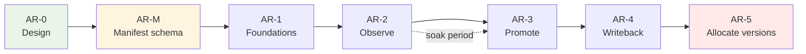

# App Registry — Delivery Plan

Phased build-out of `//tools/app_registry`. Each phase has a **plan ID**; worker
agents track execution in a `TODO-<PLAN_ID>.md` alongside this file (e.g.
`TODO-AR-2.md`). Those TODO files are created when a phase starts, not up front.

Read [ARCHITECTURE.md](ARCHITECTURE.md) before executing any phase.

---

## Current status

*Last updated at the start of the AR-2d/AR-3 session. **AR-M through AR-2c are
all merged to `main`.***

| Phase | PR | State |
|---|---|---|
| AR-M | [#495](https://github.com/whale-net/everything/pull/495) | merged |
| AR-1 | [#496](https://github.com/whale-net/everything/pull/496) | merged |
| AR-2a | [#499](https://github.com/whale-net/everything/pull/499) | merged — verified against real Postgres |
| AR-2b | [#500](https://github.com/whale-net/everything/pull/500) | merged — charts byte-identical |
| AR-2c | [#502](https://github.com/whale-net/everything/pull/502) | merged — CI path unexercised until the registry is deployed |
| dbtest | [#498](https://github.com/whale-net/everything/pull/498) | merged — `libs/go/dbtest` available |

The registry is being deployed to `dev` by the repo owner. `app-registry-api`
and `app-registry-migration` images publish from `apps=all`.
`APP_REGISTRY_CICD_OPT_IN` is still unset, so CI makes no registry calls.

**Next up:** AR-3d (CLI `promote`/`rollback`/`status`/`history`/`diff` +
`promote.yml`). AR-2d, AR-3a, AR-3b, and AR-3c are done and stacked on top
of `main`.

### AR-2c — merged

- `.github/workflows/release.yml` calls the CLI after image and chart pushes:
  the `release` job resolves each pushed image's digest
  (`docker buildx imagetools inspect`) and calls `builds record` +
  `artifacts record --kind image`; `release-helm-charts` reads the AR-2b
  compose-time lockfile via `read-chart-lockfile --skip-build`, resolves each
  pinned image's digest, and calls `artifacts record --kind chart --contains
  ...`. Every step gated on `if: vars.APP_REGISTRY_CICD_OPT_IN == 'true'` and
  `continue-on-error: true`.
- CLI write commands: `app-registry builds record`, `app-registry artifacts
  record` (the read commands — `apps list/get`, `artifacts
  list/get/resolve` — already existed from AR-2a).
- `app-registry-api`'s `app_type` changed from `internal-api` to
  `external-api`: GitHub Actions runs outside the cluster and needs an
  ingress path to reach it. No `ingress_host` is set in `release_app` — an
  explicit host is used as-is in every environment (see
  `tools/helm/templates/ingress.yaml.tmpl`), so the real hostname belongs in
  a per-environment values override at deploy time, not baked into the
  manifest.
- `tools/app_registry/BUILD.bazel` (new): `release_helm_chart` target
  `app_registry_chart` bundling the `api` and `migration` app_metadata
  targets (`deploy_unit = "none"` apps, like the CLI, are excluded).
- `tools/app_registry/cli/BUILD.bazel`: added a `release_app` for the CLI
  (`deploy_unit = "none"`) so `app-registry-cli` publishes as an image and
  can be run via `docker run`/`bazel run` instead of a local build.

Safe with the registry undeployed: with the variable unset, CI makes no registry
calls at all.

### AR-2d — Postgres repository test coverage — done, not merged

**Goal:** close the top carry-over gap below. `server/repository/postgres/*.go`
is compile-checked only; two real bugs shipped past green tests in AR-2a
because the in-memory fake has no transactions.

**Scope**
- `server/repository/postgres/postgres_integration_test.go` behind
  `//go:build integration`, using `libs/go/dbtest`, applying the real
  migrations (not hand-written DDL) so schema drift is caught too. The real
  migrations were not reusable as-is: `migrate/main.go`'s `//go:embed` lived
  in `package main`, which a test package cannot import. Smallest fix: moved
  `migrate/migrations/` to `migrate/schema/migrations/` behind a new
  `migrate/schema` package exporting `schema.Migrations embed.FS` /
  `schema.Dir`; `migrate/main.go` now calls `migrate.RunCLI(schema.Migrations,
  schema.Dir)`. No SQL duplicated.
- `go_test` target `postgres_integration_test` copying
  `//libs/go/dbtest:postgres_constraints_test`'s tag set exactly (`external`,
  `integration`, `manual`, `no-cache`, `no-sandbox`, `requires-network`),
  hand-written with a `# keep` marker (gazelle skips `//go:build integration`
  files, and won't regenerate or remove this rule — verified against a real
  `bazel run //:gazelle`).
- Covers the paths the fake cannot: transaction rollback on a failed
  statement mid-`RecordArtifact` (a duplicate `artifact_link` insert aborts
  the whole write, no partial artifact row survives), idempotency-key replay
  returning the stored response without double-writing (proven with a
  *different* payload on the replay call, so it can't be confused with the
  natural-key dedup every write already has), the real `artifact_version_idx`
  unique index rejecting a same-owner/kind/version collision the app-level
  digest pre-check would miss, and `ResolveArtifact`'s chart→image join.
- **Deferred, not in this pass:** the SCD2 `promotion_current_idx` partial
  unique index — the `promotion` table doesn't exist yet (ships in migration
  `002`, AR-3). Add its test alongside that migration.
- **CI now runs this target** — the `Test Database Integration` job in
  `.github/workflows/ci.yml`, added after AR-3a. It discovers targets by
  querying for tests that depend on `//libs/go/dbtest`, so new dbtest-backed
  tests need no CI change. This closed a real gap: because the target is
  `manual`, nothing ran it, and AR-3a's auth enforcement broke it in a way only
  caught by running the stacked branches together by hand.

**Exit criteria** — met. Each new test was verified to fail when its
assertion was deliberately broken (see `TODO-AR-2d.md` and the phase report
for exact failure output), then reverted. `bazel test //tools/...` and
`bazel build //tools/...` stay green on a Docker-less path — the `manual` tag
excludes the new target from wildcard expansion.

### Carry-over items

- **`server/repository/postgres/*.go` has no automated test coverage.** ~~Handler
  logic is tested against the in-memory fake; the SQL is compile-checked only.~~
  **Resolved by AR-2d** — see `postgres_integration_test.go`. The SCD2
  `promotion` table's partial unique index is still untested; it doesn't
  exist until AR-3's migration `002` lands (see AR-2d's scope note above).
- **Auth is unimplemented.** Handlers check no claims; the Tiltfile runs
  `GRPC_AUTH_MODE=none`. Fine for AR-2 (recording, CI service account), **not**
  fine for AR-3, whose entire point is that a build credential cannot promote to
  prod. Settle OIDC config before AR-3.
- **Transaction-abort hazard for AR-3.** A failed statement aborts the
  surrounding Postgres transaction, so any error-message or logging code that
  queries afterwards silently degrades. This bit `RecordArtifact` once already;
  AR-3's SCD2 close-and-open writes are transactional and will hit the same trap.
- **Tilt is validated and documented** — see [TESTING.md](TESTING.md). It is the
  only thing currently exercising the pgx layer.
- `list-apps --format json` prints `deploy_unit` as an integer. Cosmetic; no CI
  path reads it.

## Sequencing rationale

Promotion tracking is additive and low-risk; replacing git-tag version
allocation moves an existing working source of truth into a stateful service.
Do the first, prove it, then do the second. Shipping AR-5 before AR-3 would put
a registry outage in the path of every release before the registry has delivered
anything.

AR-M stands alone and delivers value with or without the registry — it fixes
drift that exists today. It is sequenced first because AR-2 otherwise adds a
third manifest representation to the two that already disagree.

---

## AR-0 — Design and contracts

**Status:** complete (this document, `ARCHITECTURE.md`, `README.md`, `protos/`).

**Delivered**
- Proto contracts for all four services, compiling under
  `//tools/app_registry/protos:appregistrypb`.
- Data model, promotability rule, authorization split, writeback mechanism.

**Exit criteria** — met when the promotability model and the chart→image
lockfile approach are agreed, since both touch existing code.

---

## AR-M — Manifest schema consolidation

**Goal:** one definition of what a `release_app` manifest contains. Independent
of the registry — this repays itself immediately by removing existing drift.

**Why first:** `release_helper_go` and `tools/helm/composer.go` both decode the
manifest JSON into their own structs, and they disagree with each other and with
the Starlark rule (see the table in [`../appmeta/README.md`](../appmeta/README.md)).
Adding the registry as a third consumer before fixing this compounds the
problem.

**Scope**
- `//tools/appmeta/proto` — `AppManifest`, `ChartManifest`, `AppManifestSet`,
  `DeployUnit`. *(done in AR-0; consumers not yet migrated)*
- Contract test `//tools/appmeta:manifest_contract_test`, both directions:
  every `app_metadata` target decodes with `DiscardUnknown: false`, and a
  full-coverage fixture app leaves no proto field unset.
- Migrate `tools/helm/composer.go` to `appmetapb.AppManifest`. The dead
  `labels` / `annotations` / `dependencies` fields and the map-iteration
  nondeterminism that would have made the golden-output test below impossible
  are handled separately, in the `helm-deterministic-output` change. That must
  land before this step.
- Migrate `tools/release_helper_go` to `appmetapb.AppManifest`.
- **Remove the `Language`-as-version hack** in `cmd/plan.go` (`apps[i].Language
  = version`, read back via `strings.HasPrefix(app.Language, "v")`), now that
  `version` is a real field. Separate reviewable commit — this changes
  behaviour, not just types.
- Add `deploy_unit` to `release_app` and set it on standalone-image apps
  (e.g. `manmanv2-host-manager`).

**Exit criteria**
- No hand-written manifest struct remains in `tools/`.
- Contract test fails when a rule attr is added without a proto field, verified
  by deliberately breaking it once.
- `bazel test //tools/...` green; a release dry-run produces byte-identical
  charts and plans to before the migration.

**Risk:** the helm composer is on the critical path for every chart build.
Migrate it behind a golden-output test comparing rendered charts pre/post.

---

## AR-1 — Foundations

**Goal:** everything the service needs to exist, with no business logic.

**Scope**
- `tools/app_registry/migrate` — `golang-migrate` runner over embedded SQL,
  following `manmanv2/migrate`. Schema per ARCHITECTURE.md, including the SCD2
  partial unique index and `v_current_promotion`.
- `tools/app_registry/server` — gRPC server skeleton: `libs/go/db` pool,
  `libs/go/grpcauth` interceptors, otelgrpc, reflection, health check. All RPCs
  return `UNIMPLEMENTED`.
- `tools/app_registry/cli` — Cobra skeleton with a thin gRPC client.
- `release_app` manifests for `app-registry-api` and `app-registry-migration`.
- Tilt wiring for local development.

**Exit criteria**
- `bazel test //tools/app_registry/...` green.
- Migrations apply and roll back cleanly.
- Server starts in Tilt and answers reflection + health.

**Risks** — Read `docs/DOCKER.md` before touching image builds; ARM64 breakage
is silent at build time.

**Note:** Temporal moved out of this phase into AR-4. Nothing before the
writeback needs it, and it was the largest unknown here.

---

## AR-2 — Observe (additive recording)

**Goal:** the registry knows everything CI published. Git tags stay
authoritative. Nothing depends on the registry yet.

**Scope**
- Implement `AppRegistry.ReconcileApps`, `ListApps`, `GetApp`, `ListCharts`,
  `SetAppStatus`.
- Implement `ArtifactRegistry.RecordBuild`, `RecordArtifact`, `ListArtifacts`,
  `GetArtifact`, `ResolveArtifact`.
- Idempotency-key storage and replay.
- **`tools/helm/composer.go`: emit a chart lockfile** resolving pinned images to
  digests.
- `release_helper_go`: emit an `AppManifestSet` from `plan` output. No
  conversion code — AR-M made this the same type the registry accepts.
- `.github/workflows/release.yml`: call `app-registry` CLI after image and chart
  pushes. **Best-effort — `continue-on-error`, must never fail a release.**
- **Every registry step gated on `if: vars.APP_REGISTRY_CICD_OPT_IN == 'true'`.**
  Default (unset) means CI makes no registry calls whatever, so the pipeline that
  builds and releases the registry never depends on the registry already being
  deployed. See ARCHITECTURE.md → "`APP_REGISTRY_CICD_OPT_IN` — the bootstrap
  kill switch". This is a hard requirement, not a nicety: the repo ships with it
  off and stays that way until the registry is deployed and its secrets exist.
- CLI: `apps list`, `apps get`, `artifacts list`, `artifacts resolve`.

**Exit criteria**
- Every release for a soak period appears in the registry.
- A parity check confirms registry artifacts match git tags with zero drift.
- `artifacts resolve` on a chart returns correct image digests.

**Soak:** run for several weeks of real releases before starting AR-3. Do not
compress this — it is the phase that earns the trust AR-5 spends.

---

## AR-3 — Promotion

**Goal:** promotion state is recorded and queryable. Still nothing consumes it.

**Split into a 4-PR stack**, auth first so the "a builder cannot promote" exit
criterion is testable from the moment promotion exists:

| PR | Scope |
|---|---|
| **AR-3a** | Auth only — role model, interceptor plumbing, enforcement on the RPCs that exist today, CLI service-account credentials. No promotion logic. |
| **AR-3b** | `EnvironmentRegistry` (all RPCs), `dev`/`stage`/`prod` seeding, environment-scoped `allowed_principals`. |
| **AR-3c** | `PromotionRegistry` — SCD2 close-and-open, event log, promotability enforcement, `allow_override` + drift reporting. |
| **AR-3d** | CLI (`promote`, `rollback`, `status`, `history`, `diff`) and the human-triggered `promote.yml` workflow. |

### AR-3b — `EnvironmentRegistry` — done

- Migration `002_environment_registry` (up/down): `environment` table —
  `key` unique, `rank`, `requires_approval`, `gitops_path`,
  `allowed_principals TEXT[]`, `archived`, `created_at`. Seeds
  `dev`(rank 0)/`stage`(rank 10)/`prod`(rank 20) via
  `INSERT ... ON CONFLICT (key) DO NOTHING`, safe against a database the
  registry is already deployed to. **No `promotion` table** — that stays in
  AR-3c's own migration `003`, which needs `environment.environment_id` to
  exist first as an FK target. `migrate/README.md`'s "Planned migrations"
  table corrected accordingly.
- `repository.EnvironmentRepository` (`Upsert`/`Get`/`List`/`Archive`) +
  postgres and fake implementations. All four `EnvironmentRegistry` RPCs
  implemented in `server/handlers/environment.go`: writes require
  `auth.RoleAdmin`, reads require `auth.RequireAuthenticated`. Neither
  `UpsertEnvironment` nor `ArchiveEnvironment` carries an `idempotency_key`
  in the proto, so neither goes through `runIdempotent` — same shape as
  `AppRegistry.SetAppStatus`.
- Postgres integration coverage added: migration 002 applying/seeding
  verified against real Postgres (plus a manual up/down/up round-trip
  outside `bazel test`), the real `UNIQUE (key)` constraint firing, and a
  full `Upsert` round-trip including the `TEXT[]` `allowed_principals`
  column. Caught one real bug in the process: pgx encodes a nil Go
  `[]string` as SQL `NULL`, which the `NOT NULL allowed_principals` column
  rejected — fixed by normalizing to `[]string{}` before insert.
- See [TODO-AR-3b.md](TODO-AR-3b.md) for full execution detail and the
  deliberate-break verification transcripts.

### AR-3c — `PromotionRegistry` — done

- Migration `003_promotion` (up/down): `promotion` (SCD2 — `valid_from`/
  `valid_to`, partial unique index `promotion_current_idx ON promotion
  (environment_id, target_key) WHERE valid_to IS NULL`, plus
  `promotion_window_idx` for historical/`--at` reads), `promotion_event`
  (append-only, NOT SCD2 per AGENTS.md), and `v_current_promotion` (pre-joins
  promotion → artifact → environment for the current-state read path).
  `target_key` is `"<kind>:<owner_full_name>"`, denormalized so the partial
  unique index doesn't need a nullable two-column target; everything else
  about the promoted artifact is read via a join to `artifact` rather than
  copied onto `promotion`, so there is exactly one place it can drift from.
- `repository.PromotionRepository` (`Promote`/`GetCurrent`/`GetPrevious`/
  `StateAt`/`ListPromotions`/`RecordEvent`/`ListEvents`) + postgres and fake
  implementations. `Promote` performs the SCD2 close-and-open write
  described in AGENTS.md as three statements (read current, close it, open
  the new row) that the caller MUST run inside `Registry.WithTx` — none of
  the repository methods open their own transaction, matching every other
  repository in this package.
- All five `PromotionRegistry` RPCs implemented in
  `server/handlers/promotion.go`. `Promote`/`Rollback` require
  `auth.RequirePromoter(ctx, environment_key)` (environment-scoped, not a
  flat role); the read RPCs require `auth.RequireAuthenticated`.
- Business rules, all enforced in the handler (repository stays free of
  gRPC/proto concerns, matching the rest of this package):
  - **Promotability.** `NOT_PROMOTABLE` is rejected outright. `VIA_CHART`
    requires `allow_override`; when set, the promotion is stored with
    `is_override = true`.
  - **Drift reporting.** `GetEnvironmentState` cross-references every
    `is_override` image promotion against the pinned digest of any chart
    promotion covering the same app in the same state snapshot, and reports
    a mismatch as a `DriftEntry` on the chart's `EnvironmentStateEntry`.
  - **`reason` required above rank 0**, checked against the resolved
    `Environment.Rank` (dev is rank 0 by convention) — applies to both
    `Promote` and `Rollback`.
  - **`already_promoted` short-circuit.** Re-promoting the artifact that is
    already current is detected before the SCD2 write and returns the
    existing row instead of creating a redundant history entry — not a
    correctness requirement from ARCHITECTURE.md, but avoids inflating audit
    history with no-op repeats. A deliberate design call; the CLI can be
    made to skip this check if it should be a hard error instead.
- `Rollback` is `GetPrevious` + `Promote`: it re-promotes whatever
  `GetPrevious` reports as the most recently superseded row for the target,
  recording `PROMOTION_ACTION_ROLLBACK`.
- Postgres integration coverage added, all verified against real Postgres
  (see `postgres_integration_test.go`): the partial unique index
  `promotion_current_idx` rejecting two concurrent current rows for the same
  target (the test AR-2d's carry-over note flagged as deferred until this
  table existed), promote→promote leaving exactly one current row with the
  prior row's `valid_to` set, `StateAt` returning the correct historical row
  for a timestamp strictly between two promotions, `GetPrevious` + `Promote`
  round-tripping a rollback, and a transaction-abort test proving the
  close-half of close-and-open does not survive when the open-half's INSERT
  fails (verified to actually catch the bug by temporarily bypassing
  `WithTx` in the test and observing the row count drop to zero).
- See [TODO-AR-3c.md](TODO-AR-3c.md) for full execution detail and the
  deliberate-break verification transcripts.

### Credential model (decided)

**Keycloak service accounts**, not GitHub Actions OIDC. `libs/go/grpcauth`
validates a single Keycloak-style issuer and reads roles from
`realm_access.roles`; teaching it GitHub's issuer and `sub`-claim scoping is real
scope in a library `manmanv2` also depends on, and is not worth it here.

- One Keycloak client per caller identity: `app-registry-builder`,
  `app-registry-promoter-{dev,stage,prod}`, `app-registry-admin`.
- One realm role per identity, service-name-prefixed.
- **Environment scoping comes from GitHub Environments**, not the token: the
  `promoter-prod` client secret lives on the `prod` GitHub Environment, so only a
  job declaring `environment: prod` can read it — and that declaration is what
  triggers required reviewers. The builder credential is a different client whose
  token carries no promoter role, so it cannot promote regardless.
- **Setup guide: [`libs/go/grpcauth/KEYCLOAK.md`](../../libs/go/grpcauth/KEYCLOAK.md)**
  — realm/client/role configuration step by step, and the reference pattern for
  service-to-service auth in this repo.
- Reconsider GitHub OIDC natively (secretless CI) only after this is proven.

**Remaining scope**
- SCD2 close-and-open in one transaction; promotion event log.
- Promotability enforcement, including `allow_override` and drift reporting.
- `reason` required above rank 0.

**Exit criteria**
- Promote/rollback round-trips correctly; `GetEnvironmentState --at <T>` returns
  correct historical state.
- Attempting to promote a `VIA_CHART` image without `allow_override` is
  rejected; with it, drift is reported.
- The builder credential is verifiably unable to promote.

---

## AR-4 — Writeback interface (stub implementation)

**Goal:** establish the contract that carries promotion state out of the
registry, without wiring it to anything. Publishing targets live in another
repo and are out of scope.

**Scope**
- `writeback_outbox` written inside the promotion transaction.
- `libs/go/temporal` — client construction, env-driven config, worker
  bootstrap, logging bridge to `libs/go/logging`. Add `go.temporal.io/sdk` to
  `go.mod` and `MODULE.bazel`. **Not present in Go anywhere in this repo yet**
  (fcm uses the Python SDK) — the largest unknown in the project, moved here
  from AR-1 because nothing earlier needs it.
- `tools/app_registry/worker` — Temporal worker draining the outbox.
- `WritebackWorkflow` (workflow id = promotion id) over a `Writeback`
  activity interface, with a **stub implementation** that renders environment
  state and writes it to a local path or object store — publishing nowhere.
- `state_hash` no-op detection, so the real implementation inherits it.
- `release_app` for `app-registry-worker`.

**Exit criteria**
- A promotion enqueues an outbox row in the same transaction and the workflow
  drains it exactly once, verified by killing the worker mid-run.
- Rendered state matches `GetEnvironmentState` output.
- The activity interface is documented well enough that swapping the stub for a
  gitops committer needs no schema, proto, or workflow change.

**Explicitly not in scope:** committing to the gitops repo, S3 publication,
pointing ArgoCD at registry-written state. Those land when the other repo's
changes are ready.

**Consequence to track:** the "registry can be down without blocking a deploy"
property is not actually exercised until the real writeback ships. Do not claim
it as verified before then.

---

## AR-5 — Version allocation

**Goal:** the registry becomes the version source of truth. Highest risk —
CI now depends on the registry being up.

**Scope**
- Implement `ArtifactRegistry.AllocateVersion` against a unique
  `(owner, kind, version)` constraint.
- Replace `autoIncrementVersion` in `tools/release_helper_go/cmd/plan.go`,
  gated on the calling domain's adoption stage.
- **Per-domain cutover.** `AllocateVersion` serves only domains at stage
  `allocate` and rejects the rest, so a misconfigured CI job fails loudly
  rather than silently allocating against the wrong source of truth. Cut over
  one low-traffic domain first, then widen.
- **Keep writing git tags** as a redundant record and disaster-recovery path.
- Seed each domain's starting version from its existing tags at the moment it
  is promoted to `allocate`, so numbering stays continuous.
- Remove the release workflow's version-allocation concurrency group once every
  domain has cut over — not before.

**Exit criteria**
- Concurrent releases of the same app cannot receive the same version.
- Allocated versions match what tag-scanning would have produced, verified
  against the AR-2 soak data.
- A domain not at `allocate` still releases through the tag path, unchanged.
- A documented, rehearsed fallback to tag-based allocation exists — per domain,
  by moving its stage back.

**Do not start** until AR-2's parity check has been clean across a meaningful
number of real releases.

---

## Explicitly out of scope

Not in any phase above; the schema accommodates them without migration.

- Approval gates (`PENDING_APPROVAL` state exists but is never written).
- Ephemeral / per-PR environments (an environment row insert, when wanted).
- Automatic rollback on failed deploy — needs deploy-health signal the registry
  does not have.
- Web UI. The CLI stays thin specifically so this can be added without
  reimplementing rules.
- Backfilling historical artifacts from GHCR. Recommendation in
  ARCHITECTURE.md: don't.
