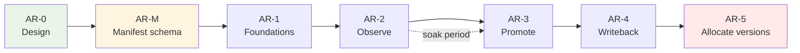

# App Registry — Delivery Plan

Phased build-out of `//tools/app_registry`. Each phase has a **plan ID**; worker
agents track execution in a `TODO-<PLAN_ID>.md` alongside this file (e.g.
`TODO-AR-2.md`). Those TODO files are created when a phase starts, not up front.

Read [ARCHITECTURE.md](ARCHITECTURE.md) before executing any phase.

## Sequencing rationale

Promotion tracking is additive and low-risk; replacing git-tag version
allocation moves an existing working source of truth into a stateful service.
Do the first, prove it, then do the second. Shipping AR-5 before AR-3 would put
a registry outage in the path of every release before the registry has delivered
anything.

AR-M stands alone and delivers value with or without the registry — it fixes
drift that exists today. It is sequenced first because AR-2 otherwise adds a
third manifest representation to the two that already disagree.

---

## AR-0 — Design and contracts

**Status:** complete (this document, `ARCHITECTURE.md`, `README.md`, `protos/`).

**Delivered**
- Proto contracts for all four services, compiling under
  `//tools/app_registry/protos:appregistrypb`.
- Data model, promotability rule, authorization split, writeback mechanism.

**Exit criteria** — met when the promotability model and the chart→image
lockfile approach are agreed, since both touch existing code.

---

## AR-M — Manifest schema consolidation

**Goal:** one definition of what a `release_app` manifest contains. Independent
of the registry — this repays itself immediately by removing existing drift.

**Why first:** `release_helper_go` and `tools/helm/composer.go` both decode the
manifest JSON into their own structs, and they disagree with each other and with
the Starlark rule (see the table in [`../appmeta/README.md`](../appmeta/README.md)).
Adding the registry as a third consumer before fixing this compounds the
problem.

**Scope**
- `//tools/appmeta/proto` — `AppManifest`, `ChartManifest`, `AppManifestSet`,
  `DeployUnit`. *(done in AR-0; consumers not yet migrated)*
- Contract test `//tools/appmeta:manifest_contract_test`, both directions:
  every `app_metadata` target decodes with `DiscardUnknown: false`, and a
  full-coverage fixture app leaves no proto field unset.
- Migrate `tools/helm/composer.go` to `appmetapb.AppManifest`. The dead
  `labels` / `annotations` / `dependencies` fields and the map-iteration
  nondeterminism that would have made the golden-output test below impossible
  are handled separately, in the `helm-deterministic-output` change. That must
  land before this step.
- Migrate `tools/release_helper_go` to `appmetapb.AppManifest`.
- **Remove the `Language`-as-version hack** in `cmd/plan.go` (`apps[i].Language
  = version`, read back via `strings.HasPrefix(app.Language, "v")`), now that
  `version` is a real field. Separate reviewable commit — this changes
  behaviour, not just types.
- Add `deploy_unit` to `release_app` and set it on standalone-image apps
  (e.g. `manmanv2-host-manager`).

**Exit criteria**
- No hand-written manifest struct remains in `tools/`.
- Contract test fails when a rule attr is added without a proto field, verified
  by deliberately breaking it once.
- `bazel test //tools/...` green; a release dry-run produces byte-identical
  charts and plans to before the migration.

**Risk:** the helm composer is on the critical path for every chart build.
Migrate it behind a golden-output test comparing rendered charts pre/post.

---

## AR-1 — Foundations

**Goal:** everything the service needs to exist, with no business logic.

**Scope**
- `tools/app_registry/migrate` — `golang-migrate` runner over embedded SQL,
  following `manmanv2/migrate`. Schema per ARCHITECTURE.md, including the SCD2
  partial unique index and `v_current_promotion`.
- `tools/app_registry/server` — gRPC server skeleton: `libs/go/db` pool,
  `libs/go/grpcauth` interceptors, otelgrpc, reflection, health check. All RPCs
  return `UNIMPLEMENTED`.
- `tools/app_registry/cli` — Cobra skeleton with a thin gRPC client.
- `release_app` manifests for `app-registry-api` and `app-registry-migration`.
- Tilt wiring for local development.

**Exit criteria**
- `bazel test //tools/app_registry/...` green.
- Migrations apply and roll back cleanly.
- Server starts in Tilt and answers reflection + health.

**Risks** — Read `docs/DOCKER.md` before touching image builds; ARM64 breakage
is silent at build time.

**Note:** Temporal moved out of this phase into AR-4. Nothing before the
writeback needs it, and it was the largest unknown here.

---

## AR-2 — Observe (additive recording)

**Goal:** the registry knows everything CI published. Git tags stay
authoritative. Nothing depends on the registry yet.

**Scope**
- Implement `AppRegistry.ReconcileApps`, `ListApps`, `GetApp`, `ListCharts`,
  `SetAppStatus`.
- Implement `ArtifactRegistry.RecordBuild`, `RecordArtifact`, `ListArtifacts`,
  `GetArtifact`, `ResolveArtifact`.
- Idempotency-key storage and replay.
- **`tools/helm/composer.go`: emit a chart lockfile** resolving pinned images to
  digests.
- `release_helper_go`: emit an `AppManifestSet` from `plan` output. No
  conversion code — AR-M made this the same type the registry accepts.
- `.github/workflows/release.yml`: call `app-registry` CLI after image and chart
  pushes. **Best-effort — `continue-on-error`, must never fail a release.**
- CLI: `apps list`, `apps get`, `artifacts list`, `artifacts resolve`.

**Exit criteria**
- Every release for a soak period appears in the registry.
- A parity check confirms registry artifacts match git tags with zero drift.
- `artifacts resolve` on a chart returns correct image digests.

**Soak:** run for several weeks of real releases before starting AR-3. Do not
compress this — it is the phase that earns the trust AR-5 spends.

---

## AR-3 — Promotion

**Goal:** promotion state is recorded and queryable. Still nothing consumes it.

**Scope**
- Implement `EnvironmentRegistry` (all RPCs); seed `dev`/`stage`/`prod`.
- Implement `PromotionRegistry.Promote`, `Rollback`, `GetEnvironmentState`,
  `ListPromotions`, `ListPromotionEvents`.
- SCD2 close-and-open in one transaction; promotion event log.
- Promotability enforcement, including `allow_override` and drift reporting.
- Environment-scoped authorization; `reason` required above rank 0.
- CLI: `promote`, `rollback`, `status <env>`, `history`, `diff <env> <env>`.
- A human-triggered `promote.yml` GitHub workflow using an
  **environment-scoped OIDC subject**, distinct from the builder credential.

**Exit criteria**
- Promote/rollback round-trips correctly; `GetEnvironmentState --at <T>` returns
  correct historical state.
- Attempting to promote a `VIA_CHART` image without `allow_override` is
  rejected; with it, drift is reported.
- The builder credential is verifiably unable to promote.

---

## AR-4 — Writeback interface (stub implementation)

**Goal:** establish the contract that carries promotion state out of the
registry, without wiring it to anything. Publishing targets live in another
repo and are out of scope.

**Scope**
- `writeback_outbox` written inside the promotion transaction.
- `libs/go/temporal` — client construction, env-driven config, worker
  bootstrap, logging bridge to `libs/go/logging`. Add `go.temporal.io/sdk` to
  `go.mod` and `MODULE.bazel`. **Not present in Go anywhere in this repo yet**
  (fcm uses the Python SDK) — the largest unknown in the project, moved here
  from AR-1 because nothing earlier needs it.
- `tools/app_registry/worker` — Temporal worker draining the outbox.
- `WritebackWorkflow` (workflow id = promotion id) over a `Writeback`
  activity interface, with a **stub implementation** that renders environment
  state and writes it to a local path or object store — publishing nowhere.
- `state_hash` no-op detection, so the real implementation inherits it.
- `release_app` for `app-registry-worker`.

**Exit criteria**
- A promotion enqueues an outbox row in the same transaction and the workflow
  drains it exactly once, verified by killing the worker mid-run.
- Rendered state matches `GetEnvironmentState` output.
- The activity interface is documented well enough that swapping the stub for a
  gitops committer needs no schema, proto, or workflow change.

**Explicitly not in scope:** committing to the gitops repo, S3 publication,
pointing ArgoCD at registry-written state. Those land when the other repo's
changes are ready.

**Consequence to track:** the "registry can be down without blocking a deploy"
property is not actually exercised until the real writeback ships. Do not claim
it as verified before then.

---

## AR-5 — Version allocation

**Goal:** the registry becomes the version source of truth. Highest risk —
CI now depends on the registry being up.

**Scope**
- Implement `ArtifactRegistry.AllocateVersion` against a unique
  `(owner, kind, version)` constraint.
- Replace `autoIncrementVersion` in `tools/release_helper_go/cmd/plan.go`,
  gated on the calling domain's adoption stage.
- **Per-domain cutover.** `AllocateVersion` serves only domains at stage
  `allocate` and rejects the rest, so a misconfigured CI job fails loudly
  rather than silently allocating against the wrong source of truth. Cut over
  one low-traffic domain first, then widen.
- **Keep writing git tags** as a redundant record and disaster-recovery path.
- Seed each domain's starting version from its existing tags at the moment it
  is promoted to `allocate`, so numbering stays continuous.
- Remove the release workflow's version-allocation concurrency group once every
  domain has cut over — not before.

**Exit criteria**
- Concurrent releases of the same app cannot receive the same version.
- Allocated versions match what tag-scanning would have produced, verified
  against the AR-2 soak data.
- A domain not at `allocate` still releases through the tag path, unchanged.
- A documented, rehearsed fallback to tag-based allocation exists — per domain,
  by moving its stage back.

**Do not start** until AR-2's parity check has been clean across a meaningful
number of real releases.

---

## Explicitly out of scope

Not in any phase above; the schema accommodates them without migration.

- Approval gates (`PENDING_APPROVAL` state exists but is never written).
- Ephemeral / per-PR environments (an environment row insert, when wanted).
- Automatic rollback on failed deploy — needs deploy-health signal the registry
  does not have.
- Web UI. The CLI stays thin specifically so this can be added without
  reimplementing rules.
- Backfilling historical artifacts from GHCR. Recommendation in
  ARCHITECTURE.md: don't.
