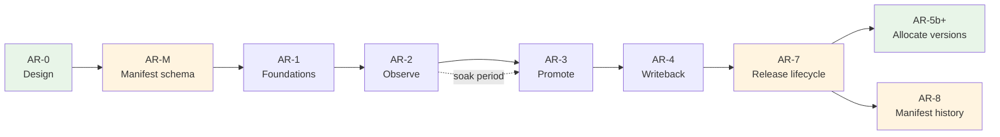

# App Registry — Delivery Plan

Phased build-out of `//tools/app_registry`. Each phase has a **plan ID** (AR-M,
AR-1, AR-2a…). This file holds what's true *right now* — deployment state,
open bugs, deferred work, what's next. Full as-built detail for every
completed phase lives in [PLAN-HISTORY.md](PLAN-HISTORY.md), split out so
this file stays something an agent can read in one pass; see "Phase history"
below for when to open it.

(Earlier phases kept a per-phase `TODO-<PLAN_ID>.md` alongside this file. The
convention was applied to only half the phases before being dropped; those
files were retired in AR-6b and anything still load-bearing was folded into
PLAN-HISTORY.md.)

Read [ARCHITECTURE.md](ARCHITECTURE.md) before executing any phase.

---

## Current status

*Last updated for AR-5b ([issue #829](https://github.com/whale-net/everything/issues/829), [PR #831](https://github.com/whale-net/everything/pull/831), pending merge). PR
[#630](https://github.com/whale-net/everything/pull/630) merged (2026-08-15).
**AR-M through AR-7f are all merged to `main`** — see the table below.*

| Phase | PR | State |
|---|---|---|
| AR-M | [#495](https://github.com/whale-net/everything/pull/495) | merged |
| AR-1 | [#496](https://github.com/whale-net/everything/pull/496) | merged |
| AR-2a | [#499](https://github.com/whale-net/everything/pull/499) | merged — verified against real Postgres |
| AR-2b | [#500](https://github.com/whale-net/everything/pull/500) | merged — charts byte-identical |
| AR-2c | [#502](https://github.com/whale-net/everything/pull/502) | merged — CI path unexercised until the registry is deployed |
| dbtest | [#498](https://github.com/whale-net/everything/pull/498) | merged — `libs/go/dbtest` available |
| AR-2d | [#503](https://github.com/whale-net/everything/pull/503) | merged |
| AR-3a…AR-3d | [#504](https://github.com/whale-net/everything/pull/504), [#508](https://github.com/whale-net/everything/pull/508), [#509](https://github.com/whale-net/everything/pull/509), [#511](https://github.com/whale-net/everything/pull/511) | merged |
| AR-4a / AR-4b | [#512](https://github.com/whale-net/everything/pull/512), [#514](https://github.com/whale-net/everything/pull/514) | merged — writeback `Publish` is still the stub |
| AR-5a | [#513](https://github.com/whale-net/everything/pull/513) | merged — `AllocateVersion` implemented, not yet called by any release path (wired in AR-5b) |
| AR-5b (issue #829) | [#831](https://github.com/whale-net/everything/pull/831) | merged — `AllocateVersion` wired into every real version-resolution call site via `resolveVersion` — see "Version allocation (AR-5)" below |
| AR-6a / AR-6b | [#516](https://github.com/whale-net/everything/pull/516), [#515](https://github.com/whale-net/everything/pull/515) | merged |
| AR-7 (design) | [#559](https://github.com/whale-net/everything/pull/559) | merged — design + delivery plan only, no implementation |
| AR-7a | [#561](https://github.com/whale-net/everything/pull/561) | merged — sweep robustness, no schema change |
| AR-7b | [#562](https://github.com/whale-net/everything/pull/562) | merged — artifact lifecycle, migration `007`, `BeginPublish`/`FailPublish`, stale-row reaper |
| AR-7c | [#566](https://github.com/whale-net/everything/pull/566) | merged — app identity/manifest-snapshot split, migration `008`, `AssertApps` |
| AR-7d | [#567](https://github.com/whale-net/everything/pull/567) | merged — `GetReleaseRun`, `BeginPublishBatch`, `app-registry builds status`, `release.yml` resume, no schema change |
| AR-7e | [#571](https://github.com/whale-net/everything/pull/571) | merged — `AdoptArtifact` (admin-only), `app-registry artifacts adopt`/`list --provenance`, OPERATIONS.md disaster-recovery runbook, no schema change |
| AR-7f | [#572](https://github.com/whale-net/everything/pull/572) | merged — `CheckChartHermeticity` RPC, `build-helm-chart` call site, no schema change; unconditionally enforced for every domain |

**Post-AR-7 fixes, all merged, found by running the deployed `dev` registry
for real:** [#574](https://github.com/whale-net/everything/pull/574) (issue
#570 — distinguish CI/server version skew from a transient outage),
[#576](https://github.com/whale-net/everything/pull/576) (issue #575 —
idempotency lookups were keyed by string alone, so `RecordArtifact` could
silently replay `BeginPublish`'s stored response), `#579`/`#580` (chart
naming/repository bugs blocking `BeginPublish` for charts), `#583`
(`tools/app_registry/citest`, a contract test over every real `app-registry`
CLI invocation embedded in `.github/workflows/*.yml` — every bug in this list
lived at that CI-shell-to-CLI seam, invisible to unit tests and to a green
run because recording is `continue-on-error`), and issue
[#585](https://github.com/whale-net/everything/issues/585) —
`RecordArtifact`'s idempotent-replay lookup matched an existing row by
`digest` alone, with no `(owner, kind, version)` scoping. A reproducible,
no-op rebuild (routine in this monorepo — a release batch commonly rebuilds
every app in a domain even when only one changed) can produce a digest
identical to an older published version of the *same* app; the lookup
matched the old row and reported success without ever touching the new
version's `publishing` row, stranding it until the reaper reaped it.
Confirmed against run 31660476677: all four `app-registry` images it
released (cli, api, migration, worker) hit this. Fixed by scoping the
lookup to the request's own `(owner, kind, version)` identity — a
same-digest/different-version request now falls through to the real
`artifact_digest_idx` unique-constraint check instead, which fails the
request loudly rather than silently stranding it. That constraint is now a
real gate for every domain, unconditionally (recording is always mandatory)
— a reproducible no-op rebuild that collides with an older version's digest
would hard-fail the release job outright, except this is handled upstream
of App Registry — see "Version allocation (AR-5)" below.

The registry is deployed to `dev` and is being actively exercised by real
release runs (see run 31660476677 above) — `app-registry-api`
and `app-registry-migration` images publish from `apps=all`. Every domain,
including `app-registry`'s own, allocates versions unconditionally
(`domain_adoption` doesn't exist — see "Version allocation (AR-5)" below).
`APP_REGISTRY_CICD_OPT_IN` is `true` (recording steps ran against `dev` and
wrote real rows in the run above).

**AR-3 (promotion) and AR-4 (writeback) are implemented and merged.** The
writeback *contract* — outbox, worker, workflow, stub activity — is done; the
real gitops/S3 publish is deliberately still out of scope (see AR-4b below).
The per-phase sections in PLAN-HISTORY.md were written while these were
still in flight and say "not merged" in places; the table above is
authoritative.

**AR-7 (issue #558): every sub-phase, AR-7a through AR-7f, is merged to
`main`.** The full phase makes a release run
hermetic — no dependency on `main`'s reconcile having gone first — via an
artifact
`allocated → publishing → published` lifecycle, an identity/manifest-snapshot
split of `app`, and a run log CI writes to. AR-7a fixes ordering 4 (see
ARCHITECTURE.md "The problem: four cross-run orderings"): `ReconcileApps` is
now partially applying (one bad chart is skipped and reported, not a
whole-sweep rollback), chart manifests carry domain-qualified app references
so a bare-name collision across domains can't break the sweep, and `ci.yml`'s
`reconcile-app-registry` job is no longer `continue-on-error`. AR-7b adds the
artifact lifecycle states, migration `007`, `BeginPublish`/`FailPublish` and
the stale-row reaper, and its exit criteria are met (see its subsection in
PLAN-HISTORY.md). AR-7c adds `AssertApps`, migration `008`'s
identity/manifest-snapshot split, and the promotability-retroactivity fix
(see its subsection). AR-7d adds `GetReleaseRun`, the bulk
`BeginPublishBatch` RPC that closes the gap AR-7b's own "Deliberately NOT
done" left open (see AR-7b's section in PLAN-HISTORY.md), `app-registry
builds status`/`--incomplete`, and `release.yml`'s resume behavior. AR-7e
adds `AdoptArtifact` — an admin-only, per-artifact path for recording an
artifact the registry never observed being published, used when a chart
release fails on a pre-registry pin, plus OPERATIONS.md's disaster-recovery
runbook. AR-7f adds `ArtifactRegistry.CheckChartHermeticity` and its call
site in `build-helm-chart`, moving the "chart may only pin published images"
rule from record time to compose time, unconditionally enforced for every
domain — see its subsection for the full contract. **Every sub-phase
of AR-7 is implemented and merged.** Design is in
ARCHITECTURE.md's "Release lifecycle (issue #558)"; delivery is "AR-7" in
[PLAN-HISTORY.md](PLAN-HISTORY.md).

**Where deferred work is tracked.** Three places, deliberately:
[Carry-over items](#carry-over-items) below for small cross-cutting gaps that
belong to no single phase; each completed phase's own **"Deliberately NOT
done"** subsection in [PLAN-HISTORY.md](PLAN-HISTORY.md) for scope that phase
consciously left; and "Explicitly out of
scope" at the end of this document for things no phase will do. If you are
picking this up cold, read those three before starting anything.

### Carry-over items

- **`server/repository/postgres/*.go` has no automated test coverage.** ~~Handler
  logic is tested against the in-memory fake; the SQL is compile-checked only.~~
  **Resolved by AR-2d** — see `server/repository/postgres/postgres_integration_*_test.go`. The SCD2
  `promotion` table's partial unique index is still untested; it doesn't
  exist until AR-3's migration `002` lands (see AR-2d's scope note above).
- **Auth is unimplemented.** ~~Handlers check no claims; the Tiltfile runs
  `GRPC_AUTH_MODE=none`.~~ **Resolved by AR-3a** — role model in
  `server/auth`, enforced on every RPC. Note `GRPC_AUTH_MODE` still
  *defaults* to `none`, in which the server grants every caller every role;
  that is intentional (Tilt and local dev depend on it) and is the
  deployer's responsibility to override. See DEPLOY.md §3.
- **Transaction-abort hazard for AR-3.** A failed statement aborts the
  surrounding Postgres transaction, so any error-message or logging code that
  queries afterwards silently degrades. This bit `RecordArtifact` once already;
  AR-3's SCD2 close-and-open writes are transactional and will hit the same trap.
- **Tilt is validated and documented** — see [TESTING.md](TESTING.md). It is the
  only thing currently exercising the pgx layer.
- `list-apps --format json` prints `deploy_unit` as an integer. Cosmetic; no CI
  path reads it.
- **`promotion_event.temporal_workflow_id` / `temporal_run_id` are never
  stamped back** (AR-4b). `003_promotion.up.sql`'s schema comment anticipates
  them, and `WritebackOutbox.EventID` exists precisely so the worker can do
  it, but nothing writes them — so an operator cannot jump from an audit row
  to its Temporal workflow history. Needs an `event_id`-keyed update path
  from the worker.
- **Temporal `WorkflowIDReusePolicy` is left at the SDK default** (AR-4b),
  reasoned about in `worker/outbox/drain.go`'s comments but never
  independently stress-tested. Relevant because workflow id = promotion id,
  so reuse semantics decide what happens when a promotion is retried.
- **`--format table` is unimplemented across the whole CLI** — every command
  falls back to JSON with a `# table format not implemented yet` notice
  (`cli/cmd/client.go`, `cli/cmd/util.go`). Pre-existing, cosmetic, but the
  flag is advertised.
- **No admin/web UI.** Deferred as non-critical for launch. PLAN.md's
  out-of-scope list notes the CLI is kept thin specifically so a UI can be
  added without reimplementing rules server-side.

## App Registry v2 release job — migration checklist

Informal tracker for [plan #912](https://github.com/whale-net/everything/issues/912)'s
FR5: which domains dispatch releases through `.github/workflows/release.yml`
(v1) vs `.github/workflows/release-v2.yml` (v2). No schema or tooling — the
`WorkflowFile` a `GitHubDispatcher` dispatches against
(`tools/app_registry/worker/release/github.go`) is a single **global**
setting (`RELEASE_GITHUB_WORKFLOW_FILE`, default and required value
`release-v2.yml` — see `tools/app_registry/ENV.md`), not something repointed
per domain. The actual gate on a domain's cutover is whether `TriggerRelease`
(`tools/app_registry/server/handlers/release.go`) is ever called for that
domain's real releases — i.e. whether the App Registry UI/API is used to
trigger the domain's releases at all — not a config value to flip. Not a
gate on #912's FR7 retirement; kept only for visibility during v2's
build-out. `release-v2.yml` has real, non-stub job bodies (ported in by
PR #924) — cutover is gated on the domain actually calling `TriggerRelease`,
not on job-body readiness.

| Domain | Dispatch target | Notes |
|---|---|---|
| `demo` | v1 (`release.yml`) | Not yet migrated |
| `manman` | v1 (`release.yml`) | Not yet migrated |
| `manmanv2` | v2 (`release-v2.yml`, Temporal-dispatched) | `TriggerRelease` is live for this domain's real releases (`release_run_target` rows exist for `manmanv2` apps/charts as of 2026-08-22). |
| `friendly_computing_machine` | v1 (`release.yml`) | Not yet migrated |
| `leaflab` | v2 (`release-v2.yml`, Temporal-dispatched) | `TriggerRelease` is live for this domain's real releases (`release_run_target` rows exist for `leaflab` as of 2026-08-22). |
| `firmware` | v1 (`release.yml`) | Not yet migrated |
| `tools` (release tooling itself) | v1 (`release.yml`) | Not yet migrated — no `tools-*` CLI release target has appeared in `release_run_target` yet. |
| `app-registry` | v2 (`release-v2.yml`, Temporal-dispatched) | `TriggerRelease` is live for this domain's real releases (`release_run_target` rows exist for `app-registry` as of 2026-08-22). |

## Sequencing rationale

Promotion tracking is additive and low-risk; replacing git-tag version
allocation moves an existing working source of truth into a stateful service.
Do the first, prove it, then do the second. Shipping AR-5 before AR-3 would put
a registry outage in the path of every release before the registry has delivered
anything.

AR-8 depends only on AR-7 being merged (it rewrites AR-7c's `v_current_app`/
`artifact.manifest_id`) — independent of AR-5 in either direction.

**AR-7 (issue #558) sat between AR-4 and AR-5's version-allocation rollout**,
despite its number: version allocation happens *before* a build exists, so a
release needs identity resolved even earlier than it did before — the
release-vs-reconcile gap would have gotten strictly worse under AR-5 without
AR-7 first. AR-7a and AR-7b were independently valuable and could land at
any time.

AR-M stands alone and delivers value with or without the registry — it fixes
drift that exists today. It is sequenced first because AR-2 otherwise adds a
third manifest representation to the two that already disagree.

---

## Version allocation (AR-5)

`AllocateVersion`, `CheckChartHermeticity`, and `RecordArtifact`'s
prior-`BeginPublish` requirement apply unconditionally to every domain —
`domain_adoption` (migration `022_drop_domain_adoption`) is dropped, and
there is no per-domain concept left anywhere in this system. `resolveVersion`
(`tools/release_helper_go/cmd/registry_version.go`) always calls
`AllocateVersion` once the registry integration is opted in
(`APP_REGISTRY_CICD_OPT_IN=true`); the only remaining fallback to git-tag
scanning is that global opt-in switch being off (no registry client dialed
at all), not anything per-domain. See ARCHITECTURE.md's "Version model" for
the full design (semver semantics, ordering, idempotency) and
PLAN-HISTORY.md's "AR-5" section for how `AllocateVersion` itself was built
and wired in (issue #829, PR #831).

**Known gaps:**
- The "allocated versions match tag-scanning" parity check that was meant to
  run during an initial soak period was never built and never run — the
  rollout ended up unconditional rather than soak-gated (see PLAN-HISTORY.md's
  AR-5a section), so this check never happened.
- The release workflow's version-allocation concurrency group is untouched.
- v1 (`release-app`/`release-charts`, `release.yml`) still creates local git
  tags on every release, kept as a disaster-recovery record — neither
  command ever pushes them to origin, so this costs nothing to keep. v2
  (`finalize-app`/`finalize-chart`) never created tags to begin with.

**The digest-collision case a reproducible no-op rebuild can hit** is
handled upstream of App Registry, in the release pipeline. Issue
[#585](https://github.com/whale-net/everything/issues/585) (PR
[#600](https://github.com/whale-net/everything/pull/600)) scoped
`RecordArtifact`'s idempotent-replay lookup to `(owner, kind, version)`
instead of digest alone; PR
[#630](https://github.com/whale-net/everything/pull/630) then fixed the
resulting same-digest/different-version hard-fail (issues #617, #628)
entirely upstream: `release.yml`'s tag-creation steps now check the
just-built digest against the most recent existing tag's digest before
minting a new version tag, and skip tag creation (and the App Registry
record call) on a match — so a no-op rebuild never reaches App Registry as
a "new" artifact in the first place.

---

## AR-8 — SCD2 manifest history (issue #587)

**Goal:** stop `ReconcileApps` from writing one `app_manifest`/`chart_manifest`
row per app per `main` commit unconditionally (migration 008's shape) — row
count should scale with manifest *content* change, not CI frequency. Fixes
the legibility complaint in issue #581 and the unbounded growth of
`v_current_app`'s `LEFT JOIN LATERAL` scan.

**Depends on AR-7 being fully merged** (it rewrites `v_current_app` and
`artifact.manifest_id`, both created by AR-7c/migration 008) — satisfied, see
"Current status" above.

**Scope**
- Migration `010`: splits `app_manifest`/`chart_manifest` into
  content-addressed tables (one row per DISTINCT manifest per owner, ever)
  plus `app_manifest_history`/`chart_manifest_history` (SCD2, the `main`
  sweep timeline), `app_manifest_release`/`chart_manifest_release`
  (release-time observations), and `reconcile_run` (one row per sweep).
  Backfills existing data via the `LEAD()`/`LAG()` window-function pattern
  AGENTS.md prescribes for deriving SCD2 over a non-SCD2 table, and remaps
  every pre-migration `artifact.manifest_id` from its old per-commit id to
  the new content id.
- `postgres/app.go`: `Reconcile`'s manifest write becomes an SCD2
  close-and-open compare-swap against `*_manifest_history`;
  `AssertApps`'s becomes a plain insert into `*_manifest_release`. Neither
  touches the other's table.
- `postgres/artifact.go`: `resolveManifestForPublish` gains a third
  fallback tier (exact release match → current-history-interval commit
  match → current-history-interval regardless of commit), propagating the
  new O(1) "current" lookup to publish time too.
- Full detail, including the design tradeoffs against three rejected
  alternatives (add `valid_from`/`valid_to` to `app_manifest` in place;
  content-dedupe alone with no history table; skip-insert-when-unchanged
  with no schema change at all), is in ARCHITECTURE.md's "App identity vs.
  per-build manifest snapshot" → "As built (AR-8, migration `010`)".

**Deliberately NOT done**
- No backfill of historical `reconcile_run` rows for sweeps that predate
  this migration — no acceptance criterion needs it, and reconstructing "one
  row per sweep" faithfully from the old per-app data is only approximate.
  Going forward is what the issue asks for.
- `chart_app`'s destructive rewrite-on-every-sweep (issue #587's own
  "Follow-up, out of scope") is untouched — a separate ticket once chart
  manifests carry `app_refs` on the open `chart_manifest` row.

**Testing note:** every acceptance criterion below is covered by new
`postgres_integration_*_test.go` tests (real-Postgres tier, tag
`integration`/`manual`) — this repo's dev sandbox has no Docker available to
run that tier locally; it needs CI's `Test Database Integration` job (or a
local run with a working Docker daemon) before merge.

**Exit criteria**
- A sweep where no manifest changed inserts zero new `app_manifest`/
  `app_manifest_history` rows — only `last_git_sha` and `reconcile_run`
  advance.
- A sweep where one app changed closes exactly that app's open history row
  and opens exactly one new one.
- A → B → A produces three history rows with non-overlapping intervals in
  the correct order.
- `AssertApps` from a non-`main` ref writes a content row + an
  `*_manifest_release` row and never touches `*_manifest_history`.
- `v_current_app`/`v_current_chart` return byte-identical results to
  pre-migration for every existing app/chart.
- Every pre-migration `artifact.manifest_id` resolves to a content row with
  the same `manifest_json` it pointed at before; `promotability` is
  unchanged for every existing artifact row.
- `resolveManifestForPublish` still prefers the build's exact `git_sha`.
- `010_*.down.sql` restores the pre-migration (migration 008) shape.

---

## Phase history

Full as-built detail for every phase (AR-0 through AR-7f, all merged) is in
[PLAN-HISTORY.md](PLAN-HISTORY.md) — goal, scope, exit criteria, and what
shipped, per phase, in the same order as the status table above. Read it when
you need the *why* or the *as-built specifics* behind a row in that table;
the table itself, and the deferred-work sections in this file, are enough for
picking up cold.

## Explicitly out of scope

Not in any phase above; the schema accommodates them without migration.

- Approval gates (`PENDING_APPROVAL` state exists but is never written).
- Ephemeral / per-PR environments (an environment row insert, when wanted).
- Automatic rollback on failed deploy — needs deploy-health signal the registry
  does not have.
- Web UI. The CLI stays thin specifically so this can be added without
  reimplementing rules.
- Backfilling historical artifacts from GHCR. Recommendation in
  ARCHITECTURE.md: don't.
