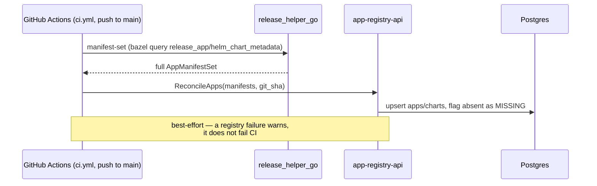
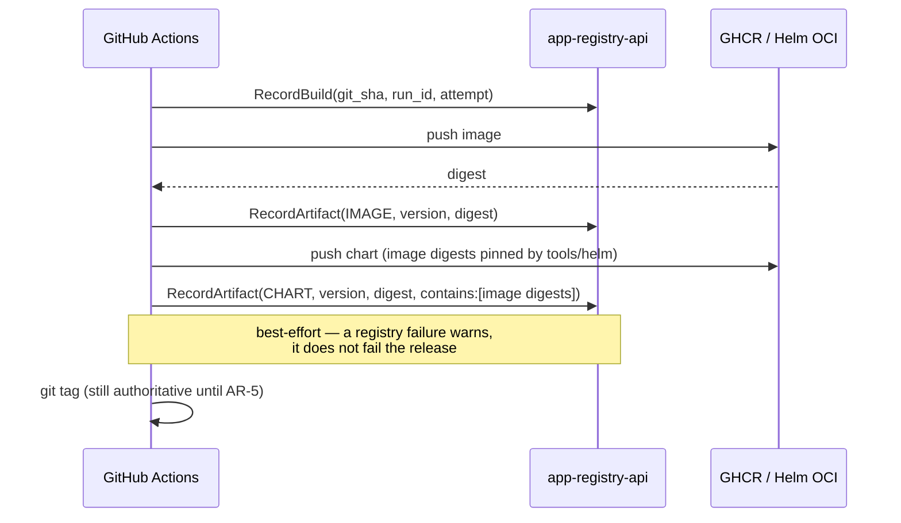
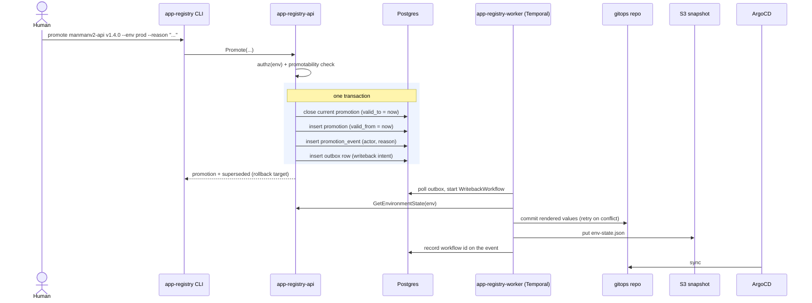
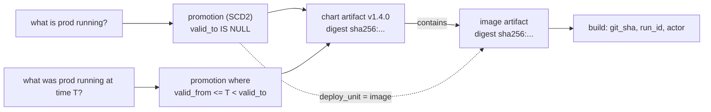

# App Registry

A gRPC service that records what CI published and tracks which artifact is
promoted to each environment.

Today the monorepo's release system is declarative and works well: `release_app`
manifests describe apps, `tools/release_helper_go` builds images and charts from
them, and git tags track versions. What has no home is **promotion state** —
"stage is running `manmanv2-control-api v1.4.0`, prod is two versions behind".
That currently lives implicitly in ArgoCD values files and in people's heads.

The App Registry gives that state a home, and along the way becomes the
authoritative index of every artifact CI has published.

**The registry records and answers questions. It does not deploy anything.**
Deployment stays with ArgoCD, reading state the registry writes back to the
gitops repo.

## What it is not

- Not a deployer. It never talks to a cluster.
- Not a replacement for GHCR. The OCI registry still holds the bits; this holds
  the metadata and the promotion state.
- Not an approval workflow engine (yet). The schema leaves room — see
  [ARCHITECTURE.md](ARCHITECTURE.md#future-approval-gate) — but AR-3 promotes
  immediately.

## Core concepts

| Concept | What it means |
|---|---|
| **App** | One `release_app` manifest. Identity is `<domain>-<name>`. |
| **Chart** | A Helm chart composing one or more apps. Usually the real deploy unit. |
| **Deploy unit** | Declared per app: does it reach an environment via a `chart`, as a standalone `image`, or `none` (build-only)? This is what makes "what can I promote?" answerable. |
| **Build** | One CI run. Every artifact traces back to a commit and workflow run. |
| **Artifact** | A published image or chart, identified by **digest**. The semver tag is a label; the digest is the identity. |
| **Environment** | A row (`dev`/`stage`/`prod`/…), not an enum, so new environments are an insert. |
| **Promotion** | SCD2 state: which artifact is current in an environment, and what was current at any past instant. |

### Promotability

The single most useful thing the registry encodes. Each artifact carries a
derived `promotability`, computed from its owning app's declared deploy unit:

- `PROMOTABLE` — a legal, first-class promotion target.
- `VIA_CHART` — reaches environments only by being pinned inside a chart.
  Promoting it directly is possible but recorded as an **override** and reported
  as drift.
- `NOT_PROMOTABLE` — never deployed; promotion is rejected.

So `app-registry promote --list` shows exactly the things you can legally
promote, rather than every image ever pushed.

## Flows

### Reconcile (CI, every push to `main`, decoupled from release)

`ReconcileApps` needs the complete, current manifest set -- anything absent
from what it's given gets flagged `MISSING` -- so it runs from `ci.yml` on
every push to `main`, never from `release.yml`, which can be dispatched
against an arbitrary (possibly older) ref. See ARCHITECTURE.md "Rejected
alternatives" for why a release-scoped registration call was ruled out.

### Recording (CI, additive and non-blocking)

Recording assumes the app/chart being recorded was already reconciled by a
prior push to `main` — see "Reconcile" above.

### Promotion and writeback

The transactional outbox matters: the promotion row and the intent to write
back commit together, so the registry can never believe something was promoted
without a writeback eventually happening. See
[ARCHITECTURE.md](ARCHITECTURE.md#writeback-outbox--temporal).

### Incident-time query

## Components

| Target | What it is |
|---|---|
| `//tools/app_registry/protos:appregistrypb` | Proto definitions and generated Go |
| `//tools/app_registry/server` | gRPC server (`app-registry-api`) |
| `//tools/app_registry/worker` | Temporal worker (`app-registry-worker`) — gitops writeback |
| `//tools/app_registry/cli` | Thin gRPC client (`app-registry`) |
| `//tools/app_registry/migrate` | Schema migrations (`app-registry-migration`) |

The CLI is deliberately **thin** — no version math, no promotion-legality
checks. All rules live server-side so a future UI cannot drift from it.

## Status

Not tracked here — it changes independently of this file and duplicating it
invites drift. See [PLAN.md](PLAN.md) → "Current status" for what's deployed
and merged right now, and [ARCHITECTURE.md](ARCHITECTURE.md) for the data
model and the decisions behind it.
