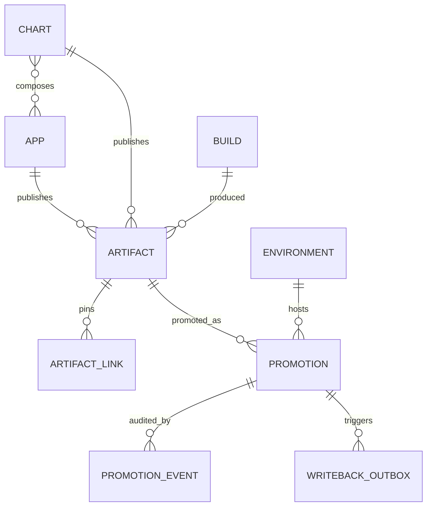

# Data model



## Tables

| Table | Shape | Notes |
|---|---|---|
| `app` | mutable, reconciled | `(domain, name)` unique. `status` ∈ active/missing/archived. Never hard-deleted. |
| `chart` | mutable, reconciled | `(domain, name)` unique. **Not SCD2** — see "Resolved questions" #4. |
| `chart_app` | join, current-state only | Which apps a chart *currently* declares, per its latest manifest. Destructively rewritten (`DELETE` + re-`INSERT`) by every `Reconcile`. Informational only — never read on the promotion/writeback render path. **Not SCD2** — see "Resolved questions" #4. |
| `build` | append-only | `(workflow_run_id, workflow_attempt)` unique. |
| `artifact` | append-only | `digest` globally unique. `(owner, kind, version)` unique. `version_major/minor/patch` (AR-5a) back numeric ordering — see "Version model" below. |
| `artifact_link` | append-only | Chart artifact → pinned image artifact, written once at `RecordArtifact` time and never mutated. This is what makes a promoted chart artifact's rendered app list deterministic — see "Resolved questions" #4. |
| `environment` | mutable | `key` unique. `rank` orders promotion legality. |
| `promotion` | **SCD2** | `valid_from` / `valid_to`. Partial unique index on current rows. |
| `promotion_event` | append-only | Who, why, when, and the Temporal workflow id. |
| `writeback_outbox` | append-only + claimed | Transactional outbox, drained by the worker. |
| `idempotency_key` | append-only | Key → prior response, for safe CI retries. |
| `version_allocation` | append-only | AR-5a. `AllocateVersion`'s reservation ledger — see "Version model" below. |
| `reconcile_watermark` | singleton, mutable | Migration 006 (issue #545). Exactly one row (`id = 1`), seeded as a sentinel. Guards `Reconcile` against a stale (older-commit) call — see "Reconcile watermark" below. |
| `app_manifest` / `chart_manifest` | append-only, content-addressed | Migration 010 (AR-8, issue #587). One row per DISTINCT manifest per owner, ever — `UNIQUE (owner_id, manifest_hash)`. `app`/`chart` themselves are pure identity (`domain`, `name`, `status`, first/last-seen); everything else is read off the owner's CURRENT manifest via `v_current_app`/`v_current_chart`. See "App identity vs. per-build manifest snapshot" below. |
| `app_manifest_history` / `chart_manifest_history` | **SCD2** | Migration 010 (AR-8). The `main` sweep timeline — `valid_from`/`valid_to`, written ONLY by `ReconcileApps`. Partial unique index on current (`valid_to IS NULL`) rows backs `v_current_app`'s point lookup. |
| `app_manifest_release` / `chart_manifest_release` | append-only | Migration 010 (AR-8). One row per `(owner, git_sha)` observed by `AssertApps`, from any ref. Keeps `resolveManifestForPublish`'s exact-commit preference working without perturbing the `main` timeline. |
| `reconcile_run` | append-only | Migration 010 (AR-8). One row per sweep that actually applies — replaces the old one-row-per-app-per-sweep record `app_manifest` used to be. |

`artifact` gained `state`/`provenance`/`version_source` with nullable
`digest`/`build_id` in AR-7b (migration 007), absorbing `version_allocation`,
which was dropped, and gained `manifest_id`/`promotability` in AR-7c
(migration 008). `promotability` was dropped again by issue #833 (migration
014) — it is derived live on every read (joined against the owning app's/
chart's CURRENT `deploy_unit`), not stored; `manifest_id` is unaffected and
remains a stored column. AR-7 (issue #558) is fully merged — see "Release
lifecycle (issue #558)" below.

## SCD2 on `promotion`

Follows the repo-wide convention in `AGENTS.md` exactly:

```sql
-- write path: close and open, in one transaction
UPDATE promotion SET valid_to = NOW()
 WHERE environment_id = $1 AND target_key = $2 AND valid_to IS NULL;
INSERT INTO promotion (environment_id, target_key, artifact_id, ...)
VALUES ($1, $2, $3, ...);
```

```sql
-- current state
SELECT * FROM promotion
 WHERE environment_id = $1 AND valid_to IS NULL;

-- state at time T (the incident query)
SELECT * FROM promotion
 WHERE environment_id = $1
   AND valid_from <= $t
   AND (valid_to IS NULL OR valid_to > $t);
```

Backed by `CREATE UNIQUE INDEX ON promotion(environment_id, target_key) WHERE
valid_to IS NULL` — this both accelerates the hot query and makes
double-promotion structurally impossible.

`target_key` is the promoted thing's identity (`<kind>:<owner_full_name>`),
denormalized so the partial unique index is expressible without a nullable
two-column target.

A `v_current_promotion` view pre-joins promotion → artifact → app/chart → build
so the CLI, the writeback worker, and any future UI never re-derive the join.

