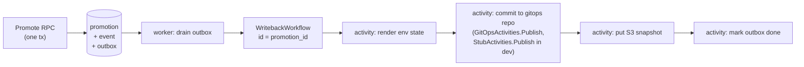

# Writeback: outbox → Temporal

Promotion and the intent to write it back **must** commit atomically. If they
don't, the registry can believe prod is on v1.4.0 while the gitops repo still
says v1.3.0, which is the exact failure mode this system exists to prevent.

Since Temporal cannot enlist in a Postgres transaction, the server writes a
`writeback_outbox` row inside the promotion transaction. The worker drains the
outbox and starts a `WritebackWorkflow` with the promotion id as its workflow
id, so Temporal's own dedup makes redelivery harmless.

Activities are individually retryable and idempotent. The gitops commit
activity uses `state_hash` from `GetEnvironmentState` (or, for the real
`GitOpsActivities` path, a comparison against the remote file's current
content — see below) to skip no-op commits, and retries on push conflict by
re-reading state — last writer wins on a per-environment file, which is
correct because the registry is the source of truth for that file.

The gitops-committed path is `<domain>/<chart-name>/versions/<environment.key>.yaml`,
computed at render/publish time from the promotion's `domain` (threaded
through the outbox row and `WritebackInput`, see below), the chart's `full_name`
(resolved via `AppRegistry.ListCharts`), and the target
environment's `key`. **`Environment.gitops_path`** (the stored column on
`environment`, `protos/messages.proto`'s `gitops_path` field,
`ui/pages/environment_form.templ`'s form field) **is confirmed dead for
this purpose** — nothing in the writeback path reads it. It remains present
in the schema/proto/UI as a leftover from before this convention was
settled; do not add a reader for it here.

**As of AR-4b, the diagram above is built through "activity: render env
state" only** — the render and publish steps exist, the S3 put does not
(see PLAN-HISTORY.md's AR-4b "Explicitly not in scope"). Concretely:

- `server/handlers/promotion.go`'s `enqueueWriteback` writes the
  `writeback_outbox` row inside the exact same transaction as the SCD2
  close-and-open write and the `promotion_event` insert (extending AR-3c's
  transaction, not opening a second one), with `state_hash` computed via the
  same `stateHash` function `GetEnvironmentState` uses, over a fresh
  `StateAt` read taken inside that transaction — so the value on the outbox
  row is guaranteed consistent with what a `GetEnvironmentState` call
  returns immediately after commit.
- `tools/app_registry/worker` (`app-registry-worker`) is a long-running
  process (not a job) that both polls `writeback_outbox` directly against
  Postgres (`outbox.Drainer`, using an atomic
  `UPDATE ... WHERE outbox_id IN (SELECT ... FOR UPDATE SKIP LOCKED)` claim
  query) and runs a `go.temporal.io/sdk/worker.Worker` listening on task
  queue `app-registry-writeback`.
- `WritebackWorkflow` (`worker/writeback/workflow.go`), workflow id =
  promotion id, calls exactly two activities behind the `Writeback`
  interface: `RenderEnvironmentState` (reads `GetEnvironmentState` via the
  gRPC API — never Postgres directly, keeping with "the API is the write
  path" above) then `Publish`. AR-4b ships `StubActivities`
  (`worker/writeback/stub.go`): `Publish` writes the rendered JSON to a
  local path (`WRITEBACK_OUTPUT_DIR`) and skips the write when a sidecar
  file shows the state_hash already matches — the no-op detection a real
  gitops-committer `Publish` implementation inherits by satisfying the same
  `Writeback` interface. See `worker/README.md` for the full mechanism and
  how "killed mid-run" was verified. `StubActivities` remains the no-config
  dev/test fallback: `worker/main.go` registers it whenever
  `WRITEBACK_GITOPS_REPO` is unset, so `bazel test`, local dev, and Tilt keep
  working with zero writeback config.
- When `WRITEBACK_GITOPS_REPO` is set, `worker/main.go` registers
  `GitOpsActivities` (`worker/writeback/gitops.go`) instead, implementing
  the same `Writeback` interface against the real gitops repo:
  `RenderEnvironmentState` calls `GetEnvironmentState` with the promotion's
  `Domain` set (see above) and renders the domain's chart `targetRevision`
  per whale-net/argok8s#68 (e.g. `targetRevision: v0.0.39`). `Publish` mints a
  GitHub App installation token (a hand-rolled
  RS256 JWT signed with `WRITEBACK_GITHUB_APP_PRIVATE_KEY`, exchanged via
  `POST /app/installations/{id}/access_tokens`), shallow-clones
  `WRITEBACK_GITOPS_REPO`@`WRITEBACK_GITOPS_BRANCH` by shelling out to the
  `git` CLI using the token as the HTTPS credential, and no-ops
  (`PublishResult{Skipped: true}`) when the rendered document already
  matches the current content of `<domain>/<chart-name>/versions/<env>.yaml` in the
  clone — the remote file is the source of truth here, so this replaces
  `StubActivities`'s local sidecar-hash file rather than porting it.
  Otherwise it writes the file, commits as `WRITEBACK_GIT_AUTHOR_NAME`
  /`WRITEBACK_GIT_AUTHOR_EMAIL`, and pushes, retrying once (re-fetch,
  re-check no-op, re-push) on a non-fast-forward rejection before returning
  an error for Temporal's own activity retry policy to handle. The push
  itself sits behind a small internal seam so a later switch from
  direct-push to PR-based writes (still undecided upstream per issue #798)
  doesn't touch the render/no-op/JWT logic.
- A row claimed by a worker that then dies is recovered by the *next*
  worker's `ClaimBatch` once the claim exceeds `WRITEBACK_CLAIM_STALE_AFTER`
  — Temporal's own workflow-id collision handling (an in-flight execution
  with that id either rejects a second `ExecuteWorkflow` call with
  `WorkflowExecutionAlreadyStarted`, or transparently attaches to it) is
  what makes retrying the claim safe rather than merely eventually
  consistent.

`go.temporal.io/sdk` (and, as of AR-4b, `go.temporal.io/api` directly, for
`serviceerror.WorkflowExecutionAlreadyStarted`) are Go dependencies added in
`go.mod`/`MODULE.bazel`; `libs/go/temporal` (client construction, env
config, worker bootstrap, logging bridge to `libs/go/logging`) shipped in
AR-4a — see [PLAN-HISTORY.md](PLAN-HISTORY.md).

## ArgoCD Application name: convention with a per-(chart, environment) override

`TriggerArgoRefresh`/`PollArgoSyncStatus` (`worker/writeback/argosync.go`,
issue #1030) call ArgoCD's Application API by name. By default that name is
the convention `<chart.full_name>-<environment.key>`, resolved by
`RenderEnvironmentState` (`gitops.go`/`stub.go`) into
`RenderedState.ArgoApplicationName` — `WritebackWorkflow` reads that field
verbatim (`workflow.go`) rather than re-deriving it.

Ad-hoc/legacy deployments whose real ArgoCD Application name doesn't follow
that convention can override it, one environment at a time:
`Chart.ArgoApplicationNameOverrides` (migration 022) is a map of
environment key -> explicit Application name, settable only via
`AppRepository.SetChartArgoApplicationNameOverride` (exposed as the
`SetChartArgoApplicationNameOverride` RPC and the `app-registry chart
set-argo-override` CLI command, both admin-gated, each call touching exactly
one environment's entry). An environment absent from the map uses the
convention (see `repository.Chart.ResolveArgoApplicationName` and
`worker/writeback/chartname.go`'s `resolveArgoApplicationName`); every
standard chart has an empty map, so behavior is unchanged for it.
Overrides are deliberately per-environment rather than a single per-chart
value or template, because an ad-hoc deployment's naming can differ
unrelatedly between environments — e.g. dev named `foo-dev-app`, prod named
`prod-svc-foo`, sharing no pattern at all; setting dev's override never
touches prod's. `ReconcileApps` never writes this column, so admin-set
overrides survive reconciliation.

This is a **distinct, new mechanism** from `Environment.gitops_path` above —
that field is dead code and this change does not revive it. The override
here lives on `chart` (not `environment`), is keyed by environment inside
that per-chart map, and only ever affects the ArgoCD Application name, never
the gitops file path.

