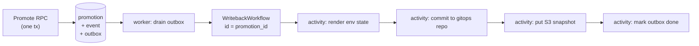

# Writeback: outbox → Temporal

Promotion and the intent to write it back **must** commit atomically. If they
don't, the registry can believe prod is on v1.4.0 while the gitops repo still
says v1.3.0, which is the exact failure mode this system exists to prevent.

Since Temporal cannot enlist in a Postgres transaction, the server writes a
`writeback_outbox` row inside the promotion transaction. The worker drains the
outbox and starts a `WritebackWorkflow` with the promotion id as its workflow
id, so Temporal's own dedup makes redelivery harmless.

Activities are individually retryable and idempotent. The (future) gitops
commit activity is expected to use `state_hash` from `GetEnvironmentState`
to skip no-op commits, and retry on push conflict by re-reading state — last
writer wins on a per-environment file, which is correct because the
registry is the source of truth for that file.

**As of AR-4b, the diagram above is built through "activity: render env
state" only** — the render and publish steps exist, the gitops commit and S3
put do not (see PLAN-HISTORY.md's AR-4b "Explicitly not in scope"). Concretely:

- `server/handlers/promotion.go`'s `enqueueWriteback` writes the
  `writeback_outbox` row inside the exact same transaction as the SCD2
  close-and-open write and the `promotion_event` insert (extending AR-3c's
  transaction, not opening a second one), with `state_hash` computed via the
  same `stateHash` function `GetEnvironmentState` uses, over a fresh
  `StateAt` read taken inside that transaction — so the value on the outbox
  row is guaranteed consistent with what a `GetEnvironmentState` call
  returns immediately after commit.
- `tools/app_registry/worker` (`app-registry-worker`) is a long-running
  process (not a job) that both polls `writeback_outbox` directly against
  Postgres (`outbox.Drainer`, using an atomic
  `UPDATE ... WHERE outbox_id IN (SELECT ... FOR UPDATE SKIP LOCKED)` claim
  query) and runs a `go.temporal.io/sdk/worker.Worker` listening on task
  queue `app-registry-writeback`.
- `WritebackWorkflow` (`worker/writeback/workflow.go`), workflow id =
  promotion id, calls exactly two activities behind the `Writeback`
  interface: `RenderEnvironmentState` (reads `GetEnvironmentState` via the
  gRPC API — never Postgres directly, keeping with "the API is the write
  path" above) then `Publish`. AR-4b ships `StubActivities`
  (`worker/writeback/stub.go`): `Publish` writes the rendered JSON to a
  local path (`WRITEBACK_OUTPUT_DIR`) and skips the write when a sidecar
  file shows the state_hash already matches — the no-op detection a real
  gitops-committer `Publish` implementation inherits by satisfying the same
  `Writeback` interface. See `worker/README.md` for the full mechanism and
  how "killed mid-run" was verified.
- A row claimed by a worker that then dies is recovered by the *next*
  worker's `ClaimBatch` once the claim exceeds `WRITEBACK_CLAIM_STALE_AFTER`
  — Temporal's own workflow-id collision handling (an in-flight execution
  with that id either rejects a second `ExecuteWorkflow` call with
  `WorkflowExecutionAlreadyStarted`, or transparently attaches to it) is
  what makes retrying the claim safe rather than merely eventually
  consistent.

`go.temporal.io/sdk` (and, as of AR-4b, `go.temporal.io/api` directly, for
`serviceerror.WorkflowExecutionAlreadyStarted`) are Go dependencies added in
`go.mod`/`MODULE.bazel`; `libs/go/temporal` (client construction, env
config, worker bootstrap, logging bridge to `libs/go/logging`) shipped in
AR-4a — see [PLAN-HISTORY.md](PLAN-HISTORY.md).

