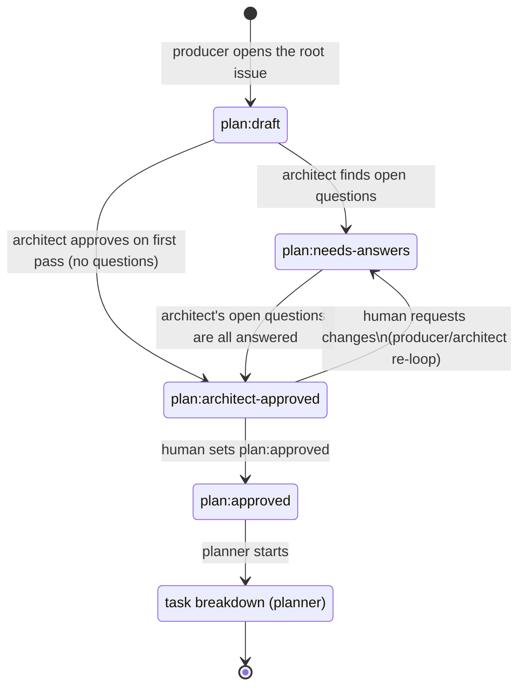
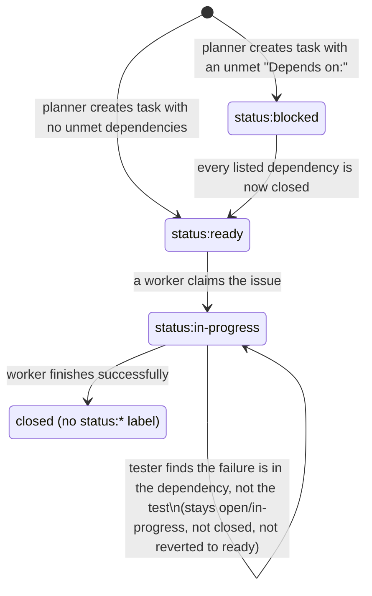

# project-manager — GitHub workflow conventions

Shared conventions all `project-manager` personas follow when tracking work in GitHub Issues. Everything lives in GitHub — no external tracker. Personas interact via `gh` CLI (Bash).

## Issue kinds

| Kind | Created by | Labels |
|---|---|---|
| **Root plan** | producer | `plan:draft` → `plan:needs-answers` → `plan:architect-approved` → `plan:approved` |
| **Task** | planner | `phase:scaffold` \| `phase:implementation` \| `phase:testing` \| `phase:validation`, plus `status:blocked` \| `status:ready` \| `status:in-progress` (removed on close) |
| **Validation finding** | system-validator | `phase:validation`, `from:system-validator` |

## Root plan lifecycle



While an issue sits at `plan:needs-answers`, producer and architect iterate purely via comments (`gh issue comment`) — the label does not change on every round, only when architect either raises a new open question (stays `plan:needs-answers`) or runs out of them (moves to `plan:architect-approved`).

| Transition | Trigger | Actor | Precondition | Label command |
|---|---|---|---|---|
| `[*] → plan:draft` | New feature request (after intake) | producer | none | `gh issue create --title "Plan: <feature>" --label "plan:draft" --body-file <tmpfile>` |
| `plan:draft → plan:needs-answers` | Reconciliation finds ≥1 open question | architect | none | `gh issue edit <n> --add-label "plan:needs-answers" --remove-label "plan:draft"` |
| `plan:draft → plan:architect-approved` | Reconciliation finds 0 open questions (first pass) | architect | none | `gh issue edit <n> --add-label "plan:architect-approved" --remove-label "plan:draft"` |
| `plan:needs-answers → plan:architect-approved` | All of architect's numbered questions have been answered | architect | producer has replied to every open question | `gh issue edit <n> --add-label "plan:architect-approved" --remove-label "plan:needs-answers"` |
| `plan:architect-approved → plan:approved` | Human reviews and accepts | **human only** | plan reconciled, no open questions | `gh issue edit <n> --add-label "plan:approved" --remove-label "plan:architect-approved"` |
| `plan:architect-approved → plan:needs-answers` | Human requests changes | **human only** | human leaves feedback as a comment | `gh issue edit <n> --add-label "plan:needs-answers" --remove-label "plan:architect-approved"`, then producer/architect re-loop |
| `plan:approved → (task breakdown)` | Planner invoked | planner | `plan:approved` is set (not just `plan:architect-approved`) | planner begins creating task issues |

No persona ever adds or removes `plan:approved` — that label is set by a human only. Planner and every other persona must treat `plan:architect-approved` as *not yet* actionable.

## Task breakdown

Once the root issue is `plan:approved` (human sign-off, not just `plan:architect-approved`), **planner** reads it and the architect's reconciliation, then opens one task issue per unit of work via `gh issue create`. Each task issue body must include:

- `Part of #<root-issue-number>`
- `Depends on: #<n>, #<n>` (omit if none)
- Acceptance criteria

Planner assigns exactly one `phase:*` label and sets the initial status label: `status:ready` if it has no open dependencies, `status:blocked` otherwise. Phases run in order: `scaffold` → `implementation` → `testing` → `validation`.

## Worker lifecycle (writer / tester / validator)

This section is the single canonical definition of the worker lifecycle — writer.md/tester.md/validator.md each link here rather than restating the procedure, since they differ only in which `phase:*` label they query.



| Transition | Trigger | Actor | Precondition | Label command |
|---|---|---|---|---|
| `[*] → status:blocked` | Task issue created with an open dependency | planner | issue's `Depends on:` list has ≥1 still-open issue | set at `gh issue create` time |
| `[*] → status:ready` | Task issue created with no open dependency | planner | issue's `Depends on:` list is empty or all already closed | set at `gh issue create` time |
| `status:blocked → status:ready` | A dependency this issue was waiting on just closed | writer/tester/validator (whoever closed the dependency) | **every** issue number in this issue's `Depends on:` line is closed | `gh issue edit <dep> --add-label "status:ready" --remove-label "status:blocked"` |
| `status:ready → status:in-progress` | A worker picks up the issue | writer/tester/validator | issue is `status:ready` and matches the worker's `phase:*` | `gh issue edit <n> --add-label "status:in-progress" --remove-label "status:ready" --add-assignee @me` |
| `status:in-progress → closed` | Worker completes the issue | writer/tester/validator | acceptance criteria met (or, for tester, tests pass) | `gh issue close <n> --comment "<summary>" --remove-label "status:in-progress"` |
| `status:in-progress → status:in-progress` (no-op) | Tester finds a bug in the dependency, not the test | tester | test failure traces to the implementation | comment on both issues; **do not close**, do not touch labels |

**Find work:**

```sh
gh issue list --label "status:ready" --label "phase:<their phase>" --state open
```

**Claim it:**

```sh
gh issue edit <n> --add-label "status:in-progress" --remove-label "status:ready" --add-assignee @me
```

**Finish it:**

```sh
gh issue close <n> --comment "<summary>" --remove-label "status:in-progress"
```

**Unblock dependents.** Free-text `--search` on a literal `#<n>` is unreliable (GitHub tokenizes `#123` and can match on numeric substrings, e.g. `#1` inside `#10`/`#11`), so don't use it here. Instead, list every open `status:blocked` issue with its body, and check each one's `Depends on:` line precisely:

```sh
gh issue list --label "status:blocked" --state open --json number,body \
  | jq -r --arg n "$N" '.[] | select(.body | test("Depends on:.*#" + $n + "([^0-9]|$)")) | .number'
```

For each match, list *that* issue's own dependency numbers from its `Depends on:` line and confirm every one of them is closed — one batched query covers all of them:

```sh
gh issue list --state closed --json number | jq -r '.[].number'
```

Only if every dependency number appears in that closed set, flip it: `gh issue edit <dep> --add-label "status:ready" --remove-label "status:blocked"`. Never mark an issue ready while any of its dependencies remain open.

## System validation

After all `phase:implementation` and `phase:testing` issues under a root plan are closed, **system-validator** runs the system end-to-end (Tilt) and grades it against the root plan's acceptance criteria (checking "all closed" the same precise, non-`--search` way as above). Findings become new issues: `phase:validation`, `from:system-validator`, `Part of #<root-issue-number>`, titled descriptively (`gh issue create` requires `--title`). If a finding represents new work rather than a pass/fail note, **planner** converts it into properly sequenced `status:blocked`/`status:ready` task issues — linked back to the finding for traceability, but never `Depends on:` the finding issue itself (a finding is a report, not a work product any worker closes). Planner then closes the finding issue once its follow-ups are filed and linked — the one case where planner closes an issue itself.

## Model tiers

| Persona | Model | Why |
|---|---|---|
| producer, architect, planner | `opus` | Premium reasoning for requirements, design reconciliation, and dependency-aware sequencing |
| writer, tester, validator | `haiku` | Cheap, small-context execution of a single well-scoped task issue |
| system-validator | `opus` (effort: max) | Expensive, holistic judgment call on whether the whole system actually works |
