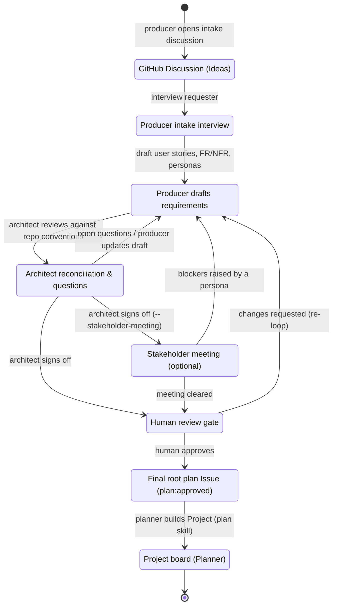
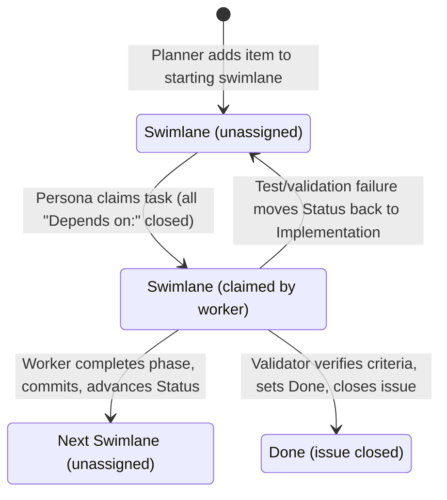

# project-manager — GitHub workflow conventions

Shared conventions all `project-manager` personas follow. Everything lives in GitHub — no external tracker. Personas interact via `gh` CLI (Bash): a **Discussion** for intake, plan drafting, and architect reconciliation; an **Issue** for the final approved root plan; and a **Project (v2)** board with **swimlanes** for task execution. `OWNER` below is this repo's org, `whale-net` (repo `whale-net/everything`).

**This is the canonical reference, not required reading for every dispatch.** Each persona's own agent file (`tools/project-manager/agents/*.md`) inlines the mechanics it needs for routine execution, so a subagent shouldn't normally need to open this doc. It exists for: (a) mechanics too infrequently exercised or too easy to typo to duplicate safely (e.g. the Project field GraphQL mutation), and (b) as the fallback when a persona hits a situation its own file doesn't cover. The inlined copies can drift from this doc over time — that's an accepted tradeoff for keeping routine dispatches cheap and unambiguous, not an invitation to let them diverge carelessly; when you touch a mechanic here, check whether the same mechanic is duplicated in an agent file and update both.

## Where things live

| What | Lives in | Created by |
|---|---|---|
| Product spec: vision, capability map, load-bearing decisions, milestone definitions | `<domain>/PRODUCT.md`, committed to `main` (drafted in a Discussion, category `Ideas`, first) | producer & architect |
| Product tracking issue: pointer to the file + discussion, plus the roadmap ledger | GitHub Issue, labeled `product:approved` | producer |
| Intake Q&A and round-by-round summaries, architect reconciliation | GitHub Discussion, category `Ideas` | producer & architect |
| Working draft (the actual spec text while it's still moving) | Secret Gist, linked once from the Discussion (§ Working draft) | producer |
| Stakeholder meeting agenda, per-persona feedback & minutes | Own GitHub Discussion per round, category `Ideas` — linked back with one comment on the intake Discussion (or root Issue) | `stakeholder` personas & the `stakeholder-meeting` skill |
| Final root plan (requirements doc / spec of record) | GitHub Issue, labeled `plan:approved` | producer (after human review) |
| Task tracking & orchestration | GitHub Project (v2), one per approved plan | planner |
| Task issues (moving through swimlanes) | GitHub Issue, added as a Project item | planner / system-validator |
| Scope notes (deferred/cross-cutting decisions) | GitHub Issue, added as a Project item at `Status: Noted` | any persona; triaged by planner |

Discussions are where ideas are figured out and reconciled between producer, architect, and requester. Issues are where the final, approved requirements doc lives. Projects (and issues moving through swimlanes) are where implementation orchestration lives.

## Product brief & milestones

A **product brief** sits one level above a plan and exists to make each plan small. Run `/project-manager:product` when the request is a whole product or subsystem rather than one feature; a single `design` pass over a product yields 60-80 FRs, which is both context-hostile and unsafe to implement in one shot. A feature added to an existing system skips this entirely and goes straight to `/project-manager:design`.

A product maps 1:1 to a top-level domain (the `Domains` table in `AGENTS.md`) — `leaflab/PRODUCT.md`, `manmanv2/PRODUCT.md`. Publishing the brief creates the domain directory if it doesn't exist yet. Multiple products per domain, or one product spanning several domains, isn't supported today; see § When a milestone re-balloons below for what to do when a request doesn't fit that shape.

```
/project-manager:product ──▶ <domain>/PRODUCT.md (committed)  +  tracking Issue (product:approved)
                                    │  capability map C1..Cn, load-bearing decisions LB1..LBn,
                                    │  milestone definitions M1..Mn
                                    ▼
              per milestone:  design --milestone M1 ──▶ review ──▶ plan ──▶ implement ──▶ validate
                                    │                                                        │
                                    └──── ledger comment posted, brief amended if needed ◀────┘
```

### The two artifacts

The brief is deliberately split across two places:

| Artifact | Holds | Lives in | Changes via |
|---|---|---|---|
| Product spec | Vision, personas, current state, capability map, load-bearing decisions, non-goals, milestone definitions | `<domain>/PRODUCT.md` + `<domain>/product/*.md`, committed to `main` | A small doc-only PR, same as any other doc change |
| Product tracking issue | A pointer to the spec and discussion, plus the live roadmap ledger | GitHub Issue, labeled `product:approved` | `gh issue comment` only (see § Roadmap ledger) — the body is never rewritten after creation |

The spec is committed like any other doc because it's written for the same reader `ARCHITECTURE.md` is: a future agent trying to understand why the system is shaped the way it is, per `AGENTS.md` § Documentation Conventions. The tracking issue exists because Issues, not files, are what `gh` cross-links from Discussions, PRs, and other issues — it's the address, not the content.

### Layout: PRODUCT.md is an index, not a monolith

The two sections most likely to outgrow a single-file read are the same two sections this document exists to control on everyone else's behalf: the capability map only grows (deferrals add to `Later`), and the roadmap accumulates one entry per milestone forever, shipped ones included, per `AGENTS.md` § Size Limits & Splitting rule 1 (pick the boundary before it's needed, not at the moment a line-count trips). `<domain>/PRODUCT.md` follows that guidance from the start rather than waiting to cross the threshold:

```
<domain>/PRODUCT.md                    — index: Vision, Personas, Load-bearing decisions,
                                          Non-goals inline, plus a jump table to the rest
<domain>/product/01-current-state.md   — # Current state
<domain>/product/02-capability-map.md  — # Capability map
<domain>/product/03-roadmap.md         — # Roadmap
```

**What stays inline in the index** — Vision, Personas, Non-goals, and Load-bearing decisions — is exactly the carve-out `AGENTS.md`'s splitting rule 1 describes: short and either stable (Vision, Personas, Non-goals rarely change after publish) or cross-referenced by number from everywhere (`LB1..LBn` is cited from every milestone's `Must not foreclose` list and from architect's Load-bearing check) rather than something a reader opens on its own. Forcing either into a one-line file would just relocate the grep-cold problem `AGENTS.md` warns against.

**What splits out** — Current state, Capability map, Roadmap — are the sections with no natural ceiling: current state can run long for a retrofit-heavy survey, the capability map only ever grows, and the roadmap is never pruned (a shipped milestone's entry stays forever — see § Amendments). Each split file's `# ` title is the section's exact heading text, so a citation like "PRODUCT.md § Roadmap" still greps straight to `product/03-roadmap.md` even before anyone updates it to the new path (`AGENTS.md` rule on grep-discoverability).

**Discovery.** `<domain>/PRODUCT.md` is the one canonical entry point — anyone reading a product for the first time starts there and follows its jump table, never guesses a `product/*.md` path directly. If the domain has a `TOC.md`, publish adds one line pointing at `PRODUCT.md` (not at each split file individually — `PRODUCT.md`'s own jump table is the second hop, per `AGENTS.md` rule 3's "one canonical entry point").

**Re-checking the split's own size** (`AGENTS.md` rule 6). `product/03-roadmap.md` is a planning-doc shape — a live edge of upcoming milestones plus a permanent record of shipped ones — so once it alone crosses the size threshold, split it the same way `AGENTS.md` prescribes for `PLAN.md`: move shipped milestones' entries to a `product/03-roadmap-HISTORY.md` sibling, keep only `not started`/`in design`/`planned`/`in progress` milestones in the live file, and link the history sibling from the top of `03-roadmap.md`. Don't do this preemptively on a fresh product — there's nothing to split until milestones actually ship.

### The two document levels

| Document | Granularity | Contains FRs? | Skill |
|---|---|---|---|
| Product spec (`<domain>/PRODUCT.md`, tracked by Issue `Product: <name>`, `product:approved`) | capabilities, `C1..Cn`, one line each | **never** | `product` |
| Root plan (`Plan: <feature>`, `plan:approved`) | testable behavior, `FR1..FRn`, one milestone's worth | yes | `design` → `review` |

The spec's hard rule is that it contains **zero numbered FRs or NFRs**. `C7 — Operators can see per-device sensor health at a glance` is a capability; `FR7 — the health endpoint returns 200 with lastSeenAt` is not, and belongs in a milestone's plan. A brief that acquires FRs has moved the too-big-to-implement problem up a layer instead of solving it.

### Brief sections

In the `PRODUCT.md` index: **Vision** (one paragraph) · **Personas** · **Load-bearing decisions** (`LB1..LBn`, architect) · **Non-goals**. Split out to `product/*.md` (§ Layout above): **Current state** (architect) · **Capability map** (`C1..Cn`, bucketed `Now`/`Next`/`Later`) · **Roadmap** (milestone definitions only — the live status ledger is tracked separately, see § Roadmap ledger).

**Load-bearing decisions** are why the document exists. Each is a structural commitment an early milestone must get approximately right because a later capability depends on it, with three clauses: the capability *at risk*, what to *decide now*, and what *stays cheap* to change later. The third clause keeps the list honest — if nothing is expensive to reverse, it is not load-bearing. Bias toward data shape, identity, and wire contracts (schemas, keys, tenancy, auth subject, event payloads); handlers, templates, and internal package boundaries are cheap to redo and do not belong. Aim for 3-8 entries.

**Milestones** are each defined by one user-visible outcome sentence naming who can now do what — "a logged-in grower can see one plant's live readings", never "the data layer". Each carries `Delivers` (capability ids), `Must not foreclose` (`LB` ids), `Deliberately deferred` (with destination), and an `FR budget` (default 12).

### Scope control at milestone-design time

Two mechanisms, in order of importance:

1. **Traceability.** Every FR cites the capability it serves — `FR4 (C3) — ...`. An FR that cannot cite one from the milestone's `Delivers` list does not belong in this milestone. This is the actual control; a bare FR cap just gets gamed by writing wider FRs.
2. **The FR budget** is a backstop that tells producer when to re-read rule 1. A draft over budget whose FRs all trace correctly is a signal to re-examine the outcome sentence, not an automatic blocker.

Over-budget scope has one destination and never a silent drop. Scope notes are Project-board items and no board exists yet at design time, so the **product spec is the ledger**: a genuinely new capability is added to the `Later` bucket in `<domain>/product/02-capability-map.md` (a small doc PR, same mechanics as producer.md Mode P3) with the next free `Cn`, and recorded with a `Deferred from M<n>: <capability line>` comment on the tracking issue; anything already belonging to a later milestone goes under the plan's **Out of scope** citing that milestone.

Architect's **Load-bearing check** (architect.md § Process) is the pass that makes small milestones safe rather than merely small: a draft that forecloses a protected `Later` capability gets a numbered blocking question. The bar is *forecloses* — requiring a migration, a breaking wire change, or unpicking a decision threaded through the milestone — not merely *does not yet implement*.

### Roadmap ledger

Status is tracked on the **product tracking issue**, never in the committed spec — it changes on every milestone transition, and a file edit would mean a PR for every status flip. It is also never a body edit: `implement` already runs multiple tasks in parallel, and nothing stops two milestones being designed or implemented at once, so a read-modify-write update to one shared body table would race. Instead every status change is a **new comment**, in this exact form:

```
Ledger: M<n> → <status> (<link-or-none>)
```

e.g. `Ledger: M2 → in design (<discussion-url>)`, `Ledger: M2 → planned (#123)`, `Ledger: M2 → in progress (Project board)`, `Ledger: M2 → shipped`. Comments are append-only and need no prior read, so two writers never race each other. Anyone reconstructing current state (`/project-manager:status`, `design --milestone`'s idempotency check, architect's product-mode reconciliation) takes, per milestone, the **last** `Ledger: M<n> →` comment on the issue; no such comment means `not started`.

Status moves `not started → in design → planned → in progress → shipped`, one comment per transition, written by:
- **producer** — `in design` when it opens the milestone's intake discussion; `planned` when it publishes the root plan issue (Mode 3).
- **`plan` skill** — `in progress` when it creates the milestone's Project board (SKILL.md step 3).
- **`validate` skill** — `shipped` once whole-system validation passes cleanly with no findings (SKILL.md step 4).

Each writer checks the root plan issue's first line for `Product: #<p> — Milestone M<k>` before posting; a plan that isn't a milestone of a brief triggers none of this, so ordinary single-feature plans are unaffected.

### Amendments

The spec is a living document but is never edited silently. `/project-manager:product <issue-number>` drafts the amendment as a comment on the tracking issue; architect reconciles it there if it touches load-bearing decisions or milestone ordering; once the user approves, producer opens a small PR editing whichever files the amendment actually touches — `PRODUCT.md` itself for a load-bearing or non-goal change, `product/02-capability-map.md` for a new capability, `product/03-roadmap.md` for a re-cut milestone (same mechanics as publishing — producer.md Mode P3) — and, once it merges, comments `Amended: <summary> (#<pr-number>)` on the tracking issue. A shipped milestone's history is never rewritten — ship what shipped, change what is ahead; git history on the files is the audit trail, so the issue comment only needs to summarize, not narrate, the diff.

**Amendment ledger.** An amendment in flight otherwise has no queryable state the way a milestone does (§ Roadmap ledger above) — its comments are shaped by role (a draft, a sign-off, a terminal `Amended:` line), not a common prefix a reader can grep for. Close that gap the same way: producer picks a short kebab-case slug when it drafts (e.g. `channel-history-grounding`), and every stage of an amendment also gets its own append-only comment:

```
Amendment: <slug> → <status> (<link-or-none>)
```

Status moves `drafted → reconciled → merged`, one comment per transition, written by:
- **producer** — `drafted`, linking its own draft comment, right after posting it.
- **architect** — `reconciled`, linking its own reconciliation comment, right after posting sign-off — post it even when reconciliation finds no load-bearing/ordering impact at all; "reconciled" means "architect looked," not "architect changed something." If capped at 5 rounds without sign-off, post `reconciled` anyway, linking the summary comment, and say in it that the amendment stalled.
- **producer** — `merged (#<pr-number>)` once the PR merges — the `Amended: <summary> (#<pr-number>)` comment still carries the human-readable summary; this line just makes the state grep-able alongside the others.

Same rule as the roadmap ledger: the **last** `Amendment: <slug> →` comment on the issue wins; no such comment for a slug means that amendment hasn't reached that stage yet.

### When a milestone re-balloons

Occasionally a single milestone's own design pass turns out to be product-sized again — the outcome sentence was right but the behavior needed to reach it wasn't as small as it looked. `/project-manager:design` step 0 flags this the same way it flags a fresh request: past roughly 20 FRs, it recommends running `/project-manager:product` on the milestone's draft instead of pushing the design through oversized. Because a product maps 1:1 to a domain, that recommendation only cleanly applies when the milestone genuinely spans a new domain-sized subsystem; if it's still one domain, splitting into an additional milestone of the existing brief is usually the better fix rather than nesting a second product under it. Either way this is a recommendation, not a block — the user decides.

## Intake discussion & design reconciliation

The entire intake interview, specification drafting, and architect reconciliation happen inside a GitHub Discussion in category `Ideas`. This keeps iterative back-and-forth noise off the issue tracker, ensuring the root plan issue remains a clean, durable spec of record.

### Working draft (gist, not discussion text)

A draft reposted in full on every reconciliation round makes every later read — the next round's producer or architect, a human, `/project-manager:status` — replay the *entire* comment history to reconstruct current state, so cost grows with round count instead of staying flat. This is the same shape as the prompt-cache-cost-vs-turn-count problem `AGENTS.md` § Effective Subagent Usage flags for a single session's transcript, just at the Discussion layer.

The fix: the draft text (product brief in Mode P1/P2, root-plan draft in Mode 1/2) lives in exactly one place that gets *overwritten* each round, not appended to.

- **First write** creates a secret gist and links it once:
  ```sh
  gh gist create --desc "Draft: <feature>" <local-draft-file>
  gh discussion comment <discussion-url> --body "Working draft: <gist-url>"
  ```
- **Every later revision** — answering architect's open questions, folding in stakeholder feedback, responding to human review — overwrites the same gist file instead of posting the new draft text as a comment:
  ```sh
  gh gist edit <gist-id> --filename <draft-filename> <local-draft-file>
  ```
- **The Discussion comment for that round is a bounded summary of the delta** — what changed and why, a few sentences to a short list — plus the gist link, never the draft's full text. Architect's reconciliation comments (open questions, nitpicks, sign-off) are already this shape and don't change.
- **Anyone reading current state fetches the gist**, not the discussion thread: `gh gist view <gist-id> --raw` — one bounded read regardless of how many rounds have happened.
- **The gist is scratch, never the spec of record.** Mode 3 / P3 still commits the final text to `<domain>/PRODUCT.md` or the root plan Issue exactly as today, and that commit/Issue is what durable audit trail means from that point on — deleting the gist afterward is fine but not required. Gist revision history is not meant to double as a decision log: if the *why* behind a round's change matters later, it belongs in that round's discussion summary comment, not left implicit in a gist diff nobody will open.


```mermaid
stateDiagram-v2
    discussion: GitHub Discussion (Ideas)
    intake: Producer intake interview
    draft: Producer drafts requirements
    reconcile: Architect reconciliation & questions
    meeting: Stakeholder meeting (optional)
    humanReview: Human review gate
    rootIssue: Final root plan Issue (plan:approved)
    projectBoard: Project board (Planner)

    [*] --> discussion: producer opens intake discussion
    discussion --> intake: interview requester
    intake --> draft: draft user stories, FR/NFR, personas
    draft --> reconcile: architect reviews against repo conventions
    reconcile --> draft: open questions / producer updates draft
    reconcile --> humanReview: architect signs off
    reconcile --> meeting: architect signs off (--stakeholder-meeting)
    meeting --> draft: blockers raised by a persona
    meeting --> humanReview: meeting cleared
    humanReview --> draft: changes requested (re-loop)
    humanReview --> rootIssue: human approves
    rootIssue --> projectBoard: planner builds Project (plan skill)
    projectBoard --> [*]
```

1. **Intake interview (Mode 0).** On the first question, producer opens the discussion:
   ```sh
   gh discussion create --title "Intake: <feature>" --category "Ideas" --body-file <tmpfile>
   ```
   Opening body contains the initial request and the first round of questions. As the interview proceeds, producer posts each Q&A round as a discussion comment (`gh discussion comment <discussion-url> --body-file <tmpfile>`). Producer covers:
   - **Who** — every persona/actor touching this (users, operators, services, schedulers).
   - **What** — user stories per persona: *"As a <persona>, I want <capability>, so that <benefit>."*
   - **Constraints** — performance, reliability, security, operability expectations.
   - **Boundaries** — what is explicitly out of scope.

2. **Draft the plan (Mode 1).** Producer writes the draft specification to the working-draft gist (§ Working draft above), then posts a short summary comment on the discussion with the gist link:
   - User stories
   - Functional requirements (FR)
   - Non-functional requirements (NFR)
   - Personas
   - Out of scope

3. **Architect reconciliation & QA (Mode 2).** Architect reads the draft from the working-draft gist (not the comment history), reconciles against repo conventions (Bazel-first, cross-compilation in `docs/DOCKER.md`, SCD2 rules, existing libraries in `libs/`, domain `ARCHITECTURE.md`), and posts comments on the discussion containing:
   - **Open questions** — numbered blocking questions.
   - **Nitpicks** — non-blocking suggestions.
   Producer answers open questions in a discussion comment and updates the draft in the working-draft gist (not a fresh comment). The loop repeats until architect posts an explicit sign-off comment (e.g. `Architect sign-off: approved`).

4. **Stakeholder meeting (optional).** Off by default; requested with `/project-manager:design ... --stakeholder-meeting`, or held later against the approved root issue. Every persona named in the spec gets one round of feedback before the human review gate — see § Stakeholder meeting below. Blockers return the draft to the producer/architect loop; guidance and non-blocking feedback do not gate the plan.

5. **Human review & issue creation (Mode 3).** Once architect has signed off — and the stakeholder meeting is cleared, if one was held — the draft is presented to the human reviewer via `/project-manager:review <discussion-url>`.
   - If changes requested: human leaves feedback, producer and architect re-loop in the discussion.
   - If approved: producer creates the root plan Issue representing the final requirements doc of record:
     ```sh
     gh issue create --title "Plan: <feature>" --label "plan:approved" --body-file <tmpfile>
     ```
     First line of the issue body is `Intake discussion: <discussion-url>` — preceded, for a milestone of a product brief, by `Product: #<product-issue> — Milestone M<n>: <outcome sentence>`, which is what tells architect to run its load-bearing check on later rounds. Producer also posts `Ledger: M<n> → planned (#<this-issue>)` on the product tracking issue (§ Roadmap ledger). Producer then leaves a closing comment on the discussion:
     ```sh
     gh discussion comment <discussion-url> --body "Approved root plan issue: <issue-url>"
     ```

## Agent-sync mode (opt-in)

Off by default. `/project-manager:design --agent-sync` and `/project-manager:product --agent-sync` replace the producer/architect draft-reconcile loop's normal shape — a fresh subagent dispatch every round, each one re-reading the whole Discussion from scratch — with two long-lived subagent sessions that hand off directly to each other over `agentsync-mcp` (`tools/agentsync-mcp/`), using the Discussion as the durable record rather than as the channel the next round is bootstrapped from.

**Why opt in, not default.** Per-round redispatch is slower and re-reads context every time, but it's the simpler failure mode: a round that goes wrong is contained to one subagent invocation, and the Discussion is authoritative because nothing else exists. Agent-sync trades that for speed on a plan that needs several rounds, at the cost of two subagents staying alive concurrently and depending on a local MCP server that only works on one machine (`tools/agentsync-mcp/README.md` § Limitations). Use it for a plan you expect to go back and forth on; leave it off for one you expect to land in one or two rounds, where standing up a session costs more than it saves.

**Mechanics.**

1. Before dispatching, the orchestrating skill calls `mcp__agentsync-mcp__start_session("<skill>-<discussion-number>")` — e.g. `design-482`, `product-91` — then dispatches `project-manager:producer` and `project-manager:architect` **together, in one message** (two parallel `Agent` calls), each passed the session id and told to run in agent-sync mode for the remainder of the loop, and told which of them speaks first. Whoever speaks first is named explicitly in the dispatch — `design` names producer (it drafts the spec before there's anything to reconcile); `product` steps 5-6 name architect (it runs its current-state/load-bearing pass before producer's Mode P2 has anything to fold in). Whichever persona goes second joins and immediately calls `sync()` to block, so the two naturally serialize even though both start at once.
2. Each round, a persona still records its normal output for the round — a draft round writes the working-draft gist and posts a short summary comment (§ Working draft), a reconciliation/sign-off round posts its comment directly — agent-sync changes *how the next round gets triggered*, not what gets recorded. After posting, it calls `sync(session_id, my_id, "<one-line pointer: what I posted/wrote and where — gist link for a draft round, comment for reconciliation or sign-off>")` and blocks for the peer's reply instead of returning control to the orchestrator.
3. Producer and architect each track their own round count and stop at the same cap the default loop uses (5). If the cap is hit without sign-off, whichever persona notices posts a summary comment to the Discussion, calls `leave_session`, and returns to the orchestrator so it can surface the stall to the user exactly as the default loop's cap does.
4. On sign-off (or a hand-off to a stakeholder meeting or human review), both personas call `leave_session(session_id, my_id)`. Architect is always the one to also call `end_session(session_id)` once it sees (via `leave_session`'s reply or `session_status`) that producer has already left — sign-off is always architect's act, so architect is always the last to speak in a round, in both `design` (producer first) and `product` (architect first). This is why only architect's frontmatter carries the `end_session` tool.
5. **Fallback.** If `start_session` errors (server not installed) or a persona's first `sync()` call never gets a reply because its peer failed to start, fall back to the default per-round dispatch for the rest of that plan and tell the user agent-sync wasn't available — don't retry silently on every round.

**Scope.** Only the producer/architect draft-reconcile loop uses this (`design` steps 4-6, `product` steps 5-6 — step 4's first producer draft has no peer to sync with yet, so it's always a single dispatch). The stakeholder meeting, human review gate, and planner/worker/validator phases are unaffected — they don't have this round-trip shape.

## Resume mode (opt-in)

Off by default. `/project-manager:design --resume-agents` and `/project-manager:product --resume-agents` address the same regrounding cost as agent-sync mode from the other side: instead of changing how producer and architect hand off to *each other*, they change how the **orchestrator** redispatches the same persona for another round. Every default-mode round after the first re-reads the working-draft gist and the discussion's round comments — and often the domain docs — from a cold start, because a fresh `Agent()` call has no memory of the round before it; the gist convention (§ Working draft) keeps that read bounded, but it's still a cold read every round. Resuming the same subagent instance instead means it only needs the delta.

**Mechanics.**

1. Every dispatch of `project-manager:producer` or `project-manager:architect` passes an explicit `name` to the `Agent` call — `producer-<discussion-number>`, `architect-<discussion-number>` — whether or not `--resume-agents` is set, so a later round has something stable to target.
2. The *first* dispatch of a given persona within a skill invocation is always a normal `Agent(...)` call — there's nothing to resume yet.
3. Every subsequent dispatch of that same persona, for a follow-up round on the same discussion within the same skill invocation, uses `SendMessage({to: "<persona>-<discussion-number>", message: "<this round's prompt>"})` instead of a fresh `Agent(...)` call. The message only needs to say what changed since its last turn (the new comment(s)) and what to do now — the resumed agent already has the discussion, the domain docs, and its own prior reasoning in context.
4. If `SendMessage` errors because that name isn't a live agent — most commonly because this is a separate skill invocation (a later `/project-manager:review` or `/project-manager:stakeholder-meeting` run, or a fresh session) rather than a follow-up round within the same one — fall back to a normal `Agent(...)` dispatch. That's the expected path outside the loops listed below, not a failure to report to the user.

**Scope.** Applies only to redispatching the same persona for another round on the same discussion, *within the skill invocation that first dispatched it*: `design` steps 5-6 and step 7's stakeholder-meeting blocker loop (still the same invocation), `product` step 6 and step 7's "Changes" branch. It does not reach across separate skill invocations — `/project-manager:review`, a later `/project-manager:stakeholder-meeting`, or `/project-manager:product`'s amendment step 8 always dispatch fresh, since the producer/architect instances from the original design/product run aren't addressable from a different invocation.

**Combining with `--agent-sync`.** The two modes solve adjacent halves of the same problem and compose cleanly: agent-sync's single dispatch never needs a resume inside its own loop, since the two subagents don't return control until sign-off or the round cap. `--resume-agents` still applies to whatever comes *after* that dispatch returns within the same invocation — most commonly a stakeholder-meeting blocker round in `design` step 7 — where it resumes the exact `producer-<n>` / `architect-<n>` agents that the agent-sync dispatch used, rather than spawning fresh ones for that round.

## Stakeholder meeting

An optional round in which **every persona named in the plan's spec** reviews the draft from its own seat and reports back, before the plan is handed to the human review gate. Run by `/project-manager:stakeholder-meeting`, either automatically from `/project-manager:design --stakeholder-meeting` (target: the intake Discussion, after architect sign-off) or on demand against an approved root plan Issue.

It exists because architect reconciles the plan against the *codebase*; nobody otherwise reconciles it against the *people it is for*. A persona that cannot finish its job under the plan as written is a defect in the requirements, and it is cheaper to find before implementation.

**Mechanics.** Each round gets its own GitHub Discussion (category `Ideas`), so the meeting's agenda, per-persona feedback, and minutes never accumulate on the target — the target only ever gains one link comment per round. No new issue kinds, no Project items.

| Artifact | Posted by | Lives in | Title |
|---|---|---|---|
| Meeting discussion | the skill | new Discussion, category `Ideas` | `Stakeholder meeting round <N>: <feature>` — body is the agenda (personas attending, spec revision under review, response format) |
| Link comment | the skill | the target (Discussion or root Issue) | `Stakeholder meeting round <N>: <meeting-discussion-url>` |
| Per-persona feedback | one `stakeholder` subagent per persona | the meeting discussion | `Stakeholder feedback — <persona> (round <N>)` |
| Minutes | the skill | the meeting discussion | `Stakeholder meeting minutes (round <N>)` |

Round `N` is `1 +` the count of existing `Stakeholder meeting round <N>: <url>` link comments on the target. Stakeholders still read the spec from the target (unchanged), but post their one feedback comment to the meeting discussion, with three sections:

- **Guidance** — non-binding direction from that persona's world. No reply required.
- **Feedback** — concrete non-blocking improvements. Producer folds them in, defers them with a reason, or records them under **Out of scope**.
- **Blockers** — numbered; the persona cannot do its job as written. Each states the FR/NFR/story it attaches to, what breaks, and the outcome that resolves it. A stakeholder with none writes the literal line `Blockers: none`.

Minutes deduplicate blockers across personas and number them `SB-<round>.<n>` (e.g. `SB-2.1`), and end with exactly one of:

```
Stakeholder meeting: cleared
Stakeholder meeting: blocked (<k> blockers)
```

**Routing.** `cleared` → hand off to `/project-manager:review`. `blocked` → producer (Mode 2) reads the consolidated blockers from the meeting discussion's minutes comment, answers each `SB-<round>.<n>` in a bounded comment on the target discussion and updates the draft in the working-draft gist, architect re-reconciles and re-signs off there, then the next meeting round runs (a fresh meeting Discussion). Cap at 2 rounds from `/project-manager:design` (`--stakeholder-rounds`), 3 when the skill is invoked directly; past the cap, the standing disagreement goes to the human rather than looping. If the target is an already-approved root Issue, the spec of record is never edited silently — producer amends the issue body only after the user confirms, and posts `Amended after stakeholder meeting round <N>: <summary>` as a comment on the root issue.

**Boundaries.** Stakeholders represent one persona each and never speak for another; they do not propose implementations, edit requirements, create task issues, or gate the plan — only the human review gate approves. Blockers change the plan; they never become task issues.

## Project setup

Once the root issue is created and labeled `plan:approved`, `/project-manager:plan` dispatches planner to create the plan's Project board:

1. **Idempotency check first.** `gh issue view <root-issue-number> --comments` — if a prior comment contains `Project board: <url>`, reuse that project number.
2. Create it: `gh project create --owner whale-net --title "Plan: <feature title> (#<n>)" --format json` — capture `.number`.
3. Link to repo: `gh project link <number> --owner whale-net --repo whale-net/everything`.
4. Repurpose the built-in `Status` field to the plan's swimlanes via GraphQL:
   ```sh
   FIELD_ID=$(gh project field-list <number> --owner whale-net --format json \
     | jq -r '.fields[] | select(.name=="Status") | .id')
   gh api graphql -f query='
     mutation($fieldId: ID!) {
       updateProjectV2Field(input: {
         fieldId: $fieldId,
         singleSelectOptions: [
           {name: "Scaffold", color: GRAY, description: "Scaffolding & groundwork"},
           {name: "Implementation", color: BLUE, description: "Core implementation"},
           {name: "Testing", color: YELLOW, description: "Test coverage & red/green verification"},
           {name: "Validation", color: ORANGE, description: "Acceptance criteria validation"},
           {name: "Done", color: GREEN, description: "Completed & closed"},
           {name: "Noted", color: PURPLE, description: "Scope note: unclassified"},
           {name: "Carry-over", color: PINK, description: "Scope note: cross-cutting"},
           {name: "Deferred", color: RED, description: "Scope note: plan-specific cut"}
         ]
       }) { projectV2Field { ... on ProjectV2SingleSelectField { id name options { id name } } } }
     }' -f fieldId="$FIELD_ID"
   ```
5. Post `gh issue comment <root-issue-number> --body "Project board: <project-url>"` on the root issue.

## Task issues & swimlane progression

Tasks represent cohesive units of work (features, components, schema migrations) and **progress through swimlanes**:

```
[Scaffold] ──▶ [Implementation] ──▶ [Testing] ──▶ [Validation] ──▶ [Done (Closed)]
```

Tasks move across swimlanes operated by specialized personas:
- **`Scaffold`** (worker): Skeletons, BUILD.bazel files, proto definitions, migrations, initial interfaces.
- **`Implementation`** (worker): Business logic, API handlers, internal services, component wiring.
- **`Testing`** (worker): Unit/integration tests with red/green verification discipline.
- **`Validation`** (validator): Read-only check against acceptance criteria. Moves to `Done` and closes the issue.
- **`Done`**: Task completed and closed.

Tasks that do not need certain swimlanes (e.g. docs-only tasks or pure refactors) start at or skip to the appropriate swimlane.

### Task granularity & merge cadence

Task count has no cap — a plan gets as many task issues as the work genuinely needs. What matters instead is that each task, once validated, is safe to land on trunk **on its own**, without waiting for the rest of the plan:

1. **Group by cohesive deliverable, not by phase or file.** A task issue already spans all four swimlanes (scaffold → implementation → testing → validation) for one unit of work — splitting further per-phase or per-file inflates count without adding review value. Group into vertical slices (e.g. one schema + its handler + its tests as a single task), not one issue per file or per CRUD operation.
2. **Sequence with expand-contract, and encode it as `Depends on:`.** Order the breakdown so additive tasks (new column, new endpoint, new interface path nothing existing calls yet) have no dependency beyond scaffolding, while any task that changes or removes something existing callers rely on declares `Depends on:` every task that migrates those callers first. `Depends on:` is already how § Worker lifecycle gates a task from starting — this reuses that same mechanism to gate *merging*, not just starting: because a task can't even begin until its dependencies are `Done` (§ Worker lifecycle § Find work), and dependencies are always merged into trunk before their dependents (§ Git hygiene § Continuous merge to trunk), a task that's validated with its declared dependencies satisfied is, by construction, non-breaking to merge right now.

This replaces "hold the whole plan as one stack, merge atomically at the end" with continuous per-task trunk landings — see § Git hygiene § Continuous merge to trunk for the mechanics. A plan with 12 well-sequenced tasks is fine; the risk was never the count, it was merging all 12 together in one all-or-nothing operation.

### Creating task issues

Planner creates one Issue per unit of work with clear criteria across all relevant phases:

```sh
gh issue create --title "<task title>" --body-file <tmpfile>
gh project item-add <number> --owner whale-net --url <issue-url>
gh project item-edit <number> --owner whale-net --url <issue-url> --field Status --value "Scaffold"
```

Each issue body must contain:
- `Part of #<root-issue-number>`
- `Depends on: #<n>, #<n>` (dependencies on other task issues being `Done`; omit line if none)
- Scope and acceptance criteria for scaffold, implementation, test cases, and validation
- File paths, target names, and interfaces

## Worker lifecycle (worker / validator)

This section defines the worker lifecycle across swimlanes:


```mermaid
stateDiagram-v2
    unassigned: Swimlane (unassigned)
    claimed: Swimlane (claimed by worker)
    nextLane: Next Swimlane (unassigned)
    done: Done (issue closed)

    [*] --> unassigned: Planner adds item to starting swimlane
    unassigned --> claimed: Persona claims task (all "Depends on:" closed)
    claimed --> nextLane: Worker completes phase, commits, advances Status
    claimed --> done: Validator verifies criteria, sets Done, closes issue
    claimed --> unassigned: Test/validation failure moves Status back to Implementation
```

### 1. Find work
Query unassigned items in the active swimlane for the plan:

```sh
gh project item-list <number> --owner whale-net --query "status:<Swimlane> no:assignee" --format json \
  | jq -r '.items[] | select(.content.body | test("Part of #<root>([^0-9]|$)")) | .content.number'
```

Confirm readiness: every issue in `Depends on:` must be in `state: CLOSED`:
```sh
gh issue view <n> --json body
# extract "Depends on: #a, #b", then check each:
gh issue view <dep> --json state   # must be "CLOSED"
```

### 2. Claim task
```sh
gh issue edit <n> --add-assignee @me
```

### 3. Execute phase work & commit
- **Scaffold:** Set up targets, skeletons, migrations. Run `bazel build` sanity check.
  Commit: `git add -A && git commit -m "scaffold: <summary>\n\nPart of #<root>"`.
- **Implementation:** Implement features, business logic. Run `bazel build`.
  Commit: `git add -A && git commit -m "feat: <summary>\n\nPart of #<root>"`.
- **Testing:** Write and run tests (`bazel test`). Verify red/green (break behavior, observe red test, revert to green).
  Commit: `git add -A && git commit -m "test: <summary>\n\nPart of #<root>"`.
- **Validation (Validator):** Read-only check of acceptance criteria against code and tests. No commits.

### 4. Advance swimlane or finish
- **Worker in `Scaffold`:** Move to `Implementation` and release assignment:
  ```sh
  gh issue comment <n> --body "Scaffold complete: <summary>"
  gh project item-edit <number> --owner whale-net --url <issue-url> --field Status --value "Implementation"
  gh issue edit <n> --remove-assignee @me
  ```
- **Worker in `Implementation`:** Move to `Testing` and release assignment:
  ```sh
  gh issue comment <n> --body "Implementation complete: <summary>"
  gh project item-edit <number> --owner whale-net --url <issue-url> --field Status --value "Testing"
  gh issue edit <n> --remove-assignee @me
  ```
- **Worker in `Testing`:**
  - If tests pass: move to `Validation` and release assignment:
    ```sh
    gh issue comment <n> --body "Testing complete: verified red/green (<discipline note>)"
    gh project item-edit <number> --owner whale-net --url <issue-url> --field Status --value "Validation"
    gh issue edit <n> --remove-assignee @me
    ```
  - If failure is due to implementation bug: move back to `Implementation` with defect details:
    ```sh
    gh issue comment <n> --body "Test failed on implementation: <defect details>"
    gh project item-edit <number> --owner whale-net --url <issue-url> --field Status --value "Implementation"
    gh issue edit <n> --remove-assignee @me
    ```
- **Validator in `Validation`:**
  - If all acceptance criteria hold:
    ```sh
    gh issue close <n> --comment "Validated acceptance criteria: <summary>"
    gh project item-edit <number> --owner whale-net --url <issue-url> --field Status --value "Done"
    ```
  - If a criterion fails:
    ```sh
    gh issue comment <n> --body "Validation failed: <details>"
    gh project item-edit <number> --owner whale-net --url <issue-url> --field Status --value "Implementation"
    gh issue edit <n> --remove-assignee @me
    ```

## Git hygiene

Task work is tracked with [`gh stack`](../../.claude/skills/gh-stack/SKILL.md) — each task issue gets its own branch and, once pushed, its own small reviewable PR, chained onto its real `Depends on:` dependency so it reviews as a diff against exactly the trunk state it will land on. Unlike holding the whole plan open as one stack merged atomically at the very end, this pipeline is trunk-oriented: each task merges into `main` continuously, as soon as it's `Done` (validated) and every task it depends on is already on trunk (§ Task granularity & merge cadence, § Continuous merge to trunk below). The stack at any moment holds only tasks still in flight or genuinely blocked on an undone dependency — not the whole plan — so its depth reflects real in-progress width, not total task count. Only `/project-manager:implement`, `/project-manager:validate` (for the final integration branch), and the `mergepush` persona they dispatch run `gh stack`/branch-management commands; `worker` and `validator` receive an already-created worktree and branch, and never touch git branch/stack state themselves. Branch creation (step 3) and `mergepush`'s stack registration (step 5) both operate through a dedicated worktree or by branch name only — neither ever checks anything out in the shared checkout — so the only remaining serialization point is `gh stack`'s own state file, protected by a lock that times out after 5s (gh-stack skill § Exit codes, code 8); `mergepush` is dispatched once per batch and waited on before the orchestrator scans for the next one, so only one `gh stack` caller is ever active for a given plan at a time.

**Division of responsibility.** The orchestrator (`implement`/`validate`) owns every step below end to end, but doesn't necessarily run each one itself: it creates a branch and worktree per task directly, resolves any merge conflict that comes up while doing so, and delegates registering each finished task into the plan's stack and merging whatever's now ready (steps 5-6) to `mergepush`, dispatched once per batch of finished worker/validator results. The orchestrator is the one that knows each task's swimlane `Status`, so it also tells `mergepush` which registered branches are `Done` and eligible for step 6's merge — `mergepush` doesn't query the Project board itself. Worker and validator subagents only ever write code inside the worktree path they're handed — they never run `git merge`, `gh stack`, or open a PR themselves; `mergepush` never writes code — it only registers commits worker/validator already made and pushed into the plan's stack. When a conflict is small (a handful of hunks, mechanically resolvable), the orchestrator resolves it inline and continues. When a conflict is large or semantically ambiguous (overlapping logic from two different tasks, unclear which side should win), the orchestrator dispatches an ad-hoc `general-purpose` subagent scoped to just that one merge — hand it the two branch tips, the conflicting files, and both tasks' issue descriptions for context — rather than resolving it blind or stalling the whole batch on it. The same escalation applies to a task `mergepush` reports as failed (a push rejection, or a lock timeout) — it stops on that one task and reports the error rather than guessing at a fix.

1. **Prerequisites**, once per session:
   ```sh
   gh extension list | grep -q github/gh-stack || gh extension install github/gh-stack
   git config rerere.enabled true
   git config remote.pushDefault origin
   ```

2. **Branch naming:**
   ```
   pm[<attempt>]-<root-issue-number>/<task-issue-number>-<slug>
   ```
   - `pm` prefix marks every project-manager-owned branch — `git branch --list 'pm*'` (add `-r`, or `git ls-remote --heads origin 'pm*'`, for the remote copies) finds every in-flight or abandoned task branch across every plan with no other state needed. This is what makes recovering an interrupted or crashed session possible: never use a non-`pm`-prefixed name for task work.
   - `<slug>` is a short kebab-case rendering of the task issue's title (3-5 words, e.g. `add-auth-endpoint`) — derived the same deterministic way every time it's needed from the issue title, never invented fresh or persisted anywhere separately, so any phase can recompute a task's exact branch name on its own.
   - `<attempt>` is omitted on a task's first branch. **Before creating any task's branch, always check for an existing `pm*-<root-issue-number>/<task-issue-number>-*` branch first** (local, then remote) and reuse it if the task is already mid-flight — this single lookup is what lets later phases (and a resumed session) find the branch a prior phase already created, slug and all. Only mint a new branch, with the next unused `<attempt>` number (`pm2-`, `pm3-`, ...), when the existing one must be abandoned outright — an irrecoverable conflict, or a validation failure serious enough that the work should be redone rather than patched. Never delete and recreate the same branch name; leaving the abandoned attempt in place keeps it inspectable.
   - Example: `pm-123/456-add-auth-endpoint` (plan issue #123, task issue #456, first attempt); a forced redo becomes `pm2-123/456-add-auth-endpoint`.

3. **Creating a task's branch and its worktree** (only on the first phase dispatched for that task, after the lookup above turns up nothing — later phases reuse the branch/worktree already created), entirely inside a dedicated worktree — this never touches the shared checkout:
   ```sh
   git fetch origin main
   git worktree add .pm-worktrees/<task-issue-number> -b pm-<root-issue-number>/<task-issue-number>-<slug> <parent>
   ```
   `<parent>` is:
   - `main`, if none of the task's `Depends on:` issues have an open branch yet.
   - That dependency's branch (`pm-<root-issue-number>/<dep-issue-number>-<dep-slug>`), if exactly one does.
   - Any one dependency's branch, if more than one does — then also pull in the rest, inside the new worktree, before dispatching the worker: `git -C .pm-worktrees/<task-issue-number> merge --no-edit pm-<root-issue-number>/<other-dep-issue-number>-<other-dep-slug>` for each additional dependency. If this merge conflicts, resolve it per the division of responsibility above before dispatching the worker — an unresolved conflict must never be handed to a worker to sort out.

   `git worktree add -b <branch> <path> <parent>` creates the branch and its dedicated working directory in one step. Unlike checking out `<parent>` in the shared checkout first (the old approach), this never leaves the shared checkout sitting on a task branch mid-operation — so two candidates' branches can be created concurrently without racing each other, and a crash mid-creation leaves the shared checkout untouched. Task branches get no `gh stack` tracking at creation time; `mergepush` is what registers each one into the plan's one real stack, in step 5, once it's actually ready to integrate — creating a branch never touches `gh stack`'s state file, so nothing here needs `gh stack`'s own lock either.

4. **Per-phase commits** happen inside the worktree exactly as described in § Worker lifecycle below (`scaffold:`, `feat:`, `test:` commits on the task's own branch).

5. **Registering a task into the plan's stack** — this step is `mergepush`'s job, not the orchestrator's own; `implement`/`validate` dispatch it once per batch of finished worker/validator results (§ Division of responsibility above) and wait for it to return before continuing. Step 3 above chains each task's branch onto its own real `Depends on:` dependency (or `main`), which can fork into a *tree* whenever two tasks depend on the same third one — something `gh stack` itself can't represent as one stack (its stacks are strictly linear; see its skill § Known limitations #1). `mergepush` doesn't rewrite that tree onto the original branch in place — that branch stays checked out in its own worktree the whole time, and reaching for it directly (a checkout, a rebase) risks a "branch already checked out" collision with that worktree. Instead it reads the task's own commits off that branch by SHA (`git log <parent>..<branch-name>`, no checkout needed), cherry-picks them onto a scratch branch built on top of the plan's current stack tip, and force-pushes that scratch branch's result to the remote under `<branch-name>` — landing the task's content on the flattened, linear stack without ever touching the original worktree. It then registers the branch via [`gh stack link`](../../.claude/skills/gh-stack/SKILL.md), which finds or creates that branch's PR and corrects its base to chain onto whatever's below it. Full mechanics, including the exact commands and conflict handling: `tools/project-manager/agents/mergepush.md`.

   `<plan-branches...>`/`<registered>` (mergepush.md's naming) is every branch belonging to this plan that's been registered into its stack so far (bottom to top, in the order they were previously registered), with this batch's newly-finished task branches appended at the end in the batch's own fixed processing order — not just the branch being registered right now. `link` is additive and idempotent: a branch already in the stack is skipped, so passing the whole list every time is harmless and never needs to be minimal, just correctly ordered and complete. On the very first call for a plan, this is a single branch and `link` creates a brand-new one-PR stack; every later call grows it. Removing the original task's worktree (`git worktree remove .pm-worktrees/<task-issue-number>`) happens last and best-effort — it's cleanup, not a prerequisite for any of the above.

   **PR content.** `link` generates PR titles from commit messages, which is rarely descriptive enough on its own (gh-stack skill § Known limitations #5) — a task branch usually carries multiple phase commits (`scaffold:`, `feat:`, `test:`), which collapses the auto title down to just the humanized branch name. The first time `link` creates a task's PR (reported on stderr as `Created PR #N for <branch>`, distinct from `Found PR #N for branch <name>` on a re-run — `mergepush` also checks `gh pr view <branch> --json number,url` beforehand to tell the two apart before it runs), immediately follow up with `gh pr edit <number> --title "<title>" --body "<body>"`:
   - **Title:** the task issue's own title verbatim, or a short imperative rewording of it — never the raw commit subject or humanized branch name.
   - **Body:** a `Task: #<task-issue-number>` line (deliberately not a closing keyword like `Closes #` — the validator already closes the task issue directly in § Worker lifecycle step 4 ("Validator in `Validation`"), well before the PR is merged), followed by 2-3 sentences of context drawn from the issue: what the task does and why. Not a restatement of the diff.

6. **Continuous merge to trunk.** Right after registering a batch (step 5), attempt to land onto `main` every registered task that's ready: `Done` (validated per § Worker lifecycle), with every task below it in `<registered>` order either already merged or itself `Done` in this same batch. The orchestrator is what knows each task's swimlane `Status` (`gh project item-list`), so it tells `mergepush` which registered branches currently qualify; `mergepush` picks the topmost qualifying one and runs:
   ```sh
   gh stack merge <highest-ready-pr> --yes
   ```
   `gh stack merge` accepts a PR number directly and merges everything still open below it too, so one call lands a whole ready prefix of the stack at once — merging the topmost `Done` task is sufficient, not one call per task. Pick a merge method with `--squash`, `--rebase`, or `--merge` if the plan needs something other than whatever method was last used (gh-stack skill § Agent rules, rule 10).

   A task that's registered but still mid-flight (`Scaffold`/`Implementation`/`Testing`) or blocked on an undone dependency is simply left in the open stack for a later batch — not a failure. If `gh stack merge` itself fails (a failing check, a stale approval), that's the same non-error condition a one-shot final merge would have hit: leave the task registered and retry on the next batch.

   This is safe by construction, not by inspection at merge time: a task can't even start until its `Depends on:` tasks are `Done` (§ Worker lifecycle § Find work), and by this same rule those dependencies are already on `main` by the time that happens — so a `Done` task with satisfied dependencies is non-breaking to merge right now. What keeps a task from wrongly declaring itself safe is planner's expand-contract sequencing (§ Task granularity & merge cadence): a task that changes or removes something existing callers rely on must `Depends on:` every task that migrates those callers first. Continuous merge trusts that graph; it doesn't re-derive it.

7. **Whole-system validation.** Because tasks merge continuously (step 6), `main` itself will typically already contain most of the plan's work by the time every task reaches `Done` — but treat that as incidental, not something to rely on for the final check: `/project-manager:validate` still builds its own local integration branch, right before dispatching system-validator, covering every task regardless of whether it has already merged, and never pushes this branch, so a bad merge here never touches any task's actual PR:
   ```sh
   git branch -D pm-<root-issue-number>-integration 2>/dev/null
   git checkout main && git pull
   git checkout -b pm-<root-issue-number>-integration
   for tip in <topmost active branch of every task on this plan>; do
     git merge --no-edit "$tip"
   done
   ```
   A conflict here is real cross-task integration work — resolve it and re-run; it doesn't affect the individual task PRs. Merging a branch that's already an ancestor of `main` (because it landed via step 6) is a harmless no-op.

8. **Closing out.** By this point, continuous merge (step 6) will usually have already landed every task on `main` as its own small, individually-reviewed PR — the deliverable was never one big PR, and now it isn't one all-or-nothing merge event either. This step's job is just to land whatever a task genuinely held back (e.g. a final task deliberately gated until whole-system validation confirms the integrated feature works) and confirm nothing is left in the stack:
   ```sh
   gh stack merge <top-task-pr-number> --yes
   ```
   Only needed if `<top-task-pr-number>` (the last entry in `<registered>`) isn't already merged. Then post `gh issue comment <root-issue-number> --body "PRs: <url>, <url>, ..."` on the root issue, listing every task's PR regardless of when each merged (`gh pr view <branch> --json number,url` per branch, or the URLs already gathered during `/project-manager:implement`).

## System validation

After all task issues on the Project board reach `Done`, **system-validator** runs the system end-to-end in Tilt and grades it against the root plan's acceptance criteria.
- **Pass:** Opens draft PR against `main`.
- **Findings:** Files finding issues added to the Project at `Status: Validation` with `from:system-validator`. **Planner** triages findings into new task issues starting in `Scaffold` or `Implementation`, and closes the finding issue once follow-up tasks are linked.

## Scope notes

Any persona noticing scope outside its issue files a scope note issue added to the Project at `Status: Noted` with `from:<persona>` and why it is out of scope.
- **Triage (Planner):** Planner reviews `Status: Noted` items and classifies each as `Carry-over` (cross-cutting), `Deferred` (plan-specific scope cut), or closes it if not worth tracking.
- **Actioning:** When planner schedules a `Carry-over`/`Deferred` note, it creates real task issues on the board and closes the note with `Status: Done`.

## Model tiers

| Persona | Model | Why |
|---|---|---|
| producer, architect, planner | `opus` | Deep reasoning for requirements gathering, architecture reconciliation, and task breakdown |
| stakeholder | `sonnet` | Bounded single-persona critique of an existing draft; runs once per persona in parallel, so cost multiplies |
| worker, validator | `haiku` | Fast, cost-efficient execution of scoped swimlane tasks |
| mergepush | `haiku` | Bounded, mechanical push/PR integration — no reasoning about code, just `git`/`gh stack` plumbing on commits already made |
| system-validator | `opus` (effort: max) | Comprehensive whole-system validation in running environment |
| help | `sonnet` | Bounded single-turn triage against a known decision table; no GitHub writes |
