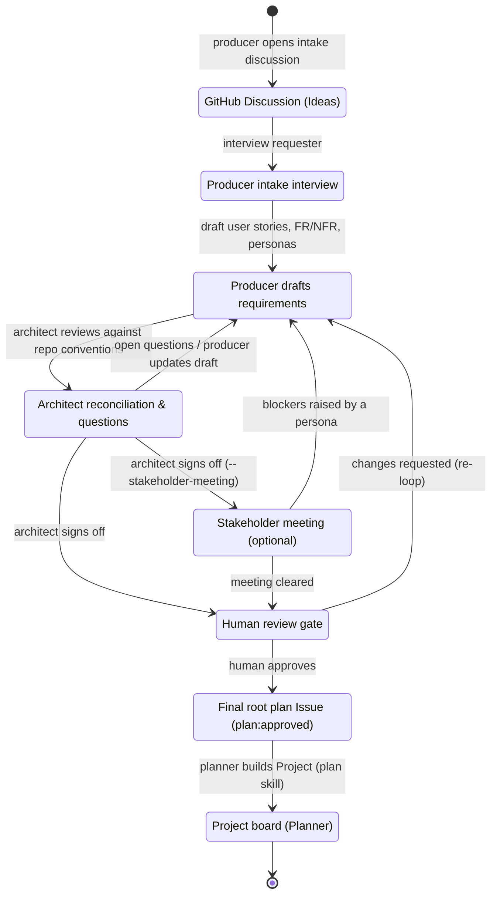
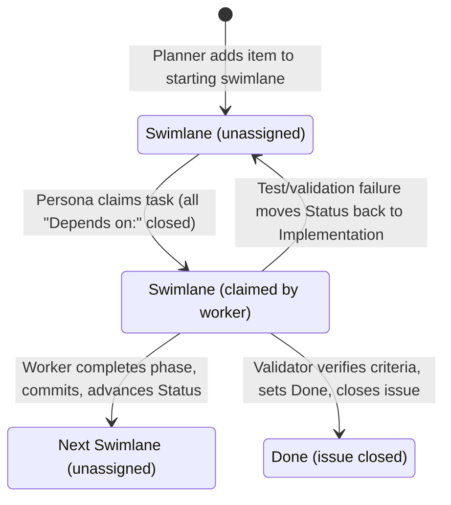

# project-manager — GitHub workflow conventions

Shared conventions all `project-manager` personas follow. Everything lives in GitHub — no external tracker. Personas interact via `gh` CLI (Bash): a **Discussion** for intake, plan drafting, and architect reconciliation; an **Issue** for the final approved root plan; and a **Project (v2)** board with **swimlanes** for task execution. `OWNER` below is this repo's org, `whale-net` (repo `whale-net/everything`).

**This is the canonical reference, not required reading for every dispatch.** Each persona's own agent file (`tools/project-manager/agents/*.md`) inlines the mechanics it needs for routine execution, so a subagent shouldn't normally need to open this doc. It exists for: (a) mechanics too infrequently exercised or too easy to typo to duplicate safely (e.g. the Project field GraphQL mutation), and (b) as the fallback when a persona hits a situation its own file doesn't cover. The inlined copies can drift from this doc over time — that's an accepted tradeoff for keeping routine dispatches cheap and unambiguous, not an invitation to let them diverge carelessly; when you touch a mechanic here, check whether the same mechanic is duplicated in an agent file and update both.

## Where things live

| What | Lives in | Created by |
|---|---|---|
| Intake, drafting & architect reconciliation | GitHub Discussion, category `Ideas` | producer & architect |
| Stakeholder meeting agenda, per-persona feedback & minutes | Own GitHub Discussion per round, category `Ideas` — linked back with one comment on the intake Discussion (or root Issue) | `stakeholder` personas & the `stakeholder-meeting` skill |
| Final root plan (requirements doc / spec of record) | GitHub Issue, labeled `plan:approved` | producer (after human review) |
| Task tracking & orchestration | GitHub Project (v2), one per approved plan | planner |
| Task issues (moving through swimlanes) | GitHub Issue, added as a Project item | planner / system-validator |
| Scope notes (deferred/cross-cutting decisions) | GitHub Issue, added as a Project item at `Status: Noted` | any persona; triaged by planner |

Discussions are where ideas are figured out and reconciled between producer, architect, and requester. Issues are where the final, approved requirements doc lives. Projects (and issues moving through swimlanes) are where implementation orchestration lives.

## Intake discussion & design reconciliation

The entire intake interview, specification drafting, and architect reconciliation happen inside a GitHub Discussion in category `Ideas`. This keeps iterative back-and-forth noise off the issue tracker, ensuring the root plan issue remains a clean, durable spec of record.


```mermaid
stateDiagram-v2
    discussion: GitHub Discussion (Ideas)
    intake: Producer intake interview
    draft: Producer drafts requirements
    reconcile: Architect reconciliation & questions
    meeting: Stakeholder meeting (optional)
    humanReview: Human review gate
    rootIssue: Final root plan Issue (plan:approved)
    projectBoard: Project board (Planner)

    [*] --> discussion: producer opens intake discussion
    discussion --> intake: interview requester
    intake --> draft: draft user stories, FR/NFR, personas
    draft --> reconcile: architect reviews against repo conventions
    reconcile --> draft: open questions / producer updates draft
    reconcile --> humanReview: architect signs off
    reconcile --> meeting: architect signs off (--stakeholder-meeting)
    meeting --> draft: blockers raised by a persona
    meeting --> humanReview: meeting cleared
    humanReview --> draft: changes requested (re-loop)
    humanReview --> rootIssue: human approves
    rootIssue --> projectBoard: planner builds Project (plan skill)
    projectBoard --> [*]
```

1. **Intake interview (Mode 0).** On the first question, producer opens the discussion:
   ```sh
   gh discussion create --title "Intake: <feature>" --category "Ideas" --body-file <tmpfile>
   ```
   Opening body contains the initial request and the first round of questions. As the interview proceeds, producer posts each Q&A round as a discussion comment (`gh discussion comment <discussion-url> --body-file <tmpfile>`). Producer covers:
   - **Who** — every persona/actor touching this (users, operators, services, schedulers).
   - **What** — user stories per persona: *"As a <persona>, I want <capability>, so that <benefit>."*
   - **Constraints** — performance, reliability, security, operability expectations.
   - **Boundaries** — what is explicitly out of scope.

2. **Draft the plan (Mode 1).** Producer writes up the draft specification as a comment in the discussion:
   - User stories
   - Functional requirements (FR)
   - Non-functional requirements (NFR)
   - Personas
   - Out of scope

3. **Architect reconciliation & QA (Mode 2).** Architect reads the draft in the discussion, reconciles against repo conventions (Bazel-first, cross-compilation in `docs/DOCKER.md`, SCD2 rules, existing libraries in `libs/`, domain `ARCHITECTURE.md`), and posts comments on the discussion containing:
   - **Open questions** — numbered blocking questions.
   - **Nitpicks** — non-blocking suggestions.
   Producer answers open questions in discussion comments and updates the draft. The loop repeats until architect posts an explicit sign-off comment (e.g. `Architect sign-off: approved`).

4. **Stakeholder meeting (optional).** Off by default; requested with `/project-manager:design ... --stakeholder-meeting`, or held later against the approved root issue. Every persona named in the spec gets one round of feedback before the human review gate — see § Stakeholder meeting below. Blockers return the draft to the producer/architect loop; guidance and non-blocking feedback do not gate the plan.

5. **Human review & issue creation (Mode 3).** Once architect has signed off — and the stakeholder meeting is cleared, if one was held — the draft is presented to the human reviewer via `/project-manager:review <discussion-url>`.
   - If changes requested: human leaves feedback, producer and architect re-loop in the discussion.
   - If approved: producer creates the root plan Issue representing the final requirements doc of record:
     ```sh
     gh issue create --title "Plan: <feature>" --label "plan:approved" --body-file <tmpfile>
     ```
     First line of the issue body is `Intake discussion: <discussion-url>`. Producer then leaves a closing comment on the discussion:
     ```sh
     gh discussion comment <discussion-url> --body "Approved root plan issue: <issue-url>"
     ```

## Stakeholder meeting

An optional round in which **every persona named in the plan's spec** reviews the draft from its own seat and reports back, before the plan is handed to the human review gate. Run by `/project-manager:stakeholder-meeting`, either automatically from `/project-manager:design --stakeholder-meeting` (target: the intake Discussion, after architect sign-off) or on demand against an approved root plan Issue.

It exists because architect reconciles the plan against the *codebase*; nobody otherwise reconciles it against the *people it is for*. A persona that cannot finish its job under the plan as written is a defect in the requirements, and it is cheaper to find before implementation.

**Mechanics.** Each round gets its own GitHub Discussion (category `Ideas`), so the meeting's agenda, per-persona feedback, and minutes never accumulate on the target — the target only ever gains one link comment per round. No new issue kinds, no Project items.

| Artifact | Posted by | Lives in | Title |
|---|---|---|---|
| Meeting discussion | the skill | new Discussion, category `Ideas` | `Stakeholder meeting round <N>: <feature>` — body is the agenda (personas attending, spec revision under review, response format) |
| Link comment | the skill | the target (Discussion or root Issue) | `Stakeholder meeting round <N>: <meeting-discussion-url>` |
| Per-persona feedback | one `stakeholder` subagent per persona | the meeting discussion | `Stakeholder feedback — <persona> (round <N>)` |
| Minutes | the skill | the meeting discussion | `Stakeholder meeting minutes (round <N>)` |

Round `N` is `1 +` the count of existing `Stakeholder meeting round <N>: <url>` link comments on the target. Stakeholders still read the spec from the target (unchanged), but post their one feedback comment to the meeting discussion, with three sections:

- **Guidance** — non-binding direction from that persona's world. No reply required.
- **Feedback** — concrete non-blocking improvements. Producer folds them in, defers them with a reason, or records them under **Out of scope**.
- **Blockers** — numbered; the persona cannot do its job as written. Each states the FR/NFR/story it attaches to, what breaks, and the outcome that resolves it. A stakeholder with none writes the literal line `Blockers: none`.

Minutes deduplicate blockers across personas and number them `SB-<round>.<n>` (e.g. `SB-2.1`), and end with exactly one of:

```
Stakeholder meeting: cleared
Stakeholder meeting: blocked (<k> blockers)
```

**Routing.** `cleared` → hand off to `/project-manager:review`. `blocked` → producer (Mode 2) reads the consolidated blockers from the meeting discussion's minutes comment, answers each `SB-<round>.<n>` and updates the draft in the target discussion, architect re-reconciles and re-signs off there, then the next meeting round runs (a fresh meeting Discussion). Cap at 2 rounds from `/project-manager:design` (`--stakeholder-rounds`), 3 when the skill is invoked directly; past the cap, the standing disagreement goes to the human rather than looping. If the target is an already-approved root Issue, the spec of record is never edited silently — producer amends the issue body only after the user confirms, and posts `Amended after stakeholder meeting round <N>: <summary>` as a comment on the root issue.

**Boundaries.** Stakeholders represent one persona each and never speak for another; they do not propose implementations, edit requirements, create task issues, or gate the plan — only the human review gate approves. Blockers change the plan; they never become task issues.

## Project setup

Once the root issue is created and labeled `plan:approved`, `/project-manager:plan` dispatches planner to create the plan's Project board:

1. **Idempotency check first.** `gh issue view <root-issue-number> --comments` — if a prior comment contains `Project board: <url>`, reuse that project number.
2. Create it: `gh project create --owner whale-net --title "Plan: <feature title> (#<n>)" --format json` — capture `.number`.
3. Link to repo: `gh project link <number> --owner whale-net --repo whale-net/everything`.
4. Repurpose the built-in `Status` field to the plan's swimlanes via GraphQL:
   ```sh
   FIELD_ID=$(gh project field-list <number> --owner whale-net --format json \
     | jq -r '.fields[] | select(.name=="Status") | .id')
   gh api graphql -f query='
     mutation($fieldId: ID!) {
       updateProjectV2Field(input: {
         fieldId: $fieldId,
         singleSelectOptions: [
           {name: "Scaffold", color: GRAY, description: "Scaffolding & groundwork"},
           {name: "Implementation", color: BLUE, description: "Core implementation"},
           {name: "Testing", color: YELLOW, description: "Test coverage & red/green verification"},
           {name: "Validation", color: ORANGE, description: "Acceptance criteria validation"},
           {name: "Done", color: GREEN, description: "Completed & closed"},
           {name: "Noted", color: PURPLE, description: "Scope note: unclassified"},
           {name: "Carry-over", color: PINK, description: "Scope note: cross-cutting"},
           {name: "Deferred", color: RED, description: "Scope note: plan-specific cut"}
         ]
       }) { projectV2Field { ... on ProjectV2SingleSelectField { id name options { id name } } } }
     }' -f fieldId="$FIELD_ID"
   ```
5. Post `gh issue comment <root-issue-number> --body "Project board: <project-url>"` on the root issue.

## Task issues & swimlane progression

Tasks represent cohesive units of work (features, components, schema migrations) and **progress through swimlanes**:

```
[Scaffold] ──▶ [Implementation] ──▶ [Testing] ──▶ [Validation] ──▶ [Done (Closed)]
```

Tasks move across swimlanes operated by specialized personas:
- **`Scaffold`** (worker): Skeletons, BUILD.bazel files, proto definitions, migrations, initial interfaces.
- **`Implementation`** (worker): Business logic, API handlers, internal services, component wiring.
- **`Testing`** (worker): Unit/integration tests with red/green verification discipline.
- **`Validation`** (validator): Read-only check against acceptance criteria. Moves to `Done` and closes the issue.
- **`Done`**: Task completed and closed.

Tasks that do not need certain swimlanes (e.g. docs-only tasks or pure refactors) start at or skip to the appropriate swimlane.

### Creating task issues

Planner creates one Issue per unit of work with clear criteria across all relevant phases:

```sh
gh issue create --title "<task title>" --body-file <tmpfile>
gh project item-add <number> --owner whale-net --url <issue-url>
gh project item-edit <number> --owner whale-net --url <issue-url> --field Status --value "Scaffold"
```

Each issue body must contain:
- `Part of #<root-issue-number>`
- `Depends on: #<n>, #<n>` (dependencies on other task issues being `Done`; omit line if none)
- Scope and acceptance criteria for scaffold, implementation, test cases, and validation
- File paths, target names, and interfaces

## Worker lifecycle (worker / validator)

This section defines the worker lifecycle across swimlanes:


```mermaid
stateDiagram-v2
    unassigned: Swimlane (unassigned)
    claimed: Swimlane (claimed by worker)
    nextLane: Next Swimlane (unassigned)
    done: Done (issue closed)

    [*] --> unassigned: Planner adds item to starting swimlane
    unassigned --> claimed: Persona claims task (all "Depends on:" closed)
    claimed --> nextLane: Worker completes phase, commits, advances Status
    claimed --> done: Validator verifies criteria, sets Done, closes issue
    claimed --> unassigned: Test/validation failure moves Status back to Implementation
```

### 1. Find work
Query unassigned items in the active swimlane for the plan:

```sh
gh project item-list <number> --owner whale-net --query "status:<Swimlane> no:assignee" --format json \
  | jq -r '.items[] | select(.content.body | test("Part of #<root>([^0-9]|$)")) | .content.number'
```

Confirm readiness: every issue in `Depends on:` must be in `state: CLOSED`:
```sh
gh issue view <n> --json body
# extract "Depends on: #a, #b", then check each:
gh issue view <dep> --json state   # must be "CLOSED"
```

### 2. Claim task
```sh
gh issue edit <n> --add-assignee @me
```

### 3. Execute phase work & commit
- **Scaffold:** Set up targets, skeletons, migrations. Run `bazel build` sanity check.
  Commit: `git add -A && git commit -m "scaffold: <summary>\n\nPart of #<root>"`.
- **Implementation:** Implement features, business logic. Run `bazel build`.
  Commit: `git add -A && git commit -m "feat: <summary>\n\nPart of #<root>"`.
- **Testing:** Write and run tests (`bazel test`). Verify red/green (break behavior, observe red test, revert to green).
  Commit: `git add -A && git commit -m "test: <summary>\n\nPart of #<root>"`.
- **Validation (Validator):** Read-only check of acceptance criteria against code and tests. No commits.

### 4. Advance swimlane or finish
- **Worker in `Scaffold`:** Move to `Implementation` and release assignment:
  ```sh
  gh issue comment <n> --body "Scaffold complete: <summary>"
  gh project item-edit <number> --owner whale-net --url <issue-url> --field Status --value "Implementation"
  gh issue edit <n> --remove-assignee @me
  ```
- **Worker in `Implementation`:** Move to `Testing` and release assignment:
  ```sh
  gh issue comment <n> --body "Implementation complete: <summary>"
  gh project item-edit <number> --owner whale-net --url <issue-url> --field Status --value "Testing"
  gh issue edit <n> --remove-assignee @me
  ```
- **Worker in `Testing`:**
  - If tests pass: move to `Validation` and release assignment:
    ```sh
    gh issue comment <n> --body "Testing complete: verified red/green (<discipline note>)"
    gh project item-edit <number> --owner whale-net --url <issue-url> --field Status --value "Validation"
    gh issue edit <n> --remove-assignee @me
    ```
  - If failure is due to implementation bug: move back to `Implementation` with defect details:
    ```sh
    gh issue comment <n> --body "Test failed on implementation: <defect details>"
    gh project item-edit <number> --owner whale-net --url <issue-url> --field Status --value "Implementation"
    gh issue edit <n> --remove-assignee @me
    ```
- **Validator in `Validation`:**
  - If all acceptance criteria hold:
    ```sh
    gh issue close <n> --comment "Validated acceptance criteria: <summary>"
    gh project item-edit <number> --owner whale-net --url <issue-url> --field Status --value "Done"
    ```
  - If a criterion fails:
    ```sh
    gh issue comment <n> --body "Validation failed: <details>"
    gh project item-edit <number> --owner whale-net --url <issue-url> --field Status --value "Implementation"
    gh issue edit <n> --remove-assignee @me
    ```

## Git hygiene

Task work is tracked with [`gh stack`](../../.claude/skills/gh-stack/SKILL.md) — each task issue gets its own branch and, once pushed, its own small reviewable PR, instead of every task piling commits onto one shared branch. Only `/project-manager:implement` (and `/project-manager:validate`, for the final integration branch) run `gh stack`/branch-management commands; `worker` and `validator` receive an already-created worktree and branch, and never touch git branch/stack state themselves — this keeps `gh stack` operations single-threaded even though multiple subagents run concurrently (its stack file is protected by a lock that times out after 5s — see gh-stack skill § Exit codes, code 8 — concurrent callers would just fight it).

**Division of responsibility.** The orchestrator (`implement`/`validate`) owns every step below end to end: creating branches and worktrees, dispatching worker/validator subagents into them, resolving any merge conflict that comes up while doing so, and creating/refreshing each task's PR via `gh stack submit --auto` (step 6). Worker and validator subagents only ever write code inside the worktree path they're handed — they never run `git merge`, `gh stack`, or open a PR themselves. When a conflict is small (a handful of hunks, mechanically resolvable), the orchestrator resolves it inline and continues. When a conflict is large or semantically ambiguous (overlapping logic from two different tasks, unclear which side should win), the orchestrator dispatches an ad-hoc `general-purpose` subagent scoped to just that one merge — hand it the two branch tips, the conflicting files, and both tasks' issue descriptions for context — rather than resolving it blind or stalling the whole batch on it.

1. **Prerequisites**, once per session:
   ```sh
   gh extension list | grep -q github/gh-stack || gh extension install github/gh-stack
   git config rerere.enabled true
   git config remote.pushDefault origin
   ```

2. **Branch naming:**
   ```
   pm[<attempt>]-<root-issue-number>/<task-issue-number>-<slug>
   ```
   - `pm` prefix marks every project-manager-owned branch — `git branch --list 'pm*'` (add `-r`, or `git ls-remote --heads origin 'pm*'`, for the remote copies) finds every in-flight or abandoned task branch across every plan with no other state needed. This is what makes recovering an interrupted or crashed session possible: never use a non-`pm`-prefixed name for task work.
   - `<slug>` is a short kebab-case rendering of the task issue's title (3-5 words, e.g. `add-auth-endpoint`) — derived the same deterministic way every time it's needed from the issue title, never invented fresh or persisted anywhere separately, so any phase can recompute a task's exact branch name on its own.
   - `<attempt>` is omitted on a task's first branch. **Before creating any task's branch, always check for an existing `pm*-<root-issue-number>/<task-issue-number>-*` branch first** (local, then remote) and reuse it if the task is already mid-flight — this single lookup is what lets later phases (and a resumed session) find the branch a prior phase already created, slug and all. Only mint a new branch, with the next unused `<attempt>` number (`pm2-`, `pm3-`, ...), when the existing one must be abandoned outright — an irrecoverable conflict, or a validation failure serious enough that the work should be redone rather than patched. Never delete and recreate the same branch name; leaving the abandoned attempt in place keeps it inspectable.
   - Example: `pm-123/456-add-auth-endpoint` (plan issue #123, task issue #456, first attempt); a forced redo becomes `pm2-123/456-add-auth-endpoint`.

3. **Creating a task's branch** (only on the first phase dispatched for that task, after the lookup above turns up nothing — later phases reuse the branch already created):
   ```sh
   git fetch origin main
   gh stack init --base <parent> pm-<root-issue-number>/<task-issue-number>-<slug>
   ```
   `<parent>` is:
   - `main`, if none of the task's `Depends on:` issues have an open branch yet.
   - That dependency's branch (`pm-<root-issue-number>/<dep-issue-number>-<dep-slug>`), if exactly one does.
   - Any one dependency's branch, if more than one does — then also pull in the rest before dispatching the worker: `git merge --no-edit pm-<root-issue-number>/<other-dep-issue-number>-<other-dep-slug>` for each additional dependency. If this merge conflicts, resolve it per the division of responsibility above before dispatching the worker — an unresolved conflict must never be handed to a worker to sort out.

   `gh stack init --base <branch>` accepts any branch as trunk, not just the default branch, so this works whether `<parent>` is `main` or another task's still-open branch. Each task's branch becomes its own single-branch stack chained onto its dependency, rather than literally appending to the dependency's stack object via `gh stack add` — which requires being on the topmost branch of that stack, and can't handle a dependency that has more than one dependent (`gh stack` stacks are strictly linear; see its skill § Known limitations).

4. **Isolate the work.** `gh stack init` (and checking out a dependency branch) leaves that branch checked out in the shared worktree — detach before handing off, so it's free for a dedicated worktree:
   ```sh
   git checkout --detach HEAD
   git worktree add .pm-worktrees/<task-issue-number> pm-<root-issue-number>/<task-issue-number>-<slug>
   ```
   Dispatch the worker/validator with this worktree path — all its `git`, `bazel`, and file-edit work happens there, never in the shared checkout.

5. **Per-phase commits** happen inside the worktree exactly as described in § Worker lifecycle below (`scaffold:`, `feat:`, `test:` commits on the task's own branch).

6. **After a subagent finishes:**
   ```sh
   git worktree remove .pm-worktrees/<task-issue-number>
   git checkout pm-<root-issue-number>/<task-issue-number>-<slug>
   gh stack submit --auto
   git checkout --detach HEAD
   ```
   `submit` is idempotent — safe to run after every phase, not just once. It pushes and opens (or refreshes) the task's draft PR. This is the orchestrator's sole PR-creation path — no other persona opens a PR directly.

   **PR content.** `submit --auto` generates the title and body from commit messages, which is rarely descriptive enough on its own (gh-stack skill § PR title auto-generation) — a task branch usually carries multiple phase commits (`scaffold:`, `feat:`, `test:`), which collapses the auto title down to just the humanized branch name. The first time `submit` creates a task's PR (not on later idempotent re-submits), immediately follow up with `gh pr edit <number> --title "<title>" --body "<body>"`:
   - **Title:** the task issue's own title verbatim, or a short imperative rewording of it — never the raw commit subject or humanized branch name.
   - **Body:** a `Task: #<task-issue-number>` line (deliberately not a closing keyword like `Closes #` — the validator already closes the task issue directly in § Worker lifecycle step 4 ("Validator in `Validation`"), well before the PR is merged), followed by 2-3 sentences of context drawn from the issue: what the task does and why. Not a restatement of the diff.

7. **Whole-system validation.** system-validator needs one local ref containing every task's work merged together, not N separate branch tips. `/project-manager:validate` builds this once, locally, right before dispatching system-validator, and never pushes it:
   ```sh
   git branch -D pm-<root-issue-number>-integration 2>/dev/null
   git checkout main && git pull
   git checkout -b pm-<root-issue-number>-integration
   for tip in <topmost active branch of every task on this plan>; do
     git merge --no-edit "$tip"
   done
   ```
   A conflict here is real cross-task integration work — resolve it and re-run; it doesn't affect the individual task PRs.

8. **Closing out.** The deliverable is the stack of small PRs, not one big PR. Once validation passes, `/project-manager:validate` runs `gh stack submit --auto` once more per task branch to make sure every one has an open PR, then posts `gh issue comment <root-issue-number> --body "PRs: <url>, <url>, ..."` on the root issue, listing every task's PR (collected via `gh stack view --json` after checking out each branch, or from the URLs already gathered in step 6 during implementation).

## System validation

After all task issues on the Project board reach `Done`, **system-validator** runs the system end-to-end in Tilt and grades it against the root plan's acceptance criteria.
- **Pass:** Opens draft PR against `main`.
- **Findings:** Files finding issues added to the Project at `Status: Validation` with `from:system-validator`. **Planner** triages findings into new task issues starting in `Scaffold` or `Implementation`, and closes the finding issue once follow-up tasks are linked.

## Scope notes

Any persona noticing scope outside its issue files a scope note issue added to the Project at `Status: Noted` with `from:<persona>` and why it is out of scope.
- **Triage (Planner):** Planner reviews `Status: Noted` items and classifies each as `Carry-over` (cross-cutting), `Deferred` (plan-specific scope cut), or closes it if not worth tracking.
- **Actioning:** When planner schedules a `Carry-over`/`Deferred` note, it creates real task issues on the board and closes the note with `Status: Done`.

## Model tiers

| Persona | Model | Why |
|---|---|---|
| producer, architect, planner | `opus` | Deep reasoning for requirements gathering, architecture reconciliation, and task breakdown |
| stakeholder | `sonnet` | Bounded single-persona critique of an existing draft; runs once per persona in parallel, so cost multiplies |
| worker, validator | `haiku` | Fast, cost-efficient execution of scoped swimlane tasks |
| system-validator | `opus` (effort: max) | Comprehensive whole-system validation in running environment |
