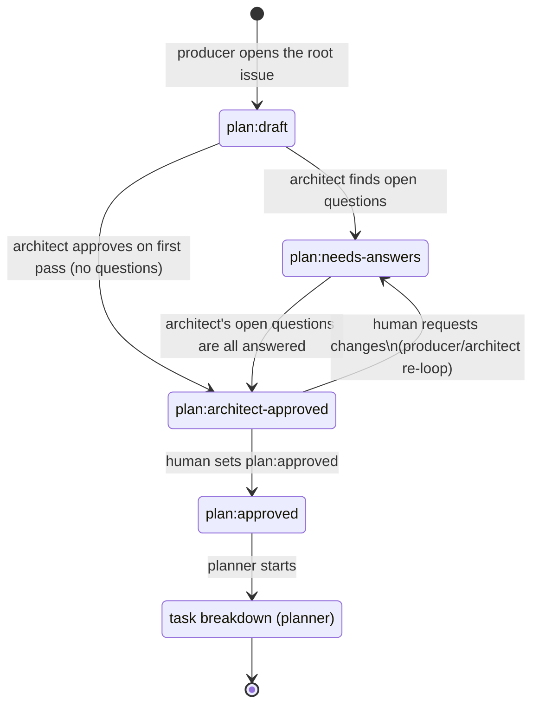
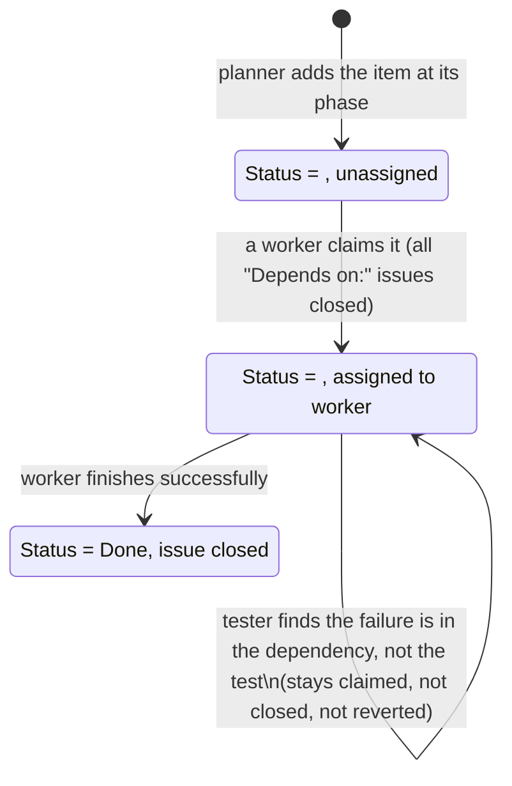

# project-manager — GitHub workflow conventions

Shared conventions all `project-manager` personas follow. Everything lives in GitHub — no external tracker. Personas interact via `gh` CLI (Bash): Issues for the root plan, a **Discussion** for intake, and a **Project (v2)** board for task tracking. `OWNER` below is this repo's org, `whale-net` (repo `whale-net/everything`).

## Where things live

| What | Lives in | Created by |
|---|---|---|
| Intake interview | GitHub Discussion, category `Ideas` | producer |
| Root plan (FR/NFR, personas, lifecycle) | GitHub Issue, `plan:*` labels | producer |
| Task tracking (phase, claim, done) | GitHub Project (v2), one per approved plan | planner |
| Task issues (scaffold/implementation/testing/validation/findings) | GitHub Issue, added as a Project item | planner / system-validator |

Labels (`plan:*`) still gate the root-plan review lifecycle — that's a human approval gate, not a phase pipeline, and stays as-is. Everything downstream of `plan:approved` (task phase, claim state, completion) is tracked on the Project board instead of `phase:*`/`status:*` labels.

## Intake discussion

Before a root plan issue exists, producer's Mode 0 interview happens as a GitHub Discussion, category `Ideas`, so the requirements-gathering conversation has a durable, linkable record independent of chat history.

1. On the first question, producer opens the discussion: `gh discussion create --title "Intake: <feature>" --category "Ideas" --body-file <tmpfile>` (opening body: the one-line request as given, plus the first round of questions).
2. As the interview proceeds turn by turn, producer posts each round (question and, once given, the answer) as a comment: `gh discussion comment <discussion-url> --body-file <tmpfile>`. This mirrors the live conversation — it does not replace conducting the interview directly with the requester.
3. When producer writes the root plan issue (Mode 1), the issue body's first line is `Intake discussion: <discussion-url>`, and producer posts a closing comment on the discussion linking back: `gh discussion comment <discussion-url> --body "Root plan: <issue-url>"`.

Follow-up rounds after the root issue exists (architect's open questions, human review feedback) stay as Issue comments per the root plan lifecycle below — only the initial intake interview lives in Discussions.

## Root plan lifecycle


```mermaid
stateDiagram-v2
    draft: plan:draft
    needsAnswers: plan:needs-answers
    architectApproved: plan:architect-approved
    approved: plan:approved
    breakdown: task breakdown (planner)

    [*] --> draft: producer opens the root issue
    draft --> needsAnswers: architect finds open questions
    draft --> architectApproved: architect approves on first pass (no questions)
    needsAnswers --> architectApproved: architect's open questions are all answered
    architectApproved --> approved: human sets plan:approved
    architectApproved --> needsAnswers: human requests changes\n(producer/architect re-loop)
    approved --> breakdown: planner starts
    breakdown --> [*]
```

While an issue sits at `plan:needs-answers`, producer and architect iterate purely via comments (`gh issue comment`) — the label does not change on every round, only when architect either raises a new open question (stays `plan:needs-answers`) or runs out of them (moves to `plan:architect-approved`).

| Transition | Trigger | Actor | Precondition | Label command |
|---|---|---|---|---|
| `[*] → plan:draft` | New feature request (after intake discussion) | producer | none | `gh issue create --title "Plan: <feature>" --label "plan:draft" --body-file <tmpfile>` |
| `plan:draft → plan:needs-answers` | Reconciliation finds ≥1 open question | architect | none | `gh issue edit <n> --add-label "plan:needs-answers" --remove-label "plan:draft"` |
| `plan:draft → plan:architect-approved` | Reconciliation finds 0 open questions (first pass) | architect | none | `gh issue edit <n> --add-label "plan:architect-approved" --remove-label "plan:draft"` |
| `plan:needs-answers → plan:architect-approved` | All of architect's numbered questions have been answered | architect | producer has replied to every open question | `gh issue edit <n> --add-label "plan:architect-approved" --remove-label "plan:needs-answers"` |
| `plan:architect-approved → plan:approved` | Human reviews and accepts | **human only** | plan reconciled, no open questions | `gh issue edit <n> --add-label "plan:approved" --remove-label "plan:architect-approved"` |
| `plan:architect-approved → plan:needs-answers` | Human requests changes | **human only** | human leaves feedback as a comment | `gh issue edit <n> --add-label "plan:needs-answers" --remove-label "plan:architect-approved"`, then producer/architect re-loop |
| `plan:approved → (task breakdown)` | Planner invoked | planner | `plan:approved` is set (not just `plan:architect-approved`) | planner begins creating the Project and task issues |

No persona ever adds or removes `plan:approved` — that label is set by a human only. Planner and every other persona must treat `plan:architect-approved` as *not yet* actionable.

## Project setup

Once the root issue is `plan:approved`, planner creates the plan's Project before creating any task issues:

1. **Idempotency check first.** `gh issue view <n> --comments` — if a prior comment contains `Project board: <url>`, the project already exists; extract its number from the URL and skip to step 5.
2. Create it: `gh project create --owner whale-net --title "Plan: <feature title> (#<n>)" --format json` — capture `.number`.
3. Link it to the repo so issues from this repo can be added: `gh project link <number> --owner whale-net --repo whale-net/everything`.
4. Every new project ships a built-in `Status` field (`Todo`/`In Progress`/`Done`) that cannot be deleted or duplicated by name — repurpose its options to the plan's phases via GraphQL (there is no `gh project field-*` flag for editing existing options):

   ```sh
   FIELD_ID=$(gh project field-list <number> --owner whale-net --format json \
     | jq -r '.fields[] | select(.name=="Status") | .id')
   gh api graphql -f query='
     mutation($fieldId: ID!) {
       updateProjectV2Field(input: {
         fieldId: $fieldId,
         singleSelectOptions: [
           {name: "Scaffold", color: GRAY, description: ""},
           {name: "Implementation", color: BLUE, description: ""},
           {name: "Testing", color: YELLOW, description: ""},
           {name: "Validation", color: ORANGE, description: ""},
           {name: "Done", color: GREEN, description: ""}
         ]
       }) { projectV2Field { ... on ProjectV2SingleSelectField { id name options { id name } } } }
     }' -f fieldId="$FIELD_ID"
   ```

5. Post `gh issue comment <n> --body "Project board: <project-url>"` on the root issue (skip if already posted, per step 1).

Phases run in order: `Scaffold` → `Implementation` → `Testing` → `Validation` → `Done`. `Done` is the only value that means closed/finished — the other phase values just say what kind of task an item is, not how far along it is.

## Task issues

Planner creates one Issue per unit of work (unchanged in shape) and adds it to the Project:

```sh
gh issue create --title "<phase>: <unit>" --body-file <tmpfile>
gh project item-add <number> --owner whale-net --url <issue-url>
gh project item-edit <number> --owner whale-net --url <issue-url> --field Status --value "<Phase>"
```

No `phase:*`/`status:*` labels — the item's `Status` value on the Project *is* the phase. Each issue body must still contain:

- `Part of #<root-issue-number>`
- `Depends on: #<n>, #<n>` (omit if none)
- Acceptance criteria

Create issues in dependency order (or two-pass: create all, then wire `Depends on:` bodies via `gh issue edit`). There is no separate "ready"/"blocked" value to set — readiness is always computed on demand from `Depends on:` (see below), never persisted.

## Worker lifecycle (worker / validator)

This section is the single canonical definition of the worker lifecycle — worker.md/validator.md link here rather than restating it, since they differ only in which `Status` phase they query and whether they touch files.


```mermaid
stateDiagram-v2
    phase: Status = <their phase>, unassigned
    claimed: Status = <their phase>, assigned to worker
    done: Status = Done, issue closed

    [*] --> phase: planner adds the item at its phase
    phase --> claimed: a worker claims it (all "Depends on:" issues closed)
    claimed --> done: worker finishes successfully
    claimed --> claimed: tester finds the failure is in the dependency, not the test\n(stays claimed, not closed, not reverted)
```

**Find work**, scoped to one plan's project:

```sh
gh project item-list <number> --owner whale-net --query "status:<Phase> no:assignee" --format json \
  | jq -r '.items[] | select(.content.body | test("Part of #<root>([^0-9]|$)")) | .content.number'
```

For each candidate, confirm readiness precisely — every issue in its `Depends on:` line must be closed (never trust `--search` on a literal `#<n>`; GitHub tokenizes it and can match numeric substrings like `#1` inside `#10`):

```sh
gh issue view <n> --json body,state
# extract the "Depends on: #a, #b" line, then for each:
gh issue view <dep> --json state   # must be "CLOSED" for every one
```

**Claim it:**

```sh
gh issue edit <n> --add-assignee @me
```

**Finish it:**

```sh
gh issue close <n> --comment "<summary>"
gh project item-edit <number> --owner whale-net --url <issue-url> --field Status --value "Done"
```

Unblocking dependents needs no action — the next worker's readiness check re-reads issue state live, so a dependent becomes pickable the instant its dependency issue closes. There is nothing to flip.

**Tester finds a bug in the dependency, not the test:** comment on both issues; do **not** close, do not touch `Status`, do not unassign.

## System validation

After all `Implementation` and `Testing` items under a root plan's Project are `Done`, **system-validator** runs the system end-to-end (Tilt) and grades it against the root plan's acceptance criteria — confirm readiness the same precise way as above (`gh project item-list ... --query "status:Implementation"` / `"status:Testing"` scoped to the plan must both come back empty before findings are trusted). Findings become new issues added to the same Project at `Status: Validation`, titled descriptively, containing `Part of #<root-issue-number>` and `from:system-validator` in the body (no labels needed — the Project item's presence + phase is the tracking). If a finding represents new work rather than a pass/fail note, **planner** converts it into properly sequenced task issues on the same Project — linked back to the finding for traceability, but never `Depends on:` the finding issue itself (a finding is a report, not a work product any worker closes). Planner then closes the finding issue and sets its item to `Status: Done` once its follow-ups are filed and linked — the one case where planner closes an issue itself.

## Model tiers

| Persona | Model | Why |
|---|---|---|
| producer, architect, planner | `opus` | Premium reasoning for requirements, design reconciliation, and dependency-aware sequencing |
| worker, validator | `haiku` | Cheap, small-context execution of a single well-scoped task issue |
| system-validator | `opus` (effort: max) | Expensive, holistic judgment call on whether the whole system actually works |
