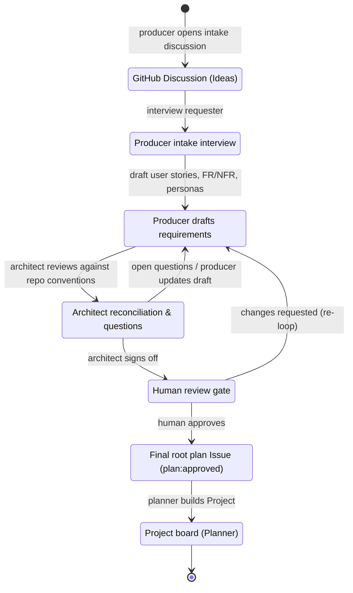
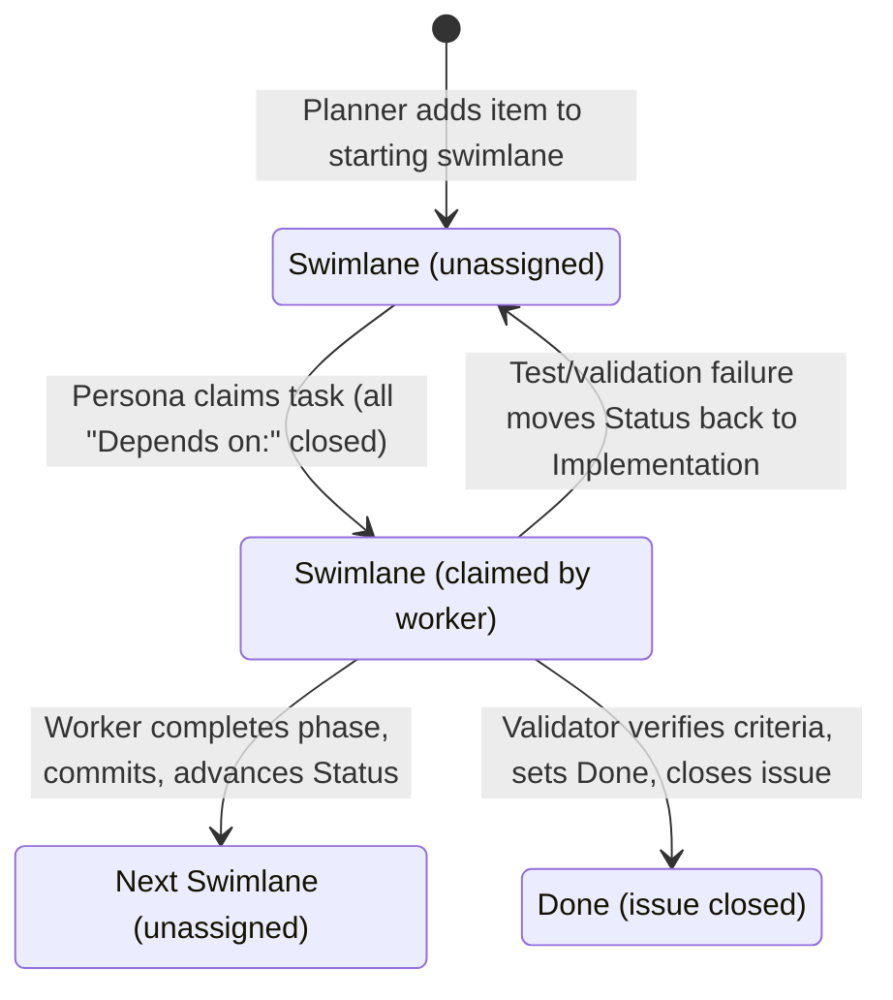

# project-manager — GitHub workflow conventions

Shared conventions all `project-manager` personas follow. Everything lives in GitHub — no external tracker. Personas interact via `gh` CLI (Bash): a **Discussion** for intake, plan drafting, and architect reconciliation; an **Issue** for the final approved root plan; and a **Project (v2)** board with **swimlanes** for task execution. `OWNER` below is this repo's org, `whale-net` (repo `whale-net/everything`).

**This is the canonical reference, not required reading for every dispatch.** Each persona's own agent file (`tools/project-manager/agents/*.md`) inlines the mechanics it needs for routine execution, so a subagent shouldn't normally need to open this doc. It exists for: (a) mechanics too infrequently exercised or too easy to typo to duplicate safely (e.g. the Project field GraphQL mutation), and (b) as the fallback when a persona hits a situation its own file doesn't cover. The inlined copies can drift from this doc over time — that's an accepted tradeoff for keeping routine dispatches cheap and unambiguous, not an invitation to let them diverge carelessly; when you touch a mechanic here, check whether the same mechanic is duplicated in an agent file and update both.

## Where things live

| What | Lives in | Created by |
|---|---|---|
| Intake, drafting & architect reconciliation | GitHub Discussion, category `Ideas` | producer & architect |
| Final root plan (requirements doc / spec of record) | GitHub Issue, labeled `plan:approved` | producer (after human review) |
| Task tracking & orchestration | GitHub Project (v2), one per approved plan | planner |
| Task issues (moving through swimlanes) | GitHub Issue, added as a Project item | planner / system-validator |
| Scope notes (deferred/cross-cutting decisions) | GitHub Issue, added as a Project item at `Status: Noted` | any persona; triaged by planner |

Discussions are where ideas are figured out and reconciled between producer, architect, and requester. Issues are where the final, approved requirements doc lives. Projects (and issues moving through swimlanes) are where implementation orchestration lives.

## Intake discussion & plan reconciliation

The entire intake interview, specification drafting, and architect reconciliation happen inside a GitHub Discussion in category `Ideas`. This keeps iterative back-and-forth noise off the issue tracker, ensuring the root plan issue remains a clean, durable spec of record.


```mermaid
stateDiagram-v2
    discussion: GitHub Discussion (Ideas)
    intake: Producer intake interview
    draft: Producer drafts requirements
    reconcile: Architect reconciliation & questions
    humanReview: Human review gate
    rootIssue: Final root plan Issue (plan:approved)
    projectBoard: Project board (Planner)

    [*] --> discussion: producer opens intake discussion
    discussion --> intake: interview requester
    intake --> draft: draft user stories, FR/NFR, personas
    draft --> reconcile: architect reviews against repo conventions
    reconcile --> draft: open questions / producer updates draft
    reconcile --> humanReview: architect signs off
    humanReview --> draft: changes requested (re-loop)
    humanReview --> rootIssue: human approves
    rootIssue --> projectBoard: planner builds Project
    projectBoard --> [*]
```

1. **Intake interview (Mode 0).** On the first question, producer opens the discussion:
   ```sh
   gh discussion create --title "Intake: <feature>" --category "Ideas" --body-file <tmpfile>
   ```
   Opening body contains the initial request and the first round of questions. As the interview proceeds, producer posts each Q&A round as a discussion comment (`gh discussion comment <discussion-url> --body-file <tmpfile>`). Producer covers:
   - **Who** — every persona/actor touching this (users, operators, services, schedulers).
   - **What** — user stories per persona: *"As a <persona>, I want <capability>, so that <benefit>."*
   - **Constraints** — performance, reliability, security, operability expectations.
   - **Boundaries** — what is explicitly out of scope.

2. **Draft the plan (Mode 1).** Producer writes up the draft specification as a comment in the discussion:
   - User stories
   - Functional requirements (FR)
   - Non-functional requirements (NFR)
   - Personas
   - Out of scope

3. **Architect reconciliation & QA (Mode 2).** Architect reads the draft in the discussion, reconciles against repo conventions (Bazel-first, cross-compilation in `docs/DOCKER.md`, SCD2 rules, existing libraries in `libs/`, domain `ARCHITECTURE.md`), and posts comments on the discussion containing:
   - **Open questions** — numbered blocking questions.
   - **Nitpicks** — non-blocking suggestions.
   Producer answers open questions in discussion comments and updates the draft. The loop repeats until architect posts an explicit sign-off comment (e.g. `Architect sign-off: approved`).

4. **Human review & issue creation (Mode 3).** Once architect has signed off, the draft is presented to the human reviewer via `/project-manager:review <discussion-url>`.
   - If changes requested: human leaves feedback, producer and architect re-loop in the discussion.
   - If approved: producer creates the root plan Issue representing the final requirements doc of record:
     ```sh
     gh issue create --title "Plan: <feature>" --label "plan:approved" --body-file <tmpfile>
     ```
     First line of the issue body is `Intake discussion: <discussion-url>`. Producer then leaves a closing comment on the discussion:
     ```sh
     gh discussion comment <discussion-url> --body "Approved root plan issue: <issue-url>"
     ```

## Project setup

Once the root issue is created and labeled `plan:approved`, planner creates the plan's Project board:

1. **Idempotency check first.** `gh issue view <root-issue-number> --comments` — if a prior comment contains `Project board: <url>`, reuse that project number.
2. Create it: `gh project create --owner whale-net --title "Plan: <feature title> (#<n>)" --format json` — capture `.number`.
3. Link to repo: `gh project link <number> --owner whale-net --repo whale-net/everything`.
4. Repurpose the built-in `Status` field to the plan's swimlanes via GraphQL:
   ```sh
   FIELD_ID=$(gh project field-list <number> --owner whale-net --format json \
     | jq -r '.fields[] | select(.name=="Status") | .id')
   gh api graphql -f query='
     mutation($fieldId: ID!) {
       updateProjectV2Field(input: {
         fieldId: $fieldId,
         singleSelectOptions: [
           {name: "Scaffold", color: GRAY, description: "Scaffolding & groundwork"},
           {name: "Implementation", color: BLUE, description: "Core implementation"},
           {name: "Testing", color: YELLOW, description: "Test coverage & red/green verification"},
           {name: "Validation", color: ORANGE, description: "Acceptance criteria validation"},
           {name: "Done", color: GREEN, description: "Completed & closed"},
           {name: "Noted", color: PURPLE, description: "Scope note: unclassified"},
           {name: "Carry-over", color: PINK, description: "Scope note: cross-cutting"},
           {name: "Deferred", color: RED, description: "Scope note: plan-specific cut"}
         ]
       }) { projectV2Field { ... on ProjectV2SingleSelectField { id name options { id name } } } }
     }' -f fieldId="$FIELD_ID"
   ```
5. Post `gh issue comment <root-issue-number> --body "Project board: <project-url>"` on the root issue.

## Task issues & swimlane progression

Tasks represent cohesive units of work (features, components, schema migrations) and **progress through swimlanes**:

```
[Scaffold] ──▶ [Implementation] ──▶ [Testing] ──▶ [Validation] ──▶ [Done (Closed)]
```

Tasks move across swimlanes operated by specialized personas:
- **`Scaffold`** (worker): Skeletons, BUILD.bazel files, proto definitions, migrations, initial interfaces.
- **`Implementation`** (worker): Business logic, API handlers, internal services, component wiring.
- **`Testing`** (worker): Unit/integration tests with red/green verification discipline.
- **`Validation`** (validator): Read-only check against acceptance criteria. Moves to `Done` and closes the issue.
- **`Done`**: Task completed and closed.

Tasks that do not need certain swimlanes (e.g. docs-only tasks or pure refactors) start at or skip to the appropriate swimlane.

### Creating task issues

Planner creates one Issue per unit of work with clear criteria across all relevant phases:

```sh
gh issue create --title "<task title>" --body-file <tmpfile>
gh project item-add <number> --owner whale-net --url <issue-url>
gh project item-edit <number> --owner whale-net --url <issue-url> --field Status --value "Scaffold"
```

Each issue body must contain:
- `Part of #<root-issue-number>`
- `Depends on: #<n>, #<n>` (dependencies on other task issues being `Done`; omit line if none)
- Scope and acceptance criteria for scaffold, implementation, test cases, and validation
- File paths, target names, and interfaces

## Worker lifecycle (worker / validator)

This section defines the worker lifecycle across swimlanes:


```mermaid
stateDiagram-v2
    unassigned: Swimlane (unassigned)
    claimed: Swimlane (claimed by worker)
    nextLane: Next Swimlane (unassigned)
    done: Done (issue closed)

    [*] --> unassigned: Planner adds item to starting swimlane
    unassigned --> claimed: Persona claims task (all "Depends on:" closed)
    claimed --> nextLane: Worker completes phase, commits, advances Status
    claimed --> done: Validator verifies criteria, sets Done, closes issue
    claimed --> unassigned: Test/validation failure moves Status back to Implementation
```

### 1. Find work
Query unassigned items in the active swimlane for the plan:

```sh
gh project item-list <number> --owner whale-net --query "status:<Swimlane> no:assignee" --format json \
  | jq -r '.items[] | select(.content.body | test("Part of #<root>([^0-9]|$)")) | .content.number'
```

Confirm readiness: every issue in `Depends on:` must be in `state: CLOSED`:
```sh
gh issue view <n> --json body
# extract "Depends on: #a, #b", then check each:
gh issue view <dep> --json state   # must be "CLOSED"
```

### 2. Claim task
```sh
gh issue edit <n> --add-assignee @me
```

### 3. Execute phase work & commit
- **Scaffold:** Set up targets, skeletons, migrations. Run `bazel build` sanity check.
  Commit: `git add -A && git commit -m "scaffold: <summary>\n\nPart of #<root>"`.
- **Implementation:** Implement features, business logic. Run `bazel build`.
  Commit: `git add -A && git commit -m "feat: <summary>\n\nPart of #<root>"`.
- **Testing:** Write and run tests (`bazel test`). Verify red/green (break behavior, observe red test, revert to green).
  Commit: `git add -A && git commit -m "test: <summary>\n\nPart of #<root>"`.
- **Validation (Validator):** Read-only check of acceptance criteria against code and tests. No commits.

### 4. Advance swimlane or finish
- **Worker in `Scaffold`:** Move to `Implementation` and release assignment:
  ```sh
  gh issue comment <n> --body "Scaffold complete: <summary>"
  gh project item-edit <number> --owner whale-net --url <issue-url> --field Status --value "Implementation"
  gh issue edit <n> --remove-assignee @me
  ```
- **Worker in `Implementation`:** Move to `Testing` and release assignment:
  ```sh
  gh issue comment <n> --body "Implementation complete: <summary>"
  gh project item-edit <number> --owner whale-net --url <issue-url> --field Status --value "Testing"
  gh issue edit <n> --remove-assignee @me
  ```
- **Worker in `Testing`:**
  - If tests pass: move to `Validation` and release assignment:
    ```sh
    gh issue comment <n> --body "Testing complete: verified red/green (<discipline note>)"
    gh project item-edit <number> --owner whale-net --url <issue-url> --field Status --value "Validation"
    gh issue edit <n> --remove-assignee @me
    ```
  - If failure is due to implementation bug: move back to `Implementation` with defect details:
    ```sh
    gh issue comment <n> --body "Test failed on implementation: <defect details>"
    gh project item-edit <number> --owner whale-net --url <issue-url> --field Status --value "Implementation"
    gh issue edit <n> --remove-assignee @me
    ```
- **Validator in `Validation`:**
  - If all acceptance criteria hold:
    ```sh
    gh issue close <n> --comment "Validated acceptance criteria: <summary>"
    gh project item-edit <number> --owner whale-net --url <issue-url> --field Status --value "Done"
    ```
  - If a criterion fails:
    ```sh
    gh issue comment <n> --body "Validation failed: <details>"
    gh project item-edit <number> --owner whale-net --url <issue-url> --field Status --value "Implementation"
    gh issue edit <n> --remove-assignee @me
    ```

## Git hygiene

All code-touching work for a plan happens on a shared plan branch (`plan/<root-issue-number>-<short-slug>`).

1. **Branch setup.** Before dispatching workers, `/project-manager:implement` checks out the plan branch:
   ```sh
   git fetch origin main
   git checkout plan/<root-issue-number>-<short-slug> 2>/dev/null || git checkout -b plan/<root-issue-number>-<short-slug> origin/main
   ```
2. **Per-phase commits.** Workers commit their changes at the end of each phase before advancing swimlanes (`Scaffold`, `Implementation`, `Testing`). Commits stay local until PR creation.
3. **PR creation.** Once `/project-manager:validate` confirms whole-system criteria pass in Tilt, it pushes the branch and creates a draft PR against `main`:
   ```sh
   git push -u origin plan/<root-issue-number>-<short-slug>
   gh pr create --draft --title "<root plan title> (#<root-issue-number>)" \
     --body "Closes #<root-issue-number>" --head plan/<root-issue-number>-<short-slug>
   ```
   Post `gh issue comment <root-issue-number> --body "PR: <pr-url>"` on the root issue.

## System validation

After all task issues on the Project board reach `Done`, **system-validator** runs the system end-to-end in Tilt and grades it against the root plan's acceptance criteria.
- **Pass:** Opens draft PR against `main`.
- **Findings:** Files finding issues added to the Project at `Status: Validation` with `from:system-validator`. **Planner** triages findings into new task issues starting in `Scaffold` or `Implementation`, and closes the finding issue once follow-up tasks are linked.

## Scope notes

Any persona noticing scope outside its issue files a scope note issue added to the Project at `Status: Noted` with `from:<persona>` and why it is out of scope.
- **Triage (Planner):** Planner reviews `Status: Noted` items and classifies each as `Carry-over` (cross-cutting), `Deferred` (plan-specific scope cut), or closes it if not worth tracking.
- **Actioning:** When planner schedules a `Carry-over`/`Deferred` note, it creates real task issues on the board and closes the note with `Status: Done`.

## Model tiers

| Persona | Model | Why |
|---|---|---|
| producer, architect, planner | `opus` | Deep reasoning for requirements gathering, architecture reconciliation, and task breakdown |
| worker, validator | `haiku` | Fast, cost-efficient execution of scoped swimlane tasks |
| system-validator | `opus` (effort: max) | Comprehensive whole-system validation in running environment |
