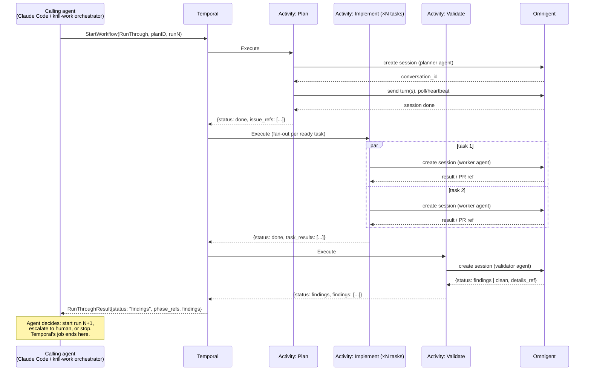
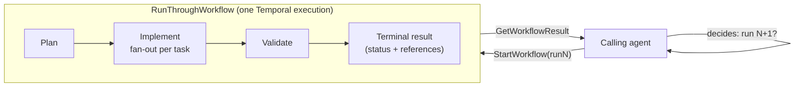
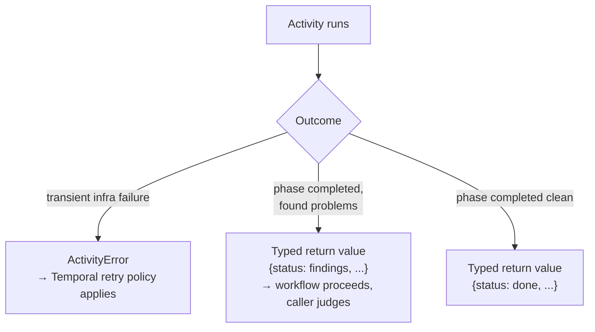

# POC: a Temporal "run-through" workflow over Omnigent sessions

**Status:** proposal / discussion draft. Not a product brief, not scoped
through `/project-manager:product` or `/project-manager:design` — this is a
POC write-up to get eyes on the idea before any of that ceremony. Nothing
here is committed or built.

## Problem

`krill-work:loop-plan-implement-validate` (forked from
`project-manager:loop-plan-implement-validate`, mechanics identical) drives a
plan through plan → implement → validate, looping implement↔validate up to
`--max-iterations` on findings, entirely as one long-running Claude Code
session dispatching fresh subagents for each phase. That session **is** the
orchestrator: its own process memory holds "which iteration are we on,"
"did implement finish," "should we retry." If that session dies mid-run, the
GitHub Project board is still there as an external checkpoint, but nothing
resumes the loop itself — a human (or a fresh session re-reading the board)
has to reconstruct where things stood.

Omnigent sessions have the same shape problem at a smaller scale: a
session's turn history lives in Omnigent, but nothing durably owns "what
should happen next across turns" except whatever process is driving it.

This doc sketches using Temporal for the piece that's actually mechanical —
"run phase A, then B fanned out per task, then C, in dependency order" — while
deliberately **not** trying to encode the judgment calls (is this validation
failure a real defect or noise? should we retry or escalate?) in workflow
code. Those stay with whatever agent is calling the workflow.

## Why not "the whole loop is one Temporal workflow"

The tempting version is a long-lived workflow with `implement`/`validate` as
a loop-back inside workflow code, similar to `whagent_net`'s `SessionWorkflow`
(one workflow per session, signal-per-turn, lives for the whole conversation —
see `whagent_net/ARCHITECTURE.md` § Session workflow). Two things make that a
worse first step here:

1. **It moves judgment into code.** "Is this validate failure worth another
   implement pass, or is the plan actually blocked?" is exactly the kind of
   call the current SKILL.md-driven loop leaves to an LLM reading the
   findings. Hard-coding that as workflow branch logic trades flexibility for
   reliability we don't need yet.
2. **It inherits `SessionWorkflow`'s hardest problem for free.** A long-lived,
   signal-per-turn workflow has to survive worker deploys across open runs,
   which is why `whagent_net` needs `workflow.GetVersion` discipline on every
   behavior-changing edit from day one (`ARCHITECTURE.md` § Workflow
   versioning, NFR1). A plan that runs for days would hit the same
   requirement immediately.

## Proposed shape: one workflow = one run-through

A **run-through** is one linear pass through a plan's phases — no loop-back
inside the workflow. The calling agent decides whether to start another
run-through.





No branch-back arrow inside the workflow box on purpose — another run-through
is a **new** workflow execution (`workflow ID = <plan-id>-run-<n>`), not a
loop iteration inside this one. That also sidesteps `GetVersion`/replay
concerns entirely: each execution is short-lived, start-to-finish, closer to
this repo's `app_registry` release/writeback/outbox workflows or ASS's
`ChannelSyncWorkflow` than to `whagent_net`'s `SessionWorkflow`.

## Design rules

**1. Business outcomes are return values, not Activity failures.**
A validate phase that finds real defects is a *successful* Activity
returning `{status: "findings", ...}` — not an error. If "validation found
bugs" throws, Temporal's own retry policy will silently retry it, which is
the opposite of what we want. Reserve real Activity errors for things
Temporal should mechanically retry (Omnigent host unreachable, RPC timeout).



**2. Reference, don't inline.** Following `whagent_net`'s activity payload
discipline (`ARCHITECTURE.md` § Activity payload discipline): Activities pass
`conversation_id`s, GH issue/PR numbers — never full transcripts or diffs —
across the workflow boundary. Temporal permanently records every
Activity input/output into workflow history; agent transcripts are large and
grow every turn.

**3. Terminal result is structured, not raw history.** The calling agent
reads `GetWorkflowResult`, not Temporal's internal event history. Something
like:

```json
{
  "run": "plan-2901-run-2",
  "status": "findings",
  "phases": {
    "plan":      { "status": "done",     "issue_refs": [2905, 2906] },
    "implement": { "status": "done",     "task_refs": [2905, 2906], "pr_refs": [3011, 3012] },
    "validate":  { "status": "findings", "session_ref": "conv_abc123", "findings": [ "..." ] }
  }
}
```

If the calling agent needs the gory details behind a finding, it follows
`session_ref` (`sys_session_get_history` equivalent) rather than Temporal
handing it a dump.

**4. Explicit host pinning for every Omnigent session an Activity creates.**
Omnigent has no cross-host auto-routing — `host_id` is either passed
explicitly on session create or you get whatever single-host default the
deployment has (see the session-lifecycle discussion this doc grew out of).
Activities should carry `host_id` as configuration, not assume it.

## What Temporal buys us here, concretely

- **Crash recovery for the mechanical part.** If the worker process dies
  mid-run-through, Temporal replays from history and resumes — no re-deriving
  "which tasks already got a PR" from the Project board by hand.
- **Visibility.** `tctl`/Temporal Web shows exactly which phase a run-through
  is in and what each Activity returned, instead of scrolling a Claude Code
  session's subagent tree.
- **Real fan-out semantics for implement.** Per-task Activities get their own
  retry/cancellation instead of "spawn subagents, hope they all report back."

## What stays exactly as it is today

- The plan/implement/validate **personas** — same prompts, same judgment,
  just invoked as Omnigent sessions instead of Claude Code subagents.
- The **loop decision** (retry, stop, escalate) — still an agent's call,
  informed by the structured result above.
- The **GitHub Project board** as source of truth for task/issue state.

## Open questions (not resolved by this doc)

- Does an Activity poll Omnigent session status, or is there a
  webhook/callback path worth using instead of polling-with-heartbeat?
- Where does the Temporal worker process live, and does it need its own
  Omnigent host registration distinct from whatever host(s) run the actual
  agent sessions it dispatches?
- Should `krill-work:loop-plan-implement-validate`'s `--max-iterations` cap
  become something the calling agent enforces, or a piece of state krill
  itself tracks per plan (krill already has claim/lease/attempt-cap machinery
  for its work axis — worth checking whether run-through count fits that
  model before inventing a new counter)?
- Nothing here is scoped against `whagent_net`'s actual milestone roadmap —
  if this moves forward, it should go through `/project-manager:design`
  against `whagent_net`'s `PRODUCT.md` like any other whagent-net capability.

## Non-goals for this POC

- Not proposing to change `whagent_net`'s `SessionWorkflow` — that stays as
  the pattern for whagent-net's own model-calling sessions. This is a
  parallel, much smaller workflow shape for a different job (mechanical
  phase sequencing, not per-turn LLM orchestration).
- Not proposing to remove the LLM-driven loop today — this is a "could we,"
  not a migration plan.
